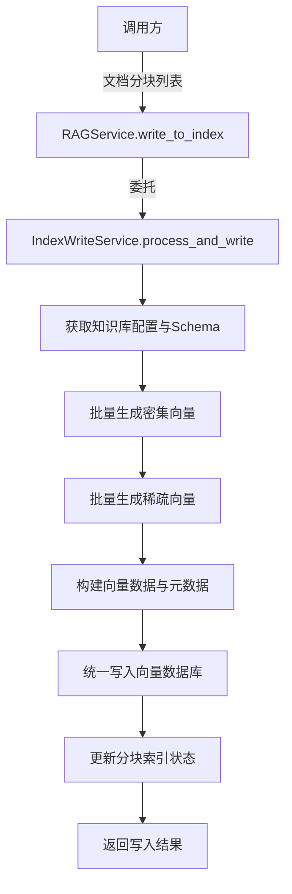
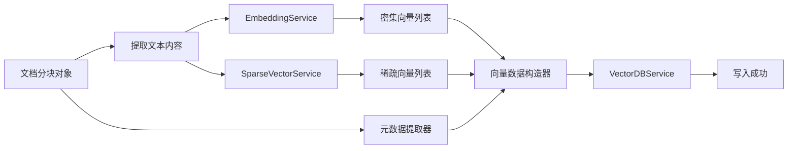
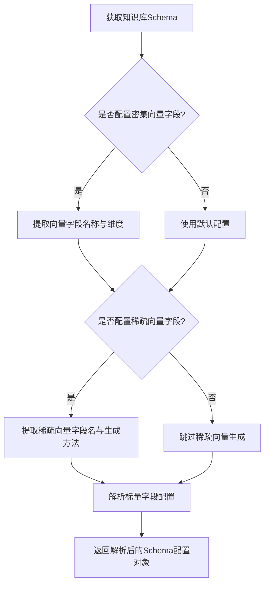
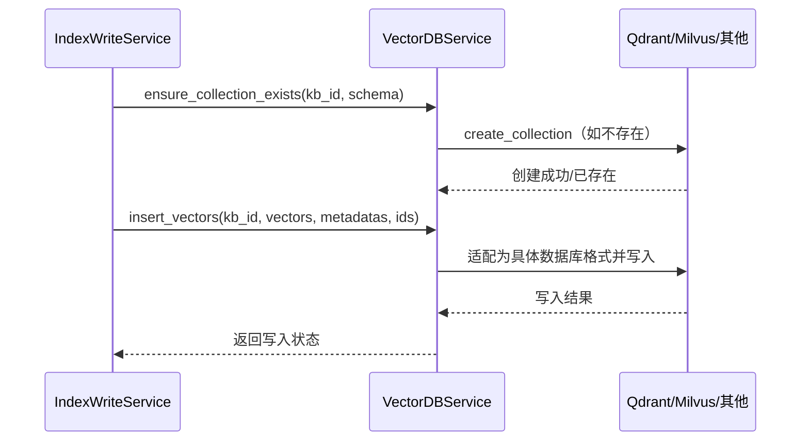
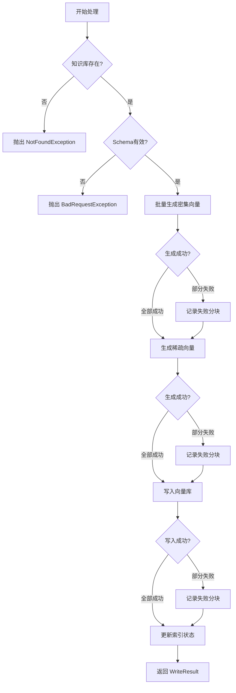
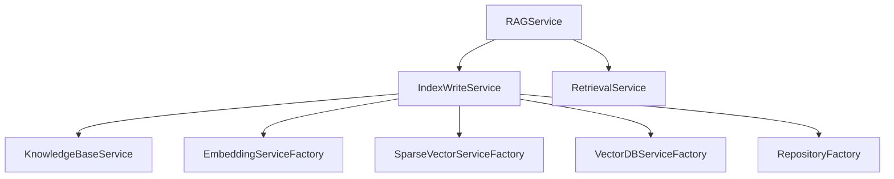

# 服务层优化设计文档 - 向量知识库写入流程重构

## 一、背景与问题分析

### 1.1 现状问题

当前在 `TestSetImportService._process_imported_document` 方法（第381-615行）中存在以下问题：

**问题1：职责过重，违反单一职责原则**
- 单个方法承担了文档分块、向量嵌入、稀疏向量生成、元数据构建、向量库写入、状态更新等多项职责
- 代码超过200行，可读性和可维护性差
- 业务逻辑与底层实现细节高度耦合

**问题2：代码重复，缺乏复用性**
- 类似的向量库写入逻辑在 `DocumentService` 中也需要实现
- 未来其他业务场景（如批量导入、增量更新）需要重复编写相同逻辑
- 导致多处代码维护成本高，容易出现不一致

**问题3：抽象层级不够，耦合度高**
- 调用方需要了解 Qdrant 的具体格式（indices/values）
- 需要处理稀疏向量字段名称、密集向量字段名称等底层细节
- 直接操作 VectorDBService、SparseVectorService 等底层服务
- Schema 字段解析逻辑散落在业务代码中

### 1.2 重构目标

将向量库写入流程标准化并提升至更高的抽象层级，通过 **RAGService** 统一暴露三大核心能力：

- **写入能力**：将文档片段写入向量知识库
- **检索能力**：从向量知识库检索相关内容
- **生成能力**：基于检索结果生成答案

## 二、设计方案

### 2.1 架构设计

#### 2.1.1 服务层次划分

```
调用层（Controller/其他Service）
        ↓
高层抽象服务（RAGService）
        ↓
中间协调层（新增IndexWriteService）
        ↓
底层基础服务（EmbeddingService、SparseVectorService、VectorDBService）
```

#### 2.1.2 服务职责定义

| 服务名称 | 职责范围 | 抽象层级 |
|---------|---------|---------|
| RAGService | 提供 RAG 业务的统一入口：写入、检索、生成 | 高层业务抽象 |
| IndexWriteService | 协调向量生成与索引写入流程，处理 Schema 映射 | 中间协调层 |
| EmbeddingService | 文本语义向量嵌入 | 底层能力 |
| SparseVectorService | 稀疏向量（关键词）生成 | 底层能力 |
| VectorDBService | 向量数据库操作 | 底层能力 |

### 2.2 核心流程设计

#### 2.2.1 向量库写入流程（简化版）



**流程说明**：

1. 调用方已完成文档加载与分块，传入预处理后的文档分块列表
2. RAGService 作为统一入口，委托给 IndexWriteService 执行具体流程
3. IndexWriteService 依次完成：
   - 语义向量嵌入
   - 关键词向量生成
   - 元数据与向量数据构建
   - 批量写入向量库
   - 状态更新

#### 2.2.2 数据流转示意



### 2.3 详细设计

#### 2.3.1 RAGService 扩展设计

**核心接口**：

| 方法名 | 功能描述 | 输入参数 | 输出结果 |
|-------|---------|---------|---------|
| write_to_index | 将文档分块批量写入向量库 | kb_id, document_chunks, update_existing | WriteResult |
| retrieve | 从向量库检索相关内容（已有） | kb_id, query, top_k, score_threshold | RetrievalResult列表 |
| generate | 基于检索结果生成答案（已有） | query, context, llm_model | GenerationResult |

**WriteResult 结构**：

| 字段名 | 类型 | 说明 |
|-------|------|------|
| success_count | int | 成功写入的分块数量 |
| failed_count | int | 失败的分块数量 |
| failed_chunks | List[Dict] | 失败分块的详细信息 |
| total_chunks | int | 总分块数量 |

#### 2.3.2 IndexWriteService 设计

**服务定位**：
- 中间协调层服务，封装向量生成与索引写入的完整流程
- 处理 Schema 配置解析与向量数据库格式适配
- 屏蔽底层服务的实现细节

**核心方法**：

| 方法名 | 功能描述 | 输入参数 | 输出结果 |
|-------|---------|---------|---------|
| process_and_write | 处理文档分块并写入向量库 | kb_id, chunks, update_existing | WriteResult |
| generate_embeddings | 批量生成密集向量 | kb_config, texts | List[向量] |
| generate_sparse_vectors | 批量生成稀疏向量 | kb_schema, texts | List[稀疏向量] |
| build_vector_data | 构建向量数据结构 | chunks, embeddings, sparse_vectors, schema | VectorDataList |
| build_metadata | 构建元数据 | chunk, document, schema | Dict |

**Schema 处理逻辑**：



#### 2.3.3 向量数据构建流程

**密集向量处理**：

| 步骤 | 操作 | 实现方式 |
|-----|------|---------|
| 1 | 提取文本内容 | 遍历 document_chunks，提取 content 字段 |
| 2 | 批量生成向量 | 调用 EmbeddingService.embed_texts |
| 3 | 确定向量字段名 | 从 Schema 中解析 dense_vector 类型字段名称 |
| 4 | 构建向量数据 | 组装为 {字段名: 向量值} 格式 |

**稀疏向量处理**：

| 步骤 | 操作 | 实现方式 |
|-----|------|---------|
| 1 | 检查Schema配置 | 判断是否存在 sparse_vector 类型字段 |
| 2 | 获取生成方法 | 读取字段的 method 属性（如 bm25、tf-idf） |
| 3 | 批量生成向量 | 调用 SparseVectorService.generate_sparse_vector |
| 4 | 格式转换 | 调用 convert_sparse_vector_to_qdrant_format |
| 5 | 构建向量数据 | 组装为 {字段名: {indices, values}} 格式 |

**元数据构建规则**：

| 元数据字段 | 数据来源 | 是否必填 |
|-----------|---------|---------|
| kb_id | 知识库ID参数 | 是 |
| document_id | DocumentChunk.document_id | 是 |
| chunk_id | DocumentChunk.id | 是 |
| content | DocumentChunk.content | 是 |
| char_count | len(content) | 是 |
| token_count | DocumentChunk.token_count | 是 |
| source | Document.metadata.source | 否 |
| external_id | Document.external_id | 否 |
| 自定义字段 | 根据 Schema 配置填充默认值或从 chunk.metadata 提取 | 否 |

#### 2.3.4 向量库写入接口设计

**统一写入接口调用流程**：



**接口抽象**：

IndexWriteService 只调用 VectorDBService 的标准接口，不关心具体是 Qdrant、Milvus 还是 Elasticsearch：

- `ensure_collection_exists(collection_name, dimension, schema_fields)` - 确保集合存在
- `insert_vectors(collection_name, vectors, metadatas, ids)` - 批量插入向量

其中 `vectors` 参数格式为：
```
[
  {
    "dense": [0.1, 0.2, ...],  # 密集向量字段
    "sparse_vector": {"indices": [...], "values": [...]}  # 稀疏向量字段
  },
  ...
]
```

VectorDBService 内部负责将这种统一格式转换为各数据库的具体要求。

### 2.4 重构前后对比

#### 2.4.1 调用方式对比

**重构前（在 TestSetImportService 中）**：

```
调用方需要：
1. 创建 DocumentChunk 对象并保存到数据库
2. 调用 EmbeddingService 生成向量
3. 调用 SparseVectorService 生成稀疏向量
4. 解析 Schema 获取字段名称
5. 构建复杂的 metadata 和 vector_data 结构
6. 调用 VectorDBService 创建集合和插入数据
7. 更新 DocumentChunk 的索引状态
```

**重构后**：

```
调用方只需：
1. 创建 DocumentChunk 对象并保存到数据库
2. 调用 RAGService.write_to_index(kb_id, document_chunks)
3. 根据返回的 WriteResult 处理成功/失败情况
```

#### 2.4.2 代码复杂度对比

| 维度 | 重构前 | 重构后 |
|-----|-------|-------|
| 单方法行数 | 235行 | 主流程 < 50行 |
| 依赖服务数 | 6个（直接依赖） | 1个（RAGService） |
| Schema解析逻辑 | 散落在业务代码 | 封装在 IndexWriteService |
| 向量格式转换 | 业务代码处理 | IndexWriteService 内部处理 |
| 可复用性 | 无法复用 | 全项目通用 |

## 三、实施方案

### 3.1 实施步骤

#### 第一阶段：创建 IndexWriteService

1. 新建 `app/services/index_write_service.py` 文件
2. 实现以下核心方法：
   - `process_and_write` - 主流程方法
   - `_generate_embeddings` - 密集向量生成
   - `_generate_sparse_vectors` - 稀疏向量生成
   - `_build_vector_data` - 向量数据构建
   - `_build_metadata` - 元数据构建
   - `_parse_schema_config` - Schema 配置解析
3. 应用单例模式装饰器 `@singleton`

#### 第二阶段：扩展 RAGService

1. 在 `app/services/rag_service.py` 中新增 `write_to_index` 方法
2. 注入 IndexWriteService 依赖
3. 实现调用委托逻辑
4. 定义 WriteResult 数据结构

#### 第三阶段：重构 TestSetImportService

1. 删除 `_process_imported_document` 方法中的第453-600行（向量生成与写入逻辑）
2. 替换为调用 `RAGService.write_to_index`
3. 保留文档分块与状态更新逻辑
4. 简化错误处理流程

#### 第四阶段：扩展到其他业务场景

1. 重构 `DocumentService.process_document` 方法
2. 将其中的向量处理逻辑替换为调用 `RAGService.write_to_index`
3. 确保所有需要向量库写入的场景都使用统一接口

### 3.2 接口设计细节

#### 3.2.1 RAGService.write_to_index 方法签名

**方法定义**：

| 参数名 | 类型 | 必填 | 说明 |
|-------|------|------|------|
| kb_id | str | 是 | 知识库ID |
| document_chunks | List[DocumentChunk] | 是 | 文档分块对象列表 |
| update_existing | bool | 否 | 是否更新已存在的向量（默认False） |

**返回值**：WriteResult 对象

| 字段名 | 类型 | 说明 |
|-------|------|------|
| success_count | int | 成功写入数量 |
| failed_count | int | 失败数量 |
| failed_chunks | List[FailedChunkInfo] | 失败分块详情 |
| total_chunks | int | 总分块数 |

**FailedChunkInfo 结构**：

| 字段名 | 类型 | 说明 |
|-------|------|------|
| chunk_id | str | 分块ID |
| error_type | str | 错误类型 |
| error_message | str | 错误信息 |

#### 3.2.2 IndexWriteService.process_and_write 方法签名

**方法定义**：

| 参数名 | 类型 | 必填 | 说明 |
|-------|------|------|------|
| kb_id | str | 是 | 知识库ID |
| document_chunks | List[DocumentChunk] | 是 | 文档分块列表 |
| documents_map | Dict[str, Document] | 否 | 文档ID到Document对象的映射（用于提取元数据） |
| update_existing | bool | 否 | 是否更新已存在向量 |

**返回值**：WriteResult 对象

#### 3.2.3 Schema 配置解析结果结构

**ParsedSchemaConfig 数据结构**：

| 字段名 | 类型 | 说明 |
|-------|------|------|
| dense_vector_field | str | 密集向量字段名称 |
| dense_vector_dimension | int | 密集向量维度 |
| sparse_vector_field | Optional[str] | 稀疏向量字段名称 |
| sparse_vector_method | Optional[str] | 稀疏向量生成方法（bm25/tf-idf/splade） |
| scalar_fields | List[ScalarFieldConfig] | 标量字段配置列表 |

**ScalarFieldConfig 数据结构**：

| 字段名 | 类型 | 说明 |
|-------|------|------|
| field_name | str | 字段名称 |
| field_type | str | 字段类型（text/integer/float/boolean/keyword） |
| default_value | Any | 默认值 |
| is_indexed | bool | 是否索引 |

### 3.3 错误处理策略

#### 3.3.1 错误分类

| 错误类型 | 处理策略 | 影响范围 |
|---------|---------|---------|
| 知识库不存在 | 抛出 NotFoundException，终止流程 | 整体失败 |
| Schema 配置错误 | 抛出 BadRequestException，终止流程 | 整体失败 |
| 向量生成失败（部分） | 记录失败分块，继续处理其他分块 | 部分失败 |
| 向量库写入失败（部分） | 记录失败分块，回滚该批次向量库操作 | 部分失败 |
| 状态更新失败 | 记录警告日志，不影响写入结果 | 不影响 |

#### 3.3.2 异常处理流程



### 3.4 性能优化策略

#### 3.4.1 批处理优化

| 优化点 | 优化方式 | 预期效果 |
|-------|---------|---------|
| 向量生成 | 批量调用 embed_texts，单次最多100个文本 | 减少网络开销 |
| 稀疏向量生成 | 批量调用 add_documents，统一计算IDF | 提高计算效率 |
| 向量库写入 | 批量调用 insert_vectors，单次最多500条 | 减少数据库连接次数 |

#### 3.4.2 并行处理策略

**不建议并行处理场景**：
- 密集向量与稀疏向量生成不并行（稀疏向量可能依赖全量文档统计）
- 向量库写入不并行（保证数据一致性）

**建议并行处理场景**：
- 多个知识库的独立写入任务可并行

#### 3.4.3 缓存策略

| 缓存对象 | 缓存位置 | 缓存时长 | 失效策略 |
|---------|---------|---------|---------|
| 知识库配置 | IndexWriteService 实例变量 | 单次请求内 | 请求结束清除 |
| Schema 配置 | IndexWriteService 实例变量 | 单次请求内 | 请求结束清除 |
| Embedding 模型 | EmbeddingService 单例 | 进程生命周期 | 不失效 |
| SparseVector 模型 | SparseVectorService 单例 | 进程生命周期 | 不失效 |

## 四、技术规范

### 4.1 代码规范要求

#### 4.1.1 命名规范

| 类型 | 规范 | 示例 |
|-----|------|------|
| 服务类 | 驼峰命名 + Service 后缀 | IndexWriteService |
| 方法名 | 蛇形命名，动词开头 | process_and_write |
| 私有方法 | 下划线前缀 + 蛇形命名 | _parse_schema_config |
| 数据类 | 驼峰命名，名词 | WriteResult, ParsedSchemaConfig |
| 常量 | 全大写 + 下划线分隔 | MAX_BATCH_SIZE |

#### 4.1.2 日志规范

| 日志级别 | 使用场景 | 日志格式 |
|---------|---------|---------|
| INFO | 关键流程节点 | `logger.info(f"开始处理 {count} 个分块")` |
| WARNING | 非致命错误、降级处理 | `logger.warning(f"生成稀疏向量失败: {e}，将跳过")` |
| ERROR | 失败但可恢复的错误 | `logger.error(f"分块 {chunk_id} 写入失败: {e}")` |
| EXCEPTION | 需要记录堆栈的异常 | `logger.error(f"处理失败", exc_info=True)` |

#### 4.1.3 类型注解规范

所有公开方法必须包含完整的类型注解：

- 参数类型注解
- 返回值类型注解
- 使用 Optional 标注可选参数
- 复杂类型使用 typing 模块定义

### 4.2 依赖注入规范

#### 4.2.1 服务依赖关系



#### 4.2.2 依赖注入方式

| 服务 | 依赖注入方式 | 生命周期 |
|-----|-------------|---------|
| RAGService | 单例，通过 @singleton 装饰器 | 进程级 |
| IndexWriteService | 单例，通过 @singleton 装饰器 | 进程级 |
| KnowledgeBaseService | 单例（已有） | 进程级 |
| EmbeddingService | 工厂创建，按需实例化 | 请求级 |
| SparseVectorService | 工厂创建，按需实例化 | 请求级 |
| VectorDBService | 工厂创建，按需实例化 | 请求级 |

### 4.3 测试要求

#### 4.3.1 单元测试覆盖范围

| 测试对象 | 测试场景 |
|---------|---------|
| IndexWriteService._parse_schema_config | Schema 正常解析、缺失字段处理、非法配置处理 |
| IndexWriteService._generate_embeddings | 正常生成、空文本处理、异常处理 |
| IndexWriteService._generate_sparse_vectors | 有/无配置、不同方法（bm25/tf-idf）、异常处理 |
| IndexWriteService._build_metadata | 必填字段、可选字段、自定义字段、默认值填充 |
| RAGService.write_to_index | 完整流程、部分失败、全部失败、空输入 |

#### 4.3.2 集成测试场景

| 测试场景 | 验证点 |
|---------|-------|
| 单个文档分块写入 | 向量生成正确、元数据完整、数据库写入成功 |
| 批量文档分块写入 | 批量处理正确、状态更新正确 |
| 稀疏向量可选场景 | Schema 无稀疏向量字段时跳过生成 |
| 部分失败处理 | 部分向量生成失败时其他分块正常写入 |
| 不同向量数据库适配 | Qdrant、Milvus 写入验证 |

## 五、影响范围评估

### 5.1 修改文件清单

| 文件路径 | 修改类型 | 影响程度 |
|---------|---------|---------|
| app/services/rag_service.py | 新增方法 | 中 |
| app/services/index_write_service.py | 新建文件 | 高 |
| app/services/test_set_import_service.py | 重构方法 | 高 |
| app/services/document.py | 重构方法（未来） | 中 |

### 5.2 兼容性分析

#### 5.2.1 向后兼容性

| 变更点 | 兼容性 | 说明 |
|-------|-------|------|
| RAGService 新增方法 | 完全兼容 | 新增方法，不影响已有方法 |
| TestSetImportService 内部重构 | 完全兼容 | 外部接口不变，仅内部实现调整 |

#### 5.2.2 数据兼容性

| 数据对象 | 兼容性 | 说明 |
|---------|-------|------|
| DocumentChunk 模型 | 完全兼容 | 不修改数据模型 |
| 向量数据库 Schema | 完全兼容 | 写入格式保持一致 |
| 元数据字段 | 完全兼容 | 字段内容与现有逻辑一致 |

### 5.3 风险评估

| 风险项 | 风险等级 | 缓解措施 |
|-------|---------|---------|
| 新服务引入Bug | 中 | 完善单元测试和集成测试 |
| 性能下降 | 低 | 采用批处理优化，性能应持平或提升 |
| Schema 解析逻辑遗漏 | 中 | 对比现有逻辑，确保完整迁移 |
| 向量格式转换错误 | 中 | 增加格式校验和异常处理 |

## 六、验收标准

### 6.1 功能验收

| 验收项 | 验收标准 |
|-------|---------|
| 基础写入功能 | 单个和批量文档分块均可成功写入向量库 |
| 密集向量生成 | 根据知识库配置正确生成向量，维度符合预期 |
| 稀疏向量生成 | 根据 Schema 配置选择性生成，格式正确 |
| 元数据构建 | 必填字段完整，自定义字段正确填充 |
| 错误处理 | 部分失败时返回详细的失败信息 |
| 状态更新 | DocumentChunk 的 is_indexed 和 vector_id 正确更新 |

### 6.2 性能验收

| 指标 | 验收标准 |
|-----|---------|
| 批量写入吞吐量 | 100个分块写入时间 < 30秒（取决于模型性能） |
| 内存占用 | 处理1000个分块时内存增长 < 500MB |
| 并发安全性 | 多个异步任务同时调用不出现数据错误 |

### 6.3 代码质量验收

| 指标 | 验收标准 |
|-----|---------|
| 单元测试覆盖率 | 新增代码覆盖率 > 80% |
| 类型检查 | pyright 检查无错误 |
| 代码复杂度 | 单方法圈复杂度 < 10 |
| 文档完整性 | 所有公开方法包含完整的 docstring |

## 七、后续优化方向

### 7.1 功能扩展

| 扩展点 | 描述 | 优先级 |
|-------|------|-------|
| 增量更新 | 支持仅更新部分字段而不重新生成向量 | 中 |
| 批量删除 | 从向量库批量删除指定文档分块 | 中 |
| 向量压缩 | 支持向量量化以减少存储空间 | 低 |
| 多模态向量 | 支持图像、音频等多模态向量写入 | 低 |

### 7.2 性能优化

| 优化点 | 描述 | 预期收益 |
|-------|------|---------|
| 异步批处理 | 向量生成与向量库写入流水线并行 | 提升20%吞吐量 |
| 向量缓存 | 相同文本的向量结果缓存复用 | 减少重复计算 |
| 连接池优化 | 复用向量数据库连接 | 减少连接开销 |

### 7.3 可观测性增强

| 增强点 | 描述 |
|-------|------|
| 指标采集 | 记录写入成功率、平均耗时、向量生成耗时等指标 |
| 链路追踪 | 接入 OpenTelemetry，追踪完整调用链路 |
| 错误归类 | 统计不同错误类型的发生频率，辅助问题定位 |
