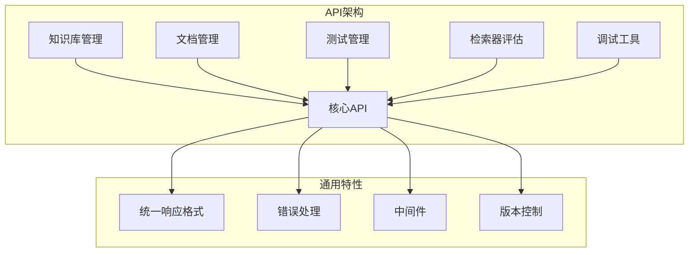
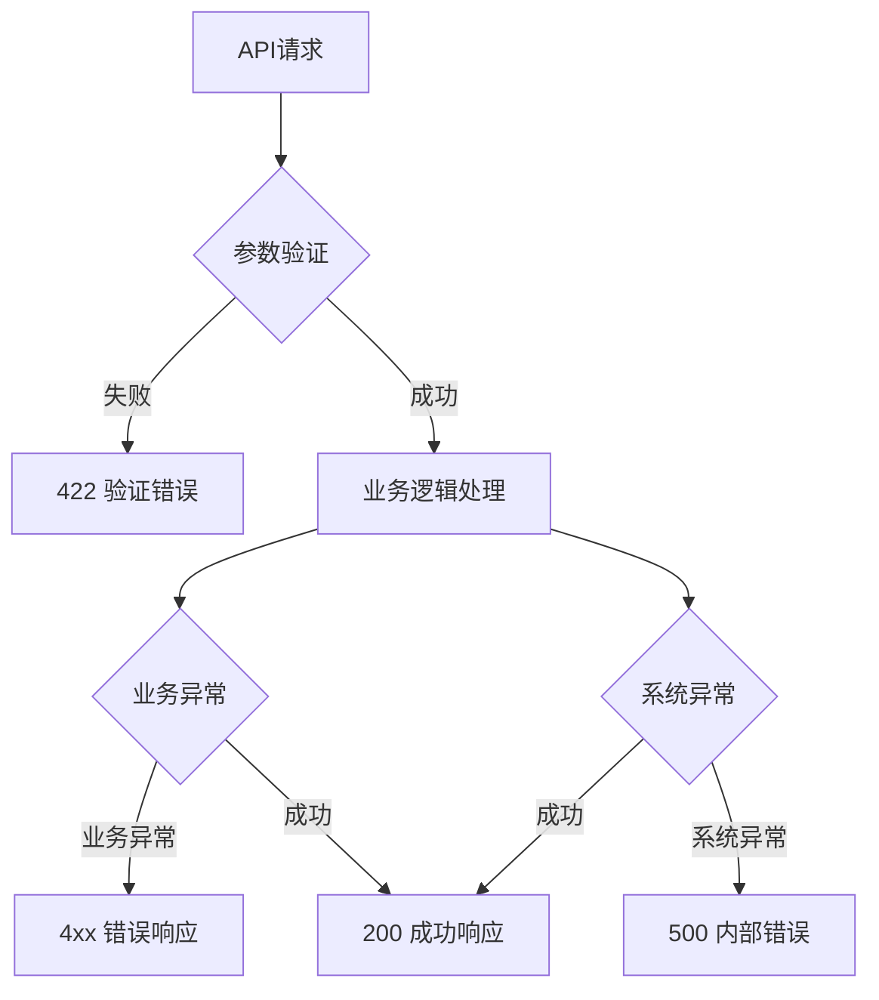

# API参考

<cite>
**本文档中引用的文件**
- [backend/app/main.py](file://backend/app/main.py)
- [backend/app/config.py](file://backend/app/config.py)
- [backend/app/core/response.py](file://backend/app/core/response.py)
- [backend/app/core/exceptions.py](file://backend/app/core/exceptions.py)
- [backend/app/core/middleware.py](file://backend/app/core/middleware.py)
- [backend/app/controllers/knowledge_base.py](file://backend/app/controllers/knowledge_base.py)
- [backend/app/controllers/document.py](file://backend/app/controllers/document.py)
- [backend/app/controllers/test_management.py](file://backend/app/controllers/test_management.py)
- [backend/app/controllers/retriever_evaluation.py](file://backend/app/controllers/retriever_evaluation.py)
- [backend/app/schemas/knowledge_base.py](file://backend/app/schemas/knowledge_base.py)
- [backend/app/schemas/document.py](file://backend/app/schemas/document.py)
- [backend/app/schemas/test.py](file://backend/app/schemas/test.py)
- [backend/app/schemas/common.py](file://backend/app/schemas/common.py)
- [web/lib/api.ts](file://web/lib/api.ts)
</cite>

## 目录
1. [简介](#简介)
2. [API概述](#api概述)
3. [通用响应结构](#通用响应结构)
4. [错误处理机制](#错误处理机制)
5. [认证与安全](#认证与安全)
6. [知识库管理API](#知识库管理api)
7. [文档管理API](#文档管理api)
8. [测试管理API](#测试管理api)
9. [检索器评估API](#检索器评估api)
10. [API版本控制](#api版本控制)
11. [速率限制](#速率限制)
12. [调试工具API](#调试工具api)
13. [客户端集成示例](#客户端集成示例)

## 简介

RAG-Studio提供了完整的RESTful API接口，支持知识库管理、文档处理、测试管理和检索器评估等功能。本文档详细介绍了所有可用的API端点，包括请求格式、响应结构、错误处理和使用示例。

### API基础信息

- **基础URL**: `http://localhost:8000/api/v1`
- **API版本**: v1
- **内容类型**: `application/json`
- **编码格式**: UTF-8

## API概述

RAG-Studio的API采用RESTful设计原则，提供以下主要功能模块：



**图表来源**
- [backend/app/main.py](file://backend/app/main.py#L93-L102)
- [backend/app/config.py](file://backend/app/config.py#L22)

## 通用响应结构

所有API响应都遵循统一的结构模式：

### 成功响应

```typescript
interface SuccessResponse<T> {
  success: true;
  data: T;
  message: string;
}
```

### 分页响应

```typescript
interface PageResponse<T> {
  success: true;
  data: T[];
  total: number;
  page: number;
  page_size: number;
  total_pages: number;
}
```

### 响应字段说明

| 字段名 | 类型 | 描述 |
|--------|------|------|
| `success` | boolean | 请求是否成功 |
| `data` | T \| T[] | 响应数据（数组形式用于分页） |
| `message` | string | 响应消息 |
| `total` | number | 总记录数（分页时） |
| `page` | number | 当前页码（分页时） |
| `page_size` | number | 每页大小（分页时） |
| `total_pages` | number | 总页数（分页时） |

**章节来源**
- [backend/app/core/response.py](file://backend/app/core/response.py#L11-L67)

## 错误处理机制

RAG-Studio实现了完善的错误处理机制，提供标准化的错误响应格式：

### 错误响应结构

```typescript
interface ErrorResponse {
  success: false;
  error_code: string;
  message: string;
  details?: any;
}
```

### 错误码体系

| 错误码 | HTTP状态码 | 描述 | 场景 |
|--------|------------|------|------|
| `BAD_REQUEST` | 400 | 错误请求 | 参数验证失败、格式错误 |
| `NOT_FOUND` | 404 | 资源不存在 | 未找到指定的资源 |
| `CONFLICT` | 409 | 资源冲突 | 资源已存在或状态冲突 |
| `INTERNAL_ERROR` | 500 | 内部服务器错误 | 系统内部错误 |

### 异常处理流程



**图表来源**
- [backend/app/core/exceptions.py](file://backend/app/core/exceptions.py#L86-L143)

**章节来源**
- [backend/app/core/exceptions.py](file://backend/app/core/exceptions.py#L1-L144)

## 认证与安全

### CORS配置

RAG-Studio支持跨域资源共享（CORS），默认允许以下源：

- `http://localhost:3000`
- `http://localhost:3001`

### 中间件功能

系统内置了两个重要的中间件：

#### 请求ID中间件
为每个请求生成唯一标识符，便于日志追踪：

```typescript
// 响应头中包含
X-Request-ID: 123e4567-e89b-12d3-a456-426614174000
```

#### 计时中间件
记录请求处理时间：

```typescript
// 响应头中包含
X-Process-Time: 0.123
```

**章节来源**
- [backend/app/core/middleware.py](file://backend/app/core/middleware.py#L1-L62)
- [backend/app/main.py](file://backend/app/main.py#L50-L57)

## 知识库管理API

知识库是RAG-Studio的核心概念，支持多种向量数据库和嵌入模型。

### 创建知识库

**端点**: `POST /api/v1/knowledge-bases`

**请求体**:
```typescript
interface KnowledgeBaseCreate {
  name: string;           // 知识库名称（必填）
  description?: string;   // 描述
  embedding_provider?: string;  // 嵌入模型提供商
  embedding_model: string;      // 嵌入模型名称
  embedding_dimension?: number; // 向量维度
  vector_db_type: string;       // 向量数据库类型
  vector_db_config?: Record<string, any>; // 数据库配置
  chunk_size?: number;          // 分块大小
  chunk_overlap?: number;       // 分块重叠
  retrieval_top_k?: number;     // 检索返回数量
  retrieval_score_threshold?: number; // 分数阈值
}
```

**响应**:
```typescript
{
  "success": true,
  "data": {
    "id": "kb_001",
    "name": "技术文档库",
    "description": "存储公司技术文档",
    "embedding_provider": "ollama",
    "embedding_model": "nomic-embed-text",
    "embedding_dimension": 768,
    "vector_db_type": "qdrant",
    "vector_db_config": {},
    "chunk_size": 512,
    "chunk_overlap": 50,
    "retrieval_top_k": 5,
    "retrieval_score_threshold": 0.7,
    "document_count": 0,
    "chunk_count": 0,
    "is_active": true,
    "created_at": "2025-01-01T00:00:00",
    "updated_at": "2025-01-01T00:00:00"
  },
  "message": "知识库创建成功"
}
```

**使用示例**:
```bash
curl -X POST "http://localhost:8000/api/v1/knowledge-bases" \
  -H "Content-Type: application/json" \
  -d '{
    "name": "技术文档库",
    "description": "存储公司技术文档",
    "embedding_model": "nomic-embed-text",
    "vector_db_type": "qdrant",
    "chunk_size": 512,
    "retrieval_top_k": 5
  }'
```

**章节来源**
- [backend/app/controllers/knowledge_base.py](file://backend/app/controllers/knowledge_base.py#L22-L44)
- [backend/app/schemas/knowledge_base.py](file://backend/app/schemas/knowledge_base.py#L11-L52)

### 获取知识库列表

**端点**: `GET /api/v1/knowledge-bases`

**查询参数**:
| 参数名 | 类型 | 必填 | 描述 |
|--------|------|------|------|
| `page` | number | 否 | 页码，默认1 |
| `page_size` | number | 否 | 每页大小，默认20 |
| `is_active` | boolean | 否 | 筛选激活状态 |

**响应**:
```typescript
{
  "success": true,
  "data": [
    {
      "id": "kb_001",
      "name": "技术文档库",
      "description": "存储公司技术文档",
      "embedding_provider": "ollama",
      "embedding_model": "nomic-embed-text",
      "vector_db_type": "qdrant",
      "is_active": true,
      "document_count": 15,
      "chunk_count": 1200,
      "created_at": "2025-01-01T00:00:00"
    }
  ],
  "total": 1,
  "page": 1,
  "page_size": 20,
  "total_pages": 1
}
```

**章节来源**
- [backend/app/controllers/knowledge_base.py](file://backend/app/controllers/knowledge_base.py#L47-L75)

### 获取知识库详情

**端点**: `GET /api/v1/knowledge-bases/{kb_id}`

**路径参数**:
| 参数名 | 类型 | 必填 | 描述 |
|--------|------|------|------|
| `kb_id` | string | 是 | 知识库ID |

**响应**:
```typescript
{
  "success": true,
  "data": {
    "id": "kb_001",
    "name": "技术文档库",
    "description": "存储公司技术文档",
    "embedding_provider": "ollama",
    "embedding_model": "nomic-embed-text",
    "embedding_dimension": 768,
    "vector_db_type": "qdrant",
    "vector_db_config": {
      "host": "localhost",
      "port": 6333
    },
    "chunk_size": 512,
    "chunk_overlap": 50,
    "retrieval_top_k": 5,
    "retrieval_score_threshold": 0.7,
    "document_count": 15,
    "chunk_count": 1200,
    "is_active": true,
    "created_at": "2025-01-01T00:00:00",
    "updated_at": "2025-01-01T00:00:00"
  }
}
```

**章节来源**
- [backend/app/controllers/knowledge_base.py](file://backend/app/controllers/knowledge_base.py#L78-L97)

### 更新知识库

**端点**: `PUT /api/v1/knowledge-bases/{kb_id}`

**请求体**:
```typescript
interface KnowledgeBaseUpdate {
  name?: string;
  description?: string;
  chunk_size?: number;
  chunk_overlap?: number;
  retrieval_top_k?: number;
  retrieval_score_threshold?: number;
  is_active?: boolean;
}
```

**章节来源**
- [backend/app/controllers/knowledge_base.py](file://backend/app/controllers/knowledge_base.py#L100-L121)
- [backend/app/schemas/knowledge_base.py](file://backend/app/schemas/knowledge_base.py#L55-L73)

### 删除知识库

**端点**: `DELETE /api/v1/knowledge-bases/{kb_id}`

**注意**: 删除知识库会同时删除其下的所有文档和索引。

**章节来源**
- [backend/app/controllers/knowledge_base.py](file://backend/app/controllers/knowledge_base.py#L124-L145)

### 获取知识库配置

**端点**: `GET /api/v1/knowledge-bases/{kb_id}/config`

**响应**:
```typescript
{
  "success": true,
  "data": {
    "basic_info": {
      "id": "kb_001",
      "name": "技术文档库",
      "description": "存储公司技术文档",
      "is_active": true
    },
    "embedding_config": {
      "provider": "ollama",
      "model": "nomic-embed-text",
      "dimension": 768
    },
    "vector_db_config": {
      "type": "qdrant",
      "config": {
        "host": "localhost",
        "port": 6333
      }
    },
    "chunk_config": {
      "chunk_size": 512,
      "chunk_overlap": 50
    },
    "retrieval_config": {
      "top_k": 5,
      "score_threshold": 0.7
    },
    "statistics": {
      "document_count": 15,
      "chunk_count": 1200
    }
  }
}
```

**章节来源**
- [backend/app/controllers/knowledge_base.py](file://backend/app/controllers/knowledge_base.py#L148-L196)

### 获取知识库统计信息

**端点**: `GET /api/v1/knowledge-bases/{kb_id}/stats`

**响应**:
```typescript
{
  "success": true,
  "data": {
    "document_count": 15,
    "chunk_count": 1200,
    "active_documents": 12,
    "inactive_documents": 3,
    "storage_size": "2.3MB",
    "last_updated": "2025-01-01T10:30:00"
  }
}
```

**章节来源**
- [backend/app/controllers/knowledge_base.py](file://backend/app/controllers/knowledge_base.py#L199-L219)

### 获取和更新Schema配置

**端点**: `GET /api/v1/knowledge-bases/{kb_id}/schema`

**端点**: `PUT /api/v1/knowledge-bases/{kb_id}/schema`

**请求体**:
```typescript
interface UpdateSchemaRequest {
  schema_fields: Array<{
    name: string;
    type: string;
    description?: string;
  }>;
  vector_db_type?: string;
  vector_db_config?: Record<string, any>;
}
```

**章节来源**
- [backend/app/controllers/knowledge_base.py](file://backend/app/controllers/knowledge_base.py#L222-L282)

## 文档管理API

文档管理API支持文档的上传、处理、检索和删除操作。

### 上传文档

**端点**: `POST /api/v1/documents/upload`

**请求格式**: multipart/form-data

**表单字段**:
| 字段名 | 类型 | 必填 | 描述 |
|--------|------|------|------|
| `kb_id` | string | 是 | 目标知识库ID |
| `file` | File | 是 | 上传的文档文件 |

**支持的文件格式**: txt, pdf, docx, md, html, json

**响应**:
```typescript
{
  "success": true,
  "data": {
    "id": "doc_001",
    "kb_id": "kb_001",
    "name": "技术规范.pdf",
    "file_path": "/uploads/tech_spec.pdf",
    "file_size": 1048576,
    "file_type": "pdf",
    "status": "uploaded",
    "created_at": "2025-01-01T00:00:00"
  },
  "message": "文档上传成功"
}
```

**使用示例**:
```bash
curl -X POST "http://localhost:8000/api/v1/documents/upload" \
  -F "kb_id=kb_001" \
  -F "file=@/path/to/document.pdf"
```

**章节来源**
- [backend/app/controllers/document.py](file://backend/app/controllers/document.py#L20-L44)

### 获取文档列表

**端点**: `GET /api/v1/documents`

**查询参数**:
| 参数名 | 类型 | 必填 | 描述 |
|--------|------|------|------|
| `kb_id` | string | 是 | 知识库ID |
| `page` | number | 否 | 页码，默认1 |
| `page_size` | number | 否 | 每页大小，默认20 |
| `status` | string | 否 | 文档状态筛选 |

**响应**:
```typescript
{
  "success": true,
  "data": [
    {
      "id": "doc_001",
      "kb_id": "kb_001",
      "name": "技术规范.pdf",
      "file_path": "/uploads/tech_spec.pdf",
      "file_size": 1048576,
      "file_type": "pdf",
      "status": "processed",
      "chunk_count": 15,
      "metadata": {},
      "created_at": "2025-01-01T00:00:00",
      "updated_at": "2025-01-01T01:00:00"
    }
  ],
  "total": 1,
  "page": 1,
  "page_size": 20,
  "total_pages": 1
}
```

**章节来源**
- [backend/app/controllers/document.py](file://backend/app/controllers/document.py#L47-L70)

### 获取文档详情

**端点**: `GET /api/v1/documents/{document_id}`

**响应**:
```typescript
{
  "success": true,
  "data": {
    "id": "doc_001",
    "kb_id": "kb_001",
    "name": "技术规范.pdf",
    "file_path": "/uploads/tech_spec.pdf",
    "file_size": 1048576,
    "file_type": "pdf",
    "status": "processed",
    "error_message": null,
    "chunk_count": 15,
    "metadata": {
      "page_count": 50,
      "word_count": 15000,
      "language": "zh"
    },
    "created_at": "2025-01-01T00:00:00",
    "updated_at": "2025-01-01T01:00:00"
  }
}
```

**章节来源**
- [backend/app/controllers/document.py](file://backend/app/controllers/document.py#L73-L86)

### 删除文档

**端点**: `DELETE /api/v1/documents/{document_id}`

**注意**: 会同时删除文档的所有分块和索引。

**章节来源**
- [backend/app/controllers/document.py](file://backend/app/controllers/document.py#L89-L103)

### 处理文档

**端点**: `POST /api/v1/documents/process`

**请求体**:
```typescript
interface DocumentProcessRequest {
  document_id: string;      // 文档ID（必填）
  force_reprocess?: boolean; // 是否强制重新处理
}
```

**响应**:
```typescript
{
  "success": true,
  "message": "文档处理已启动"
}
```

**章节来源**
- [backend/app/controllers/document.py](file://backend/app/controllers/document.py#L106-L119)

### 获取文档分块列表

**端点**: `GET /api/v1/documents/{document_id}/chunks`

**查询参数**:
| 参数名 | 类型 | 必填 | 描述 |
|--------|------|------|------|
| `page` | number | 否 | 页码，默认1 |
| `page_size` | number | 否 | 每页大小，默认20 |

**响应**:
```typescript
{
  "success": true,
  "data": [
    {
      "id": "chunk_001",
      "document_id": "doc_001",
      "kb_id": "kb_001",
      "content": "这是第一个分块的内容...",
      "chunk_index": 0,
      "token_count": 128,
      "is_indexed": true,
      "metadata": {
        "source_page": 1,
        "chunk_position": "beginning"
      },
      "created_at": "2025-01-01T00:00:00"
    }
  ],
  "total": 15,
  "page": 1,
  "page_size": 20,
  "total_pages": 1
}
```

**章节来源**
- [backend/app/controllers/document.py](file://backend/app/controllers/document.py#L122-L142)

### 获取文档处理状态

**端点**: `GET /api/v1/documents/{document_id}/processing-status`

**响应**:
```typescript
{
  "success": true,
  "data": {
    "status": "processing",
    "stages": {
      "parsing": { "status": "completed", "progress": 100 },
      "chunking": { "status": "in_progress", "progress": 60 },
      "embedding": { "status": "pending", "progress": 0 },
      "indexing": { "status": "pending", "progress": 0 }
    }
  },
  "message": "文档处理状态"
}
```

**章节来源**
- [backend/app/controllers/document.py](file://backend/app/controllers/document.py#L146-L169)

## 测试管理API

测试管理API支持创建、管理和执行检索和生成测试。

### 测试集管理

#### 创建测试集

**端点**: `POST /api/v1/tests/test-sets`

**请求体**:
```typescript
interface TestSetCreate {
  name: string;              // 测试集名称（必填）
  description?: string;      // 描述
  kb_id: string;            // 关联知识库ID（必填）
  test_type: 'retrieval' | 'generation'; // 测试类型
  kb_config?: Record<string, any>;      // 知识库配置快照
  chunking_config?: Record<string, any>; // 分块策略配置
  embedding_config?: Record<string, any>; // 嵌入模型参数配置
  sparse_vector_config?: Record<string, any>; // 稀疏向量参数配置
  index_config?: Record<string, any>;   // 索引配置
}
```

**响应**:
```typescript
{
  "success": true,
  "data": {
    "id": "ts_001",
    "name": "T2Ranking测试集",
    "description": "基于T2Ranking数据集的检索测试",
    "kb_id": "kb_001",
    "test_type": "retrieval",
    "case_count": 0,
    "created_at": "2025-01-01T00:00:00",
    "updated_at": "2025-01-01T00:00:00"
  },
  "message": "测试集创建成功"
}
```

**章节来源**
- [backend/app/controllers/test_management.py](file://backend/app/controllers/test_management.py#L32-L68)

#### 获取测试集列表

**端点**: `GET /api/v1/tests/test-sets`

**查询参数**:
| 参数名 | 类型 | 必填 | 描述 |
|--------|------|------|------|
| `kb_id` | string | 否 | 知识库ID筛选 |
| `test_type` | string | 否 | 测试类型筛选 |
| `page` | number | 否 | 页码，默认1 |
| `page_size` | number | 否 | 每页大小，默认20 |

**章节来源**
- [backend/app/controllers/test_management.py](file://backend/app/controllers/test_management.py#L82-L132)

#### 获取测试集详情

**端点**: `GET /api/v1/tests/test-sets/{test_set_id}`

**章节来源**
- [backend/app/controllers/test_management.py](file://backend/app/controllers/test_management.py#L135-L159)

#### 更新测试集

**端点**: `PUT /api/v1/tests/test-sets/{test_set_id}`

**请求体**:
```typescript
interface TestSetUpdate {
  name?: string;
  description?: string;
}
```

**章节来源**
- [backend/app/controllers/test_management.py](file://backend/app/controllers/test_management.py#L168-L189)

#### 删除测试集

**端点**: `DELETE /api/v1/tests/test-sets/{test_set_id}`

**注意**: 会同时删除测试集下的所有测试用例。

**章节来源**
- [backend/app/controllers/test_management.py](file://backend/app/controllers/test_management.py#L201-L232)

### 测试用例管理

#### 创建测试用例

**端点**: `POST /api/v1/tests/test-cases`

**请求体**:
```typescript
interface TestCaseCreate {
  test_set_id: string;           // 所属测试集ID（必填）
  query: string;                 // 测试问题（必填）
  expected_chunks?: string[];    // 期望检索到的分块ID列表
  expected_answer?: string;      // 期望的答案
  metadata?: Record<string, any>; // 测试用例元数据
}
```

**章节来源**
- [backend/app/controllers/test_management.py](file://backend/app/controllers/test_management.py#L243-L268)

#### 获取测试用例列表

**端点**: `GET /api/v1/tests/test-cases`

**查询参数**:
| 参数名 | 类型 | 必填 | 描述 |
|--------|------|------|------|
| `test_set_id` | string | 是 | 测试集ID |
| `page` | number | 否 | 页码，默认1 |
| `page_size` | number | 否 | 每页大小，默认20 |

**章节来源**
- [backend/app/controllers/test_management.py](file://backend/app/controllers/test_management.py#L281-L311)

#### 获取测试用例详情

**端点**: `GET /api/v1/tests/test-cases/{test_case_id}`

**章节来源**
- [backend/app/controllers/test_management.py](file://backend/app/controllers/test_management.py#L320-L344)

#### 更新测试用例

**端点**: `PUT /api/v1/tests/test-cases/{test_case_id}`

**请求体**:
```typescript
interface TestCaseUpdate {
  query?: string;
  expected_chunks?: string[];
  expected_answer?: string;
  metadata?: Record<string, any>;
}
```

**章节来源**
- [backend/app/controllers/test_management.py](file://backend/app/controllers/test_management.py#L353-L377)

#### 删除测试用例

**端点**: `DELETE /api/v1/tests/test-cases/{test_case_id}`

**章节来源**
- [backend/app/controllers/test_management.py](file://backend/app/controllers/test_management.py#L386-L421)

### 检索测试

#### 执行检索测试

**端点**: `POST /api/v1/tests/retrieval/run`

**请求体**:
```typescript
interface RunRetrievalTestRequest {
  test_case_id?: string;    // 单个测试用例ID
  test_set_id?: string;     // 测试集ID（批量测试）
  top_k?: number;          // 检索返回的top-k数量
  score_threshold?: number; // 相似度分数阈值
}
```

**响应**:
```typescript
{
  "success": true,
  "data": {
    "task_id": "task_001"
  },
  "message": "检索测试已启动"
}
```

**章节来源**
- [backend/app/controllers/test_management.py](file://backend/app/controllers/test_management.py#L426-L442)

#### 获取检索测试结果

**端点**: `GET /api/v1/tests/retrieval/results`

**查询参数**:
| 参数名 | 类型 | 必填 | 描述 |
|--------|------|------|------|
| `test_set_id` | string | 是 | 测试集ID |
| `page` | number | 否 | 页码，默认1 |
| `page_size` | number | 否 | 每页大小，默认20 |

**章节来源**
- [backend/app/controllers/test_management.py](file://backend/app/controllers/test_management.py#L445-L462)

#### 获取检索测试结果详情

**端点**: `GET /api/v1/tests/retrieval/results/{result_id}`

**章节来源**
- [backend/app/controllers/test_management.py](file://backend/app/controllers/test_management.py#L465-L476)

### 生成测试

#### 执行生成测试

**端点**: `POST /api/v1/tests/generation/run`

**请求体**:
```typescript
interface RunGenerationTestRequest {
  test_case_id?: string;    // 单个测试用例ID
  test_set_id?: string;     // 测试集ID（批量测试）
  llm_model?: string;       // 使用的LLM模型
}
```

**章节来源**
- [backend/app/controllers/test_management.py](file://backend/app/controllers/test_management.py#L481-L498)

#### 获取生成测试结果

**端点**: `GET /api/v1/tests/generation/results`

**查询参数**:
| 参数名 | 类型 | 必填 | 描述 |
|--------|------|------|------|
| `test_set_id` | string | 是 | 测试集ID |
| `page` | number | 否 | 页码，默认1 |
| `page_size` | number | 否 | 每页大小，默认20 |

**章节来源**
- [backend/app/controllers/test_management.py](file://backend/app/controllers/test_management.py#L501-L518)

#### 获取生成测试结果详情

**端点**: `GET /api/v1/tests/generation/results/{result_id}`

**章节来源**
- [backend/app/controllers/test_management.py](file://backend/app/controllers/test_management.py#L521-L533)

## 检索器评估API

检索器评估API提供基于T2Ranking等标准数据集的检索器评估能力。

### 导入T2Ranking数据集

**端点**: `POST /api/v1/retriever-evaluation/import-t2ranking`

**请求体**:
```typescript
interface ImportT2RankingDatasetRequest {
  kb_id: string;                    // 目标知识库ID（必填）
  test_set_name: string;            // 测试集名称（必填）
  collection_path: string;          // 文档集合文件路径（必填）
  queries_path: string;             // 查询文件路径（必填）
  qrels_path: string;               // 相关性标注文件路径（必填）
  max_docs?: number;                // 最大文档数量限制
  max_queries?: number;             // 最大查询数量限制
  description?: string;             // 测试集描述
}
```

**响应**:
```typescript
{
  "success": true,
  "data": {
    "statistics": {
      "total_documents": 8841,
      "total_queries": 367,
      "total_query_doc_pairs": 23573,
      "queries_with_relevant_docs": 367,
      "avg_relevant_docs_per_query": 64.23,
      "max_relevant_docs": 500,
      "min_relevant_docs": 1
    },
    "kb_id": "kb_001",
    "documents": {
      "total": 8841,
      "created": 8841,
      "failed": 0,
      "failed_records": []
    },
    "test_set": {
      "id": "ts_001",
      "name": "T2Ranking测试集",
      "case_count": 367
    },
    "test_cases": {
      "total": 367,
      "created": 367,
      "failed": 0,
      "failed_records": []
    }
  },
  "message": "T2Ranking数据集导入成功: 8841个文档, 367个测试用例"
}
```

**使用示例**:
```bash
curl -X POST "http://localhost:8000/api/v1/retriever-evaluation/import-t2ranking" \
  -H "Content-Type: application/json" \
  -d '{
    "kb_id": "kb_001",
    "test_set_name": "T2Ranking检索测试集",
    "collection_path": "/data/collection.tsv",
    "queries_path": "/data/queries.dev.tsv",
    "qrels_path": "/data/qrels.dev.tsv",
    "max_docs": 10000,
    "max_queries": 100
  }'
```

**章节来源**
- [backend/app/controllers/retriever_evaluation.py](file://backend/app/controllers/retriever_evaluation.py#L26-L159)

### 获取数据集统计信息

**端点**: `GET /api/v1/retriever-evaluation/dataset-statistics`

**查询参数**:
| 参数名 | 类型 | 必填 | 描述 |
|--------|------|------|------|
| `collection_path` | string | 是 | 文档集合文件路径 |
| `queries_path` | string | 是 | 查询文件路径 |
| `qrels_path` | string | 是 | 相关性标注文件路径 |
| `max_docs` | number | 否 | 最大文档数量限制 |
| `max_queries` | number | 否 | 最大查询数量限制 |

**响应**:
```typescript
{
  "success": true,
  "data": {
    "total_documents": 8841,
    "total_queries": 367,
    "total_query_doc_pairs": 23573,
    "queries_with_relevant_docs": 367,
    "avg_relevant_docs_per_query": 64.23,
    "max_relevant_docs": 500,
    "min_relevant_docs": 1
  }
}
```

**章节来源**
- [backend/app/controllers/retriever_evaluation.py](file://backend/app/controllers/retriever_evaluation.py#L161-L195)

### 执行检索器评估

**端点**: `POST /api/v1/retriever-evaluation/evaluate`

**请求体**:
```typescript
interface RetrieverEvaluationRequest {
  kb_id: string;                    // 知识库ID（必填）
  test_set_id: string;              // 测试集ID（必填）
  top_k?: number;                   // 检索返回的top-k数量，默认10
  vector_db_type?: string;          // 向量数据库类型
  embedding_provider?: string;      // 向量模型提供商
  embedding_model?: string;         // 向量模型名称
  retrieval_algorithm?: string;     // 检索算法配置
}
```

**响应**:
```typescript
{
  "success": true,
  "data": {
    "message": "检索器评估功能待完整实现",
    "kb_id": "kb_001",
    "test_set_id": "ts_001",
    "total_test_cases": 367,
    "config": {
      "top_k": 10,
      "vector_db_type": "qdrant",
      "embedding_provider": "ollama",
      "embedding_model": "nomic-embed-text"
    }
  },
  "message": "评估任务已创建"
}
```

**章节来源**
- [backend/app/controllers/retriever_evaluation.py](file://backend/app/controllers/retriever_evaluation.py#L197-L295)

### 获取评估历史

**端点**: `GET /api/v1/retriever-evaluation/evaluation-history`

**查询参数**:
| 参数名 | 类型 | 必填 | 描述 |
|--------|------|------|------|
| `kb_id` | string | 是 | 知识库ID |
| `test_set_id` | string | 否 | 测试集ID |
| `page` | number | 否 | 页码，默认1 |
| `page_size` | number | 否 | 每页大小，默认20 |

**响应**:
```typescript
{
  "success": true,
  "data": {
    "items": [],
    "total": 0,
    "page": 1,
    "page_size": 20
  },
  "message": "评估历史查询"
}
```

**章节来源**
- [backend/app/controllers/retriever_evaluation.py](file://backend/app/controllers/retriever_evaluation.py#L297-L332)

### 对比多个评估结果

**端点**: `GET /api/v1/retriever-evaluation/compare-evaluations`

**查询参数**:
| 参数名 | 类型 | 必填 | 描述 |
|--------|------|------|------|
| `evaluation_ids` | string | 是 | 逗号分隔的评估ID列表 |

**响应**:
```typescript
{
  "success": true,
  "data": {
    "comparison": [],
    "evaluation_ids": ["eval_001", "eval_002", "eval_003"]
  },
  "message": "评估对比"
}
```

**章节来源**
- [backend/app/controllers/retriever_evaluation.py](file://backend/app/controllers/retriever_evaluation.py#L334-L370)

## API版本控制

### 版本策略

RAG-Studio采用语义化版本控制：

- **主版本号**: 不兼容的API变更
- **次版本号**: 向后兼容的功能性新增
- **修订号**: 向后兼容的问题修正

### 当前版本

- **API版本**: v1
- **基础URL**: `http://localhost:8000/api/v1`
- **文档URL**: `http://localhost:8000/api/v1/docs`
- **OpenAPI规范**: `http://localhost:8000/api/v1/openapi.json`

### 版本兼容性

- **向后兼容**: 新版本保持对旧版本的兼容性
- **弃用通知**: 重大变更会提前通知
- **迁移指南**: 提供详细的版本迁移指导

**章节来源**
- [backend/app/config.py](file://backend/app/config.py#L22)
- [backend/app/main.py](file://backend/app/main.py#L41-L47)

## 速率限制

### 限制策略

RAG-Studio目前采用以下速率限制策略：

1. **请求频率限制**: 基于IP地址的请求频率控制
2. **并发连接限制**: 防止资源过度消耗
3. **资源使用限制**: 文档大小、查询长度等

### 默认限制

- **文档上传**: 单次最大50MB
- **查询长度**: 最大1000字符
- **并发请求**: 每IP最多10个并发连接
- **请求频率**: 每秒最多100个请求

### 限制响应

当达到速率限制时，API会返回：

```typescript
{
  "success": false,
  "error_code": "RATE_LIMIT_EXCEEDED",
  "message": "请求过于频繁，请稍后再试",
  "details": {
    "retry_after": 60,
    "limit": 100,
    "remaining": 0
  }
}
```

## 调试工具API

RAG-Studio提供了专门的调试工具API，用于链路排查和性能测试。

### 健康检查

**端点**: `GET /api/v1/health`

**响应**:
```typescript
{
  "status": "healthy",
  "app_name": "RAG Studio Backend",
  "version": "1.0.0",
  "storage_type": "json",
  "vector_db": "qdrant"
}
```

**章节来源**
- [backend/app/main.py](file://backend/app/main.py#L79-L90)

### 文档处理调试

#### 上传文档

**端点**: `POST /api/v1/debug/document/upload`

**支持的文件格式**: txt, pdf, docx, md, html, json

#### 解析文档

**端点**: `POST /api/v1/debug/document/parse`

#### 文档分块

**端点**: `POST /api/v1/debug/document/chunk`

### 向量化调试

#### 文档向量化

**端点**: `POST /api/v1/debug/embedding/embed`

**请求体**:
```typescript
interface EmbedRequest {
  texts: string[];      // 文本列表
  model: string;        // 模型名称
  provider: string;     // 提供商
}
```

**响应**:
```typescript
{
  "success": true,
  "data": {
    "vectors": [...],
    "stats": {
      "total_texts": 10,
      "vector_dimension": 768,
      "model": "nomic-embed-text",
      "provider": "ollama"
    }
  }
}
```

**章节来源**
- [backend/app/controllers/debug_pipeline.py](file://backend/app/controllers/debug_pipeline.py#L219-L262)

### 分词调试

#### Jieba分词

**端点**: `POST /api/v1/debug/tokenize/jieba`

**请求体**:
```typescript
{
  text: string;        // 待分词文本
  cut_all?: boolean;   // 全模式分词
  hmm?: boolean;       // 是否使用HMM模型
}
```

**响应**:
```typescript
{
  "success": true,
  "data": {
    "tokens": ["这", "是", "一个", "测试"],
    "time_cost": 0.001
  }
}
```

## 客户端集成示例

### JavaScript/TypeScript集成

以下是基于`web/lib/api.ts`的完整客户端集成示例：

#### 知识库操作

```typescript
// 创建知识库
const createKB = async (data: CreateKnowledgeBaseData) => {
  return await knowledgeBaseAPI.create(data);
};

// 获取知识库列表
const listKBs = async (page = 1, pageSize = 20, isActive?: boolean) => {
  return await knowledgeBaseAPI.list(page, pageSize, isActive);
};

// 获取知识库详情
const getKB = async (id: string) => {
  return await knowledgeBaseAPI.get(id);
};

// 更新知识库
const updateKB = async (id: string, data: UpdateKnowledgeBaseData) => {
  return await knowledgeBaseAPI.update(id, data);
};

// 删除知识库
const deleteKB = async (id: string) => {
  return await knowledgeBaseAPI.delete(id);
};
```

#### 文档操作

```typescript
// 上传文档
const uploadDoc = async (kbId: string, file: File) => {
  return await documentAPI.upload(kbId, file);
};

// 获取文档列表
const listDocs = async (kbId: string, page = 1, pageSize = 20, status?: string) => {
  return await documentAPI.list(kbId, page, pageSize, status);
};

// 处理文档
const processDoc = async (documentId: string, forceReprocess = false) => {
  return await documentAPI.process(documentId, forceReprocess);
};
```

#### 测试管理

```typescript
// 创建测试集
const createTestSet = async (data: {
  name: string;
  description?: string;
  kb_id: string;
  test_type: 'retrieval' | 'generation';
}) => {
  return await testAPI.createTestSet(data);
};

// 创建测试用例
const createTestCase = async (data: {
  test_set_id: string;
  query: string;
  expected_chunks?: string[];
  expected_answer?: string;
  metadata?: Record<string, any>;
}) => {
  return await testAPI.createTestCase(data);
};

// 执行检索测试
const runRetrievalTest = async (data: {
  test_case_id?: string;
  test_set_id?: string;
  top_k?: number;
}) => {
  return await testAPI.runRetrievalTest(data);
};
```

#### 检索器评估

```typescript
// 导入T2Ranking数据集
const importT2Ranking = async (data: {
  kb_id: string;
  test_set_name: string;
  collection_path: string;
  queries_path: string;
  qrels_path: string;
  max_docs?: number;
  max_queries?: number;
}) => {
  return await retrieverEvalAPI.importT2Ranking(data);
};

// 执行评估
const evaluateRetriever = async (data: {
  kb_id: string;
  test_set_id: string;
  top_k?: number;
  vector_db_type?: string;
  embedding_provider?: string;
  embedding_model?: string;
}) => {
  return await retrieverEvalAPI.evaluate(data);
};

// 获取评估历史
const getEvalHistory = async (
  kbId: string,
  testSetId?: string,
  page = 1,
  pageSize = 20
) => {
  return await retrieverEvalAPI.getEvaluationHistory(
    kbId, testSetId, page, pageSize
  );
};
```

### curl命令示例

#### 知识库管理

```bash
# 创建知识库
curl -X POST "http://localhost:8000/api/v1/knowledge-bases" \
  -H "Content-Type: application/json" \
  -d '{
    "name": "我的知识库",
    "embedding_model": "nomic-embed-text",
    "vector_db_type": "qdrant"
  }'

# 获取知识库列表
curl "http://localhost:8000/api/v1/knowledge-bases?page=1&page_size=10"

# 获取知识库详情
curl "http://localhost:8000/api/v1/knowledge-bases/kb_001"

# 更新知识库
curl -X PUT "http://localhost:8000/api/v1/knowledge-bases/kb_001" \
  -H "Content-Type: application/json" \
  -d '{
    "name": "更新后的知识库名称"
  }'

# 删除知识库
curl -X DELETE "http://localhost:8000/api/v1/knowledge-bases/kb_001"
```

#### 文档管理

```bash
# 上传文档
curl -X POST "http://localhost:8000/api/v1/documents/upload" \
  -F "kb_id=kb_001" \
  -F "file=@document.pdf"

# 获取文档列表
curl "http://localhost:8000/api/v1/documents?kb_id=kb_001&page=1&page_size=20"

# 处理文档
curl -X POST "http://localhost:8000/api/v1/documents/process" \
  -H "Content-Type: application/json" \
  -d '{
    "document_id": "doc_001",
    "force_reprocess": false
  }'
```

#### 测试管理

```bash
# 创建测试集
curl -X POST "http://localhost:8000/api/v1/tests/test-sets" \
  -H "Content-Type: application/json" \
  -d '{
    "name": "检索测试集",
    "kb_id": "kb_001",
    "test_type": "retrieval"
  }'

# 创建测试用例
curl -X POST "http://localhost:8000/api/v1/tests/test-cases" \
  -H "Content-Type: application/json" \
  -d '{
    "test_set_id": "ts_001",
    "query": "什么是RAG?",
    "expected_chunks": ["chunk_001", "chunk_002"]
  }'

# 执行检索测试
curl -X POST "http://localhost:8000/api/v1/tests/retrieval/run" \
  -H "Content-Type: application/json" \
  -d '{
    "test_set_id": "ts_001",
    "top_k": 5
  }'
```

#### 检索器评估

```bash
# 导入T2Ranking数据集
curl -X POST "http://localhost:8000/api/v1/retriever-evaluation/import-t2ranking" \
  -H "Content-Type: application/json" \
  -d '{
    "kb_id": "kb_001",
    "test_set_name": "T2Ranking测试",
    "collection_path": "/data/collection.tsv",
    "queries_path": "/data/queries.dev.tsv",
    "qrels_path": "/data/qrels.dev.tsv"
  }'

# 执行评估
curl -X POST "http://localhost:8000/api/v1/retriever-evaluation/evaluate" \
  -H "Content-Type: application/json" \
  -d '{
    "kb_id": "kb_001",
    "test_set_id": "ts_001",
    "top_k": 10
  }'

# 获取评估历史
curl "http://localhost:8000/api/v1/retriever-evaluation/evaluation-history?kb_id=kb_001"
```

### 错误处理最佳实践

```typescript
// 统一错误处理
const handleAPIError = (error: any) => {
  if (error.response) {
    // 服务器返回了错误响应
    const { status, data } = error.response;
    switch (status) {
      case 400:
        console.error('请求参数错误:', data.message);
        break;
      case 404:
        console.error('资源不存在:', data.message);
        break;
      case 409:
        console.error('资源冲突:', data.message);
        break;
      case 500:
        console.error('服务器内部错误:', data.message);
        break;
      default:
        console.error('未知错误:', data.message);
    }
  } else if (error.request) {
    // 请求已发送但无响应
    console.error('网络连接失败，请检查服务器状态');
  } else {
    // 其他错误
    console.error('请求失败:', error.message);
  }
};

// 使用示例
try {
  const response = await knowledgeBaseAPI.create(kbData);
  if (response.success) {
    console.log('知识库创建成功:', response.data);
  }
} catch (error) {
  handleAPIError(error);
}
```

## 性能优化建议

### 请求优化

1. **批量操作**: 尽可能使用批量API减少请求次数
2. **分页处理**: 对大量数据使用分页查询
3. **缓存策略**: 缓存不经常变化的数据
4. **压缩传输**: 启用gzip压缩减少传输数据量

### 并发控制

```typescript
// 并发请求控制
const MAX_CONCURRENT = 5;

const processWithConcurrency = async <T>(
  items: T[],
  processor: (item: T) => Promise<any>
) => {
  const results: any[] = [];
  const executing: Promise<any>[] = [];

  for (const item of items) {
    const promise = processor(item).then(result => {
      results.push(result);
      executing.splice(executing.indexOf(promise), 1);
    });
    
    executing.push(promise);
    
    if (executing.length >= MAX_CONCURRENT) {
      await Promise.race(executing);
    }
  }
  
  await Promise.all(executing);
  return results;
};
```

### 监控和日志

```typescript
// 请求监控
const logAPICall = (endpoint: string, duration: number, success: boolean) => {
  console.log(`API Call: ${endpoint} - ${duration.toFixed(2)}ms - ${success ? 'SUCCESS' : 'FAILED'}`);
};

// 使用示例
const timedAPIRequest = async (endpoint: string, requestFn: () => Promise<any>) => {
  const startTime = performance.now();
  try {
    const result = await requestFn();
    const duration = performance.now() - startTime;
    logAPICall(endpoint, duration, true);
    return result;
  } catch (error) {
    const duration = performance.now() - startTime;
    logAPICall(endpoint, duration, false);
    throw error;
  }
};
```

## 故障排除指南

### 常见问题及解决方案

#### 1. 连接超时

**症状**: 请求长时间无响应
**原因**: 服务器负载过高或网络问题
**解决方案**:
- 检查服务器状态
- 增加超时时间设置
- 使用重试机制

#### 2. 文档上传失败

**症状**: 上传大文件时失败
**原因**: 文件大小超过限制或内存不足
**解决方案**:
- 检查文件大小限制
- 分块上传大文件
- 增加服务器内存

#### 3. 检索结果不准确

**症状**: 检索到的相关文档较少
**原因**: 向量数据库配置不当或嵌入模型效果差
**解决方案**:
- 调整检索参数
- 更换嵌入模型
- 优化知识库配置

#### 4. 评估任务卡住

**症状**: 评估任务长时间处于运行状态
**原因**: 数据量过大或算法复杂度过高
**解决方案**:
- 减少测试数据量
- 优化评估配置
- 增加计算资源

### 调试工具

#### 启用调试模式

```typescript
// 在前端启用调试模式
localStorage.setItem('debug-api', 'true');

// 调试日志拦截器
const debugInterceptor = (request: any, response: any) => {
  if (localStorage.getItem('debug-api') === 'true') {
    console.log('API Request:', request);
    console.log('API Response:', response);
  }
};
```

#### 性能监控

```typescript
// 性能监控
const performanceMonitor = {
  requests: [] as any[],
  
  recordRequest(method: string, url: string, duration: number) {
    this.requests.push({
      method,
      url,
      duration,
      timestamp: new Date().toISOString()
    });
    
    // 保留最近100条记录
    if (this.requests.length > 100) {
      this.requests.shift();
    }
  },
  
  getAverageDuration(): number {
    if (this.requests.length === 0) return 0;
    const sum = this.requests.reduce((acc, req) => acc + req.duration, 0);
    return sum / this.requests.length;
  }
};
```

## 结论

RAG-Studio提供了完整而强大的API生态系统，支持从知识库管理到检索器评估的全流程操作。通过本文档提供的详细API参考、示例代码和最佳实践，开发者可以快速集成和使用这些API来构建自己的RAG应用。

### 主要优势

1. **完整的功能覆盖**: 涵盖RAG系统的各个环节
2. **标准化的接口设计**: 统一的响应格式和错误处理
3. **灵活的配置选项**: 支持多种向量数据库和嵌入模型
4. **丰富的调试工具**: 便于开发和问题排查
5. **良好的扩展性**: 易于集成第三方服务

### 下一步建议

1. **阅读具体模块文档**: 深入了解各功能模块的详细用法
2. **参考示例代码**: 学习最佳实践和常见用法
3. **参与社区讨论**: 获取更多使用经验和技巧
4. **贡献代码**: 参与开源项目的发展和完善

通过合理使用这些API，开发者可以构建出功能强大、性能优异的RAG应用，为用户提供优秀的智能问答体验。