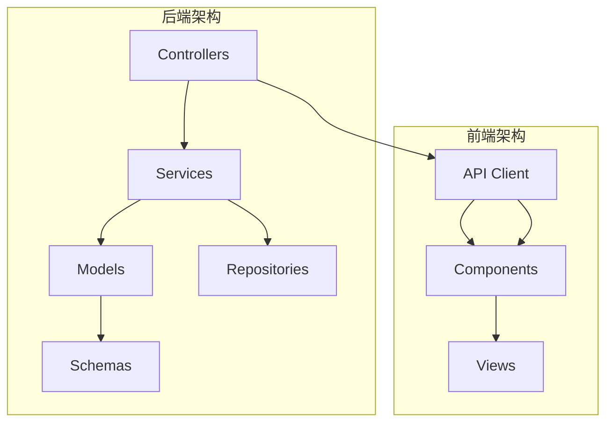
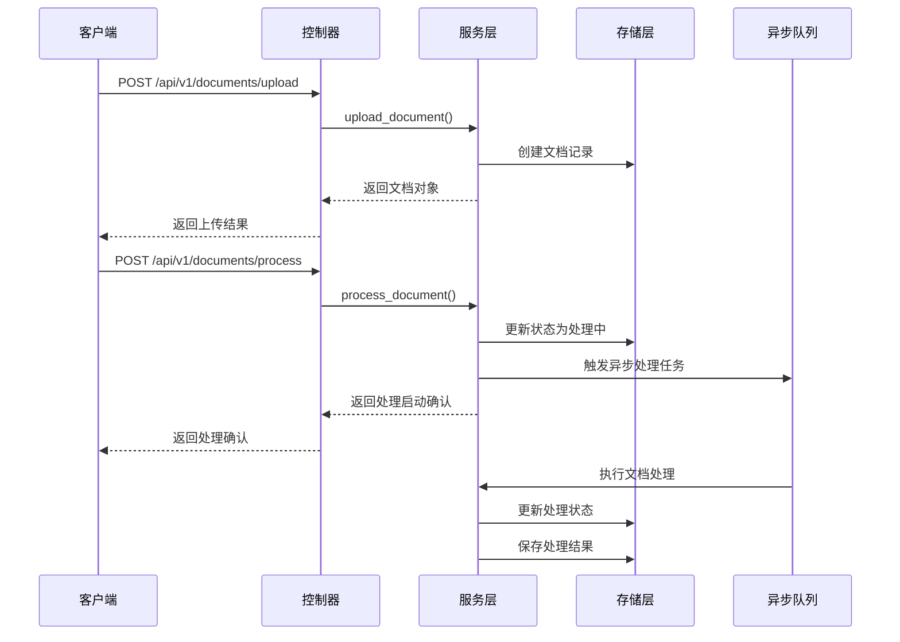
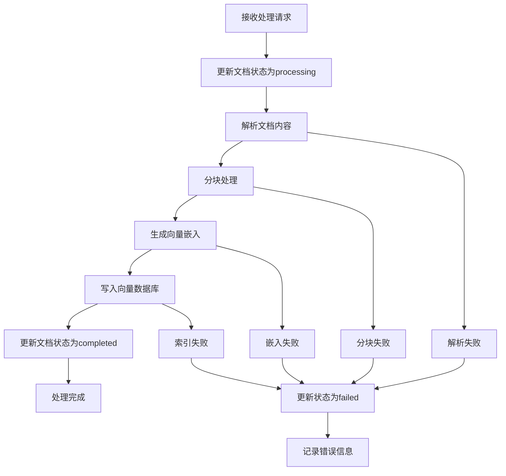
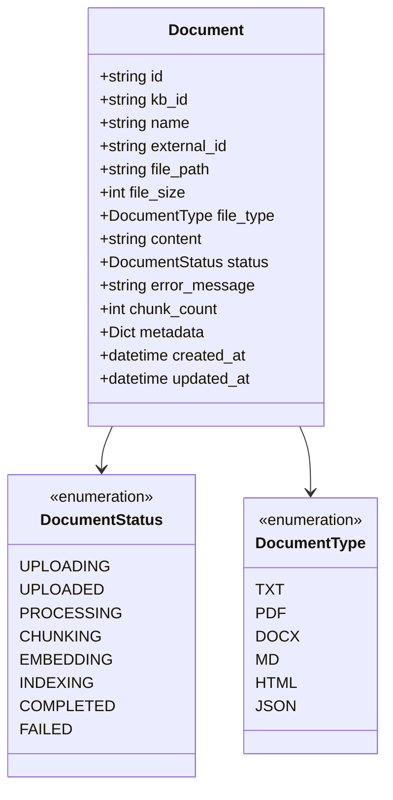
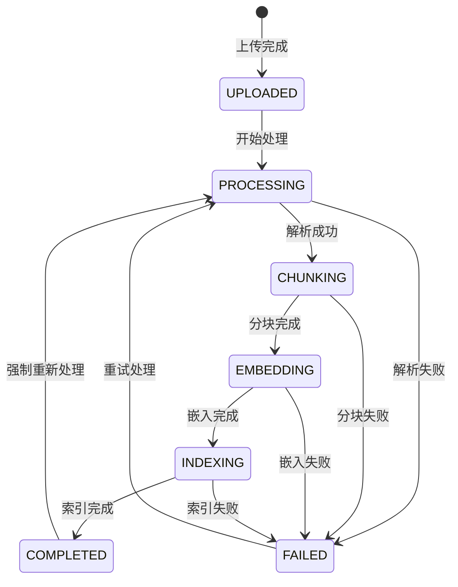

# 文档API

<cite>
**本文档引用的文件**
- [backend/app/controllers/document.py](file://backend/app/controllers/document.py)
- [backend/app/models/document.py](file://backend/app/models/document.py)
- [backend/app/schemas/document.py](file://backend/app/schemas/document.py)
- [backend/app/services/document.py](file://backend/app/services/document.py)
- [backend/app/core/response.py](file://backend/app/core/response.py)
- [backend/app/core/exceptions.py](file://backend/app/core/exceptions.py)
- [web/lib/api.ts](file://web/lib/api.ts)
- [web/components/views/document-processing.tsx](file://web/components/views/document-processing.tsx)
- [web/components/views/document-embedding.tsx](file://web/components/views/document-embedding.tsx)
</cite>

## 目录
1. [简介](#简介)
2. [项目结构](#项目结构)
3. [核心组件](#核心组件)
4. [架构概览](#架构概览)
5. [详细接口分析](#详细接口分析)
6. [文档模型详解](#文档模型详解)
7. [异步处理机制](#异步处理机制)
8. [前端集成示例](#前端集成示例)
9. [错误处理](#错误处理)
10. [最佳实践](#最佳实践)

## 简介

RAG Studio的文档管理API提供了完整的文档生命周期管理功能，包括文档上传、处理、查询、删除等操作。该API采用RESTful设计，支持多种文件格式，并提供了强大的异步处理机制来处理大型文档的复杂处理流程。

## 项目结构



**图表来源**
- [backend/app/controllers/document.py](file://backend/app/controllers/document.py#L1-L171)
- [web/lib/api.ts](file://web/lib/api.ts#L1-L800)

**章节来源**
- [backend/app/controllers/document.py](file://backend/app/controllers/document.py#L1-L171)
- [backend/app/models/document.py](file://backend/app/models/document.py#L1-L116)
- [web/lib/api.ts](file://web/lib/api.ts#L1-L800)

## 核心组件

### 文档控制器 (Document Controller)
负责处理所有文档相关的HTTP请求，包括上传、查询、删除和处理操作。

### 文档服务 (Document Service)
包含业务逻辑，处理文档的上传、处理、查询等核心功能。

### 文档模型 (Document Model)
定义了文档的数据结构和状态管理。

### 前端API客户端
提供了TypeScript类型的API调用封装，便于前端集成。

**章节来源**
- [backend/app/controllers/document.py](file://backend/app/controllers/document.py#L1-L171)
- [backend/app/services/document.py](file://backend/app/services/document.py#L1-L272)
- [web/lib/api.ts](file://web/lib/api.ts#L223-L321)

## 架构概览



**图表来源**
- [backend/app/controllers/document.py](file://backend/app/controllers/document.py#L20-L120)
- [backend/app/services/document.py](file://backend/app/services/document.py#L23-L200)

## 详细接口分析

### POST /api/v1/documents/upload - 文档上传

这是文档管理的核心接口，支持通过multipart/form-data格式上传文档文件。

#### 请求格式

| 参数名 | 类型 | 必填 | 描述 |
|--------|------|------|------|
| kb_id | string | 是 | 知识库ID |
| file | UploadFile | 是 | 上传的文档文件 |

#### 支持的文件格式
- `.txt` - 纯文本文件
- `.pdf` - PDF文档
- `.docx` - Word文档
- `.md` - Markdown文件
- `.html` - HTML文件
- `.json` - JSON文件

#### 响应格式

```typescript
{
  "success": true,
  "data": {
    "id": "doc_001",
    "kb_id": "kb_001",
    "name": "example.pdf",
    "file_path": "/storage/documents/kb_001/doc_001.pdf",
    "file_size": 1024000,
    "file_type": "pdf",
    "status": "uploaded",
    "created_at": "2024-01-01T00:00:00Z"
  },
  "message": "文档上传成功"
}
```

#### 前端实现示例

```typescript
// 前端上传文件示例
const formData = new FormData();
formData.append('kb_id', 'kb_001');
formData.append('file', file);

const response = await documentAPI.upload('kb_001', file);
console.log('上传结果:', response.data);
```

**章节来源**
- [backend/app/controllers/document.py](file://backend/app/controllers/document.py#L20-L44)
- [backend/app/services/document.py](file://backend/app/services/document.py#L23-L72)
- [web/lib/api.ts](file://web/lib/api.ts#L247-L259)

### GET /api/v1/documents - 文档列表查询

支持分页查询和状态筛选的文档列表接口。

#### 查询参数

| 参数名 | 类型 | 默认值 | 描述 |
|--------|------|--------|------|
| kb_id | string | - | 知识库ID（必填） |
| page | int | 1 | 页码 |
| page_size | int | 20 | 每页大小（1-100） |
| status | string | - | 文档状态筛选 |

#### 状态枚举
- `uploading` - 上传中
- `uploaded` - 已上传
- `processing` - 处理中
- `chunking` - 分块中
- `embedding` - 嵌入中
- `indexing` - 索引中
- `completed` - 已完成
- `failed` - 失败

#### 响应格式

```typescript
{
  "success": true,
  "data": [
    {
      "id": "doc_001",
      "kb_id": "kb_001",
      "name": "example.pdf",
      "file_path": "/storage/documents/kb_001/doc_001.pdf",
      "file_size": 1024000,
      "file_type": "pdf",
      "status": "completed",
      "chunk_count": 50,
      "created_at": "2024-01-01T00:00:00Z"
    }
  ],
  "total": 10,
  "page": 1,
  "page_size": 20,
  "total_pages": 1
}
```

**章节来源**
- [backend/app/controllers/document.py](file://backend/app/controllers/document.py#L47-L70)
- [backend/app/services/document.py](file://backend/app/services/document.py#L130-L157)

### GET /api/v1/documents/{document_id} - 获取文档详情

根据文档ID获取详细的文档信息。

#### 响应格式

```typescript
{
  "success": true,
  "data": {
    "id": "doc_001",
    "kb_id": "kb_001",
    "name": "example.pdf",
    "file_path": "/storage/documents/kb_001/doc_001.pdf",
    "file_size": 1024000,
    "file_type": "pdf",
    "status": "completed",
    "error_message": null,
    "chunk_count": 50,
    "metadata": {
      "source": "upload",
      "import_method": "direct_upload"
    },
    "created_at": "2024-01-01T00:00:00Z",
    "updated_at": "2024-01-01T00:00:00Z"
  }
}
```

**章节来源**
- [backend/app/controllers/document.py](file://backend/app/controllers/document.py#L73-L86)
- [backend/app/services/document.py](file://backend/app/services/document.py#L126-L128)

### DELETE /api/v1/documents/{document_id} - 删除文档

删除指定的文档及其相关数据。

#### 注意事项
- 会同时删除文档的所有分块
- 会删除相关的向量索引
- 不可恢复的操作

**章节来源**
- [backend/app/controllers/document.py](file://backend/app/controllers/document.py#L89-L103)
- [backend/app/services/document.py](file://backend/app/services/document.py#L159-L173)

### POST /api/v1/documents/process - 处理文档

触发文档的异步处理流程，包括解析、分块、嵌入和索引。

#### 请求体

| 参数名 | 类型 | 必填 | 描述 |
|--------|------|------|------|
| document_id | string | 是 | 文档ID |
| force_reprocess | boolean | 否 | 是否强制重新处理（默认false） |

#### 处理流程



**图表来源**
- [backend/app/services/document.py](file://backend/app/services/document.py#L175-L200)

**章节来源**
- [backend/app/controllers/document.py](file://backend/app/controllers/document.py#L106-L119)
- [backend/app/services/document.py](file://backend/app/services/document.py#L175-L200)

### GET /api/v1/documents/{document_id}/chunks - 获取文档分块列表

获取文档的分块列表，支持分页查询。

#### 查询参数

| 参数名 | 类型 | 默认值 | 描述 |
|--------|------|--------|------|
| document_id | string | - | 文档ID（必填） |
| page | int | 1 | 页码 |
| page_size | int | 20 | 每页大小（1-100） |

#### 响应格式

```typescript
{
  "success": true,
  "data": [
    {
      "id": "chunk_001",
      "document_id": "doc_001",
      "kb_id": "kb_001",
      "content": "这是第一个分块的内容...",
      "chunk_index": 0,
      "token_count": 128,
      "is_indexed": true,
      "metadata": {},
      "created_at": "2024-01-01T00:00:00Z"
    }
  ],
  "total": 50,
  "page": 1,
  "page_size": 20,
  "total_pages": 3
}
```

**章节来源**
- [backend/app/controllers/document.py](file://backend/app/controllers/document.py#L122-L143)
- [backend/app/services/document.py](file://backend/app/services/document.py#L201-L224)

### GET /api/v1/documents/{document_id}/processing-status - 获取文档处理状态

获取文档的处理状态信息，用于监控处理进度。

#### 响应格式

```typescript
{
  "success": true,
  "data": {
    "status": "processing",
    "stages": {
      "parsing": {
        "status": "completed",
        "progress": 100
      },
      "chunking": {
        "status": "in_progress",
        "progress": 60
      },
      "embedding": {
        "status": "pending",
        "progress": 0
      },
      "indexing": {
        "status": "pending",
        "progress": 0
      }
    }
  }
}
```

**章节来源**
- [backend/app/controllers/document.py](file://backend/app/controllers/document.py#L146-L169)

## 文档模型详解

### Document模型字段说明



**图表来源**
- [backend/app/models/document.py](file://backend/app/models/document.py#L34-L116)

### 状态流转图



**图表来源**
- [backend/app/models/document.py](file://backend/app/models/document.py#L12-L22)

**章节来源**
- [backend/app/models/document.py](file://backend/app/models/document.py#L34-L116)

## 异步处理机制

### 异步任务触发

文档处理是一个复杂的异步流程，涉及多个处理阶段：

1. **解析阶段**：将不同格式的文档转换为纯文本
2. **分块阶段**：将文本内容分割为固定大小的块
3. **嵌入阶段**：使用向量模型生成文本的向量表示
4. **索引阶段**：将向量存储到向量数据库中

### 处理状态监控

前端可以通过轮询`/api/v1/documents/{document_id}/processing-status`接口来监控处理进度：

```typescript
// 轮询处理状态示例
async function pollProcessingStatus(documentId: string, intervalMs = 2000) {
  const status = await documentAPI.getProcessingStatus(documentId);
  
  if (status.data.status === 'completed') {
    console.log('文档处理完成');
    return;
  }
  
  if (status.data.status === 'failed') {
    console.error('文档处理失败:', status.data.error_message);
    return;
  }
  
  // 继续轮询
  setTimeout(() => pollProcessingStatus(documentId, intervalMs), intervalMs);
}
```

**章节来源**
- [backend/app/services/document.py](file://backend/app/services/document.py#L175-L200)
- [web/lib/api.ts](file://web/lib/api.ts#L306-L320)

## 前端集成示例

### 上传和处理文档

以下是一个完整的文档上传和处理流程示例：

```typescript
// 文档上传和处理流程
async function uploadAndProcessDocument(kbId: string, file: File) {
  try {
    // 1. 上传文档
    console.log('正在上传文档...');
    const uploadResponse = await documentAPI.upload(kbId, file);
    const documentId = uploadResponse.data.id;
    
    // 2. 触发处理
    console.log('正在处理文档...');
    await documentAPI.process(documentId);
    
    // 3. 轮询处理状态
    console.log('等待处理完成...');
    await pollProcessingStatus(documentId);
    
    // 4. 获取处理结果
    const documentDetail = await documentAPI.get(documentId);
    console.log('文档处理完成:', documentDetail.data);
    
  } catch (error) {
    console.error('文档处理失败:', error);
    throw error;
  }
}

// 轮询处理状态
async function pollProcessingStatus(documentId: string, maxAttempts = 30) {
  let attempts = 0;
  
  while (attempts < maxAttempts) {
    const status = await documentAPI.getProcessingStatus(documentId);
    
    if (status.data.status === 'completed') {
      return true;
    }
    
    if (status.data.status === 'failed') {
      throw new Error('文档处理失败');
    }
    
    attempts++;
    await new Promise(resolve => setTimeout(resolve, 2000));
  }
  
  throw new Error('处理超时');
}
```

### 分页查询文档列表

```typescript
// 分页查询文档列表
async function queryDocuments(kbId: string, page = 1, pageSize = 20) {
  try {
    const response = await documentAPI.list(kbId, page, pageSize);
    
    console.log('文档列表:', response.data);
    console.log('总数量:', response.total);
    console.log('总页数:', response.total_pages);
    
    return response;
  } catch (error) {
    console.error('查询文档列表失败:', error);
    throw error;
  }
}
```

**章节来源**
- [web/lib/api.ts](file://web/lib/api.ts#L247-L320)
- [web/components/views/document-processing.tsx](file://web/components/views/document-processing.tsx#L50-L70)

## 错误处理

### 常见错误类型

| 错误代码 | HTTP状态码 | 描述 | 解决方案 |
|----------|------------|------|----------|
| BAD_REQUEST | 400 | 请求参数错误 | 检查请求参数格式和必需字段 |
| NOT_FOUND | 404 | 文档不存在 | 确认文档ID是否正确 |
| INTERNAL_ERROR | 500 | 服务器内部错误 | 联系管理员或稍后重试 |
| VALIDATION_ERROR | 422 | 参数验证失败 | 检查参数类型和范围 |

### 错误响应格式

```typescript
{
  "success": false,
  "error_code": "BAD_REQUEST",
  "message": "不支持的文件类型: txt",
  "details": {
    "supported_types": ["txt", "pdf", "docx", "md", "html", "json"]
  }
}
```

### 前端错误处理示例

```typescript
// 统一错误处理
async function handleDocumentOperation(operation: () => Promise<any>) {
  try {
    const response = await operation();
    return response;
  } catch (error) {
    if (error.response) {
      const { error_code, message, details } = error.response.data;
      
      switch (error_code) {
        case 'NOT_FOUND':
          showToast('文档不存在，请检查ID是否正确', 'error');
          break;
        case 'BAD_REQUEST':
          showToast(`请求错误: ${message}`, 'error');
          break;
        default:
          showToast('操作失败，请稍后重试', 'error');
      }
    } else {
      showToast('网络错误，请检查您的连接', 'error');
    }
    
    throw error;
  }
}
```

**章节来源**
- [backend/app/core/exceptions.py](file://backend/app/core/exceptions.py#L12-L144)
- [backend/app/core/response.py](file://backend/app/core/response.py#L60-L121)

## 最佳实践

### 1. 文件上传优化
- 限制文件大小（建议不超过10MB）
- 支持断点续传大文件
- 提供上传进度反馈

### 2. 处理性能优化
- 使用异步处理避免阻塞
- 实现处理队列管理
- 提供处理进度监控

### 3. 错误恢复机制
- 实现重试机制
- 记录处理日志
- 提供错误回滚功能

### 4. 安全考虑
- 验证文件类型和大小
- 清洗文件内容防止恶意代码
- 实施访问控制

### 5. 用户体验
- 提供清晰的处理状态指示
- 支持批量操作
- 实现离线缓存功能

通过遵循这些最佳实践，可以构建一个稳定、高效且用户友好的文档管理API系统。