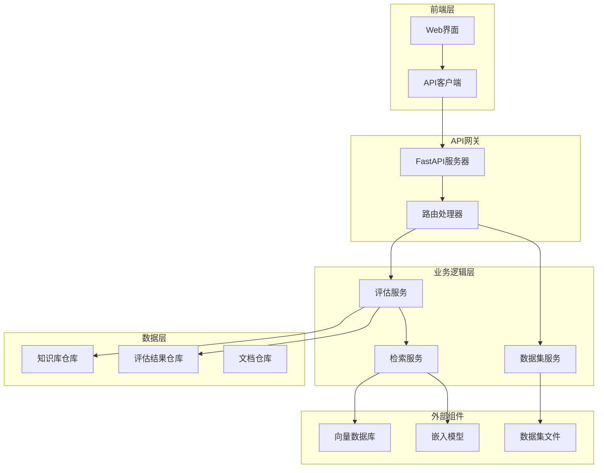
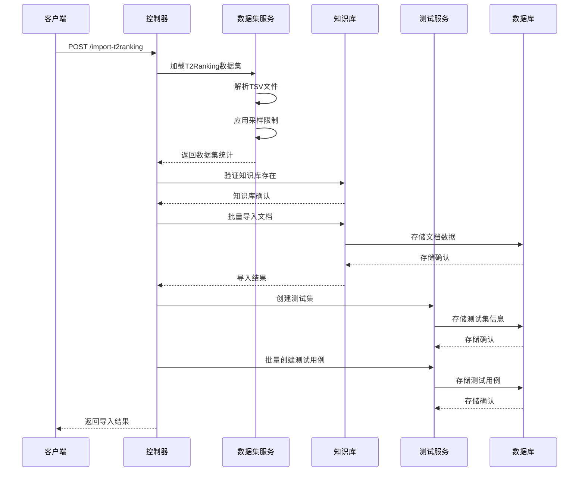
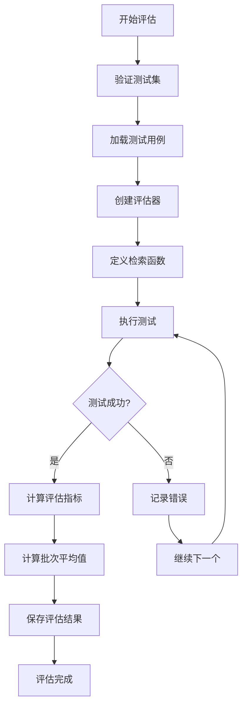
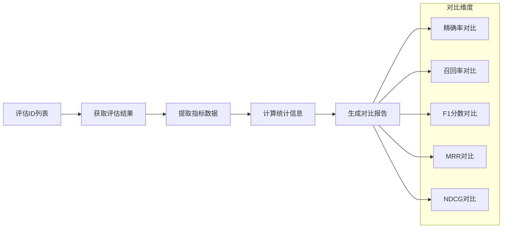
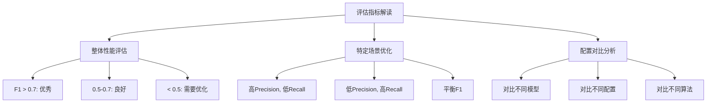
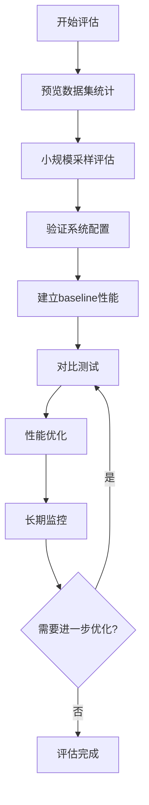

# 检索器评估API参考

<cite>
**本文档引用的文件**
- [retriever_evaluation.py](file://backend/app/controllers/retriever_evaluation.py)
- [retriever_evaluation.py](file://backend/app/services/retriever_evaluation.py)
- [retriever_evaluation.py](file://backend/app/models/retriever_evaluation.py)
- [api.ts](file://web/lib/api.ts)
- [test.py](file://backend/app/schemas/test.py)
- [dataset_loader.py](file://backend/app/services/dataset_loader.py)
- [README_RETRIEVER_EVAL.md](file://backend/README_RETRIEVER_EVAL.md)
</cite>

## 目录
1. [简介](#简介)
2. [系统架构](#系统架构)
3. [核心API接口](#核心api接口)
4. [数据集统计接口](#数据集统计接口)
5. [T2Ranking数据导入接口](#t2ranking数据导入接口)
6. [评估执行接口](#评估执行接口)
7. [评估历史查询接口](#评估历史查询接口)
8. [结果对比接口](#结果对比接口)
9. [评估指标详解](#评估指标详解)
10. [最佳实践指南](#最佳实践指南)
11. [故障排除](#故障排除)

## 简介

检索器评估系统是一个基于FastAPI构建的权威API框架，专门用于评估和对比不同检索器的性能。该系统支持T2Ranking等标准数据集，提供全面的信息检索质量评估能力，包括精确率、召回率、F1分数、MRR、MAP、NDCG等多种评估指标。

### 核心特性

- **标准化评估**：基于T2Ranking数据集的标准评估流程
- **多维度指标**：提供精确率、召回率、F1分数、MRR、MAP、NDCG等专业评估指标
- **灵活配置**：支持多种向量数据库和嵌入模型的对比测试
- **实时监控**：完整的评估历史记录和结果对比功能
- **性能优化**：智能采样机制，支持大规模数据集的高效评估

## 系统架构



**图表来源**
- [retriever_evaluation.py](file://backend/app/controllers/retriever_evaluation.py#L1-L375)
- [api.ts](file://web/lib/api.ts#L530-L670)

## 核心API接口

系统提供以下核心API接口，支持完整的检索器评估工作流程：

| 接口路径 | HTTP方法 | 功能描述 | 必需参数 |
|---------|----------|----------|----------|
| `/retriever-evaluation/dataset-statistics` | GET | 获取数据集统计信息 | collection_path, queries_path, qrels_path |
| `/retriever-evaluation/import-t2ranking` | POST | 导入T2Ranking数据集 | kb_id, test_set_name, collection_path等 |
| `/retriever-evaluation/evaluate` | POST | 执行检索器评估 | kb_id, test_set_id, top_k等 |
| `/retriever-evaluation/evaluation-history` | GET | 获取评估历史记录 | kb_id, page, page_size |
| `/retriever-evaluation/compare-evaluations` | GET | 对比多个评估结果 | evaluation_ids |

**章节来源**
- [retriever_evaluation.py](file://backend/app/controllers/retriever_evaluation.py#L161-L370)

## 数据集统计接口

### 接口说明

`GET /api/v1/retriever-evaluation/dataset-statistics` 用于获取T2Ranking数据集的统计信息，在导入前预览数据集规模，帮助决定是否需要采样优化。

### 查询参数

| 参数名 | 类型 | 必需 | 描述 | 示例值 |
|--------|------|------|------|--------|
| `collection_path` | string | ✓ | 文档集合TSV文件路径 | `/data/collection.tsv` |
| `queries_path` | string | ✓ | 查询TSV文件路径 | `/data/queries.dev.tsv` |
| `qrels_path` | string | ✓ | 相关性标注TSV文件路径 | `/data/qrels.dev.tsv` |
| `max_docs` | integer | ✗ | 最大文档数量限制（优化大数据集） | 10000 |
| `max_queries` | integer | ✗ | 最大查询数量限制（优化大数据集） | 100 |

### 返回值结构

```typescript
interface DatasetStatistics {
  total_documents: number;           // 总文档数
  total_queries: number;             // 总查询数
  total_query_doc_pairs: number;    // 查询-文档配对总数
  queries_with_relevant_docs: number; // 有相关文档的查询数
  avg_relevant_docs_per_query: number; // 每查询平均相关文档数
  max_relevant_docs: number;        // 单查询最多相关文档数
  min_relevant_docs: number;        // 单查询最少相关文档数
}
```

### 使用示例

```typescript
// TypeScript调用示例
const statistics = await retrieverEvalAPI.getDatasetStatistics(
  '/data/collection.tsv',
  '/data/queries.dev.tsv', 
  '/data/qrels.dev.tsv',
  100,  // max_queries
  10000 // max_docs
);

console.log(`总文档数: ${statistics.data.total_documents}`);
console.log(`平均相关文档数: ${statistics.data.avg_relevant_docs_per_query}`);
```

**章节来源**
- [retriever_evaluation.py](file://backend/app/controllers/retriever_evaluation.py#L161-L195)
- [test.py](file://backend/app/schemas/test.py#L276-L299)

## T2Ranking数据导入接口

### 接口说明

`POST /api/v1/retriever-evaluation/import-t2ranking` 用于导入T2Ranking数据集并创建相应的测试集和测试用例。

### 请求参数

| 参数名 | 类型 | 必需 | 描述 | 示例值 |
|--------|------|------|------|--------|
| `kb_id` | string | ✓ | 目标知识库ID（需要提前创建） | "kb_t2ranking" |
| `test_set_name` | string | ✓ | 测试集名称 | "T2Ranking检索测试集" |
| `collection_path` | string | ✓ | 文档集合文件路径 | "/path/to/collection.tsv" |
| `queries_path` | string | ✓ | 查询文件路径 | "/path/to/queries.dev.tsv" |
| `qrels_path` | string | ✓ | 相关性标注文件路径 | "/path/to/qrels.dev.tsv" |
| `max_docs` | integer | ✗ | 最大文档数量限制 | 10000 |
| `max_queries` | integer | ✗ | 最大查询数量限制 | 100 |
| `description` | string | ✗ | 测试集描述 | "T2Ranking开发集" |

### 导入流程



**图表来源**
- [retriever_evaluation.py](file://backend/app/controllers/retriever_evaluation.py#L26-L152)

### 返回值结构

```typescript
interface ImportResult {
  statistics: DatasetStatistics;           // 数据集统计信息
  kb_id: string;                          // 知识库ID
  documents: {
    total: number;                        // 总文档数
    created: number;                      // 创建成功的文档数
    failed: number;                       // 创建失败的文档数
    failed_records: Array<object>;        // 失败记录（最多10条）
  };
  test_set: {
    id: string;                           // 测试集ID
    name: string;                         // 测试集名称
    case_count: number;                   // 测试用例数量
  };
  test_cases: {
    total: number;                        // 总测试用例数
    created: number;                      // 创建成功的测试用例数
    failed: number;                       // 创建失败的测试用例数
    failed_records: Array<object>;        // 失败记录（最多10条）
  };
}
```

### 使用示例

```typescript
// TypeScript调用示例
const importResult = await retrieverEvalAPI.importT2ranking({
  kb_id: "kb_t2ranking",
  test_set_name: "T2Ranking开发集",
  collection_path: "/data/T2Ranking/collection.tsv",
  queries_path: "/data/T2Ranking/queries.dev.tsv",
  qrels_path: "/data/T2Ranking/qrels.dev.tsv",
  max_docs: 10000,
  max_queries: 100,
  description: "T2Ranking开发集，用于检索器评估"
});

console.log(`导入完成: ${importResult.data.documents.created}个文档, ${importResult.data.test_cases.created}个测试用例`);
```

**章节来源**
- [retriever_evaluation.py](file://backend/app/controllers/retriever_evaluation.py#L26-L152)
- [test.py](file://backend/app/schemas/test.py#L184-L209)

## 评估执行接口

### 接口说明

`POST /api/v1/retriever-evaluation/evaluate` 用于执行检索器评估，基于测试集对检索器进行全面评估，返回多个评估指标。

### 请求参数

| 参数名 | 类型 | 必需 | 默认值 | 描述 |
|--------|------|------|--------|------|
| `kb_id` | string | ✓ | - | 知识库ID |
| `test_set_id` | string | ✓ | - | 测试集ID |
| `top_k` | integer | ✗ | 10 | 检索返回的top-k数量（1-100） |
| `vector_db_type` | string | ✗ | - | 向量数据库类型 |
| `embedding_provider` | string | ✗ | - | 向量模型提供商 |
| `embedding_model` | string | ✗ | - | 向量模型名称 |
| `retrieval_algorithm` | string | ✗ | - | 检索算法配置 |

### 评估配置选项



**图表来源**
- [retriever_evaluation.py](file://backend/app/controllers/retriever_evaluation.py#L197-L295)

### 评估指标计算

系统基于`RetrieverEvaluator`类实现专业的评估指标计算：

#### 精确率 (Precision@K)
```
Precision@K = |检索到的相关文档| / |检索到的文档|
```

#### 召回率 (Recall@K)
```
Recall@K = |检索到的相关文档| / |所有相关文档|
```

#### F1分数
```
F1 = 2 * (Precision * Recall) / (Precision + Recall)
```

#### 平均倒数排名 (MRR)
```
MRR = 1 / rank_of_first_relevant_doc
```

#### 平均精度均值 (MAP)
```
MAP = (sum of P@k for each relevant doc) / |relevant docs|
```

#### 归一化折损累积增益 (NDCG)
```
NDCG = DCG / IDCG
DCG = Σ(rel_i / log2(i+1)) for i=1 to k
IDCG = 理想情况下的DCG
```

#### 命中率 (Hit Rate)
```
Hit Rate = 1 if 至少有一个相关文档被检索到, 0 otherwise
```

### 返回值结构

```typescript
interface RetrieverEvaluationResult {
  evaluation_id: string;              // 评估ID
  kb_id: string;                      // 知识库ID
  test_set_id: string;                // 测试集ID
  total_queries: number;              // 总查询数
  successful_queries: number;         // 成功执行的查询数
  failed_queries: number;             // 失败的查询数
  overall_metrics: {
    precision: number;                 // 精确率
    recall: number;                   // 召回率
    f1_score: number;                 // F1分数
    mrr: number;                      // MRR
    map: number;                      // MAP
    ndcg: number;                     // NDCG
    hit_rate: number;                 // 命中率
  };
  config: Record<string, any>;        // 评估配置
  created_at: string;                 // 创建时间
}
```

### 使用示例

```typescript
// TypeScript调用示例
const evaluationResult = await retrieverEvalAPI.evaluate({
  kb_id: "kb_001",
  test_set_id: "ts_001",
  top_k: 10,
  vector_db_type: "elasticsearch",
  embedding_provider: "ollama",
  embedding_model: "nomic-embed-text",
  retrieval_algorithm: "hybrid_search"
});

console.log(`评估完成，F1分数: ${evaluationResult.data.overall_metrics.f1_score}`);
console.log(`成功率: ${(evaluationResult.data.successful_queries / evaluationResult.data.total_queries * 100).toFixed(2)}%`);
```

**章节来源**
- [retriever_evaluation.py](file://backend/app/controllers/retriever_evaluation.py#L197-L295)
- [retriever_evaluation.py](file://backend/app/services/retriever_evaluation.py#L14-L423)
- [retriever_evaluation.py](file://backend/app/models/retriever_evaluation.py#L11-L60)

## 评估历史查询接口

### 接口说明

`GET /api/v1/retriever-evaluation/evaluation-history` 用于获取检索器评估历史记录，支持查看历史评估结果、对比不同配置的性能、分析性能变化趋势。

### 查询参数

| 参数名 | 类型 | 必需 | 默认值 | 描述 |
|--------|------|------|--------|------|
| `kb_id` | string | ✓ | - | 知识库ID |
| `test_set_id` | string | ✗ | - | 测试集ID（可选过滤） |
| `page` | integer | ✗ | 1 | 页码 |
| `page_size` | integer | ✗ | 20 | 每页大小 |

### 返回值结构

```typescript
interface EvaluationHistoryResponse {
  items: RetrieverEvaluationResult[];  // 评估结果列表
  total: number;                       // 总记录数
  page: number;                        // 当前页码
  page_size: number;                   // 每页大小
}
```

### 使用示例

```typescript
// TypeScript调用示例
const history = await retrieverEvalAPI.getEvaluationHistory(
  "kb_001",
  "ts_001",  // 可选的测试集ID
  1,         // 第一页
  20         // 每页20条
);

console.log(`共找到 ${history.data.total} 条评估记录`);
console.log(`第一页包含 ${history.data.items.length} 条记录`);

// 按F1分数排序
const sortedResults = history.data.items.sort((a, b) => 
  b.overall_metrics.f1_score - a.overall_metrics.f1_score
);
```

**章节来源**
- [retriever_evaluation.py](file://backend/app/controllers/retriever_evaluation.py#L297-L332)

## 结果对比接口

### 接口说明

`GET /api/v1/retriever-evaluation/compare-evaluations` 用于对比多个评估结果，支持A/B测试不同配置、可视化性能差异、选择最优配置。

### 查询参数

| 参数名 | 类型 | 必需 | 描述 | 示例值 |
|--------|------|------|------|--------|
| `evaluation_ids` | string | ✓ | 逗号分隔的评估ID列表 | "eval_001,eval_002,eval_003" |

### 对比功能



**图表来源**
- [retriever_evaluation.py](file://backend/app/controllers/retriever_evaluation.py#L334-L370)

### 返回值结构

```typescript
interface ComparisonResult {
  comparison: Array<{
    evaluation_id: string;
    metrics: {
      precision: number;
      recall: number;
      f1_score: number;
      mrr: number;
      map: number;
      ndcg: number;
      hit_rate: number;
    };
    config: Record<string, any>;
  }>;
  evaluation_ids: string[];  // 评估ID列表
}
```

### 使用示例

```typescript
// TypeScript调用示例
const comparison = await retrieverEvalAPI.compareEvaluations([
  "eval_001",  // 基线配置
  "eval_002",  // 新配置
  "eval_003"   // 其他配置
]);

console.log("评估对比结果:");
comparison.data.comparison.forEach(item => {
  console.log(`${item.evaluation_id}:`);
  console.log(`  F1分数: ${item.metrics.f1_score.toFixed(3)}`);
  console.log(`  NDCG: ${item.metrics.ndcg.toFixed(3)}`);
  console.log(`  配置: ${JSON.stringify(item.config)}`);
});
```

**章节来源**
- [retriever_evaluation.py](file://backend/app/controllers/retriever_evaluation.py#L334-L370)

## 评估指标详解

### 核心评估指标

#### 1. 精确率 (Precision@K)
- **定义**: 检索结果中相关文档的比例
- **公式**: Precision@K = |检索到的相关文档| / |检索到的文档|
- **业务含义**: 衡量检索结果的质量，值越高表示返回的结果越准确
- **适用场景**: 关注结果准确性，容错率较低的应用

#### 2. 召回率 (Recall@K)
- **定义**: 相关文档被检索到的比例
- **公式**: Recall@K = |检索到的相关文档| / |所有相关文档|
- **业务含义**: 衡量检索的完整性，值越高表示覆盖的相关信息越多
- **适用场景**: 关注不漏检，重要信息不能丢失的应用

#### 3. F1分数 (F1-Score)
- **定义**: 精确率和召回率的调和平均
- **公式**: F1 = 2 * (Precision * Recall) / (Precision + Recall)
- **业务含义**: 综合考虑精确率和召回率的平衡指标
- **适用场景**: 需要在准确性和完整性之间找到平衡的场景

#### 4. 平均倒数排名 (MRR)
- **定义**: 第一个相关文档的排名倒数
- **公式**: MRR = 1 / rank_of_first_relevant_doc
- **业务含义**: 衡量相关结果在检索列表中的位置
- **适用场景**: 单答案场景，关注第一个正确结果的位置

#### 5. 平均精度均值 (MAP)
- **定义**: 所有相关文档位置的平均精度
- **公式**: MAP = (sum of P@k for each relevant doc) / |relevant docs|
- **业务含义**: 考虑所有相关结果的综合指标
- **适用场景**: 多答案场景，需要考虑整体检索质量

#### 6. 归一化折损累积增益 (NDCG)
- **定义**: 考虑排序位置的综合指标
- **公式**: NDCG = DCG / IDCG
- **业务含义**: 衡量检索结果质量和排序质量的综合指标
- **适用场景**: 需要同时考虑相关性和排序位置的场景

#### 7. 命中率 (Hit Rate)
- **定义**: 至少检索到一个相关文档的查询比例
- **公式**: Hit Rate = 1 if 至少有一个相关文档被检索到, 0 otherwise
- **业务含义**: 衡量检索器的基本可用性
- **适用场景**: 关注检索器是否能返回任何相关结果

### 指标解读指南



**图表来源**
- [retriever_evaluation.py](file://backend/app/services/retriever_evaluation.py#L14-L423)

**章节来源**
- [README_RETRIEVER_EVAL.md](file://backend/README_RETRIEVER_EVAL.md#L14-L21)
- [retriever_evaluation.py](file://backend/app/services/retriever_evaluation.py#L14-L423)

## 最佳实践指南

### 数据集优化策略

#### 1. 采样配置建议

```typescript
// 推荐的采样配置
const samplingConfig = {
  max_queries: 100,    // 初始评估使用100个查询
  max_docs: null,      // 自动根据查询采样相关文档
  top_k: 10,          // 常用top_k值
  page_size: 20       // 分页大小
};
```

#### 2. 评估流程建议



**图表来源**
- [README_RETRIEVER_EVAL.md](file://backend/README_RETRIEVER_EVAL.md#L203-L217)

#### 3. 性能优化建议

- **初始评估**: 从50-100个查询开始，快速验证系统配置
- **对比测试**: 固定测试集，只改变单一变量（如embedding模型）
- **指标关注**: 重点关注F1-Score和NDCG，平衡精确率和召回率
- **配置调整**: 根据评估结果调整top_k、阈值等参数

### 常见配置模式

#### 模式1: 基线建立
```typescript
// 建立基线配置
const baselineConfig = {
  top_k: 10,
  vector_db_type: "elasticsearch",
  embedding_model: "nomic-embed-text",
  retrieval_algorithm: "bm25"
};
```

#### 模式2: 模型对比
```typescript
// 对比不同embedding模型
const modelComparison = [
  { id: "model_a", model: "nomic-embed-text" },
  { id: "model_b", model: "sentence-transformers" },
  { id: "model_c", model: "openai-ada" }
];
```

#### 模式3: 算法优化
```typescript
// 优化检索算法
const algorithmOptimization = [
  { id: "bm25", algorithm: "bm25" },
  { id: "hybrid", algorithm: "hybrid_search" },
  { id: "dense", algorithm: "dense_only" }
];
```

**章节来源**
- [README_RETRIEVER_EVAL.md](file://backend/README_RETRIEVER_EVAL.md#L185-L239)

## 故障排除

### 常见问题及解决方案

#### 1. 数据集导入失败

**问题症状**:
- 文件路径错误
- 数据格式不正确
- 内存不足

**解决方案**:
```typescript
// 检查文件路径
const filePath = '/data/T2Ranking/collection.tsv';
const fileExists = await checkFileExists(filePath);
if (!fileExists) {
  console.error('文件不存在，请检查路径');
}

// 使用采样优化大数据集
const importResult = await retrieverEvalAPI.importT2ranking({
  kb_id: "kb_t2ranking",
  collection_path: filePath,
  max_queries: 50,  // 减少查询数量
  max_docs: 1000    // 限制文档数量
});
```

#### 2. 评估执行超时

**问题症状**:
- 检索过程耗时过长
- 内存使用过高
- 评估结果不完整

**解决方案**:
```typescript
// 优化评估配置
const optimizedConfig = {
  top_k: 5,           // 减少top_k值
  max_queries: 50,    // 减少查询数量
  batch_size: 10,     // 减少批处理大小
  timeout: 300        // 设置超时时间
};

// 分批执行评估
const batches = splitIntoBatches(testCases, optimizedConfig.batch_size);
for (const batch of batches) {
  await executeEvaluationBatch(batch, optimizedConfig);
}
```

#### 3. 评估指标异常

**问题症状**:
- 指标值异常高或低
- 结果不稳定
- 不同运行结果差异大

**解决方案**:
```typescript
// 检查评估配置一致性
const configConsistency = {
  embedding_model: "nomic-embed-text",
  vector_db_type: "elasticsearch",
  chunk_size: 500,
  overlap: 50
};

// 重复执行评估验证稳定性
const runs = [];
for (let i = 0; i < 3; i++) {
  const result = await retrieverEvalAPI.evaluate(configConsistency);
  runs.push(result.data.overall_metrics);
}

// 计算指标的稳定性
const stability = calculateStability(runs);
if (stability < 0.9) {
  console.warn('评估结果不稳定，可能需要检查数据质量');
}
```

### 调试工具和技巧

#### 1. 日志分析
```typescript
// 启用详细日志
const debugConfig = {
  log_level: "DEBUG",
  enable_profiling: true,
  save_detailed_results: true
};

// 分析评估过程
const detailedResult = await retrieverEvalAPI.evaluate({
  ...baseConfig,
  ...debugConfig
});

// 检查失败的查询
const failedQueries = detailedResult.data.detailed_results
  .filter(r => r.error)
  .map(r => ({ query: r.query, error: r.error }));
```

#### 2. 性能监控
```typescript
// 监控评估性能
const performanceMetrics = {
  total_queries: detailedResult.data.total_queries,
  successful_queries: detailedResult.data.successful_queries,
  failed_queries: detailedResult.data.failed_queries,
  average_time: calculateAverageTime(detailedResult.data.detailed_results),
  memory_usage: monitorMemoryUsage()
};

console.log(`评估性能: ${performanceMetrics.average_time}ms/query`);
```

**章节来源**
- [README_RETRIEVER_EVAL.md](file://backend/README_RETRIEVER_EVAL.md#L280-L296)
- [retriever_evaluation.py](file://backend/app/controllers/retriever_evaluation.py#L297-L370)

## 总结

检索器评估API提供了完整的检索器性能评估解决方案，通过标准化的评估流程和专业的评估指标，帮助开发者和研究人员：

- **快速验证**：通过小规模采样快速验证系统配置
- **深度对比**：支持多维度、多配置的深度对比分析
- **持续优化**：提供完整的评估历史和趋势分析
- **专业指标**：基于信息检索领域的专业评估指标

系统的设计充分考虑了实际应用中的各种场景需求，从简单的配置验证到复杂的性能优化，都能提供有力的支持。通过合理的配置和最佳实践，可以充分发挥检索器的潜力，提升整体系统的检索质量。