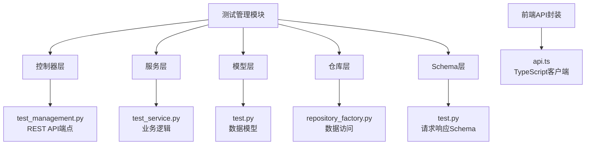
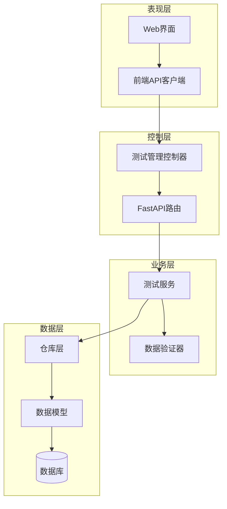
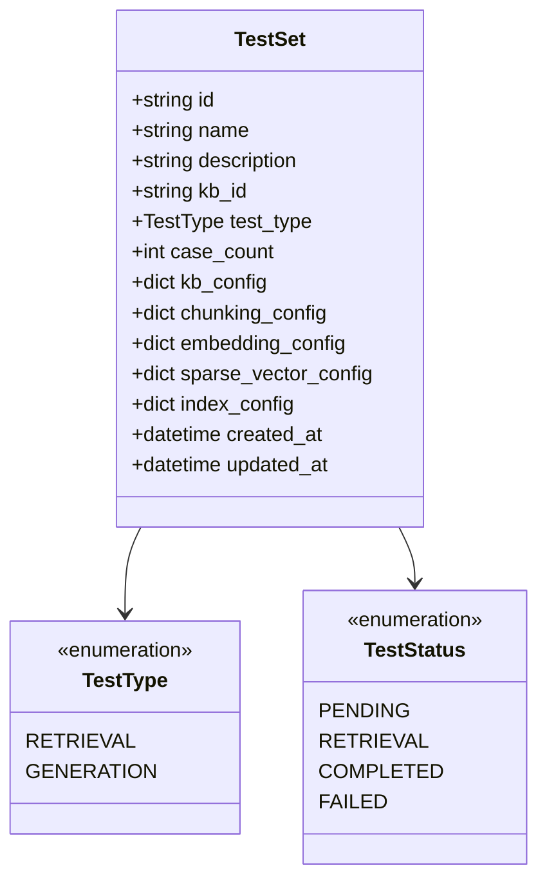
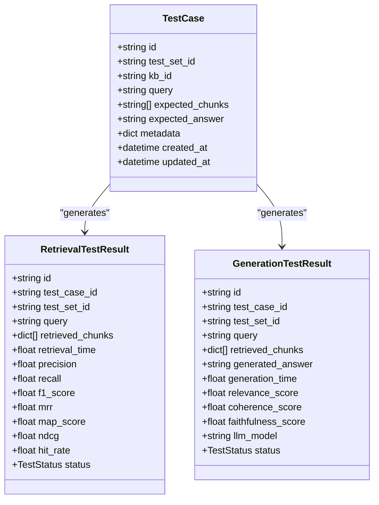
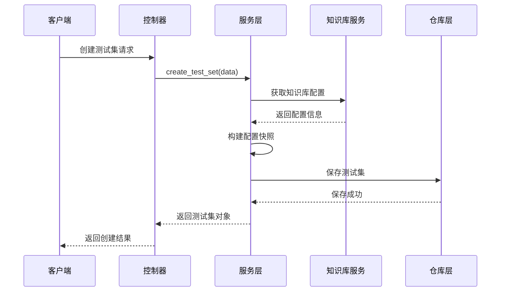
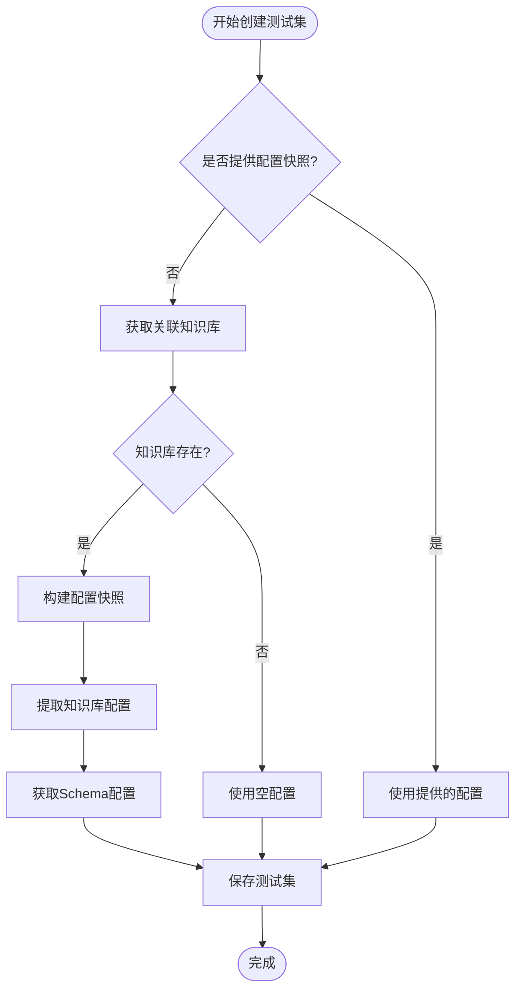
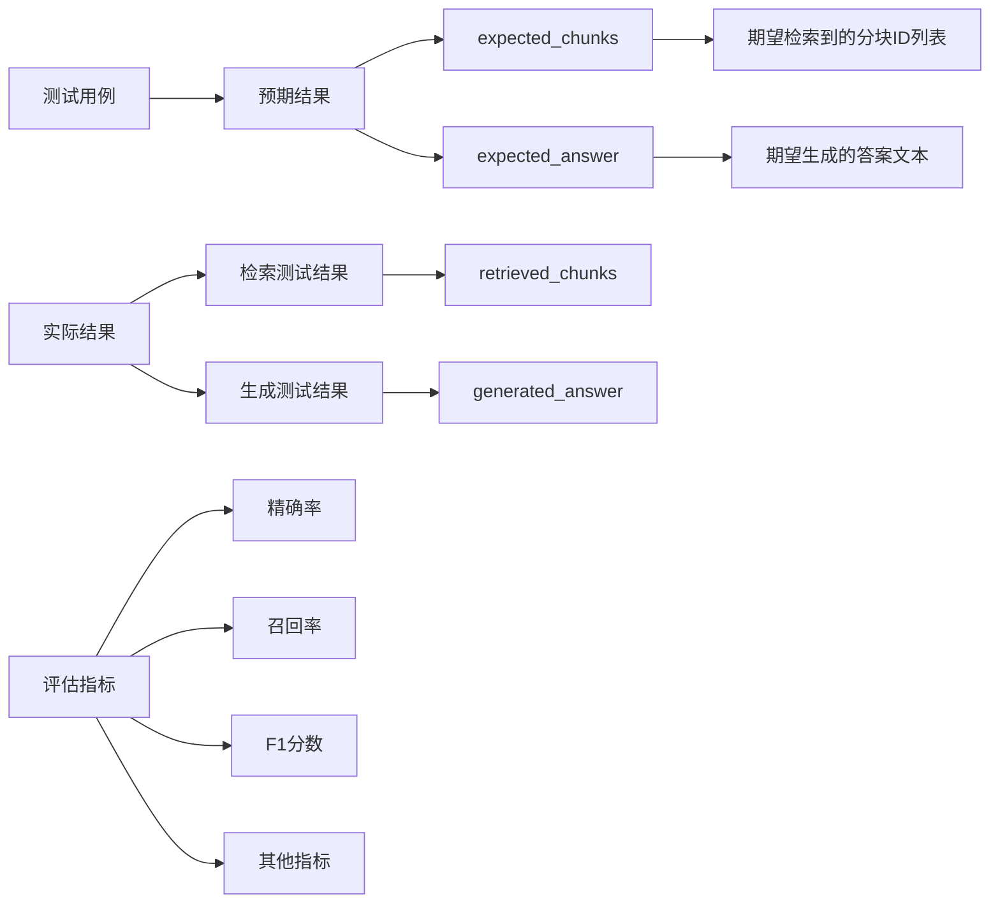
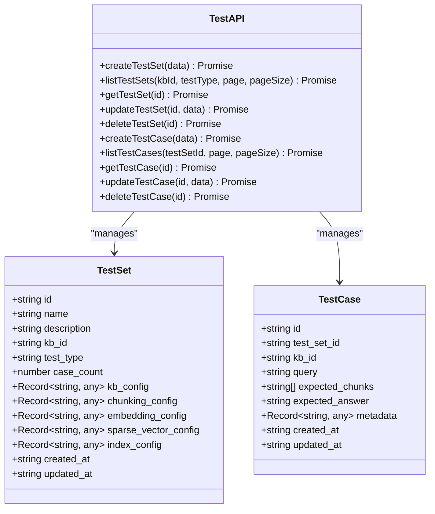
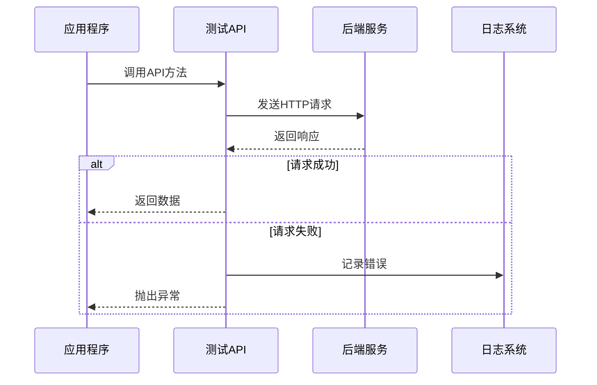
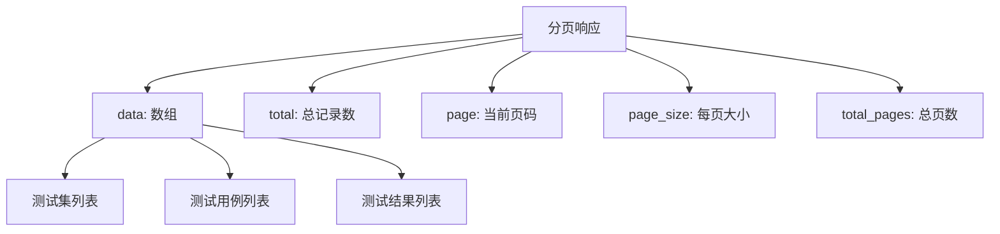

# 测试管理API

<cite>
**本文档引用的文件**
- [test_management.py](file://backend/app/controllers/test_management.py)
- [test.py](file://backend/app/models/test.py)
- [test.py](file://backend/app/schemas/test.py)
- [test_service.py](file://backend/app/services/test_service.py)
- [api.ts](file://web/lib/api.ts)
- [README_TEST.md](file://backend/README_TEST.md)
</cite>

## 目录
1. [简介](#简介)
2. [项目结构](#项目结构)
3. [核心组件](#核心组件)
4. [架构概览](#架构概览)
5. [详细组件分析](#详细组件分析)
6. [API端点详解](#api端点详解)
7. [测试配置快照机制](#测试配置快照机制)
8. [测试用例与预期结果关联](#测试用例与预期结果关联)
9. [前端测试API封装](#前端测试api封装)
10. [分页查询和过滤参数](#分页查询和过滤参数)
11. [代码示例](#代码示例)
12. [故障排除指南](#故障排除指南)
13. [总结](#总结)

## 简介

RAG Studio的测试管理模块提供了完整的测试集（TestSet）和测试用例（TestCase）生命周期管理功能。该模块支持检索测试（retrieval）和生成测试（generation）两种类型的测试，具有完善的配置快照保存机制和预期结果关联功能。

测试管理模块采用分层架构设计，包含控制器层、服务层、模型层和仓库层，确保了良好的代码组织和可维护性。通过RESTful API接口，用户可以创建、查询、更新和删除测试集及测试用例，同时支持批量操作和分页查询。

## 项目结构

测试管理模块的文件组织遵循标准的FastAPI项目结构：



**图表来源**
- [test_management.py](file://backend/app/controllers/test_management.py#L1-L534)
- [test_service.py](file://backend/app/services/test_service.py#L1-L374)
- [test.py](file://backend/app/models/test.py#L1-L227)

**章节来源**
- [test_management.py](file://backend/app/controllers/test_management.py#L1-L50)
- [test_service.py](file://backend/app/services/test_service.py#L1-L50)

## 核心组件

测试管理模块包含以下核心组件：

### 测试集（TestSet）
- **名称和描述**：测试集的基本标识信息
- **知识库关联**：与特定知识库的绑定关系
- **测试类型**：检索测试（retrieval）或生成测试（generation）
- **配置快照**：保存创建时的完整配置信息
- **统计信息**：包含测试用例数量等元数据

### 测试用例（TestCase）
- **查询问题**：测试的具体问题或查询语句
- **预期结果**：期望的检索结果分块ID列表
- **期望答案**：期望的生成答案文本
- **元数据**：额外的测试相关信息

### 配置快照系统
- **kb_config**：知识库配置快照
- **chunking_config**：分块策略配置
- **embedding_config**：嵌入模型参数配置
- **sparse_vector_config**：稀疏向量参数配置
- **index_config**：索引配置

**章节来源**
- [test.py](file://backend/app/models/test.py#L26-L113)
- [test.py](file://backend/app/schemas/test.py#L11-L90)

## 架构概览

测试管理模块采用经典的三层架构模式：



**图表来源**
- [test_management.py](file://backend/app/controllers/test_management.py#L27-L30)
- [test_service.py](file://backend/app/services/test_service.py#L24-L32)

## 详细组件分析

### 测试集模型分析

测试集模型包含了完整的配置快照机制：



**图表来源**
- [test.py](file://backend/app/models/test.py#L26-L81)
- [test.py](file://backend/app/models/test.py#L12-L24)

### 测试用例模型分析

测试用例模型展示了预期结果与实际结果的关联：



**图表来源**
- [test.py](file://backend/app/models/test.py#L83-L113)
- [test.py](file://backend/app/models/test.py#L115-L227)

**章节来源**
- [test.py](file://backend/app/models/test.py#L26-L227)

## API端点详解

### 测试集管理端点

#### 创建测试集
- **端点**: `POST /api/v1/tests/test-sets`
- **功能**: 创建新的测试集，支持配置快照
- **参数**: 
  - `name`: 测试集名称（必填）
  - `description`: 测试集描述（可选）
  - `kb_id`: 关联的知识库ID（必填）
  - `test_type`: 测试类型（retrieval/generation，必填）
  - `kb_config`: 知识库配置快照（可选）
  - `chunking_config`: 分块策略配置（可选）
  - `embedding_config`: 嵌入模型参数配置（可选）
  - `sparse_vector_config`: 稀疏向量参数配置（可选）
  - `index_config`: 索引配置（可选）

#### 获取测试集列表
- **端点**: `GET /api/v1/tests/test-sets`
- **功能**: 分页获取测试集列表，支持过滤
- **参数**:
  - `kb_id`: 知识库ID筛选（可选）
  - `test_type`: 测试类型筛选（可选）
  - `page`: 页码（默认1，最小1）
  - `page_size`: 每页大小（默认20，范围1-100）

#### 获取测试集详情
- **端点**: `GET /api/v1/tests/test-sets/{test_set_id}`
- **功能**: 获取指定测试集的详细信息

#### 更新测试集
- **端点**: `PUT /api/v1/tests/test-sets/{test_set_id}`
- **功能**: 更新测试集信息
- **参数**: `name`、`description`（可选）

#### 删除测试集
- **端点**: `DELETE /api/v1/tests/test-sets/{test_set_id}`
- **功能**: 删除测试集，级联删除所有关联的测试用例

### 测试用例管理端点

#### 创建测试用例
- **端点**: `POST /api/v1/tests/test-cases`
- **功能**: 创建新的测试用例
- **参数**:
  - `test_set_id`: 所属测试集ID（必填）
  - `query`: 测试问题（必填）
  - `expected_chunks`: 期望检索到的分块ID列表（可选）
  - `expected_answer`: 期望的答案（可选）
  - `metadata`: 测试用例元数据（可选）

#### 获取测试用例列表
- **端点**: `GET /api/v1/tests/test-cases`
- **功能**: 分页获取测试集的测试用例列表
- **参数**:
  - `test_set_id`: 测试集ID（必填）
  - `page`: 页码（默认1）
  - `page_size`: 每页大小（默认20）

#### 获取测试用例详情
- **端点**: `GET /api/v1/tests/test-cases/{test_case_id}`
- **功能**: 获取指定测试用例的详细信息

#### 更新测试用例
- **端点**: `PUT /api/v1/tests/test-cases/{test_case_id}`
- **功能**: 更新测试用例信息
- **参数**: `query`、`expected_chunks`、`expected_answer`、`metadata`（可选）

#### 删除测试用例
- **端点**: `DELETE /api/v1/tests/test-cases/{test_case_id}`
- **功能**: 删除测试用例

### 测试执行端点

#### 执行检索测试
- **端点**: `POST /api/v1/tests/retrieval/run`
- **功能**: 执行检索测试
- **参数**: `test_case_id`或`test_set_id`（二选一）

#### 获取检索测试结果
- **端点**: `GET /api/v1/tests/retrieval/results`
- **功能**: 获取检索测试结果列表
- **参数**: `test_set_id`（必填）、`page`、`page_size`

#### 获取生成测试结果
- **端点**: `GET /api/v1/tests/generation/results`
- **功能**: 获取生成测试结果列表
- **参数**: `test_set_id`（必填）、`page`、`page_size`

**章节来源**
- [test_management.py](file://backend/app/controllers/test_management.py#L32-L534)

## 测试配置快照机制

测试配置快照是测试管理模块的重要特性，它确保了测试的可重现性和一致性。

### 配置快照保存流程



**图表来源**
- [test_service.py](file://backend/app/services/test_service.py#L35-L89)
- [test_management.py](file://backend/app/controllers/test_management.py#L32-L68)

### 配置快照字段说明

| 字段名 | 类型 | 描述 | 示例值 |
|--------|------|------|--------|
| `kb_config` | Dict[str, Any] | 知识库配置快照 | 包含vector_db_type、embedding_provider、embedding_model等 |
| `chunking_config` | Dict[str, Any] | 分块策略配置 | chunk_size、chunk_overlap、method等 |
| `embedding_config` | Dict[str, Any] | 嵌入模型参数配置 | provider、model、dimension等 |
| `sparse_vector_config` | Dict[str, Any] | 稀疏向量参数配置 | method、k1、b等 |
| `index_config` | Dict[str, Any] | 索引配置 | schema_fields、vector_db_type等 |

### 自动配置获取机制

当创建测试集时不提供配置快照时，系统会自动从关联的知识库获取配置：



**图表来源**
- [test_service.py](file://backend/app/services/test_service.py#L35-L89)

**章节来源**
- [test_service.py](file://backend/app/services/test_service.py#L35-L89)
- [test.py](file://backend/app/models/test.py#L38-L58)

## 测试用例与预期结果关联

测试用例与预期结果的关联是测试评估的核心机制。

### 预期结果类型



**图表来源**
- [test.py](file://backend/app/models/test.py#L83-L113)

### 预期结果关联方式

1. **检索测试**：
   - `expected_chunks`: 期望检索到的文档分块ID列表
   - 系统会比较实际检索到的分块与期望分块，计算检索指标

2. **生成测试**：
   - `expected_answer`: 期望的答案文本
   - 系统会比较生成的答案与期望答案，计算生成质量指标

### 评估指标计算

系统支持多种评估指标：

| 检索指标 | 描述 | 计算公式 |
|----------|------|----------|
| 精确率（Precision） | 检索到的相关文档比例 | Precision = 相关文档数 / 总检索文档数 |
| 召回率（Recall） | 检索到的相关文档占总相关文档的比例 | Recall = 相关文档数 / 总相关文档数 |
| F1分数 | 精确率和召回率的调和平均数 | F1 = 2 × (Precision × Recall) / (Precision + Recall) |
| MRR（Mean Reciprocal Rank） | 平均倒数排名 | MRR = 1/N × Σ(1/rank_i) |
| NDCG（Normalized Discounted Cumulative Gain） | 归一化折损累积增益 | NDCG = DCG / IDCG |

| 生成指标 | 描述 | 计算方式 |
|----------|------|----------|
| 相关性分数 | 生成答案与问题的相关程度 | 基于语义相似度计算 |
| 连贯性分数 | 答案的逻辑连贯程度 | 基于语言模型评估 |
| 忠实度分数 | 答案与检索内容的一致程度 | 基于事实验证 |

**章节来源**
- [test.py](file://backend/app/models/test.py#L115-L227)
- [test_service.py](file://backend/app/services/test_service.py#L340-L374)

## 前端测试API封装

前端通过`web/lib/api.ts`文件提供了完整的测试API封装，便于TypeScript应用调用。

### 测试API接口定义



**图表来源**
- [api.ts](file://web/lib/api.ts#L367-L527)

### 主要API方法

#### 测试集管理方法
- `createTestSet(data)`: 创建测试集
- `listTestSets(kbId, testType, page, pageSize)`: 获取测试集列表
- `getTestSet(id)`: 获取测试集详情
- `updateTestSet(id, data)`: 更新测试集
- `deleteTestSet(id)`: 删除测试集

#### 测试用例管理方法
- `createTestCase(data)`: 创建测试用例
- `listTestCases(testSetId, page, pageSize)`: 获取测试用例列表
- `getTestCase(id)`: 获取测试用例详情
- `updateTestCase(id, data)`: 更新测试用例
- `deleteTestCase(id)`: 删除测试用例

### 错误处理机制

前端API封装包含了完整的错误处理：



**图表来源**
- [api.ts](file://web/lib/api.ts#L22-L57)

**章节来源**
- [api.ts](file://web/lib/api.ts#L367-L527)

## 分页查询和过滤参数

测试管理API支持灵活的分页查询和过滤功能。

### 分页参数

| 参数名 | 类型 | 默认值 | 范围 | 描述 |
|--------|------|--------|------|------|
| `page` | int | 1 | ≥1 | 页码 |
| `page_size` | int | 20 | 1-100 | 每页记录数 |

### 过滤参数

#### 测试集过滤
| 参数名 | 类型 | 描述 | 示例 |
|--------|------|------|------|
| `kb_id` | string | 知识库ID筛选 | `"kb_001"` |
| `test_type` | string | 测试类型筛选 | `"retrieval"` 或 `"generation"` |

#### 测试用例过滤
| 参数名 | 类型 | 描述 | 示例 |
|--------|------|------|------|
| `test_set_id` | string | 测试集ID（必填） | `"ts_001"` |

### 分页响应格式



### 使用示例

#### 获取测试集列表（带过滤）
```typescript
// 获取特定知识库的检索测试集
const testSets = await testAPI.listTestSets(
  "kb_001",           // kb_id
  "retrieval",        // test_type
  1,                  // page
  20                  // page_size
);
```

#### 获取测试用例列表
```typescript
// 获取测试集的所有测试用例
const testCases = await testAPI.listTestCases(
  "ts_001",           // test_set_id
  1,                  // page
  20                  // page_size
);
```

**章节来源**
- [test_management.py](file://backend/app/controllers/test_management.py#L83-L112)
- [test_management.py](file://backend/app/controllers/test_management.py#L281-L311)

## 代码示例

以下是构建测试数据集的完整代码示例：

### 创建测试集和测试用例

```typescript
// 创建测试集
const createTestSetExample = async () => {
  try {
    // 创建测试集
    const testSetResult = await testAPI.createTestSet({
      name: "Python编程测试集",
      description: "针对Python编程知识的检索测试",
      kb_id: "kb_python",
      test_type: "retrieval",
      kb_config: {
        vector_db_type: "qdrant",
        embedding_provider: "ollama",
        embedding_model: "bge-m3:latest"
      },
      chunking_config: {
        method: "fixed_size",
        chunk_size: 500,
        chunk_overlap: 50
      }
    });
    
    if (testSetResult.success && testSetResult.data.id) {
      const testSetId = testSetResult.data.id;
      
      // 创建测试用例
      const testCaseResult = await testAPI.createTestCase({
        test_set_id: testSetId,
        query: "如何定义Python类？",
        expected_chunks: ["chunk_001", "chunk_002"],
        expected_answer: "在Python中使用class关键字定义类，语法为：class ClassName:\n    def __init__(self, ...):\n        # 初始化代码\n    def method_name(self, ...):\n        # 方法代码",
        metadata: {
          difficulty: "beginner",
          category: "syntax"
        }
      });
      
      console.log("测试集创建成功:", testSetResult.data);
      console.log("测试用例创建成功:", testCaseResult.data);
    }
  } catch (error) {
    console.error("创建测试失败:", error);
  }
};
```

### 批量创建测试用例

```typescript
// 批量创建测试用例
const batchCreateTestCases = async (testSetId: string) => {
  const testCasesData = [
    {
      query: "Python装饰器的作用是什么？",
      expected_chunks: ["chunk_003", "chunk_004"],
      expected_answer: "Python装饰器是一种特殊类型的函数，它可以修改其他函数的行为。装饰器通常用于添加功能、修改输入输出、实现缓存、日志记录等。",
      metadata: { difficulty: "intermediate", category: "advanced" }
    },
    {
      query: "如何处理Python中的异常？",
      expected_chunks: ["chunk_005", "chunk_006"],
      expected_answer: "Python使用try-except语句处理异常。基本语法为：\ntry:\n    # 可能抛出异常的代码\nexcept ExceptionType:\n    # 异常处理代码\nfinally:\n    # 无论是否异常都会执行的代码",
      metadata: { difficulty: "beginner", category: "error_handling" }
    }
  ];
  
  try {
    // 批量创建测试用例
    const batchResult = await testAPI.batchCreateTestCases(testSetId, testCasesData);
    console.log("批量创建结果:", batchResult);
  } catch (error) {
    console.error("批量创建失败:", error);
  }
};
```

### 执行测试并获取结果

```typescript
// 执行检索测试
const runRetrievalTest = async (testSetId: string) => {
  try {
    // 执行测试
    const result = await testAPI.runRetrievalTest({
      test_set_id: testSetId,
      top_k: 10,
      score_threshold: 0.7
    });
    
    console.log("测试执行结果:", result);
    
    // 获取测试结果
    const results = await testAPI.listRetrievalTestResults(testSetId);
    console.log("测试结果列表:", results.data);
  } catch (error) {
    console.error("执行测试失败:", error);
  }
};
```

### 分页查询测试用例

```typescript
// 分页查询测试用例
const listTestCasesWithPagination = async (testSetId: string) => {
  let page = 1;
  const pageSize = 10;
  let allTestCases: TestCase[] = [];
  
  try {
    while (true) {
      const result = await testAPI.listTestCases(testSetId, page, pageSize);
      
      if (result.success) {
        allTestCases = [...allTestCases, ...result.data];
        
        if (result.page * pageSize >= result.total) {
          break; // 已获取所有页
        }
        
        page++;
      } else {
        throw new Error("获取测试用例失败");
      }
    }
    
    console.log(`共获取 ${allTestCases.length} 个测试用例`);
    return allTestCases;
  } catch (error) {
    console.error("分页查询失败:", error);
    return [];
  }
};
```

### 错误处理示例

```typescript
// 带错误处理的测试操作
const robustTestOperations = async () => {
  try {
    // 创建测试集
    const testSetResult = await testAPI.createTestSet({
      name: "robust_test_set",
      kb_id: "existing_kb_id",
      test_type: "retrieval"
    });
    
    if (!testSetResult.success) {
      throw new Error(`创建测试集失败: ${testSetResult.message}`);
    }
    
    const testSetId = testSetResult.data.id;
    
    // 创建测试用例
    const testCaseResult = await testAPI.createTestCase({
      test_set_id: testSetId,
      query: "测试问题",
      expected_chunks: ["chunk_001"]
    });
    
    if (!testCaseResult.success) {
      throw new Error(`创建测试用例失败: ${testCaseResult.message}`);
    }
    
    // 获取测试用例详情
    const testCaseDetail = await testAPI.getTestCase(testCaseResult.data.id);
    if (!testCaseDetail.success) {
      throw new Error(`获取测试用例详情失败: ${testCaseDetail.message}`);
    }
    
    console.log("所有操作成功完成");
    
  } catch (error) {
    console.error("测试操作失败:", error.message);
    // 可以在这里添加重试逻辑或清理操作
  }
};
```

**章节来源**
- [api.ts](file://web/lib/api.ts#L371-L527)

## 故障排除指南

### 常见问题及解决方案

#### 1. 测试集创建失败

**问题症状**：
- API返回404错误，提示"知识库不存在"
- 创建测试集时配置快照为空

**解决方案**：
```typescript
// 检查知识库是否存在
const checkKnowledgeBase = async (kbId: string) => {
  try {
    const kbResult = await knowledgeBaseAPI.get(kbId);
    if (!kbResult.success) {
      console.error(`知识库 ${kbId} 不存在`);
      return false;
    }
    return true;
  } catch (error) {
    console.error("检查知识库失败:", error);
    return false;
  }
};

// 创建测试集前验证
const createTestSetWithValidation = async (data: any) => {
  const isValid = await checkKnowledgeBase(data.kb_id);
  if (!isValid) {
    throw new Error("无法创建测试集：关联的知识库不存在");
  }
  
  return await testAPI.createTestSet(data);
};
```

#### 2. 测试用例关联失败

**问题症状**：
- 创建测试用例时提示"测试集不存在"
- 测试用例查询不到

**解决方案**：
```typescript
// 验证测试集存在性
const validateTestSetExists = async (testSetId: string) => {
  try {
    const result = await testAPI.getTestSet(testSetId);
    if (!result.success) {
      throw new Error(`测试集 ${testSetId} 不存在`);
    }
    return true;
  } catch (error) {
    console.error("验证测试集失败:", error);
    return false;
  }
};
```

#### 3. 分页查询问题

**问题症状**：
- 分页查询总是返回相同的数据
- 总记录数不准确

**解决方案**：
```typescript
// 正确的分页查询实现
const getPaginatedTestCases = async (testSetId: string, page: number = 1, pageSize: number = 20) => {
  try {
    const result = await testAPI.listTestCases(testSetId, page, pageSize);
    
    if (!result.success) {
      throw new Error(`获取测试用例失败: ${result.message}`);
    }
    
    console.log(`第 ${page} 页，共 ${result.total} 条记录，${result.total_pages} 页`);
    return result;
    
  } catch (error) {
    console.error("分页查询失败:", error);
    return null;
  }
};
```

#### 4. 配置快照问题

**问题症状**：
- 测试集创建时配置为空
- 配置快照不一致

**解决方案**：
```typescript
// 手动提供配置快照
const createTestSetWithManualConfig = async (data: any) => {
  // 提供完整的配置快照
  const completeConfig = {
    kb_config: {
      vector_db_type: "qdrant",
      embedding_provider: "ollama",
      embedding_model: "bge-m3:latest",
      embedding_dimension: 1024,
      vector_db_config: {}
    },
    chunking_config: {
      method: "fixed_size",
      chunk_size: 500,
      chunk_overlap: 50
    },
    embedding_config: {
      provider: "ollama",
      model: "bge-m3:latest",
      dimension: 1024
    },
    sparse_vector_config: {
      method: "bm25",
      k1: 1.2,
      b: 0.75
    },
    index_config: {
      schema_fields: [],
      vector_db_type: "qdrant"
    }
  };
  
  return await testAPI.createTestSet({
    ...data,
    ...completeConfig
  });
};
```

### 调试技巧

#### 1. 启用详细日志
```typescript
// 设置调试模式
const enableDebugMode = () => {
  // 在前端控制台启用详细日志
  console.log("测试管理API调试模式已启用");
  
  // 监听API调用
  const originalMethods = {};
  const apiMethods = ['createTestSet', 'listTestSets', 'createTestCase', 'listTestCases'];
  
  apiMethods.forEach(method => {
    originalMethods[method] = testAPI[method];
    testAPI[method] = async (...args) => {
      console.log(`调用 ${method}(${JSON.stringify(args)})`);
      const result = await originalMethods[method].apply(testAPI, args);
      console.log(`${method} 结果:`, result);
      return result;
    };
  });
};
```

#### 2. 数据验证工具
```typescript
// 测试数据验证
const validateTestData = (data: any, type: 'testSet' | 'testCase') => {
  const errors: string[] = [];
  
  if (type === 'testSet') {
    if (!data.name || data.name.length < 1 || data.name.length > 100) {
      errors.push('名称长度必须在1-100字符之间');
    }
    if (!data.kb_id) {
      errors.push('必须提供知识库ID');
    }
    if (!['retrieval', 'generation'].includes(data.test_type)) {
      errors.push('测试类型必须是retrieval或generation');
    }
  } else if (type === 'testCase') {
    if (!data.test_set_id) {
      errors.push('必须提供测试集ID');
    }
    if (!data.query || data.query.length < 1) {
      errors.push('查询不能为空');
    }
  }
  
  if (errors.length > 0) {
    throw new Error(`数据验证失败: ${errors.join(', ')}`);
  }
};
```

**章节来源**
- [test_management.py](file://backend/app/controllers/test_management.py#L32-L68)
- [test_service.py](file://backend/app/services/test_service.py#L144-L165)

## 总结

RAG Studio的测试管理API提供了完整的测试集和测试用例生命周期管理功能。通过分层架构设计，模块具有良好的可维护性和扩展性。

### 主要特性

1. **完整的CRUD操作**：支持测试集和测试用例的创建、查询、更新、删除
2. **配置快照机制**：确保测试的可重现性和一致性
3. **灵活的过滤和分页**：支持复杂的查询需求
4. **前后端统一API**：提供TypeScript客户端封装
5. **完善的错误处理**：包含详细的错误信息和恢复机制

### 最佳实践

1. **配置快照管理**：在创建测试集时提供完整的配置快照
2. **批量操作**：对于大量测试用例，使用批量创建功能
3. **分页查询**：大数据量场景下使用分页查询避免性能问题
4. **错误处理**：实现完善的错误处理和重试机制
5. **数据验证**：在前端和后端都进行数据验证

### 扩展建议

1. **自动化测试**：集成CI/CD流水线，实现自动化测试
2. **测试报告**：生成详细的测试报告和可视化图表
3. **测试调度**：支持定时执行和批量测试调度
4. **测试对比**：提供不同测试结果的对比分析功能

测试管理模块为RAG系统的质量保证提供了强有力的支撑，通过合理的API设计和完善的错误处理，确保了系统的稳定性和可靠性。