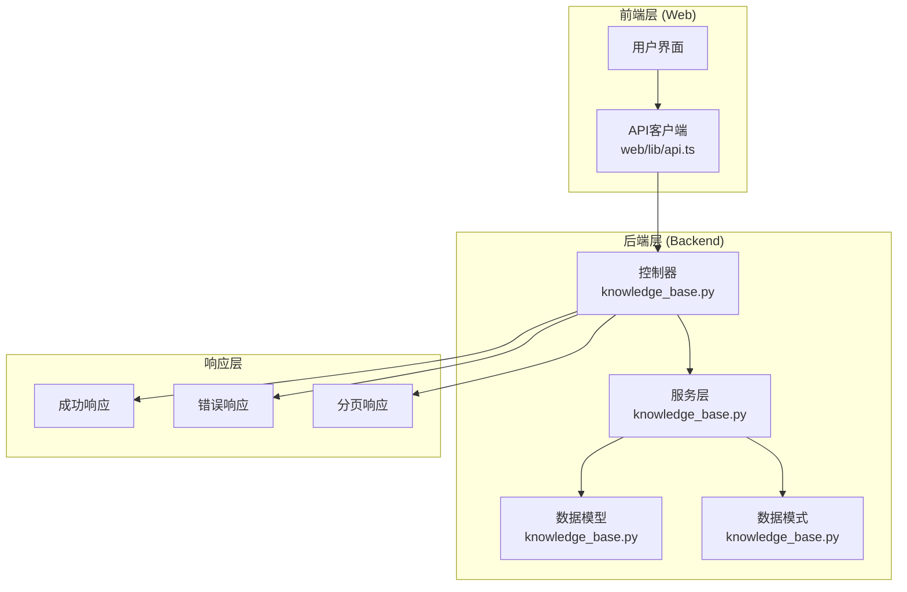
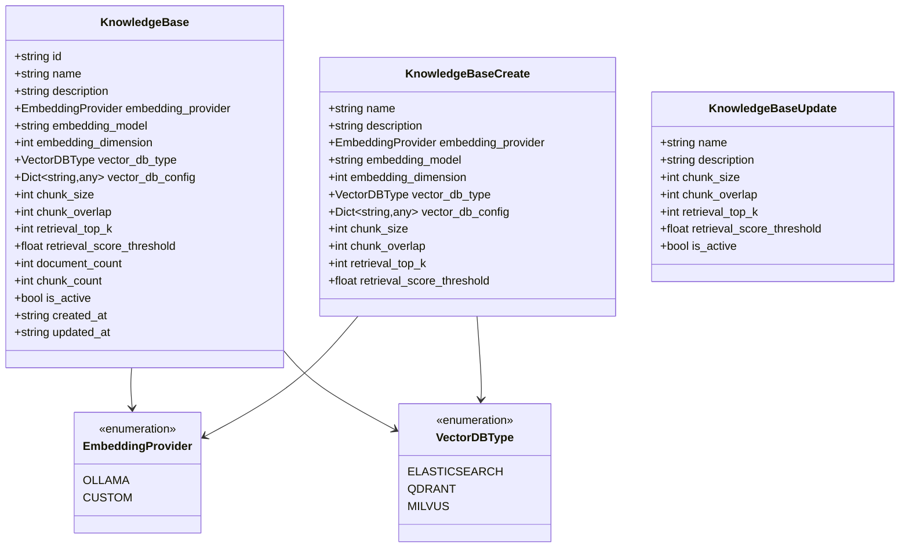

# 知识库API详细文档

<cite>
**本文档中引用的文件**
- [knowledge_base.py](file://backend/app/controllers/knowledge_base.py)
- [knowledge_base.py](file://backend/app/models/knowledge_base.py)
- [knowledge_base.py](file://backend/app/schemas/knowledge_base.py)
- [knowledge_base.py](file://backend/app/services/knowledge_base.py)
- [api.ts](file://web/lib/api.ts)
- [knowledge-base-config.tsx](file://web/components/views/knowledge-base-config.tsx)
- [response.py](file://backend/app/core/response.py)
- [exceptions.py](file://backend/app/core/exceptions.py)
</cite>

## 目录
1. [简介](#简介)
2. [项目架构概览](#项目架构概览)
3. [核心数据模型](#核心数据模型)
4. [API端点详解](#api端点详解)
5. [客户端调用方式](#客户端调用方式)
6. [配置项说明](#配置项说明)
7. [错误处理机制](#错误处理机制)
8. [使用示例](#使用示例)
9. [最佳实践](#最佳实践)

## 简介

RAG Studio的知识库管理API提供了完整的知识库生命周期管理功能，包括创建、查询、更新、删除以及配置管理等核心功能。该API采用RESTful设计原则，支持分页查询、条件筛选和详细的配置管理。

## 项目架构概览



**图表来源**
- [knowledge_base.py](file://backend/app/controllers/knowledge_base.py#L1-L283)
- [knowledge_base.py](file://backend/app/services/knowledge_base.py#L1-L230)
- [api.ts](file://web/lib/api.ts#L1-L800)

## 核心数据模型

### 知识库模型结构



**图表来源**
- [knowledge_base.py](file://backend/app/models/knowledge_base.py#L25-L80)
- [knowledge_base.py](file://backend/app/schemas/knowledge_base.py#L11-L106)

**章节来源**
- [knowledge_base.py](file://backend/app/models/knowledge_base.py#L1-L80)
- [knowledge_base.py](file://backend/app/schemas/knowledge_base.py#L1-L106)

## API端点详解

### 1. 创建知识库 - POST /api/v1/knowledge-bases

**功能描述**: 创建新的知识库实例

**请求参数**:
- **请求头**: `Content-Type: application/json`
- **请求体**: KnowledgeBaseCreate模型

**请求体结构**:
```typescript
interface CreateKnowledgeBaseData {
  name: string;                    // 必填，知识库名称（1-100字符）
  description?: string;            // 可选，知识库描述（最多500字符）
  embedding_provider?: string;     // 可选，嵌入模型提供商，默认为"ollama"
  embedding_model: string;         // 必填，嵌入模型名称
  embedding_dimension?: number;    // 可选，向量维度，默认768
  vector_db_type: string;          // 必填，向量数据库类型
  vector_db_config?: Record<string, any>; // 可选，向量数据库配置
  chunk_size?: number;             // 可选，分块大小，默认512（100-2000）
  chunk_overlap?: number;          // 可选，分块重叠，默认50（0-500）
  retrieval_top_k?: number;        // 可选，检索返回数量，默认5（1-50）
  retrieval_score_threshold?: number; // 可选，检索分数阈值，默认0.7（0.0-1.0）
}
```

**响应格式**:
```typescript
{
  success: boolean;
  data: KnowledgeBase;
  message: string;
}
```

**响应示例**:
```json
{
  "success": true,
  "data": {
    "id": "kb_abc123def456",
    "name": "技术文档库",
    "description": "存储公司技术文档",
    "embedding_provider": "ollama",
    "embedding_model": "nomic-embed-text",
    "embedding_dimension": 768,
    "vector_db_type": "qdrant",
    "vector_db_config": {},
    "chunk_size": 512,
    "chunk_overlap": 50,
    "retrieval_top_k": 5,
    "retrieval_score_threshold": 0.7,
    "document_count": 0,
    "chunk_count": 0,
    "is_active": true,
    "created_at": "2024-01-01T10:00:00Z",
    "updated_at": "2024-01-01T10:00:00Z"
  },
  "message": "知识库创建成功"
}
```

**章节来源**
- [knowledge_base.py](file://backend/app/controllers/knowledge_base.py#L22-L44)
- [knowledge_base.py](file://backend/app/schemas/knowledge_base.py#L11-L52)

### 2. 获取知识库列表 - GET /api/v1/knowledge-bases

**功能描述**: 获取知识库列表，支持分页和条件筛选

**查询参数**:
- `page` (可选): 页码，默认1
- `page_size` (可选): 每页大小，默认20，最大100
- `is_active` (可选): 是否激活状态筛选

**响应格式**:
```typescript
{
  success: boolean;
  data: KnowledgeBase[];
  total: number;
  page: number;
  page_size: number;
  total_pages: number;
}
```

**响应示例**:
```json
{
  "success": true,
  "data": [
    {
      "id": "kb_abc123def456",
      "name": "技术文档库",
      "description": "存储公司技术文档",
      "embedding_provider": "ollama",
      "embedding_model": "nomic-embed-text",
      "vector_db_type": "qdrant",
      "is_active": true,
      "document_count": 15,
      "chunk_count": 1200
    }
  ],
  "total": 1,
  "page": 1,
  "page_size": 20,
  "total_pages": 1
}
```

**章节来源**
- [knowledge_base.py](file://backend/app/controllers/knowledge_base.py#L47-L75)

### 3. 获取知识库详情 - GET /api/v1/knowledge-bases/{id}

**功能描述**: 根据ID获取知识库详细信息

**路径参数**:
- `id`: 知识库ID

**响应格式**:
```typescript
{
  success: boolean;
  data: KnowledgeBase;
}
```

**章节来源**
- [knowledge_base.py](file://backend/app/controllers/knowledge_base.py#L78-L97)

### 4. 更新知识库 - PUT /api/v1/knowledge-bases/{id}

**功能描述**: 更新知识库配置信息

**路径参数**:
- `id`: 知识库ID

**请求体**: KnowledgeBaseUpdate模型

**请求体结构**:
```typescript
interface UpdateKnowledgeBaseData {
  name?: string;                   // 可选，知识库名称
  description?: string;            // 可选，知识库描述
  chunk_size?: number;             // 可选，分块大小
  chunk_overlap?: number;          // 可选，分块重叠
  retrieval_top_k?: number;        // 可选，检索返回数量
  retrieval_score_threshold?: number; // 可选，检索分数阈值
  is_active?: boolean;             // 可选，是否激活
}
```

**响应格式**:
```typescript
{
  success: boolean;
  data: KnowledgeBase;
  message: string;
}
```

**章节来源**
- [knowledge_base.py](file://backend/app/controllers/knowledge_base.py#L100-L121)

### 5. 删除知识库 - DELETE /api/v1/knowledge-bases/{id}

**功能描述**: 删除指定知识库（同时删除其下所有文档和索引）

**路径参数**:
- `id`: 知识库ID

**响应格式**:
```typescript
{
  success: boolean;
  message: string;
}
```

**章节来源**
- [knowledge_base.py](file://backend/app/controllers/knowledge_base.py#L124-L145)

### 6. 获取知识库配置 - GET /api/v1/knowledge-bases/{id}/config

**功能描述**: 获取知识库详细配置信息（用于链路排查）

**路径参数**:
- `id`: 知识库ID

**响应格式**:
```typescript
{
  success: boolean;
  data: {
    basic_info: {
      id: string;
      name: string;
      description: string;
      is_active: boolean;
    };
    embedding_config: {
      provider: string;
      model: string;
      dimension: number;
    };
    vector_db_config: {
      type: string;
      config: Record<string, any>;
    };
    chunk_config: {
      chunk_size: number;
      chunk_overlap: number;
    };
    retrieval_config: {
      top_k: number;
      score_threshold: number;
    };
    statistics: {
      document_count: number;
      chunk_count: number;
    };
  };
}
```

**章节来源**
- [knowledge_base.py](file://backend/app/controllers/knowledge_base.py#L148-L196)

### 7. 获取知识库统计信息 - GET /api/v1/knowledge-bases/{id}/stats

**功能描述**: 获取知识库统计信息

**路径参数**:
- `id`: 知识库ID

**响应格式**:
```typescript
{
  success: boolean;
  data: {
    kb_id: string;
    document_count: number;
    chunk_count: number;
    indexed_count: number;
    storage_size: number;
  };
}
```

**章节来源**
- [knowledge_base.py](file://backend/app/controllers/knowledge_base.py#L199-L219)

### 8. 获取知识库Schema配置 - GET /api/v1/knowledge-bases/{id}/schema

**功能描述**: 获取知识库的Schema配置

**路径参数**:
- `id`: 知识库ID

**响应格式**:
```typescript
{
  success: boolean;
  data: {
    vector_db_type: string;
    fields: Array<{
      name: string;
      type: string;
      isIndexed: boolean;
      dimension?: number;
      description?: string;
    }>;
  };
}
```

**章节来源**
- [knowledge_base.py](file://backend/app/controllers/knowledge_base.py#L222-L242)

### 9. 更新知识库Schema配置 - PUT /api/v1/knowledge-bases/{id}/schema

**功能描述**: 更新知识库的Schema配置

**路径参数**:
- `id`: 知识库ID

**请求体**:
```typescript
{
  schema_fields: Array<{
    name: string;
    type: string;
    isIndexed: boolean;
    dimension?: number;
    description?: string;
  }>;
  vector_db_type?: string;
  vector_db_config?: Record<string, any>;
}
```

**响应格式**:
```typescript
{
  success: boolean;
  message: string;
}
```

**章节来源**
- [knowledge_base.py](file://backend/app/controllers/knowledge_base.py#L252-L281)

## 客户端调用方式

### Web客户端调用

前端通过`web/lib/api.ts`中的`knowledgeBaseAPI`模块提供统一的API调用接口：

```typescript
// 创建知识库
await knowledgeBaseAPI.create({
  name: "技术文档库",
  embedding_model: "bge-m3:latest",
  vector_db_type: "qdrant",
  embedding_dimension: 1024
});

// 获取知识库列表
const response = await knowledgeBaseAPI.list(1, 20, true);
console.log(response.data); // 知识库列表

// 获取知识库详情
const kb = await knowledgeBaseAPI.get("kb_abc123");

// 更新知识库
await knowledgeBaseAPI.update("kb_abc123", {
  name: "更新后的技术文档库",
  retrieval_top_k: 10
});

// 删除知识库
await knowledgeBaseAPI.delete("kb_abc123");
```

### TypeScript类型定义

```typescript
// 知识库接口
interface KnowledgeBase {
  id: string;
  name: string;
  description?: string;
  embedding_provider: string;
  embedding_model: string;
  embedding_dimension: number;
  vector_db_type: string;
  vector_db_config: Record<string, any>;
  chunk_size: number;
  chunk_overlap: number;
  retrieval_top_k: number;
  retrieval_score_threshold: number;
  document_count: number;
  chunk_count: number;
  is_active: boolean;
  created_at: string;
  updated_at: string;
}

// 创建知识库数据接口
interface CreateKnowledgeBaseData {
  name: string;
  description?: string;
  embedding_provider?: string;
  embedding_model: string;
  embedding_dimension?: number;
  vector_db_type: string;
  vector_db_config?: Record<string, any>;
  chunk_size?: number;
  chunk_overlap?: number;
  retrieval_top_k?: number;
  retrieval_score_threshold?: number;
}
```

**章节来源**
- [api.ts](file://web/lib/api.ts#L59-L221)

## 配置项说明

### 嵌入模型配置

| 配置项 | 类型 | 默认值 | 描述 | 示例值 |
|--------|------|--------|------|--------|
| `embedding_provider` | EmbeddingProvider | "ollama" | 嵌入模型提供商 | "ollama", "custom" |
| `embedding_model` | string | 必填 | 嵌入模型名称 | "nomic-embed-text", "bge-m3:latest" |
| `embedding_dimension` | int | 768 | 向量维度 | 768, 1024, 1536 |

### 向量数据库配置

| 配置项 | 类型 | 默认值 | 描述 | 支持类型 |
|--------|------|--------|------|----------|
| `vector_db_type` | VectorDBType | 必填 | 向量数据库类型 | "elasticsearch", "qdrant", "milvus" |
| `vector_db_config` | Dict | {} | 向量数据库配置 | 根据具体数据库类型而定 |

### 文档处理配置

| 配置项 | 类型 | 默认值 | 范围 | 描述 |
|--------|------|--------|------|------|
| `chunk_size` | int | 512 | 100-2000 | 文档分块大小（字符数） |
| `chunk_overlap` | int | 50 | 0-500 | 分块重叠大小（字符数） |

### 检索配置

| 配置项 | 类型 | 默认值 | 范围 | 描述 |
|--------|------|--------|------|------|
| `retrieval_top_k` | int | 5 | 1-50 | 检索返回的文档数量 |
| `retrieval_score_threshold` | float | 0.7 | 0.0-1.0 | 检索分数阈值 |

### 影响后续流程的关键配置

1. **embedding_model**: 影响文档向量化过程和相似度计算
2. **vector_db_type**: 决定向量存储和检索的性能特征
3. **chunk_size**: 影响文档分割粒度和检索精度
4. **retrieval_top_k**: 控制检索结果的数量，影响召回率和相关性

**章节来源**
- [knowledge_base.py](file://backend/app/models/knowledge_base.py#L25-L59)
- [knowledge-base-config.tsx](file://web/components/views/knowledge-base-config.tsx#L140-L158)

## 错误处理机制

### 错误响应格式

```typescript
interface ErrorResponse {
  success: boolean;
  error_code: string;
  message: string;
  details?: any;
}
```

### 常见错误码

| 错误码 | HTTP状态码 | 描述 | 场景 |
|--------|------------|------|------|
| `BAD_REQUEST` | 400 | 请求参数错误 | 参数格式不正确或缺失必填项 |
| `NOT_FOUND` | 404 | 资源不存在 | 知识库ID不存在 |
| `CONFLICT` | 409 | 资源冲突 | 重复的资源名称 |
| `INTERNAL_ERROR` | 500 | 内部服务器错误 | 系统内部异常 |

### 验证规则

1. **名称验证**: 必填，长度1-100字符
2. **描述验证**: 最大500字符
3. **分块大小**: 100-2000字符
4. **分块重叠**: 0-500字符
5. **检索数量**: 1-50个文档
6. **分数阈值**: 0.0-1.0范围

**章节来源**
- [exceptions.py](file://backend/app/core/exceptions.py#L1-L144)
- [response.py](file://backend/app/core/response.py#L60-L121)

## 使用示例

### curl示例

```bash
# 创建知识库
curl -X POST http://localhost:8000/api/v1/knowledge-bases \
  -H "Content-Type: application/json" \
  -d '{
    "name": "技术文档库",
    "description": "存储公司技术文档",
    "embedding_model": "nomic-embed-text",
    "vector_db_type": "qdrant",
    "chunk_size": 512,
    "retrieval_top_k": 5
  }'

# 获取知识库列表
curl -X GET "http://localhost:8000/api/v1/knowledge-bases?page=1&page_size=10&is_active=true"

# 获取知识库详情
curl -X GET http://localhost:8000/api/v1/knowledge-bases/kb_abc123

# 更新知识库
curl -X PUT http://localhost:8000/api/v1/knowledge-bases/kb_abc123 \
  -H "Content-Type: application/json" \
  -d '{
    "name": "更新后的技术文档库",
    "retrieval_top_k": 10
  }'

# 删除知识库
curl -X DELETE http://localhost:8000/api/v1/knowledge-bases/kb_abc123
```

### TypeScript调用示例

```typescript
import { knowledgeBaseAPI } from '@/lib/api';

// 创建知识库示例
async function createKnowledgeBaseExample() {
  try {
    const result = await knowledgeBaseAPI.create({
      name: "产品文档库",
      description: "存储产品相关文档",
      embedding_model: "bge-m3:latest",
      vector_db_type: "qdrant",
      chunk_size: 1024,
      chunk_overlap: 100,
      retrieval_top_k: 8,
      retrieval_score_threshold: 0.8
    });
    
    console.log("知识库创建成功:", result.data);
    return result.data;
  } catch (error) {
    console.error("创建知识库失败:", error);
  }
}

// 获取知识库列表示例
async function getKnowledgeBasesExample() {
  try {
    const response = await knowledgeBaseAPI.list(1, 20, true);
    console.log("知识库列表:", response.data);
    return response.data;
  } catch (error) {
    console.error("获取知识库列表失败:", error);
  }
}

// 更新知识库示例
async function updateKnowledgeBaseExample() {
  try {
    const result = await knowledgeBaseAPI.update("kb_abc123", {
      name: "优化后的知识库",
      retrieval_top_k: 15,
      is_active: true
    });
    
    console.log("知识库更新成功:", result.data);
    return result.data;
  } catch (error) {
    console.error("更新知识库失败:", error);
  }
}
```

## 最佳实践

### 1. 知识库命名规范
- 使用有意义的名称，便于识别
- 避免特殊字符，建议使用英文和数字
- 考虑按项目或部门进行分类命名

### 2. 配置优化建议
- **分块大小**: 根据文档内容特点调整，一般建议512-2048字符
- **检索数量**: 平衡相关性和性能，通常3-10个文档为宜
- **分数阈值**: 根据业务需求调整，高阈值提高准确性，低阈值提高召回率

### 3. 性能考虑
- 定期清理无用的知识库
- 监控向量数据库的存储空间
- 根据访问频率调整检索参数

### 4. 安全注意事项
- 敏感配置信息（如API密钥）应妥善保管
- 使用HTTPS确保传输安全
- 定期备份重要知识库配置

### 5. 监控和维护
- 定期检查知识库统计信息
- 监控检索效果和性能指标
- 及时更新过时的配置