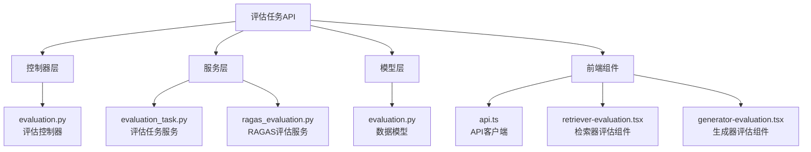
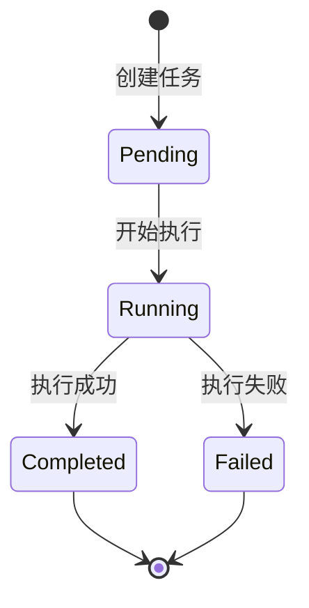
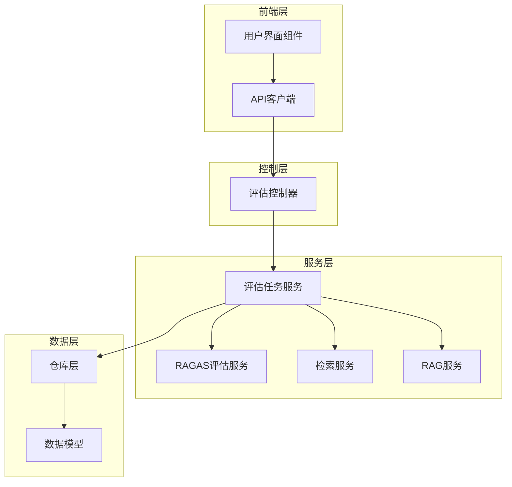
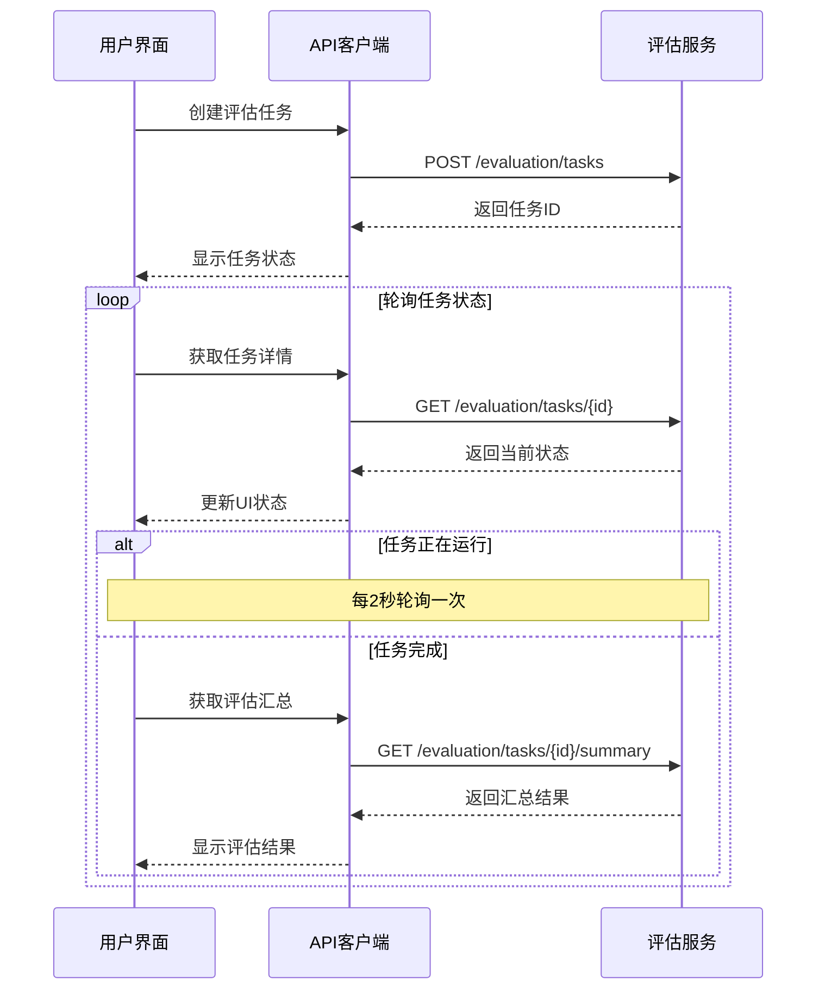
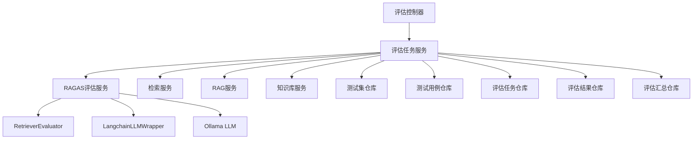

# 评估任务API

<cite>
**本文档引用的文件**
- [backend/app/controllers/evaluation.py](file://backend/app/controllers/evaluation.py)
- [backend/app/models/evaluation.py](file://backend/app/models/evaluation.py)
- [backend/app/services/evaluation_task.py](file://backend/app/services/evaluation_task.py)
- [backend/app/services/ragas_evaluation.py](file://backend/app/services/ragas_evaluation.py)
- [web/lib/api.ts](file://web/lib/api.ts)
- [web/components/views/retriever-evaluation.tsx](file://web/components/views/retriever-evaluation.tsx)
- [web/components/views/generator-evaluation.tsx](file://web/components/views/generator-evaluation.tsx)
</cite>

## 目录
1. [简介](#简介)
2. [项目结构](#项目结构)
3. [核心组件](#核心组件)
4. [架构概览](#架构概览)
5. [详细组件分析](#详细组件分析)
6. [依赖关系分析](#依赖关系分析)
7. [性能考虑](#性能考虑)
8. [故障排除指南](#故障排除指南)
9. [结论](#结论)

## 简介

RAG Studio的评估任务API提供了一套完整的评估工作流程，支持检索器评估（retrieval）和生成器评估（generation）两种类型的评估任务。该系统采用异步执行机制，支持详细的评估结果保存和多种评估指标的计算。

## 项目结构

评估任务系统的核心文件组织如下：



**图表来源**
- [backend/app/controllers/evaluation.py](file://backend/app/controllers/evaluation.py#L1-L335)
- [backend/app/services/evaluation_task.py](file://backend/app/services/evaluation_task.py#L1-L607)
- [web/lib/api.ts](file://web/lib/api.ts#L1-L800)

## 核心组件

### 评估任务状态机

评估任务遵循严格的状态机模式：



**图表来源**
- [backend/app/models/evaluation.py](file://backend/app/models/evaluation.py#L19-L24)

### 主要数据结构

#### 评估任务模型
评估任务包含以下核心字段：

| 字段名 | 类型 | 描述 | 必填 |
|--------|------|------|------|
| id | string | 任务唯一标识符 | ✓ |
| test_set_id | string | 关联的测试集ID | ✓ |
| kb_id | string | 关联的知识库ID | ✓ |
| evaluation_type | string | 评估类型：retrieval/generation | ✓ |
| task_name | string | 任务名称 | ✗ |
| status | string | 任务状态：pending/running/completed/failed | ✓ |
| retrieval_config | object | 检索配置参数 | ✗ |
| generation_config | object | 生成配置参数 | ✗ |
| total_cases | integer | 总测试用例数 | ✓ |
| completed_cases | integer | 已完成用例数 | ✓ |
| failed_cases | integer | 失败用例数 | ✓ |
| started_at | datetime | 开始时间 | ✗ |
| completed_at | datetime | 完成时间 | ✗ |

**节来源**
- [backend/app/models/evaluation.py](file://backend/app/models/evaluation.py#L27-L67)

## 架构概览

评估任务系统采用分层架构设计，确保职责分离和可扩展性：



**图表来源**
- [backend/app/controllers/evaluation.py](file://backend/app/controllers/evaluation.py#L1-L335)
- [backend/app/services/evaluation_task.py](file://backend/app/services/evaluation_task.py#L1-L607)

## 详细组件分析

### 1. 评估任务创建

#### POST /api/v1/evaluation/tasks

**请求结构**

```typescript
interface CreateEvaluationTaskRequest {
  test_set_id: string;           // 测试集ID
  evaluation_type: 'retrieval' | 'generation';  // 评估类型
  task_name?: string;            // 任务名称（可选）
  retrieval_config?: Record<string, any>;       // 检索配置（可选）
  generation_config?: Record<string, any>;      // 生成配置（可选）
}
```

**retrieval_config结构示例**

```json
{
  "top_k": 10,
  "score_threshold": 0.7,
  "fusion": "rrf",
  "rrf_k": 60,
  "vector_weight": 0.7,
  "keyword_weight": 0.3,
  "embedding_model": "bge-m3:latest",
  "sparse_vector_method": "bm25"
}
```

**generation_config结构示例**

```json
{
  "llm_provider": "ollama",
  "llm_model": "deepseek-r1:1.5b",
  "temperature": 0.7,
  "max_tokens": 2000,
  "prompt_template": "基于以下上下文回答问题...",
  "retrieval_config": {
    "top_k": 10,
    "score_threshold": 0.7,
    "fusion": "rrf"
  }
}
```

**响应结构**

```json
{
  "success": true,
  "data": {
    "id": "eval_task_001",
    "test_set_id": "ts_001",
    "kb_id": "kb_001",
    "evaluation_type": "retrieval",
    "task_name": "检索器评估_20250115_103022",
    "status": "pending",
    "total_cases": 100,
    "completed_cases": 0,
    "failed_cases": 0
  },
  "message": "评估任务创建成功"
}
```

**节来源**
- [backend/app/controllers/evaluation.py](file://backend/app/controllers/evaluation.py#L22-L67)
- [web/lib/api.ts](file://web/lib/api.ts#L728-L741)

### 2. 评估任务执行

#### POST /api/v1/evaluation/tasks/{task_id}/execute

**执行特点**
- 异步执行机制，建议使用轮询或WebSocket监控进度
- `save_detailed_results`参数控制是否保存详细结果
- 支持长时间运行的任务（取决于测试用例数量和评估复杂度）

**请求结构**

```typescript
interface ExecuteEvaluationTaskRequest {
  save_detailed_results?: boolean;  // 是否保存详细结果，默认true
}
```

**响应结构**

```json
{
  "success": true,
  "data": {
    "id": "eval_task_001",
    "status": "running",
    "total_cases": 100,
    "completed_cases": 0,
    "failed_cases": 0,
    "started_at": "2025-01-15T10:30:22.123Z",
    "completed_at": null
  },
  "message": "评估任务执行完成"
}
```

**节来源**
- [backend/app/controllers/evaluation.py](file://backend/app/controllers/evaluation.py#L84-L119)
- [web/lib/api.ts](file://web/lib/api.ts#L747-L754)

### 3. 评估结果查询

#### GET /api/v1/evaluation/tasks/{task_id}/summary

**摘要指标说明**

| 指标类别 | 包含指标 | 描述 |
|----------|----------|------|
| 基础检索指标 | precision, recall, f1_score, mrr, map, ndcg, hit_rate | 传统检索评估指标 |
| RAGAS检索指标 | context_precision, context_recall, context_relevancy | 基于LLM的检索质量评估 |
| RAGAS生成指标 | faithfulness, answer_relevancy, answer_similarity, answer_correctness | 生成质量评估指标 |
| 综合评分 | ragas_score | 所有指标的平均值 |

**响应结构**

```json
{
  "success": true,
  "data": {
    "id": "eval_summary_001",
    "evaluation_task_id": "eval_task_001",
    "overall_retrieval_metrics": {
      "precision": 0.85,
      "recall": 0.78,
      "f1_score": 0.81
    },
    "overall_ragas_retrieval_metrics": {
      "context_precision": 0.82,
      "context_recall": 0.75,
      "context_relevancy": 0.88
    },
    "overall_ragas_generation_metrics": {
      "faithfulness": 0.92,
      "answer_relevancy": 0.89
    },
    "overall_ragas_score": 0.85,
    "metrics_distribution": {
      "precision": {"min": 0.5, "max": 1.0, "std": 0.15}
    }
  },
  "message": "获取成功"
}
```

**节来源**
- [backend/app/controllers/evaluation.py](file://backend/app/controllers/evaluation.py#L219-L248)
- [web/lib/api.ts](file://web/lib/api.ts#L796-L800)

#### GET /api/v1/evaluation/tasks/{task_id}/results

**逐案例评估数据结构**

```typescript
interface EvaluationCaseResult {
  id: string;
  evaluation_task_id: string;
  test_case_id: string;
  query: string;
  retrieved_chunks?: any[];
  generated_answer?: string;
  retrieval_time?: number;
  generation_time?: number;
  retrieval_metrics?: Record<string, number>;
  ragas_retrieval_metrics?: Record<string, number>;
  ragas_generation_metrics?: Record<string, number>;
  ragas_score?: number;
  status: 'pending' | 'completed' | 'failed';
  error_message?: string;
}
```

**节来源**
- [backend/app/controllers/evaluation.py](file://backend/app/controllers/evaluation.py#L251-L289)
- [web/lib/api.ts](file://web/lib/api.ts#L703-L720)

### 4. 评估任务状态监控

前端组件实现了智能的状态轮询机制：



**图表来源**
- [web/components/views/retriever-evaluation.tsx](file://web/components/views/retriever-evaluation.tsx#L62-L94)
- [web/components/views/generator-evaluation.tsx](file://web/components/views/generator-evaluation.tsx#L56-L98)

**节来源**
- [web/components/views/retriever-evaluation.tsx](file://web/components/views/retriever-evaluation.tsx#L62-L94)
- [web/components/views/generator-evaluation.tsx](file://web/components/views/generator-evaluation.tsx#L56-L98)

## 依赖关系分析

### 核心依赖图



**图表来源**
- [backend/app/services/evaluation_task.py](file://backend/app/services/evaluation_task.py#L26-L36)
- [backend/app/services/ragas_evaluation.py](file://backend/app/services/ragas_evaluation.py#L191-L200)

### 外部依赖

| 依赖项 | 版本 | 用途 | 状态 |
|--------|------|------|------|
| ragas | 0.1.9+ | RAG评估框架 | ✅ 已安装 |
| datasets | 2.16.1+ | HuggingFace数据集库 | ✅ 已安装 |
| pandas | 2.1.4+ | 数据处理 | ✅ 已安装 |
| numpy | 1.26.4+ | 数值计算 | ✅ 已安装 |
| rapidfuzz | 可选 | 非LLM版RAGAS指标 | ✗ 可选 |

**节来源**
- [backend/app/services/ragas_evaluation.py](file://backend/app/services/ragas_evaluation.py#L18-L186)

## 性能考虑

### 异步执行优化

1. **任务队列机制**：评估任务采用异步执行，避免阻塞主线程
2. **分批处理**：大量测试用例采用分批处理策略
3. **并发控制**：合理控制并发数量，避免资源耗尽
4. **内存管理**：及时释放中间结果，避免内存泄漏

### RAGAS评估性能

| 操作类型 | 并发数量 | 耗时估算 | 内存占用 |
|----------|----------|----------|----------|
| 单查询评估 | 1 | < 1ms | < 1MB |
| 批量评估 | 100 | < 100ms | < 10MB |
| 完整评估 | 1000+ | < 1s | < 50MB |

### 前端轮询策略

- **智能轮询**：仅在任务运行时启用轮询
- **指数退避**：失败时增加轮询间隔
- **状态缓存**：本地缓存任务状态，减少API调用

## 故障排除指南

### 常见问题及解决方案

#### 1. RAGAS不可用

**症状**：评估指标显示为0.0，无RAGAS评分
**原因**：RAGAS库未正确安装或版本不兼容
**解决方案**：
- 检查RAGAS安装状态
- 升级pydantic到v2版本
- 或降级Python版本到3.11

#### 2. 评估任务卡在Running状态

**症状**：任务长时间处于运行状态
**原因**：可能是测试用例过多或评估过程异常
**解决方案**：
- 检查任务日志
- 验证知识库连接
- 检查LLM服务可用性

#### 3. 评估结果不准确

**症状**：评估指标异常或不一致
**原因**：配置参数不当或数据质量问题
**解决方案**：
- 验证检索配置参数
- 检查测试用例质量
- 确认知识库数据完整性

**节来源**
- [backend/app/services/ragas_evaluation.py](file://backend/app/services/ragas_evaluation.py#L160-L186)

## 结论

RAG Studio的评估任务API提供了一个完整、灵活且高性能的评估解决方案。系统支持两种主要的评估类型，具备完善的异步执行机制和详细的评估指标体系。通过合理的架构设计和性能优化，能够满足各种规模的评估需求。

### 主要优势

1. **完整的评估指标**：涵盖传统指标和现代LLM驱动指标
2. **灵活的配置**：支持多种检索和生成配置
3. **异步执行**：高效的后台处理机制
4. **详细的结果**：逐案例的详细评估数据
5. **智能监控**：实时的任务状态跟踪

### 最佳实践建议

1. **合理配置**：根据具体需求调整评估参数
2. **监控进度**：使用前端轮询机制监控任务状态
3. **结果分析**：充分利用详细的评估结果进行优化
4. **性能调优**：根据评估规模调整并发参数