# RAG-Studio前端API集成详细文档

<cite>
**本文档引用的文件**
- [api.ts](file://web/lib/api.ts)
- [storage.ts](file://web/lib/storage.ts)
- [toast.ts](file://web/lib/toast.ts)
- [knowledge-base-list.tsx](file://web/components/views/knowledge-base-list.tsx)
- [document-processing.tsx](file://web/components/views/document-processing.tsx)
- [test-case-management.tsx](file://web/components/views/test-case-management.tsx)
- [retriever-evaluation.tsx](file://web/components/views/retriever-evaluation.tsx)
</cite>

## 目录
1. [简介](#简介)
2. [项目结构概览](#项目结构概览)
3. [统一API客户端架构](#统一api客户端架构)
4. [API服务对象详解](#api服务对象详解)
5. [请求处理机制](#请求处理机制)
6. [错误处理策略](#错误处理策略)
7. [最佳实践指南](#最佳实践指南)
8. [认证集成建议](#认证集成建议)
9. [故障排除指南](#故障排除指南)
10. [总结](#总结)

## 简介

RAG-Studio前端采用统一的API客户端架构，通过`lib/api.ts`文件实现了完整的RESTful API服务。该架构提供了类型安全的API调用、自动化的请求处理、完善的错误管理和模块化的功能组织，为整个应用提供了可靠的后端通信能力。

## 项目结构概览

RAG-Studio前端的API集成主要集中在以下关键目录：

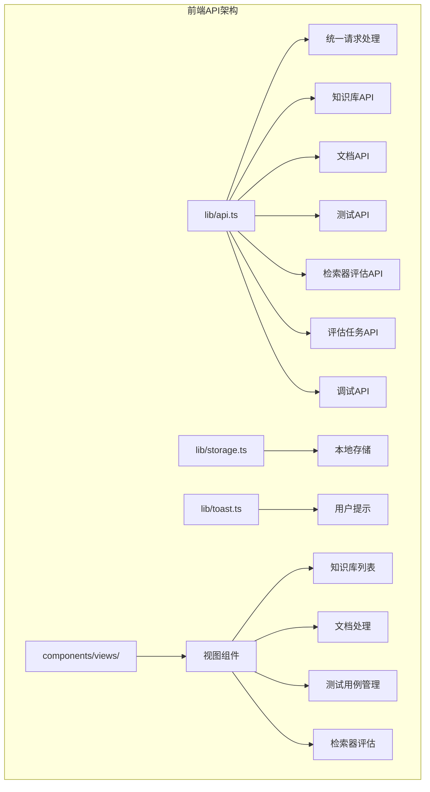

**图表来源**
- [api.ts](file://web/lib/api.ts#L1-L1107)
- [storage.ts](file://web/lib/storage.ts#L1-L119)
- [toast.ts](file://web/lib/toast.ts#L1-L68)

## 统一API客户端架构

### 核心设计理念

RAG-Studio的API客户端采用了以下核心设计原则：

1. **统一入口**: 所有API调用都通过`request`函数进行统一处理
2. **类型安全**: 使用TypeScript接口确保数据结构的完整性
3. **模块化组织**: 按功能领域划分不同的API服务对象
4. **自动处理**: 自动处理Content-Type、查询参数序列化等细节

### 基础请求函数

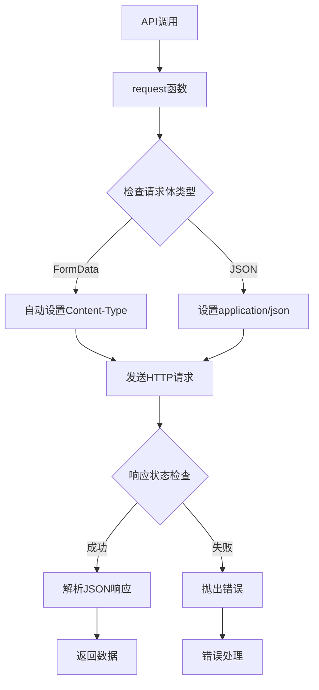

**图表来源**
- [api.ts](file://web/lib/api.ts#L22-L56)

**章节来源**
- [api.ts](file://web/lib/api.ts#L22-L56)

## API服务对象详解

### 知识库API (knowledgeBaseAPI)

知识库API负责管理RAG系统的知识库资源，提供完整的CRUD操作：

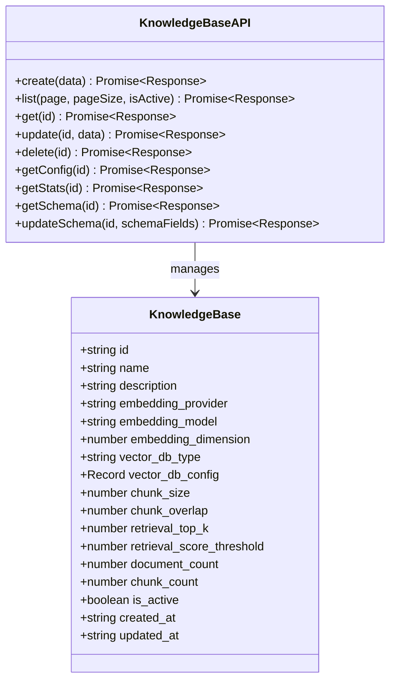

**图表来源**
- [api.ts](file://web/lib/api.ts#L108-L221)

### 文档API (documentAPI)

文档API处理文档的上传、解析、处理和管理：

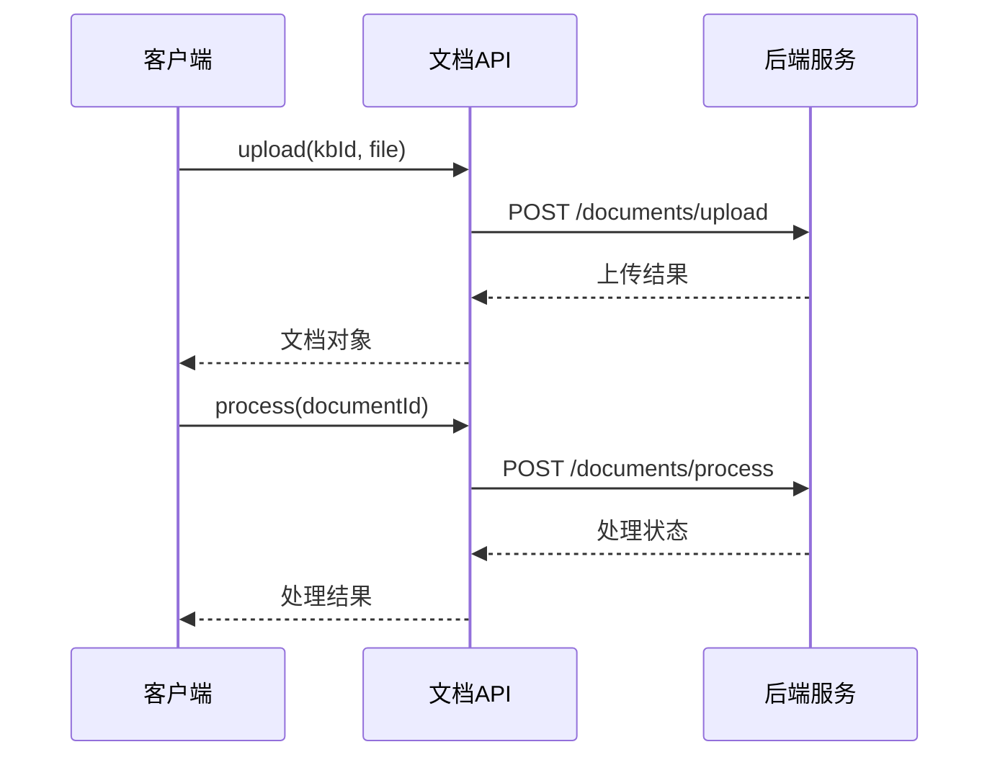

**图表来源**
- [api.ts](file://web/lib/api.ts#L243-L321)

### 测试API (testAPI)

测试API管理测试集和测试用例的生命周期：

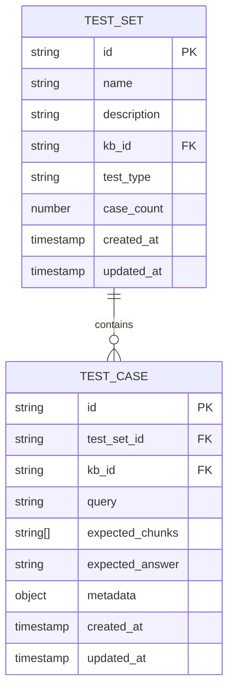

**图表来源**
- [api.ts](file://web/lib/api.ts#L364-L528)

### 检索器评估API (retrieverEvalAPI)

检索器评估API提供完整的评估功能：

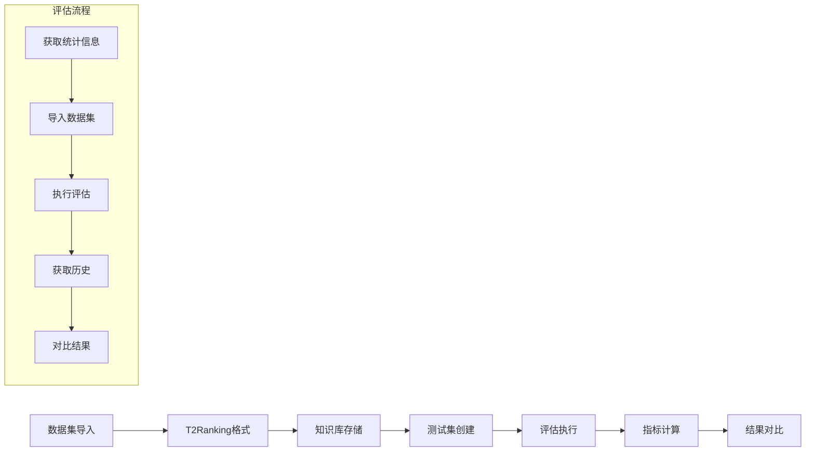

**图表来源**
- [api.ts](file://web/lib/api.ts#L565-L669)

### 评估任务API (evaluationAPI)

评估任务API管理复杂的评估工作流：

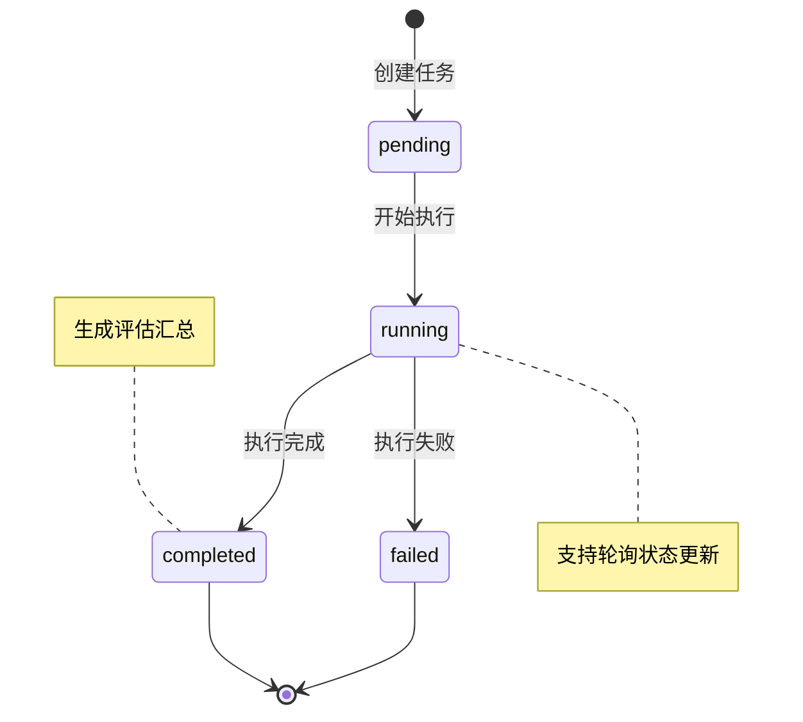

**图表来源**
- [api.ts](file://web/lib/api.ts#L724-L828)

### 调试API (debugAPI)

调试API提供开发和调试功能：

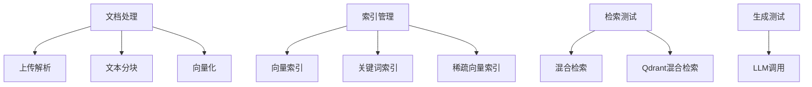

**图表来源**
- [api.ts](file://web/lib/api.ts#L840-L1107)

**章节来源**
- [api.ts](file://web/lib/api.ts#L108-L1107)

## 请求处理机制

### 自动Content-Type设置

API客户端智能识别请求体类型并自动设置合适的Content-Type：

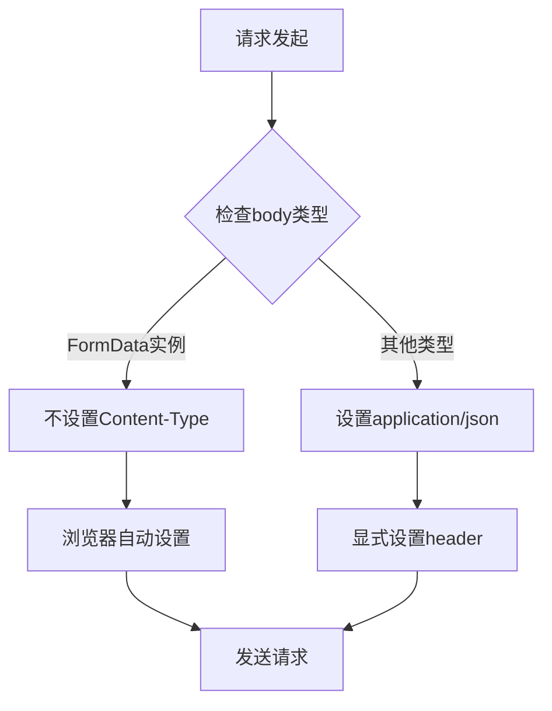

**图表来源**
- [api.ts](file://web/lib/api.ts#L28-L42)

### 查询参数序列化

API客户端自动处理查询参数的序列化：

```typescript
// 示例：分页查询参数构建
const params = new URLSearchParams({
  page: page.toString(),
  page_size: pageSize.toString(),
})
if (isActive !== undefined) {
  params.append('is_active', isActive.toString())
}
```

### JSON解析处理

统一的JSON解析逻辑确保响应数据的一致性：

```typescript
try {
  const response = await fetch(url, config)
  
  if (!response.ok) {
    const errorText = await response.text();
    throw new Error(errorText || '请求失败')
  }
  
  return await response.json()
} catch (error) {
  console.error('API请求错误:', error)
  throw error
}
```

**章节来源**
- [api.ts](file://web/lib/api.ts#L22-L56)

## 错误处理策略

### 分层错误处理

RAG-Studio采用分层的错误处理策略：

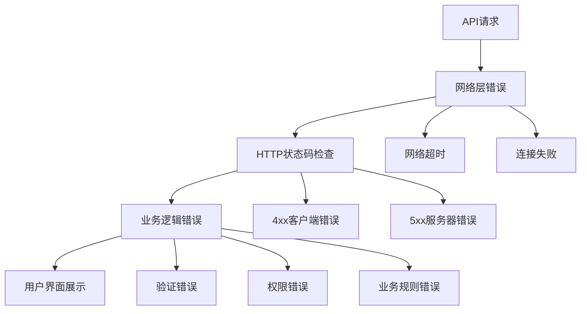

### 错误类型分类

| 错误类型 | 处理策略 | 用户体验 |
|---------|---------|---------|
| 网络错误 | 重试机制 | 显示"网络连接失败" |
| 服务器错误 | 降级处理 | 显示"服务器忙，请稍后再试" |
| 认证错误 | 登录重定向 | 引导重新登录 |
| 业务错误 | 具体提示 | 显示具体的错误信息 |
| 数据错误 | 输入验证 | 高亮错误字段 |

### 错误恢复机制

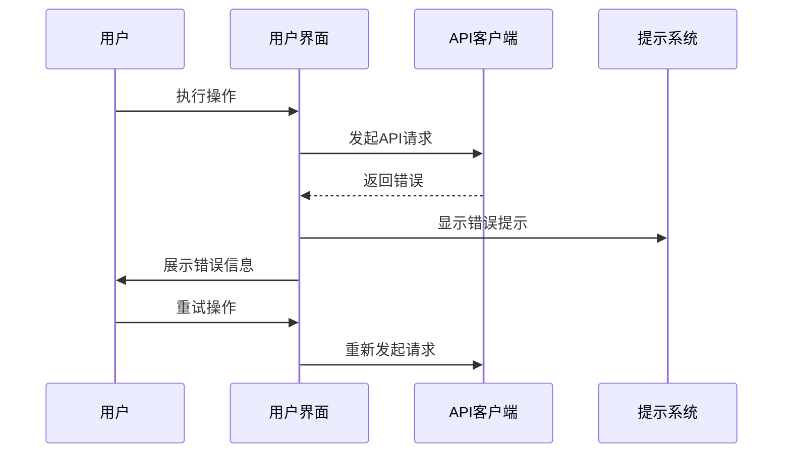

**图表来源**
- [toast.ts](file://web/lib/toast.ts#L1-L68)

**章节来源**
- [api.ts](file://web/lib/api.ts#L44-L56)
- [toast.ts](file://web/lib/toast.ts#L1-L68)

## 最佳实践指南

### API调用模式

#### 1. 基本调用模式

```typescript
// 正确的API调用模式
const loadKnowledgeBases = async () => {
  try {
    setLoading(true)
    setError(null)
    const response = await knowledgeBaseAPI.list()
    setKnowledgeBases(response.data)
  } catch (err: any) {
    setError(err.message || "加载失败")
    console.error("加载知识库列表失败:", err)
  } finally {
    setLoading(false)
  }
}
```

#### 2. 错误处理最佳实践

```typescript
// 推荐的错误处理方式
const handleDelete = async (id: string, name: string) => {
  if (!confirm(`确定要删除知识库"${name}"吗？此操作不可恢复。`)) {
    return
  }

  try {
    await knowledgeBaseAPI.delete(id)
    // 重新加载列表
    loadKnowledgeBases()
  } catch (err: any) {
    showToast(`删除失败: ${err.message}`, "error")
  }
}
```

#### 3. 表单数据处理

```typescript
// 处理复杂表单数据的最佳实践
const handleCreate = async () => {
  if (!selectedTestSetId || !formData.query) {
    showToast("请填写必填字段", "error")
    return
  }

  try {
    setLoading(true)
    await testAPI.createTestCase({
      test_set_id: selectedTestSetId,
      query: formData.query,
      expected_chunks: formData.expected_chunks.length > 0 ? formData.expected_chunks : undefined,
      expected_answer: formData.expected_answer || undefined,
      metadata: Object.keys(formData.metadata).length > 0 ? formData.metadata : undefined,
    })
    showToast("测试用例创建成功", "success")
    // 清空表单并刷新数据
    setFormData({ query: "", expected_chunks: [], expected_answer: "", metadata: {} })
    loadTestCases()
  } catch (error) {
    console.error("创建测试用例失败:", error)
    showToast("创建测试用例失败: " + (error as Error).message, "error")
  } finally {
    setLoading(false)
  }
}
```

### 性能优化建议

#### 1. 请求去重

```typescript
// 使用缓存避免重复请求
const cachedLoadKnowledgeBases = useMemo(() => {
  let lastData = null
  let lastTimestamp = 0
  
  return async () => {
    const now = Date.now()
    if (now - lastTimestamp < 5000 && lastData) {
      return lastData
    }
    
    const result = await knowledgeBaseAPI.list()
    lastData = result
    lastTimestamp = now
    return result
  }
}, [])
```

#### 2. 批量操作优化

```typescript
// 批量删除操作
const handleBatchDelete = async (ids: string[]) => {
  try {
    setLoading(true)
    const promises = ids.map(id => knowledgeBaseAPI.delete(id))
    await Promise.all(promises)
    showToast("批量删除成功", "success")
    loadKnowledgeBases()
  } catch (error) {
    showToast("批量删除失败", "error")
  } finally {
    setLoading(false)
  }
}
```

### 数据验证策略

#### 1. 输入验证

```typescript
// 表单验证示例
const validateForm = (formData: any) => {
  const errors: string[] = []
  
  if (!formData.name?.trim()) {
    errors.push("知识库名称不能为空")
  }
  
  if (formData.chunk_size < 100 || formData.chunk_size > 2000) {
    errors.push("分块大小必须在100-2000之间")
  }
  
  return errors
}
```

#### 2. 响应数据验证

```typescript
// 响应数据验证
const validateKnowledgeBaseResponse = (data: any): data is KnowledgeBase => {
  return !!data &&
    typeof data.id === 'string' &&
    typeof data.name === 'string' &&
    typeof data.embedding_model === 'string'
}
```

**章节来源**
- [knowledge-base-list.tsx](file://web/components/views/knowledge-base-list.tsx#L16-L42)
- [test-case-management.tsx](file://web/components/views/test-case-management.tsx#L89-L114)

## 认证集成建议

### Token管理

虽然当前API客户端没有内置认证逻辑，但建议的认证集成方案：

```typescript
// 认证中间件示例
class AuthMiddleware {
  private token: string | null = null
  private tokenExpiry: number = 0

  async request(endpoint: string, options: RequestInit = {}) {
    // 检查token有效性
    if (this.shouldRefreshToken()) {
      await this.refreshToken()
    }

    // 添加认证头
    const headers = {
      ...(this.token ? { Authorization: `Bearer ${this.token}` } : {}),
      ...options.headers
    }

    return request(endpoint, { ...options, headers })
  }

  private shouldRefreshToken(): boolean {
    return this.token && this.tokenExpiry < Date.now() + 300000 // 5分钟缓冲
  }

  private async refreshToken() {
    // 实现token刷新逻辑
  }
}
```

### 权限控制

```typescript
// 权限检查装饰器
function withPermission(permission: string) {
  return function(target: any, propertyKey: string, descriptor: PropertyDescriptor) {
    const originalMethod = descriptor.value
    
    descriptor.value = async function(...args: any[]) {
      if (!await checkPermission(permission)) {
        throw new Error('权限不足')
      }
      return originalMethod.apply(this, args)
    }
    
    return descriptor
  }
}
```

### 安全最佳实践

1. **HTTPS强制**: 确保所有API请求都通过HTTPS传输
2. **CORS配置**: 后端正确配置CORS策略
3. **CSRF保护**: 实现CSRF令牌验证
4. **输入过滤**: 对所有用户输入进行严格验证
5. **日志记录**: 记录敏感操作的日志

## 故障排除指南

### 常见问题及解决方案

#### 1. CORS跨域问题

**症状**: 浏览器控制台显示CORS错误
**解决方案**: 
- 检查后端CORS配置
- 确认API域名正确
- 使用代理服务器解决开发环境问题

#### 2. 认证失败

**症状**: 401 Unauthorized错误
**解决方案**:
- 检查token是否过期
- 验证token格式是否正确
- 确认用户权限设置

#### 3. 网络超时

**症状**: 请求长时间无响应
**解决方案**:
- 增加超时时间设置
- 实现请求重试机制
- 检查网络连接状态

#### 4. 数据格式错误

**症状**: JSON解析失败
**解决方案**:
- 验证API响应格式
- 添加数据验证逻辑
- 检查编码格式

### 调试技巧

#### 1. 启用详细日志

```typescript
// 开发环境启用详细日志
const DEBUG_MODE = process.env.NODE_ENV === 'development'

const debugRequest = async (endpoint: string, options: RequestInit = {}) => {
  if (DEBUG_MODE) {
    console.log('API Request:', { endpoint, options })
  }
  
  try {
    const response = await request(endpoint, options)
    if (DEBUG_MODE) {
      console.log('API Response:', response)
    }
    return response
  } catch (error) {
    if (DEBUG_MODE) {
      console.error('API Error:', error)
    }
    throw error
  }
}
```

#### 2. 网络监控

```typescript
// 网络请求监控
class NetworkMonitor {
  static recordRequest(start: number, endpoint: string, duration: number) {
    console.log(`API ${endpoint} took ${duration}ms`)
    // 可以在这里记录到性能监控系统
  }
}
```

### 性能监控

```typescript
// 性能监控示例
const monitoredRequest = async (endpoint: string, options: RequestInit = {}) => {
  const start = performance.now()
  
  try {
    const response = await request(endpoint, options)
    const duration = performance.now() - start
    
    NetworkMonitor.recordRequest(start, endpoint, duration)
    return response
  } catch (error) {
    const duration = performance.now() - start
    NetworkMonitor.recordRequest(start, endpoint, duration)
    throw error
  }
}
```

**章节来源**
- [api.ts](file://web/lib/api.ts#L44-L56)

## 总结

RAG-Studio的前端API集成架构展现了现代Web应用的最佳实践：

### 核心优势

1. **统一性**: 通过单一的`request`函数提供一致的API调用体验
2. **模块化**: 按功能领域清晰分离API服务对象
3. **类型安全**: 完整的TypeScript类型定义确保开发时的准确性
4. **可维护性**: 清晰的代码结构便于长期维护和扩展
5. **用户体验**: 完善的错误处理和用户反馈机制

### 技术亮点

- **智能Content-Type处理**: 自动识别请求体类型并设置合适的头部
- **查询参数序列化**: 简洁的URLSearchParams使用模式
- **错误处理策略**: 分层的错误处理和用户友好的错误提示
- **模块化设计**: 功能明确分离的API服务对象

### 发展方向

1. **认证集成**: 实现完整的认证和授权机制
2. **缓存优化**: 添加请求缓存和数据预取功能
3. **实时通信**: 集成WebSocket支持实时数据更新
4. **离线支持**: 实现离线模式和数据同步机制

这套API集成架构为RAG-Studio提供了坚实的技术基础，支持复杂的RAG应用场景，同时保持了良好的可扩展性和维护性。