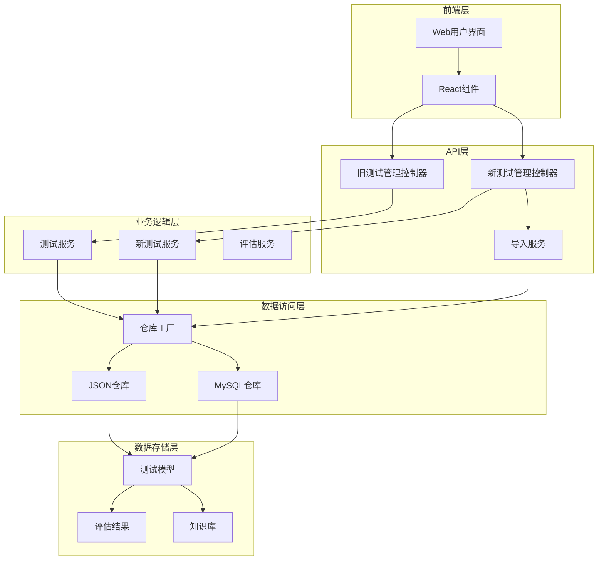
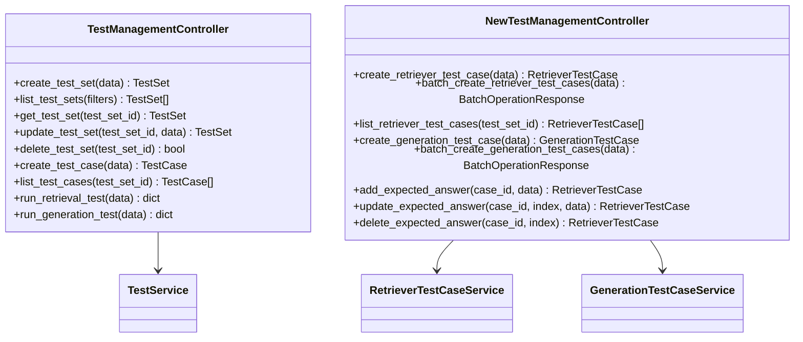
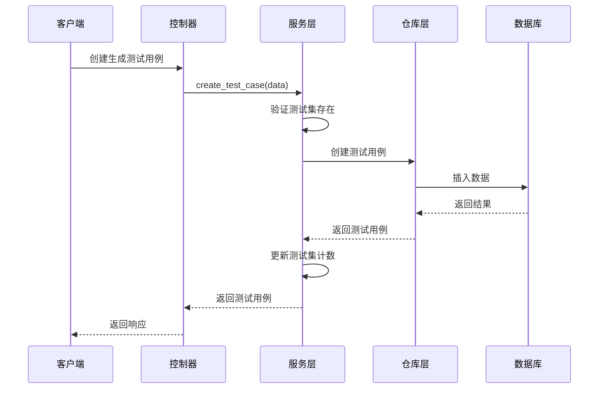
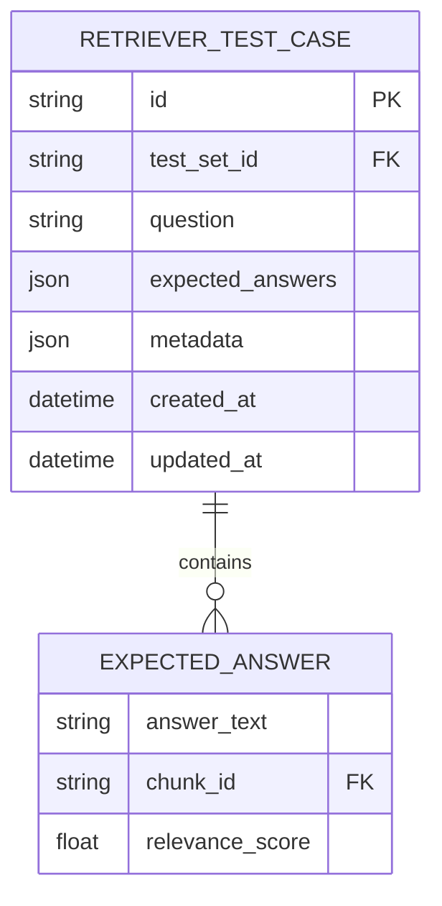
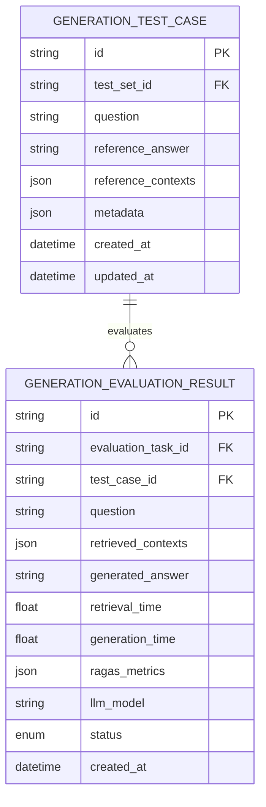
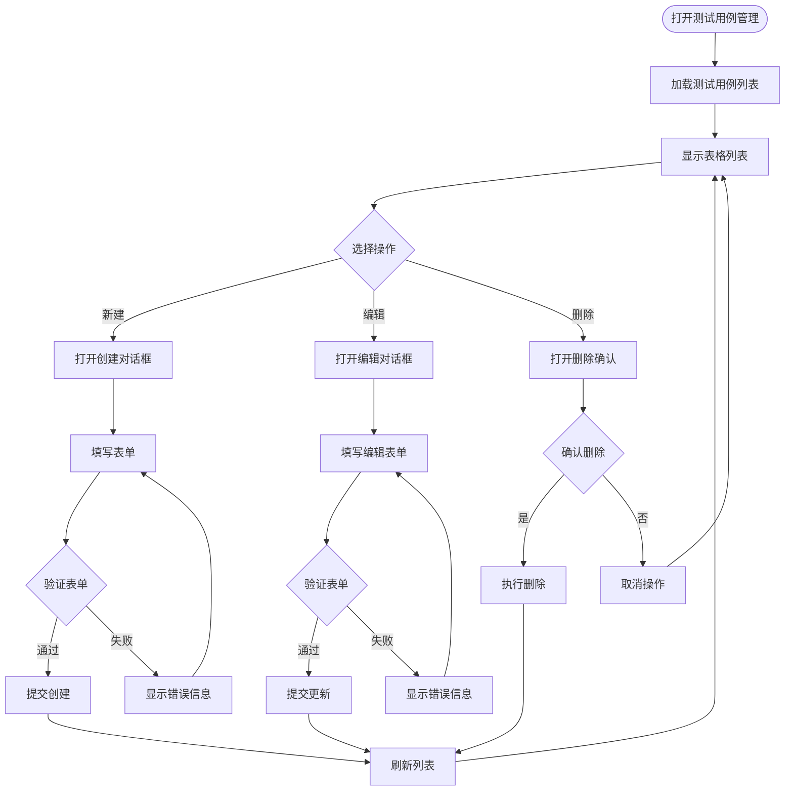
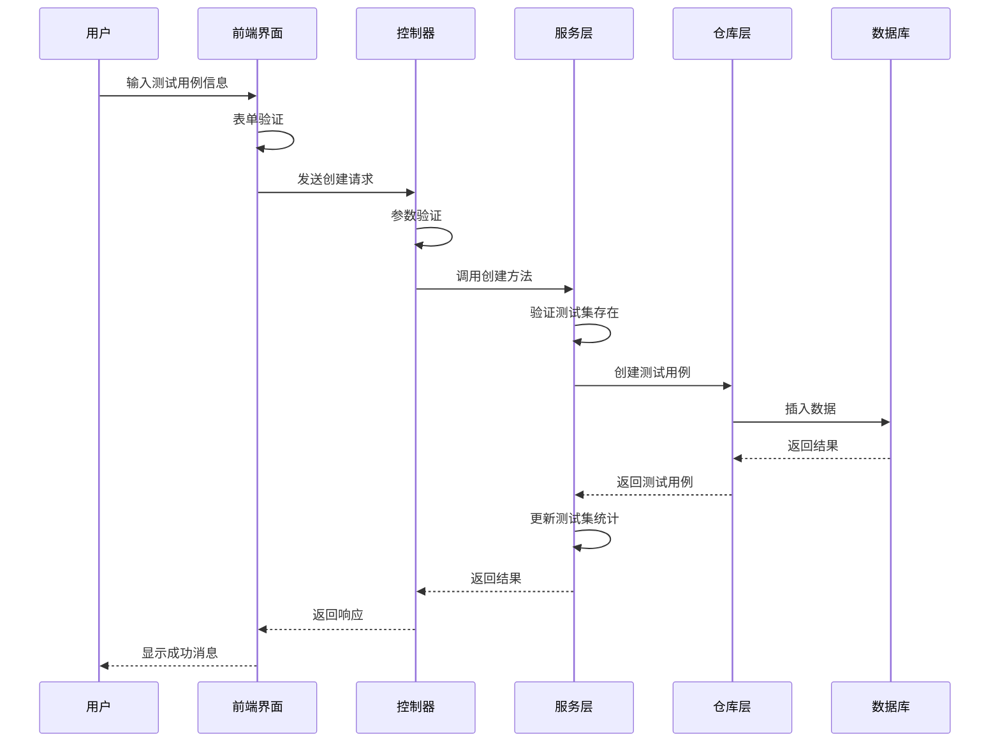
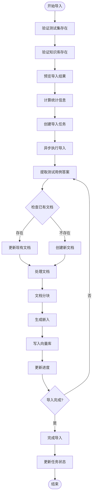

# Generation Test Case Management

<cite>
**Referenced Files in This Document**
- [test_management.py](file://backend/app/controllers/test_management.py)
- [new_test_management.py](file://backend/app/controllers/new_test_management.py)
- [test.py](file://backend/app/models/test.py)
- [test.py](file://backend/app/schemas/test.py)
- [test_service.py](file://backend/app/services/test_service.py)
- [new_test_service.py](file://backend/app/services/new_test_service.py)
- [test_set_import_service.py](file://backend/app/services/test_set_import_service.py)
- [generation-test-case-management.tsx](file://web/components/views/generation-test-case-management.tsx)
</cite>

## 目录
1. [项目概述](#项目概述)
2. [系统架构](#系统架构)
3. [核心组件](#核心组件)
4. [测试用例管理](#测试用例管理)
5. [API接口设计](#api接口设计)
6. [前端界面](#前端界面)
7. [数据模型](#数据模型)
8. [业务流程](#业务流程)
9. [性能考虑](#性能考虑)
10. [故障排除](#故障排除)

## 项目概述

RAG Studio是一个支持云边架构的知识库管理和测试评估平台，专注于检索增强生成（RAG）系统的测试管理。该项目提供了完整的测试用例管理系统，支持检索器测试用例和生成测试用例的独立管理，特别针对RAGAS评估指标进行优化。

### 主要特性

- **双轨测试管理**：支持传统的测试用例管理和新的检索器/生成测试用例分离管理
- **RAGAS评估集成**：专门针对生成式RAG系统的评估指标设计
- **灵活的数据导入**：支持从测试集导入到知识库的自动化流程
- **完整的CRUD操作**：提供测试用例的创建、读取、更新、删除功能
- **批量操作支持**：支持批量创建和删除测试用例

## 系统架构



**图表来源**
- [test_management.py](file://backend/app/controllers/test_management.py#L1-L50)
- [new_test_management.py](file://backend/app/controllers/new_test_management.py#L1-L50)
- [test_service.py](file://backend/app/services/test_service.py#L1-L50)
- [new_test_service.py](file://backend/app/services/new_test_service.py#L1-L50)

## 核心组件

### 控制器层

系统采用双控制器架构，分别处理传统测试管理和新的测试用例分离管理：

#### 旧测试管理控制器
负责传统的测试集和测试用例管理，支持检索和生成两种类型的测试。

#### 新测试管理控制器
专门处理检索器测试用例和生成测试用例的独立管理，提供更细粒度的控制。



**图表来源**
- [test_management.py](file://backend/app/controllers/test_management.py#L35-L728)
- [new_test_management.py](file://backend/app/controllers/new_test_management.py#L35-L651)

**章节来源**
- [test_management.py](file://backend/app/controllers/test_management.py#L1-L728)
- [new_test_management.py](file://backend/app/controllers/new_test_management.py#L1-L651)

### 服务层

#### 测试服务
提供基础的测试集和测试用例管理功能，支持传统的测试管理模式。

#### 新测试服务
专门处理检索器测试用例和生成测试用例的服务，提供更专业的RAG评估功能。



**图表来源**
- [new_test_service.py](file://backend/app/services/new_test_service.py#L278-L310)
- [test_set_import_service.py](file://backend/app/services/test_set_import_service.py#L30-L50)

**章节来源**
- [test_service.py](file://backend/app/services/test_service.py#L1-L352)
- [new_test_service.py](file://backend/app/services/new_test_service.py#L1-L437)

## 测试用例管理

### 检索器测试用例

检索器测试用例专门用于评估检索系统的性能，支持多个期望答案和关联度评分。

#### 核心特性
- **多答案支持**：每个测试用例可以包含多个期望答案
- **关联度评分**：为每个答案分配相关性分数
- **分块关联**：答案可以关联到具体的文档分块
- **元数据支持**：支持丰富的元数据存储

#### 数据结构


**图表来源**
- [test.py](file://backend/app/models/test.py#L163-L221)
- [test.py](file://backend/app/models/test.py#L146-L161)

### 生成测试用例

生成测试用例专门用于评估生成式RAG系统的性能，基于RAGAS评估指标设计。

#### 核心特性
- **参考答案**：提供标准答案用于评估
- **参考上下文**：支持多个参考上下文
- **RAGAS集成**：内置RAGAS评估指标
- **LLM配置**：支持指定使用的LLM模型

#### 数据结构


**图表来源**
- [test.py](file://backend/app/models/test.py#L198-L221)
- [test.py](file://backend/app/models/test.py#L320-L376)

**章节来源**
- [test.py](file://backend/app/models/test.py#L163-L221)
- [test.py](file://backend/app/models/test.py#L198-L221)

## API接口设计

### 检索器测试用例API

#### 创建检索器测试用例
```http
POST /tests/retriever/cases
Content-Type: application/json

{
  "test_set_id": "ts_001",
  "question": "Python中如何定义一个类？",
  "expected_answers": [
    {
      "answer_text": "在Python中使用class关键字定义类",
      "chunk_id": "chunk_001",
      "relevance_score": 1.0
    }
  ],
  "metadata": {
    "difficulty": "easy"
  }
}
```

#### 批量创建检索器测试用例
```http
POST /tests/retriever/cases/batch
Content-Type: application/json

{
  "test_set_id": "ts_001",
  "cases": [
    {
      "question": "Python中如何定义类？",
      "expected_answers": [
        {
          "answer_text": "使用class关键字",
          "chunk_id": "chunk_001",
          "relevance_score": 1.0
        }
      ],
      "metadata": {}
    }
  ]
}
```

#### 添加期望答案
```http
POST /tests/retriever/cases/{case_id}/answers
Content-Type: application/json

{
  "answer_text": "Python使用class关键字定义类",
  "chunk_id": "chunk_002",
  "relevance_score": 0.9
}
```

### 生成测试用例API

#### 创建生成测试用例
```http
POST /tests/generation/cases
Content-Type: application/json

{
  "test_set_id": "ts_002",
  "question": "什么是面向对象编程？",
  "reference_answer": "面向对象编程是一种编程范式...",
  "reference_contexts": [
    "面向对象编程的核心概念包括封装、继承和多态",
    "OOP是一种将数据和操作数据的方法组合在一起的编程方式"
  ],
  "metadata": {
    "difficulty": "medium"
  }
}
```

#### 批量创建生成测试用例
```http
POST /tests/generation/cases/batch
Content-Type: application/json

{
  "test_set_id": "ts_002",
  "cases": [
    {
      "question": "什么是面向对象编程？",
      "reference_answer": "面向对象编程是...",
      "reference_contexts": ["上下文1", "上下文2"],
      "metadata": {}
    }
  ]
}
```

**章节来源**
- [new_test_management.py](file://backend/app/controllers/new_test_management.py#L37-L111)
- [new_test_management.py](file://backend/app/controllers/new_test_management.py#L405-L480)

## 前端界面

### 生成测试用例管理界面

前端提供了直观的用户界面来管理生成测试用例，支持问题、参考答案和上下文的可视化管理。

#### 界面特性
- **实时表单验证**：确保必填字段的完整性
- **动态上下文管理**：支持添加、删除和编辑多个上下文
- **元数据编辑**：支持JSON格式的元数据编辑
- **分页浏览**：支持大量测试用例的分页展示
- **批量操作**：支持批量删除操作

#### 用户交互流程


**图表来源**
- [generation-test-case-management.tsx](file://web/components/views/generation-test-case-management.tsx#L54-L113)

**章节来源**
- [generation-test-case-management.tsx](file://web/components/views/generation-test-case-management.tsx#L1-L505)

## 数据模型

### 测试用例模型

系统定义了完整的测试用例数据模型，支持不同类型的测试需求。

#### 检索器测试用例模型
```python
class RetrieverTestCase(BaseModelMixin):
    test_set_id: str = Field(..., description="所属测试集ID")
    question: str = Field(..., description="问题文本内容", min_length=1)
    expected_answers: List[Dict[str, Any]] = Field(
        ..., description="期望答案列表", min_items=1
    )
    metadata: Dict[str, Any] = Field(default_factory=dict, description="用例元数据")
```

#### 生成测试用例模型
```python
class GenerationTestCase(BaseModelMixin):
    test_set_id: str = Field(..., description="所属测试集ID")
    question: str = Field(..., description="测试问题", min_length=1)
    reference_answer: str = Field(..., description="参考答案（用于RAGAS评估）")
    reference_contexts: List[str] = Field(
        default_factory=list, description="参考上下文列表（golden contexts）"
    )
    metadata: Dict[str, Any] = Field(default_factory=dict, description="用例元数据")
```

#### 评估结果模型
```python
class GenerationEvaluationResult(BaseModelMixin):
    evaluation_task_id: str = Field(..., description="评估任务ID")
    test_case_id: str = Field(..., description="测试用例ID（GenerationTestCase）")
    question: str = Field(..., description="问题（冗余存储便于查询）")
    retrieved_contexts: List[str] = Field(
        default_factory=list, description="检索到的上下文列表"
    )
    generated_answer: str = Field(..., description="生成的答案")
    generation_time: float = Field(..., description="生成耗时（秒）")
    ragas_metrics: Dict[str, Any] = Field(
        default_factory=dict,
        description="RAGAS评估指标集合（faithfulness, answer_relevancy等）"
    )
    llm_model: Optional[str] = Field(None, description="使用的LLM模型")
```

**章节来源**
- [test.py](file://backend/app/models/test.py#L163-L221)
- [test.py](file://backend/app/models/test.py#L198-L221)
- [test.py](file://backend/app/models/test.py#L320-L376)

## 业务流程

### 测试用例创建流程



**图表来源**
- [new_test_service.py](file://backend/app/services/new_test_service.py#L278-L310)
- [new_test_management.py](file://backend/app/controllers/new_test_management.py#L37-L61)

### 测试集导入流程



**图表来源**
- [test_set_import_service.py](file://backend/app/services/test_set_import_service.py#L82-L140)
- [test_set_import_service.py](file://backend/app/services/test_set_import_service.py#L142-L240)

**章节来源**
- [test_set_import_service.py](file://backend/app/services/test_set_import_service.py#L1-L564)

## 性能考虑

### 数据库优化

- **索引策略**：为测试集ID、知识库ID等常用查询字段建立索引
- **分页查询**：支持大数据量的分页查询，避免内存溢出
- **批量操作**：提供批量创建和删除功能，减少数据库交互次数

### 缓存策略

- **测试用例缓存**：对于频繁访问的测试用例数据进行缓存
- **配置快照**：缓存知识库配置以提高导入效率

### 异步处理

- **导入任务**：测试集导入采用异步任务处理，避免阻塞主线程
- **评估任务**：生成测试结果评估采用异步处理，支持长时间运行的任务

## 故障排除

### 常见问题及解决方案

#### 1. 测试用例创建失败
**问题**：创建测试用例时返回错误
**原因**：测试集不存在或必填字段缺失
**解决方案**：
- 确认测试集ID有效
- 检查必填字段是否完整
- 验证测试集状态是否正常

#### 2. 导入任务失败
**问题**：测试集导入过程中断
**原因**：网络问题或文档处理失败
**解决方案**：
- 检查网络连接
- 查看导入任务日志
- 重新启动导入任务

#### 3. 前端界面加载失败
**问题**：前端无法加载测试用例列表
**原因**：API接口不可用或跨域问题
**解决方案**：
- 检查后端服务状态
- 验证CORS配置
- 清除浏览器缓存

### 日志监控

系统提供了完善的日志记录功能，可以通过以下方式监控系统状态：

- **错误日志**：记录所有异常和错误信息
- **性能日志**：记录API响应时间和数据库查询时间
- **操作日志**：记录用户的关键操作行为

**章节来源**
- [test_service.py](file://backend/app/services/test_service.py#L318-L352)
- [new_test_service.py](file://backend/app/services/new_test_service.py#L190-L210)

## 结论

RAG Studio的Generation Test Case Management系统提供了完整的测试用例管理解决方案，支持检索器和生成测试用例的独立管理。系统采用现代化的架构设计，具有良好的扩展性和维护性。通过双控制器架构和专门的RAGAS评估集成，系统能够满足复杂的RAG系统测试需求，为用户提供高效、可靠的测试管理体验。