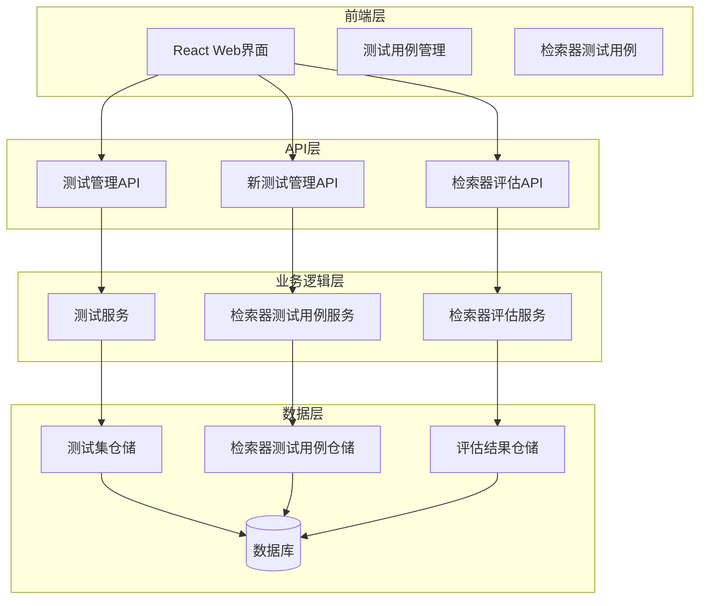
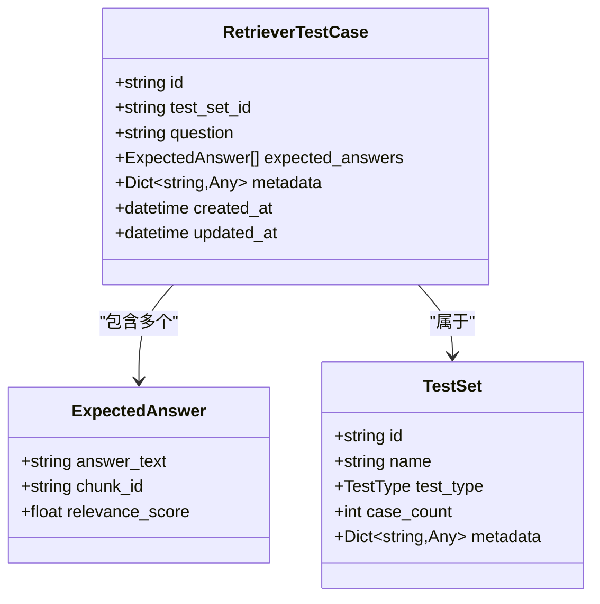
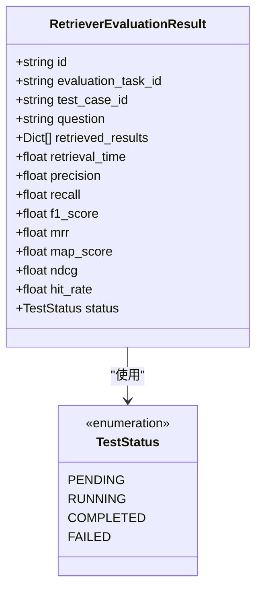
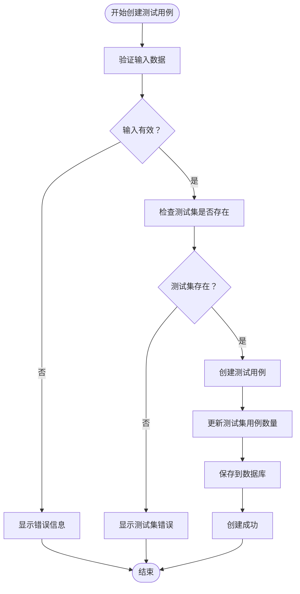
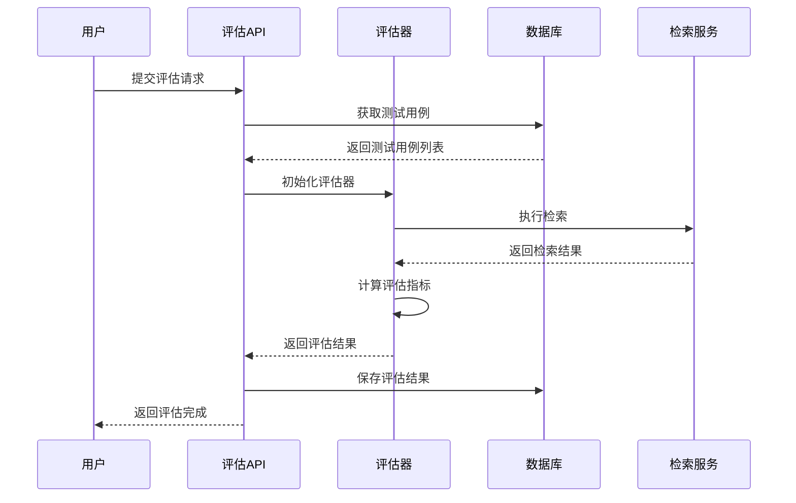

# Retriever Test Case Management

<cite>
**Referenced Files in This Document**
- [test_management.py](file://backend/app/controllers/test_management.py)
- [new_test_management.py](file://backend/app/controllers/new_test_management.py)
- [test.py](file://backend/app/models/test.py)
- [test_service.py](file://backend/app/services/test_service.py)
- [new_test_service.py](file://backend/app/services/new_test_service.py)
- [test.py](file://backend/app/schemas/test.py)
- [factory.py](file://backend/app/repositories/factory.py)
- [retriever-test-case-management.tsx](file://web/components/views/retriever-test-case-management.tsx)
- [test-case-management.tsx](file://web/components/views/test-case-management.tsx)
- [retriever_evaluation.py](file://backend/app/controllers/retriever_evaluation.py)
- [README_TEST.md](file://backend/README_TEST.md)
</cite>

## 目录
1. [简介](#简介)
2. [系统架构](#系统架构)
3. [核心组件](#核心组件)
4. [API接口设计](#api接口设计)
5. [数据模型](#数据模型)
6. [前端界面](#前端界面)
7. [业务流程](#业务流程)
8. [评估系统](#评估系统)
9. [最佳实践](#最佳实践)
10. [故障排查](#故障排查)

## 简介

Retriever Test Case Management 是 RAG Studio 系统中的核心测试管理模块，专门负责检索器测试用例的创建、管理和评估。该系统提供了完整的测试用例生命周期管理，支持多种测试场景，并集成了先进的评估指标计算功能。

### 主要特性

- **双版本管理**：同时支持传统测试用例和新一代检索器测试用例
- **灵活的期望答案管理**：支持多答案、关联度评分
- **批量操作**：支持批量创建、更新和删除测试用例
- **智能评估**：集成多种检索评估指标（Precision、Recall、F1、MRR等）
- **可视化界面**：提供直观的Web管理界面

## 系统架构



**图表来源**
- [test_management.py](file://backend/app/controllers/test_management.py#L1-L50)
- [new_test_management.py](file://backend/app/controllers/new_test_management.py#L1-L50)
- [factory.py](file://backend/app/repositories/factory.py#L1-L146)

## 核心组件

### 控制器层

系统包含三个主要的控制器，分别处理不同的测试用例类型：

#### 传统测试用例控制器
- **功能**：管理传统的测试用例（TestCase）
- **特点**：支持期望答案和期望分块的单一答案模式
- **适用场景**：简单的检索测试场景

#### 新一代测试用例控制器
- **功能**：管理检索器测试用例（RetrieverTestCase）
- **特点**：支持多期望答案、关联度评分
- **适用场景**：复杂的检索测试和评估场景

#### 检索器评估控制器
- **功能**：提供检索器评估和数据分析功能
- **特点**：支持T2Ranking数据集导入、评估指标计算
- **适用场景**：系统级检索器性能评估

**章节来源**
- [test_management.py](file://backend/app/controllers/test_management.py#L1-L728)
- [new_test_management.py](file://backend/app/controllers/new_test_management.py#L1-L651)
- [retriever_evaluation.py](file://backend/app/controllers/retriever_evaluation.py#L1-L375)

### 服务层

#### 测试服务
负责基础的测试集和测试用例管理，包括CRUD操作和批量处理。

#### 检索器测试用例服务
专门处理检索器测试用例的复杂业务逻辑，包括：
- 多答案管理
- 关联度评分
- 批量操作
- 答案验证

#### 检索器评估服务
提供高级的评估功能，包括：
- T2Ranking数据集支持
- 多种评估指标计算
- 评估历史管理

**章节来源**
- [test_service.py](file://backend/app/services/test_service.py#L1-L352)
- [new_test_service.py](file://backend/app/services/new_test_service.py#L1-L437)

## API接口设计

### 检索器测试用例API

#### 创建测试用例
```http
POST /api/v1/tests/retriever/cases
Content-Type: application/json

{
  "test_set_id": "ts_001",
  "question": "Python中如何定义一个类？",
  "expected_answers": [
    {
      "answer_text": "在Python中使用class关键字定义类",
      "chunk_id": "chunk_001",
      "relevance_score": 1.0
    }
  ],
  "metadata": {
    "difficulty": "easy"
  }
}
```

#### 批量创建测试用例
```http
POST /api/v1/tests/retriever/cases/batch
Content-Type: application/json

{
  "test_set_id": "ts_001",
  "cases": [
    {
      "question": "Python中如何定义类？",
      "expected_answers": [...],
      "metadata": {...}
    }
  ]
}
```

#### 管理期望答案
- **添加答案**：`POST /tests/retriever/cases/{case_id}/answers`
- **更新答案**：`PUT /tests/retriever/cases/{case_id}/answers/{answer_index}`
- **删除答案**：`DELETE /tests/retriever/cases/{case_id}/answers/{answer_index}`

### 评估相关API

#### 导入T2Ranking数据集
```http
POST /api/v1/retriever-evaluation/import-t2ranking
Content-Type: application/json

{
  "kb_id": "kb_001",
  "test_set_name": "T2Ranking测试集",
  "collection_path": "/path/to/collection.tsv",
  "queries_path": "/path/to/queries.tsv",
  "qrels_path": "/path/to/qrels.tsv"
}
```

#### 执行评估
```http
POST /api/v1/retriever-evaluation/evaluate
Content-Type: application/json

{
  "kb_id": "kb_001",
  "test_set_id": "ts_001",
  "top_k": 10,
  "vector_db_type": "elasticsearch",
  "embedding_model": "nomic-embed-text"
}
```

**章节来源**
- [new_test_management.py](file://backend/app/controllers/new_test_management.py#L37-L400)
- [retriever_evaluation.py](file://backend/app/controllers/retriever_evaluation.py#L26-L200)

## 数据模型

### 检索器测试用例模型



**图表来源**
- [test.py](file://backend/app/models/test.py#L163-L221)

### 评估结果模型



**图表来源**
- [test.py](file://backend/app/models/test.py#L272-L318)

**章节来源**
- [test.py](file://backend/app/models/test.py#L1-L441)

## 前端界面

### 检索器测试用例管理界面

前端界面提供了直观的测试用例管理功能：

#### 主要功能
- **测试用例列表**：显示问题、答案数量、创建时间
- **批量操作**：支持批量创建、删除
- **期望答案管理**：动态添加、编辑、删除答案
- **关联度评分**：支持0-4分的关联度评分
- **元数据编辑**：支持JSON格式的元数据编辑

#### 用户体验特点
- **实时验证**：表单输入实时验证
- **拖拽排序**：答案可以重新排序
- **批量操作**：支持全选、批量删除
- **分页导航**：支持大量数据的分页浏览

**章节来源**
- [retriever-test-case-management.tsx](file://web/components/views/retriever-test-case-management.tsx#L1-L519)

### 传统测试用例管理界面

传统界面支持：
- **测试集选择**：下拉菜单选择测试集
- **查询问题管理**：支持检索和生成两种类型的测试用例
- **期望分块管理**：逗号分隔的分块ID列表
- **期望答案管理**：简单的文本输入框

**章节来源**
- [test-case-management.tsx](file://web/components/views/test-case-management.tsx#L1-L452)

## 业务流程

### 测试用例创建流程



**图表来源**
- [new_test_service.py](file://backend/app/services/new_test_service.py#L25-L65)

### 评估执行流程



**图表来源**
- [retriever_evaluation.py](file://backend/app/controllers/retriever_evaluation.py#L197-L295)

**章节来源**
- [new_test_service.py](file://backend/app/services/new_test_service.py#L67-L123)
- [retriever_evaluation.py](file://backend/app/controllers/retriever_evaluation.py#L197-L374)

## 评估系统

### 支持的评估指标

#### 检索评估指标
- **Precision@K**：精确率，衡量检索结果中有多少是相关的
- **Recall@K**：召回率，衡量相关文档中有多少被检索到
- **F1-Score**：精确率和召回率的调和平均数
- **MRR**：平均倒数排名，衡量第一个相关结果的位置
- **MAP**：平均精度均值，考虑所有相关结果的位置
- **NDCG**：归一化折损累积增益，考虑结果的相关性排序
- **Hit Rate**：命中率，衡量至少有一个相关结果的比例

#### 生成评估指标
- **Faithfulness**：忠实度，评估生成答案与检索内容的一致性
- **Answer Relevancy**：答案相关性，评估生成答案与问题的相关程度
- **Context Precision**：上下文精度，评估检索上下文的质量
- **Context Recall**：上下文召回率，评估检索上下文的完整性
- **Answer Similarity**：答案相似度，评估生成答案与参考答案的相似程度
- **Answer Correctness**：答案正确性，评估生成答案的准确性

### T2Ranking数据集支持

系统原生支持T2Ranking数据集的导入和处理：

#### 数据集结构
- **Collection**：文档集合，包含所有文档的文本
- **Queries**：查询集合，包含测试问题
- **Qrels**：相关性标注，标明每个查询的相关文档

#### 导入流程
1. **数据加载**：解析TSV文件格式的数据
2. **文档导入**：将文档批量导入到知识库
3. **测试用例创建**：基于查询和相关性标注创建测试用例
4. **映射建立**：建立外部ID到内部ID的映射关系

**章节来源**
- [retriever_evaluation.py](file://backend/app/controllers/retriever_evaluation.py#L26-L159)

## 最佳实践

### 测试用例设计原则

#### 问题设计
- **清晰明确**：问题应该简洁明了，避免歧义
- **覆盖全面**：涵盖各种可能的查询场景
- **难度适中**：根据目标用户群体调整问题难度
- **真实场景**：模拟真实的用户查询场景

#### 期望答案设计
- **完整性**：确保答案能够完整回答问题
- **多样性**：提供多个角度的回答
- **关联度评分**：合理设置关联度分数
- **chunk_id关联**：准确关联到具体的文档片段

### 性能优化建议

#### 数据库优化
- **索引设计**：为常用查询字段建立索引
- **分页查询**：大数据量时使用分页查询
- **缓存策略**：对频繁访问的数据进行缓存

#### API优化
- **批量操作**：尽量使用批量API减少网络开销
- **异步处理**：对于耗时操作使用异步处理
- **错误处理**：完善的错误处理和重试机制

### 安全考虑

#### 输入验证
- **长度限制**：对输入字段设置合理的长度限制
- **格式验证**：验证JSON格式的元数据
- **字符过滤**：防止恶意字符注入

#### 权限控制
- **测试集隔离**：确保测试集之间的数据隔离
- **操作审计**：记录重要的操作日志
- **访问控制**：实现细粒度的访问控制

## 故障排查

### 常见问题及解决方案

#### 测试用例创建失败
**问题现象**：创建测试用例时返回错误
**可能原因**：
- 测试集不存在
- 输入数据格式错误
- 数据库连接问题

**解决步骤**：
1. 检查测试集ID是否正确
2. 验证输入数据格式
3. 查看后端日志获取详细错误信息

#### 评估指标计算异常
**问题现象**：评估结果为空或计算错误
**可能原因**：
- 检索服务未正确配置
- 测试用例数据不完整
- 评估参数设置错误

**解决步骤**：
1. 检查检索服务配置
2. 验证测试用例数据完整性
3. 调整评估参数设置

#### 前端界面加载失败
**问题现象**：页面无法正常加载或显示错误
**可能原因**：
- API接口不可用
- CORS配置问题
- 前端依赖缺失

**解决步骤**：
1. 检查后端服务状态
2. 验证CORS配置
3. 重新安装前端依赖

### 日志分析

#### 后端日志
- **错误级别**：记录详细的错误堆栈信息
- **警告级别**：记录潜在的问题和异常情况
- **信息级别**：记录正常的业务流程
- **调试级别**：记录详细的调试信息

#### 前端日志
- **浏览器控制台**：查看JavaScript错误和网络请求
- **API响应**：检查API调用的响应状态和数据
- **用户行为**：记录用户的操作轨迹

**章节来源**
- [README_TEST.md](file://backend/README_TEST.md#L157-L208)

## 结论

Retriever Test Case Management 系统提供了完整的检索器测试用例管理解决方案，通过现代化的架构设计和丰富的功能特性，能够满足各种复杂的测试需求。系统的模块化设计使其具有良好的扩展性和维护性，而完善的评估功能则为检索器性能优化提供了有力支持。

随着系统的不断发展和完善，未来可以考虑引入更多的评估指标、支持更多的数据集格式、以及提供更智能的测试用例推荐功能，进一步提升系统的实用价值和用户体验。