# UI组件架构

<cite>
**本文档引用的文件**
- [button.tsx](file://web/components/ui/button.tsx)
- [input.tsx](file://web/components/ui/input.tsx)
- [card.tsx](file://web/components/ui/card.tsx)
- [dialog.tsx](file://web/components/ui/dialog.tsx)
- [select.tsx](file://web/components/ui/select.tsx)
- [dropdown-menu.tsx](file://web/components/ui/dropdown-menu.tsx)
- [avatar.tsx](file://web/components/ui/avatar.tsx)
- [retrieval.tsx](file://web/components/views/retrieval.tsx)
- [knowledge-base-list.tsx](file://web/components/views/knowledge-base-list.tsx)
- [retriever-evaluation.tsx](file://web/components/views/retriever-evaluation.tsx)
- [header.tsx](file://web/components/header.tsx)
- [sidebar.tsx](file://web/components/sidebar.tsx)
- [api.ts](file://web/lib/api.ts)
- [utils.ts](file://web/lib/utils.ts)
- [layout.tsx](file://web/app/layout.tsx)
- [page.tsx](file://web/app/page.tsx)
</cite>

## 目录
1. [简介](#简介)
2. [项目结构概览](#项目结构概览)
3. [基础UI组件层](#基础ui组件层)
4. [视图组件层](#视图组件层)
5. [布局组件](#布局组件)
6. [API服务层](#api服务层)
7. [工具函数](#工具函数)
8. [组件扩展指南](#组件扩展指南)
9. [主题定制方案](#主题定制方案)
10. [总结](#总结)

## 简介

RAG-Studio采用现代化的React + Tailwind CSS架构，构建了一套完整的UI组件体系。该架构分为两个主要层次：基础UI组件层提供可复用的原子化UI元素，视图组件层封装具体的业务逻辑和功能模块。整个系统遵循组件化设计理念，具有良好的可维护性和扩展性。

## 项目结构概览

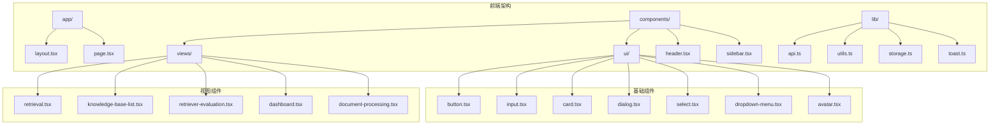

**图表来源**
- [layout.tsx](file://web/app/layout.tsx#L1-L37)
- [page.tsx](file://web/app/page.tsx#L1-L109)
- [button.tsx](file://web/components/ui/button.tsx#L1-L61)

**章节来源**
- [layout.tsx](file://web/app/layout.tsx#L1-L37)
- [page.tsx](file://web/app/page.tsx#L1-L109)

## 基础UI组件层

### 组件设计原则

基础UI组件层采用原子化设计原则，每个组件都是独立的功能单元，具有明确的职责和清晰的接口。组件设计遵循以下原则：

- **单一职责**：每个组件只负责一种特定的UI功能
- **可组合性**：组件可以灵活组合形成复杂的界面
- **可定制性**：通过props和CSS变量支持样式定制
- **无障碍支持**：内置ARIA标签和键盘导航支持

### 核心基础组件

#### Button组件

Button组件是系统中最核心的基础组件之一，提供了丰富的变体和尺寸选项。

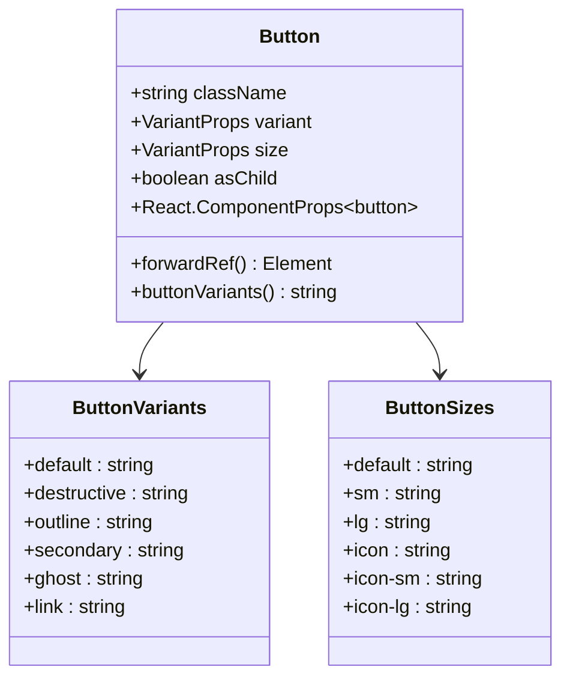

**图表来源**
- [button.tsx](file://web/components/ui/button.tsx#L7-L37)

**主要特性：**
- 支持多种变体（default、destructive、outline、secondary、ghost、link）
- 提供多种尺寸（default、sm、lg、icon系列）
- 支持asChild模式，允许将按钮渲染为其他元素
- 内置焦点状态和禁用状态样式
- 支持SVG图标内联显示

**使用方式：**
```typescript
// 基本使用
<Button>默认按钮</Button>

// 不同变体
<Button variant="destructive">危险操作</Button>
<Button variant="outline">轮廓按钮</Button>

// 不同尺寸
<Button size="sm">小按钮</Button>
<Button size="lg">大按钮</Button>

// 图标按钮
<Button size="icon">
  <PlusIcon />
</Button>
```

**章节来源**
- [button.tsx](file://web/components/ui/button.tsx#L1-L61)

#### Input组件

Input组件提供了统一的输入框样式，支持各种输入类型和验证状态。

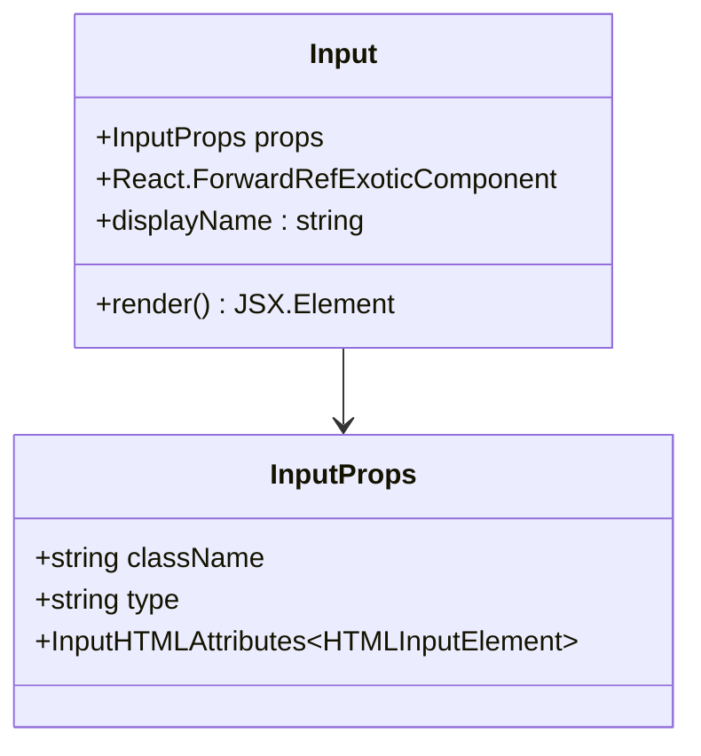

**图表来源**
- [input.tsx](file://web/components/ui/input.tsx#L5-L27)

**主要特性：**
- 统一的边框和阴影样式
- 内置聚焦状态和禁用状态
- 支持文件上传特殊样式
- 适配各种输入类型（text、password、email等）

**章节来源**
- [input.tsx](file://web/components/ui/input.tsx#L1-L27)

#### Card组件

Card组件是一个复合容器组件，包含多个子组件，用于创建卡片式布局。

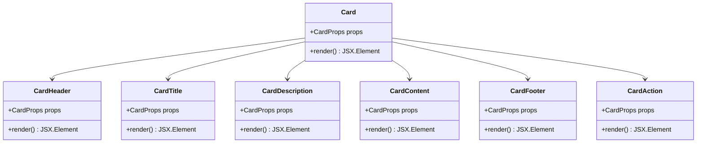

**图表来源**
- [card.tsx](file://web/components/ui/card.tsx#L5-L93)

**主要特性：**
- 支持语义化的卡片结构
- 内置响应式布局
- 支持卡片头部操作区域
- 自动处理间距和对齐

**章节来源**
- [card.tsx](file://web/components/ui/card.tsx#L1-L93)

#### Dialog组件

Dialog组件提供了模态对话框功能，支持复杂的交互场景。

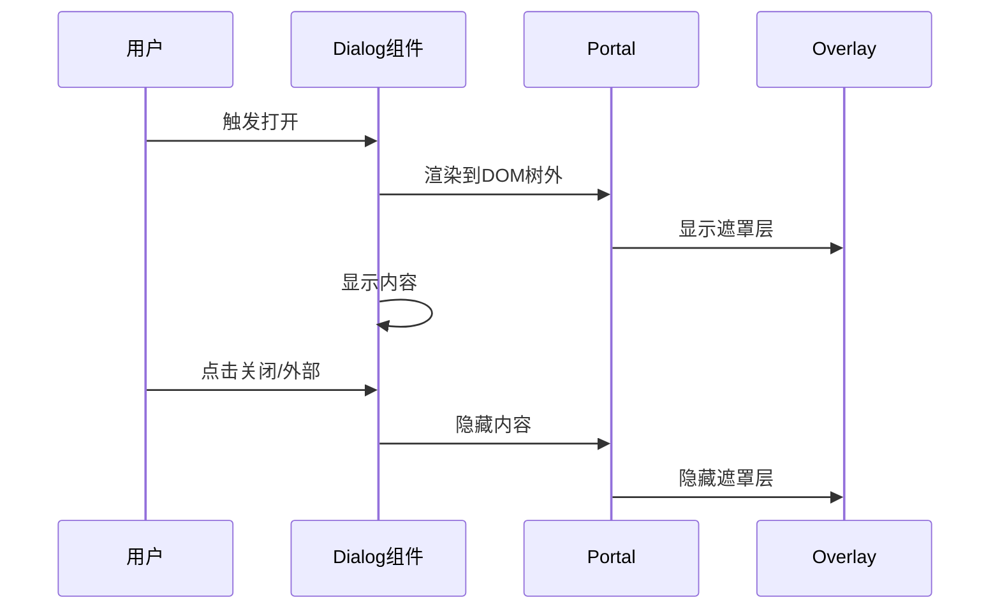

**图表来源**
- [dialog.tsx](file://web/components/ui/dialog.tsx#L1-L122)

**主要特性：**
- 支持Portal渲染，避免z-index问题
- 内置动画效果
- 支持ESC键关闭
- 可访问性支持（focus trap）

**章节来源**
- [dialog.tsx](file://web/components/ui/dialog.tsx#L1-L122)

#### Select组件

Select组件提供了下拉选择功能，支持搜索和自定义选项。

**章节来源**
- [select.tsx](file://web/components/ui/select.tsx#L1-L159)

#### DropdownMenu组件

DropdownMenu组件实现了下拉菜单功能，支持嵌套和复杂交互。

**章节来源**
- [dropdown-menu.tsx](file://web/components/ui/dropdown-menu.tsx#L1-L258)

#### Avatar组件

Avatar组件用于显示用户头像，支持图片和占位符。

**章节来源**
- [avatar.tsx](file://web/components/ui/avatar.tsx#L1-L54)

## 视图组件层

### 架构设计

视图组件层负责封装具体的业务逻辑，每个组件都对应一个特定的功能模块。视图组件通过组合基础组件来构建复杂的用户界面，并与API服务层进行数据交互。

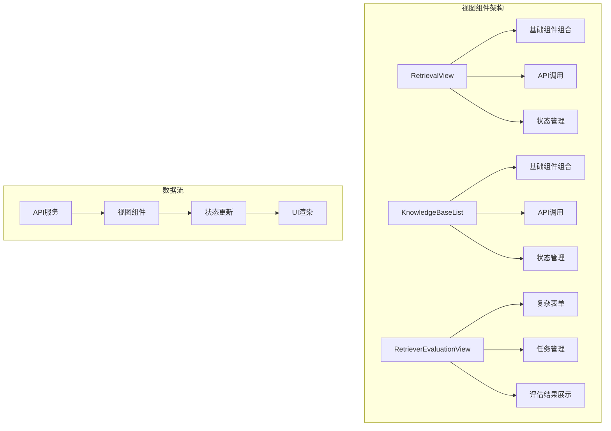

**图表来源**
- [retrieval.tsx](file://web/components/views/retrieval.tsx#L1-L532)
- [knowledge-base-list.tsx](file://web/components/views/knowledge-base-list.tsx#L1-L149)
- [retriever-evaluation.tsx](file://web/components/views/retriever-evaluation.tsx#L1-L645)

### 核心视图组件

#### RetrievalView - 检索测试组件

RetrievalView是系统的核心功能组件之一，提供了完整的检索测试流程。

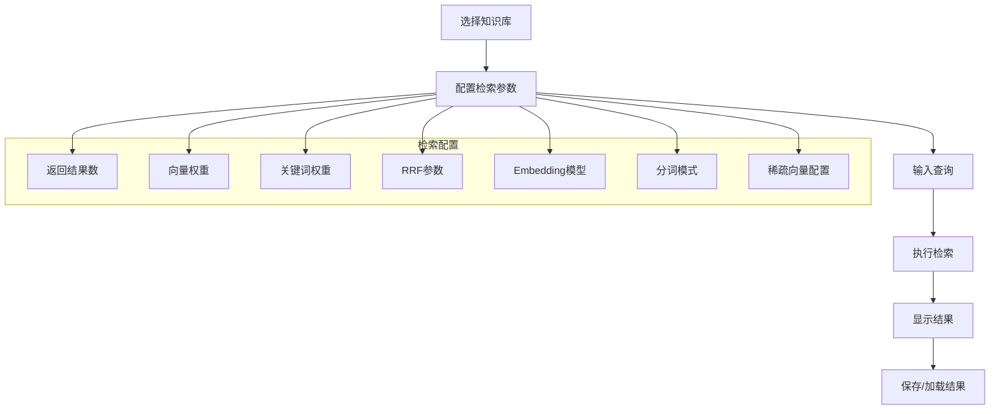

**图表来源**
- [retrieval.tsx](file://web/components/views/retrieval.tsx#L243-L532)

**主要功能：**
- 知识库选择和管理
- 检索参数配置（向量权重、关键词权重、RRF参数等）
- 混合检索算法执行
- 检索结果可视化
- 结果保存和加载功能

**章节来源**
- [retrieval.tsx](file://web/components/views/retrieval.tsx#L1-L532)

#### KnowledgeBaseList - 知识库列表组件

KnowledgeBaseList组件负责管理知识库的生命周期。

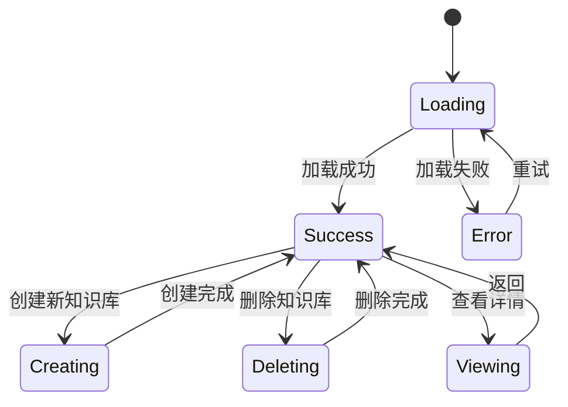

**图表来源**
- [knowledge-base-list.tsx](file://web/components/views/knowledge-base-list.tsx#L1-L149)

**主要功能：**
- 知识库列表展示
- 知识库创建和删除
- 知识库状态管理
- 错误处理和重试机制

**章节来源**
- [knowledge-base-list.tsx](file://web/components/views/knowledge-base-list.tsx#L1-L149)

#### RetrieverEvaluationView - 检索器评估组件

RetrieverEvaluationView提供了完整的检索器评估功能。

```mermaid
graph LR
A[数据集统计] --> B[导入数据集]
B --> C[创建测试集]
C --> D[配置评估任务]
D --> E[执行评估]
E --> F[查看结果]
subgraph "评估指标"
G[Precision@K]
H[Recall@K]
I[F1-Score]
J[MRR]
K[MAP]
L[NDCG]
M[Hit Rate]
end
F --> G
F --> H
F --> I
F --> J
F --> K
F --> L
F --> M
```

**图表来源**
- [retriever-evaluation.tsx](file://web/components/views/retriever-evaluation.tsx#L1-L645)

**主要功能：**
- T2Ranking数据集统计
- 数据集导入和管理
- 评估任务创建和执行
- 多维度评估指标展示
- 评估结果对比分析

**章节来源**
- [retriever-evaluation.tsx](file://web/components/views/retriever-evaluation.tsx#L1-L645)

### 组件间通信

视图组件通过以下方式进行通信和数据共享：

1. **Props传递**：父子组件间的数据传递
2. **事件系统**：自定义事件触发导航和状态更新
3. **全局状态**：通过React Context或状态管理库
4. **API调用**：与后端服务的数据交互

## 布局组件

### Header组件

Header组件负责页面顶部导航和用户信息展示。

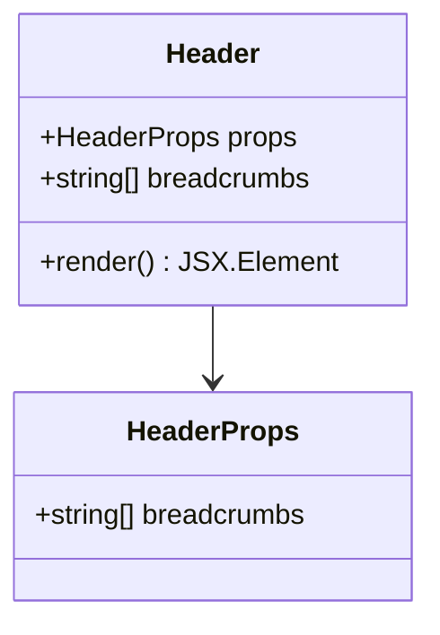

**图表来源**
- [header.tsx](file://web/components/header.tsx#L13-L69)

**主要功能：**
- 面包屑导航
- 在线状态指示器
- 用户菜单
- 通知图标

**章节来源**
- [header.tsx](file://web/components/header.tsx#L1-L69)

### Sidebar组件

Sidebar组件提供侧边导航菜单。

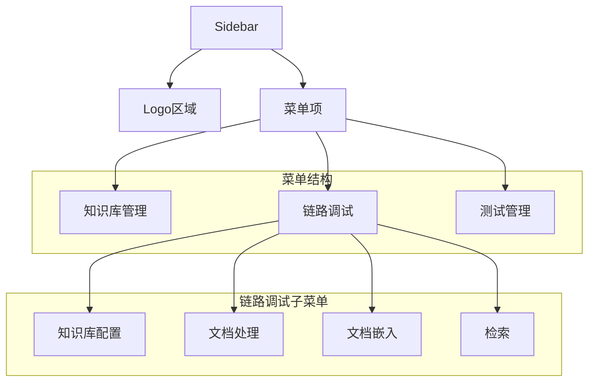

**图表来源**
- [sidebar.tsx](file://web/components/sidebar.tsx#L19-L50)

**主要功能：**
- 三级菜单结构
- 动态展开/折叠
- 当前选中状态高亮
- 响应式设计

**章节来源**
- [sidebar.tsx](file://web/components/sidebar.tsx#L1-L128)

## API服务层

### API架构设计

API服务层采用统一的客户端架构，提供类型安全的API调用接口。

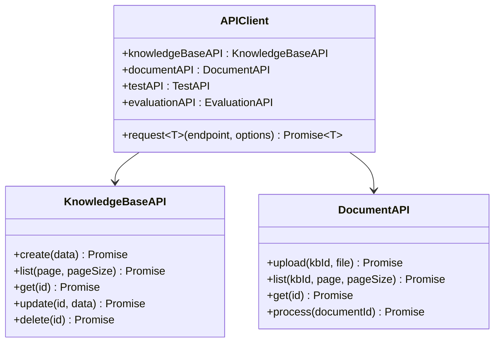

**图表来源**
- [api.ts](file://web/lib/api.ts#L1-L800)

**主要特性：**
- 类型安全的API调用
- 统一的错误处理
- 支持FormData上传
- 灵活的配置选项

**章节来源**
- [api.ts](file://web/lib/api.ts#L1-L800)

### 数据类型定义

系统定义了完整的TypeScript类型，确保类型安全：

- **KnowledgeBase**: 知识库实体定义
- **Document**: 文档实体定义  
- **TestSet**: 测试集实体定义
- **TestCase**: 测试用例实体定义
- **EvaluationTask**: 评估任务实体定义

## 工具函数

### 样式工具函数

utils.ts提供了样式类名合并工具：

```typescript
// 使用Tailwind Merge和CLSX进行样式合并
export function cn(...inputs: ClassValue[]) {
  return twMerge(clsx(inputs))
}
```

**章节来源**
- [utils.ts](file://web/lib/utils.ts#L1-L7)

## 组件扩展指南

### 添加新基础组件

1. **创建组件文件**：在`web/components/ui/`目录下创建新组件
2. **定义接口**：使用TypeScript定义props接口
3. **样式处理**：使用Tailwind CSS和cn函数
4. **导出组件**：在index.ts中导出组件

### 添加新视图组件

1. **创建组件文件**：在`web/components/views/`目录下创建新组件
2. **集成基础组件**：组合使用基础UI组件
3. **API集成**：连接API服务层
4. **状态管理**：使用React Hooks管理状态
5. **路由集成**：在page.tsx中注册新路由

### 组件测试策略

1. **单元测试**：测试组件的渲染和交互
2. **集成测试**：测试组件间的协作
3. **端到端测试**：测试完整的用户流程

## 主题定制方案

### Tailwind CSS配置

系统使用Tailwind CSS作为样式框架，支持深度定制：

```typescript
// 在tailwind.config.ts中配置主题
module.exports = {
  theme: {
    extend: {
      colors: {
        primary: 'var(--color-primary)',
        secondary: 'var(--color-secondary)',
        background: 'var(--color-background)',
        foreground: 'var(--color-foreground)',
      },
      fontFamily: {
        sans: ['var(--font-geist-sans)'],
        mono: ['var(--font-geist-mono)'],
      },
    },
  },
}
```

### CSS变量系统

系统使用CSS变量实现主题切换：

```css
:root {
  --background: 0 0% 100%;
  --foreground: 224 71.4% 4.1%;
  --card: 0 0% 100%;
  --card-foreground: 224 71.4% 4.1%;
  --popover: 0 0% 100%;
  --popover-foreground: 224 71.4% 4.1%;
  --primary: 220.9 39.3% 11%;
  --primary-foreground: 210 20% 98%;
  --secondary: 220 14.3% 95.9%;
  --secondary-foreground: 220.9 39.3% 11%;
  --muted: 220 14.3% 95.9%;
  --muted-foreground: 220 8.9% 46.1%;
  --accent: 220 14.3% 95.9%;
  --accent-foreground: 220.9 39.3% 11%;
  --destructive: 0 84.2% 60.2%;
  --destructive-foreground: 210 20% 98%;
  --border: 220 13% 91%;
  --input: 220 13% 91%;
  --ring: 224 71.4% 4.1%;
  --radius: 0.5rem;
}
```

### 暗色主题支持

系统内置暗色主题支持，通过CSS变量实现无缝切换：

```css
.dark {
  --background: 224 71.4% 4.1%;
  --foreground: 210 20% 98%;
  --card: 224 71.4% 4.1%;
  --card-foreground: 210 20% 98%;
  --popover: 224 71.4% 4.1%;
  --popover-foreground: 210 20% 98%;
  --primary: 210 20% 98%;
  --primary-foreground: 220.9 39.3% 11%;
  --secondary: 215 27.9% 16.1%;
  --secondary-foreground: 210 20% 98%;
  --muted: 215 27.9% 16.1%;
  --muted-foreground: 217.9 10.6% 64.9%;
  --accent: 215 27.9% 16.1%;
  --accent-foreground: 210 20% 98%;
  --destructive: 0 62.8% 30.6%;
  --destructive-foreground: 210 20% 98%;
  --border: 215 27.9% 16.1%;
  --input: 215 27.9% 16.1%;
  --ring: 216 12.2% 83.9%;
}
```

## 总结

RAG-Studio的UI组件架构体现了现代前端开发的最佳实践：

1. **分层清晰**：基础组件层和视图组件层职责分明
2. **组件化设计**：每个组件都有明确的职责和接口
3. **类型安全**：完整的TypeScript类型定义
4. **可扩展性**：易于添加新组件和功能
5. **主题支持**：内置明暗主题切换
6. **无障碍友好**：支持键盘导航和屏幕阅读器

这套架构为RAG-Studio提供了坚实的技术基础，支持复杂的企业级应用开发需求。通过合理的组件设计和清晰的职责划分，系统具有良好的可维护性和扩展性，能够适应不断变化的业务需求。