# RAG-Studio业务视图组件全面文档

<cite>
**本文档引用的文件**
- [retrieval.tsx](file://web/components/views/retrieval.tsx)
- [retriever-evaluation.tsx](file://web/components/views/retriever-evaluation.tsx)
- [knowledge-base-config.tsx](file://web/components/views/knowledge-base-config.tsx)
- [knowledge-base-list.tsx](file://web/components/views/knowledge-base-list.tsx)
- [generation-test.tsx](file://web/components/views/generation-test.tsx)
- [generator-evaluation.tsx](file://web/components/views/generator-evaluation.tsx)
- [evaluation-history.tsx](file://web/components/views/evaluation-history.tsx)
- [dashboard.tsx](file://web/components/views/dashboard.tsx)
- [api.ts](file://web/lib/api.ts)
- [storage.ts](file://web/lib/storage.ts)
- [toast.ts](file://web/lib/toast.ts)
</cite>

## 目录
1. [概述](#概述)
2. [项目架构](#项目架构)
3. [核心视图组件](#核心视图组件)
4. [API通信机制](#api通信机制)
5. [状态管理与数据流](#状态管理与数据流)
6. [组件间协作](#组件间协作)
7. [性能优化策略](#性能优化策略)
8. [扩展开发指南](#扩展开发指南)
9. [故障排除](#故障排除)
10. [最佳实践](#最佳实践)

## 概述

RAG-Studio是一个基于React和Next.js构建的RAG（检索增强生成）系统前端应用，提供了完整的知识库管理和检索评估功能。本文档详细解析了views/目录下各功能模块组件的架构设计、实现逻辑和交互机制。

### 主要功能模块

- **检索测试**：混合检索和Qdrant原生混合检索
- **检索器评估**：基于T2Ranking数据集的评估系统
- **知识库配置**：知识库Schema定义和向量数据库配置
- **生成测试**：基于检索结果的生成测试
- **生成器评估**：生成质量评估系统
- **评估历史**：评估任务和结果管理

## 项目架构

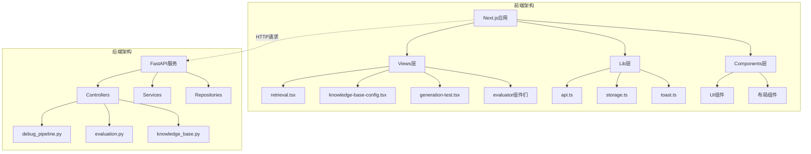

**图表来源**
- [api.ts](file://web/lib/api.ts#L1-L50)
- [retrieval.tsx](file://web/components/views/retrieval.tsx#L1-L30)

## 核心视图组件

### 检索测试组件 (retrieval.tsx)

检索测试组件提供了混合检索和Qdrant原生混合检索的核心功能。

#### 主要特性

- **多检索方式**：支持传统混合检索和Qdrant原生混合检索
- **灵活配置**：可配置向量权重、关键词权重、RRF参数等
- **稀疏向量支持**：支持BM25、TF-IDF等多种稀疏向量生成方法
- **结果管理**：保存、加载、导出检索结果

#### 核心状态管理

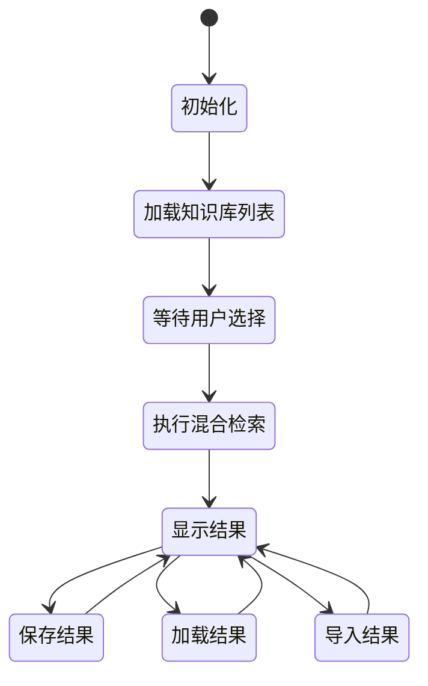

**图表来源**
- [retrieval.tsx](file://web/components/views/retrieval.tsx#L12-L50)

#### API调用流程

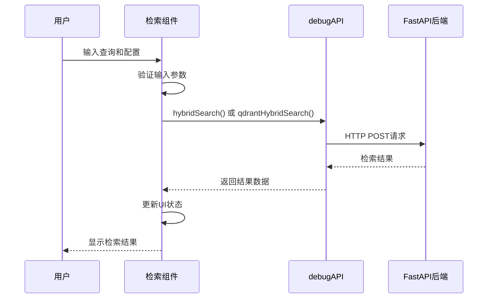

**图表来源**
- [retrieval.tsx](file://web/components/views/retrieval.tsx#L61-L124)
- [api.ts](file://web/lib/api.ts#L1-L50)

**章节来源**
- [retrieval.tsx](file://web/components/views/retrieval.tsx#L1-L532)

### 知识库配置组件 (knowledge-base-config.tsx)

知识库配置组件负责知识库的Schema定义和向量数据库配置。

#### 核心功能

- **Schema管理**：定义知识库的数据结构
- **向量数据库配置**：支持Qdrant、Elasticsearch、Milvus等
- **字段类型支持**：文本、关键词、整数、浮点数、布尔值、稠密向量、稀疏向量
- **高级配置**：HNSW索引、量化配置、距离度量

#### Schema字段类型

| 字段类型 | 描述 | 适用场景 |
|---------|------|----------|
| text | 文本字段 | 存储原始文档内容 |
| keyword | 关键词字段 | 用于全文搜索和过滤 |
| integer | 整数字段 | 存储数值型元数据 |
| float | 浮点数字段 | 存储精度要求高的数值 |
| boolean | 布尔字段 | 存储真假值 |
| dense_vector | 稠密向量 | 存储嵌入向量 |
| sparse_vector | 稀疏向量 | 存储稀疏表示 |

**章节来源**
- [knowledge-base-config.tsx](file://web/components/views/knowledge-base-config.tsx#L1-L800)

### 生成测试组件 (generation-test.tsx)

生成测试组件基于检索结果进行RAG生成测试。

#### 功能特点

- **上下文管理**：从检索结果加载上下文
- **LLM配置**：支持多种大语言模型提供商
- **流式输出**：实时显示生成过程
- **结果保存**：保存生成结果供后续分析

#### 生成流程

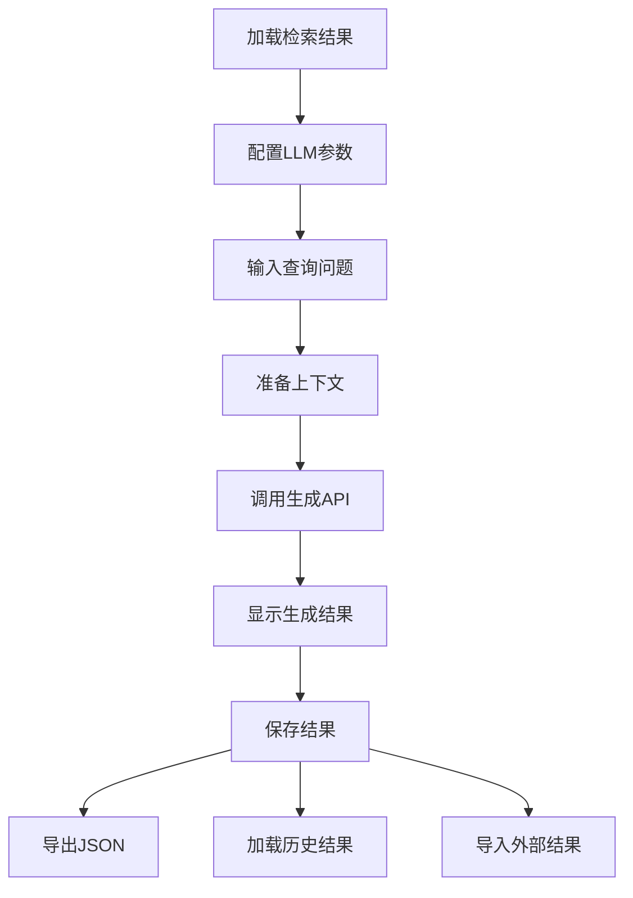

**图表来源**
- [generation-test.tsx](file://web/components/views/generation-test.tsx#L105-L137)

**章节来源**
- [generation-test.tsx](file://web/components/views/generation-test.tsx#L1-L554)

### 评估系统组件

#### 检索器评估 (retriever-evaluation.tsx)

基于T2Ranking数据集的检索器性能评估系统。

#### 生成器评估 (generator-evaluation.tsx)

基于RAGAS框架的生成质量评估系统。

#### 评估历史 (evaluation-history.tsx)

评估任务和结果的统一管理界面。

**章节来源**
- [retriever-evaluation.tsx](file://web/components/views/retriever-evaluation.tsx#L1-L645)
- [generator-evaluation.tsx](file://web/components/views/generator-evaluation.tsx#L1-L403)
- [evaluation-history.tsx](file://web/components/views/evaluation-history.tsx#L1-L464)

## API通信机制

### 统一API客户端 (api.ts)

RAG-Studio采用统一的API客户端设计，集中管理所有后端通信。

#### 核心功能

- **请求封装**：统一的HTTP请求处理
- **错误处理**：全局错误捕获和处理
- **类型安全**：完整的TypeScript类型定义
- **环境配置**：支持开发和生产环境

#### API接口分类

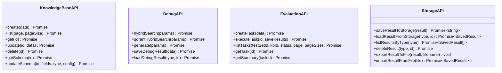

**图表来源**
- [api.ts](file://web/lib/api.ts#L108-L221)
- [api.ts](file://web/lib/api.ts#L565-L670)
- [api.ts](file://web/lib/api.ts#L724-L800)

#### 请求处理流程

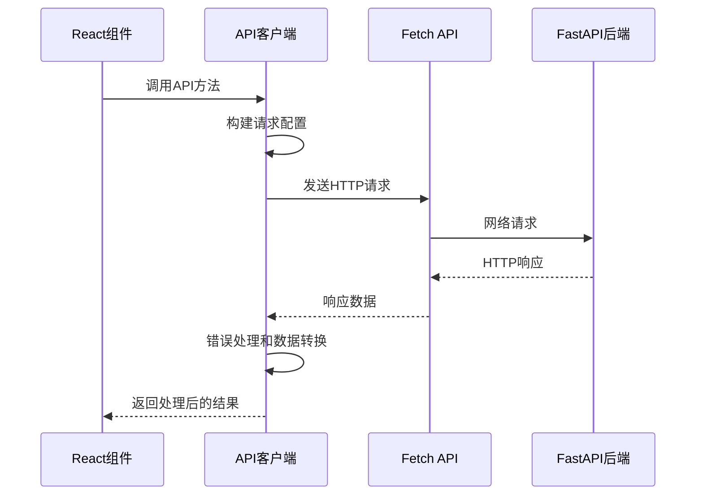

**图表来源**
- [api.ts](file://web/lib/api.ts#L22-L57)

**章节来源**
- [api.ts](file://web/lib/api.ts#L1-L800)

### 数据持久化 (storage.ts)

数据持久化层提供了本地存储和后端存储的统一接口。

#### 核心功能

- **本地存储**：使用浏览器本地存储
- **后端存储**：通过API保存到服务器
- **文件导入导出**：支持JSON格式的数据交换
- **类型安全**：完整的类型定义

**章节来源**
- [storage.ts](file://web/lib/storage.ts#L1-L119)

### 消息通知 (toast.ts)

统一的消息通知系统，提供友好的用户反馈。

#### 支持的消息类型

- **成功消息**：操作成功完成
- **错误消息**：操作失败或异常
- **警告消息**：需要注意的操作
- **信息消息**：一般性信息提示

**章节来源**
- [toast.ts](file://web/lib/toast.ts#L1-L68)

## 状态管理与数据流

### 组件状态架构

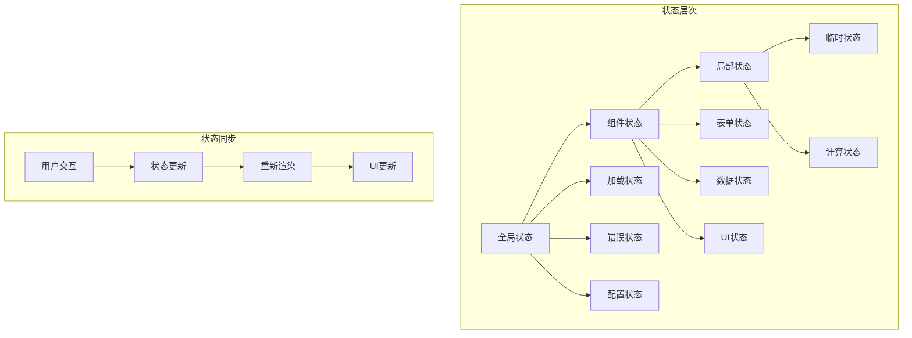

### 异步请求处理

#### 错误边界设计

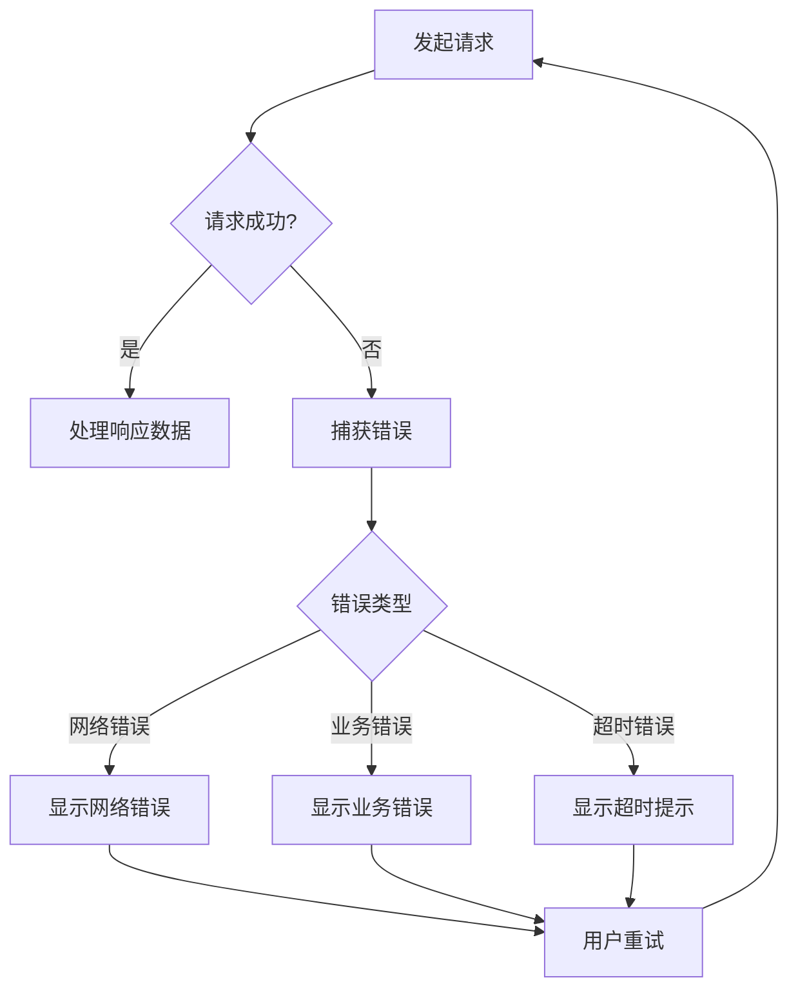

#### 请求节流策略

- **防抖处理**：防止频繁的API调用
- **并发控制**：限制同时进行的请求数量
- **缓存机制**：缓存常用数据减少重复请求

**章节来源**
- [retrieval.tsx](file://web/components/views/retrieval.tsx#L61-L124)
- [generation-test.tsx](file://web/components/views/generation-test.tsx#L105-L137)

### 表单验证逻辑

#### 验证规则

| 字段类型 | 验证规则 | 错误提示 |
|---------|----------|----------|
| 必填字段 | 非空检查 | "请输入必填内容" |
| 数值字段 | 范围检查 | "超出有效范围" |
| 文件上传 | 格式检查 | "文件格式不正确" |
| 配置参数 | 类型检查 | "配置参数格式错误" |

#### 实时验证

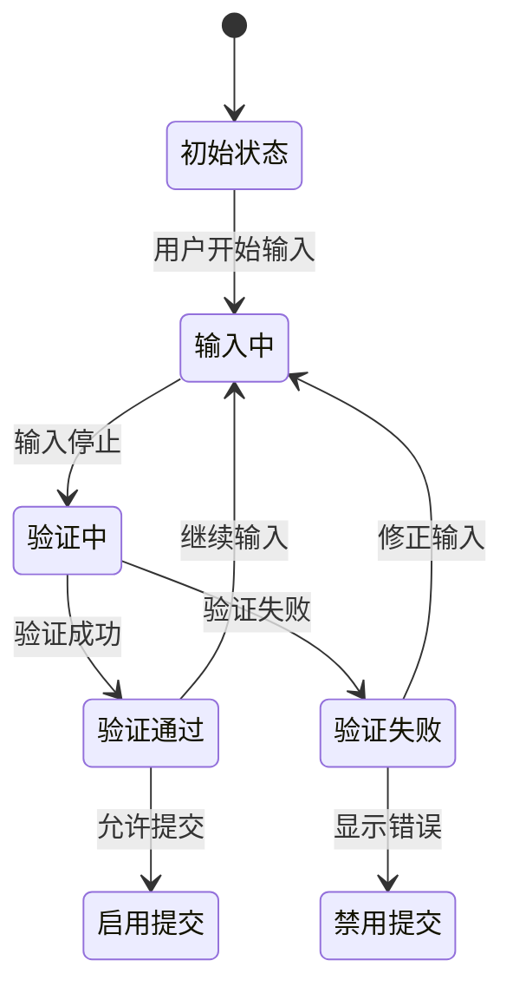

**章节来源**
- [retrieval.tsx](file://web/components/views/retrieval.tsx#L61-L70)
- [generation-test.tsx](file://web/components/views/generation-test.tsx#L107-L110)

## 组件间协作

### 导航系统

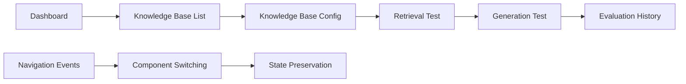

### 数据共享机制

#### 全局事件系统

组件间通过自定义事件进行通信：

```typescript
// 导航事件示例
window.dispatchEvent(new CustomEvent('navigate', {
  detail: { 
    view: "knowledge-base-config", 
    path: ["RAG Studio", "知识库配置"] 
  } 
}))
```

#### 状态同步

- **URL同步**：通过路由参数同步状态
- **本地存储**：持久化重要状态
- **全局状态管理**：共享跨组件的状态

**章节来源**
- [knowledge-base-list.tsx](file://web/components/views/knowledge-base-list.tsx#L46-L56)

### 组件生命周期

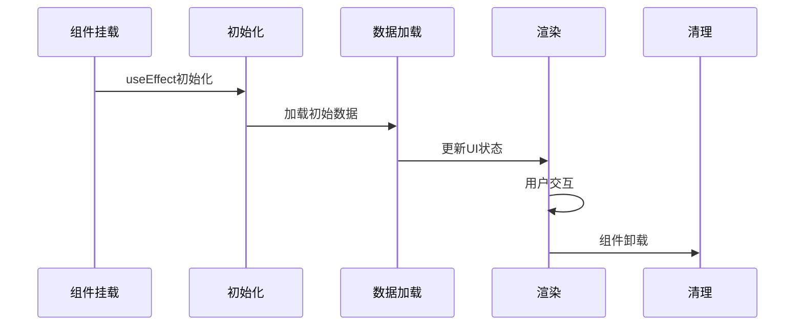

**图表来源**
- [retrieval.tsx](file://web/components/views/retrieval.tsx#L34-L39)
- [evaluation-history.tsx](file://web/components/views/evaluation-history.tsx#L43-L48)

## 性能优化策略

### 懒加载机制

#### 组件懒加载

```typescript
// 示例：按需加载大型组件
const LazyComponent = dynamic(() => import('./LargeComponent'), {
  loading: () => <LoadingSpinner />,
  ssr: false
})
```

#### 数据懒加载

- **分页加载**：大数据集分页显示
- **虚拟滚动**：大量列表项的虚拟化处理
- **按需请求**：只在需要时加载数据

### 虚拟滚动实现

对于大量检索结果的展示，采用虚拟滚动技术：

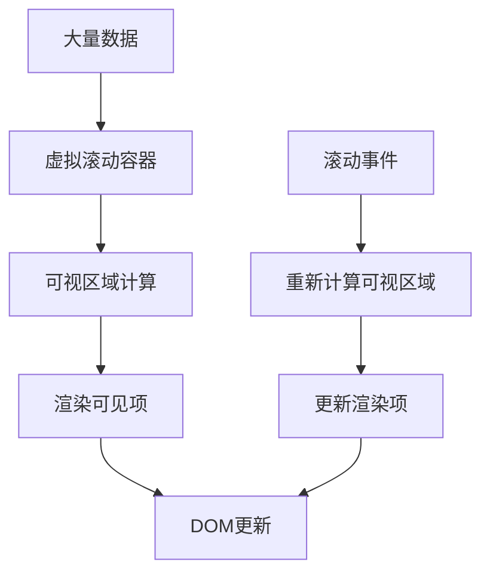

### 请求优化

#### 缓存策略

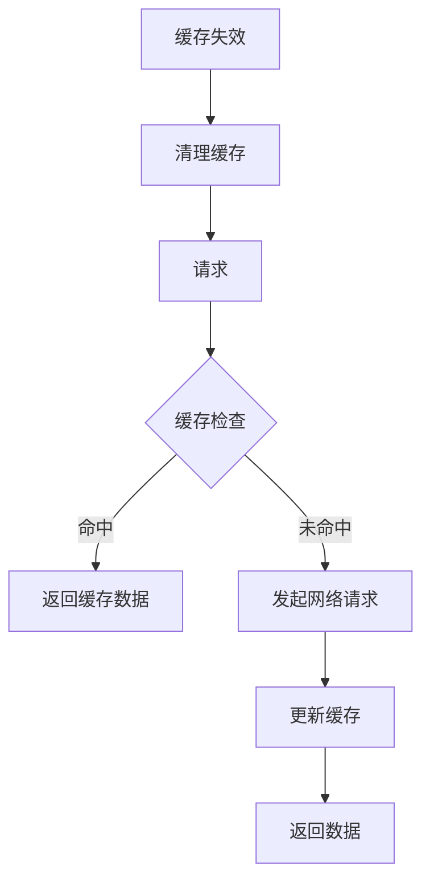

#### 并发优化

- **请求合并**：合并相似的请求
- **优先级队列**：重要请求优先处理
- **预加载**：预测性数据加载

### 内存管理

#### 组件卸载清理

```typescript
useEffect(() => {
  return () => {
    // 清理定时器
    if (timer) clearTimeout(timer)
    // 清理事件监听
    // 清理订阅
  }
}, [])
```

#### 大数据处理

- **流式处理**：处理大数据时不阻塞UI
- **分块加载**：将大数据分成小块处理
- **垃圾回收**：及时释放不需要的内存

**章节来源**
- [retrieval.tsx](file://web/components/views/retrieval.tsx#L40-L59)
- [evaluation-history.tsx](file://web/components/views/evaluation-history.tsx#L43-L48)

## 扩展开发指南

### 添加新视图组件

#### 开发步骤

1. **创建组件文件**
```typescript
// 新组件：custom-view.tsx
import { useState } from 'react'

export default function CustomView() {
  const [loading, setLoading] = useState(false)
  
  return (
    <div className="space-y-6">
      {/* 组件内容 */}
    </div>
  )
}
```

2. **注册到导航系统**
```typescript
// 在导航配置中添加新路由
const navigationRoutes = [
  { path: '/custom-view', component: CustomView },
  // 其他路由...
]
```

3. **集成API调用**
```typescript
// 使用现有的API客户端
const result = await customAPI.performAction(data)
```

#### 最佳实践

- **遵循命名规范**：使用语义化的组件名称
- **类型安全**：提供完整的TypeScript类型定义
- **错误处理**：完善的错误边界和用户提示
- **性能考虑**：合理使用懒加载和优化策略

### 扩展现有功能

#### 检索配置扩展

```typescript
// 扩展检索配置选项
const extendedSearchConfig = {
  ...baseConfig,
  new_feature: true,
  threshold: 0.8,
  timeout: 30000
}
```

#### 评估指标扩展

```typescript
// 添加新的评估指标
const additionalMetrics = {
  custom_metric: calculateCustomMetric(results),
  quality_score: calculateQualityScore(results)
}
```

### 插件化架构

#### 组件插件系统

```typescript
interface Plugin {
  name: string
  component: React.ComponentType
  config: PluginConfig
}

const plugins: Plugin[] = [
  {
    name: 'advanced-retrieval',
    component: AdvancedRetrievalPlugin,
    config: { enabled: true }
  }
]
```

**章节来源**
- [retrieval.tsx](file://web/components/views/retrieval.tsx#L1-L50)
- [knowledge-base-config.tsx](file://web/components/views/knowledge-base-config.tsx#L1-L50)

## 故障排除

### 常见问题及解决方案

#### API连接问题

**问题症状**：
- 请求超时
- 网络错误
- CORS跨域问题

**解决方案**：
1. 检查后端服务是否启动
2. 验证API端点URL配置
3. 检查网络连接状态
4. 查看浏览器开发者工具中的网络面板

#### 状态同步问题

**问题症状**：
- 数据不一致
- 状态更新延迟
- UI不刷新

**解决方案**：
1. 检查状态更新逻辑
2. 验证依赖数组的正确性
3. 使用React DevTools调试状态
4. 确保正确的事件处理顺序

#### 性能问题

**问题症状**：
- 页面卡顿
- 内存泄漏
- 响应缓慢

**解决方案**：
1. 使用性能分析工具识别瓶颈
2. 实施适当的优化策略
3. 减少不必要的重新渲染
4. 优化数据结构和算法

### 调试技巧

#### 开发者工具使用

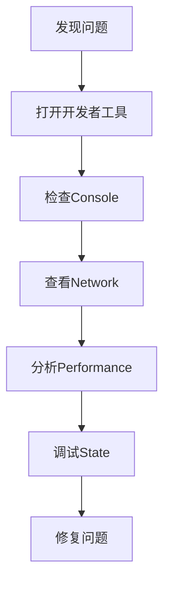

#### 日志记录

```typescript
// 添加详细的日志记录
console.log('[DEBUG] Component state:', state)
console.log('[API] Request payload:', payload)
console.log('[PERF] Render time:', performance.now())
```

**章节来源**
- [api.ts](file://web/lib/api.ts#L44-L57)
- [toast.ts](file://web/lib/toast.ts#L37-L66)

## 最佳实践

### 代码组织

#### 文件结构

```
web/components/views/
├── retrieval.tsx          # 检索测试
├── knowledge-base-config.tsx  # 知识库配置
├── generation-test.tsx    # 生成测试
├── evaluator/
│   ├── retriever-evaluation.tsx
│   ├── generator-evaluation.tsx
│   └── evaluation-history.tsx
└── shared/
    ├── form-components.tsx
    └── data-table.tsx
```

#### 命名约定

- **组件名称**：使用PascalCase
- **变量名称**：使用camelCase
- **常量名称**：使用UPPER_SNAKE_CASE
- **文件名称**：与主要导出组件同名

### 安全考虑

#### 输入验证

```typescript
// 输入验证示例
const validateInput = (value: string): ValidationResult => {
  if (!value.trim()) {
    return { isValid: false, error: '输入不能为空' }
  }
  
  if (value.length > 1000) {
    return { isValid: false, error: '输入长度超过限制' }
  }
  
  return { isValid: true }
}
```

#### 权限控制

- **角色基础访问控制**：基于用户角色的权限管理
- **资源级权限**：细粒度的资源访问控制
- **审计日志**：记录关键操作的审计信息

### 测试策略

#### 单元测试

```typescript
// 组件测试示例
describe('RetrievalView', () => {
  it('should render loading state', () => {
    const { getByText } = render(<RetrievalView />)
    expect(getByText('加载中...')).toBeInTheDocument()
  })
  
  it('should handle search correctly', async () => {
    // 测试搜索功能
  })
})
```

#### 集成测试

- **API集成测试**：测试前后端通信
- **端到端测试**：模拟真实用户操作
- **性能测试**：验证系统性能指标

### 文档维护

#### 代码注释

```typescript
/**
 * 执行混合检索
 * @param params 检索参数配置
 * @returns 检索结果
 * @throws Error 检索失败时抛出异常
 */
const handleSearch = async (params: SearchParams): Promise<SearchResult> => {
  // 实现细节
}
```

#### 更新日志

- **版本记录**：记录每次功能变更
- **兼容性说明**：说明破坏性变更
- **迁移指南**：提供升级指导

**章节来源**
- [retrieval.tsx](file://web/components/views/retrieval.tsx#L1-L30)
- [api.ts](file://web/lib/api.ts#L1-L50)

## 结论

RAG-Studio的业务视图组件展现了现代Web应用的最佳实践，通过模块化设计、类型安全、性能优化和良好的用户体验，构建了一个功能完善的知识库管理系统。本文档详细解析了各个组件的架构设计和实现逻辑，为开发者提供了深入理解和扩展系统的指导。

通过遵循本文档中的最佳实践和扩展指南，开发者可以有效地维护和扩展RAG-Studio的功能，满足不断变化的业务需求。