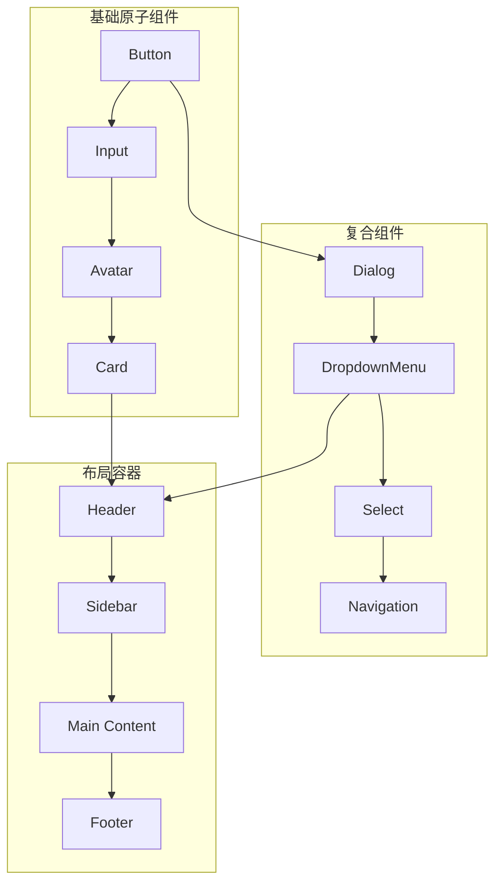
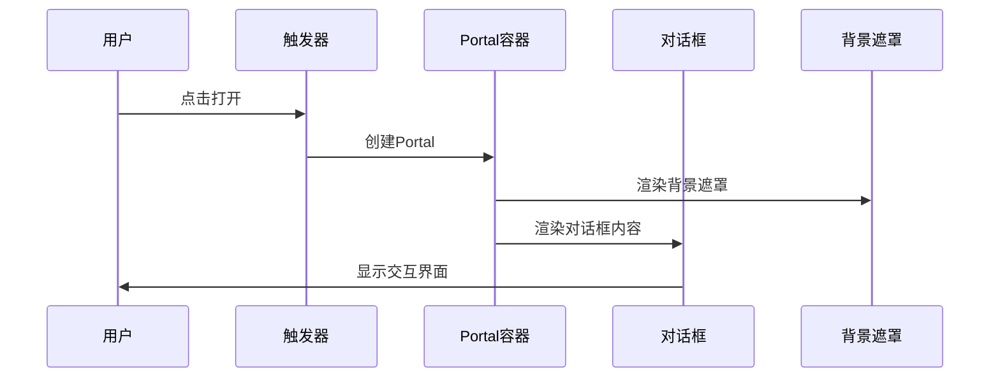
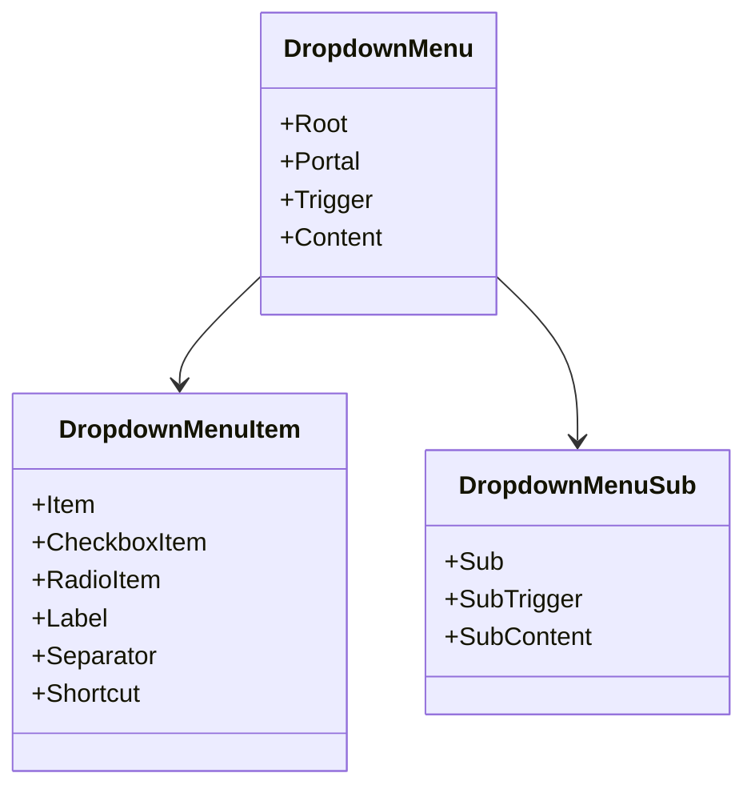
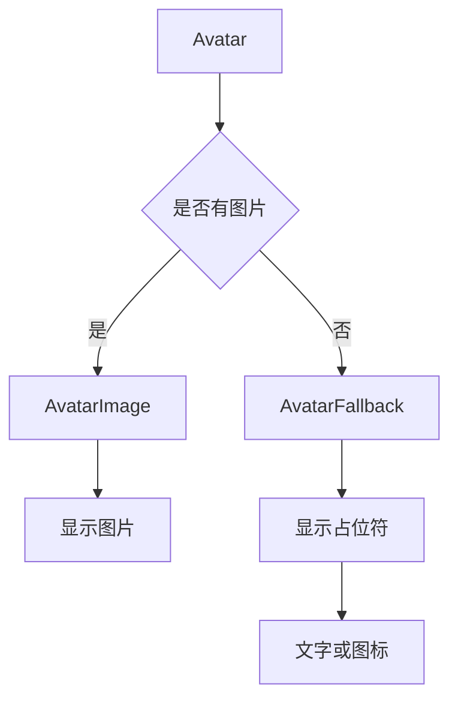
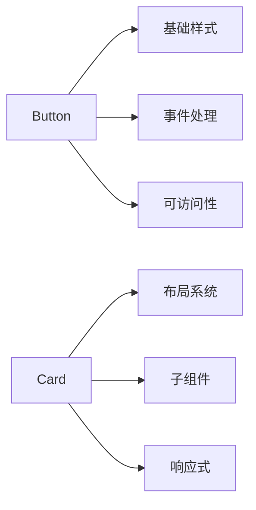

# RAG-Studio基础UI组件详细文档

<cite>
**本文档引用的文件**
- [button.tsx](file://web/components/ui/button.tsx)
- [input.tsx](file://web/components/ui/input.tsx)
- [card.tsx](file://web/components/ui/card.tsx)
- [dialog.tsx](file://web/components/ui/dialog.tsx)
- [dropdown-menu.tsx](file://web/components/ui/dropdown-menu.tsx)
- [select.tsx](file://web/components/ui/select.tsx)
- [avatar.tsx](file://web/components/ui/avatar.tsx)
- [utils.ts](file://web/lib/utils.ts)
- [globals.css](file://web/app/globals.css)
- [header.tsx](file://web/components/header.tsx)
- [sidebar.tsx](file://web/components/sidebar.tsx)
</cite>

## 目录
1. [项目概述](#项目概述)
2. [组件架构设计](#组件架构设计)
3. [核心组件详解](#核心组件详解)
4. [样式系统与主题](#样式系统与主题)
5. [可访问性支持](#可访问性支持)
6. [Composition模式应用](#composition模式应用)
7. [Next.js服务端渲染兼容性](#nextjs服务端渲染兼容性)
8. [使用示例与最佳实践](#使用示例与最佳实践)
9. [常见问题排查](#常见问题排查)
10. [性能优化建议](#性能优化建议)

## 项目概述

RAG-Studio采用现代化的前端架构，基于React构建了一套完整的UI组件库。该组件库遵循原子化设计原则，提供了从基础按钮到复杂布局容器的完整组件体系，支持Tailwind CSS框架和暗色主题切换。

### 技术栈特点

- **React 18+**: 利用最新React特性，包括并发渲染和Server Components
- **Tailwind CSS**: 实现高度可定制的响应式设计系统
- **Radix UI**: 提供无障碍且高性能的底层组件
- **Lucide React**: 现代化的图标库
- **TypeScript**: 提供完整的类型安全支持

## 组件架构设计

### 设计哲学

RAG-Studio的UI组件库采用以下设计原则：

1. **原子化设计**: 将界面元素分解为最小可复用单元
2. **Composition优先**: 通过组合而非继承构建复杂组件
3. **可访问性第一**: 内置ARIA标签和键盘导航支持
4. **主题一致性**: 统一的颜色系统和间距规范
5. **响应式优先**: 移动端优先的设计理念

### 组件层次结构



**图表来源**
- [button.tsx](file://web/components/ui/button.tsx#L1-L61)
- [input.tsx](file://web/components/ui/input.tsx#L1-L27)
- [card.tsx](file://web/components/ui/card.tsx#L1-L93)
- [dialog.tsx](file://web/components/ui/dialog.tsx#L1-L122)

## 核心组件详解

### Button组件 - 可复用的交互入口

Button组件是RAG-Studio中最基础也是最重要的交互组件，支持多种变体和尺寸。

#### 核心特性

- **变体系统**: default、destructive、outline、secondary、ghost、link
- **尺寸规格**: default、sm、lg、icon、icon-sm、icon-lg
- **Slot模式**: 支持asChild属性实现语义化渲染
- **可访问性**: 完整的ARIA支持和键盘导航

#### 属性接口

| 属性名 | 类型 | 默认值 | 描述 |
|--------|------|--------|------|
| variant | "default" \| "destructive" \| "outline" \| "secondary" \| "ghost" \| "link" | "default" | 按钮外观变体 |
| size | "default" \| "sm" \| "lg" \| "icon" \| "icon-sm" \| "icon-lg" | "default" | 按钮尺寸规格 |
| asChild | boolean | false | 是否使用子元素作为渲染节点 |
| className | string | - | 自定义CSS类名 |
| disabled | boolean | false | 是否禁用按钮 |

#### 样式定制方法

Button组件使用class-variance-authority库实现变体系统：

```typescript
// 核心样式变体定义
const buttonVariants = cva(
  "inline-flex items-center justify-center gap-2 whitespace-nowrap rounded-md text-sm font-medium transition-all disabled:pointer-events-none disabled:opacity-50",
  {
    variants: {
      variant: {
        default: "bg-primary text-primary-foreground hover:bg-primary/90",
        destructive: "bg-destructive text-white hover:bg-destructive/90",
        outline: "border bg-background shadow-xs hover:bg-accent",
        secondary: "bg-secondary text-secondary-foreground hover:bg-secondary/80",
        ghost: "hover:bg-accent hover:text-accent-foreground",
        link: "text-primary underline-offset-4 hover:underline",
      },
      size: {
        default: "h-9 px-4 py-2 has-[>svg]:px-3",
        sm: "h-8 rounded-md gap-1.5 px-3 has-[>svg]:px-2.5",
        lg: "h-10 rounded-md px-6 has-[>svg]:px-4",
        icon: "size-9",
        "icon-sm": "size-8",
        "icon-lg": "size-10",
      },
    },
    defaultVariants: {
      variant: "default",
      size: "default",
    },
  }
)
```

#### 响应式行为

Button组件在不同屏幕尺寸下表现出一致的行为：

- **移动端**: 所有尺寸保持可点击区域至少44px
- **桌面端**: 图标按钮在不同尺寸下保持视觉平衡
- **高对比度模式**: 自动调整边框颜色以提高可识别性

**章节来源**
- [button.tsx](file://web/components/ui/button.tsx#L1-L61)

### Input组件 - 数据输入的基础控件

Input组件提供了统一的数据输入体验，内置了完整的焦点状态管理和错误处理。

#### 核心特性

- **状态管理**: 自动处理聚焦、禁用、错误等状态
- **类型安全**: 完整的React.InputHTMLAttributes支持
- **样式一致性**: 与整体设计系统保持一致的外观
- **可访问性**: 内置ARIA标签和焦点管理

#### 属性接口

Input组件继承了标准HTML input元素的所有属性：

| 属性名 | 类型 | 描述 |
|--------|------|------|
| type | string | 输入类型（text、password、email等） |
| value | string \| number | 输入值 |
| onChange | (event: ChangeEvent<HTMLInputElement>) => void | 值变化回调 |
| placeholder | string | 占位符文本 |
| disabled | boolean | 是否禁用 |
| required | boolean | 是否必填 |

#### 样式系统

Input组件使用Tailwind CSS实现响应式样式：

```css
"flex h-9 w-full rounded-md border border-input bg-transparent px-3 py-1 text-sm shadow-sm transition-colors file:border-0 file:bg-transparent file:text-sm file:font-medium file:text-foreground placeholder:text-muted-foreground focus-visible:outline-none focus-visible:ring-1 focus-visible:ring-ring disabled:cursor-not-allowed disabled:opacity-50"
```

#### 错误状态处理

组件自动处理以下状态：
- **正常状态**: 边框颜色为`border-input`
- **聚焦状态**: 显示`focus-visible:ring-ring`环形边框
- **错误状态**: 通过`aria-invalid`属性触发红色边框
- **禁用状态**: 灰色背景和不可点击光标

**章节来源**
- [input.tsx](file://web/components/ui/input.tsx#L1-L27)

### Card组件 - 内容容器的标准化

Card组件是一套完整的卡片系统，包含多个子组件，支持复杂的布局需求。

#### 组件家族

Card系统包含以下子组件：

| 组件名 | 用途 | 主要属性 |
|--------|------|----------|
| Card | 卡片根容器 | className |
| CardHeader | 卡片头部 | className |
| CardTitle | 标题文本 | className |
| CardDescription | 描述文本 | className |
| CardAction | 操作区域 | className |
| CardContent | 主内容区 | className |
| CardFooter | 底部区域 | className |

#### 布局系统

Card组件采用@container查询系统实现智能布局：

```css
"@container/card-header grid auto-rows-min grid-rows-[auto_auto] items-start gap-2 px-6 has-data-[slot=card-action]:grid-cols-[1fr_auto]"
```

这种设计允许：
- **自适应布局**: 根据内容自动调整网格布局
- **响应式间距**: 不同屏幕尺寸下保持合适的间距
- **条件渲染**: 当存在操作按钮时自动调整列宽

#### 使用场景

Card组件适用于：
- **数据展示**: 如仪表板卡片、统计信息卡片
- **表单容器**: 包装复杂的表单字段
- **内容组织**: 分组相关的内容块
- **模态对话**: 作为Dialog的主要内容容器

**章节来源**
- [card.tsx](file://web/components/ui/card.tsx#L1-L93)

### Dialog组件 - 弹窗交互的核心

Dialog组件基于Radix UI构建，提供了完整的模态对话功能。

#### 架构设计

Dialog组件采用Portal模式渲染，确保模态层正确覆盖整个视口：



**图表来源**
- [dialog.tsx](file://web/components/ui/dialog.tsx#L30-L51)

#### 动画系统

Dialog组件内置了丰富的动画效果：

| 状态 | 动画效果 | 持续时间 |
|------|----------|----------|
| 打开 | zoom-in-95 + slide-in-from-top | 200ms |
| 关闭 | zoom-out-95 + slide-out-to-top | 200ms |
| 背景遮罩 | fade-in/fade-out | 200ms |

#### 可访问性特性

- **焦点管理**: 自动将焦点移至对话框内第一个可交互元素
- **键盘导航**: ESC键关闭对话框，Tab键在内部循环
- **ARIA标签**: 自动添加`aria-labelledby`和`aria-describedby`
- **屏幕阅读器**: 正确的语义化标记

**章节来源**
- [dialog.tsx](file://web/components/ui/dialog.tsx#L1-L122)

### DropdownMenu组件 - 下拉菜单的完整解决方案

DropdownMenu组件是最复杂的交互组件之一，提供了完整的菜单系统。

#### 组件层次



**图表来源**
- [dropdown-menu.tsx](file://web/components/ui/dropdown-menu.tsx#L1-L258)

#### 功能特性

- **多级菜单**: 支持无限层级的子菜单
- **选择模式**: 单选、多选、开关等多种选择模式
- **快捷键**: 支持键盘导航和快捷键操作
- **位置自适应**: 自动计算最佳显示位置

#### 使用示例

基本菜单使用：

```typescript
<DropdownMenu>
  <DropdownMenuTrigger>更多选项</DropdownMenuTrigger>
  <DropdownMenuContent>
    <DropdownMenuItem>编辑</DropdownMenuItem>
    <DropdownMenuItem>删除</DropdownMenuItem>
    <DropdownMenuSeparator />
    <DropdownMenuItem>复制链接</DropdownMenuItem>
  </DropdownMenuContent>
</DropdownMenu>
```

**章节来源**
- [dropdown-menu.tsx](file://web/components/ui/dropdown-menu.tsx#L1-L258)

### Select组件 - 选择器的现代化实现

Select组件提供了比原生select更灵活的选择体验。

#### 核心优势

- **自定义渲染**: 支持完全自定义的选项渲染
- **虚拟滚动**: 大量选项时的性能优化
- **搜索功能**: 内置的搜索和过滤能力
- **多选支持**: 可配置的多选模式

#### 组件结构

| 组件名 | 用途 | 特点 |
|--------|------|------|
| Select | 根容器 | 状态管理 |
| SelectTrigger | 触发器 | 显示当前值 |
| SelectContent | 内容面板 | 选项列表 |
| SelectItem | 选项项 | 单个选项 |
| SelectLabel | 分组标签 | 选项分组 |

**章节来源**
- [select.tsx](file://web/components/ui/select.tsx#L1-L159)

### Avatar组件 - 用户头像的优雅解决方案

Avatar组件专注于用户头像的显示和管理。

#### 组件设计



**图表来源**
- [avatar.tsx](file://web/components/ui/avatar.tsx#L1-L54)

#### 使用场景

- **用户资料**: 显示用户头像
- **团队协作**: 团队成员头像展示
- **评论系统**: 评论者头像
- **通知中心**: 发送者头像

**章节来源**
- [avatar.tsx](file://web/components/ui/avatar.tsx#L1-L54)

## 样式系统与主题

### Tailwind CSS集成

RAG-Studio深度集成了Tailwind CSS，提供了完整的实用类系统：

#### 核心设计理念

- **原子化**: 每个样式类代表单一CSS属性
- **响应式**: 移动优先的响应式设计
- **可组合**: 样式类可以自由组合
- **可定制**: 完全可配置的主题系统

#### 主题变量系统

项目使用CSS自定义属性实现主题切换：

```css
:root {
  --background: oklch(1 0 0);
  --foreground: oklch(0.145 0 0);
  --primary: oklch(0.205 0 0);
  --secondary: oklch(0.97 0 0);
  --card: oklch(1 0 0);
  --popover: oklch(1 0 0);
}

.dark {
  --background: oklch(0.145 0 0);
  --foreground: oklch(0.985 0 0);
  --primary: oklch(0.922 0 0);
  --secondary: oklch(0.269 0 0);
  --card: oklch(0.205 0 0);
  --popover: oklch(0.205 0 0);
}
```

### 工具函数系统

项目使用`clsx`和`tailwind-merge`组合实现智能的类名合并：

```typescript
export function cn(...inputs: ClassValue[]) {
  return twMerge(clsx(inputs))
}
```

这种组合的优势：
- **避免重复类名**: 自动合并冲突的Tailwind类
- **条件类名**: 支持基于条件的类名添加
- **类型安全**: 完整的TypeScript类型支持

**章节来源**
- [utils.ts](file://web/lib/utils.ts#L1-L7)
- [globals.css](file://web/app/globals.css#L1-L123)

## 可访问性支持

### ARIA标准遵循

所有组件都严格遵循Web Content Accessibility Guidelines (WCAG) 2.1 AA标准：

#### 基础可访问性特性

- **语义化标记**: 使用正确的HTML元素和ARIA角色
- **焦点管理**: 合理的焦点顺序和焦点陷阱
- **键盘导航**: 完整的键盘操作支持
- **屏幕阅读器**: 适当的ARIA标签和描述

#### 具体实现

**Button组件的可访问性**：
```typescript
// 内置的可访问性属性
<button
  aria-label="提交表单"
  aria-describedby="error-message"
  role="button"
  tabIndex={0}
/>
```

**Dialog组件的可访问性**：
- 自动设置`aria-modal="true"`
- 焦点陷阱确保键盘导航限制在对话框内
- 关闭时返回原焦点位置

**DropdownMenu组件的可访问性**：
- 支持键盘导航（上下箭头、Enter、Escape）
- 自动计算最佳显示位置
- 支持触屏设备的触摸操作

### 键盘导航支持

所有交互组件都支持完整的键盘导航：

| 组合键 | 功能 | 支持组件 |
|--------|------|----------|
| Tab | 焦点移动 | 所有交互组件 |
| Enter | 激活 | Button, MenuItem |
| Space | 激活 | Button, Checkbox |
| Escape | 关闭/取消 | Dialog, DropdownMenu |
| Arrow Keys | 导航 | DropdownMenu, Select |

## Composition模式应用

### 设计原理

RAG-Studio大量使用React的Composition模式来构建组件，这种方式带来了以下优势：

#### 1. 灵活性

通过组合不同的基础组件，可以创建复杂的用户界面：

```typescript
// 复杂的用户信息卡片
<Card>
  <CardHeader>
    <CardTitle>用户信息</CardTitle>
    <CardDescription>个人信息概览</CardDescription>
  </CardHeader>
  <CardContent>
    <div className="flex items-center space-x-4">
      <Avatar>
        <AvatarImage src="/user.jpg" />
        <AvatarFallback>用户</AvatarFallback>
      </Avatar>
      <div>
        <p className="text-sm font-medium">张三</p>
        <p className="text-sm text-muted-foreground">zhangsan@example.com</p>
      </div>
    </div>
  </CardContent>
</Card>
```

#### 2. 可复用性

基础组件可以在不同场景中重复使用：

```typescript
// 在侧边栏中复用Avatar组件
<Sidebar>
  <SidebarUser>
    <Avatar className="w-8 h-8">
      <AvatarFallback>用户</AvatarFallback>
    </Avatar>
    <span>用户名</span>
  </SidebarUser>
</Sidebar>
```

#### 3. 可维护性

每个组件职责单一，便于单独测试和维护：



### 实际应用场景

#### 1. 表单构建

利用Composition模式快速构建复杂表单：

```typescript
// 复杂表单示例
<form className="space-y-6">
  <Card>
    <CardHeader>
      <CardTitle>用户信息</CardTitle>
    </CardHeader>
    <CardContent className="space-y-4">
      <Input label="姓名" placeholder="请输入姓名" />
      <Input label="邮箱" type="email" placeholder="请输入邮箱" />
      <Select label="性别">
        <SelectItem value="male">男</SelectItem>
        <SelectItem value="female">女</SelectItem>
      </Select>
    </CardContent>
  </Card>
  
  <Card>
    <CardHeader>
      <CardTitle>联系方式</CardTitle>
    </CardHeader>
    <CardContent className="space-y-4">
      <Input label="手机号" type="tel" placeholder="请输入手机号" />
      <Input label="地址" placeholder="请输入详细地址" />
    </CardContent>
  </Card>
  
  <div className="flex justify-end space-x-4">
    <Button variant="outline">取消</Button>
    <Button type="submit">保存</Button>
  </div>
</form>
```

#### 2. 数据展示

组合卡片和表格组件展示复杂数据：

```typescript
// 数据仪表板
<div className="grid grid-cols-1 md:grid-cols-2 lg:grid-cols-3 gap-6">
  {metrics.map(metric => (
    <Card key={metric.id}>
      <CardHeader>
        <CardTitle>{metric.title}</CardTitle>
        <CardDescription>{metric.description}</CardDescription>
      </CardHeader>
      <CardContent>
        <div className="flex items-baseline space-x-2">
          <span className="text-2xl font-bold">{metric.value}</span>
          <span className="text-sm text-muted-foreground">{metric.unit}</span>
        </div>
        <div className="mt-4 h-20">
          {/* 图表组件 */}
        </div>
      </CardContent>
    </Card>
  ))}
</div>
```

## Next.js服务端渲染兼容性

### SSR支持策略

RAG-Studio的组件库完全兼容Next.js的服务器端渲染（SSR）和静态生成（SSG）：

#### 1. 客户端组件标记

对于需要客户端交互的组件，使用`"use client"`指令：

```typescript
"use client"

import * as React from "react"
import * as DropdownMenuPrimitive from "@radix-ui/react-dropdown-menu"

// 这些组件需要在客户端运行
function DropdownMenu(props: React.ComponentProps<typeof DropdownMenuPrimitive.Root>) {
  return <DropdownMenuPrimitive.Root data-slot="dropdown-menu" {...props} />
}
```

#### 2. 无状态组件设计

大部分基础组件设计为纯函数组件，天然支持SSR：

```typescript
// 纯函数组件，完全支持SSR
function Button({
  className,
  variant,
  size,
  asChild = false,
  ...props
}: React.ComponentProps<"button"> & 
  VariantProps<typeof buttonVariants> & {
    asChild?: boolean
  }) {
  const Comp = asChild ? Slot : "button"
  
  return (
    <Comp
      data-slot="button"
      className={cn(buttonVariants({ variant, size, className }))}
      {...props}
    />
  )
}
```

#### 3. 条件渲染优化

组件内部实现了智能的条件渲染：

```typescript
// 仅在客户端渲染的逻辑
if (typeof window !== "undefined") {
  // 客户端特定代码
}
```

### 性能优化

#### 1. 代码分割

组件按需加载，减少初始包体积：

```typescript
// 按需导入
import { Button } from "@/components/ui/button"
import { Card } from "@/components/ui/card"
```

#### 2. 缓存策略

利用Next.js的缓存机制优化组件渲染：

- **Static Generation**: 静态生成的页面
- **Incremental Static Regeneration**: 增量静态再生
- **Server-Side Rendering**: 服务器端渲染

#### 3. 组件懒加载

对于大型组件库，可以实现懒加载：

```typescript
// 路由级别的代码分割
const LazyComponent = dynamic(() => import('./Component'), {
  loading: () => <Skeleton />,
  ssr: false
})
```

**章节来源**
- [header.tsx](file://web/components/header.tsx#L1-L69)
- [sidebar.tsx](file://web/components/sidebar.tsx#L1-L128)

## 使用示例与最佳实践

### 基础使用模式

#### 1. 按钮组合使用

```typescript
// 主要操作按钮
<Button variant="default" size="lg">
  <PlusIcon className="mr-2" /> 创建新项目
</Button>

// 危险操作按钮
<Button variant="destructive" size="sm">
  删除项目
</Button>

// 图标按钮
<Button variant="ghost" size="icon">
  <SettingsIcon />
</Button>
```

#### 2. 表单验证集成

```typescript
// 表单组件示例
function LoginForm() {
  const [email, setEmail] = useState("")
  const [password, setPassword] = useState("")
  const [errors, setErrors] = useState<{[key: string]: string}>({})

  const handleSubmit = (e: React.FormEvent) => {
    e.preventDefault()
    // 验证逻辑
    if (!email.includes("@")) {
      setErrors({ email: "请输入有效的邮箱地址" })
      return
    }
    
    // 提交表单
  }

  return (
    <form onSubmit={handleSubmit} className="space-y-4">
      <Input
        type="email"
        placeholder="邮箱"
        value={email}
        onChange={(e) => setEmail(e.target.value)}
        aria-invalid={!!errors.email}
        aria-describedby="email-error"
      />
      {errors.email && (
        <p id="email-error" className="text-sm text-destructive">
          {errors.email}
        </p>
      )}
      
      <Button type="submit" className="w-full">
        登录
      </Button>
    </form>
  )
}
```

#### 3. 数据表格实现

```typescript
// 数据表格组件
function DataTable({ data }: { data: any[] }) {
  return (
    <Card>
      <CardHeader>
        <CardTitle>数据列表</CardTitle>
        <CardDescription>最近更新的数据记录</CardDescription>
      </CardHeader>
      <CardContent>
        <div className="overflow-x-auto">
          <table className="min-w-full divide-y divide-border">
            <thead>
              <tr>
                <th className="px-6 py-3 text-left text-xs font-medium text-muted-foreground uppercase tracking-wider">
                  名称
                </th>
                <th className="px-6 py-3 text-left text-xs font-medium text-muted-foreground uppercase tracking-wider">
                  状态
                </th>
                <th className="px-6 py-3 text-left text-xs font-medium text-muted-foreground uppercase tracking-wider">
                  操作
                </th>
              </tr>
            </thead>
            <tbody className="divide-y divide-border">
              {data.map((item) => (
                <tr key={item.id}>
                  <td className="px-6 py-4 whitespace-nowrap">{item.name}</td>
                  <td className="px-6 py-4 whitespace-nowrap">
                    <Badge variant={item.status === "active" ? "success" : "warning"}>
                      {item.status}
                    </Badge>
                  </td>
                  <td className="px-6 py-4 whitespace-nowrap space-x-2">
                    <Button variant="ghost" size="sm">
                      编辑
                    </Button>
                    <Button variant="destructive" size="sm">
                      删除
                    </Button>
                  </td>
                </tr>
              ))}
            </tbody>
          </table>
        </div>
      </CardContent>
    </Card>
  )
}
```

### 高级使用技巧

#### 1. 动态主题切换

```typescript
// 主题切换组件
function ThemeToggle() {
  const [theme, setTheme] = useState("light")

  const toggleTheme = () => {
    const newTheme = theme === "light" ? "dark" : "light"
    setTheme(newTheme)
    document.documentElement.classList.toggle("dark", newTheme === "dark")
  }

  return (
    <Button variant="ghost" size="icon" onClick={toggleTheme}>
      {theme === "light" ? <MoonIcon /> : <SunIcon />}
    </Button>
  )
}
```

#### 2. 加载状态管理

```typescript
// 带加载状态的按钮
function AsyncButton({ 
  onClick, 
  children, 
  isLoading = false 
}: {
  onClick: () => Promise<void>
  children: React.ReactNode
  isLoading?: boolean
}) {
  return (
    <Button
      onClick={onClick}
      disabled={isLoading}
      className="relative"
    >
      {isLoading && (
        <span className="absolute inset-0 flex items-center justify-center bg-primary/90 rounded-md">
          <LoaderIcon className="animate-spin" />
        </span>
      )}
      <span className={isLoading ? "opacity-0" : undefined}>
        {children}
      </span>
    </Button>
  )
}
```

#### 3. 响应式布局适配

```typescript
// 响应式卡片布局
function ResponsiveCards() {
  return (
    <div className="grid grid-cols-1 sm:grid-cols-2 lg:grid-cols-3 gap-6">
      {items.map((item) => (
        <Card key={item.id} className="group">
          <CardHeader>
            <CardTitle className="group-hover:text-primary transition-colors">
              {item.title}
            </CardTitle>
          </CardHeader>
          <CardContent>
            <p className="text-muted-foreground">{item.description}</p>
            <div className="mt-4 space-x-2">
              <Button size="sm">查看详情</Button>
              <Button variant="outline" size="sm">分享</Button>
            </div>
          </CardContent>
        </Card>
      ))}
    </div>
  )
}
```

## 常见问题排查

### 样式冲突解决

#### 1. Tailwind类名冲突

**问题**: 自定义类名与Tailwind类名冲突

**解决方案**:
```typescript
// 使用CSS模块或命名空间
<div className={cn("my-component", className)}>
  {/* 内容 */}
</div>

// 或使用CSS前缀
<div className={cn("tw-my-component", className)}>
  {/* 内容 */}
</div>
```

#### 2. 组件样式不生效

**检查清单**:
- 确认组件已正确导入
- 检查CSS类名拼写
- 验证Tailwind配置是否包含相关类
- 确认父容器没有覆盖样式

### 事件冒泡处理

#### 1. 防止意外的事件冒泡

```typescript
// Dialog中的按钮点击不会触发外部容器
<Dialog>
  <DialogTrigger>
    <Button>打开对话框</Button>
  </DialogTrigger>
  <DialogContent>
    <DialogHeader>
      <DialogTitle>标题</DialogTitle>
    </DialogHeader>
    <DialogDescription>
      <Button onClick={(e) => e.stopPropagation()}>
        点击不会关闭对话框
      </Button>
    </DialogDescription>
  </DialogContent>
</Dialog>
```

#### 2. 表单提交处理

```typescript
// 防止表单意外提交
function FormWithValidation() {
  const handleSubmit = (e: React.FormEvent) => {
    e.preventDefault()
    // 手动处理表单提交
  }

  return (
    <form onSubmit={handleSubmit} className="space-y-4">
      {/* 表单字段 */}
      <Button type="submit">提交</Button>
    </form>
  )
}
```

### 动态主题切换问题

#### 1. 主题切换不生效

**原因**: CSS变量未正确更新

**解决方案**:
```typescript
// 正确的主题切换
function ThemeSwitcher() {
  const toggleTheme = () => {
    const html = document.documentElement
    const currentTheme = html.getAttribute("data-theme")
    const newTheme = currentTheme === "dark" ? "light" : "dark"
    
    html.setAttribute("data-theme", newTheme)
    localStorage.setItem("theme", newTheme)
  }
}
```

#### 2. 组件状态与主题不一致

**解决方案**: 使用context管理主题状态

```typescript
// 主题context
const ThemeContext = createContext<{
  theme: string
  toggleTheme: () => void
}>({
  theme: "light",
  toggleTheme: () => {},
})

// Provider组件
function ThemeProvider({ children }: { children: React.ReactNode }) {
  const [theme, setTheme] = useState(localStorage.getItem("theme") || "light")

  const toggleTheme = () => {
    const newTheme = theme === "light" ? "dark" : "light"
    setTheme(newTheme)
    localStorage.setItem("theme", newTheme)
    document.documentElement.setAttribute("data-theme", newTheme)
  }

  return (
    <ThemeContext.Provider value={{ theme, toggleTheme }}>
      {children}
    </ThemeContext.Provider>
  )
}
```

### 可访问性问题

#### 1. 屏幕阅读器无法识别组件

**解决方案**: 添加适当的ARIA标签

```typescript
// 正确的ARIA标签使用
<Button 
  aria-label="删除项目"
  aria-describedby="delete-help"
>
  删除
</Button>
<p id="delete-help" className="sr-only">
  删除此项目将永久移除所有相关数据
</p>
```

#### 2. 键盘导航不流畅

**解决方案**: 确保正确的tabIndex和焦点管理

```typescript
// 正确的焦点管理
function AccessibleModal({ isOpen, onClose }: { isOpen: boolean; onClose: () => void }) {
  const dialogRef = useRef<HTMLDivElement>(null)

  useEffect(() => {
    if (isOpen) {
      // 自动聚焦到对话框
      const timeout = setTimeout(() => {
        const firstFocusable = dialogRef.current?.querySelector('button, [href], input, select, textarea, [tabindex]:not([tabindex="-1"])')
        firstFocusable?.focus()
      }, 100)
      
      // 监听Escape键
      const handleKeyDown = (e: KeyboardEvent) => {
        if (e.key === "Escape") {
          onClose()
        }
      }
      
      document.addEventListener("keydown", handleKeyDown)
      return () => {
        clearTimeout(timeout)
        document.removeEventListener("keydown", handleKeyDown)
      }
    }
  }, [isOpen, onClose])

  return (
    <Dialog open={isOpen} onOpenChange={onClose}>
      <DialogContent ref={dialogRef}>
        {/* 内容 */}
      </DialogContent>
    </Dialog>
  )
}
```

## 性能优化建议

### 组件渲染优化

#### 1. 避免不必要的重新渲染

```typescript
// 使用React.memo优化组件
const OptimizedButton = memo(Button, (prevProps, nextProps) => {
  return prevProps.className === nextProps.className &&
         prevProps.disabled === nextProps.disabled
})

// 使用useCallback缓存回调函数
function ParentComponent() {
  const handleClick = useCallback((id: string) => {
    // 处理点击事件
  }, [])

  return <ChildComponent onClick={handleClick} />
}
```

#### 2. 虚拟化长列表

```typescript
// 大数据量列表的虚拟化
import { Virtualizer } from "@tanstack/react-virtual"

function VirtualizedList({ items }: { items: any[] }) {
  const parentRef = useRef<HTMLDivElement>(null)

  return (
    <div ref={parentRef} style={{ height: '400px', overflow: 'auto' }}>
      <Virtualizer
        count={items.length}
        getScrollElement={() => parentRef.current}
        estimateSize={() => 50}
        children={({ index, style }) => (
          <div style={style}>
            {items[index]}
          </div>
        )}
      />
    </div>
  )
}
```

### 样式性能优化

#### 1. 减少重排重绘

```typescript
// 避免频繁的DOM操作
function OptimizedComponent() {
  const [styles, setStyles] = useState({})

  // 批量更新样式
  const updateStyles = useCallback(() => {
    setStyles(prev => ({
      ...prev,
      transform: 'translateX(100px)',
      opacity: 0.5,
      backgroundColor: '#f00'
    }))
  }, [])

  return <div style={styles}>内容</div>
}
```

#### 2. 使用CSS变量

```css
/* 使用CSS变量减少重计算 */
:root {
  --card-shadow: 0 2px 8px rgba(0, 0, 0, 0.1);
  --card-radius: 0.5rem;
}

.card {
  box-shadow: var(--card-shadow);
  border-radius: var(--card-radius);
}
```

### 包体积优化

#### 1. 按需导入

```typescript
// 避免导入整个组件库
import Button from "@/components/ui/button"
import Card from "@/components/ui/card"
// 而不是
// import { Button, Card, Avatar, ... } from "@/components/ui"
```

#### 2. Tree Shaking配置

确保webpack或Vite配置正确启用Tree Shaking：

```javascript
// vite.config.ts
export default defineConfig({
  optimizeDeps: {
    include: ["@radix-ui/react-*"],
  },
  build: {
    rollupOptions: {
      external: ["@radix-ui/react-*"],
    },
  },
})
```

通过以上优化措施，RAG-Studio的UI组件库能够在保证功能完整性的同时，提供优秀的性能表现和用户体验。