# 前端架构

<cite>
**本文档引用的文件**  
- [layout.tsx](file://web/app/layout.tsx)
- [globals.css](file://web/app/globals.css)
- [page.tsx](file://web/app/page.tsx)
- [sidebar.tsx](file://web/components/sidebar.tsx)
- [header.tsx](file://web/components/header.tsx)
- [api.ts](file://web/lib/api.ts)
- [button.tsx](file://web/components/ui/button.tsx)
- [input.tsx](file://web/components/ui/input.tsx)
- [card.tsx](file://web/components/ui/card.tsx)
- [retrieval.tsx](file://web/components/views/retrieval.tsx)
- [knowledge-base-list.tsx](file://web/components/views/knowledge-base-list.tsx)
- [storage.ts](file://web/lib/storage.ts)
- [utils.ts](file://web/lib/utils.ts)
</cite>

## 目录
1. [项目结构](#项目结构)
2. [页面路由与布局](#页面路由与布局)
3. [全局样式集成](#全局样式集成)
4. [前端组件分层结构](#前端组件分层结构)
5. [状态管理策略](#状态管理策略)
6. [API通信机制](#api通信机制)
7. [导航结构设计](#导航结构设计)
8. [组件复用与UI定制指南](#组件复用与ui定制指南)

## 项目结构

RAG-Studio前端采用Next.js 13+的App Router架构，项目结构清晰，遵循功能模块化设计原则。核心目录包括`app/`用于页面路由和布局，`components/`存放UI组件和视图组件，`lib/`包含API客户端和工具函数。

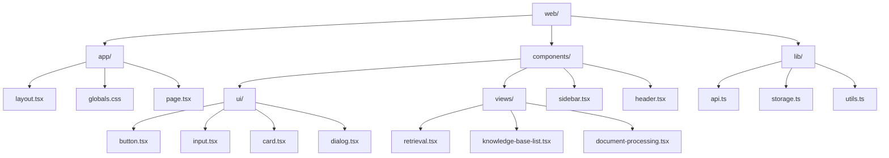

**图示来源**  
- [layout.tsx](file://web/app/layout.tsx)
- [sidebar.tsx](file://web/components/sidebar.tsx)
- [api.ts](file://web/lib/api.ts)

**本节来源**  
- [web/app](file://web/app)
- [web/components](file://web/components)
- [web/lib](file://web/lib)

## 页面路由与布局

前端采用Next.js 13+的App Router架构，通过`app/`目录组织页面路由。`layout.tsx`文件定义了应用的根布局，包含全局样式导入、字体配置和HTML结构。`page.tsx`作为应用的入口页面，负责渲染主界面结构。

`layout.tsx`使用Geist字体，并通过`globals.css`导入Tailwind CSS和自定义样式。布局组件包裹所有页面内容，确保一致的视觉风格和功能特性，如Toaster通知组件的全局可用性。

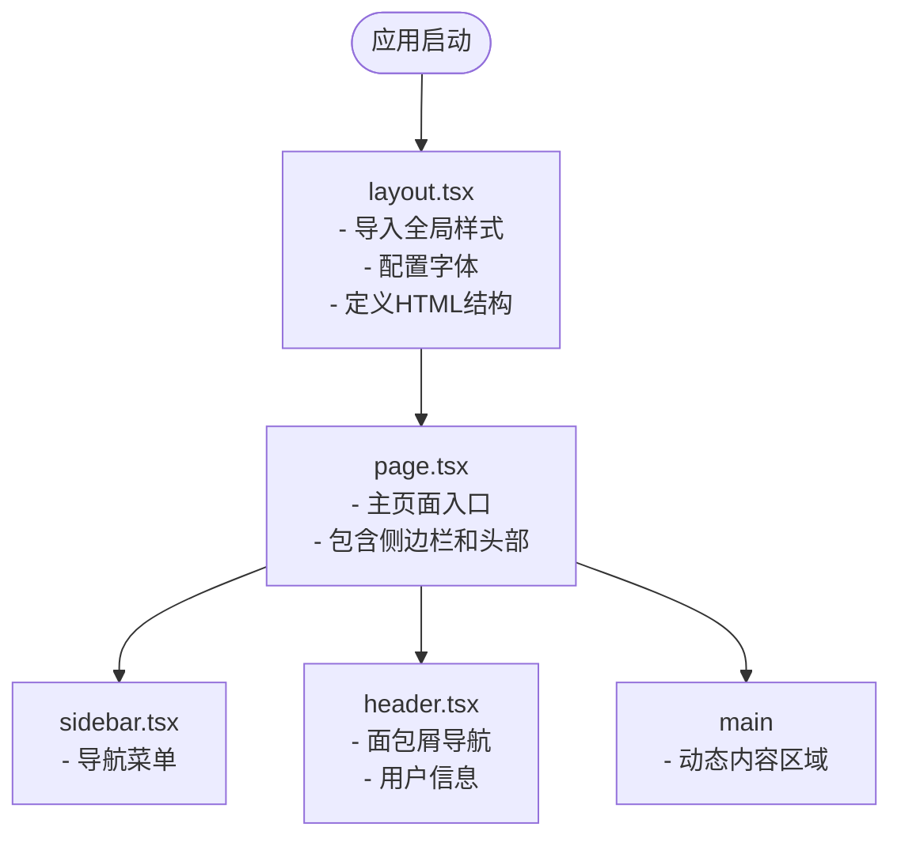

**图示来源**  
- [layout.tsx](file://web/app/layout.tsx)
- [page.tsx](file://web/app/page.tsx)

**本节来源**  
- [layout.tsx](file://web/app/layout.tsx#L1-L37)
- [page.tsx](file://web/app/page.tsx#L1-L109)

## 全局样式集成

全局样式通过`app/globals.css`文件集成，采用现代CSS技术栈，包括Tailwind CSS、自定义CSS变量和主题系统。样式文件定义了应用的视觉设计语言，包括颜色、间距、字体和响应式设计。

`globals.css`首先导入Tailwind CSS和动画库，然后定义自定义CSS变量，这些变量基于OKLCH色彩空间，提供高质量的色彩表现。通过`:root`和`.dark`选择器实现深色/浅色主题切换，确保用户体验的一致性。

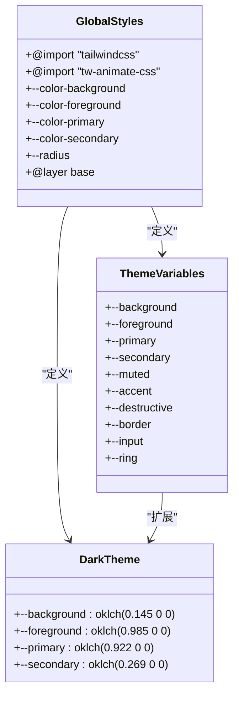

**图示来源**  
- [globals.css](file://web/app/globals.css#L1-L123)

**本节来源**  
- [globals.css](file://web/app/globals.css#L1-L123)

## 前端组件分层结构

前端组件采用分层架构设计，分为基础UI组件和功能视图组件两大类，分别位于`components/ui/`和`components/views/`目录中。

### 基础UI组件

`ui/`目录下的基础UI组件基于现代React实践构建，使用Radix UI原语和Tailwind CSS类名工具。这些组件提供一致的视觉风格和交互行为，支持类型安全和可访问性。

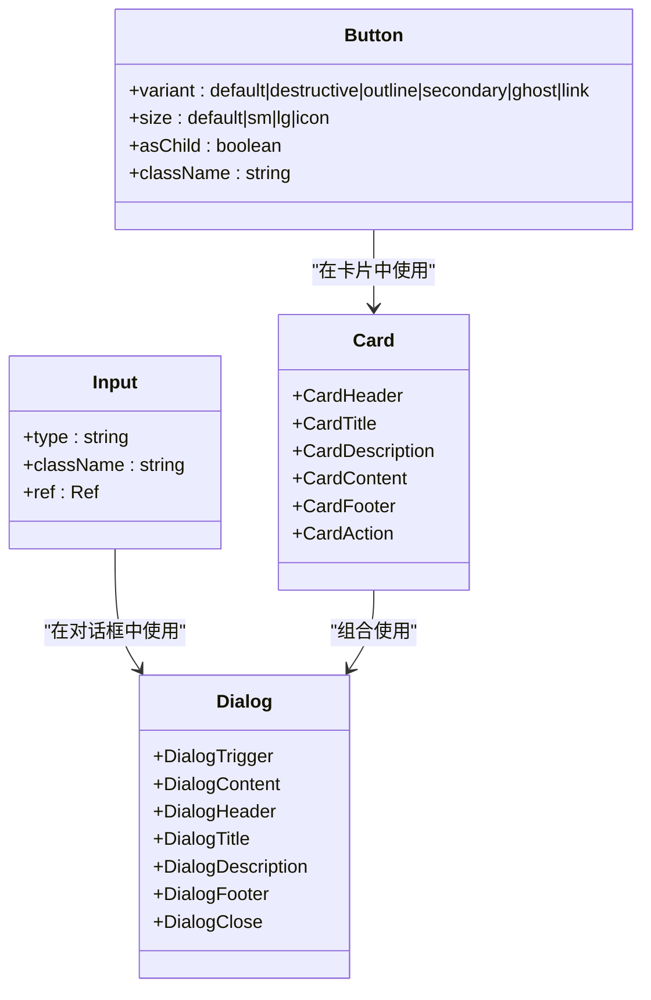

**图示来源**  
- [button.tsx](file://web/components/ui/button.tsx#L1-L61)
- [input.tsx](file://web/components/ui/input.tsx#L1-L27)
- [card.tsx](file://web/components/ui/card.tsx#L1-L93)

### 功能视图组件

`views/`目录下的功能视图组件实现具体业务逻辑，如`retrieval.tsx`处理检索功能，`retriever-evaluation.tsx`管理检索器评估。这些组件组合基础UI组件，通过API客户端与后端服务通信。

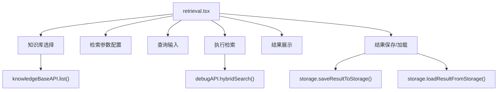

**图示来源**  
- [retrieval.tsx](file://web/components/views/retrieval.tsx#L1-L532)
- [knowledge-base-list.tsx](file://web/components/views/knowledge-base-list.tsx#L1-L149)

**本节来源**  
- [components/ui](file://web/components/ui)
- [components/views](file://web/components/views)

## 状态管理策略

前端采用React组件状态和上下文管理用户界面状态。`page.tsx`作为顶级组件，维护当前视图和面包屑导航状态，通过回调函数向下传递状态更新。

对于复杂的状态管理，如检索参数和结果，使用`useState`钩子在组件内部管理。`retrieval.tsx`组件维护多个状态变量，包括知识库ID、搜索查询、检索配置和搜索结果。

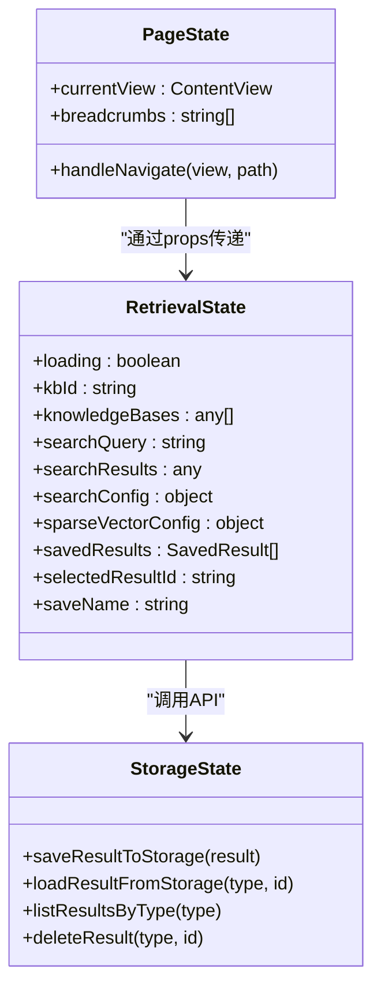

**图示来源**  
- [page.tsx](file://web/app/page.tsx#L39-L45)
- [retrieval.tsx](file://web/components/views/retrieval.tsx#L12-L32)
- [storage.ts](file://web/lib/storage.ts#L20-L119)

**本节来源**  
- [page.tsx](file://web/app/page.tsx#L39-L45)
- [retrieval.tsx](file://web/components/views/retrieval.tsx#L12-L32)

## API通信机制

前端通过`lib/api.ts`中的API客户端与后端FastAPI服务通信，实现了请求封装、错误处理和认证机制。API客户端采用模块化设计，为不同功能域提供专用的API接口。

### 请求封装

`api.ts`文件定义了通用的`request`函数，封装了fetch API的调用，处理请求头、响应解析和错误抛出。对于FormData请求，自动处理Content-Type头，确保文件上传的正确性。

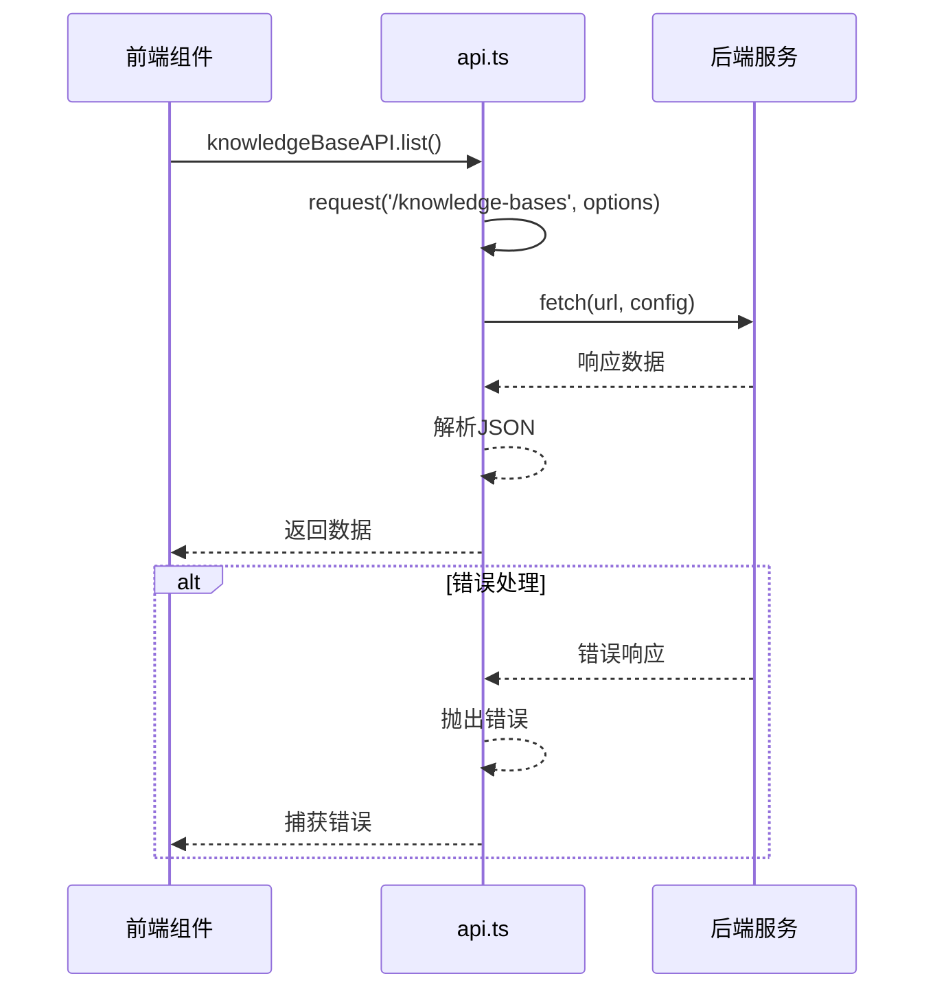

**图示来源**  
- [api.ts](file://web/lib/api.ts#L22-L57)

### 专用API模块

API客户端按功能域组织，包括知识库API、文档API、测试API和检索器评估API。每个模块提供类型安全的接口，简化前端调用。

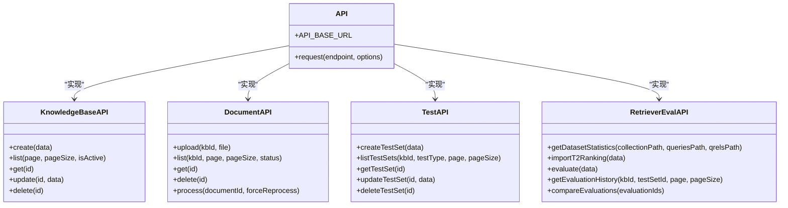

**图示来源**  
- [api.ts](file://web/lib/api.ts#L59-L669)

**本节来源**  
- [api.ts](file://web/lib/api.ts#L6-L800)

## 导航结构设计

导航结构由`sidebar.tsx`和`header.tsx`组件实现，设计逻辑清晰，与页面路由紧密联动。侧边栏提供主要导航菜单，头部组件显示面包屑导航和用户信息。

### 侧边栏设计

`sidebar.tsx`组件实现三级导航结构，包含知识库管理、链路调试和测试管理三大模块。每个模块可展开显示子菜单，通过`onNavigate`回调函数与主页面通信。

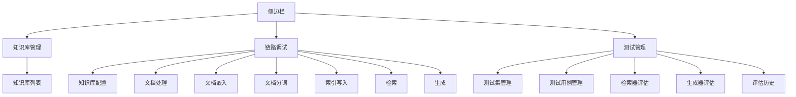

**图示来源**  
- [sidebar.tsx](file://web/components/sidebar.tsx#L19-L51)

### 头部设计

`header.tsx`组件显示当前页面的面包屑导航，帮助用户理解当前位置。同时提供用户菜单，包含个人设置和退出登录功能。

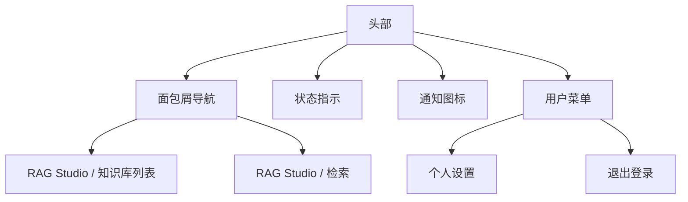

**图示来源**  
- [header.tsx](file://web/components/header.tsx#L21-L27)

### 联动机制

导航结构与页面路由通过事件驱动机制联动。`page.tsx`监听自定义`navigate`事件，更新当前视图和面包屑导航。

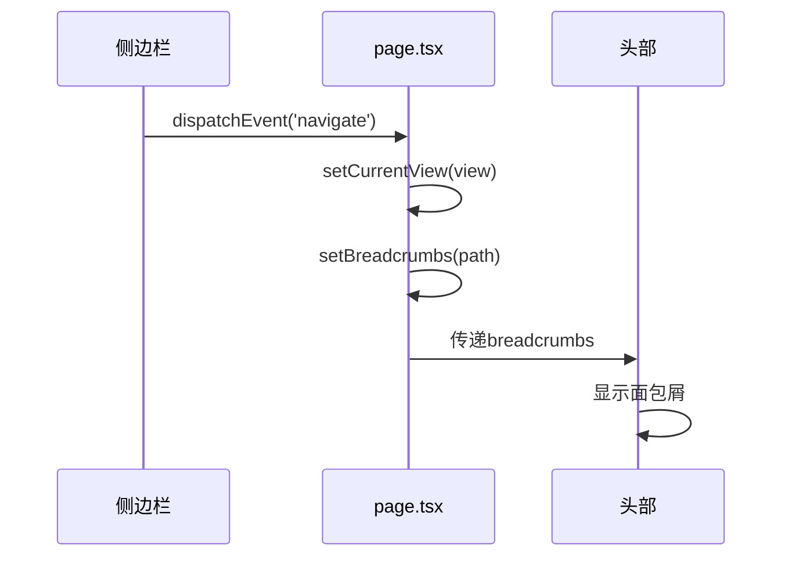

**图示来源**  
- [page.tsx](file://web/app/page.tsx#L48-L63)
- [sidebar.tsx](file://web/components/sidebar.tsx#L69-L70)

**本节来源**  
- [sidebar.tsx](file://web/components/sidebar.tsx#L1-L128)
- [header.tsx](file://web/components/header.tsx#L1-L69)
- [page.tsx](file://web/app/page.tsx#L48-L63)

## 组件复用与UI定制指南

### 组件复用

基础UI组件设计为高度可复用，通过props配置不同变体。例如，`Button`组件支持多种变体（默认、破坏性、轮廓等）和尺寸（默认、小、大）。

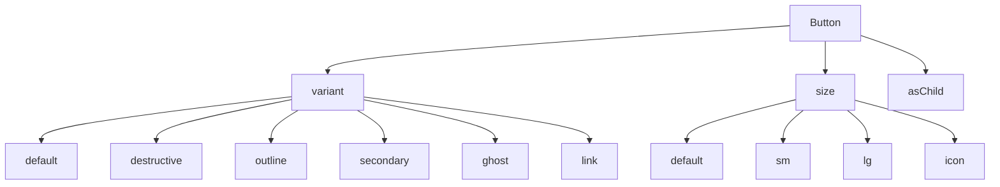

**图示来源**  
- [button.tsx](file://web/components/ui/button.tsx#L7-L37)

### UI定制

通过`globals.css`中的CSS变量实现UI定制，支持主题切换和样式覆盖。开发者可以通过修改CSS变量值来调整应用的整体视觉风格。

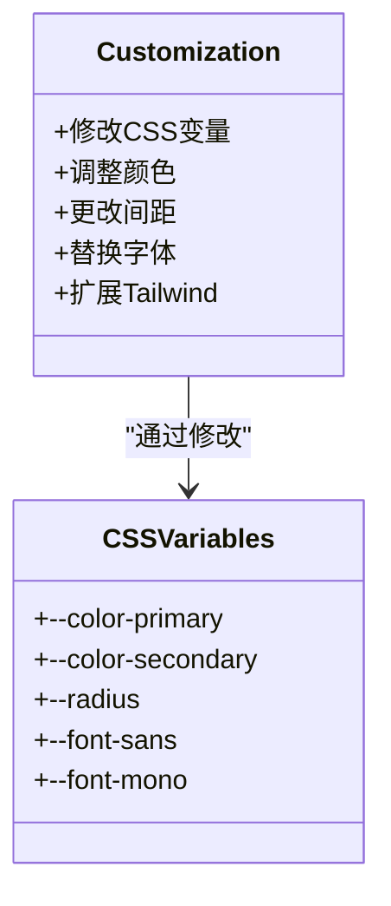

**图示来源**  
- [globals.css](file://web/app/globals.css#L6-L44)

**本节来源**  
- [button.tsx](file://web/components/ui/button.tsx#L7-L37)
- [globals.css](file://web/app/globals.css#L6-L44)