# RAG-Studio导航系统详细文档

<cite>
**本文档引用的文件**
- [sidebar.tsx](file://web/components/sidebar.tsx)
- [header.tsx](file://web/components/header.tsx)
- [page.tsx](file://web/app/page.tsx)
- [layout.tsx](file://web/app/layout.tsx)
- [dropdown-menu.tsx](file://web/components/ui/dropdown-menu.tsx)
- [avatar.tsx](file://web/components/ui/avatar.tsx)
- [utils.ts](file://web/lib/utils.ts)
- [knowledge-base-list.tsx](file://web/components/views/knowledge-base-list.tsx)
</cite>

## 目录
1. [简介](#简介)
2. [项目结构](#项目结构)
3. [核心组件](#核心组件)
4. [架构概览](#架构概览)
5. [详细组件分析](#详细组件分析)
6. [导航状态管理](#导航状态管理)
7. [组件协作机制](#组件协作机制)
8. [性能考虑](#性能考虑)
9. [故障排除指南](#故障排除指南)
10. [结论](#结论)

## 简介

RAG-Studio导航系统是一个基于React的现代化Web应用程序导航解决方案，采用客户端渲染模式，提供了完整的侧边栏导航和顶部导航栏功能。该系统支持多层次菜单结构、动态面包屑导航、用户状态管理和响应式布局设计。

导航系统的核心设计理念是提供直观的用户体验，通过清晰的层级结构和视觉反馈帮助用户快速定位和切换不同的功能模块。系统采用TypeScript确保类型安全，并使用Tailwind CSS进行样式管理。

## 项目结构

导航系统在项目中的组织结构如下：

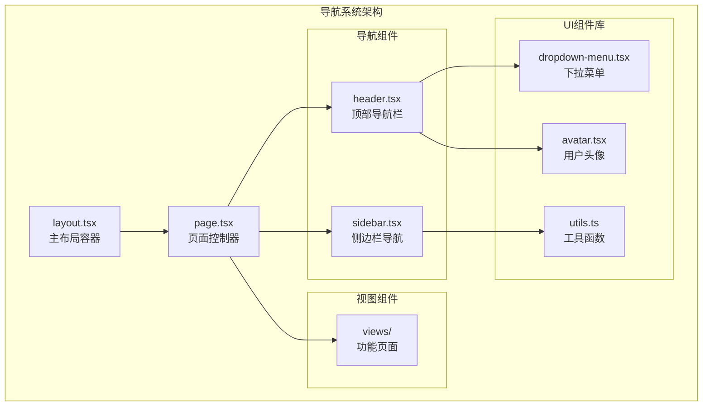

**图表来源**
- [layout.tsx](file://web/app/layout.tsx#L1-L37)
- [page.tsx](file://web/app/page.tsx#L1-L109)
- [sidebar.tsx](file://web/components/sidebar.tsx#L1-L128)
- [header.tsx](file://web/components/header.tsx#L1-L69)

**章节来源**
- [layout.tsx](file://web/app/layout.tsx#L1-L37)
- [page.tsx](file://web/app/page.tsx#L1-L109)

## 核心组件

导航系统由以下核心组件构成：

### 侧边栏导航组件 (Sidebar)
负责主要的功能导航，支持多级菜单结构和展开/收起交互。

### 顶部导航栏组件 (Header)
提供面包屑导航、用户状态指示和用户操作入口。

### 页面控制器 (Page)
管理整个应用的导航状态和视图切换逻辑。

**章节来源**
- [sidebar.tsx](file://web/components/sidebar.tsx#L1-L128)
- [header.tsx](file://web/components/header.tsx#L1-L69)
- [page.tsx](file://web/app/page.tsx#L1-L109)

## 架构概览

导航系统采用分层架构设计，确保组件间的松耦合和高内聚：

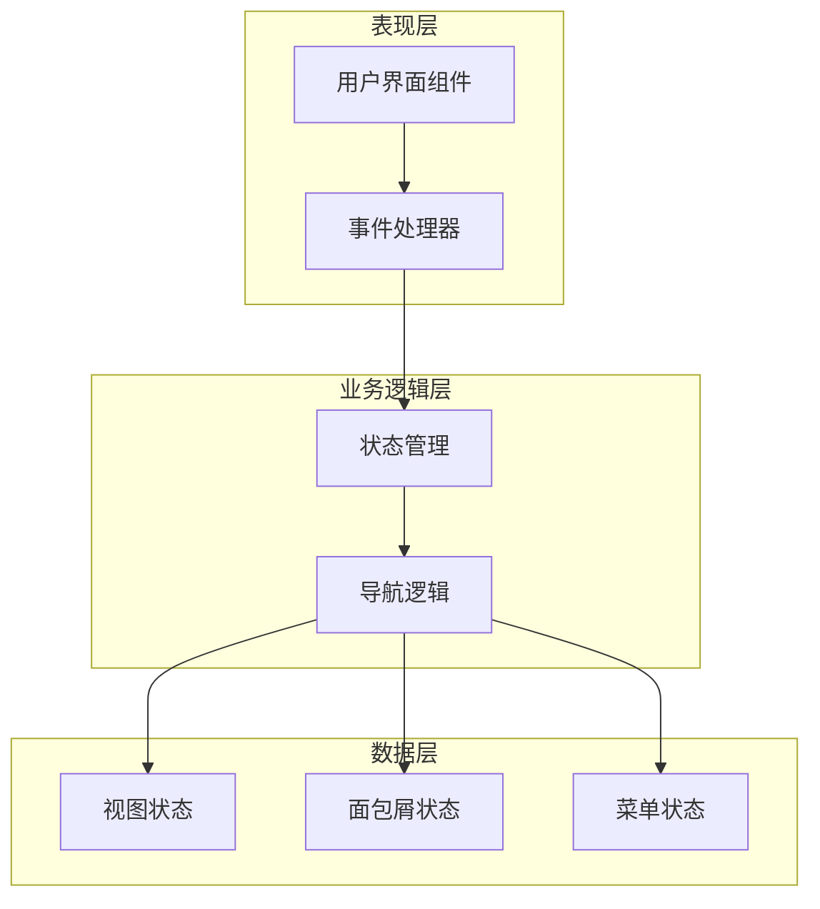

**图表来源**
- [page.tsx](file://web/app/page.tsx#L38-L63)
- [sidebar.tsx](file://web/components/sidebar.tsx#L53-L71)

## 详细组件分析

### 侧边栏导航组件 (Sidebar)

#### 菜单结构定义

侧边栏使用静态配置的菜单结构，通过`MENU_ITEMS`常量定义：

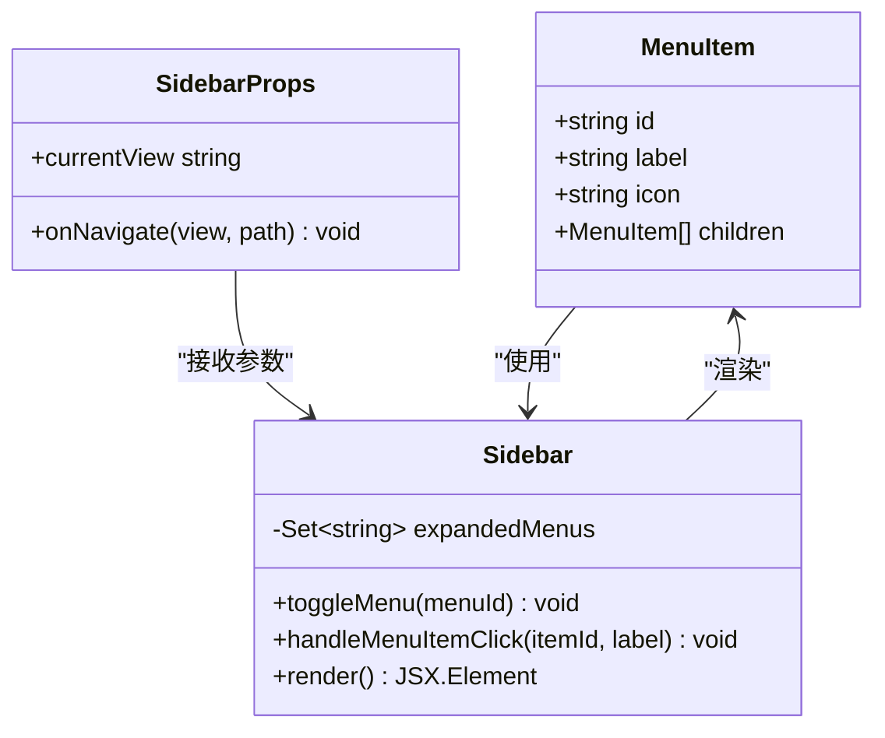

**图表来源**
- [sidebar.tsx](file://web/components/sidebar.tsx#L12-L18)
- [sidebar.tsx](file://web/components/sidebar.tsx#L19-L51)

#### 展开/收起交互逻辑

侧边栏实现了智能的菜单展开/收起功能：

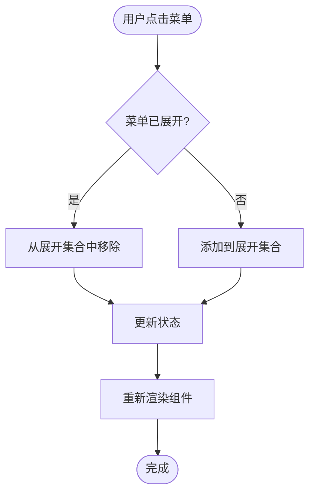

**图表来源**
- [sidebar.tsx](file://web/components/sidebar.tsx#L58-L66)

#### 页面导航回调机制

当用户选择具体的菜单项时，会触发导航回调：

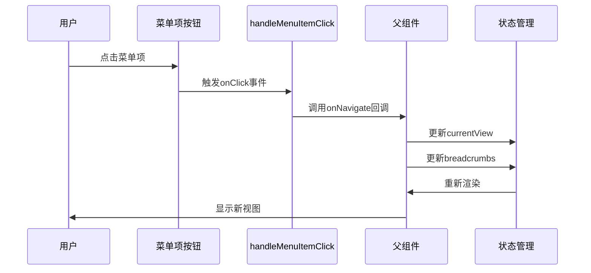

**图表来源**
- [sidebar.tsx](file://web/components/sidebar.tsx#L68-L70)
- [page.tsx](file://web/app/page.tsx#L42-L45)

**章节来源**
- [sidebar.tsx](file://web/components/sidebar.tsx#L1-L128)

### 顶部导航栏组件 (Header)

#### 面包屑路径显示

头部导航栏实现了动态面包屑导航系统：

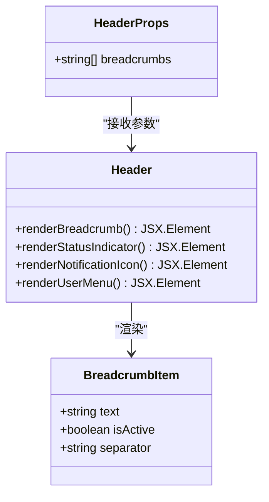

**图表来源**
- [header.tsx](file://web/components/header.tsx#L13-L16)
- [header.tsx](file://web/components/header.tsx#L17-L28)

#### 在线状态指示

系统提供了实时的连接状态指示器：

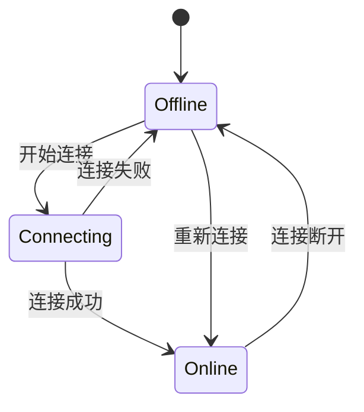

#### 通知图标和用户下拉菜单

头部包含了通知图标和用户操作菜单：

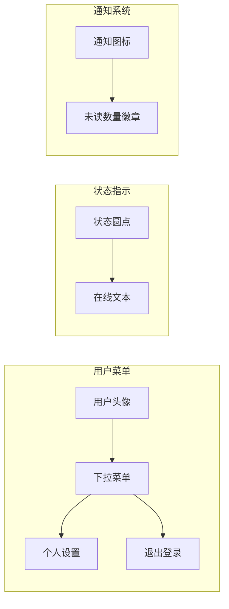

**图表来源**
- [header.tsx](file://web/components/header.tsx#L32-L64)

**章节来源**
- [header.tsx](file://web/components/header.tsx#L1-L69)

## 导航状态管理

### 当前视图高亮机制

导航系统通过`currentView`属性实现菜单项的高亮显示：

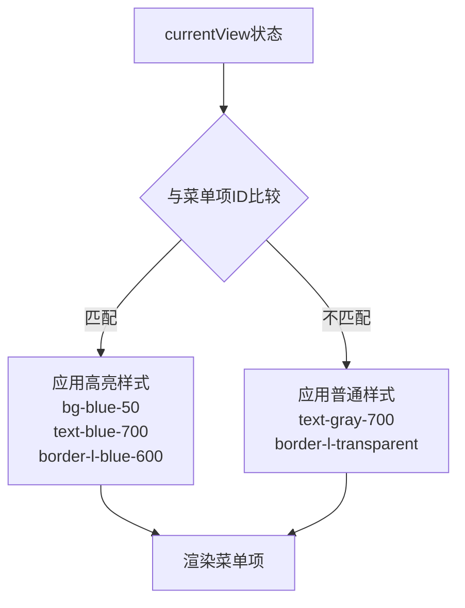

**图表来源**
- [sidebar.tsx](file://web/components/sidebar.tsx#L110-L118)

### 自定义事件导航系统

系统实现了基于自定义事件的导航机制：

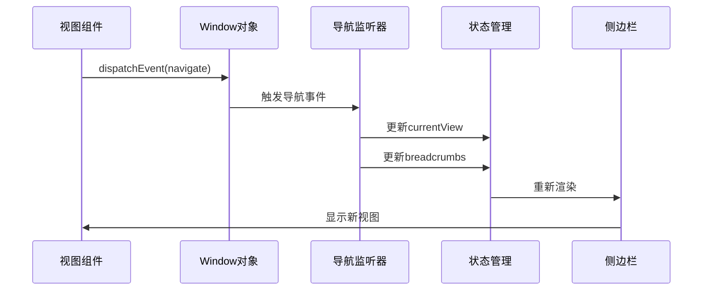

**图表来源**
- [page.tsx](file://web/app/page.tsx#L47-L63)
- [knowledge-base-list.tsx](file://web/components/views/knowledge-base-list.tsx#L48-L55)

**章节来源**
- [page.tsx](file://web/app/page.tsx#L38-L63)
- [knowledge-base-list.tsx](file://web/components/views/knowledge-base-list.tsx#L45-L55)

## 组件协作机制

### 主布局容器

主布局文件负责协调所有导航组件：

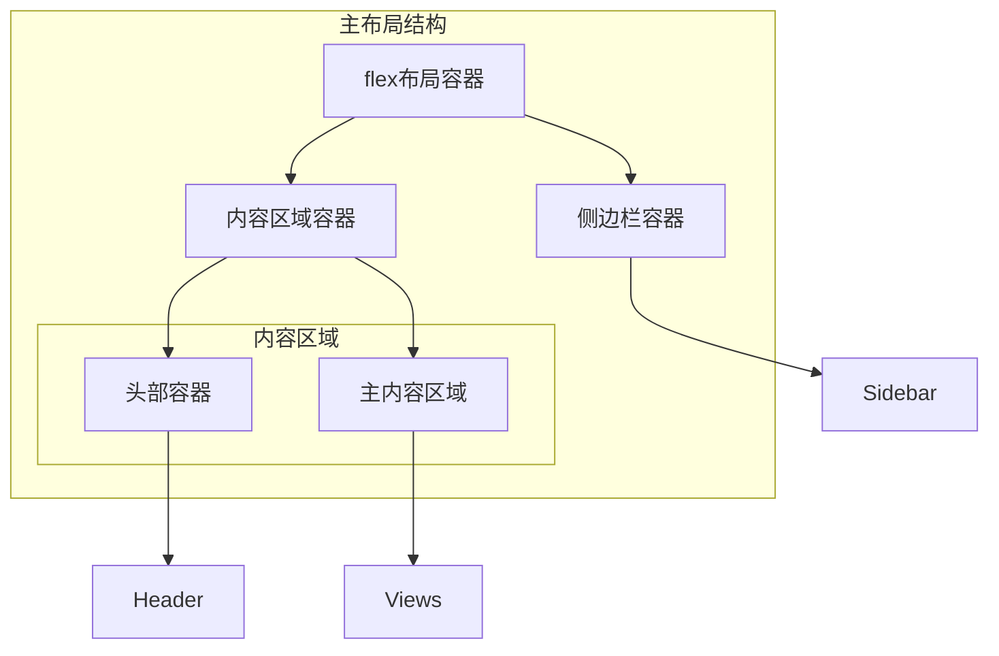

**图表来源**
- [page.tsx](file://web/app/page.tsx#L100-L108)

### 状态同步机制

导航系统的状态同步通过以下方式实现：

1. **父组件状态传递**：通过props向下传递状态
2. **回调函数传递**：通过回调函数向上更新状态
3. **全局事件通信**：通过自定义事件进行跨组件通信

**章节来源**
- [page.tsx](file://web/app/page.tsx#L100-L108)

## 性能考虑

### 状态管理优化

导航系统采用了多种性能优化策略：

1. **状态局部化**：每个组件维护自己的状态
2. **事件监听器清理**：在组件卸载时清理事件监听器
3. **条件渲染**：只渲染需要显示的菜单项

### 渲染优化

- 使用`useState`和`useEffect` Hook进行状态管理
- 实现了智能的重新渲染控制
- 避免不必要的DOM操作

## 故障排除指南

### 常见问题及解决方案

#### 导航不生效
**问题描述**：点击菜单项后页面没有变化
**解决方案**：
1. 检查`onNavigate`回调是否正确传递
2. 确认`currentView`状态是否正确更新
3. 验证路由映射是否正确

#### 面包屑显示异常
**问题描述**：面包屑路径显示不正确
**解决方案**：
1. 检查`breadcrumbs`数组格式
2. 确认路径数组的顺序和内容
3. 验证面包屑渲染逻辑

#### 菜单展开状态丢失
**问题描述**：页面刷新后菜单展开状态恢复默认
**解决方案**：
1. 检查`expandedMenus`状态初始化
2. 考虑持久化菜单状态
3. 验证状态更新逻辑

**章节来源**
- [page.tsx](file://web/app/page.tsx#L47-L63)
- [sidebar.tsx](file://web/components/sidebar.tsx#L54-L56)

## 结论

RAG-Studio导航系统是一个设计精良、功能完备的现代Web应用导航解决方案。它通过以下特点实现了优秀的用户体验：

1. **模块化设计**：清晰的组件分离和职责划分
2. **响应式交互**：流畅的动画效果和即时的状态反馈
3. **可扩展架构**：易于添加新的菜单项和功能模块
4. **类型安全**：完整的TypeScript类型定义
5. **性能优化**：合理的状态管理和渲染优化

该导航系统为RAG-Studio提供了坚实的基础，支持复杂的多层级功能导航需求，同时保持了良好的代码可维护性和扩展性。通过自定义事件机制，系统实现了组件间的松耦合通信，为大型应用的开发奠定了良好的基础。