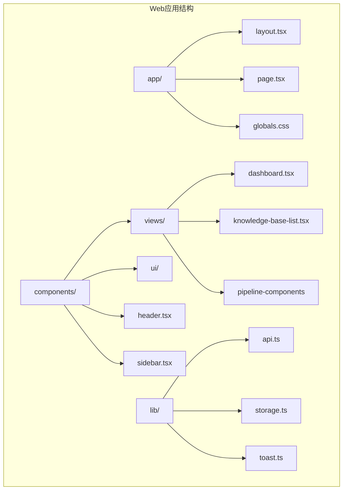
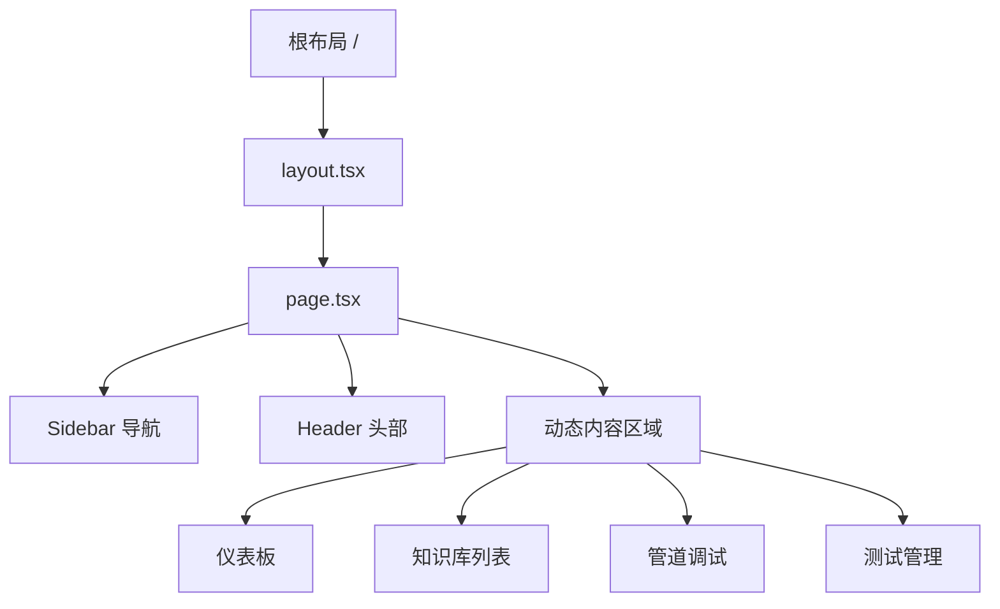
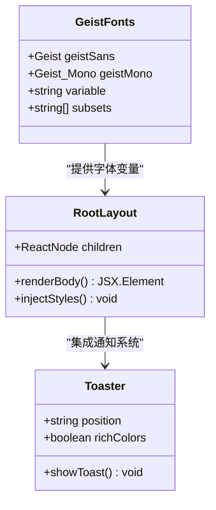
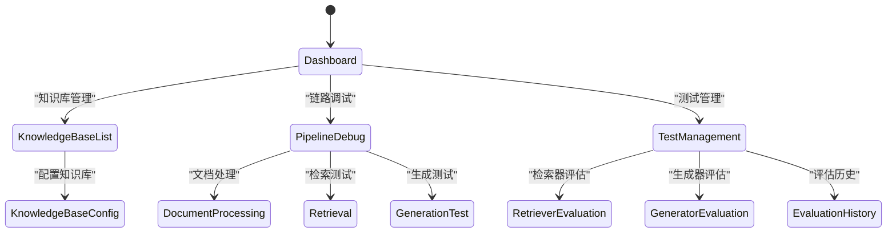
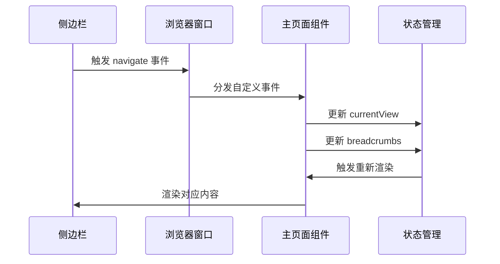
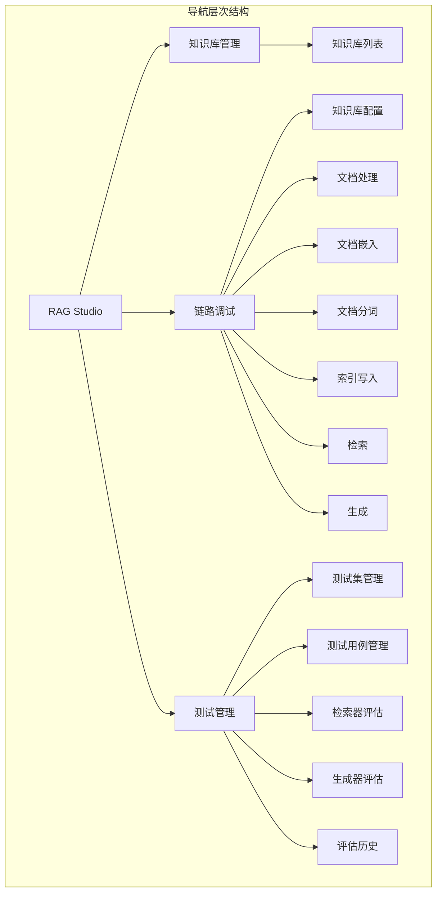
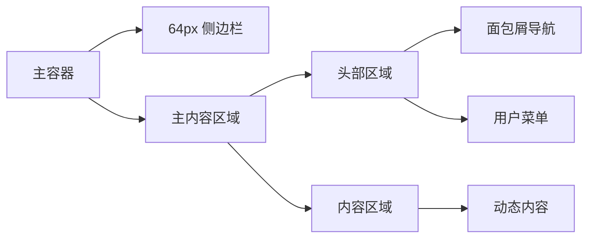
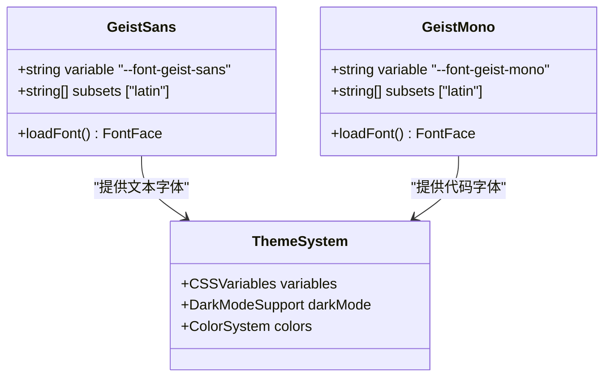
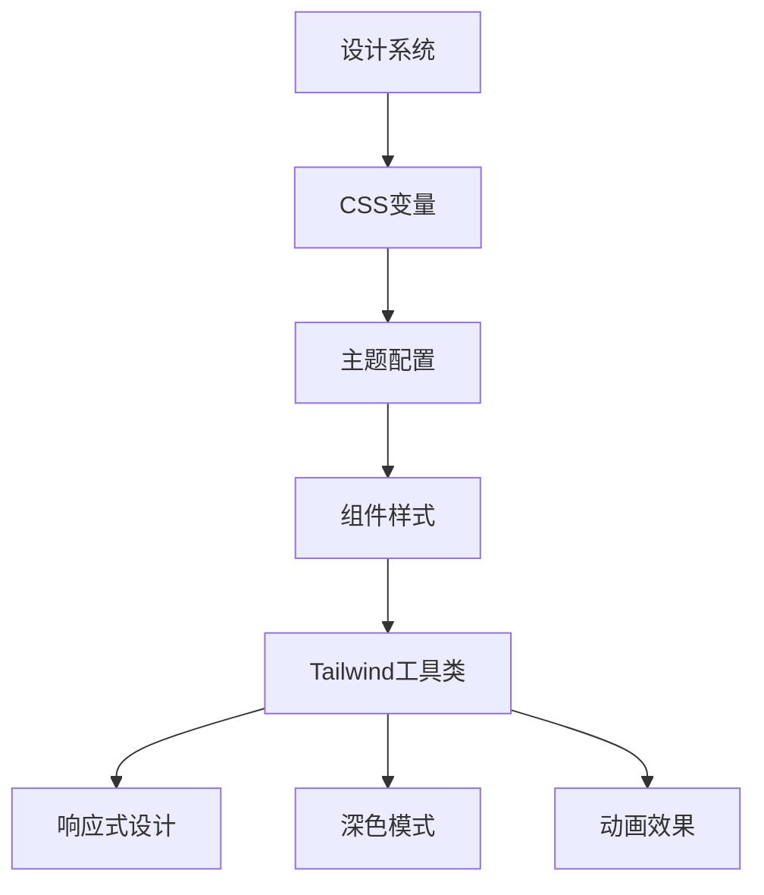
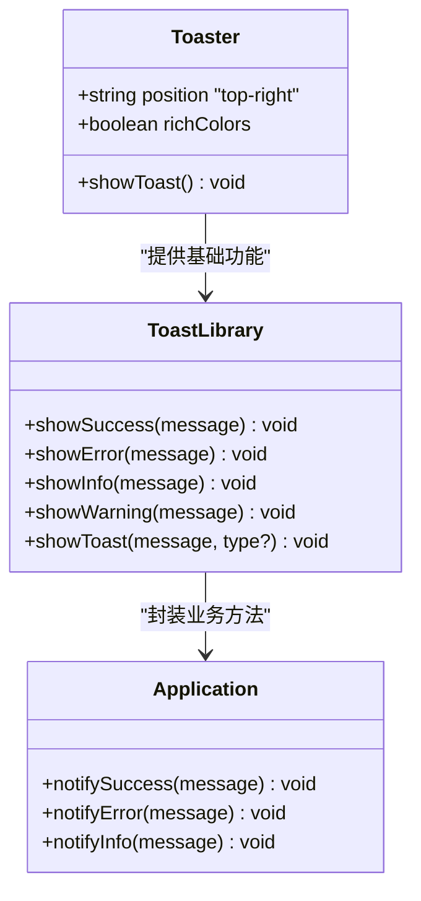

# 路由与布局

<cite>
**本文档中引用的文件**
- [layout.tsx](file://web/app/layout.tsx)
- [page.tsx](file://web/app/page.tsx)
- [globals.css](file://web/app/globals.css)
- [sidebar.tsx](file://web/components/sidebar.tsx)
- [header.tsx](file://web/components/header.tsx)
- [dashboard.tsx](file://web/components/views/dashboard.tsx)
- [toast.ts](file://web/lib/toast.ts)
- [package.json](file://web/package.json)
- [next.config.ts](file://web/next.config.ts)
- [tsconfig.json](file://web/tsconfig.json)
</cite>

## 目录
1. [简介](#简介)
2. [项目结构概览](#项目结构概览)
3. [Next.js 13+ App Router 架构](#nextjs-13-app-router-架构)
4. [根布局系统](#根布局系统)
5. [页面级组件](#页面级组件)
6. [导航与布局嵌套](#导航与布局嵌套)
7. [全局样式与字体系统](#全局样式与字体系统)
8. [通知系统](#通知系统)
9. [最佳实践指南](#最佳实践指南)
10. [总结](#总结)

## 简介

RAG-Studio采用基于Next.js 13+ App Router的现代前端架构，实现了高效的页面导航和布局管理系统。该系统通过精心设计的布局层次结构，提供了统一的视觉风格和流畅的用户体验。本文档将深入分析其路由系统、布局架构、样式管理和导航机制。

## 项目结构概览

RAG-Studio的前端项目采用清晰的目录结构，专注于功能模块化和代码组织：



**图表来源**
- [layout.tsx](file://web/app/layout.tsx#L1-L37)
- [page.tsx](file://web/app/page.tsx#L1-L109)
- [sidebar.tsx](file://web/components/sidebar.tsx#L1-L128)
- [header.tsx](file://web/components/header.tsx#L1-L69)

**章节来源**
- [layout.tsx](file://web/app/layout.tsx#L1-L37)
- [page.tsx](file://web/app/page.tsx#L1-L109)

## Next.js 13+ App Router 架构

RAG-Studio基于Next.js 13+的App Router架构，这是一种全新的文件系统路由方式，提供了更灵活的布局嵌套和数据获取模式。

### 核心特性

1. **文件系统路由**：基于文件系统的自动路由生成
2. **布局嵌套**：支持多层布局嵌套和共享状态
3. **流式传输**：支持React Server Components和流式传输
4. **并行数据获取**：支持并发数据获取优化性能

### 路由层次结构



**图表来源**
- [layout.tsx](file://web/app/layout.tsx#L21-L36)
- [page.tsx](file://web/app/page.tsx#L38-L108)

**章节来源**
- [layout.tsx](file://web/app/layout.tsx#L1-L37)
- [page.tsx](file://web/app/page.tsx#L1-L109)

## 根布局系统

RootLayout组件是整个应用的根布局容器，负责管理全局样式、字体加载和基础结构。

### RootLayout组件分析

RootLayout组件实现了以下核心功能：

1. **字体系统集成**：通过Geist字体提供统一的排版系统
2. **全局样式注入**：加载全局CSS变量和主题配置
3. **通知服务**：集成Toaster组件提供全局通知功能
4. **语义化HTML结构**：确保良好的可访问性和SEO优化

### 字体系统实现



**图表来源**
- [layout.tsx](file://web/app/layout.tsx#L6-L14)
- [layout.tsx](file://web/app/layout.tsx#L21-L36)

### 全局CSS架构

RootLayout通过导入全局CSS文件建立了完整的样式体系：

| CSS变量类别 | 变量前缀 | 用途描述 |
|------------|---------|----------|
| 颜色系统 | --color-* | 定义主题色彩变量 |
| 字体系统 | --font-* | 管理字体族和字重 |
| 圆角系统 | --radius-* | 统一样式圆角大小 |
| 间距系统 | --spacing-* | 规范组件间距标准 |

**章节来源**
- [layout.tsx](file://web/app/layout.tsx#L1-L37)
- [globals.css](file://web/app/globals.css#L1-L123)

## 页面级组件

page.tsx作为主页面组件，实现了复杂的客户端状态管理和动态内容渲染逻辑。

### 内容视图管理系统

页面组件采用基于枚举的视图管理系统，支持15种不同的功能视图：



**图表来源**
- [page.tsx](file://web/app/page.tsx#L21-L63)

### 导航事件系统

页面组件实现了基于自定义事件的导航机制：



**图表来源**
- [page.tsx](file://web/app/page.tsx#L42-L62)
- [sidebar.tsx](file://web/components/sidebar.tsx#L68-L70)

### 动态内容渲染

页面组件通过条件渲染实现高效的内容切换：

| 视图类型 | 组件名称 | 功能描述 |
|---------|---------|----------|
| 仪表板 | Dashboard | 应用概览和统计信息 |
| 知识库管理 | KnowledgeBaseList | 知识库列表和操作 |
| 管道调试 | 各类管道组件 | 文档处理、检索等功能 |
| 测试管理 | 各类测试组件 | 评估和测试相关功能 |

**章节来源**
- [page.tsx](file://web/app/page.tsx#L1-L109)
- [sidebar.tsx](file://web/components/sidebar.tsx#L1-L128)

## 导航与布局嵌套

RAG-Studio实现了多层次的导航系统，通过Sidebar组件提供结构化的菜单导航。

### Sidebar导航系统

Sidebar组件实现了三级导航结构：



**图表来源**
- [sidebar.tsx](file://web/components/sidebar.tsx#L19-L50)

### 布局嵌套机制

应用采用水平分割的布局模式：



**图表来源**
- [page.tsx](file://web/app/page.tsx#L101-L107)
- [header.tsx](file://web/components/header.tsx#L17-L68)

### 响应式设计

布局系统支持响应式设计，通过Tailwind CSS类实现：

| 断点 | 屏幕宽度 | 布局调整 |
|------|---------|----------|
| 移动端 | < 768px | 侧边栏折叠 |
| 平板端 | 768px - 1024px | 侧边栏半隐藏 |
| 桌面端 | > 1024px | 完整侧边栏显示 |

**章节来源**
- [sidebar.tsx](file://web/components/sidebar.tsx#L1-L128)
- [header.tsx](file://web/components/header.tsx#L1-L69)

## 全局样式与字体系统

RAG-Studio采用了基于CSS变量的主题系统，结合Geist字体提供现代化的视觉体验。

### Geist字体集成

系统集成了两种Geist字体变体：



**图表来源**
- [layout.tsx](file://web/app/layout.tsx#L6-L14)

### 主题变量系统

全局CSS定义了完整的CSS变量主题系统：

| 变量类别 | 变量前缀 | 深色模式变化 | 用途 |
|---------|---------|-------------|------|
| 背景颜色 | --background | 从白色变为深灰 | 页面背景色 |
| 主要颜色 | --primary | 从深蓝变为浅蓝 | 主要操作色 |
| 边框颜色 | --border | 从浅灰变为透明 | 组件边框 |
| 字体颜色 | --foreground | 从黑色变为白色 | 主要文字色 |

### Tailwind CSS集成

系统使用Tailwind CSS v4进行样式构建：



**图表来源**
- [globals.css](file://web/app/globals.css#L6-L44)
- [package.json](file://web/package.json#L58-L60)

**章节来源**
- [layout.tsx](file://web/app/layout.tsx#L1-L37)
- [globals.css](file://web/app/globals.css#L1-L123)

## 通知系统

RAG-Studio集成了Sonner通知系统，提供全局的用户反馈机制。

### Toaster组件集成

RootLayout中集成了Toaster组件，提供位置和样式配置：



**图表来源**
- [layout.tsx](file://web/app/layout.tsx#L31-L32)
- [toast.ts](file://web/lib/toast.ts#L1-L68)

### 通知类型系统

Toast库提供了多种通知类型：

| 通知类型 | 函数名 | 使用场景 | 默认图标 |
|---------|-------|----------|----------|
| 成功 | showSuccess | 操作成功完成 | ✓ |
| 错误 | showError | 操作失败或出错 | ✗ |
| 信息 | showInfo | 一般信息提示 | ℹ️ |
| 警告 | showWarning | 警告或重要提醒 | ⚠️ |

### 智能消息分类

Toast库实现了智能的消息类型自动分类：

```mermaid
flowchart TD
Message[输入消息] --> AutoDetect{自动检测}
AutoDetect --> |包含"成功"/"完成"| Success[成功通知]
AutoDetect --> |包含"失败"/"错误"| Error[错误通知]
AutoDetect --> |包含"警告"/"注意"| Warning[警告通知]
AutoDetect --> |其他| Info[信息通知]
Success --> Render[渲染通知]
Error --> Render
Warning --> Render
Info --> Render
```

**图表来源**
- [toast.ts](file://web/lib/toast.ts#L37-L66)

**章节来源**
- [layout.tsx](file://web/app/layout.tsx#L1-L37)
- [toast.ts](file://web/lib/toast.ts#L1-L68)

## 最佳实践指南

基于RAG-Studio的架构设计，以下是推荐的最佳实践：

### 布局开发最佳实践

1. **保持布局层次简洁**：避免超过3层的布局嵌套
2. **合理使用CSS变量**：在全局CSS中定义主题变量
3. **组件职责分离**：每个组件专注单一功能
4. **响应式设计优先**：使用Tailwind CSS工具类

### 导航系统最佳实践

1. **语义化路由命名**：使用描述性的路由路径
2. **面包屑导航**：为复杂应用提供清晰的导航线索
3. **状态同步**：确保导航状态与URL同步
4. **键盘导航支持**：提供完整的键盘操作支持

### 样式管理最佳实践

1. **主题一致性**：使用统一的颜色系统和字体规范
2. **暗色模式支持**：为所有组件提供暗色模式适配
3. **性能优化**：避免过度的CSS嵌套和复杂选择器
4. **可访问性**：确保足够的对比度和适当的ARIA属性

### 开发工具配置

项目使用了现代化的开发工具链：

| 工具 | 版本 | 用途 |
|------|------|------|
| Next.js | ^15.1.0 | 主框架 |
| React | 19.2.0 | 用户界面库 |
| Tailwind CSS | ^4.1.9 | 样式框架 |
| TypeScript | ^5 | 类型安全 |
| Sonner | ^1.7.4 | 通知系统 |

**章节来源**
- [package.json](file://web/package.json#L1-L73)
- [tsconfig.json](file://web/tsconfig.json#L1-L28)

## 总结

RAG-Studio的路由与布局系统展现了现代Next.js应用的最佳实践。通过精心设计的布局层次、灵活的导航系统和统一的样式管理，为用户提供了流畅且一致的体验。

### 关键优势

1. **架构清晰**：基于Next.js 13+ App Router的现代架构
2. **开发效率高**：自动路由生成和类型安全
3. **用户体验优秀**：流畅的导航和响应式设计
4. **维护性强**：模块化组件和清晰的职责分离

### 技术亮点

- **Geist字体集成**：提供现代化的排版体验
- **CSS变量主题系统**：支持深色模式和品牌定制
- **智能通知系统**：提升用户交互体验
- **TypeScript支持**：确保代码质量和开发效率

这套路由与布局系统为RAG-Studio奠定了坚实的技术基础，支持未来的功能扩展和性能优化。