# 中间件与配置管理

<cite>
**本文档中引用的文件**
- [middleware.py](file://backend/app/core/middleware.py)
- [config.py](file://backend/app/config.py)
- [main.py](file://backend/app/main.py)
- [exceptions.py](file://backend/app/core/exceptions.py)
- [vector_db_service.py](file://backend/app/services/vector_db_service.py)
</cite>

## 目录
1. [简介](#简介)
2. [项目结构概览](#项目结构概览)
3. [中间件系统](#中间件系统)
4. [配置管理系统](#配置管理系统)
5. [向量数据库连接配置](#向量数据库连接配置)
6. [安全配置与最佳实践](#安全配置与最佳实践)
7. [性能调优指南](#性能调优指南)
8. [故障排除指南](#故障排除指南)
9. [总结](#总结)

## 简介

RAG-Studio采用现代化的FastAPI框架构建，具备完善的中间件与配置管理体系。该系统通过RequestIDMiddleware和TimingMiddleware提供全链路追踪和性能监控能力，同时基于Pydantic Settings的配置管理机制确保应用的灵活性和安全性。本文档将深入解析这些核心组件的实现原理和最佳实践。

## 项目结构概览

RAG-Studio的中间件与配置管理模块主要分布在以下关键文件中：

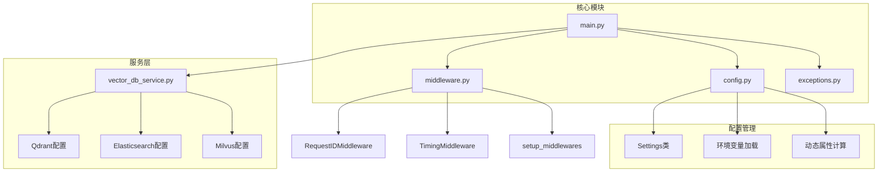

**图表来源**
- [main.py](file://backend/app/main.py#L1-L112)
- [config.py](file://backend/app/config.py#L1-L99)
- [middleware.py](file://backend/app/core/middleware.py#L1-L62)

**章节来源**
- [main.py](file://backend/app/main.py#L1-L112)
- [config.py](file://backend/app/config.py#L1-L99)

## 中间件系统

### RequestIDMiddleware - 全链路追踪核心

RequestIDMiddleware是RAG-Studio实现全链路追踪的关键组件，为每个HTTP请求生成唯一标识符，并将其注入到响应头中。

#### 核心实现原理

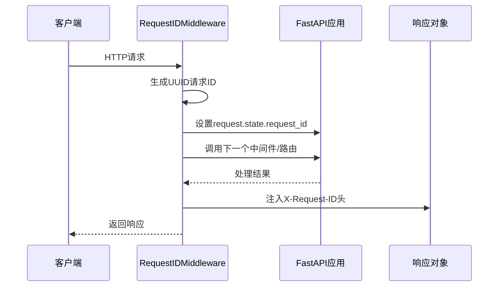

**图表来源**
- [middleware.py](file://backend/app/core/middleware.py#L18-L24)

#### 技术特性

1. **唯一性保证**: 使用UUID v4算法确保请求ID的全局唯一性
2. **状态传递**: 通过`request.state`在请求生命周期内保持请求ID
3. **响应注入**: 自动将请求ID添加到HTTP响应头中
4. **透明性**: 对业务逻辑无侵入，自动处理所有请求

### TimingMiddleware - 性能监控引擎

TimingMiddleware负责记录每个请求的处理时间，提供实时的性能监控能力。

#### 实现机制

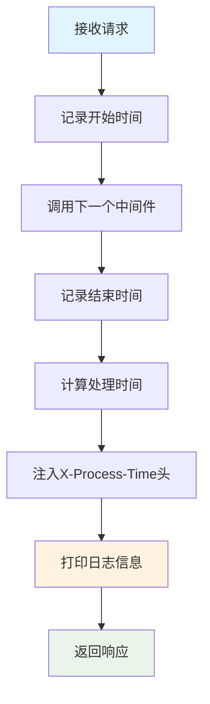

**图表来源**
- [middleware.py](file://backend/app/core/middleware.py#L34-L49)

#### 日志输出格式

TimingMiddleware采用结构化的日志输出格式，便于监控和分析：

```
📝 [请求ID] METHOD PATH - STATUS_CODE - PROCESS_TIME.s
```

示例输出：
```
📝 [123e4567-e89b-12d3-a456-426614174000] GET /api/v1/health - 200 - 0.015s
```

### 中间件注册机制

setup_middlewares函数负责将自定义中间件注册到FastAPI应用实例中：

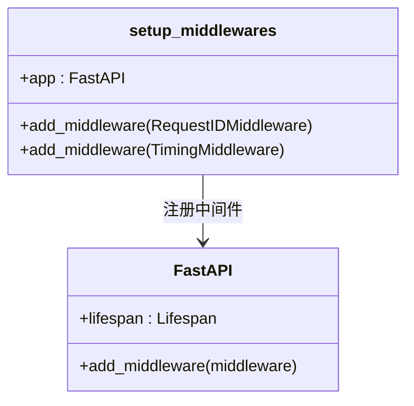

**图表来源**
- [middleware.py](file://backend/app/core/middleware.py#L52-L61)
- [main.py](file://backend/app/main.py#L59-L60)

**章节来源**
- [middleware.py](file://backend/app/core/middleware.py#L1-L62)
- [main.py](file://backend/app/main.py#L59-L60)

## 配置管理系统

### Pydantic Settings架构

RAG-Studio采用Pydantic Settings作为配置管理的核心，提供类型安全、环境变量驱动的配置体系。

#### 配置类设计

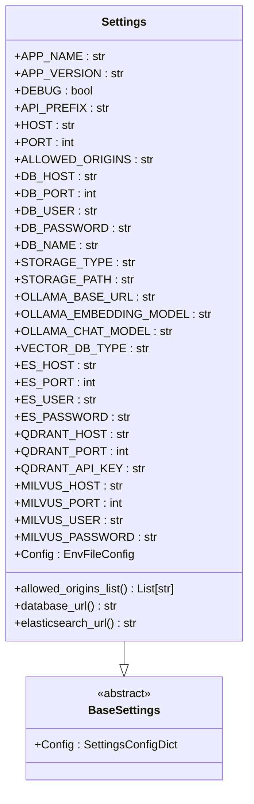

**图表来源**
- [config.py](file://backend/app/config.py#L15-L98)

#### 环境变量加载机制

配置系统通过.env文件实现环境变量的集中管理：

| 配置项 | 类型 | 默认值 | 描述 |
|--------|------|--------|------|
| APP_NAME | str | "RAG Studio Backend" | 应用名称 |
| DEBUG | bool | True | 调试模式开关 |
| HOST | str | "0.0.0.0" | 服务器绑定地址 |
| PORT | int | 8000 | 服务器监听端口 |
| API_PREFIX | str | "/api/v1" | API路径前缀 |
| ALLOWED_ORIGINS | str | "http://localhost:3000,http://localhost:3001" | CORS允许的源 |

#### 动态属性计算

配置类提供了多个动态属性，用于生成复杂的连接字符串：

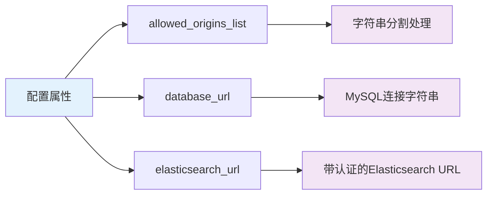

**图表来源**
- [config.py](file://backend/app/config.py#L78-L95)

### 敏感信息管理

#### 安全配置原则

1. **环境变量隔离**: 敏感信息通过.env文件管理，避免硬编码
2. **访问控制**: 仅在必要时暴露敏感配置
3. **加密传输**: 支持HTTPS和认证机制

#### 配置项安全级别分类

| 安全级别 | 配置项 | 保护措施 |
|----------|--------|----------|
| 高 | DB_PASSWORD, ES_PASSWORD, QDRANT_API_KEY, MILVUS_PASSWORD | 加密存储，环境变量隔离 |
| 中 | OLLAMA_BASE_URL, CUSTOM_SERVICE_API_KEY | HTTPS传输，访问限制 |
| 低 | APP_NAME, DEBUG, HOST, PORT | 明文存储，公开配置 |

**章节来源**
- [config.py](file://backend/app/config.py#L1-L99)

## 向量数据库连接配置

### 多数据库支持架构

RAG-Studio支持三种主流向量数据库，每种都提供了灵活的配置选项。

#### Qdrant配置详解

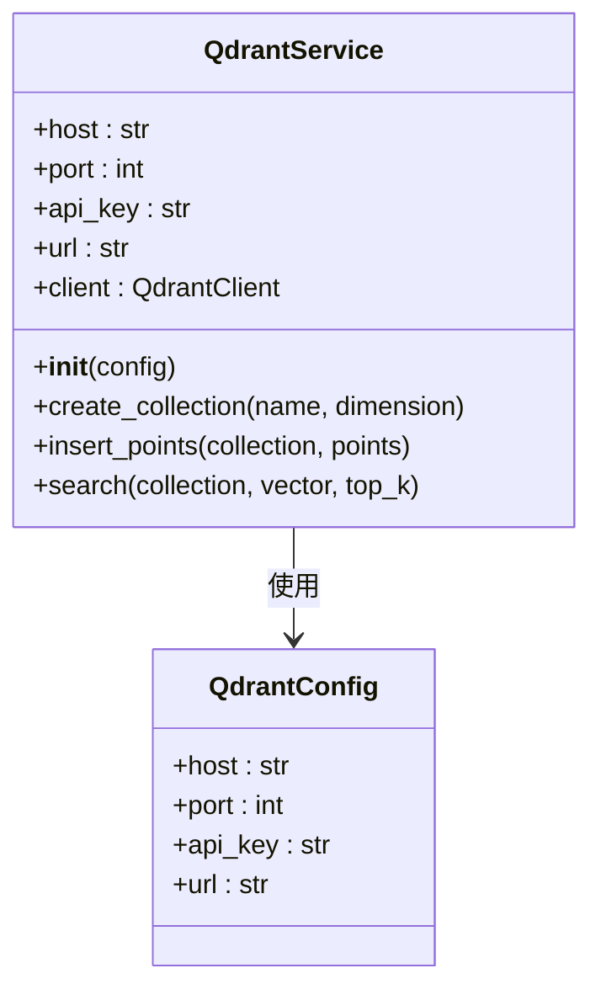

**图表来源**
- [vector_db_service.py](file://backend/app/services/vector_db_service.py#L203-L284)

#### Elasticsearch配置机制

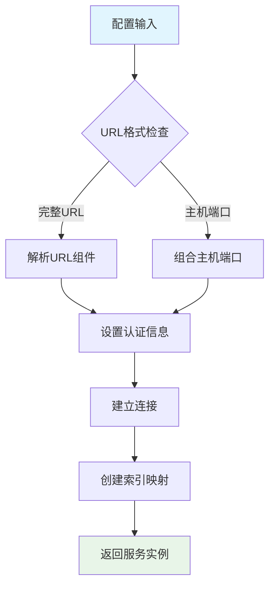

**图表来源**
- [vector_db_service.py](file://backend/app/services/vector_db_service.py#L116-L154)

#### Milvus配置选项

Milvus配置支持用户名密码认证和无认证两种模式：

| 配置项 | 类型 | 必需 | 描述 |
|--------|------|------|------|
| MILVUS_HOST | str | 是 | Milvus服务器地址 |
| MILVUS_PORT | int | 是 | Milvus服务器端口 |
| MILVUS_USER | str | 否 | 用户名（认证模式） |
| MILVUS_PASSWORD | str | 否 | 密码（认证模式） |

### 连接池与性能优化

#### 连接复用策略

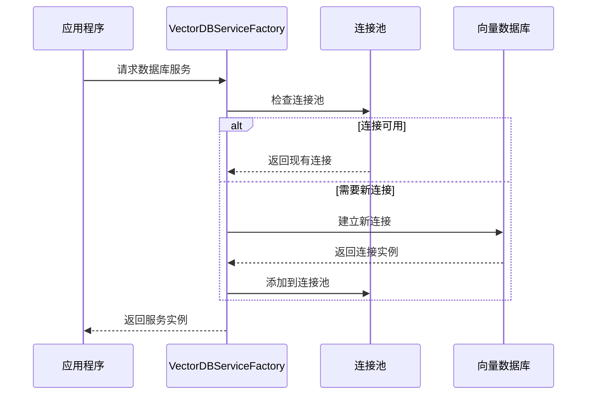

**图表来源**
- [vector_db_service.py](file://backend/app/services/vector_db_service.py#L1089-L1111)

**章节来源**
- [vector_db_service.py](file://backend/app/services/vector_db_service.py#L116-L284)
- [config.py](file://backend/app/config.py#L55-L73)

## 安全配置与最佳实践

### CORS配置安全

RAG-Studio提供了灵活的CORS配置机制，支持多域名访问控制：

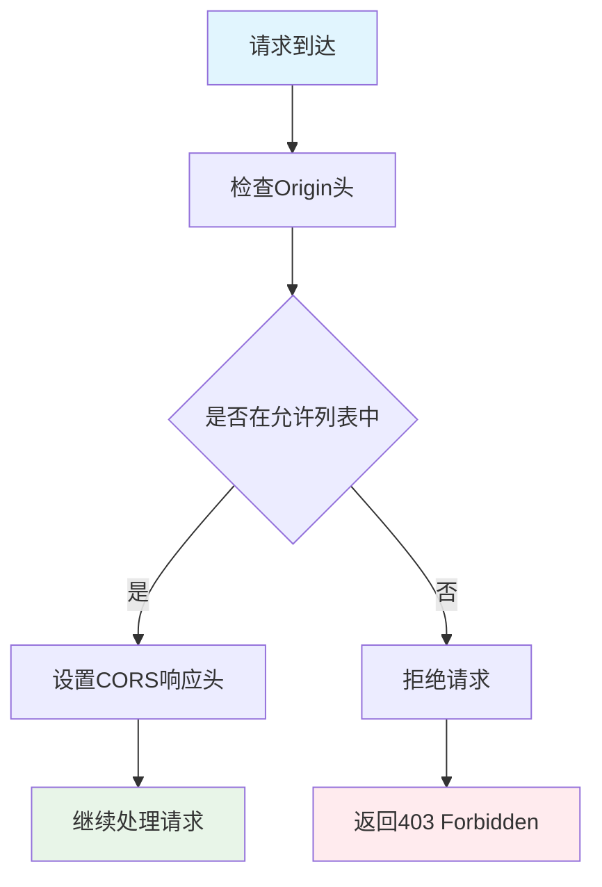

#### 生产环境安全配置建议

1. **严格域名白名单**: 仅允许特定的前端域名
2. **HTTPS强制**: 在生产环境中启用HTTPS
3. **CORS头部最小化**: 仅暴露必要的CORS头部

### 异常处理安全

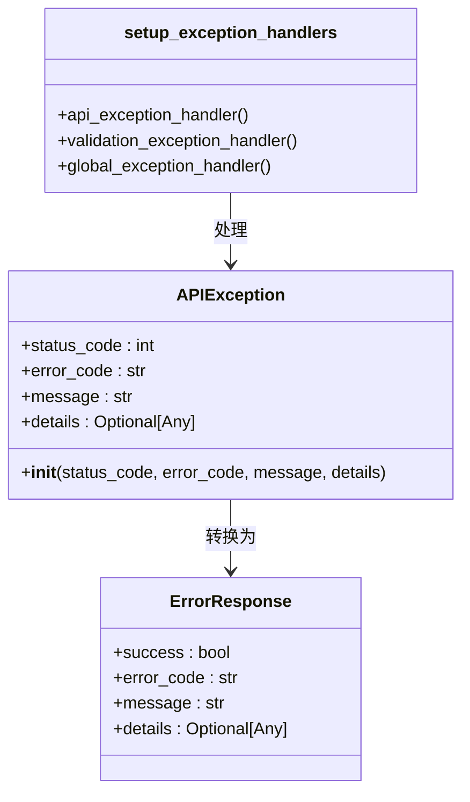

**图表来源**
- [exceptions.py](file://backend/app/core/exceptions.py#L12-L144)

#### 敏感信息过滤

异常处理系统实现了智能的敏感信息过滤：

| 环境 | 敏感信息显示 | 说明 |
|------|-------------|------|
| 开发环境 | 完整错误堆栈 | 便于调试 |
| 生产环境 | 简化错误信息 | 避免泄露细节 |

**章节来源**
- [exceptions.py](file://backend/app/core/exceptions.py#L1-L144)
- [main.py](file://backend/app/main.py#L51-L57)

## 性能调优指南

### 中间件性能优化

#### RequestIDMiddleware优化

1. **UUID生成优化**: 使用高效的UUID v4生成算法
2. **内存管理**: 及时清理请求状态，避免内存泄漏
3. **并发处理**: 支持高并发场景下的请求ID生成

#### TimingMiddleware性能监控

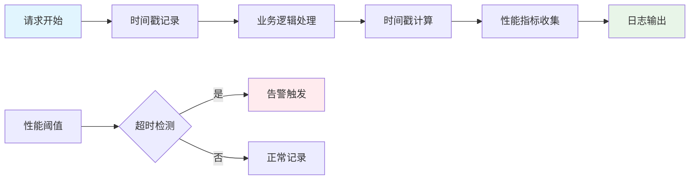

### 配置优化参数

#### 数据库连接优化

| 参数 | 开发环境 | 生产环境 | 说明 |
|------|----------|----------|------|
| max_connections | 5 | 20 | 最大连接数 |
| pool_timeout | 5s | 10s | 连接池超时 |
| connect_timeout | 5s | 10s | 连接超时 |
| idle_timeout | 30s | 60s | 空闲连接超时 |

#### 向量数据库优化

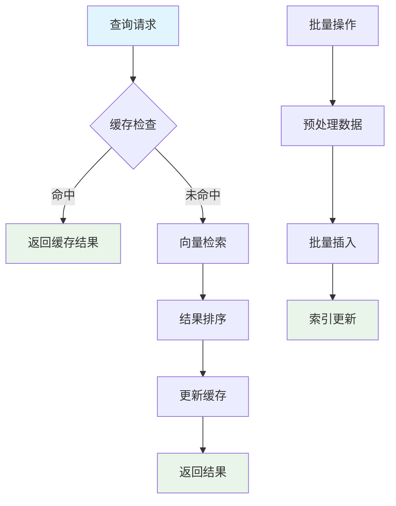

### 监控指标建议

#### 关键性能指标(KPI)

1. **请求延迟**: X-Process-Time响应头
2. **请求频率**: 每秒请求数(RPS)
3. **错误率**: 4xx/5xx状态码比例
4. **连接池利用率**: 数据库连接使用情况

## 故障排除指南

### 常见问题诊断

#### 中间件问题排查

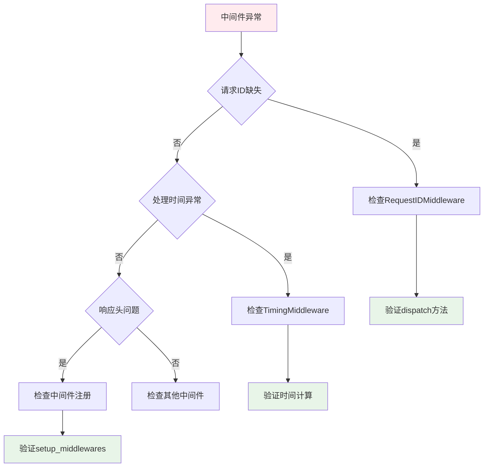

#### 配置加载问题

1. **环境变量未加载**: 检查.env文件路径和格式
2. **类型转换错误**: 验证配置值的数据类型
3. **依赖缺失**: 确认必需的Python包安装

#### 数据库连接问题

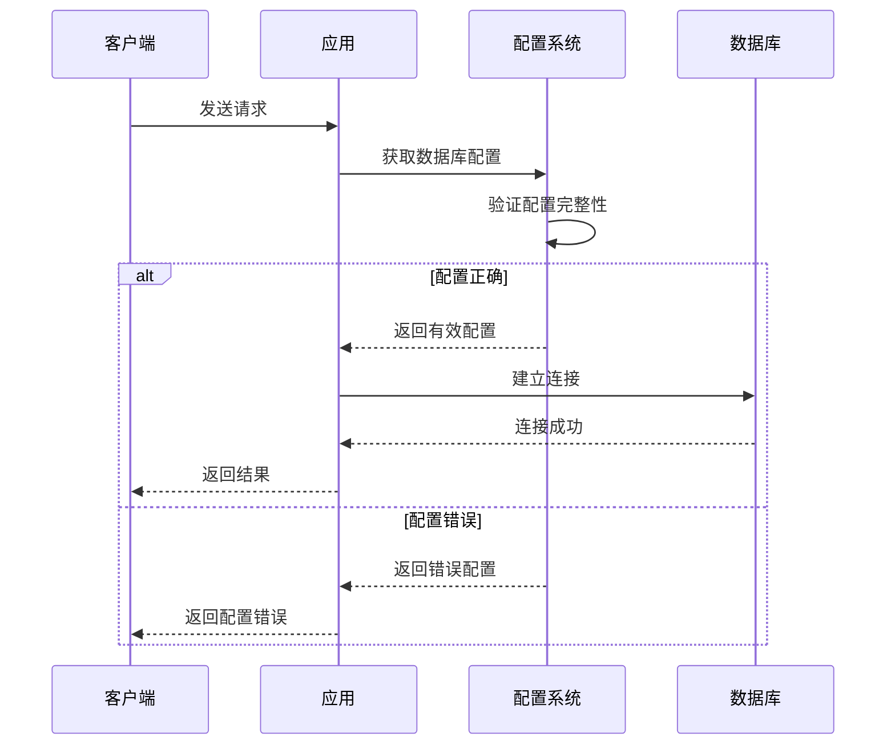

### 调试工具和技巧

#### 日志分析

1. **请求ID关联**: 使用X-Request-ID追踪特定请求
2. **时间线分析**: 结合X-Process-Time分析性能瓶颈
3. **错误堆栈**: 开发环境下的详细错误信息

#### 性能分析

1. **慢查询识别**: 通过TimingMiddleware识别慢请求
2. **资源使用监控**: 监控内存和CPU使用情况
3. **并发压力测试**: 测试系统在高并发下的表现

**章节来源**
- [middleware.py](file://backend/app/core/middleware.py#L1-L62)
- [config.py](file://backend/app/config.py#L1-L99)

## 总结

RAG-Studio的中间件与配置管理系统展现了现代Web应用的最佳实践。通过RequestIDMiddleware和TimingMiddleware的协同工作，系统实现了完整的全链路追踪和性能监控能力。基于Pydantic Settings的配置管理机制确保了应用的灵活性和安全性，支持多环境部署和动态配置更新。

系统的向量数据库连接配置提供了对多种主流向量数据库的统一抽象，简化了不同数据库间的切换成本。安全配置和异常处理机制确保了生产环境的稳定性和安全性。

通过合理的性能调优和监控指标设置，开发者可以构建出高性能、高可用的企业级应用。这套中间件与配置管理方案不仅满足了当前的功能需求，还为未来的扩展和演进奠定了坚实的基础。