# 后端架构

<cite>
**本文档引用的文件**  
- [main.py](file://backend/app/main.py)
- [config.py](file://backend/app/config.py)
- [middleware.py](file://backend/app/core/middleware.py)
- [factory.py](file://backend/app/repositories/factory.py)
- [knowledge_base.py](file://backend/app/controllers/knowledge_base.py)
- [knowledge_base.py](file://backend/app/services/knowledge_base.py)
- [base.py](file://backend/app/models/base.py)
- [base.py](file://backend/app/repositories/base.py)
- [exceptions.py](file://backend/app/core/exceptions.py)
- [knowledge_base_storage.py](file://backend/app/services/knowledge_base_storage.py)
- [json_repository.py](file://backend/app/repositories/json_repository.py)
- [run.py](file://backend/run.py)
</cite>

## 目录
1. [项目结构](#项目结构)
2. [核心架构模式](#核心架构模式)
3. [MVC架构详解](#mvc架构详解)
4. [依赖注入与服务工厂](#依赖注入与服务工厂)
5. [中间件机制](#中间件机制)
6. [配置管理](#配置管理)
7. [数据访问抽象](#数据访问抽象)
8. [向量数据库与AI服务抽象](#向量数据库与ai服务抽象)
9. [错误处理机制](#错误处理机制)
10. [架构演进指导](#架构演进指导)

## 项目结构

RAG-Studio后端采用清晰的模块化结构，遵循FastAPI的最佳实践。项目根目录下的`backend/app`目录包含了所有核心组件，按照功能划分为多个子目录：

- `controllers/`: 控制器层，处理HTTP请求和响应
- `services/`: 服务层，封装核心业务逻辑
- `models/`: 数据模型层，定义数据结构
- `repositories/`: 仓储层，抽象数据访问
- `schemas/`: Pydantic模型，用于请求/响应数据验证
- `core/`: 核心功能，包括中间件、异常处理等
- `database/`: 数据库相关配置（当前主要使用JSON文件存储）
- `utils/`: 工具函数

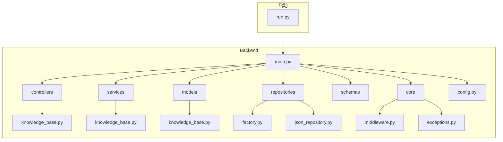

**Diagram sources**
- [main.py](file://backend/app/main.py)
- [run.py](file://backend/run.py)

**Section sources**
- [main.py](file://backend/app/main.py)
- [run.py](file://backend/run.py)

## 核心架构模式

RAG-Studio后端采用基于FastAPI的MVC（Model-View-Controller）架构模式，结合了现代微服务设计的最佳实践。该架构的核心特点是分层清晰、职责分离和松耦合。

系统通过`main.py`作为应用入口，利用`lifespan`上下文管理器处理应用的启动和关闭生命周期。在启动时，系统会根据配置初始化相应的存储类型，并打印关键配置信息，便于开发者监控和调试。

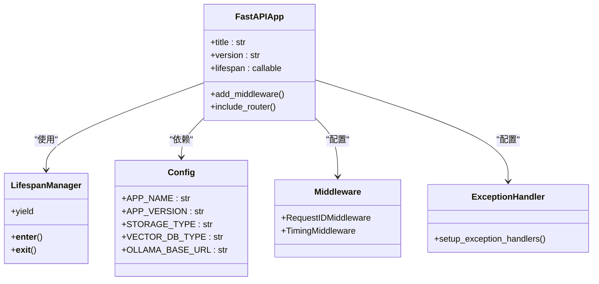

**Diagram sources**
- [main.py](file://backend/app/main.py#L15-L37)
- [config.py](file://backend/app/config.py#L15-L97)

**Section sources**
- [main.py](file://backend/app/main.py)
- [config.py](file://backend/app/config.py)

## MVC架构详解

### 控制器层（Controllers）

控制器层负责处理HTTP请求和响应，是系统的入口点。每个控制器文件对应一个特定的业务领域，如`knowledge_base.py`处理知识库相关的API请求。

控制器的主要职责包括：
- 定义API路由和端点
- 处理HTTP请求参数和验证
- 调用服务层执行业务逻辑
- 构造并返回HTTP响应

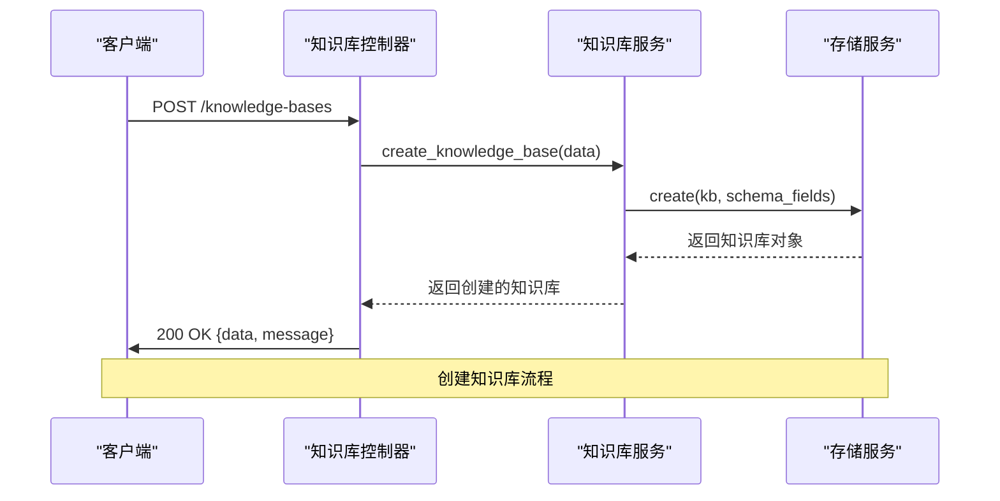

**Diagram sources**
- [knowledge_base.py](file://backend/app/controllers/knowledge_base.py#L22-L45)
- [knowledge_base.py](file://backend/app/services/knowledge_base.py#L21-L47)

**Section sources**
- [knowledge_base.py](file://backend/app/controllers/knowledge_base.py)
- [knowledge_base.py](file://backend/app/services/knowledge_base.py)

### 服务层（Services）

服务层封装了核心业务逻辑，是系统的大脑。它独立于HTTP协议，可以被不同的控制器或任务调用。

以`KnowledgeBaseService`为例，其主要功能包括：
- 创建、读取、更新、删除知识库
- 管理知识库的统计信息
- 处理知识库的Schema配置
- 协调与其他服务的交互

服务层通过依赖注入的方式获取所需的仓储实例，实现了业务逻辑与数据访问的解耦。

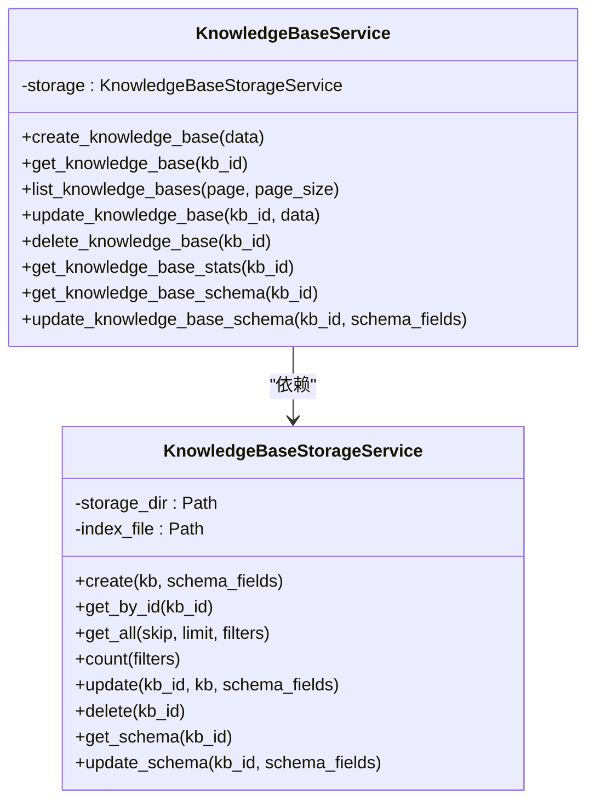

**Diagram sources**
- [knowledge_base.py](file://backend/app/services/knowledge_base.py#L15-L230)
- [knowledge_base_storage.py](file://backend/app/services/knowledge_base_storage.py#L17-L359)

**Section sources**
- [knowledge_base.py](file://backend/app/services/knowledge_base.py)
- [knowledge_base_storage.py](file://backend/app/services/knowledge_base_storage.py)

### 模型层（Models）

模型层定义了系统的数据结构，使用Pydantic BaseModel实现。`BaseModelMixin`作为所有模型的基类，提供了通用的字段和方法。

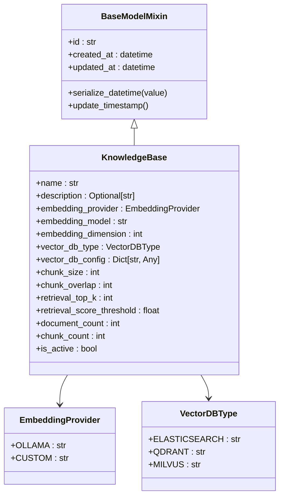

**Diagram sources**
- [base.py](file://backend/app/models/base.py#L11-L31)
- [knowledge_base.py](file://backend/app/models/knowledge_base.py#L25-L80)

**Section sources**
- [base.py](file://backend/app/models/base.py)
- [knowledge_base.py](file://backend/app/models/knowledge_base.py)

## 依赖注入与服务工厂

RAG-Studio通过服务工厂模式实现了松耦合的设计，使得系统组件可以灵活替换和扩展。

### 仓储工厂（Repository Factory）

`RepositoryFactory`是系统依赖注入的核心，根据配置动态创建相应的仓储实例。

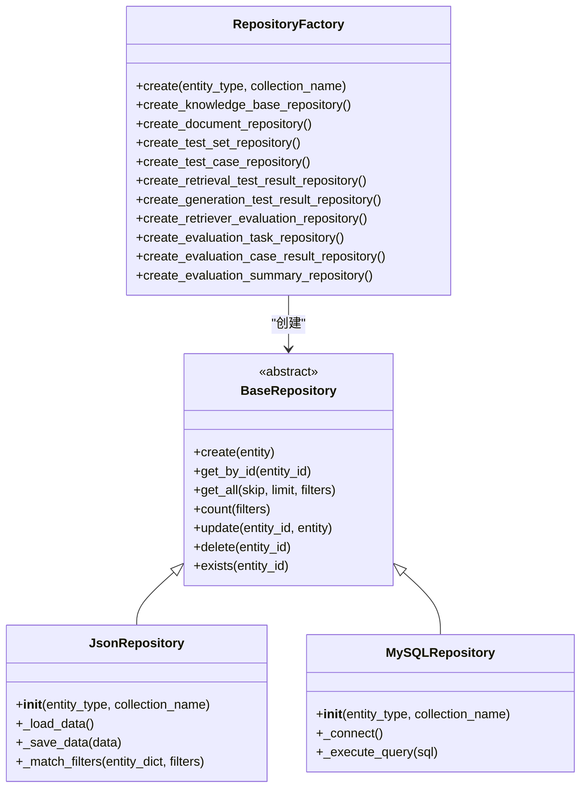

**Diagram sources**
- [factory.py](file://backend/app/repositories/factory.py#L17-L116)
- [base.py](file://backend/app/repositories/base.py#L14-L119)
- [json_repository.py](file://backend/app/repositories/json_repository.py#L16-L162)

**Section sources**
- [factory.py](file://backend/app/repositories/factory.py)
- [base.py](file://backend/app/repositories/base.py)
- [json_repository.py](file://backend/app/repositories/json_repository.py)

## 中间件机制

中间件在请求处理管道中扮演着重要角色，负责处理跨切面的关注点，如日志记录、性能监控和请求追踪。

### 请求ID中间件

为每个请求生成唯一的UUID，便于日志追踪和问题排查。

### 计时中间件

记录每个请求的处理时间，并在响应头中返回，便于性能分析。

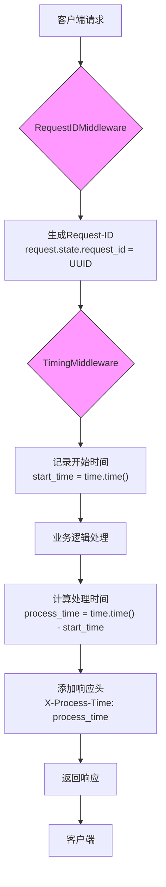

**Diagram sources**
- [middleware.py](file://backend/app/core/middleware.py#L12-L62)

**Section sources**
- [middleware.py](file://backend/app/core/middleware.py)

## 配置管理

系统使用Pydantic Settings进行配置管理，支持从环境变量和`.env`文件加载配置。

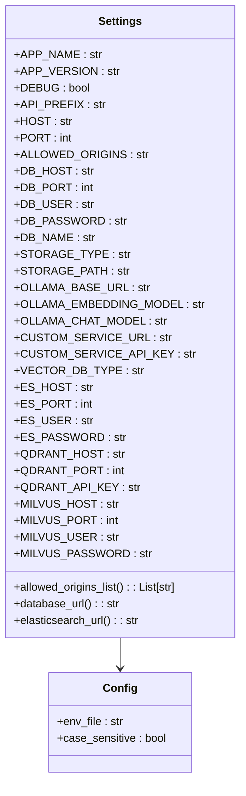

**Diagram sources**
- [config.py](file://backend/app/config.py#L15-L97)

**Section sources**
- [config.py](file://backend/app/config.py)

## 数据访问抽象

系统通过仓储模式（Repository Pattern）实现了数据访问的抽象，使得业务逻辑与具体的数据存储实现解耦。

### 仓储层设计

- `BaseRepository`: 定义了CRUD操作的抽象接口
- `JsonRepository`: JSON文件存储的具体实现
- `MySQLRepository`: MySQL数据库存储的具体实现

这种设计使得系统可以轻松切换不同的存储后端，只需修改配置即可。

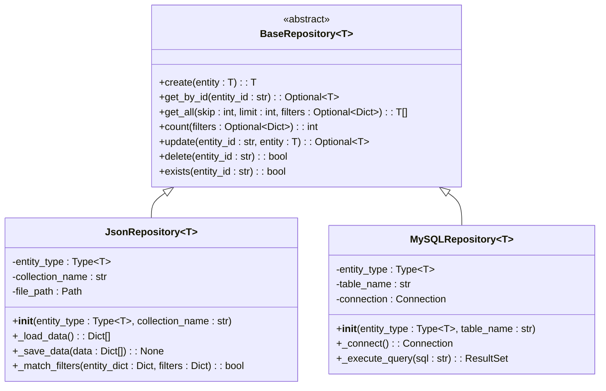

**Diagram sources**
- [base.py](file://backend/app/repositories/base.py#L14-L119)
- [json_repository.py](file://backend/app/repositories/json_repository.py#L16-L162)

**Section sources**
- [base.py](file://backend/app/repositories/base.py)
- [json_repository.py](file://backend/app/repositories/json_repository.py)

## 向量数据库与AI服务抽象

系统设计了对向量数据库和AI服务的抽象层，支持多种后端实现。

### 向量数据库抽象

通过`VECTOR_DB_TYPE`配置项，系统支持多种向量数据库：
- Qdrant
- Elasticsearch
- Milvus

### AI服务抽象

系统主要集成Ollama作为AI服务，通过`OLLAMA_BASE_URL`配置其服务地址，支持灵活的模型选择。

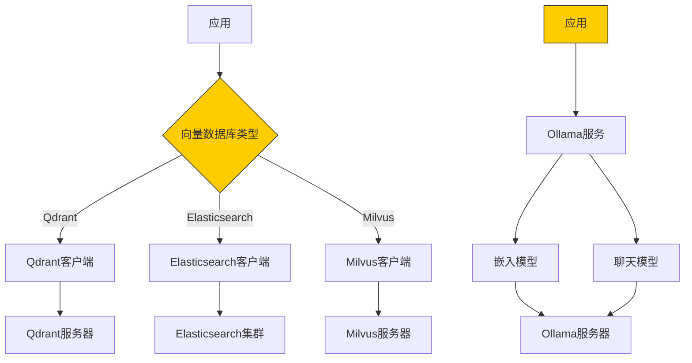

**Diagram sources**
- [config.py](file://backend/app/config.py#L55-L73)
- [knowledge_base.py](file://backend/app/models/knowledge_base.py#L18-L23)

**Section sources**
- [config.py](file://backend/app/config.py)
- [knowledge_base.py](file://backend/app/models/knowledge_base.py)

## 错误处理机制

系统实现了统一的异常处理机制，确保API返回一致的错误响应格式。

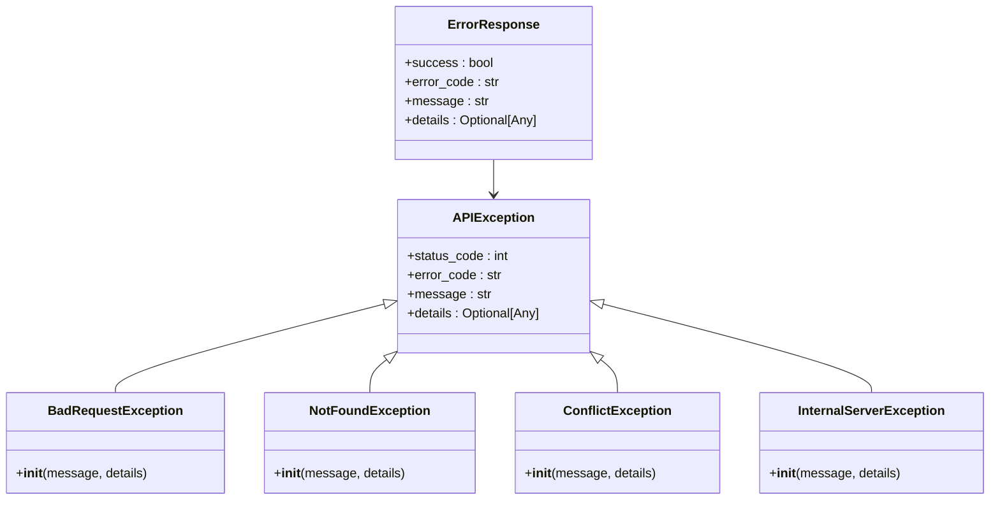

**Diagram sources**
- [exceptions.py](file://backend/app/core/exceptions.py#L12-L144)

**Section sources**
- [exceptions.py](file://backend/app/core/exceptions.py)

## 架构演进指导

### 扩展新功能

1. **添加新的业务领域**：
   - 在`controllers/`目录下创建新的控制器文件
   - 在`services/`目录下创建相应的服务类
   - 在`models/`目录下定义数据模型
   - 在`schemas/`目录下定义请求/响应模型

2. **添加新的存储后端**：
   - 在`repositories/`目录下创建新的仓储实现
   - 在`factory.py`中添加相应的工厂方法
   - 在`config.py`中添加相应的配置项

### 架构演进建议

1. **完善向量数据库集成**：
   - 实现Qdrant、Elasticsearch和Milvus的具体客户端
   - 在`KnowledgeBaseService`中实现向量索引的创建和管理

2. **增强错误处理**：
   - 添加更多特定业务异常
   - 实现错误日志的持久化存储

3. **性能优化**：
   - 为频繁查询添加缓存机制
   - 实现异步数据处理任务

4. **监控和可观测性**：
   - 集成Prometheus和Grafana进行监控
   - 实现分布式追踪

**Section sources**
- [main.py](file://backend/app/main.py)
- [config.py](file://backend/app/config.py)
- [middleware.py](file://backend/app/core/middleware.py)
- [factory.py](file://backend/app/repositories/factory.py)
- [knowledge_base.py](file://backend/app/controllers/knowledge_base.py)
- [knowledge_base.py](file://backend/app/services/knowledge_base.py)
- [base.py](file://backend/app/models/base.py)
- [base.py](file://backend/app/repositories/base.py)
- [exceptions.py](file://backend/app/core/exceptions.py)
- [knowledge_base_storage.py](file://backend/app/services/knowledge_base_storage.py)
- [json_repository.py](file://backend/app/repositories/json_repository.py)
- [run.py](file://backend/run.py)