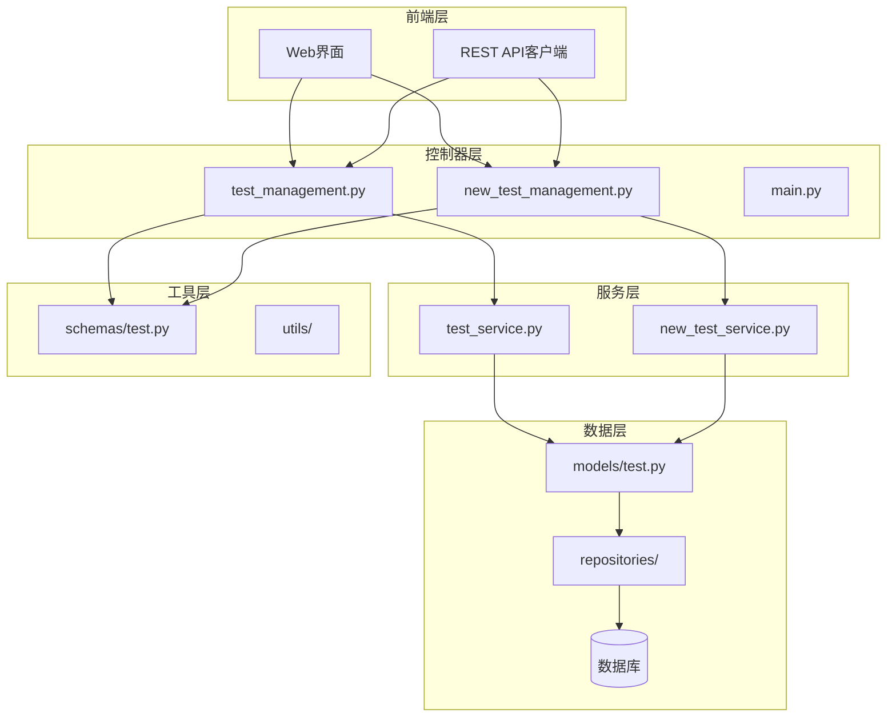
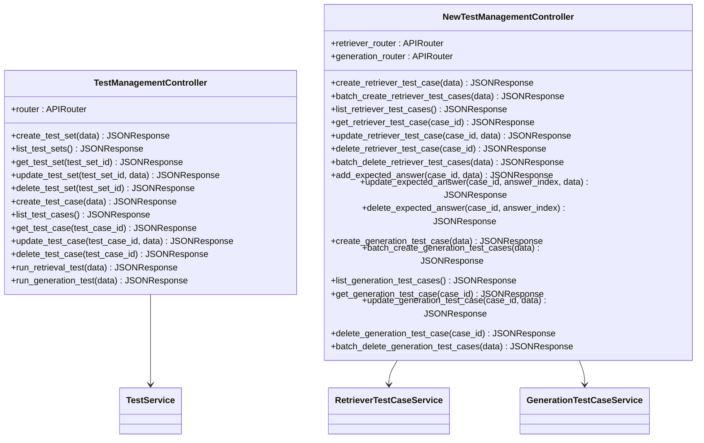
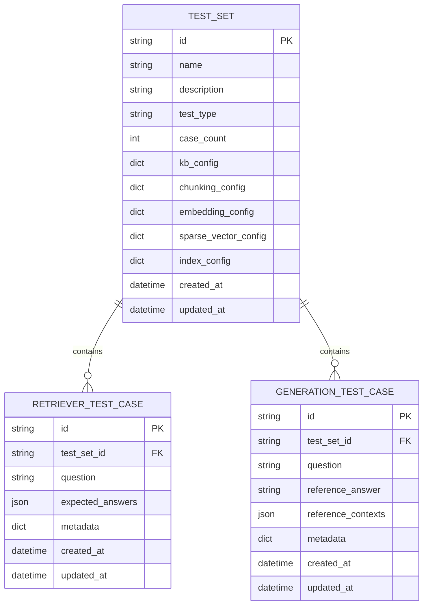
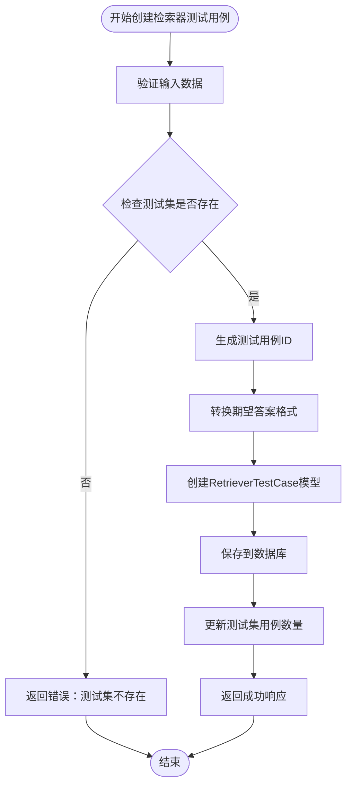
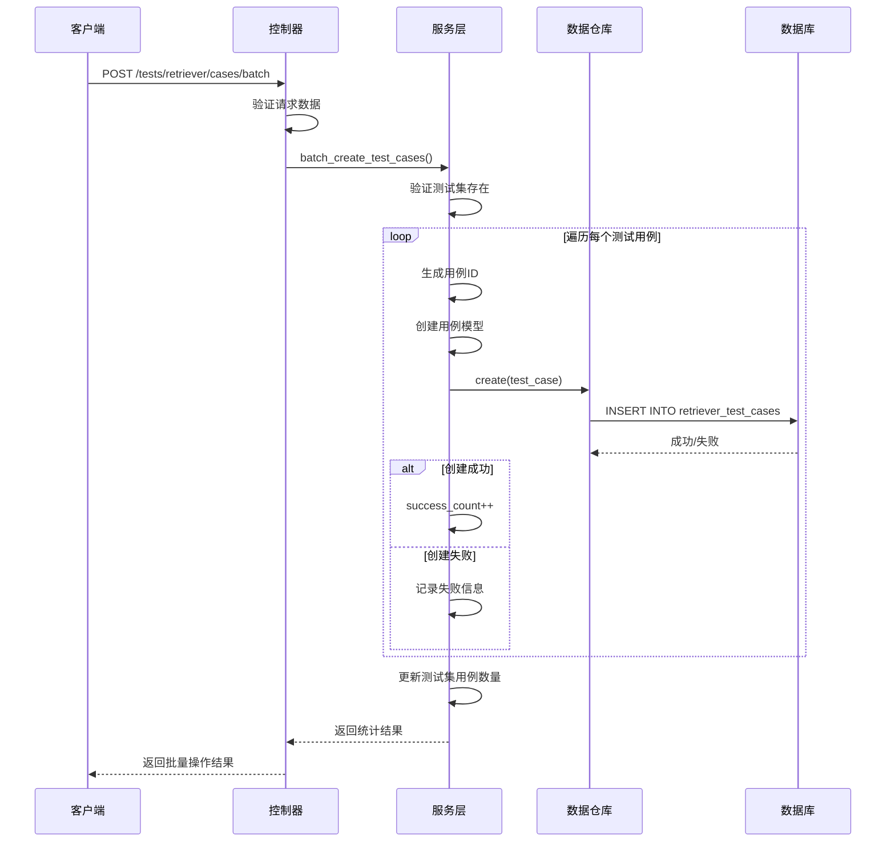
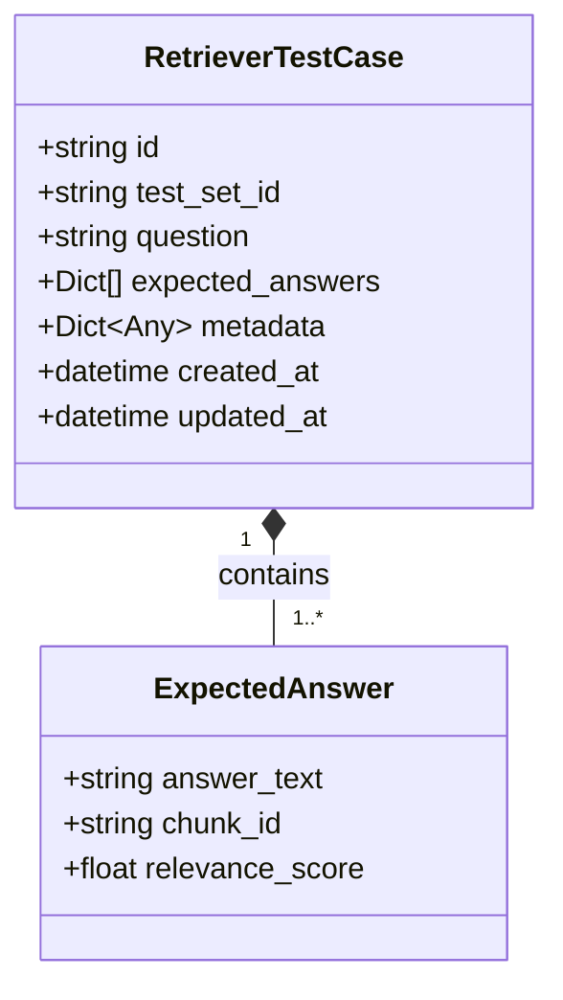
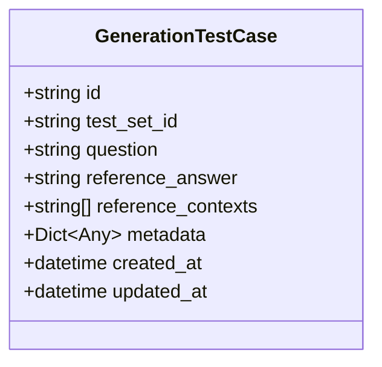
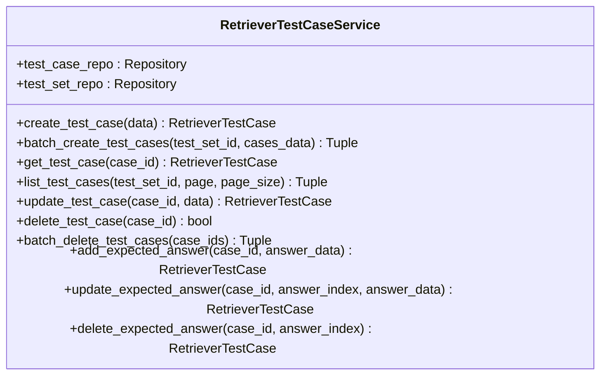
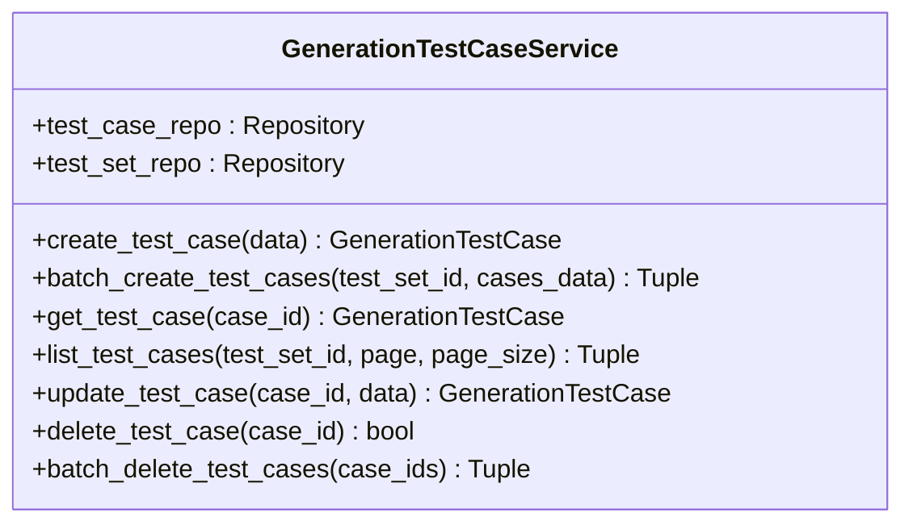
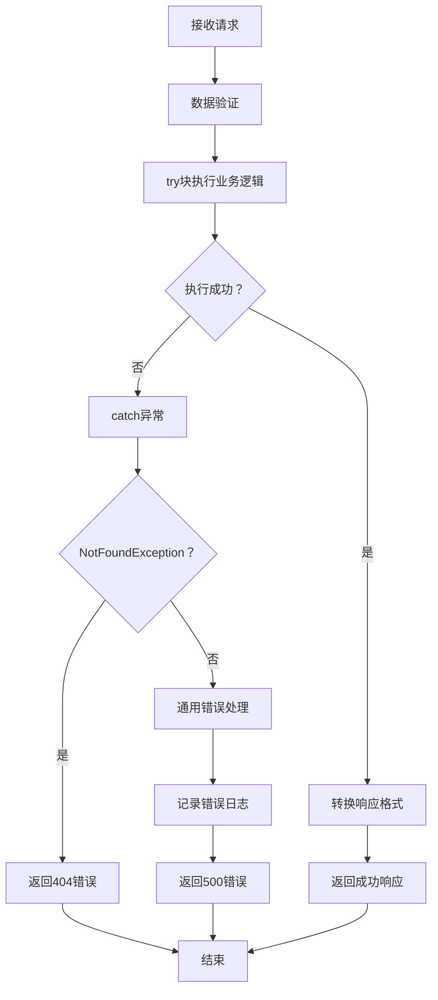

# Backend 控制器生成测试用例

<cite>
**本文档引用的文件**
- [backend/app/controllers/__init__.py](file://backend/app/controllers/__init__.py)
- [backend/app/controllers/test_management.py](file://backend/app/controllers/test_management.py)
- [backend/app/controllers/new_test_management.py](file://backend/app/controllers/new_test_management.py)
- [backend/app/main.py](file://backend/app/main.py)
- [backend/test_api.py](file://backend/test_api.py)
- [backend/test_new_api.py](file://backend/test_new_api.py)
- [backend/app/schemas/test.py](file://backend/app/schemas/test.py)
- [backend/app/services/test_service.py](file://backend/app/services/test_service.py)
- [backend/app/services/new_test_service.py](file://backend/app/services/new_test_service.py)
- [backend/app/models/test.py](file://backend/app/models/test.py)
</cite>

## 目录
1. [简介](#简介)
2. [项目架构概览](#项目架构概览)
3. [核心组件分析](#核心组件分析)
4. [测试用例生成流程](#测试用例生成流程)
5. [API 接口设计](#api-接口设计)
6. [数据模型与验证](#数据模型与验证)
7. [服务层实现](#服务层实现)
8. [控制器层实现](#控制器层实现)
9. [测试用例生成最佳实践](#测试用例生成最佳实践)
10. [故障排除指南](#故障排除指南)
11. [总结](#总结)

## 简介

本文档详细介绍了 RAG Studio 项目中后端控制器生成测试用例的完整实现。该项目是一个基于 FastAPI 的 RAG（检索增强生成）管理平台，提供了完整的测试用例生成功能，支持检索器测试用例和生成测试用例的创建、管理和批量操作。

系统采用 MVC 架构模式，通过清晰的分层设计实现了测试用例的高效管理。主要特性包括：
- 支持检索器测试用例和生成测试用例的独立管理
- 提供批量创建、更新、删除等完整 CRUD 操作
- 支持期望答案的动态管理（仅限检索器测试用例）
- 完整的错误处理和验证机制
- 异步任务处理和进度跟踪

## 项目架构概览



**图表来源**
- [backend/app/main.py](file://backend/app/main.py#L93-L107)
- [backend/app/controllers/__init__.py](file://backend/app/controllers/__init__.py#L6-L15)

**章节来源**
- [backend/app/main.py](file://backend/app/main.py#L1-L117)
- [backend/app/controllers/__init__.py](file://backend/app/controllers/__init__.py#L1-L16)

## 核心组件分析

### 控制器模块结构

系统包含两个主要的控制器模块，分别处理不同类型的测试用例：



**图表来源**
- [backend/app/controllers/test_management.py](file://backend/app/controllers/test_management.py#L33-L728)
- [backend/app/controllers/new_test_management.py](file://backend/app/controllers/new_test_management.py#L30-L651)

### 数据模型层次



**图表来源**
- [backend/app/models/test.py](file://backend/app/models/test.py#L27-L221)

**章节来源**
- [backend/app/controllers/test_management.py](file://backend/app/controllers/test_management.py#L1-L728)
- [backend/app/controllers/new_test_management.py](file://backend/app/controllers/new_test_management.py#L1-L651)
- [backend/app/models/test.py](file://backend/app/models/test.py#L1-L441)

## 测试用例生成流程

### 检索器测试用例生成流程



**图表来源**
- [backend/app/services/new_test_service.py](file://backend/app/services/new_test_service.py#L25-L66)

### 批量创建流程



**图表来源**
- [backend/app/controllers/new_test_management.py](file://backend/app/controllers/new_test_management.py#L74-L111)
- [backend/app/services/new_test_service.py](file://backend/app/services/new_test_service.py#L67-L123)

**章节来源**
- [backend/app/services/new_test_service.py](file://backend/app/services/new_test_service.py#L25-L123)
- [backend/app/controllers/new_test_management.py](file://backend/app/controllers/new_test_management.py#L37-L111)

## API 接口设计

### 检索器测试用例 API

| 方法 | 端点 | 描述 | 请求体 | 响应 |
|------|------|------|--------|------|
| POST | `/tests/retriever/cases` | 创建单个检索器测试用例 | RetrieverTestCaseCreate | JSONResponse |
| POST | `/tests/retriever/cases/batch` | 批量创建检索器测试用例 | RetrieverTestCaseBatchCreate | JSONResponse |
| GET | `/tests/retriever/cases` | 获取检索器测试用例列表 | Query参数 | JSONResponse |
| GET | `/tests/retriever/cases/{case_id}` | 获取单个测试用例详情 | Path参数 | JSONResponse |
| PUT | `/tests/retriever/cases/{case_id}` | 更新测试用例 | RetrieverTestCaseUpdate | JSONResponse |
| DELETE | `/tests/retriever/cases/{case_id}` | 删除测试用例 | Path参数 | JSONResponse |
| DELETE | `/tests/retriever/cases/batch` | 批量删除测试用例 | BatchDeleteRequest | JSONResponse |
| POST | `/tests/retriever/cases/{case_id}/answers` | 添加期望答案 | ExpectedAnswerCreate | JSONResponse |
| PUT | `/tests/retriever/cases/{case_id}/answers/{answer_index}` | 更新期望答案 | ExpectedAnswerCreate | JSONResponse |
| DELETE | `/tests/retriever/cases/{case_id}/answers/{answer_index}` | 删除期望答案 | Path参数 | JSONResponse |

### 生成测试用例 API

| 方法 | 端点 | 描述 | 请求体 | 响应 |
|------|------|------|--------|------|
| POST | `/tests/generation/cases` | 创建单个生成测试用例 | GenerationTestCaseCreate | JSONResponse |
| POST | `/tests/generation/cases/batch` | 批量创建生成测试用例 | GenerationTestCaseBatchCreate | JSONResponse |
| GET | `/tests/generation/cases` | 获取生成测试用例列表 | Query参数 | JSONResponse |
| GET | `/tests/generation/cases/{case_id}` | 获取单个测试用例详情 | Path参数 | JSONResponse |
| PUT | `/tests/generation/cases/{case_id}` | 更新测试用例 | GenerationTestCaseUpdate | JSONResponse |
| DELETE | `/tests/generation/cases/{case_id}` | 删除测试用例 | Path参数 | JSONResponse |
| DELETE | `/tests/generation/cases/batch` | 批量删除测试用例 | BatchDeleteRequest | JSONResponse |

**章节来源**
- [backend/app/controllers/new_test_management.py](file://backend/app/controllers/new_test_management.py#L37-L651)

## 数据模型与验证

### 检索器测试用例模型

检索器测试用例具有更复杂的数据结构，支持多个期望答案和详细的元数据：



**图表来源**
- [backend/app/models/test.py](file://backend/app/models/test.py#L163-L221)

### 生成测试用例模型

生成测试用例相对简单，专注于参考答案和上下文：



**图表来源**
- [backend/app/models/test.py](file://backend/app/models/test.py#L198-L221)

### Schema 验证规则

| 字段 | 类型 | 必填 | 验证规则 | 示例 |
|------|------|------|----------|------|
| question | string | 是 | min_length=1 | "Python中如何定义类？" |
| expected_answers | List | 是 | min_items=1 | [{"answer_text": "class关键字", "relevance_score": 1.0}] |
| reference_answer | string | 是 | min_length=1 | "使用class关键字..." |
| relevance_score | float | 是 | ge=0.0, le=1.0 | 1.0 |
| metadata | Dict | 否 | 任意键值对 | {"difficulty": "easy"} |

**章节来源**
- [backend/app/schemas/test.py](file://backend/app/schemas/test.py#L379-L612)
- [backend/app/models/test.py](file://backend/app/models/test.py#L163-L221)

## 服务层实现

### 检索器测试用例服务

检索器测试用例服务提供了完整的 CRUD 操作和高级功能：



**图表来源**
- [backend/app/services/new_test_service.py](file://backend/app/services/new_test_service.py#L25-L276)

### 生成测试用例服务

生成测试用例服务相对简洁，专注于基本的 CRUD 操作：



**图表来源**
- [backend/app/services/new_test_service.py](file://backend/app/services/new_test_service.py#L278-L437)

**章节来源**
- [backend/app/services/new_test_service.py](file://backend/app/services/new_test_service.py#L25-L437)

## 控制器层实现

### 错误处理机制

控制器层实现了统一的错误处理机制：



**图表来源**
- [backend/app/controllers/new_test_management.py](file://backend/app/controllers/new_test_management.py#L48-L71)

### 响应格式标准化

所有控制器方法都遵循统一的响应格式：

```python
# 成功响应格式
{
    "success": true,
    "data": {...},
    "message": "操作成功"
}

# 分页响应格式  
{
    "success": true,
    "data": [...],
    "total": 100,
    "page": 1,
    "page_size": 20,
    "message": "获取成功"
}

# 错误响应格式
{
    "success": false,
    "error": {
        "code": "NOT_FOUND",
        "message": "资源不存在"
    }
}
```

**章节来源**
- [backend/app/controllers/new_test_management.py](file://backend/app/controllers/new_test_management.py#L37-L651)

## 测试用例生成最佳实践

### 批量创建最佳实践

1. **数据验证**：确保每个测试用例的数据完整性
2. **错误隔离**：单个用例失败不影响其他用例的创建
3. **进度跟踪**：提供详细的统计信息
4. **性能优化**：批量操作比单个操作更高效

### 期望答案管理

对于检索器测试用例，建议：
1. 至少提供一个期望答案
2. 为每个答案指定合理的相关性分数
3. 关联正确的文档分块ID
4. 使用有意义的元数据标签

### 测试用例设计原则

1. **覆盖性**：涵盖不同的难度级别和场景
2. **准确性**：确保期望答案的正确性
3. **一致性**：保持问题格式的一致性
4. **可维护性**：使用清晰的命名和分类

**章节来源**
- [backend/test_new_api.py](file://backend/test_new_api.py#L1-L263)

## 故障排除指南

### 常见问题及解决方案

| 问题 | 可能原因 | 解决方案 |
|------|----------|----------|
| 测试集不存在 | 测试集ID错误或已被删除 | 检查测试集ID的有效性 |
| 批量创建失败 | 部分用例数据格式错误 | 检查单个用例的验证规则 |
| 期望答案添加失败 | 索引超出范围或数据格式错误 | 验证答案索引和数据格式 |
| 权限不足 | 用户无相应权限 | 检查用户权限设置 |

### 调试技巧

1. **启用详细日志**：设置日志级别为 DEBUG
2. **使用测试脚本**：参考 test_new_api.py 进行调试
3. **分步验证**：先单独测试单个操作
4. **检查依赖关系**：确保相关资源存在

### 性能优化建议

1. **合理设置分页大小**：避免一次性加载过多数据
2. **使用批量操作**：大量数据操作时使用批量API
3. **缓存频繁访问的数据**：如测试集列表
4. **监控数据库查询**：优化慢查询

**章节来源**
- [backend/test_new_api.py](file://backend/test_new_api.py#L210-L263)

## 总结

本文档全面介绍了 RAG Studio 项目中后端控制器生成测试用例的实现。系统采用了现代化的架构设计，通过清晰的分层结构实现了高效的测试用例管理功能。

### 主要特点

1. **双控制器架构**：分离检索器和生成测试用例的管理
2. **完整的 CRUD 操作**：支持所有基本的数据库操作
3. **批量处理能力**：提高大规模数据操作的效率
4. **灵活的期望答案管理**：支持检索器测试用例的复杂需求
5. **统一的错误处理**：提供一致的错误响应格式
6. **完善的验证机制**：确保数据的完整性和有效性

### 技术优势

- **异步处理**：充分利用 Python 的异步特性
- **类型安全**：使用 Pydantic 进行数据验证
- **模块化设计**：清晰的职责分离
- **可扩展性**：易于添加新的测试用例类型
- **测试友好**：提供完整的 API 测试脚本

该系统为 RAG 应用的测试和评估提供了强大的基础设施支持，能够满足各种复杂的测试场景需求。