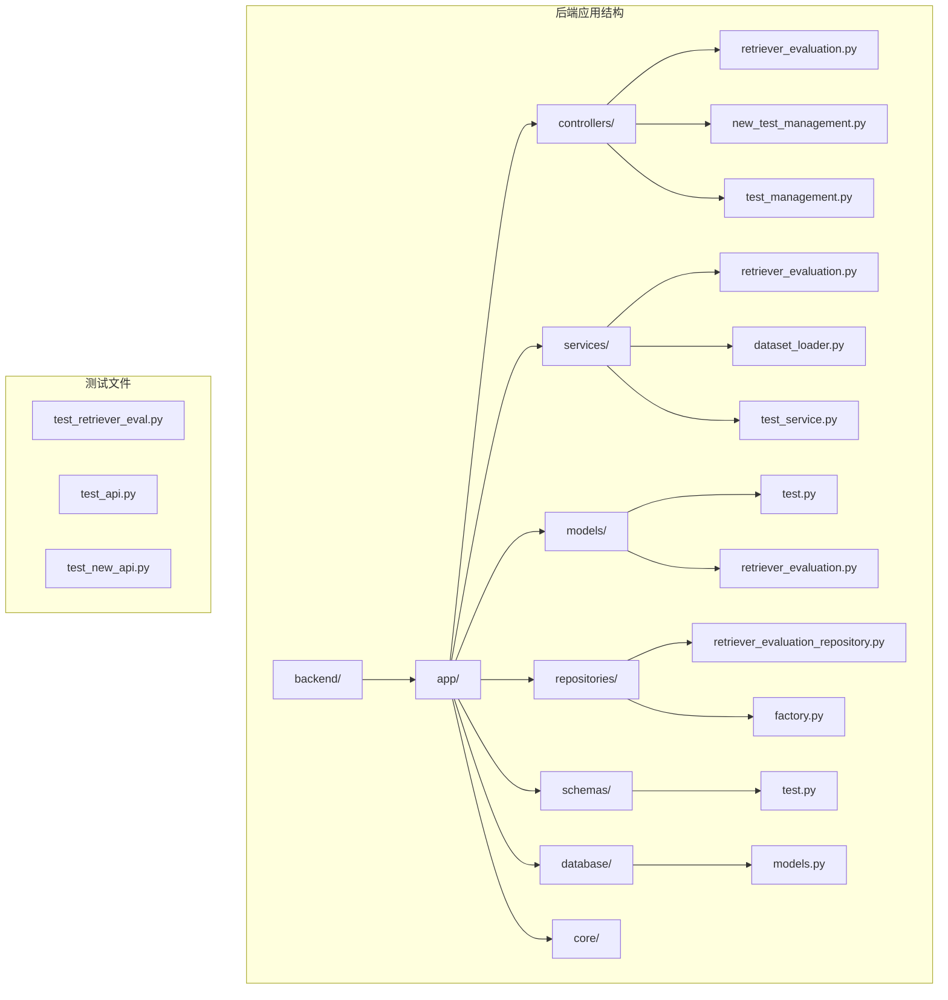
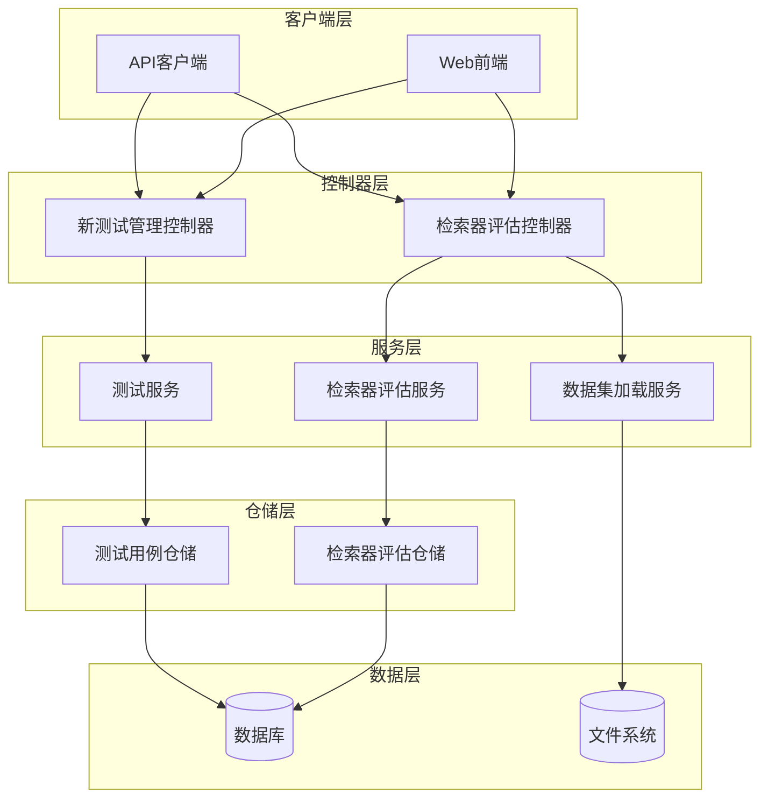
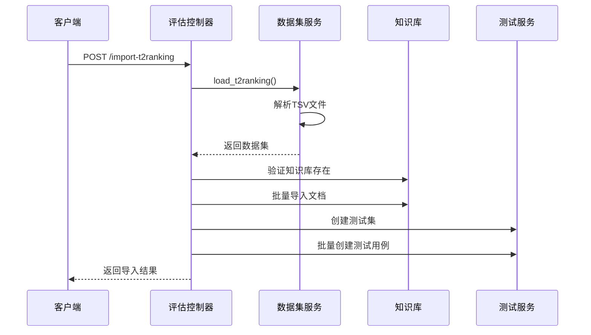
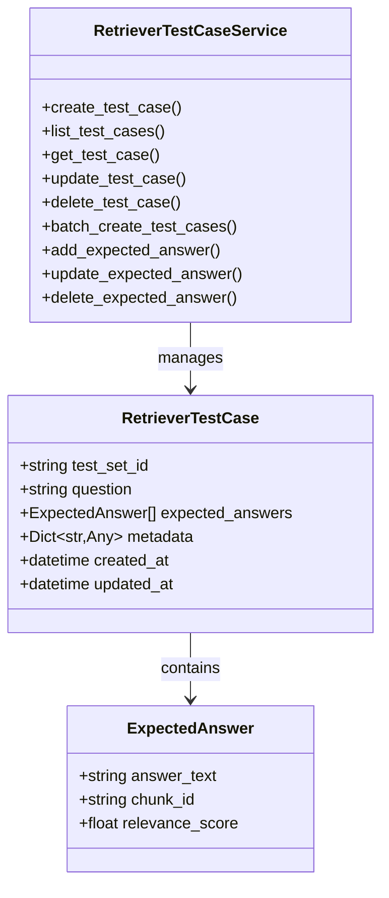
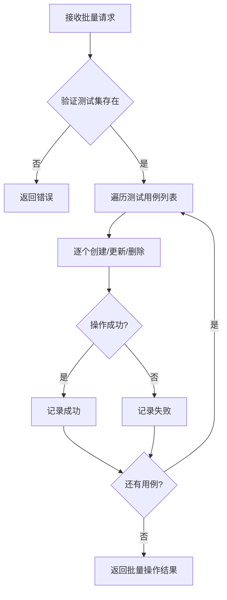
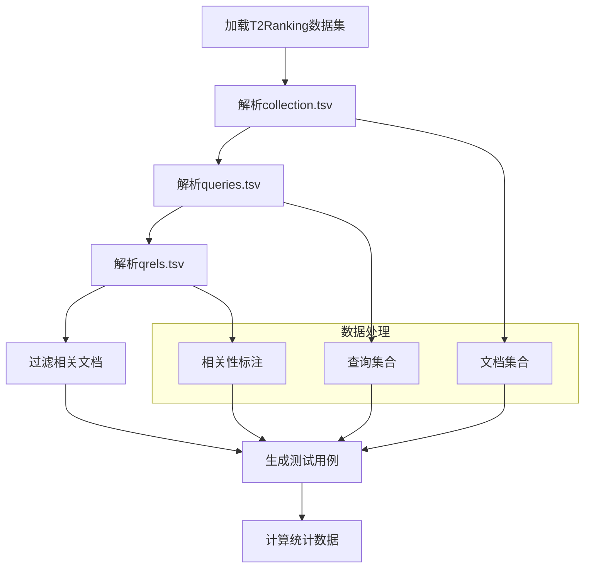
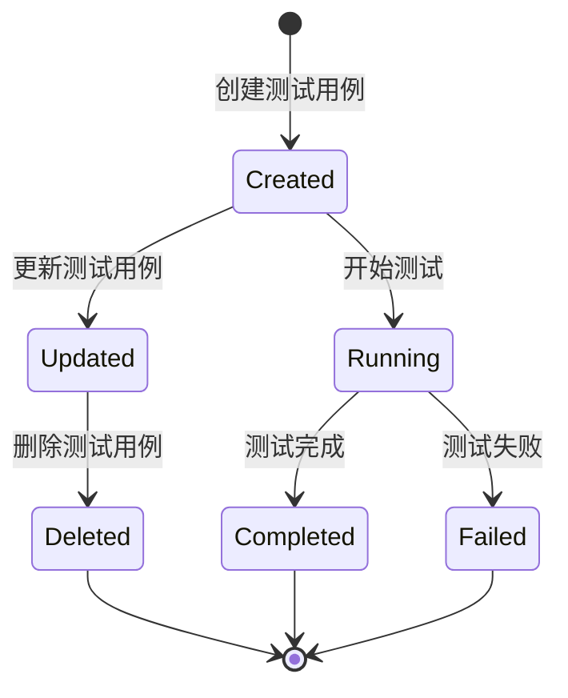
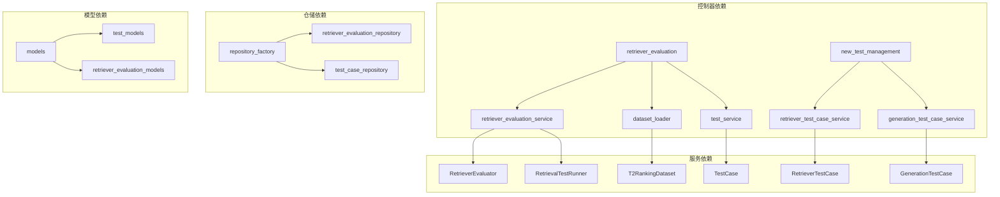

# Backend Controllers Retriever Test Case

<cite>
**Referenced Files in This Document**
- [test_retriever_eval.py](file://backend/test_retriever_eval.py)
- [retriever_evaluation.py](file://backend/app/controllers/retriever_evaluation.py)
- [retriever_evaluation.py](file://backend/app/services/retriever_evaluation.py)
- [dataset_loader.py](file://backend/app/services/dataset_loader.py)
- [test.py](file://backend/app/schemas/test.py)
- [test_service.py](file://backend/app/services/test_service.py)
- [new_test_management.py](file://backend/app/controllers/new_test_management.py)
- [test.py](file://backend/app/models/test.py)
- [retriever_evaluation_repository.py](file://backend/app/repositories/retriever_evaluation_repository.py)
</cite>

## 目录
1. [简介](#简介)
2. [项目结构](#项目结构)
3. [核心组件](#核心组件)
4. [架构概览](#架构概览)
5. [详细组件分析](#详细组件分析)
6. [依赖关系分析](#依赖关系分析)
7. [性能考虑](#性能考虑)
8. [故障排除指南](#故障排除指南)
9. [结论](#结论)

## 简介

本文档详细介绍了RAG Studio项目中后端控制器检索器测试用例系统的架构、实现和测试方法。该系统提供了完整的检索器评估功能，包括T2Ranking数据集的导入、测试用例的管理和检索器性能评估。

系统采用FastAPI框架构建，支持RESTful API接口，具备以下核心功能：
- T2Ranking数据集的导入和预处理
- 检索器测试用例的创建、管理和批量操作
- 检索器性能评估指标计算
- 评估结果的历史记录和对比分析

## 项目结构

**图表来源**
- [retriever_evaluation.py](file://backend/app/controllers/retriever_evaluation.py#L1-L375)
- [new_test_management.py](file://backend/app/controllers/new_test_management.py#L1-L651)
- [test_service.py](file://backend/app/services/test_service.py#L1-L352)

**章节来源**
- [retriever_evaluation.py](file://backend/app/controllers/retriever_evaluation.py#L1-L375)
- [new_test_management.py](file://backend/app/controllers/new_test_management.py#L1-L651)

## 核心组件

### 控制器层 (Controllers)

控制器层负责处理HTTP请求和响应，提供RESTful API接口。

#### 检索器评估控制器
- **功能**: 处理T2Ranking数据集导入、检索器评估和评估历史查询
- **主要接口**:
  - `/retriever-evaluation/import-t2ranking`: 导入T2Ranking数据集
  - `/retriever-evaluation/evaluate`: 执行检索器评估
  - `/retriever-evaluation/evaluation-history`: 获取评估历史

#### 新测试管理控制器
- **功能**: 独立的检索器和生成测试用例管理
- **主要接口**:
  - `/tests/retriever/cases`: 检索器测试用例的CRUD操作
  - `/tests/generation/cases`: 生成测试用例的CRUD操作

### 服务层 (Services)

服务层包含业务逻辑和核心算法实现。

#### 检索器评估服务
- **功能**: 实现检索器性能评估算法
- **核心类**:
  - `RetrieverEvaluator`: 评估器，计算各种检索指标
  - `RetrievalTestRunner`: 测试运行器，协调评估流程
  - `RAGASEvaluator`: 基于RAGAS框架的评估器

#### 数据集加载服务
- **功能**: 加载和处理T2Ranking数据集
- **核心类**: `T2RankingDataset`, `DatasetService`

### 模型层 (Models)

数据模型定义了系统中的实体结构。

#### 测试用例模型
- **RetrieverTestCase**: 检索器测试用例
- **GenerationTestCase**: 生成测试用例
- **ExpectedAnswer**: 期望答案

#### 评估结果模型
- **RetrieverEvaluationResult**: 检索器评估结果
- **GenerationEvaluationResult**: 生成评估结果

**章节来源**
- [retriever_evaluation.py](file://backend/app/services/retriever_evaluation.py#L1-L423)
- [dataset_loader.py](file://backend/app/services/dataset_loader.py#L1-L261)
- [test.py](file://backend/app/models/test.py#L1-L441)

## 架构概览

**图表来源**
- [retriever_evaluation.py](file://backend/app/controllers/retriever_evaluation.py#L23-L375)
- [new_test_management.py](file://backend/app/controllers/new_test_management.py#L31-L651)
- [test_service.py](file://backend/app/services/test_service.py#L24-L352)

## 详细组件分析

### 检索器评估控制器分析

#### 数据集导入功能

**图表来源**
- [retriever_evaluation.py](file://backend/app/controllers/retriever_evaluation.py#L26-L159)
- [dataset_loader.py](file://backend/app/services/dataset_loader.py#L193-L261)

#### 评估指标计算

系统实现了多种检索器评估指标：

| 指标名称 | 计算公式 | 描述 |
|---------|----------|------|
| Precision@K | | 检索到的相关文档数 / 检索到的文档总数 |
| Recall@K | | 检索到的相关文档数 / 真实相关文档总数 |
| F1-Score | | 2 × (Precision × Recall) / (Precision + Recall) |
| MRR | | 1 / 第一个相关文档的排名 |
| MAP | | 平均精度的平均值 |
| NDCG | | 归一化折损累积增益 |
| Hit Rate | | 是否检索到至少一个相关文档 |

**章节来源**
- [retriever_evaluation.py](file://backend/app/services/retriever_evaluation.py#L26-L423)

### 新测试管理控制器分析

#### 检索器测试用例管理

**图表来源**
- [new_test_management.py](file://backend/app/controllers/new_test_management.py#L37-L651)
- [test.py](file://backend/app/models/test.py#L163-L196)

#### 批量操作支持

系统支持批量创建、更新和删除测试用例：

**图表来源**
- [new_test_management.py](file://backend/app/controllers/new_test_management.py#L74-L111)
- [test_service.py](file://backend/app/services/test_service.py#L145-L200)

**章节来源**
- [new_test_management.py](file://backend/app/controllers/new_test_management.py#L37-L651)
- [test_service.py](file://backend/app/services/test_service.py#L145-L200)

### 数据集加载服务分析

#### T2Ranking数据集处理

**图表来源**
- [dataset_loader.py](file://backend/app/services/dataset_loader.py#L14-L167)

**章节来源**
- [dataset_loader.py](file://backend/app/services/dataset_loader.py#L14-L261)

### 测试服务分析

#### 测试用例生命周期管理

**图表来源**
- [test_service.py](file://backend/app/services/test_service.py#L24-L352)

**章节来源**
- [test_service.py](file://backend/app/services/test_service.py#L24-L352)

## 依赖关系分析

### 组件间依赖关系

**图表来源**
- [retriever_evaluation.py](file://backend/app/controllers/retriever_evaluation.py#L1-L20)
- [new_test_management.py](file://backend/app/controllers/new_test_management.py#L1-L26)
- [test_service.py](file://backend/app/services/test_service.py#L1-L20)

### 外部依赖

系统依赖以下外部组件：
- **FastAPI**: Web框架
- **Pydantic**: 数据验证
- **Pandas**: 数据处理
- **NumPy**: 数学计算
- **RAGAS**: RAG评估框架（待实现）

**章节来源**
- [retriever_evaluation.py](file://backend/app/controllers/retriever_evaluation.py#L1-L20)
- [test_service.py](file://backend/app/services/test_service.py#L1-L20)

## 性能考虑

### 大数据集处理优化

1. **采样机制**: 支持对大数据集进行采样，减少内存占用
2. **分页查询**: 测试用例列表支持分页，避免一次性加载过多数据
3. **异步处理**: 使用异步API提高并发处理能力
4. **缓存策略**: 对频繁访问的数据进行缓存

### 评估性能优化

1. **批量操作**: 支持批量创建和更新测试用例
2. **并行评估**: 可并行执行多个测试用例的评估
3. **增量更新**: 支持增量更新评估结果

## 故障排除指南

### 常见问题及解决方案

#### 数据集导入失败
- **问题**: T2Ranking文件格式不正确
- **解决方案**: 检查TSV文件格式，确保符合标准格式

#### 评估指标计算异常
- **问题**: 检索结果为空或格式不正确
- **解决方案**: 验证检索函数返回格式，确保包含必要的字段

#### 内存不足
- **问题**: 处理大数据集时内存溢出
- **解决方案**: 使用采样功能或增加系统内存

**章节来源**
- [test_retriever_eval.py](file://backend/test_retriever_eval.py#L1-L150)
- [retriever_evaluation.py](file://backend/app/controllers/retriever_evaluation.py#L154-L159)

### 测试用例管理故障排除

#### 批量操作失败
- **检查**: 验证测试集ID是否存在
- **检查**: 检查网络连接和数据库连接
- **检查**: 查看错误日志获取详细信息

#### 评估历史查询异常
- **问题**: 评估结果为空
- **解决方案**: 确认评估任务已完成且数据已正确保存

**章节来源**
- [new_test_management.py](file://backend/app/controllers/new_test_management.py#L74-L111)
- [retriever_evaluation.py](file://backend/app/controllers/retriever_evaluation.py#L297-L332)

## 结论

RAG Studio的后端控制器检索器测试用例系统提供了完整的检索器评估解决方案。系统采用模块化设计，具有良好的扩展性和维护性。主要特点包括：

1. **完整的评估体系**: 支持多种评估指标和数据集格式
2. **灵活的测试管理**: 提供丰富的CRUD操作和批量处理功能
3. **高性能设计**: 支持大数据集处理和异步操作
4. **易于扩展**: 清晰的架构设计便于添加新的评估指标和功能

该系统为RAG应用的开发和优化提供了强有力的支持，能够帮助开发者有效地评估和改进检索器性能。