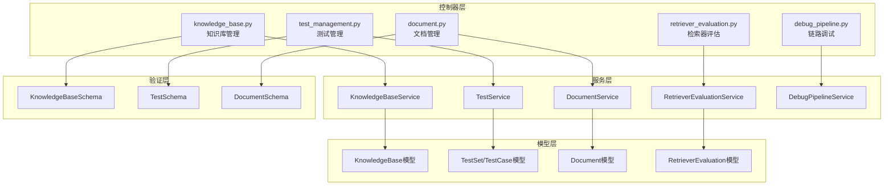
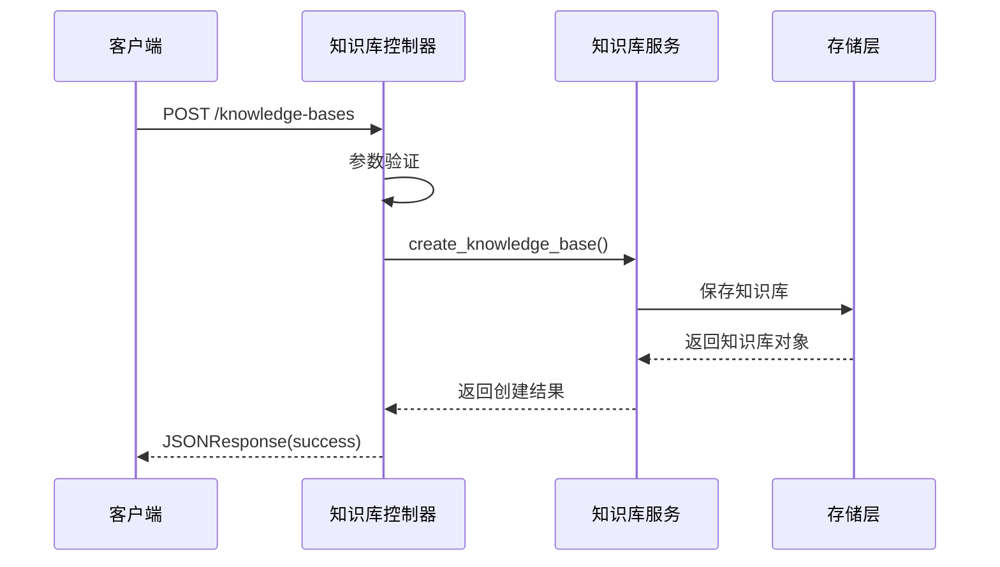
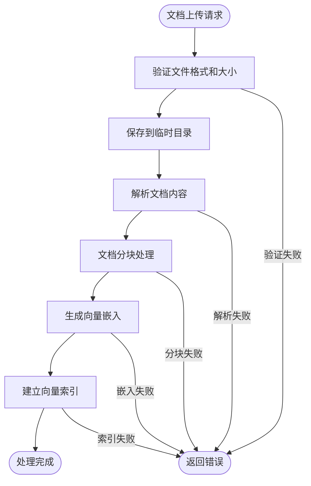
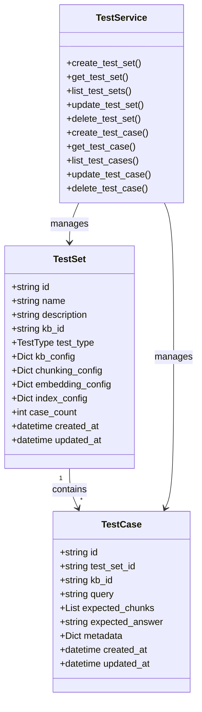
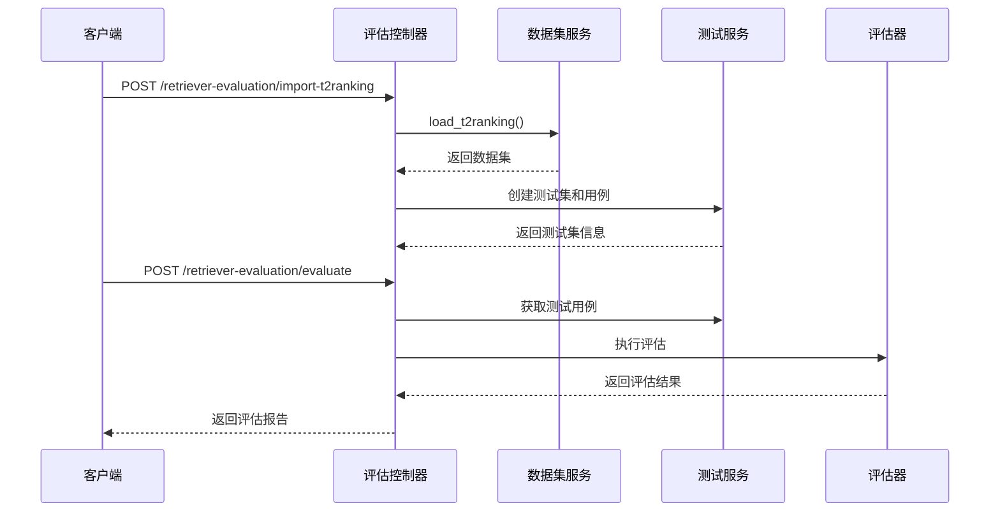
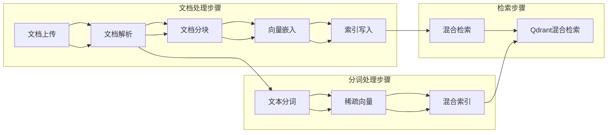
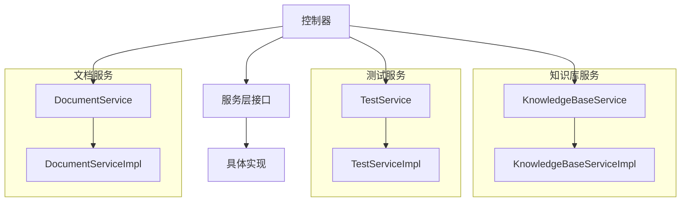
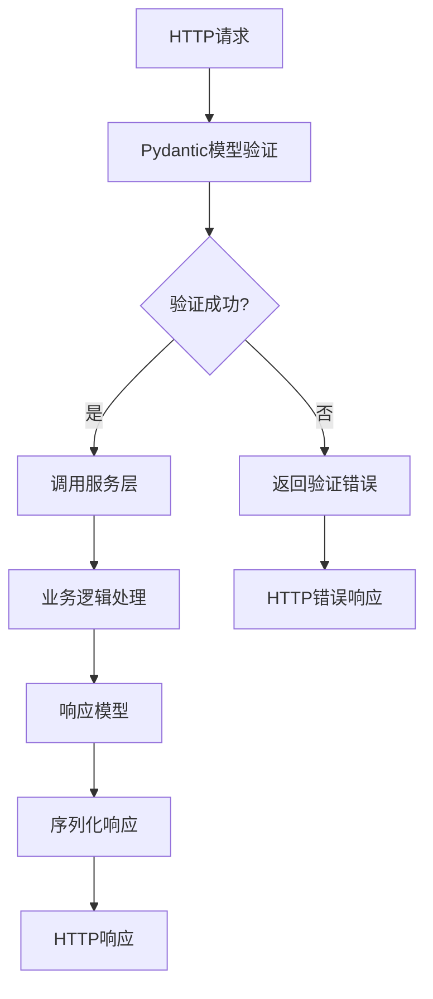
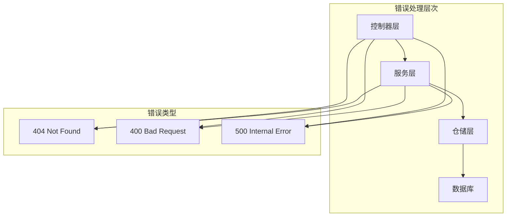
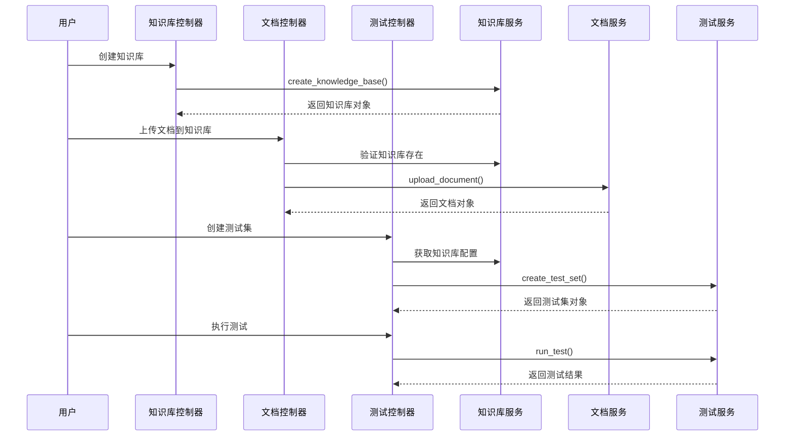

# 控制器层

<cite>
**本文档引用的文件**
- [knowledge_base.py](file://backend/app/controllers/knowledge_base.py)
- [document.py](file://backend/app/controllers/document.py)
- [test_management.py](file://backend/app/controllers/test_management.py)
- [retriever_evaluation.py](file://backend/app/controllers/retriever_evaluation.py)
- [debug_pipeline.py](file://backend/app/controllers/debug_pipeline.py)
- [knowledge_base.py](file://backend/app/schemas/knowledge_base.py)
- [document.py](file://backend/app/schemas/document.py)
- [test.py](file://backend/app/schemas/test.py)
- [knowledge_base.py](file://backend/app/services/knowledge_base.py)
- [test_service.py](file://backend/app/services/test_service.py)
</cite>

## 目录
1. [概述](#概述)
2. [控制器架构设计](#控制器架构设计)
3. [知识库管理控制器](#知识库管理控制器)
4. [文档管理控制器](#文档管理控制器)
5. [测试管理控制器](#测试管理控制器)
6. [检索器评估控制器](#检索器评估控制器)
7. [链路调试控制器](#链路调试控制器)
8. [依赖注入与服务层交互](#依赖注入与服务层交互)
9. [Pydantic模型验证](#pydantic模型验证)
10. [错误处理策略](#错误处理策略)
11. [API端点设计规范](#api端点设计规范)
12. [控制器协作关系](#控制器协作关系)

## 概述

RAG-Studio后端控制器层采用FastAPI框架构建，负责处理HTTP请求、参数验证、响应格式化和业务逻辑协调。控制器层作为系统的入口层，通过依赖注入调用服务层，使用Pydantic模型进行请求/响应数据校验，并遵循RESTful API设计原则。

控制器层包含五个核心模块：
- **knowledge_base.py**: 知识库的增删改查管理
- **document.py**: 文档上传、处理和状态查询
- **test_management.py**: 测试用例的生命周期管理
- **retriever_evaluation.py**: 检索器评估任务管理
- **debug_pipeline.py**: RAG链路调试功能

## 控制器架构设计

**图表来源**
- [knowledge_base.py](file://backend/app/controllers/knowledge_base.py#L1-L283)
- [test_management.py](file://backend/app/controllers/test_management.py#L1-L534)
- [document.py](file://backend/app/controllers/document.py#L1-L171)
- [retriever_evaluation.py](file://backend/app/controllers/retriever_evaluation.py#L1-L375)
- [debug_pipeline.py](file://backend/app/controllers/debug_pipeline.py#L1-L800)

## 知识库管理控制器

知识库管理控制器提供完整的知识库生命周期管理功能，包括创建、查询、更新、删除以及配置管理。

### 核心功能模块

#### 1. 知识库基础操作

**图表来源**
- [knowledge_base.py](file://backend/app/controllers/knowledge_base.py#L22-L44)

#### 2. 分页查询与筛选

控制器支持带分页和条件筛选的知识库列表查询：

| 参数 | 类型 | 必需 | 描述 |
|------|------|------|------|
| page | int | 否 | 页码，默认为1 |
| page_size | int | 否 | 每页大小，默认20，范围1-100 |
| is_active | bool | 否 | 是否激活状态筛选 |

#### 3. 知识库配置管理

提供详细的配置信息获取接口，包括嵌入模型、向量数据库、分块策略等配置。

**章节来源**
- [knowledge_base.py](file://backend/app/controllers/knowledge_base.py#L148-L282)

## 文档管理控制器

文档管理控制器负责处理文档的上传、处理、状态查询和分块管理。

### 文档处理流程

**图表来源**
- [document.py](file://backend/app/controllers/document.py#L20-L171)

### 支持的文档格式

控制器支持多种文档格式的上传和处理：
- **文本文件**: txt, md
- **办公文档**: docx, pdf
- **网页内容**: html
- **结构化数据**: json

**章节来源**
- [document.py](file://backend/app/controllers/document.py#L20-L171)

## 测试管理控制器

测试管理控制器提供完整的测试用例生命周期管理，包括测试集和测试用例的CRUD操作。

### 测试管理架构

**图表来源**
- [test_management.py](file://backend/app/controllers/test_management.py#L1-L534)
- [test_service.py](file://backend/app/services/test_service.py#L1-L200)

### 测试类型支持

控制器支持两种主要的测试类型：
- **检索测试 (retrieval)**: 验证文档检索准确性
- **生成测试 (generation)**: 验证问答生成质量

**章节来源**
- [test_management.py](file://backend/app/controllers/test_management.py#L30-L534)

## 检索器评估控制器

检索器评估控制器提供基于标准数据集的检索器性能评估功能。

### 评估工作流

**图表来源**
- [retriever_evaluation.py](file://backend/app/controllers/retriever_evaluation.py#L26-L375)

### 支持的评估指标

评估控制器支持多种检索器评估指标：

| 指标名称 | 描述 | 计算方式 |
|----------|------|----------|
| Precision@K | 精确率 | 检索到的相关文档数 / 总检索结果数 |
| Recall@K | 召回率 | 检索到的相关文档数 / 测试用例期望的相关文档数 |
| F1-Score | F1分数 | 2 × (Precision × Recall) / (Precision + Recall) |
| MRR | 平均倒数排名 | 1/N × Σ(1/rank_i) |
| MAP | 平均精度均值 | 1/N × Σ(Precision@k) |
| NDCG | 归一化折损累积增益 | 归一化后的DCG值 |
| Hit Rate | 命中率 | 检索到至少一个相关文档的查询比例 |

**章节来源**
- [retriever_evaluation.py](file://backend/app/controllers/retriever_evaluation.py#L197-L375)

## 链路调试控制器

链路调试控制器提供可视化的RAG系统调试功能，支持文档处理全流程的步骤化调试。

### 调试流水线

**图表来源**
- [debug_pipeline.py](file://backend/app/controllers/debug_pipeline.py#L1-L800)

### 调试功能模块

控制器提供以下调试功能：

#### 1. 文档处理调试
- **文档上传**: 支持多种格式的文档上传
- **内容解析**: 提供文档内容的解析结果
- **分块处理**: 可视化文档分块效果
- **向量嵌入**: 显示文本向量化的中间结果

#### 2. 索引构建调试
- **向量索引**: 支持稠密向量索引写入
- **稀疏向量索引**: 支持稀疏向量索引写入
- **混合索引**: 支持稠密+稀疏向量混合索引

#### 3. 检索调试
- **混合检索**: 支持向量和关键词混合检索
- **Qdrant检索**: 专门针对Qdrant数据库的检索功能

**章节来源**
- [debug_pipeline.py](file://backend/app/controllers/debug_pipeline.py#L1-L800)

## 依赖注入与服务层交互

控制器层通过依赖注入的方式调用服务层，实现关注点分离和代码复用。

### 依赖注入模式

**图表来源**
- [knowledge_base.py](file://backend/app/controllers/knowledge_base.py#L34-L37)
- [test_management.py](file://backend/app/controllers/test_management.py#L44-L47)
- [document.py](file://backend/app/controllers/document.py#L34-L37)

### 服务层调用示例

控制器通过以下模式调用服务层：

1. **创建服务实例**: 在每个API处理函数中创建服务实例
2. **调用业务方法**: 调用对应的服务方法处理业务逻辑
3. **异常处理**: 捕获并处理服务层抛出的异常
4. **结果转换**: 将服务层返回的对象转换为响应格式

**章节来源**
- [knowledge_base.py](file://backend/app/controllers/knowledge_base.py#L34-L44)
- [test_management.py](file://backend/app/controllers/test_management.py#L44-L78)

## Pydantic模型验证

控制器层使用Pydantic模型进行请求和响应的数据验证，确保数据的完整性和正确性。

### 验证机制

**图表来源**
- [knowledge_base.py](file://backend/app/controllers/knowledge_base.py#L10-L16)
- [test.py](file://backend/app/schemas/test.py#L1-L50)

### 主要验证规则

#### 1. 知识库创建验证
- **名称长度**: 1-100字符
- **描述长度**: 最大500字符
- **分块大小**: 100-2000字符
- **重叠大小**: 0-500字符
- **检索数量**: 1-50个

#### 2. 测试用例验证
- **查询文本**: 非空且最小长度1字符
- **期望分块**: 列表形式，可为空
- **元数据**: 字典形式，可为空

#### 3. 评估参数验证
- **Top-K值**: 1-100范围内
- **分数阈值**: 0.0-1.0范围内
- **模型参数**: 符合特定格式要求

**章节来源**
- [knowledge_base.py](file://backend/app/schemas/knowledge_base.py#L11-L52)
- [test.py](file://backend/app/schemas/test.py#L70-L100)

## 错误处理策略

控制器层实现了统一的错误处理机制，确保API的健壮性和用户体验。

### 错误处理层次

**图表来源**
- [test_management.py](file://backend/app/controllers/test_management.py#L69-L79)
- [retriever_evaluation.py](file://backend/app/controllers/retriever_evaluation.py#L154-L158)

### 错误处理模式

#### 1. 参数验证错误
- **状态码**: 400 Bad Request
- **消息格式**: 包含具体的验证失败原因
- **示例**: "知识库ID不能为空"

#### 2. 资源不存在错误
- **状态码**: 404 Not Found
- **消息格式**: "资源不存在: {resource_id}"
- **示例**: "知识库不存在: kb_001"

#### 3. 业务逻辑错误
- **状态码**: 400/500根据具体情况
- **消息格式**: 详细的业务错误描述
- **示例**: "文档处理失败: 文件格式不支持"

#### 4. 系统内部错误
- **状态码**: 500 Internal Server Error
- **消息格式**: "服务器内部错误: {错误详情}"
- **日志记录**: 记录完整的错误堆栈信息

**章节来源**
- [test_management.py](file://backend/app/controllers/test_management.py#L69-L79)
- [retriever_evaluation.py](file://backend/app/controllers/retriever_evaluation.py#L154-L158)

## API端点设计规范

控制器层遵循RESTful API设计原则，提供一致的端点设计规范。

### 端点设计原则

#### 1. 资源命名规范
- **单数名词**: 使用单数形式表示资源，如 `/knowledge-bases`
- **层级结构**: 使用斜杠分隔资源层级，如 `/documents/{id}/chunks`
- **动词避免**: 避免在URL中使用动词，使用HTTP方法表达动作

#### 2. HTTP方法选择
- **GET**: 获取资源列表或单个资源详情
- **POST**: 创建新资源
- **PUT**: 更新整个资源
- **PATCH**: 更新资源的部分属性
- **DELETE**: 删除资源

#### 3. 状态码使用
- **200 OK**: 请求成功，返回数据
- **201 Created**: 资源创建成功
- **204 No Content**: 操作成功但无返回数据
- **400 Bad Request**: 请求参数错误
- **404 Not Found**: 资源不存在
- **500 Internal Server Error**: 服务器内部错误

### 端点示例

#### 知识库管理端点
| 方法 | URL | 描述 |
|------|-----|------|
| GET | `/knowledge-bases` | 获取知识库列表 |
| POST | `/knowledge-bases` | 创建新知识库 |
| GET | `/knowledge-bases/{kb_id}` | 获取知识库详情 |
| PUT | `/knowledge-bases/{kb_id}` | 更新知识库配置 |
| DELETE | `/knowledge-bases/{kb_id}` | 删除知识库 |
| GET | `/knowledge-bases/{kb_id}/config` | 获取知识库配置 |
| GET | `/knowledge-bases/{kb_id}/stats` | 获取知识库统计信息 |

#### 测试管理端点
| 方法 | URL | 描述 |
|------|-----|------|
| GET | `/tests/test-sets` | 获取测试集列表 |
| POST | `/tests/test-sets` | 创建测试集 |
| GET | `/tests/test-sets/{test_set_id}` | 获取测试集详情 |
| PUT | `/tests/test-sets/{test_set_id}` | 更新测试集 |
| DELETE | `/tests/test-sets/{test_set_id}` | 删除测试集 |
| GET | `/tests/test-cases` | 获取测试用例列表 |
| POST | `/tests/test-cases` | 创建测试用例 |
| GET | `/tests/retrieval/run` | 执行检索测试 |
| GET | `/tests/generation/run` | 执行生成测试 |

**章节来源**
- [knowledge_base.py](file://backend/app/controllers/knowledge_base.py#L19-L282)
- [test_management.py](file://backend/app/controllers/test_management.py#L27-L534)

## 控制器协作关系

各控制器之间通过共享的服务层和数据模型实现协作，形成完整的RAG系统功能链。

### 控制器间协作流程

**图表来源**
- [knowledge_base.py](file://backend/app/controllers/knowledge_base.py#L34-L37)
- [test_management.py](file://backend/app/controllers/test_management.py#L44-L47)

### 数据流转关系

#### 1. 知识库 → 文档 → 测试
- **知识库**: 提供存储环境和配置
- **文档**: 提供数据源和处理能力
- **测试**: 基于知识库和文档进行质量验证

#### 2. 知识库 → 检索器评估 → 结果分析
- **知识库**: 提供评估的基础环境
- **评估控制器**: 执行标准化评估流程
- **结果分析**: 生成性能报告和对比数据

#### 3. 链路调试 → 全流程验证
- **调试控制器**: 提供可视化的调试界面
- **各控制器**: 通过调试接口验证各自功能
- **结果反馈**: 为系统优化提供数据支持

**章节来源**
- [knowledge_base.py](file://backend/app/controllers/knowledge_base.py#L34-L44)
- [test_management.py](file://backend/app/controllers/test_management.py#L44-L78)
- [retriever_evaluation.py](file://backend/app/controllers/retriever_evaluation.py#L47-L92)

## 总结

RAG-Studio后端控制器层通过模块化设计实现了清晰的功能划分和良好的可维护性。每个控制器专注于特定的业务领域，通过统一的错误处理机制和数据验证体系确保了系统的稳定性和可靠性。依赖注入模式的应用使得控制器层能够灵活地调用服务层，而Pydantic模型的使用保证了数据的一致性和安全性。

控制器层作为系统的入口层，不仅提供了完整的API接口，还通过链路调试功能为开发者提供了强大的开发和调试工具。各控制器之间的协作关系形成了一个完整的RAG系统功能链，从知识库管理到文档处理，再到测试验证和性能评估，覆盖了RAG应用开发的各个环节。