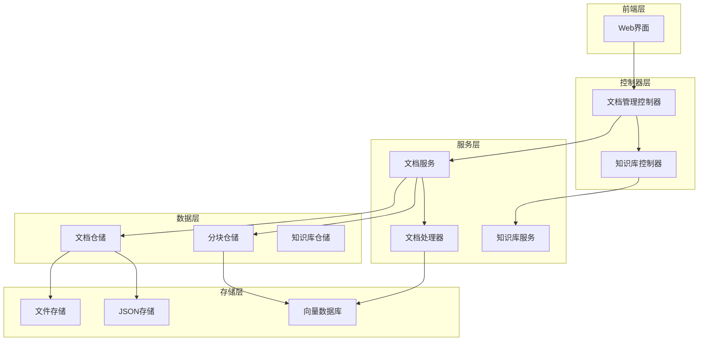
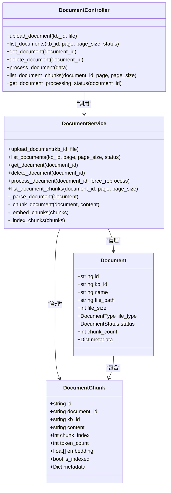
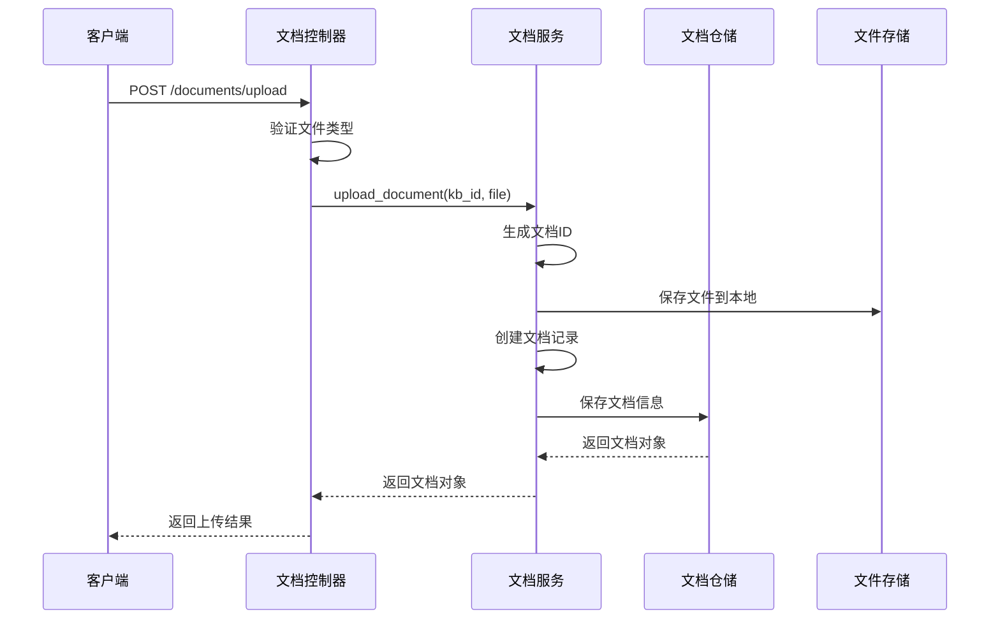
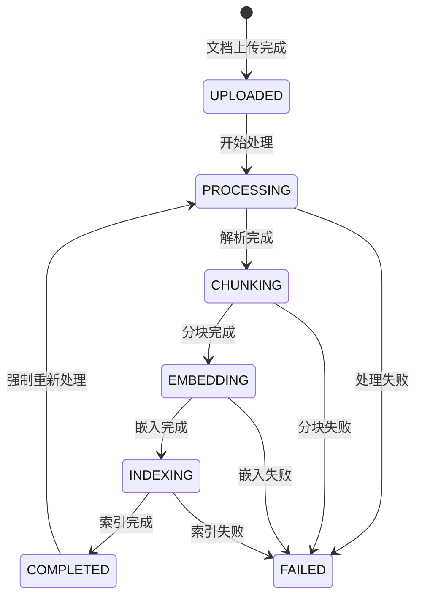
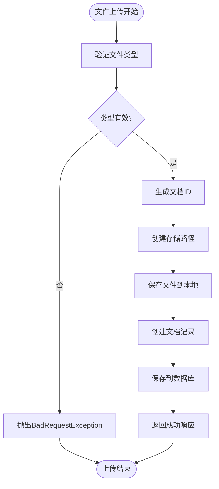
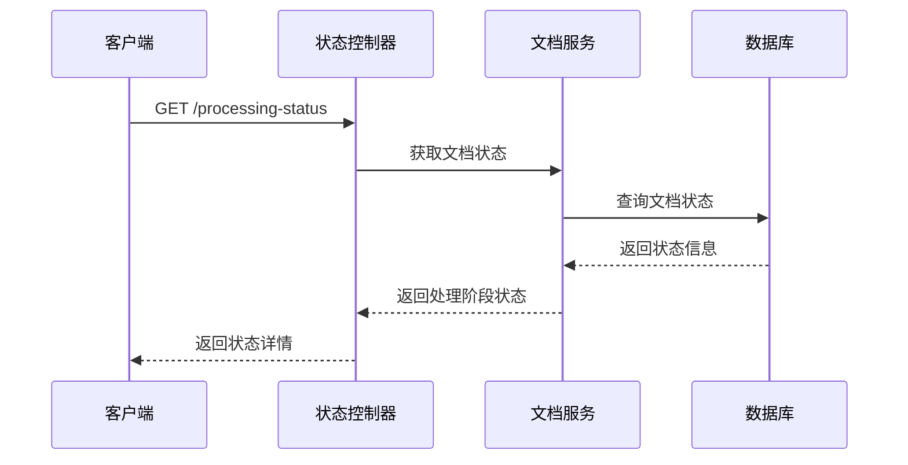
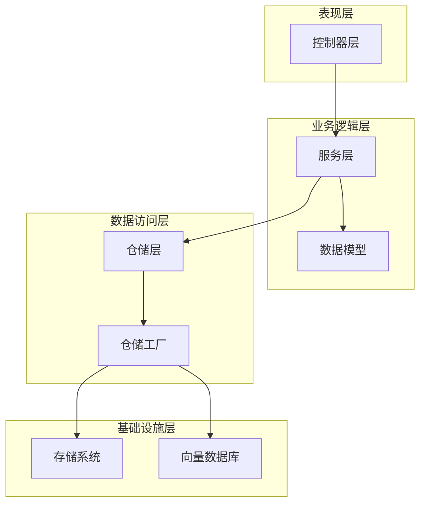

# 文档管理控制器技术文档

<cite>
**本文档引用的文件**
- [document.py](file://backend/app/controllers/document.py)
- [document.py](file://backend/app/services/document.py)
- [document.py](file://backend/app/models/document.py)
- [document.py](file://backend/app/schemas/document.py)
- [factory.py](file://backend/app/repositories/factory.py)
- [response.py](file://backend/app/core/response.py)
- [exceptions.py](file://backend/app/core/exceptions.py)
- [main.py](file://backend/app/main.py)
</cite>

## 目录
1. [概述](#概述)
2. [项目架构](#项目架构)
3. [核心组件分析](#核心组件分析)
4. [API端点详细分析](#api端点详细分析)
5. [数据模型与Schema](#数据模型与schema)
6. [文件上传处理机制](#文件上传处理机制)
7. [文档状态机设计](#文档状态机设计)
8. [依赖关系分析](#依赖关系分析)
9. [性能考虑](#性能考虑)
10. [故障排除指南](#故障排除指南)
11. [总结](#总结)

## 概述

文档管理控制器是RAG（检索增强生成）系统的核心组件之一，负责处理文档的全生命周期管理。该控制器提供了完整的RESTful API接口，支持文档上传、查询、处理、删除等操作，并与文档服务层紧密协作，实现了从文件上传到向量索引的完整流水线。

### 主要功能特性

- **多格式文件上传**：支持txt、pdf、docx、md、html、json等多种文档格式
- **分页查询**：提供知识库级别的文档列表查询和分块列表查询
- **状态监控**：实时跟踪文档处理状态，支持链路排查
- **级联删除**：删除文档时自动清理关联的分块和索引数据
- **异步处理**：采用异步架构处理耗时的文档解析、分块、嵌入和索引操作

## 项目架构

**图表来源**
- [document.py](file://backend/app/controllers/document.py#L1-L171)
- [document.py](file://backend/app/services/document.py#L1-L272)
- [factory.py](file://backend/app/repositories/factory.py#L1-L116)

## 核心组件分析

### 控制器层架构

文档管理控制器采用FastAPI框架构建，继承了现代Web框架的最佳实践：

**图表来源**
- [document.py](file://backend/app/controllers/document.py#L17-L171)
- [document.py](file://backend/app/services/document.py#L16-L272)
- [document.py](file://backend/app/models/document.py#L34-L116)

**章节来源**
- [document.py](file://backend/app/controllers/document.py#L1-L171)
- [document.py](file://backend/app/services/document.py#L1-L272)

## API端点详细分析

### 1. 上传文档 (POST /documents/upload)

**功能描述**：上传文档到指定知识库，支持多种文件格式。

**请求参数**：
- `kb_id` (Form): 知识库ID，必填
- `file` (File): 上传的文档文件，必填

**支持的文件格式**：txt, pdf, docx, md, html, json

**实现流程**：

**图表来源**
- [document.py](file://backend/app/controllers/document.py#L20-L44)
- [document.py](file://backend/app/services/document.py#L23-L72)

**章节来源**
- [document.py](file://backend/app/controllers/document.py#L20-L44)

### 2. 获取文档列表 (GET /documents)

**功能描述**：按知识库ID分页查询文档列表，支持状态筛选。

**请求参数**：
- `kb_id` (Query): 知识库ID，必填
- `page` (Query): 页码，默认为1
- `page_size` (Query): 每页大小，默认为20，范围1-100
- `status` (Query): 文档状态筛选条件

**响应结构**：
- 分页数据包含文档列表和总数信息
- 支持按状态过滤文档

**章节来源**
- [document.py](file://backend/app/controllers/document.py#L47-L70)

### 3. 获取文档详情 (GET /documents/{document_id})

**功能描述**：根据文档ID获取详细的文档信息。

**请求参数**：
- `document_id` (Path): 文档唯一标识符

**响应内容**：
- 文档的基本信息、处理状态、元数据等
- 包含错误信息和处理进度

**章节来源**
- [document.py](file://backend/app/controllers/document.py#L73-L86)

### 4. 删除文档 (DELETE /documents/{document_id})

**功能描述**：删除指定文档及其所有关联数据。

**请求参数**：
- `document_id` (Path): 文档唯一标识符

**删除范围**：
- 文档记录
- 所有文档分块
- 向量数据库中的索引

**章节来源**
- [document.py](file://backend/app/controllers/document.py#L89-L103)

### 5. 处理文档 (POST /documents/process)

**功能描述**：触发文档处理流水线，执行解析、分块、嵌入和索引操作。

**请求参数**：
- `document_id` (Body): 文档ID
- `force_reprocess` (Body): 是否强制重新处理，默认false

**处理流程**：
1. 验证文档存在性
2. 更新文档状态为"处理中"
3. 异步执行处理流水线
4. 更新最终处理状态

**章节来源**
- [document.py](file://backend/app/controllers/document.py#L106-L119)

### 6. 获取文档分块列表 (GET /documents/{document_id}/chunks)

**功能描述**：获取文档的所有分块信息，支持分页查询。

**请求参数**：
- `document_id` (Path): 文档ID
- `page` (Query): 页码，默认为1
- `page_size` (Query): 每页大小，默认为20

**响应内容**：
- 分块列表和总数
- 每个分块包含内容、索引、向量信息

**章节来源**
- [document.py](file://backend/app/controllers/document.py#L122-L143)

### 7. 获取文档处理状态 (GET /documents/{document_id}/processing-status)

**功能描述**：获取文档处理状态，用于链路排查和进度监控。

**请求参数**：
- `document_id` (Path): 文档ID

**状态信息**：
- 整体处理状态
- 各个处理阶段的状态和进度
- 支持的处理阶段：解析、分块、嵌入、索引

**章节来源**
- [document.py](file://backend/app/controllers/document.py#L146-L169)

## 数据模型与Schema

### 文档状态枚举

**图表来源**
- [document.py](file://backend/app/models/document.py#L12-L21)

### Pydantic Schema定义

控制器使用多个Pydantic模型来定义请求和响应的数据结构：

| Schema名称 | 用途 | 主要字段 |
|-----------|------|----------|
| DocumentUploadResponse | 文档上传响应 | id, kb_id, name, file_path, file_size, file_type, status, created_at |
| DocumentResponse | 文档详情响应 | id, kb_id, name, file_path, file_size, file_type, status, error_message, chunk_count, metadata, created_at, updated_at |
| DocumentChunkResponse | 文档分块响应 | id, document_id, kb_id, content, chunk_index, token_count, is_indexed, metadata, created_at |
| DocumentProcessRequest | 文档处理请求 | document_id, force_reprocess |

**章节来源**
- [document.py](file://backend/app/schemas/document.py#L1-L70)

## 文件上传处理机制

### 多部分表单数据解析

文件上传采用FastAPI的`UploadFile`类型，支持流式处理大文件：

**图表来源**
- [document.py](file://backend/app/services/document.py#L23-L72)

### 异步处理机制

文档处理采用异步架构，确保用户界面的响应性：

1. **立即响应**：上传完成后立即返回文档ID
2. **后台处理**：在后台异步执行复杂的处理流程
3. **状态跟踪**：通过处理状态API监控进度
4. **错误恢复**：支持重试和错误处理

**章节来源**
- [document.py](file://backend/app/services/document.py#L23-L72)

## 文档状态机设计

### 状态转换规则

文档状态机遵循严格的转换规则，确保数据一致性：

| 当前状态 | 可转换到的状态 | 触发条件 |
|---------|---------------|----------|
| UPLOADED | PROCESSING | 开始处理 |
| PROCESSING | CHUNKING | 解析完成 |
| CHUNKING | EMBEDDING | 分块完成 |
| EMBEDDING | INDEXING | 嵌入完成 |
| INDEXING | COMPLETED | 索引完成 |
| PROCESSING | FAILED | 处理失败 |
| CHUNKING | FAILED | 分块失败 |
| EMBEDDING | FAILED | 嵌入失败 |
| INDEXING | FAILED | 索引失败 |

### 状态监控API

处理状态监控API提供实时的处理进度信息：

**图表来源**
- [document.py](file://backend/app/controllers/document.py#L146-L169)

**章节来源**
- [document.py](file://backend/app/models/document.py#L12-L21)

## 依赖关系分析

### 架构层次依赖

**图表来源**
- [factory.py](file://backend/app/repositories/factory.py#L17-L116)
- [main.py](file://backend/app/main.py#L93-L102)

### 组件耦合度分析

- **低耦合设计**：控制器与服务层通过接口解耦
- **依赖注入**：使用工厂模式创建仓储实例
- **可扩展性**：支持多种存储后端（JSON/MySQL）

**章节来源**
- [factory.py](file://backend/app/repositories/factory.py#L17-L116)

## 性能考虑

### 文件处理优化

1. **流式处理**：大文件采用流式读取，避免内存溢出
2. **异步并发**：处理流程支持并发执行
3. **缓存策略**：频繁查询的结果进行缓存
4. **批量操作**：支持批量文档导入和处理

### 数据库优化

1. **索引设计**：在常用查询字段上建立索引
2. **分页查询**：大数据集采用分页查询
3. **连接池**：数据库连接使用连接池管理
4. **事务控制**：关键操作使用事务保证一致性

## 故障排除指南

### 常见问题及解决方案

| 问题类型 | 症状 | 可能原因 | 解决方案 |
|---------|------|----------|----------|
| 文件上传失败 | 400 Bad Request | 不支持的文件类型 | 检查文件扩展名是否在支持列表中 |
| 处理超时 | 请求无响应 | 处理时间过长 | 优化处理流程或增加超时时间 |
| 状态查询失败 | 500 Internal Server Error | 数据库连接问题 | 检查数据库连接状态 |
| 删除失败 | 级联删除不完整 | 外键约束问题 | 检查数据库外键设置 |

### 调试工具

1. **处理状态监控**：通过`/processing-status`端点监控处理进度
2. **日志记录**：详细的操作日志便于问题定位
3. **健康检查**：通过`/health`端点检查系统状态

**章节来源**
- [exceptions.py](file://backend/app/core/exceptions.py#L1-L144)

## 总结

文档管理控制器是RAG系统的核心组件，通过精心设计的架构实现了完整的文档生命周期管理。其主要特点包括：

### 技术优势

1. **模块化设计**：清晰的分层架构便于维护和扩展
2. **异步处理**：高效的异步架构提升用户体验
3. **状态管理**：完善的文档状态机确保数据一致性
4. **错误处理**：全面的异常处理机制提高系统稳定性

### 功能完整性

- 支持多种文件格式的上传和处理
- 提供完整的CRUD操作接口
- 实现了文档处理流水线的自动化
- 提供实时的状态监控和进度跟踪

### 扩展性

- 支持多种存储后端
- 易于添加新的文档处理功能
- 可扩展的状态机设计
- 灵活的配置和参数化

该控制器为RAG系统的文档管理提供了坚实的基础，支撑着整个知识库的构建和检索功能。