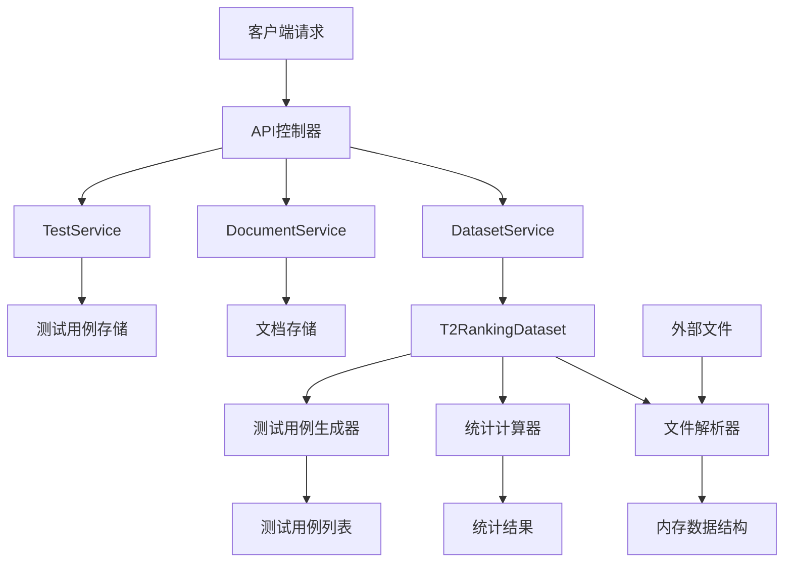
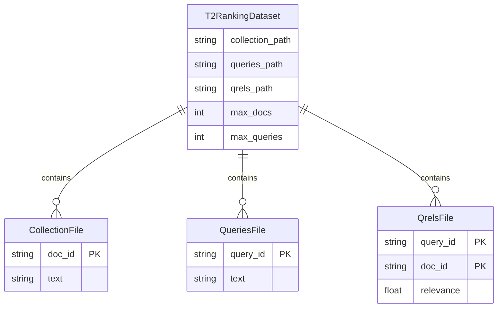
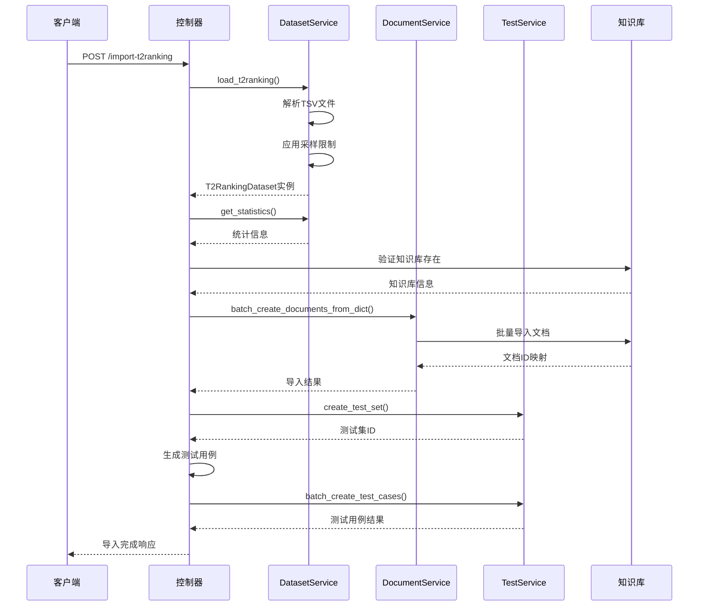
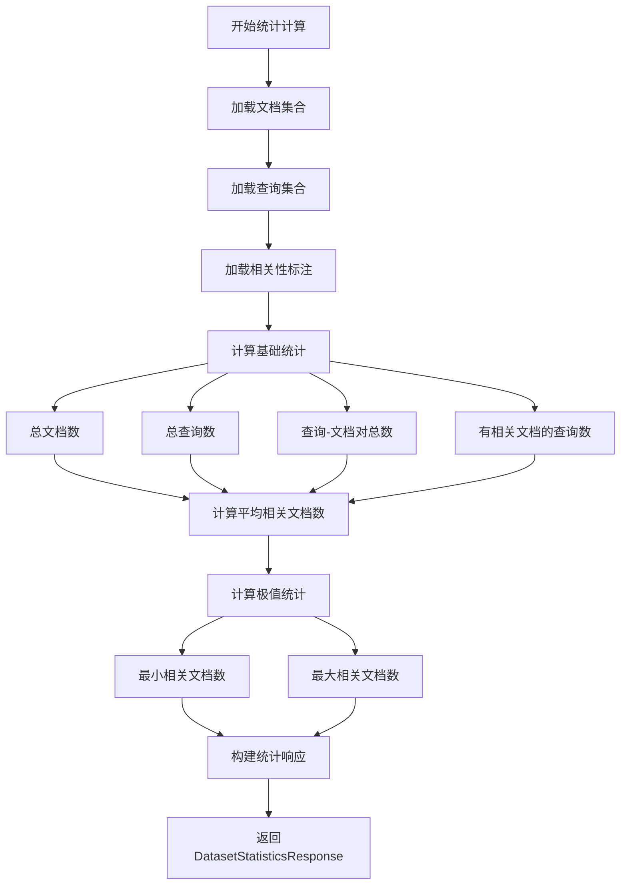
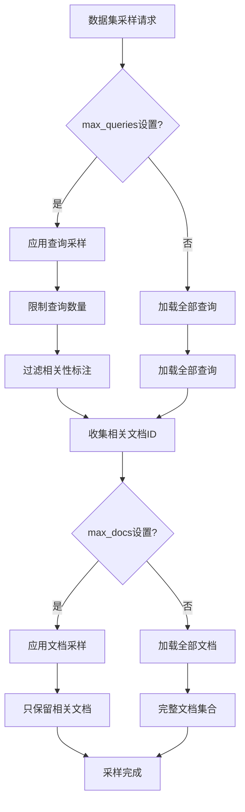
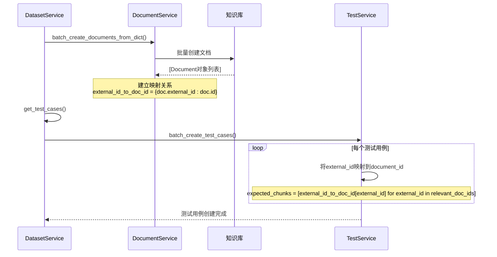
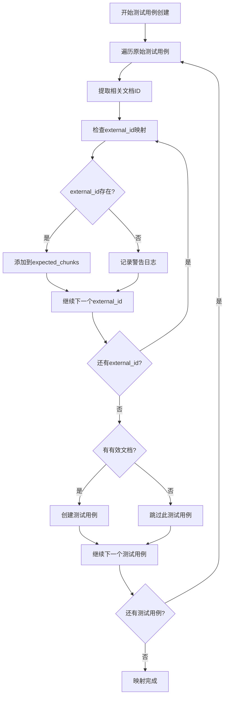
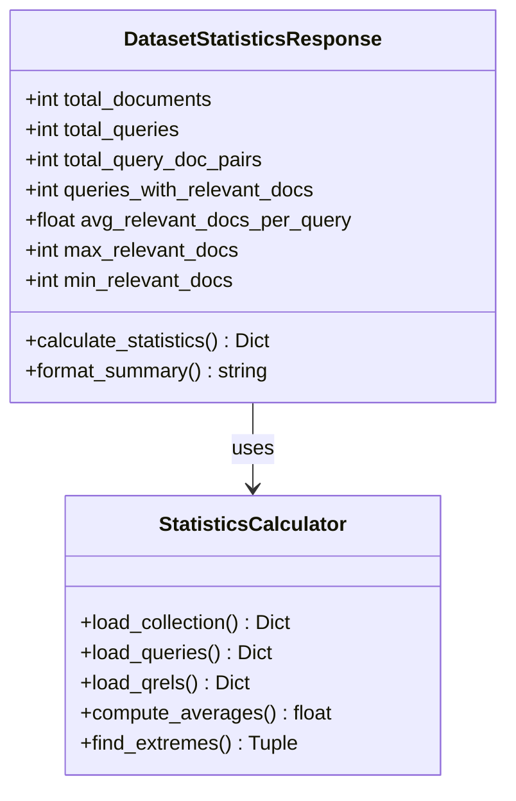
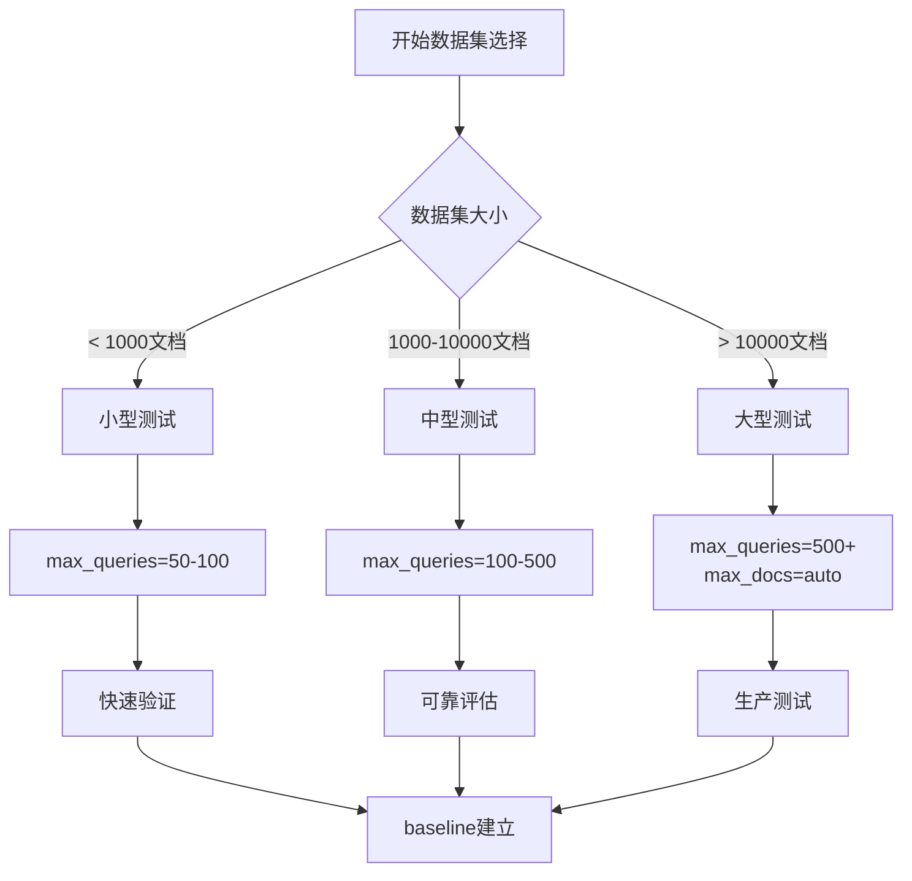

# 数据集管理

<cite>
**本文档引用的文件**
- [retriever_evaluation.py](file://backend/app/controllers/retriever_evaluation.py)
- [dataset_loader.py](file://backend/app/services/dataset_loader.py)
- [test.py](file://backend/app/schemas/test.py)
- [retriever_evaluation.py](file://backend/app/models/retriever_evaluation.py)
- [test_service.py](file://backend/app/services/test_service.py)
- [document.py](file://backend/app/services/document.py)
- [QUICKSTART_检索器评估.md](file://backend/QUICKSTART_检索器评估.md)
- [example_t2ranking_usage.py](file://backend/example_t2ranking_usage.py)
</cite>

## 目录
1. [概述](#概述)
2. [核心API接口](#核心api接口)
3. [T2Ranking数据集结构](#t2ranking数据集结构)
4. [import_t2ranking_dataset API详解](#import_t2ranking_dataset-api详解)
5. [get_dataset_statistics API详解](#get_dataset_statistics-api详解)
6. [数据集采样优化机制](#数据集采样优化机制)
7. [文档ID映射机制](#文档id映射机制)
8. [DatasetStatisticsResponse模型](#datasetstatisticsresponse模型)
9. [最佳实践与使用建议](#最佳实践与使用建议)
10. [故障排除指南](#故障排除指南)

## 概述

检索器评估系统提供了完整的数据集管理功能，支持导入和处理T2Ranking等标准检索评测数据集。系统通过两个核心API实现了数据集的导入和统计分析功能，同时提供了智能采样和文档映射机制来优化大规模数据集的处理效率。

### 主要功能特性

- **T2Ranking数据集支持**: 完整支持collection.tsv、queries.tsv、qrels.tsv文件格式
- **智能采样优化**: 通过max_docs和max_queries参数控制数据规模
- **文档ID映射**: 自动建立T2Ranking原始doc_id到系统document_id的映射关系
- **实时统计分析**: 提供详细的数据集统计信息预览功能
- **批量导入处理**: 支持大规模数据集的高效批量导入

## 核心API接口

系统提供两个主要的数据集管理API接口：



**图表来源**
- [retriever_evaluation.py](file://backend/app/controllers/retriever_evaluation.py#L26-L152)
- [dataset_loader.py](file://backend/app/services/dataset_loader.py#L14-L261)

### API接口概览

| API端点 | 方法 | 功能描述 | 请求参数 | 响应格式 |
|---------|------|----------|----------|----------|
| `/import-t2ranking` | POST | 导入T2Ranking数据集并创建测试集 | ImportT2RankingDatasetRequest | JSONResponse |
| `/dataset-statistics` | GET | 获取数据集统计信息 | 文件路径参数 | DatasetStatisticsResponse |

**章节来源**
- [retriever_evaluation.py](file://backend/app/controllers/retriever_evaluation.py#L26-L194)

## T2Ranking数据集结构

T2Ranking数据集采用标准的三元组格式，包含以下三个核心文件：

### collection.tsv文件格式
```
doc_id \t document_text
```
- **doc_id**: 文档唯一标识符（字符串）
- **document_text**: 文档完整内容（UTF-8编码）

### queries.tsv文件格式
```
query_id \t query_text
```
- **query_id**: 查询唯一标识符（字符串）
- **query_text**: 查询完整内容（UTF-8编码）

### qrels.tsv文件格式
```
query_id \t 0 \t doc_id \t relevance
```
- **query_id**: 查询标识符
- **0**: 固定字段，表示查询标识符占位符
- **doc_id**: 文档标识符
- **relevance**: 相关性评分（数值，大于0表示相关）



**图表来源**
- [dataset_loader.py](file://backend/app/services/dataset_loader.py#L14-L44)

**章节来源**
- [dataset_loader.py](file://backend/app/services/dataset_loader.py#L45-L138)

## import_t2ranking_dataset API详解

`import_t2ranking_dataset` API是系统的核心入口，负责将T2Ranking数据集完整导入到知识库并创建相应的测试集。

### 请求参数结构

ImportT2RankingDatasetRequest模型定义了完整的导入配置：

| 参数名 | 类型 | 必需 | 描述 | 默认值 |
|--------|------|------|------|--------|
| kb_id | string | 是 | 目标知识库ID | - |
| test_set_name | string | 是 | 测试集名称 | - |
| collection_path | string | 是 | collection.tsv文件路径 | - |
| queries_path | string | 是 | queries.tsv文件路径 | - |
| qrels_path | string | 是 | qrels.tsv文件路径 | - |
| max_docs | int | 否 | 最大文档数量限制 | None |
| max_queries | int | 否 | 最大查询数量限制 | None |
| description | string | 否 | 测试集描述信息 | None |

### 执行流程



**图表来源**
- [retriever_evaluation.py](file://backend/app/controllers/retriever_evaluation.py#L26-L152)

### 关键处理步骤

1. **数据集加载与验证**
   - 验证所有输入文件路径的有效性
   - 应用max_docs和max_queries采样限制
   - 执行数据完整性检查

2. **文档导入处理**
   - 批量创建文档对象
   - 建立external_id到document_id的映射
   - 处理导入过程中的错误和异常

3. **测试集创建**
   - 创建测试集记录
   - 保存配置快照和元数据

4. **测试用例生成**
   - 将T2Ranking的doc_id映射到系统document_id
   - 生成包含查询和相关文档的测试用例
   - 处理映射失败的情况

**章节来源**
- [retriever_evaluation.py](file://backend/app/controllers/retriever_evaluation.py#L46-L152)

## get_dataset_statistics API详解

`get_dataset_statistics` API提供数据集的统计信息预览功能，帮助用户在正式导入前了解数据集规模和特征。

### 请求参数

| 参数名 | 类型 | 必需 | 描述 |
|--------|------|------|------|
| collection_path | string | 是 | collection.tsv文件路径 |
| queries_path | string | 是 | queries.tsv文件路径 |
| qrels_path | string | 是 | qrels.tsv文件路径 |
| max_docs | int | 否 | 最大文档数量限制 |
| max_queries | int | 否 | 最大查询数量限制 |

### 统计指标计算

系统通过T2RankingDataset.get_statistics()方法计算以下统计指标：



**图表来源**
- [dataset_loader.py](file://backend/app/services/dataset_loader.py#L168-L190)

**章节来源**
- [retriever_evaluation.py](file://backend/app/controllers/retriever_evaluation.py#L161-L194)

## 数据集采样优化机制

为了应对大规模数据集的处理需求，系统提供了智能采样机制，通过max_docs和max_queries参数实现数据规模优化。

### 采样策略



**图表来源**
- [dataset_loader.py](file://backend/app/services/dataset_loader.py#L226-L260)

### 采样参数说明

| 参数 | 类型 | 描述 | 使用场景 |
|------|------|------|----------|
| max_docs | int | 最大文档数量限制 | 当文档数量过大时减少内存占用 |
| max_queries | int | 最大查询数量限制 | 当查询数量过多时优化处理速度 |

### 采样效果对比

| 数据集规模 | 无采样 | max_queries=100 | max_docs=1000 |
|------------|--------|-----------------|---------------|
| 内存占用 | 高 | 中等 | 较低 |
| 处理速度 | 慢 | 快 | 快 |
| 数据完整性 | 完整 | 代表性样本 | 代表性样本 |
| 评估准确性 | 最高 | 良好 | 良好 |

**章节来源**
- [dataset_loader.py](file://backend/app/services/dataset_loader.py#L226-L260)

## 文档ID映射机制

系统实现了完整的T2Ranking原始doc_id到系统document_id的映射机制，确保数据一致性。

### 映射关系建立



**图表来源**
- [retriever_evaluation.py](file://backend/app/controllers/retriever_evaluation.py#L89-L120)

### 映射字段说明

| 字段名 | 类型 | 描述 | 来源 |
|--------|------|------|------|
| external_id | string | T2Ranking原始文档ID | collection.tsv中的doc_id |
| id | string | 系统生成的文档ID | 自动生成的UUID前缀 |
| expected_chunks | list[string] | 测试用例期望的文档ID列表 | 映射后的document_id |

### 映射验证机制

系统在测试用例创建过程中实现了映射验证：



**图表来源**
- [retriever_evaluation.py](file://backend/app/controllers/retriever_evaluation.py#L101-L118)

**章节来源**
- [retriever_evaluation.py](file://backend/app/controllers/retriever_evaluation.py#L89-L120)

## DatasetStatisticsResponse模型

DatasetStatisticsResponse模型提供了全面的数据集统计信息，帮助用户了解数据集特征并做出导入决策。

### 统计指标详解



**图表来源**
- [test.py](file://backend/app/schemas/test.py#L276-L299)

### 指标计算公式

| 指标名称 | 计算公式 | 描述 |
|----------|----------|------|
| 总文档数 | len(collection) | 文档集合中的文档总数 |
| 总查询数 | len(queries) | 查询集合中的查询总数 |
| 查询-文档对总数 | sum(len(docs) for docs in qrels.values()) | 所有关联关系的数量 |
| 有相关文档的查询数 | len(qrels) | 包含相关文档的查询数量 |
| 平均相关文档数 | sum(len(docs)) / len(qrels) | 每个查询的平均相关文档数量 |
| 最大相关文档数 | max(len(docs) for docs in qrels.values()) | 单个查询最多的相关文档数 |
| 最小相关文档数 | min(len(docs) for docs in qrels.values()) | 单个查询最少的相关文档数 |

### 统计信息应用场景

| 场景 | 关键指标 | 决策依据 |
|------|----------|----------|
| 数据集规模评估 | total_documents, total_queries | 判断是否需要采样 |
| 评估复杂度分析 | avg_relevant_docs_per_query | 预估评估耗时 |
| 资源规划 | total_query_doc_pairs | 计算内存和存储需求 |
| 质量检查 | min_relevant_docs, max_relevant_docs | 发现异常分布 |

**章节来源**
- [dataset_loader.py](file://backend/app/services/dataset_loader.py#L168-L190)

## 最佳实践与使用建议

基于QUICKSTART_检索器评估.md中的最佳实践，以下是数据集管理的最佳使用建议。

### 数据集规模选择策略



**图表来源**
- [QUICKSTART_检索器评估.md](file://backend/QUICKSTART_检索器评估.md#L168-L179)

### 典型使用场景示例

#### 场景1: 初次测试验证
```python
# 推荐配置：快速验证
dataset = DatasetService.load_t2ranking(
    collection_path="collection.tsv",
    queries_path="queries.dev.tsv", 
    qrels_path="qrels.dev.tsv",
    max_queries=50,  # 快速验证
    max_docs=None    # 自动采样
)
```

#### 场景2: 中等规模评估
```python
# 推荐配置：平衡性能和准确性
dataset = DatasetService.load_t2ranking(
    collection_path="collection.tsv",
    queries_path="queries.dev.tsv",
    qrels_path="qrels.dev.tsv", 
    max_queries=200,  # 中等规模
    max_docs=5000    # 控制文档数量
)
```

#### 场景3: 生产环境测试
```python
# 推荐配置：完整数据集
dataset = DatasetService.load_t2ranking(
    collection_path="collection.tsv",
    queries_path="queries.dev.tsv",
    qrels_path="qrels.dev.tsv",
    max_queries=1000,  # 大规模测试
    max_docs=None     # 全部文档
)
```

### 性能优化建议

| 优化策略 | 实现方式 | 效果 |
|----------|----------|------|
| 内存优化 | 设置max_docs参数 | 减少内存占用 |
| 处理速度 | 设置max_queries参数 | 提升处理效率 |
| 网络传输 | 使用本地文件路径 | 减少网络开销 |
| 错误处理 | 实现重试机制 | 提高导入成功率 |

### 数据质量检查清单

- [ ] **文件完整性检查**
  - [ ] collection.tsv文件存在且可读
  - [ ] queries.tsv文件存在且可读
  - [ ] qrels.tsv文件存在且可读

- [ ] **数据格式验证**
  - [ ] TSV文件分隔符正确（\t）
  - [ ] 文档ID唯一性检查
  - [ ] 查询ID唯一性检查
  - [ ] 相关性评分有效性

- [ ] **统计信息分析**
  - [ ] 平均相关文档数合理性
  - [ ] 查询分布均匀性
  - [ ] 文档长度分布

**章节来源**
- [QUICKSTART_检索器评估.md](file://backend/QUICKSTART_检索器评估.md#L166-L200)

## 故障排除指南

### 常见问题及解决方案

#### 1. 数据集文件找不到

**问题症状**: `FileNotFoundError` 或文件路径错误

**解决方案**:
```python
# 检查文件路径
import os
paths = [collection_path, queries_path, qrels_path]
for path in paths:
    if not os.path.exists(path):
        print(f"文件不存在: {path}")
    elif not os.access(path, os.R_OK):
        print(f"文件不可读: {path}")
```

**预防措施**:
- 使用绝对路径而非相对路径
- 确保文件具有适当的读取权限
- 验证文件格式和编码

#### 2. 内存不足错误

**问题症状**: `MemoryError` 或处理缓慢

**解决方案**:
```python
# 降低采样参数
dataset = DatasetService.load_t2ranking(
    collection_path=path,
    queries_path=path,
    qrels_path=path,
    max_queries=100,  # 减少查询数量
    max_docs=1000     # 限制文档数量
)
```

**监控指标**:
- 系统可用内存
- Python进程内存使用
- 数据集统计信息

#### 3. 文档映射失败

**问题症状**: 测试用例创建失败或部分缺失

**诊断步骤**:
```python
# 检查映射完整性
external_id_to_doc_id = {doc.external_id: doc.id for doc in created_docs}
missing_ids = [doc_id for doc_id in relevant_doc_ids if doc_id not in external_id_to_doc_id]
print(f"缺失映射的文档ID: {missing_ids}")
```

**解决方案**:
- 检查文档导入状态
- 验证文档内容完整性
- 重新执行导入流程

#### 4. 性能问题诊断

**性能监控指标**:
```python
import time

# 性能测量
start_time = time.time()
dataset = DatasetService.load_t2ranking(...)
load_time = time.time() - start_time
print(f"数据集加载时间: {load_time:.2f}秒")

# 内存使用监控
import psutil
memory_usage = psutil.Process().memory_info().rss / 1024 / 1024
print(f"内存使用: {memory_usage:.2f}MB")
```

### 调试工具和技巧

#### 1. 统计信息预览
```bash
# 使用API获取统计数据
curl "http://localhost:8000/api/v1/retriever-evaluation/dataset-statistics" \
  --data-urlencode "collection_path=/path/to/collection.tsv" \
  --data-urlencode "queries_path=/path/to/queries.dev.tsv" \
  --data-urlencode "qrels_path=/path/to/qrels.dev.tsv" \
  --data-urlencode "max_queries=100"
```

#### 2. 渐进式导入策略
```python
# 分阶段导入
def progressive_import(collection_path, queries_path, qrels_path):
    # 第一阶段：小规模测试
    small_dataset = DatasetService.load_t2ranking(
        collection_path, queries_path, qrels_path,
        max_queries=50
    )
    
    # 第二阶段：中等规模验证
    medium_dataset = DatasetService.load_t2ranking(
        collection_path, queries_path, qrels_path,
        max_queries=200
    )
    
    # 第三阶段：完整导入
    full_dataset = DatasetService.load_t2ranking(
        collection_path, queries_path, qrels_path
    )
```

**章节来源**
- [QUICKSTART_检索器评估.md](file://backend/QUICKSTART_检索器评估.md#L202-L222)

## 总结

检索器评估系统的数据集管理功能提供了完整、高效的T2Ranking数据集处理解决方案。通过import_t2ranking_dataset和get_dataset_statistics两个核心API，系统实现了从数据导入到统计分析的全流程管理。

### 核心优势

1. **完整的数据集支持**: 支持T2Ranking标准格式的collection.tsv、queries.tsv、qrels.tsv文件
2. **智能采样优化**: 通过max_docs和max_queries参数实现大数据集的高效处理
3. **可靠的映射机制**: 自动建立T2Ranking原始ID到系统ID的映射关系
4. **详细的统计分析**: 提供全面的数据集统计信息用于决策支持
5. **灵活的配置选项**: 支持多种使用场景和性能优化策略

### 技术特色

- **模块化设计**: 清晰分离数据加载、统计计算、映射处理等功能模块
- **错误处理机制**: 完善的异常处理和错误恢复策略
- **性能优化**: 智能采样和缓存机制提升处理效率
- **扩展性**: 支持未来扩展其他数据集格式的能力

通过遵循本文档提供的最佳实践和使用建议，用户可以高效地利用系统功能进行检索器评估，获得准确可靠的评估结果。