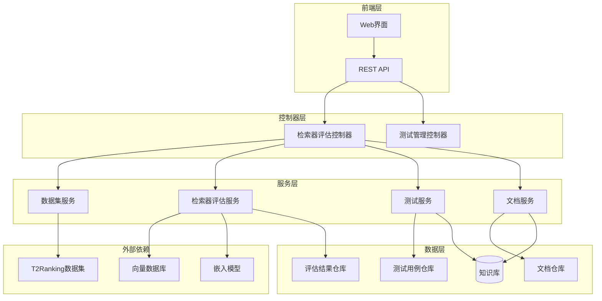
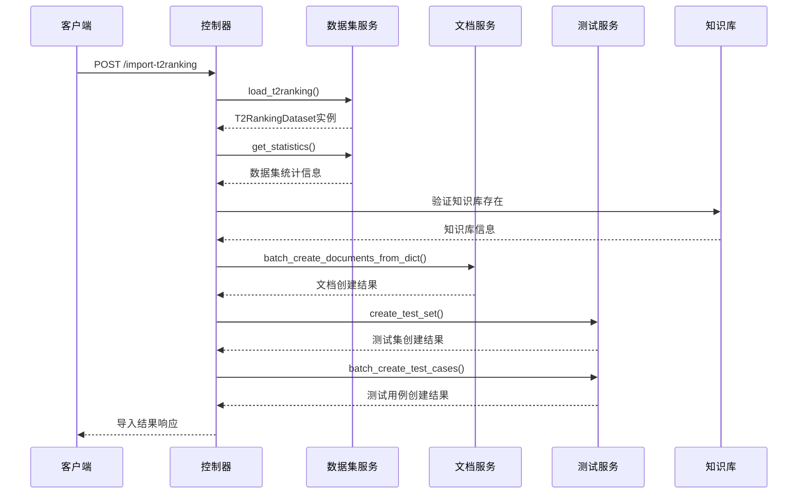
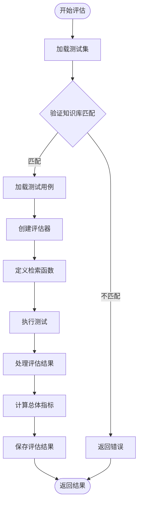
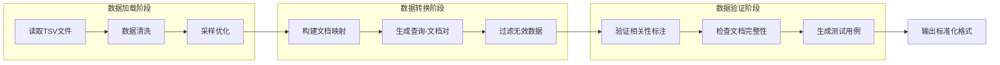
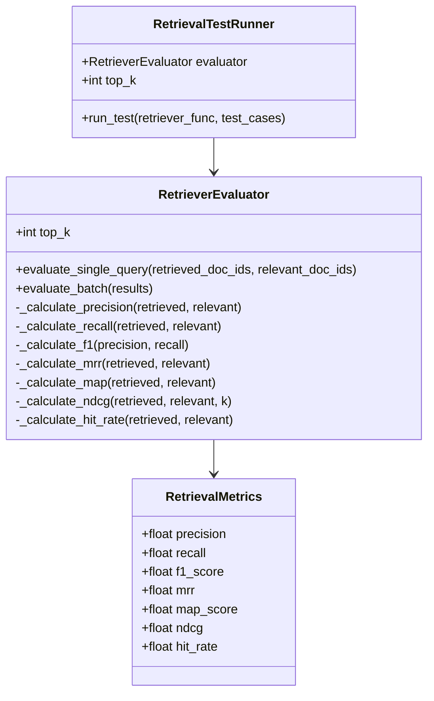
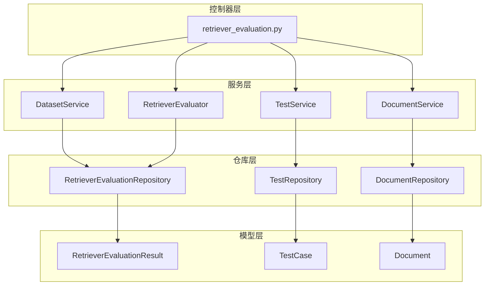
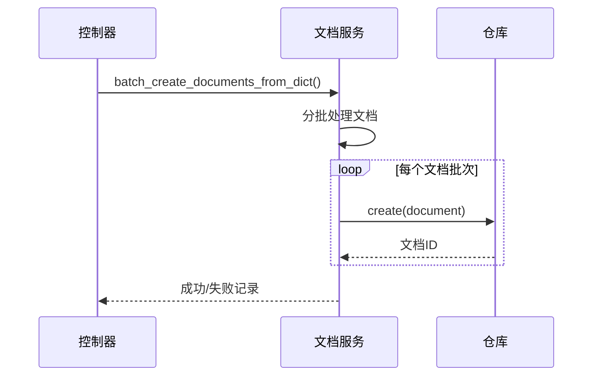
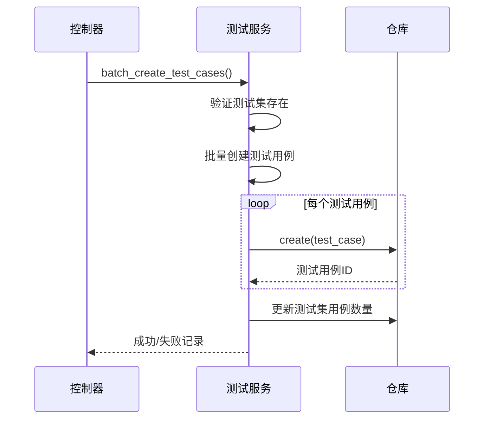
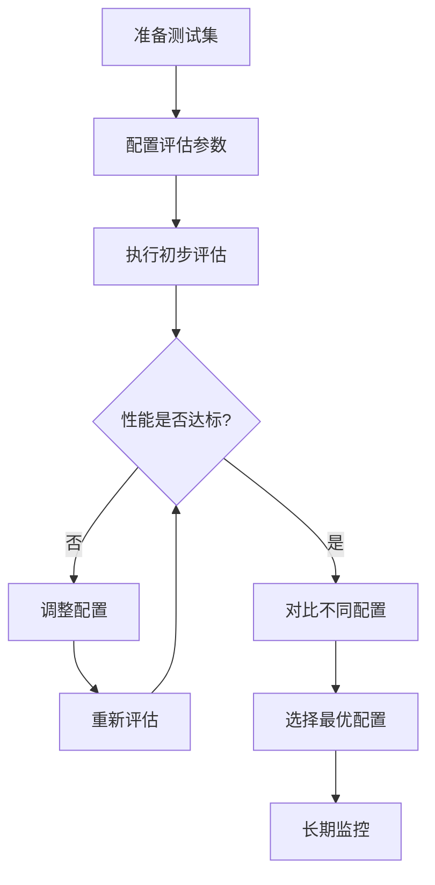

# 检索器评估控制器技术文档

<cite>
**本文档引用的文件**
- [retriever_evaluation.py](file://backend/app/controllers/retriever_evaluation.py)
- [retriever_evaluation.py](file://backend/app/services/retriever_evaluation.py)
- [retriever_evaluation.py](file://backend/app/models/retriever_evaluation.py)
- [retriever_evaluation_repository.py](file://backend/app/repositories/retriever_evaluation_repository.py)
- [dataset_loader.py](file://backend/app/services/dataset_loader.py)
- [test.py](file://backend/app/schemas/test.py)
- [test_service.py](file://backend/app/services/test_service.py)
- [document.py](file://backend/app/services/document.py)
- [example_t2ranking_usage.py](file://backend/example_t2ranking_usage.py)
- [README_RETRIEVER_EVAL.md](file://backend/README_RETRIEVER_EVAL.md)
</cite>

## 目录
1. [概述](#概述)
2. [系统架构](#系统架构)
3. [核心API详解](#核心api详解)
4. [T2Ranking数据集处理](#t2ranking数据集处理)
5. [评估指标计算](#评估指标计算)
6. [服务协调机制](#服务协调机制)
7. [异步任务处理](#异步任务处理)
8. [配置参数影响](#配置参数影响)
9. [最佳实践](#最佳实践)
10. [故障排除](#故障排除)

## 概述

检索器评估控制器是RAG Studio系统中的核心组件，专门负责基于T2Ranking等标准数据集的检索器性能评估。该系统提供了完整的评估流水线，从数据集导入到结果分析，支持多种评估指标和配置对比。

### 主要功能特性

- **标准化数据集导入**：支持T2Ranking标准数据集的完整导入流程
- **全面评估指标**：提供Precision@K、Recall@K、F1-Score、MRR、MAP、NDCG等专业评估指标
- **灵活配置支持**：支持多种向量数据库、嵌入模型和检索算法配置
- **批量评估处理**：高效处理大规模测试用例的批量评估
- **结果对比分析**：支持多版本评估结果的对比和分析

## 系统架构



**图表来源**
- [retriever_evaluation.py](file://backend/app/controllers/retriever_evaluation.py#L1-L375)
- [test_service.py](file://backend/app/services/test_service.py#L1-L374)
- [dataset_loader.py](file://backend/app/services/dataset_loader.py#L1-L261)

## 核心API详解

### import_t2ranking_dataset - T2Ranking数据集导入

该API实现了完整的T2Ranking数据集导入流程，包括文档批量创建、测试集生成和测试用例映射。

#### 功能流程



**图表来源**
- [retriever_evaluation.py](file://backend/app/controllers/retriever_evaluation.py#L26-L152)
- [dataset_loader.py](file://backend/app/services/dataset_loader.py#L193-L223)

#### 关键处理步骤

1. **数据集加载与验证**
   - 加载collection.tsv、queries.tsv、qrels.tsv文件
   - 应用max_docs和max_queries采样限制
   - 验证知识库ID的有效性

2. **文档批量导入**
   - 将文档内容导入到指定知识库
   - 处理导入失败的情况
   - 建立文档ID映射关系

3. **测试集创建**
   - 创建专门的测试集用于检索器评估
   - 记录测试集配置快照

4. **测试用例映射**
   - 将原始文档ID映射到新创建的文档ID
   - 构建查询-相关文档对应关系
   - 处理缺失映射的情况

**章节来源**
- [retriever_evaluation.py](file://backend/app/controllers/retriever_evaluation.py#L26-L152)

### get_dataset_statistics - 数据集统计预览

该API提供数据集的统计信息预览功能，帮助用户在导入前了解数据集规模。

#### 统计指标

| 指标名称 | 描述 | 计算方式 |
|---------|------|----------|
| total_documents | 总文档数量 | 文档集合中的唯一文档数 |
| total_queries | 总查询数量 | 查询集合中的唯一查询数 |
| total_query_doc_pairs | 查询-文档对总数 | 相关性标注中的配对数量 |
| queries_with_relevant_docs | 包含相关文档的查询数 | 有正相关标注的查询数 |
| avg_relevant_docs_per_query | 平均每个查询的相关文档数 | 相关文档总数 ÷ 查询总数 |
| max_relevant_docs | 单个查询的最大相关文档数 | 所有查询中相关文档数的最大值 |
| min_relevant_docs | 单个查询的最小相关文档数 | 所有查询中相关文档数的最小值 |

**章节来源**
- [retriever_evaluation.py](file://backend/app/controllers/retriever_evaluation.py#L161-L195)
- [dataset_loader.py](file://backend/app/services/dataset_loader.py#L168-L190)

### evaluate_retriever - 核心评估逻辑

该API执行检索器的核心评估流程，计算各种评估指标并返回结果。

#### 评估流程



**图表来源**
- [retriever_evaluation.py](file://backend/app/controllers/retriever_evaluation.py#L197-L294)

#### 评估配置参数

| 参数名称 | 类型 | 默认值 | 描述 |
|---------|------|--------|------|
| kb_id | string | 必需 | 目标知识库ID |
| test_set_id | string | 必需 | 测试集ID |
| top_k | integer | 10 | 检索返回的top-k数量 |
| vector_db_type | string | null | 向量数据库类型 |
| embedding_provider | string | null | 嵌入模型提供商 |
| embedding_model | string | null | 嵌入模型名称 |
| retrieval_algorithm | string | null | 检索算法配置 |

**章节来源**
- [retriever_evaluation.py](file://backend/app/controllers/retriever_evaluation.py#L197-L294)
- [test.py](file://backend/app/schemas/test.py#L211-L232)

### get_evaluation_history - 评估历史查询

该API支持查询特定知识库的评估历史记录，便于追踪性能变化趋势。

#### 查询功能

- **分页查询**：支持指定页码和页面大小
- **条件过滤**：可按测试集ID过滤结果
- **排序功能**：按创建时间倒序排列

**章节来源**
- [retriever_evaluation.py](file://backend/app/controllers/retriever_evaluation.py#L297-L332)

### compare_evaluations - 评估结果对比

该API支持对比多个评估结果，帮助用户分析不同配置的性能差异。

#### 对比维度

- **评估指标对比**：Precision、Recall、F1-Score等指标的数值对比
- **配置参数对比**：不同向量数据库、嵌入模型的配置对比
- **性能趋势分析**：同一配置下不同时间点的性能变化

**章节来源**
- [retriever_evaluation.py](file://backend/app/controllers/retriever_evaluation.py#L334-L370)

## T2Ranking数据集处理

### 数据集结构

T2Ranking数据集采用标准的三元组格式：

| 文件名 | 格式 | 内容 |
|--------|------|------|
| collection.tsv | doc_id \t doc_text | 文档集合，每行一个文档 |
| queries.dev.tsv | query_id \t query_text | 查询集合，每行一个查询 |
| qrels.dev.tsv | query_id \t 0 \t doc_id \t relevance | 相关性标注，每行一个相关性记录 |

### 数据处理流程



**图表来源**
- [dataset_loader.py](file://backend/app/services/dataset_loader.py#L14-L166)

### 采样优化机制

为了处理大规模数据集，系统提供了智能采样机制：

#### 采样策略

1. **查询采样**：限制最大查询数量，自动确定相关文档
2. **文档过滤**：只保留与采样查询相关的文档
3. **内存优化**：显著减少内存占用和处理时间

#### 采样配置

```python
# 推荐配置
max_queries = 100  # 采样100个查询
max_docs = None    # 自动根据采样查询确定相关文档
```

**章节来源**
- [dataset_loader.py](file://backend/app/services/dataset_loader.py#L226-L260)

## 评估指标计算

### 核心评估指标

系统实现了完整的检索器评估指标体系，基于信息检索领域的标准指标。

#### Precision@K (精确率)

```mermaid
graph TD
A[检索结果] --> B{计算相关文档数}
B --> C[precision = 相关文档数 / 检索结果总数]
C --> D[precision ∈ [0, 1]]
```

**图表来源**
- [retriever_evaluation.py](file://backend/app/services/retriever_evaluation.py#L109-L125)

#### Recall@K (召回率)

```mermaid
graph TD
A[真实相关文档] --> B{计算检索到的相关文档数}
B --> C[recall = 检索到的相关文档数 / 真实相关文档总数]
C --> D[recall ∈ [0, 1]]
```

**图表来源**
- [retriever_evaluation.py](file://backend/app/services/retriever_evaluation.py#L126-L141)

#### F1-Score (F1分数)

F1分数是精确率和召回率的调和平均：

```
F1 = 2 × (Precision × Recall) / (Precision + Recall)
```

**章节来源**
- [retriever_evaluation.py](file://backend/app/services/retriever_evaluation.py#L143-L151)

#### MRR (Mean Reciprocal Rank)

平均倒数排名关注第一个相关文档的位置：

```
MRR = 1 / rank_of_first_relevant_doc
```

**章节来源**
- [retriever_evaluation.py](file://backend/app/services/retriever_evaluation.py#L153-L168)

#### MAP (Mean Average Precision)

平均精度均值考虑所有相关文档的位置：

```
MAP = (sum of P@k for each relevant doc) / |relevant docs|
```

**章节来源**
- [retriever_evaluation.py](file://backend/app/services/retriever_evaluation.py#L170-L196)

#### NDCG (Normalized Discounted Cumulative Gain)

归一化折损累积增益综合考虑相关性和排序位置：

```
NDCG = DCG / IDCG
```

其中：
- DCG = Σ(rel_i / log₂(i+1)) （实际排序）
- IDCG = Σ(rel_i / log₂(i+1)) （理想排序）

**章节来源**
- [retriever_evaluation.py](file://backend/app/services/retriever_evaluation.py#L198-L232)

### 评估器架构



**图表来源**
- [retriever_evaluation.py](file://backend/app/services/retriever_evaluation.py#L14-L423)

**章节来源**
- [retriever_evaluation.py](file://backend/app/services/retriever_evaluation.py#L26-L259)

## 服务协调机制

### 服务层架构



**图表来源**
- [retriever_evaluation.py](file://backend/app/controllers/retriever_evaluation.py#L1-L375)
- [test_service.py](file://backend/app/services/test_service.py#L1-L374)
- [retriever_evaluation_repository.py](file://backend/app/repositories/retriever_evaluation_repository.py#L1-L54)

### 服务间协作流程

#### 数据导入流程

1. **DatasetService** 负责数据集加载和预处理
2. **DocumentService** 处理文档的批量创建
3. **TestService** 创建测试集和测试用例
4. **RetrieverEvaluator** 执行评估计算

#### 评估执行流程

1. **TestService** 加载测试用例
2. **RetrieverEvaluator** 执行单查询评估
3. **RetrievalTestRunner** 管理批量测试执行
4. **RetrieverEvaluationRepository** 存储评估结果

**章节来源**
- [retriever_evaluation.py](file://backend/app/controllers/retriever_evaluation.py#L1-L375)
- [test_service.py](file://backend/app/services/test_service.py#L1-L374)
- [document.py](file://backend/app/services/document.py#L1-L272)

## 异步任务处理

### 批量操作优化

系统针对大规模数据导入和评估提供了多种优化策略：

#### 文档批量导入



**图表来源**
- [document.py](file://backend/app/services/document.py#L74-L124)

#### 测试用例批量创建



**图表来源**
- [test_service.py](file://backend/app/services/test_service.py#L167-L222)

### 错误处理机制

系统提供了完善的错误处理和恢复机制：

#### 错误分类

1. **数据验证错误**：文件格式、参数有效性检查
2. **网络连接错误**：向量数据库、嵌入服务连接失败
3. **资源不足错误**：内存、磁盘空间不足
4. **业务逻辑错误**：知识库不存在、权限不足

#### 错误恢复策略

- **重试机制**：对临时性错误进行指数退避重试
- **降级处理**：在部分功能不可用时提供基本功能
- **错误隔离**：单个测试用例失败不影响整体流程
- **详细日志**：记录完整的错误堆栈和上下文信息

**章节来源**
- [retriever_evaluation.py](file://backend/app/controllers/retriever_evaluation.py#L154-L158)
- [test_service.py](file://backend/app/services/test_service.py#L194-L216)

## 配置参数影响

### top_k 参数影响

top_k参数直接影响评估结果的准确性和计算复杂度：

#### 性能影响

| top_k值 | 精确率 | 召回率 | 计算复杂度 | 推荐场景 |
|---------|--------|--------|------------|----------|
| 1-5 | 较高 | 较低 | 低 | 单答案检索 |
| 10-20 | 平衡 | 中等 | 中等 | 通用检索 |
| 50+ | 较低 | 较高 | 高 | 多答案检索 |

#### 选择建议

- **初始测试**：使用10作为默认值
- **对比实验**：固定测试集，变化top_k观察性能变化
- **生产环境**：根据具体应用场景选择

### 嵌入模型配置

不同的嵌入模型对评估结果有显著影响：

#### 模型对比

| 模型名称 | 优势 | 劣势 | 适用场景 |
|---------|------|------|----------|
| nomic-embed-text | 中文优化 | 计算较慢 | 中文文档检索 |
| bge-large | 性能均衡 | 占用内存大 | 通用场景 |
| sentence-transformers | 轻量级 | 准确率较低 | 资源受限环境 |

### 向量数据库选择

不同向量数据库的性能特征：

#### 性能对比

| 数据库类型 | 查询速度 | 存储效率 | 扩展性 | 适用规模 |
|-----------|----------|----------|--------|----------|
| Elasticsearch | 中等 | 中等 | 优秀 | 大规模 |
| Qdrant | 快速 | 高效 | 良好 | 中等规模 |
| Milvus | 极快 | 高效 | 优秀 | 超大规模 |

**章节来源**
- [retriever_evaluation.py](file://backend/app/controllers/retriever_evaluation.py#L216-L288)
- [test.py](file://backend/app/schemas/test.py#L211-L232)

## 最佳实践

### 数据集准备

#### 推荐配置

```python
# 生产环境配置
max_queries = 200  # 200个查询用于生产评估
max_docs = None    # 自动采样相关文档
top_k = 10         # 默认top_k值

# 开发环境配置  
max_queries = 50   # 50个查询快速验证
max_docs = 1000    # 限制文档数量
top_k = 5          # 快速测试
```

#### 数据集优化策略

1. **渐进式采样**：从少量查询开始，逐步增加样本量
2. **代表性验证**：确保采样后的数据集具有代表性
3. **基准建立**：在小规模数据上建立性能基准

### 评估流程

#### 完整评估流程



#### 对比测试建议

1. **固定测试集**：保持测试集不变，只变化单一变量
2. **多次重复**：每个配置至少运行3次取平均值
3. **统计显著性**：使用统计检验判断性能差异是否显著

### 结果分析

#### 指标解读指南

| 指标 | 解读标准 | 优化方向 |
|------|----------|----------|
| F1-Score | > 0.7: 优秀, 0.5-0.7: 良好, < 0.5: 需优化 | 平衡精确率和召回率 |
| NDCG | 接近1.0: 优秀, 0.8-1.0: 良好 | 优化检索排序 |
| MRR | 接近1.0: 优秀, 0.8-1.0: 良好 | 提升相关文档位置 |

**章节来源**
- [README_RETRIEVER_EVAL.md](file://backend/README_RETRIEVER_EVAL.md#L220-L296)

## 故障排除

### 常见问题及解决方案

#### 数据导入问题

**问题**：T2Ranking数据集导入失败
**可能原因**：
- 文件路径错误
- 文件格式不正确
- 知识库ID不存在

**解决方案**：
1. 验证文件路径和权限
2. 检查TSV文件格式是否符合规范
3. 确认知识库已正确创建

#### 评估执行问题

**问题**：评估过程中断或超时
**可能原因**：
- 检索服务不可用
- 向量数据库连接失败
- 内存不足

**解决方案**：
1. 检查检索服务状态
2. 验证向量数据库连接
3. 增加系统内存或减少top_k值

#### 性能问题

**问题**：评估速度过慢
**优化措施**：
1. 减少max_queries参数值
2. 降低top_k值
3. 使用更快的向量数据库
4. 增加并发处理能力

### 日志分析

系统提供了详细的日志记录，便于问题诊断：

#### 关键日志信息

- **导入阶段**：文档数量、导入成功率、错误详情
- **评估阶段**：查询执行时间、评估指标值、异常信息
- **存储阶段**：结果保存状态、数据库连接信息

#### 监控指标

- **系统资源**：CPU、内存、磁盘使用率
- **服务响应**：API响应时间、错误率
- **数据质量**：导入成功率、评估准确性

**章节来源**
- [retriever_evaluation.py](file://backend/app/controllers/retriever_evaluation.py#L154-L158)
- [test_service.py](file://backend/app/services/test_service.py#L194-L216)

## 总结

检索器评估控制器是RAG Studio系统中的核心评估组件，提供了完整的检索器性能评估解决方案。通过标准化的数据集导入、全面的评估指标计算、灵活的配置管理和高效的批量处理能力，该系统能够满足从原型验证到生产部署的各种评估需求。

系统的主要优势包括：

1. **标准化流程**：基于T2Ranking等标准数据集，确保评估结果的可比性
2. **全面指标**：提供信息检索领域最常用的评估指标
3. **灵活配置**：支持多种向量数据库、嵌入模型和检索算法
4. **高效处理**：优化的大规模数据处理和批量评估能力
5. **易于扩展**：模块化设计便于功能扩展和定制

通过合理使用本系统，开发者可以有效地评估和优化检索器性能，为构建高质量的RAG应用奠定坚实基础。