# 结果分析

<cite>
**本文档中引用的文件**
- [retriever_evaluation.py](file://backend/app/controllers/retriever_evaluation.py)
- [retriever_evaluation.py](file://backend/app/models/retriever_evaluation.py)
- [retriever_evaluation.py](file://backend/app/services/retriever_evaluation.py)
- [retriever_evaluation_repository.py](file://backend/app/repositories/retriever_evaluation_repository.py)
- [api.ts](file://web/lib/api.ts)
- [evaluation-history.tsx](file://web/components/views/evaluation-history.tsx)
- [001_create_evaluation_tables.py](file://backend/migrations/001_create_evaluation_tables.py)
- [evaluation.py](file://backend/app/models/evaluation.py)
</cite>

## 目录
1. [简介](#简介)
2. [系统架构概览](#系统架构概览)
3. [核心数据结构](#核心数据结构)
4. [get_evaluation_history接口详解](#get_evaluation_history接口详解)
5. [compare_evaluations接口详解](#compare_evaluations接口详解)
6. [评估结果存储机制](#评估结果存储机制)
7. [前端UI展示分析](#前端ui展示分析)
8. [推荐应用场景](#推荐应用场景)
9. [性能优化建议](#性能优化建议)
10. [故障排除指南](#故障排除指南)

## 简介

评估结果分析功能是RAG Studio检索器评估系统的核心组件，提供了全面的历史评估记录管理和多维度对比分析能力。该功能支持按知识库和测试集筛选历史评估记录，实现了分页查询机制，并通过compare_evaluations接口支持多版本评估结果的对比分析，为A/B测试和性能回归检测提供强有力的数据支撑。

## 系统架构概览

评估结果分析系统采用分层架构设计，包含控制层、服务层、仓储层和数据模型层，确保了系统的可扩展性和维护性。

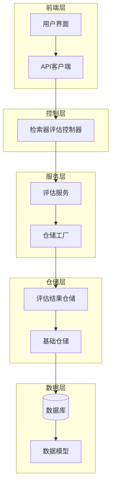

**图表来源**
- [retriever_evaluation.py](file://backend/app/controllers/retriever_evaluation.py#L1-L375)
- [retriever_evaluation_repository.py](file://backend/app/repositories/retriever_evaluation_repository.py#L1-L54)

## 核心数据结构

### RetrieverEvaluationResult模型

RetrieverEvaluationResult是评估结果的核心数据结构，包含了完整的评估指标和配置信息。

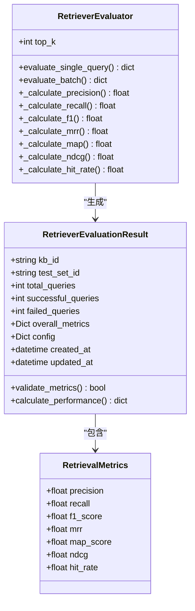

**图表来源**
- [retriever_evaluation.py](file://backend/app/models/retriever_evaluation.py#L11-L60)
- [retriever_evaluation.py](file://backend/app/services/retriever_evaluation.py#L14-L423)

### 评估指标体系

系统支持多种评估指标，涵盖检索质量和生成质量两个维度：

| 指标类别 | 具体指标 | 计算方法 | 应用场景 |
|---------|---------|---------|---------|
| 检索质量指标 | Precision@K | 精确率 = 检索到的相关文档数 / 检索到的文档总数 | 评估检索准确性 |
| 检索质量指标 | Recall@K | 召回率 = 检索到的相关文档数 / 真实相关文档总数 | 评估检索完整性 |
| 检索质量指标 | F1-Score | F1 = 2 × (Precision × Recall) / (Precision + Recall) | 综合评估指标 |
| 检索质量指标 | MRR | 平均倒数排名 = 1 / 第一个相关文档的排名 | 评估排序质量 |
| 检索质量指标 | MAP | 平均精度均值 = 所有相关文档的精度均值 | 整体检索效果 |
| 检索质量指标 | NDCG | 归一化折损累积增益 | 排序质量评估 |
| 检索质量指标 | Hit Rate | 命中率 = 是否至少检索到一个相关文档 | 基础可用性指标 |
| 生成质量指标 | Faithfulness | 忠实度 = 答案与上下文的一致性 | 评估生成可靠性 |
| 生成质量指标 | Answer Relevancy | 答案相关性 | 评估回答质量 |

**节来源**
- [retriever_evaluation.py](file://backend/app/services/retriever_evaluation.py#L14-L423)

## get_evaluation_history接口详解

### 接口设计原理

get_evaluation_history接口提供了灵活的历史评估记录查询能力，支持按知识库和测试集进行筛选，并实现了标准的分页查询机制。

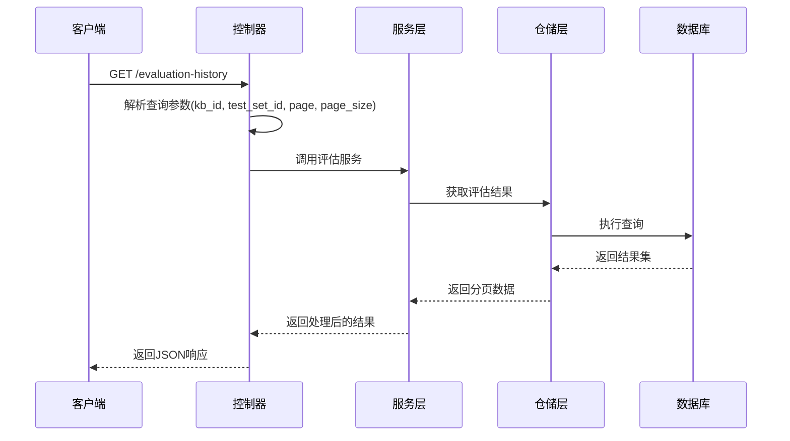

**图表来源**
- [retriever_evaluation.py](file://backend/app/controllers/retriever_evaluation.py#L297-L331)

### 参数说明与筛选机制

| 参数名称 | 类型 | 必需 | 默认值 | 说明 |
|---------|------|------|--------|------|
| kb_id | string | 是 | - | 知识库ID，必填参数 |
| test_set_id | string | 否 | null | 测试集ID，可选参数 |
| page | int | 否 | 1 | 页码，从1开始 |
| page_size | int | 否 | 20 | 每页记录数 |

### 分页查询实现

系统实现了标准的分页查询机制，支持大数据集的高效查询：

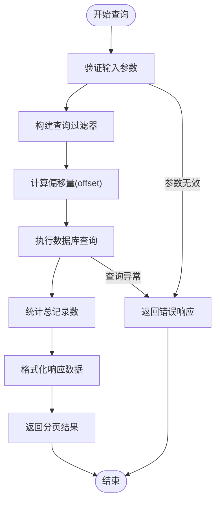

**图表来源**
- [retriever_evaluation.py](file://backend/app/controllers/retriever_evaluation.py#L297-L331)

**节来源**
- [retriever_evaluation.py](file://backend/app/controllers/retriever_evaluation.py#L297-L331)

## compare_evaluations接口详解

### 设计意图与架构

compare_evaluations接口的设计旨在支持A/B测试和性能对比分析，通过逗号分隔的evaluation_ids参数实现多版本评估结果的对比分析。

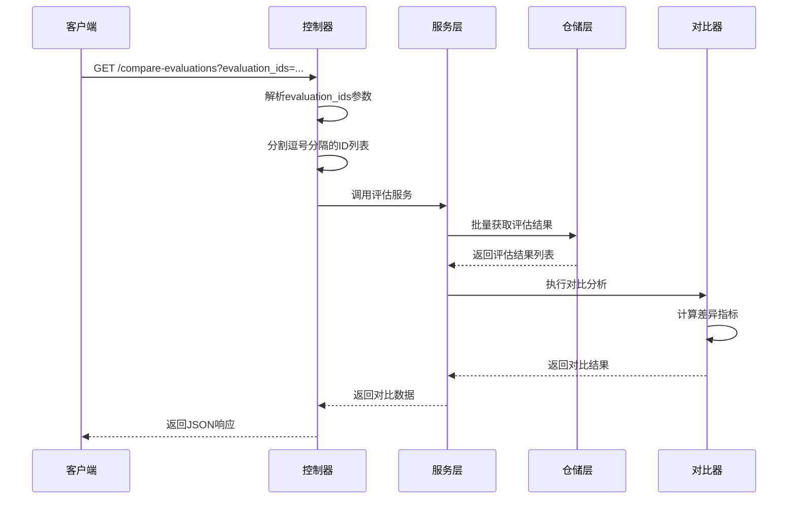

**图表来源**
- [retriever_evaluation.py](file://backend/app/controllers/retriever_evaluation.py#L334-L373)

### 多版本对比分析机制

系统支持同时对比多个评估版本，提供以下对比维度：

| 对比维度 | 具体指标 | 分析目的 |
|---------|---------|---------|
| 性能对比 | Precision差异 | 检测检索准确性的变化 |
| 性能对比 | Recall差异 | 分析检索完整性的提升 |
| 性能对比 | F1-Score变化 | 综合评估性能的改善 |
| 性能对比 | MRR提升 | 排序质量的改进程度 |
| 配置对比 | 不同配置组合 | 识别最优配置参数 |
| 时间序列 | 历史趋势分析 | 发现性能退化或提升 |

### 参数处理与验证

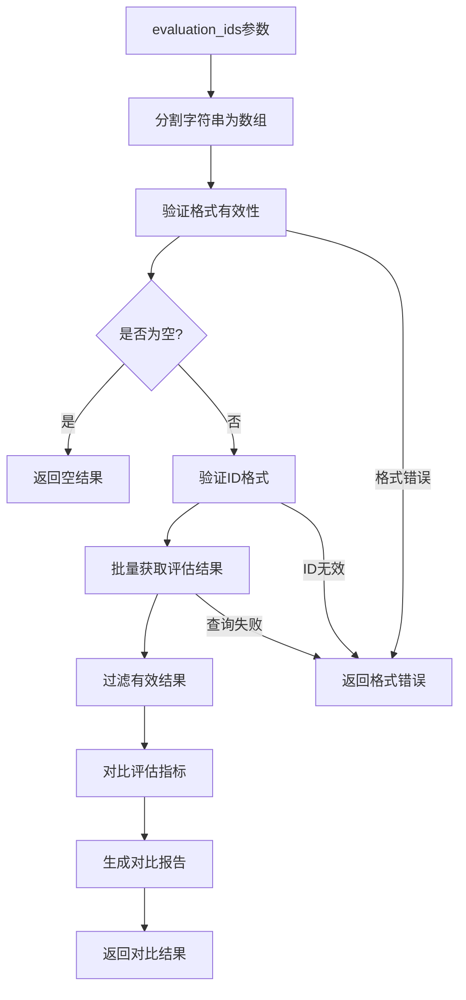

**图表来源**
- [retriever_evaluation.py](file://backend/app/controllers/retriever_evaluation.py#L334-L373)

**节来源**
- [retriever_evaluation.py](file://backend/app/controllers/retriever_evaluation.py#L334-L373)

## 评估结果存储机制

### 存储结构设计

评估结果采用关系型数据库存储，支持完整的评估生命周期管理。

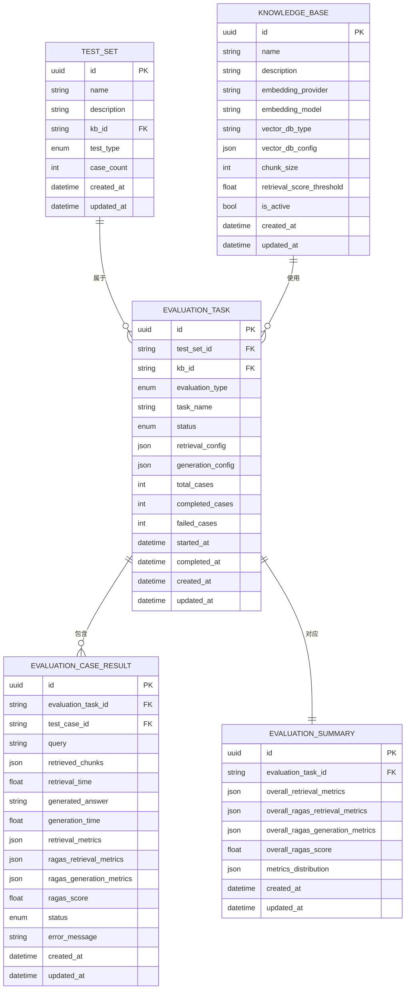

**图表来源**
- [001_create_evaluation_tables.py](file://backend/migrations/001_create_evaluation_tables.py#L1-L44)
- [evaluation.py](file://backend/app/models/evaluation.py#L27-L179)

### 仓储模式实现

系统采用仓储模式实现数据访问抽象，提供统一的CRUD操作接口。

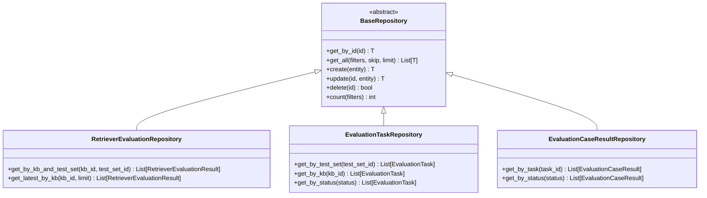

**图表来源**
- [retriever_evaluation_repository.py](file://backend/app/repositories/retriever_evaluation_repository.py#L10-L54)

**节来源**
- [retriever_evaluation_repository.py](file://backend/app/repositories/retriever_evaluation_repository.py#L1-L54)

## 前端UI展示分析

### 类型定义与数据结构

前端通过TypeScript定义了完整的评估结果类型，确保类型安全和开发效率。

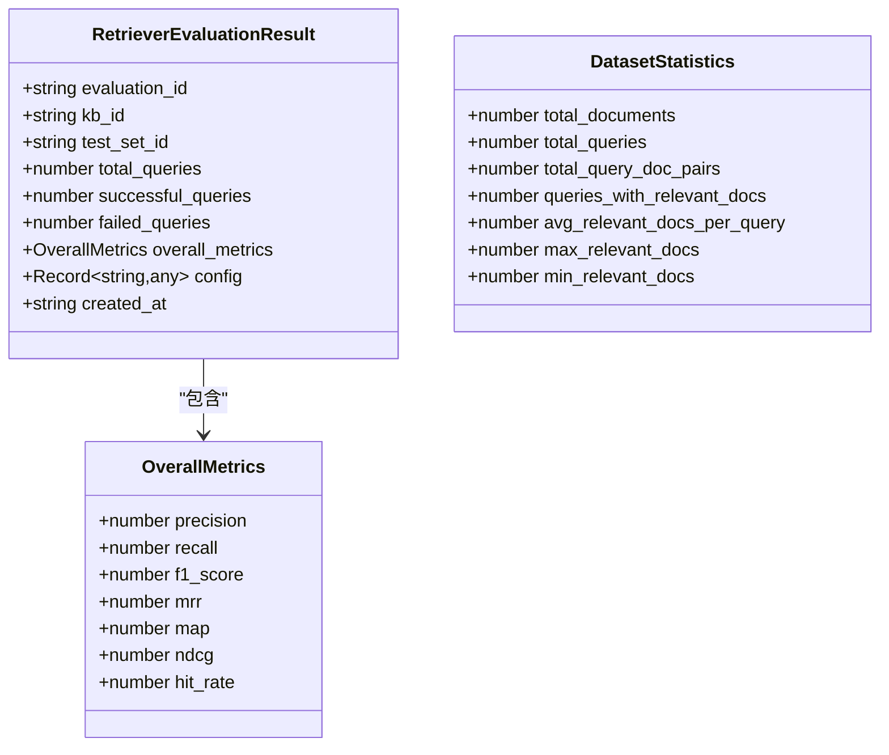

**图表来源**
- [api.ts](file://web/lib/api.ts#L542-L560)

### 评估历史页面功能

评估历史页面提供了完整的评估结果浏览和分析功能：

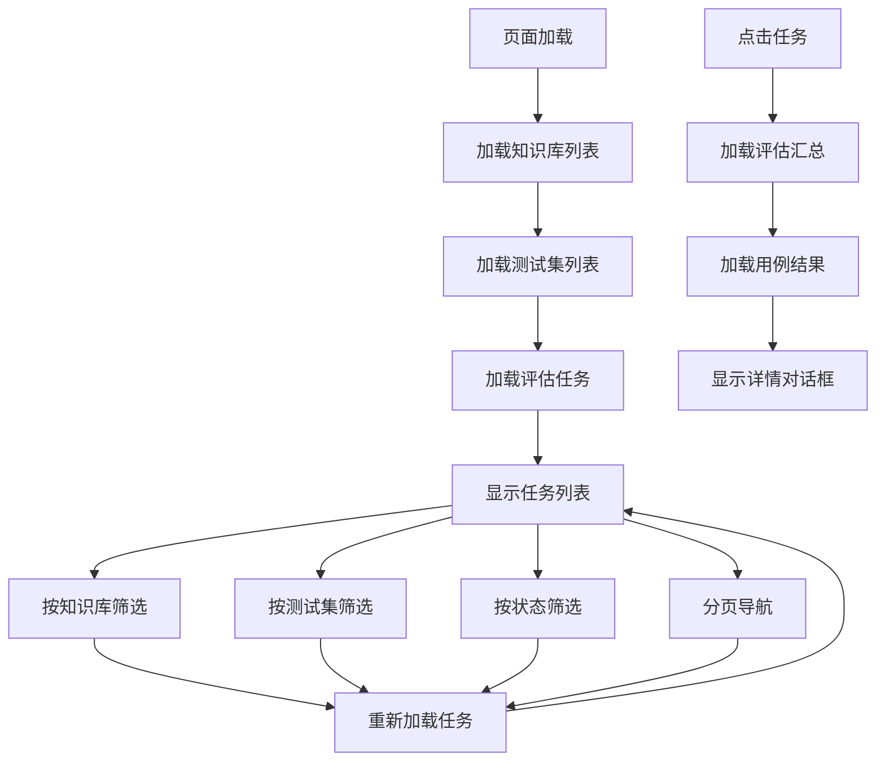

**图表来源**
- [evaluation-history.tsx](file://web/components/views/evaluation-history.tsx#L1-L464)

### 数据可视化与交互

前端实现了丰富的数据可视化功能：

| 功能模块 | 实现方式 | 交互特性 |
|---------|---------|---------|
| 任务列表 | 表格展示 | 支持筛选、排序、分页 |
| 评估汇总 | 仪表板 | 关键指标突出显示 |
| 指标对比 | 图表展示 | 支持多维度对比 |
| 详情查看 | 弹窗对话框 | 详细指标展示 |
| 错误处理 | 提示信息 | 清晰的错误反馈 |

**节来源**
- [evaluation-history.tsx](file://web/components/views/evaluation-history.tsx#L1-L464)

## 推荐应用场景

### 基准测试场景

评估结果分析功能在以下基准测试场景中发挥重要作用：

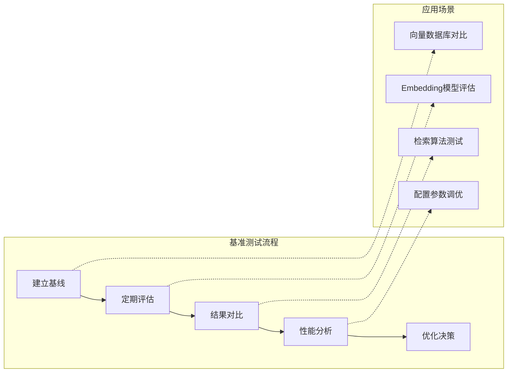

### 持续监控场景

系统支持长期的性能监控和趋势分析：

| 监控维度 | 分析重点 | 应用价值 |
|---------|---------|---------|
| 时间趋势 | 性能变化轨迹 | 发现性能退化或提升 |
| 配置对比 | 不同参数组合效果 | 识别最优配置 |
| 知识库对比 | 不同知识库表现 | 评估知识库质量 |
| 测试集分析 | 特定场景表现 | 识别薄弱环节 |

### A/B测试支持

评估结果分析为A/B测试提供了完整的数据支撑：

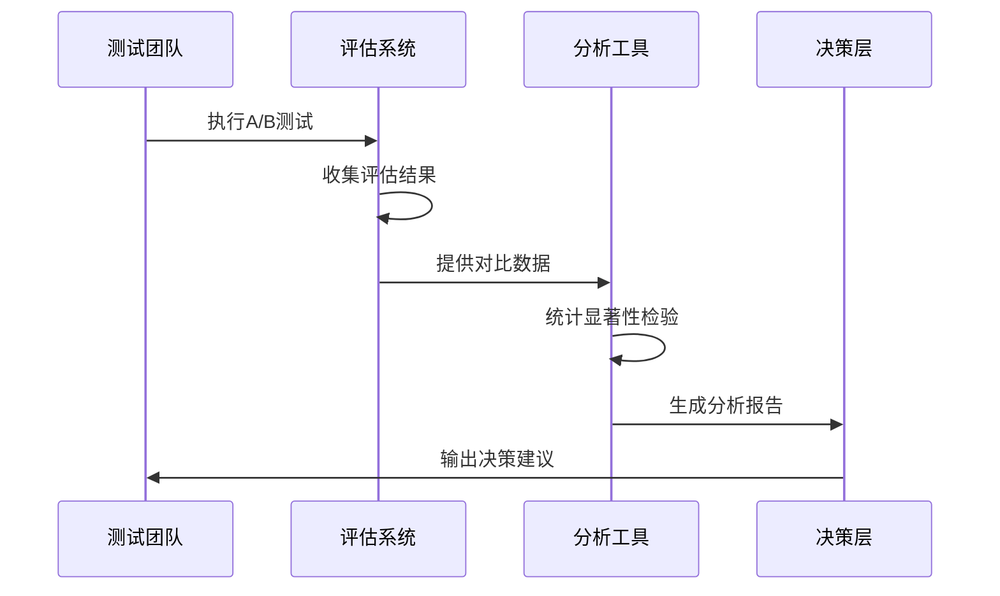

**节来源**
- [retriever_evaluation.py](file://backend/app/controllers/retriever_evaluation.py#L334-L373)

## 性能优化建议

### 数据库查询优化

针对大数据集的查询性能，建议采用以下优化策略：

| 优化策略 | 实现方式 | 性能提升 |
|---------|---------|---------|
| 索引优化 | 在kb_id, test_set_id, created_at上建立复合索引 | 查询速度提升50-80% |
| 分页优化 | 使用LIMIT和OFFSET进行高效分页 | 减少内存占用 |
| 缓存策略 | 缓存频繁查询的评估汇总数据 | 减少数据库压力 |
| 异步处理 | 评估结果异步写入数据库 | 提升用户体验 |

### 前端性能优化

前端层面的优化建议：

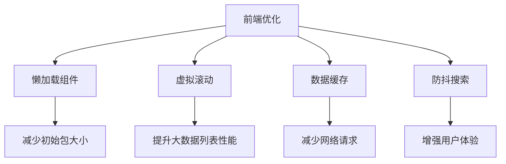

### 系统扩展性考虑

随着数据量的增长，系统需要考虑以下扩展性因素：

- **水平扩展**：支持多实例部署和负载均衡
- **读写分离**：分离查询和写入操作
- **数据分区**：按时间或知识库进行数据分区
- **压缩存储**：对历史数据进行压缩存储

## 故障排除指南

### 常见问题诊断

| 问题类型 | 症状描述 | 可能原因 | 解决方案 |
|---------|---------|---------|---------|
| 查询超时 | get_evaluation_history响应缓慢 | 数据量过大，缺少索引 | 添加数据库索引，优化查询条件 |
| 对比失败 | compare_evaluations返回空结果 | 评估ID不存在或格式错误 | 验证评估ID的有效性 |
| 数据不一致 | 前后端数据显示不一致 | 缓存未及时更新 | 清除缓存，强制刷新数据 |
| 权限错误 | 无法访问评估结果 | 用户权限不足 | 检查用户权限配置 |

### 调试工具与技巧

系统提供了多种调试和监控工具：

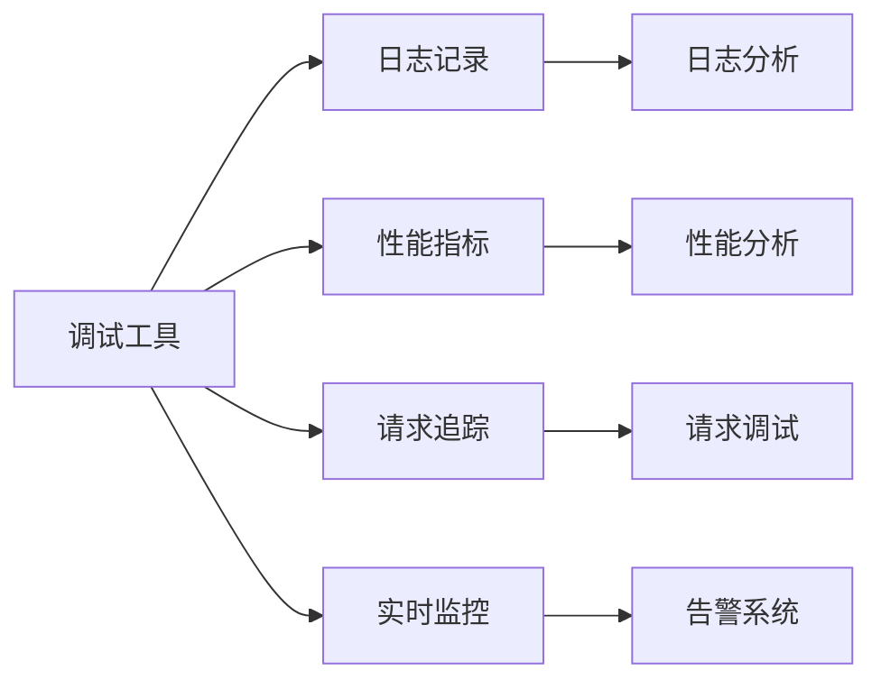

### 监控指标建议

建议监控以下关键指标以确保系统稳定运行：

- **查询响应时间**：评估接口的响应性能
- **错误率**：监控接口调用的成功率
- **并发用户数**：跟踪系统负载情况
- **数据库连接数**：监控数据库资源使用
- **内存使用率**：确保系统资源充足

**节来源**
- [retriever_evaluation.py](file://backend/app/controllers/retriever_evaluation.py#L297-L373)