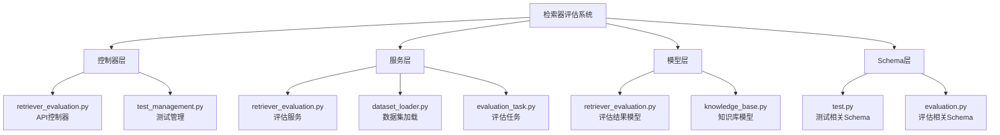
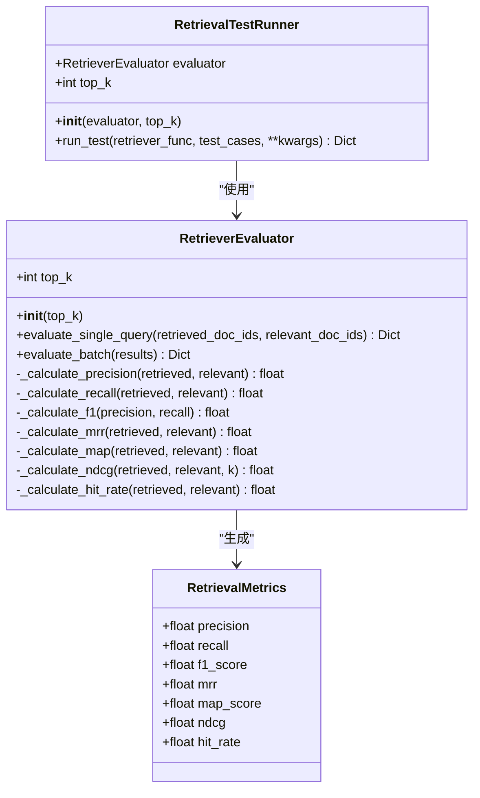
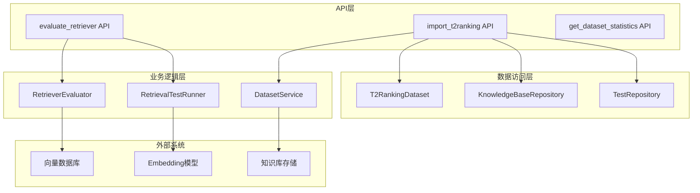
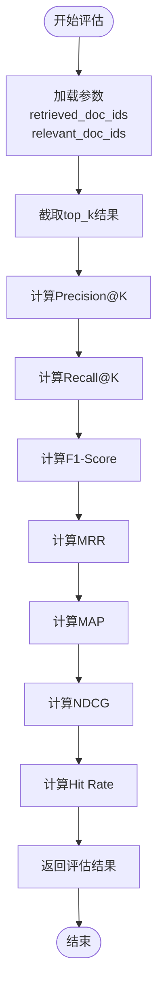
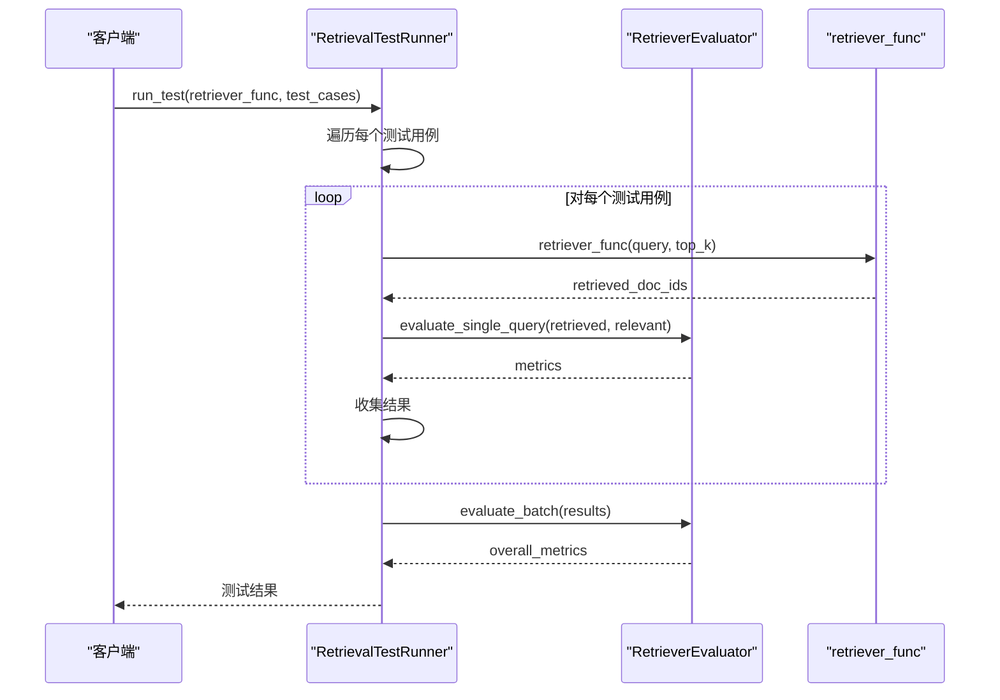
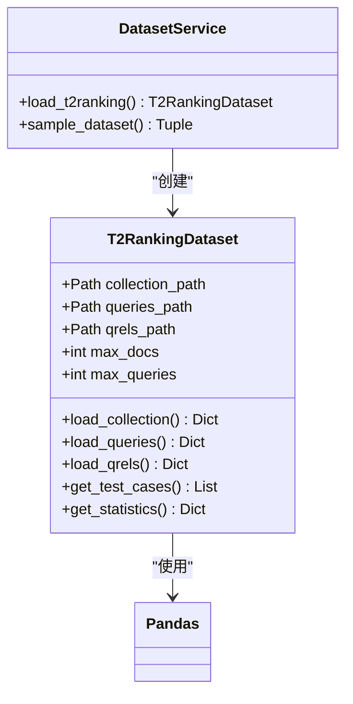
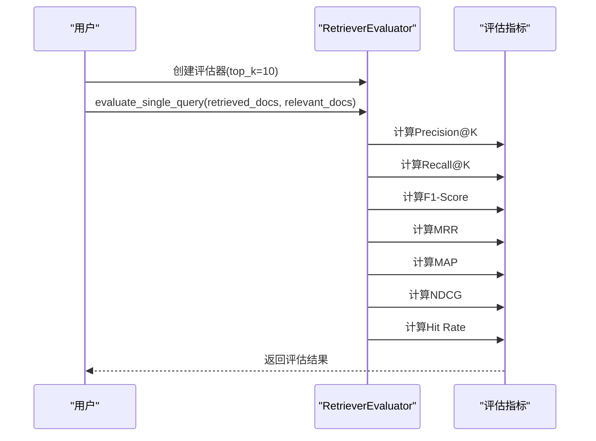
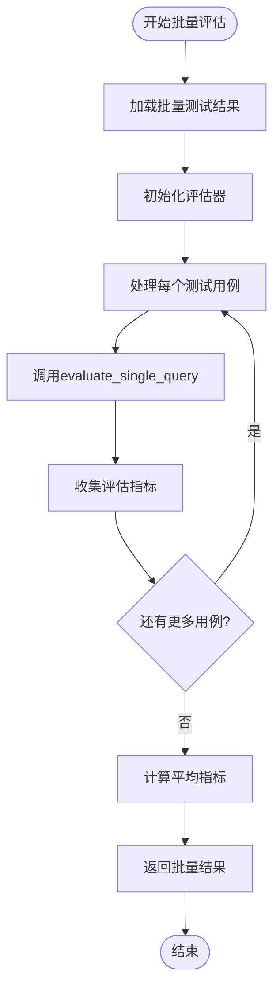
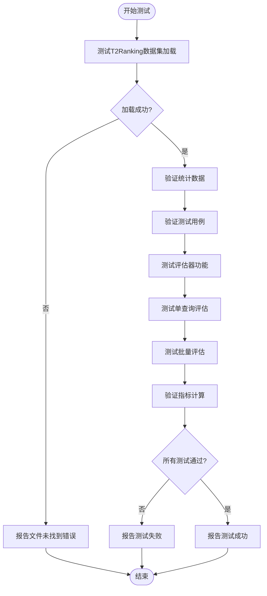
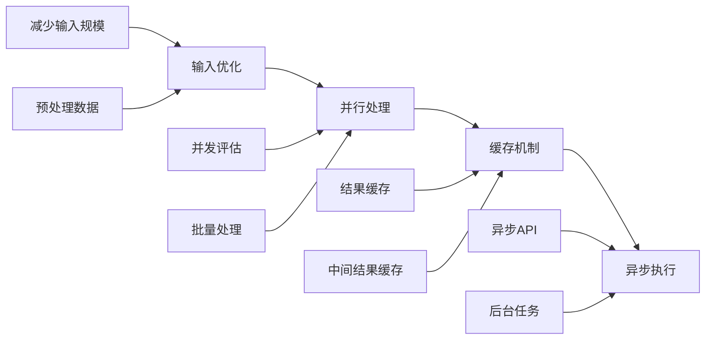

# 评估执行

<cite>
**本文档中引用的文件**
- [retriever_evaluation.py](file://backend/app/controllers/retriever_evaluation.py)
- [retriever_evaluation.py](file://backend/app/services/retriever_evaluation.py)
- [example_t2ranking_usage.py](file://backend/example_t2ranking_usage.py)
- [test_retriever_eval.py](file://backend/test_retriever_eval.py)
- [QUICKSTART_检索器评估.md](file://backend/QUICKSTART_检索器评估.md)
- [retriever_evaluation.py](file://backend/app/models/retriever_evaluation.py)
- [test.py](file://backend/app/schemas/test.py)
- [dataset_loader.py](file://backend/app/services/dataset_loader.py)
</cite>

## 目录
1. [简介](#简介)
2. [项目结构](#项目结构)
3. [核心组件](#核心组件)
4. [架构概览](#架构概览)
5. [详细组件分析](#详细组件分析)
6. [评估指标计算](#评估指标计算)
7. [使用示例](#使用示例)
8. [测试验证](#测试验证)
9. [性能考虑](#性能考虑)
10. [故障排除指南](#故障排除指南)
11. [结论](#结论)

## 简介

检索器评估执行功能是RAG Studio系统中的核心模块，专门用于评估检索器的性能表现。该系统基于T2Ranking标准数据集，提供了全面的检索质量评估能力，包括Precision@K、Recall@K、F1-Score、MRR、MAP、NDCG、Hit Rate等多个评估指标。

系统采用模块化设计，通过RetrieverEvaluationRequest配置参数控制评估过程，利用RetrievalTestRunner协调retriever_func与RetrieverEvaluator完成批量测试，并提供详细的评估结果分析。

## 项目结构

检索器评估系统的文件组织结构清晰，主要分为以下几个层次：



**图表来源**
- [retriever_evaluation.py](file://backend/app/controllers/retriever_evaluation.py#L1-L375)
- [retriever_evaluation.py](file://backend/app/services/retriever_evaluation.py#L1-L423)
- [dataset_loader.py](file://backend/app/services/dataset_loader.py#L1-L261)

**章节来源**
- [retriever_evaluation.py](file://backend/app/controllers/retriever_evaluation.py#L1-L50)
- [retriever_evaluation.py](file://backend/app/services/retriever_evaluation.py#L1-L50)

## 核心组件

### RetrieverEvaluationRequest配置参数

RetrieverEvaluationRequest是评估系统的核心配置类，定义了评估过程的所有关键参数：

| 参数名 | 类型 | 默认值 | 描述 | 影响范围 |
|--------|------|--------|------|----------|
| `kb_id` | str | 必填 | 知识库ID，标识评估的目标知识库 | 检索范围 |
| `test_set_id` | str | 必填 | 测试集ID，指定使用的测试用例集合 | 测试数据源 |
| `top_k` | int | 10 | 检索返回的top-k数量，控制评估结果的数量 | 评估精度 |
| `vector_db_type` | str | None | 向量数据库类型，如elasticsearch、qdrant等 | 检索引擎 |
| `embedding_provider` | str | None | 向量模型提供商，如ollama、openai等 | 嵌入模型 |
| `embedding_model` | str | None | 向量模型名称，如nomic-embed-text | 嵌入质量 |
| `retrieval_algorithm` | str | None | 检索算法配置 | 检索策略 |

### 评估器架构



**图表来源**
- [retriever_evaluation.py](file://backend/app/services/retriever_evaluation.py#L26-L423)
- [retriever_evaluation.py](file://backend/app/models/retriever_evaluation.py#L11-L60)

**章节来源**
- [test.py](file://backend/app/schemas/test.py#L211-L232)
- [retriever_evaluation.py](file://backend/app/services/retriever_evaluation.py#L26-L108)

## 架构概览

检索器评估系统采用分层架构设计，确保了良好的可扩展性和维护性：



**图表来源**
- [retriever_evaluation.py](file://backend/app/controllers/retriever_evaluation.py#L197-L294)
- [retriever_evaluation.py](file://backend/app/services/retriever_evaluation.py#L334-L423)
- [dataset_loader.py](file://backend/app/services/dataset_loader.py#L14-L261)

## 详细组件分析

### RetrieverEvaluator评估器

RetrieverEvaluator是评估系统的核心组件，负责计算各种检索质量指标：

#### 单查询评估流程



**图表来源**
- [retriever_evaluation.py](file://backend/app/services/retriever_evaluation.py#L38-L73)

#### 批量评估流程



**图表来源**
- [retriever_evaluation.py](file://backend/app/services/retriever_evaluation.py#L352-L422)

**章节来源**
- [retriever_evaluation.py](file://backend/app/services/retriever_evaluation.py#L26-L423)

### 数据集加载系统

T2Ranking数据集加载系统提供了高效的数据处理能力：

#### 数据集加载架构



**图表来源**
- [dataset_loader.py](file://backend/app/services/dataset_loader.py#L193-L261)

**章节来源**
- [dataset_loader.py](file://backend/app/services/dataset_loader.py#L14-L261)

## 评估指标计算

### 核心评估指标详解

#### Precision@K（精确率）

Precision@K衡量检索结果中相关文档的比例，公式为：

```
Precision@K = |检索到的相关文档| / |检索到的文档总数|
```

**特点：**
- 范围：0 ≤ Precision@K ≤ 1
- 值越高表示检索结果越准确
- 关注检索结果的质量而非数量

#### Recall@K（召回率）

Recall@K衡量相关文档被检索到的比例，公式为：

```
Recall@K = |检索到的相关文档| / |所有相关文档总数|
```

**特点：**
- 范围：0 ≤ Recall@K ≤ 1
- 值越高表示检索结果越完整
- 关注检索结果的完整性

#### F1-Score（F1分数）

F1-Score是精确率和召回率的调和平均，公式为：

```
F1-Score = 2 * (Precision * Recall) / (Precision + Recall)
```

**特点：**
- 平衡精确率和召回率的综合指标
- 当Precision和Recall都很高时得分最高
- 适用于需要平衡两个指标的场景

#### MRR（平均倒数排名）

MRR关注第一个相关文档的排名位置，公式为：

```
MRR = 1 / rank_of_first_relevant_doc
```

**特点：**
- 范围：0 ≤ MRR ≤ 1
- 值越高表示相关文档排名越靠前
- 对排序质量非常敏感

#### MAP（平均精度均值）

MAP考虑所有相关文档的位置，公式为：

```
MAP = (sum of P@k for each relevant doc) / |relevant docs|
```

**特点：**
- 范围：0 ≤ MAP ≤ 1
- 考虑了所有相关文档的位置信息
- 综合评估检索质量和排序

#### NDCG（归一化折损累积增益）

NDCG考虑了检索结果的排序质量，公式为：

```
NDCG@K = DCG@K / IDCG@K
```

其中：
- DCG@K = Σ(rel_i / log2(i+1)) （实际排序的增益）
- IDCG@K = Σ(rel_i / log2(i+1)) （理想排序的增益）

**特点：**
- 范围：0 ≤ NDCG ≤ 1
- 考虑了排序位置的重要性
- 对高质量结果给予更高权重

#### Hit Rate（命中率）

Hit Rate衡量至少检索到一个相关文档的比例，公式为：

```
Hit Rate = 1 if 至少有一个相关文档被检索到, 0 otherwise
```

**特点：**
- 范围：0 ≤ Hit Rate ≤ 1
- 衡量检索器的基本可用性
- 对于某些应用场景非常重要

**章节来源**
- [retriever_evaluation.py](file://backend/app/services/retriever_evaluation.py#L109-L248)

## 使用示例

### 单次查询评估

基于example_t2ranking_usage.py中的示例，展示了单次查询评估的使用模式：



**图表来源**
- [example_t2ranking_usage.py](file://backend/example_t2ranking_usage.py#L47-L71)

### 批量评估

批量评估支持同时评估多个查询，提高效率：



**图表来源**
- [example_t2ranking_usage.py](file://backend/example_t2ranking_usage.py#L73-L106)

### 配置对比

系统支持对比不同检索器配置的性能：

| 配置维度 | 评估指标 | 优势 | 劣势 |
|----------|----------|------|------|
| 向量数据库类型 | F1-Score, NDCG | 直接影响检索质量 | 性能差异较大 |
| Embedding模型 | Precision, Recall | 影响语义匹配能力 | 计算成本较高 |
| Top-K参数 | MRR, Hit Rate | 控制检索结果数量 | 需要权衡精度和效率 |
| 检索算法 | MAP, NDCG | 影响排序质量 | 实现复杂度高 |

**章节来源**
- [example_t2ranking_usage.py](file://backend/example_t2ranking_usage.py#L107-L138)

## 测试验证

### 测试用例设计

test_retriever_eval.py提供了完整的测试验证方案：



**图表来源**
- [test_retriever_eval.py](file://backend/test_retriever_eval.py#L11-L149)

### 验证方法

#### 数据集加载验证

测试确保数据集能够正确加载和解析：

- 验证文件路径有效性
- 检查数据格式正确性
- 确认采样功能正常工作
- 验证统计信息计算准确

#### 评估功能验证

验证评估器的各项指标计算：

- 单查询评估准确性
- 批量评估平均值计算
- 边界条件处理（空结果、无相关文档等）
- 数值精度和稳定性

**章节来源**
- [test_retriever_eval.py](file://backend/test_retriever_eval.py#L11-L150)

## 性能考虑

### 数据集规模优化

系统提供了多种优化策略来处理大规模数据集：

| 优化策略 | 参数 | 效果 | 适用场景 |
|----------|------|------|----------|
| 查询采样 | `max_queries` | 减少查询数量 | 快速验证、原型测试 |
| 文档采样 | `max_docs` | 减少文档数量 | 性能测试、内存受限环境 |
| 混合采样 | 同时设置 | 平衡性能和准确性 | 生产环境测试 |
| 渐进式加载 | 分批处理 | 降低内存占用 | 大规模数据集 |

### 评估性能优化



### 内存管理

- 使用生成器避免大量数据同时加载
- 及时释放不需要的数据结构
- 监控内存使用情况，提供警告机制

## 故障排除指南

### 常见问题及解决方案

#### 数据集加载问题

**问题：文件未找到**
- **原因**：数据集文件路径配置错误
- **解决方案**：检查文件路径，确保文件存在且有读取权限

**问题：内存不足**
- **原因**：数据集规模过大
- **解决方案**：使用`max_queries`和`max_docs`参数进行采样

#### 评估结果异常

**问题：评估指标为0或NaN**
- **原因**：检索结果为空或相关文档为空
- **解决方案**：检查检索函数实现，确保返回有效结果

**问题：性能测试过慢**
- **原因**：测试用例数量过多
- **解决方案**：减少测试用例数量或使用采样

#### API调用问题

**问题：HTTP 404错误**
- **原因**：知识库ID或测试集ID不存在
- **解决方案**：确认知识库和测试集已正确创建

**问题：HTTP 500错误**
- **原因**：内部处理异常
- **解决方案**：查看服务器日志，检查参数配置

**章节来源**
- [QUICKSTART_检索器评估.md](file://backend/QUICKSTART_检索器评估.md#L202-L222)

## 结论

检索器评估执行功能为RAG Studio系统提供了全面而强大的评估能力。通过RetrieverEvaluationRequest的灵活配置，RetrieverEvaluator的精确计算，以及RetrievalTestRunner的高效协调，系统能够满足从原型验证到生产部署的各种评估需求。

系统的主要优势包括：

1. **全面的指标覆盖**：支持Precision@K、Recall@K、F1-Score、MRR、MAP、NDCG、Hit Rate等主流评估指标
2. **灵活的配置选项**：通过top_k、vector_db_type、embedding_provider等参数控制评估过程
3. **高效的批量处理**：支持大规模测试用例的并行评估
4. **完善的测试验证**：提供完整的单元测试和集成测试方案
5. **优秀的性能表现**：通过多种优化策略支持大规模数据集评估

未来发展方向：

- 集成更多评估指标和算法
- 支持自定义评估标准
- 提供可视化评估报告
- 实现自动化评估流程

通过持续的优化和完善，检索器评估执行功能将成为RAG系统开发和优化过程中不可或缺的重要工具。