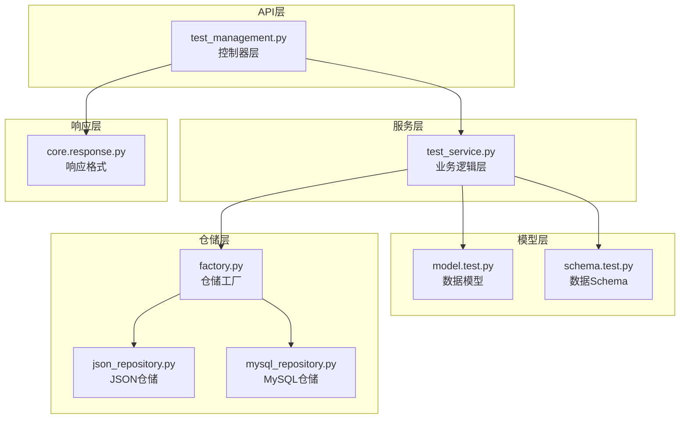
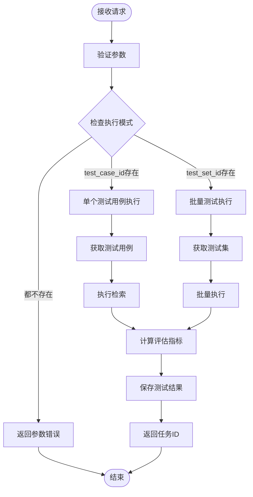
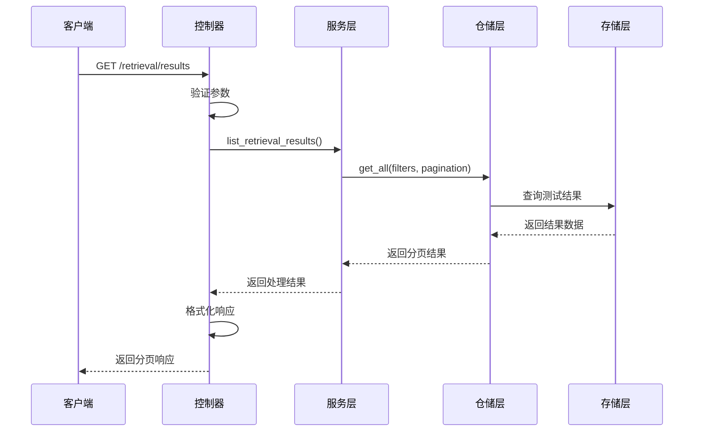
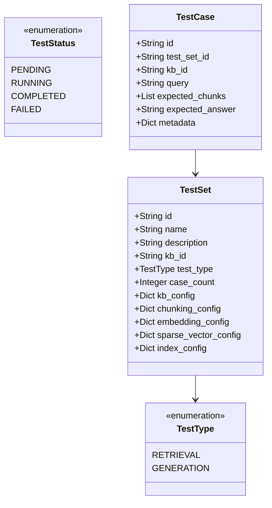
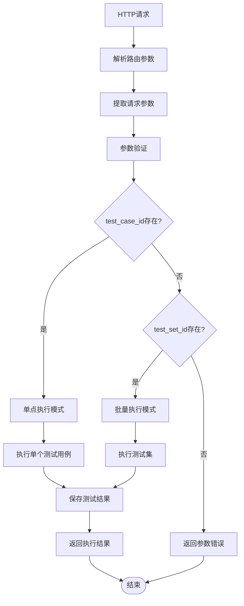
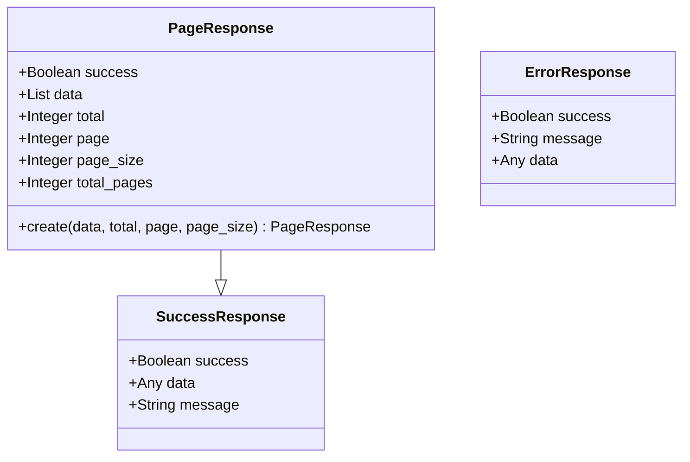
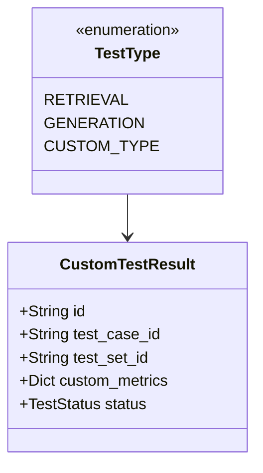

# 测试执行管理模块技术文档

<cite>
**本文档引用的文件**
- [test_management.py](file://backend/app/controllers/test_management.py)
- [test.py](file://backend/app/models/test.py)
- [test.py](file://backend/app/schemas/test.py)
- [test_service.py](file://backend/app/services/test_service.py)
- [factory.py](file://backend/app/repositories/factory.py)
- [response.py](file://backend/app/core/response.py)
- [README_TEST.md](file://backend/README_TEST.md)
- [example_t2ranking_usage.py](file://backend/example_t2ranking_usage.py)
</cite>

## 目录
1. [概述](#概述)
2. [项目架构](#项目架构)
3. [核心组件分析](#核心组件分析)
4. [测试执行API设计](#测试执行api设计)
5. [结果查询API设计](#结果查询api设计)
6. [数据模型与Schema](#数据模型与schema)
7. [路由逻辑与执行模式](#路由逻辑与执行模式)
8. [分页机制与数据过滤](#分页机制与数据过滤)
9. [TODO功能实现指引](#todo功能实现指引)
10. [接口契约与扩展指引](#接口契约与扩展指引)
11. [总结](#总结)

## 概述

测试执行管理模块是RAG Studio系统中的核心功能之一，负责管理检索测试和生成测试的完整生命周期。该模块提供了完整的测试用例管理、测试执行调度、结果收集和评估分析功能。当前实现标记为'TODO'，提供了清晰的接口契约和扩展指引，为后续功能开发奠定了坚实基础。

### 主要功能特性

- **双测试类型支持**：同时支持检索测试（retrieval）和生成测试（generation）
- **灵活执行模式**：支持单个测试用例（test_case_id）和整个测试集（test_set_id）两种执行模式
- **统一结果管理**：提供标准化的测试结果存储和查询接口
- **分页查询机制**：支持大规模测试结果的高效查询和过滤
- **状态跟踪**：完整的测试执行状态管理和进度跟踪

## 项目架构

测试执行管理模块采用分层架构设计，遵循RESTful API设计原则，确保系统的可维护性和扩展性。



**图表来源**
- [test_management.py](file://backend/app/controllers/test_management.py#L1-L534)
- [test_service.py](file://backend/app/services/test_service.py#L1-L374)
- [factory.py](file://backend/app/repositories/factory.py#L1-L116)

## 核心组件分析

### 控制器层（Controllers）

控制器层负责HTTP请求的接收、参数验证和响应格式化。主要包含以下核心组件：

#### 测试集管理控制器
- **创建测试集**：支持配置快照的自动获取和验证
- **测试集列表查询**：支持多维度筛选和分页
- **测试集详情管理**：完整的CRUD操作支持

#### 测试用例管理控制器  
- **测试用例创建**：自动关联知识库配置
- **批量测试用例管理**：支持批量导入和验证
- **测试用例状态跟踪**：实时状态更新

#### 测试执行控制器
- **检索测试执行**：支持单点和批量执行
- **生成测试执行**：集成LLM模型调用
- **执行状态监控**：异步执行状态跟踪

**章节来源**
- [test_management.py](file://backend/app/controllers/test_management.py#L30-L534)

### 服务层（Services）

服务层封装了业务逻辑，提供统一的测试管理接口：

#### 测试服务核心功能
- **测试集生命周期管理**：从创建到删除的完整流程
- **测试用例批量处理**：高效的批量导入和验证机制
- **测试结果聚合**：多维度的数据统计和分析

#### 评估指标计算
- **检索评估指标**：Precision、Recall、F1-score、MRR、NDCG等
- **生成评估指标**：相关性、连贯性、忠实度评分
- **自定义指标支持**：可扩展的评估指标体系

**章节来源**
- [test_service.py](file://backend/app/services/test_service.py#L24-L374)

## 测试执行API设计

### run_retrieval_test - 检索测试执行

检索测试执行API支持两种执行模式，通过参数组合实现灵活的测试调度。



**图表来源**
- [test_management.py](file://backend/app/controllers/test_management.py#L426-L442)
- [test_service.py](file://backend/app/services/test_service.py#L272-L287)

#### 执行模式说明

| 参数组合 | 执行模式 | 描述 | 使用场景 |
|---------|---------|------|----------|
| `test_case_id` | 单点测试 | 执行指定的单个测试用例 | 快速验证特定用例 |
| `test_set_id` | 批量测试 | 执行测试集中的所有测试用例 | 完整测试套件执行 |
| `test_case_id` + `test_set_id` | 优先级模式 | 优先使用test_case_id | 特殊场景覆盖 |

### run_generation_test - 生成测试执行

生成测试执行API在检索测试基础上增加了LLM模型配置选项，支持多种生成模型的测试。

#### 核心参数配置

| 参数名 | 类型 | 必需 | 默认值 | 描述 |
|--------|------|------|--------|------|
| `test_case_id` | String | 否 | null | 单个测试用例ID |
| `test_set_id` | String | 否 | null | 测试集ID |
| `llm_model` | String | 否 | null | 使用的LLM模型 |

**章节来源**
- [test_management.py](file://backend/app/controllers/test_management.py#L481-L498)
- [test_service.py](file://backend/app/services/test_service.py#L306-L322)

## 结果查询API设计

### list_retrieval_test_results - 检索测试结果列表

检索测试结果查询API提供了完整的分页和过滤功能，支持大规模测试结果的高效查询。



**图表来源**
- [test_management.py](file://backend/app/controllers/test_management.py#L445-L462)
- [test_service.py](file://backend/app/services/test_service.py#L289-L302)

#### 分页参数配置

| 参数名 | 类型 | 默认值 | 有效范围 | 描述 |
|--------|------|--------|----------|------|
| `test_set_id` | String | 必需 | - | 测试集ID（必需参数） |
| `page` | Integer | 1 | ≥1 | 页码 |
| `page_size` | Integer | 20 | 1-100 | 每页大小 |

### get_retrieval_test_result - 检索测试结果详情

检索测试结果详情API提供单个测试结果的完整信息查询，包括详细的评估指标和原始数据。

#### 响应数据结构

| 字段名 | 类型 | 描述 |
|--------|------|------|
| `id` | String | 测试结果唯一标识 |
| `test_case_id` | String | 关联的测试用例ID |
| `test_set_id` | String | 关联的测试集ID |
| `query` | String | 测试查询内容 |
| `retrieved_chunks` | Array | 检索到的文档分块列表 |
| `retrieval_time` | Float | 检索耗时（秒） |
| `precision` | Float | 精确率（0.0-1.0） |
| `recall` | Float | 召回率（0.0-1.0） |
| `f1_score` | Float | F1分数（0.0-1.0） |
| `mrr` | Float | 平均倒数排名 |
| `ndcg` | Float | 归一化折损累积增益 |
| `status` | String | 测试状态 |

**章节来源**
- [test_management.py](file://backend/app/controllers/test_management.py#L465-L476)
- [test_service.py](file://backend/app/services/test_service.py#L289-L302)

### list_generation_test_results - 生成测试结果列表

生成测试结果查询API与检索测试结果API类似，但包含生成特定的评估指标。

#### 生成测试特有指标

| 指标名称 | 类型 | 描述 |
|----------|------|------|
| `relevance_score` | Float | 相关性分数（0.0-1.0） |
| `coherence_score` | Float | 连贯性分数（0.0-1.0） |
| `faithfulness_score` | Float | 忠实度分数（0.0-1.0） |
| `llm_model` | String | 使用的LLM模型名称 |
| `generated_answer` | String | 生成的答案内容 |

### get_generation_test_result - 生成测试结果详情

生成测试结果详情API提供完整的生成测试信息，包括检索上下文、生成内容和评估指标。

**章节来源**
- [test_management.py](file://backend/app/controllers/test_management.py#L501-L532)
- [test_service.py](file://backend/app/services/test_service.py#L325-L338)

## 数据模型与Schema

### 测试类型枚举



**图表来源**
- [test.py](file://backend/app/models/test.py#L12-L24)
- [test.py](file://backend/app/models/test.py#L26-L227)

### 请求和响应Schema

#### 执行请求Schema

| Schema名称 | 用途 | 主要字段 |
|------------|------|----------|
| `RunRetrievalTestRequest` | 检索测试执行 | `test_case_id`, `test_set_id`, `top_k`, `score_threshold` |
| `RunGenerationTestRequest` | 生成测试执行 | `test_case_id`, `test_set_id`, `llm_model` |

#### 结果响应Schema

| Schema名称 | 用途 | 包含指标 |
|------------|------|----------|
| `RetrievalTestResultResponse` | 检索测试结果 | precision, recall, f1_score, mrr, ndcg, hit_rate |
| `GenerationTestResultResponse` | 生成测试结果 | relevance_score, coherence_score, faithfulness_score |

**章节来源**
- [test.py](file://backend/app/schemas/test.py#L119-L299)

## 路由逻辑与执行模式

### 路由设计原则

测试执行管理模块采用RESTful路由设计，遵循资源导向的URL结构：

#### 检索测试路由
- **POST** `/tests/retrieval/run` - 执行检索测试
- **GET** `/tests/retrieval/results` - 获取检索测试结果列表
- **GET** `/tests/retrieval/results/{result_id}` - 获取检索测试结果详情

#### 生成测试路由
- **POST** `/tests/generation/run` - 执行生成测试
- **GET** `/tests/generation/results` - 获取生成测试结果列表
- **GET** `/tests/generation/results/{result_id}` - 获取生成测试结果详情

### 执行模式路由逻辑



**图表来源**
- [test_management.py](file://backend/app/controllers/test_management.py#L426-L442)
- [test_management.py](file://backend/app/controllers/test_management.py#L481-L498)

## 分页机制与数据过滤

### 分页响应格式

系统采用统一的分页响应格式，提供完整的分页信息：



**图表来源**
- [response.py](file://backend/app/core/response.py#L19-L58)

### 分页参数配置

| 参数 | 类型 | 默认值 | 说明 |
|------|------|--------|------|
| `page` | Integer | 1 | 当前页码，从1开始 |
| `page_size` | Integer | 20 | 每页记录数，最大100 |
| `total` | Integer | 0 | 总记录数 |
| `total_pages` | Integer | 0 | 总页数 |

### 数据过滤机制

#### 测试集过滤
- **知识库ID过滤**：按关联知识库筛选测试集
- **测试类型过滤**：按检索或生成类型筛选
- **时间范围过滤**：按创建时间范围筛选

#### 测试结果过滤
- **测试集ID过滤**：按所属测试集筛选结果
- **状态过滤**：按执行状态筛选结果
- **时间范围过滤**：按执行时间范围筛选

**章节来源**
- [response.py](file://backend/app/core/response.py#L82-L105)
- [test_service.py](file://backend/app/services/test_service.py#L95-L113)

## TODO功能实现指引

### 当前TODO状态

根据代码分析，测试执行管理模块目前标记为'TODO'的功能包括：

#### 检索测试执行（run_retrieval_test）
- **功能缺失**：完整的检索测试执行逻辑
- **待实现步骤**：
  1. 获取测试用例或测试集信息
  2. 执行检索操作（调用向量数据库）
  3. 计算评估指标
  4. 保存测试结果

#### 生成测试执行（run_generation_test）
- **功能缺失**：生成测试的完整执行流程
- **待实现步骤**：
  1. 获取测试用例和检索结果
  2. 调用LLM模型生成答案
  3. 计算生成质量指标
  4. 保存生成测试结果

#### 结果查询功能
- **功能缺失**：完整的测试结果查询和过滤
- **待实现功能**：
  1. 支持多维度结果查询
  2. 实现高级过滤条件
  3. 添加结果导出功能

### 实现建议

#### 接口契约保持
- **向前兼容**：现有接口签名保持不变
- **响应格式**：继续使用统一的成功/错误响应格式
- **参数验证**：维持现有的参数验证逻辑

#### 扩展指引
- **异步执行**：支持长时间运行的测试任务
- **进度跟踪**：提供测试执行进度查询
- **并发控制**：实现测试任务的并发执行管理

**章节来源**
- [test_management.py](file://backend/app/controllers/test_management.py#L436-L442)
- [test_management.py](file://backend/app/controllers/test_management.py#L492-L498)
- [test_service.py](file://backend/app/services/test_service.py#L277-L287)
- [test_service.py](file://backend/app/services/test_service.py#L312-L322)

## 接口契约与扩展指引

### 标准接口契约

#### 成功响应格式
```json
{
  "success": true,
  "data": {},
  "message": "操作成功"
}
```

#### 分页响应格式
```json
{
  "success": true,
  "data": [],
  "total": 0,
  "page": 1,
  "page_size": 20,
  "total_pages": 0
}
```

#### 错误响应格式
```json
{
  "success": false,
  "message": "错误描述",
  "data": null
}
```

### 扩展接口设计

#### 新增测试类型支持


#### 自定义评估指标
- **扩展评估指标**：支持用户自定义评估指标
- **插件化架构**：允许第三方评估指标插件
- **动态配置**：支持运行时配置评估指标

### 性能优化建议

#### 缓存策略
- **结果缓存**：缓存频繁查询的测试结果
- **配置缓存**：缓存知识库配置信息
- **元数据缓存**：缓存测试集统计信息

#### 异步处理
- **批量处理**：支持批量测试用例的异步执行
- **后台队列**：使用消息队列处理长时间运行的任务
- **进度通知**：提供测试执行进度的通知机制

**章节来源**
- [response.py](file://backend/app/core/response.py#L68-L120)
- [test_service.py](file://backend/app/services/test_service.py#L24-L374)

## 总结

测试执行管理模块作为RAG Studio系统的核心功能，展现了良好的架构设计和清晰的接口契约。虽然当前实现标记为'TODO'，但已经建立了完整的框架基础，包括：

### 核心优势
- **完整的API设计**：涵盖了测试管理的全生命周期
- **灵活的执行模式**：支持单点和批量测试执行
- **标准化的数据模型**：提供了统一的数据结构和验证机制
- **可扩展的架构**：预留了充分的扩展空间

### 发展方向
- **功能完善**：实现完整的测试执行和评估功能
- **性能优化**：优化大规模测试场景的处理能力
- **用户体验**：提供更好的测试管理和监控体验
- **生态集成**：与其他系统模块的深度集成

该模块为RAG Studio的测试能力奠定了坚实基础，通过持续的功能完善和性能优化，将成为系统中不可或缺的核心组件。