# 测试用例管理模块技术文档

<cite>
**本文档引用的文件**
- [test_management.py](file://backend/app/controllers/test_management.py)
- [test_service.py](file://backend/app/services/test_service.py)
- [test.py](file://backend/app/models/test.py)
- [test.py](file://backend/app/schemas/test.py)
- [models.py](file://backend/app/database/models.py)
- [factory.py](file://backend/app/repositories/factory.py)
- [mysql_repository.py](file://backend/app/repositories/mysql_repository.py)
- [json_repository.py](file://backend/app/repositories/json_repository.py)
- [example_t2ranking_usage.py](file://backend/example_t2ranking_usage.py)
</cite>

## 目录
1. [概述](#概述)
2. [系统架构](#系统架构)
3. [核心API详解](#核心api详解)
4. [测试用例模型分析](#测试用例模型分析)
5. [数据流与业务逻辑](#数据流与业务逻辑)
6. [批量创建机制](#批量创建机制)
7. [测试集与测试用例关系](#测试集与测试用例关系)
8. [评估流程中的字段作用](#评估流程中的字段作用)
9. [错误处理与异常管理](#错误处理与异常管理)
10. [性能优化策略](#性能优化策略)

## 概述

测试用例管理模块是RAG Studio系统的核心组件之一，负责管理测试集和测试用例的全生命周期。该模块提供了完整的CRUD操作接口，支持批量创建、级联删除等功能，并与评估系统紧密集成，为检索器和生成器的性能评估提供基础数据支撑。

### 主要功能特性

- **测试集管理**: 支持创建、查询、更新、删除测试集
- **测试用例管理**: 提供单个和批量测试用例创建、查询、更新、删除功能
- **自动计数**: 在创建和删除测试用例时自动更新测试集的case_count计数器
- **配置快照**: 支持知识库配置的自动快照和手动指定
- **批量操作**: 支持批量创建测试用例，具备部分成功处理能力
- **级联删除**: 删除测试集时自动清理关联的测试用例

## 系统架构

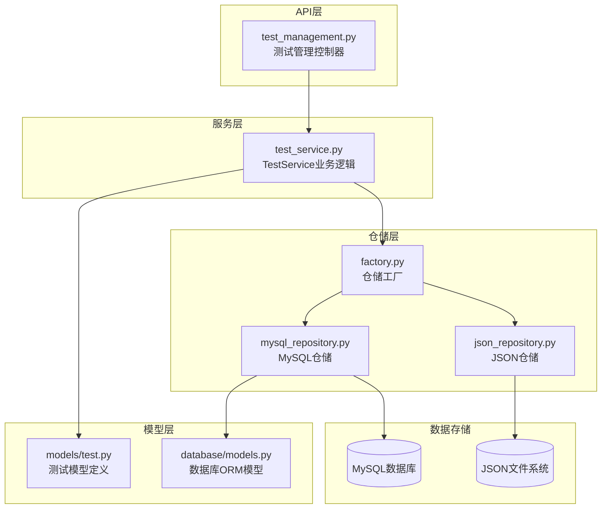

**图表来源**
- [test_management.py](file://backend/app/controllers/test_management.py#L1-L534)
- [test_service.py](file://backend/app/services/test_service.py#L1-L374)
- [factory.py](file://backend/app/repositories/factory.py#L1-L116)

**章节来源**
- [test_management.py](file://backend/app/controllers/test_management.py#L1-L50)
- [test_service.py](file://backend/app/services/test_service.py#L1-L50)

## 核心API详解

### create_test_case - 创建测试用例

创建测试用例是测试用例管理的核心API，负责验证测试集存在性并创建新的测试用例实例。

#### API签名
```python
@router.post("/test-cases", response_model=None, summary="创建测试用例")
async def create_test_case(data: TestCaseCreate):
```

#### 核心实现逻辑

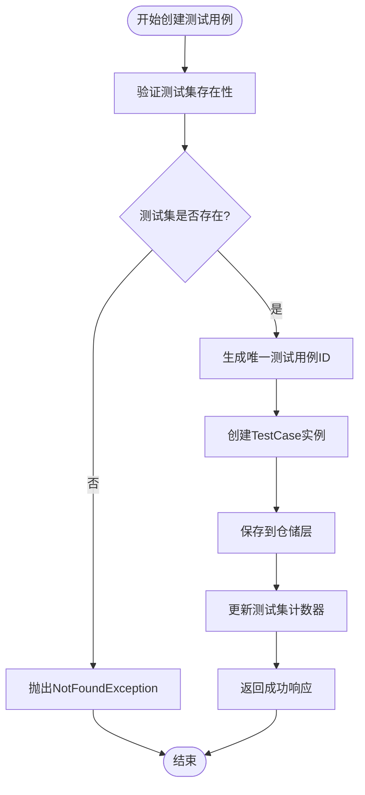

**图表来源**
- [test_service.py](file://backend/app/services/test_service.py#L144-L165)

#### 关键特性

1. **测试集验证**: 在创建测试用例前必须验证关联的测试集存在
2. **唯一标识**: 使用UUID生成唯一的测试用例ID
3. **自动计数**: 创建成功后自动增加测试集的case_count计数器
4. **数据完整性**: 确保测试用例包含必要的字段（test_set_id, kb_id）

**章节来源**
- [test_management.py](file://backend/app/controllers/test_management.py#L243-L278)
- [test_service.py](file://backend/app/services/test_service.py#L144-L165)

### list_test_cases - 获取测试用例列表

提供分页查询测试用例列表的功能，支持按测试集ID过滤。

#### API签名
```python
@router.get("/test-cases", response_model=None, summary="获取测试用例列表")
async def list_test_cases(
    test_set_id: str = Query(..., description="测试集ID"),
    page: int = Query(1, ge=1, description="页码"),
    page_size: int = Query(20, ge=1, le=100, description="每页大小"),
):
```

#### 分页查询流程

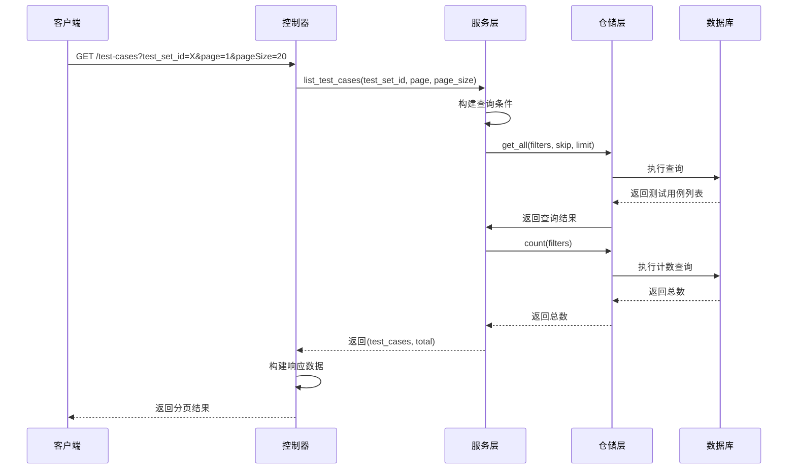

**图表来源**
- [test_service.py](file://backend/app/services/test_service.py#L228-L241)
- [test_management.py](file://backend/app/controllers/test_management.py#L281-L317)

**章节来源**
- [test_management.py](file://backend/app/controllers/test_management.py#L281-L317)
- [test_service.py](file://backend/app/services/test_service.py#L228-L241)

### get_test_case - 获取测试用例详情

根据测试用例ID获取详细的测试用例信息。

#### 实现特点

- **唯一性验证**: 确保测试用例存在后再返回
- **完整信息**: 包含query、expected_chunks、expected_answer、metadata等完整字段
- **时间戳**: 返回创建时间和更新时间

**章节来源**
- [test_management.py](file://backend/app/controllers/test_management.py#L320-L350)

### update_test_case - 更新测试用例

支持对测试用例的部分字段进行更新，采用PATCH语义的更新方式。

#### 更新机制

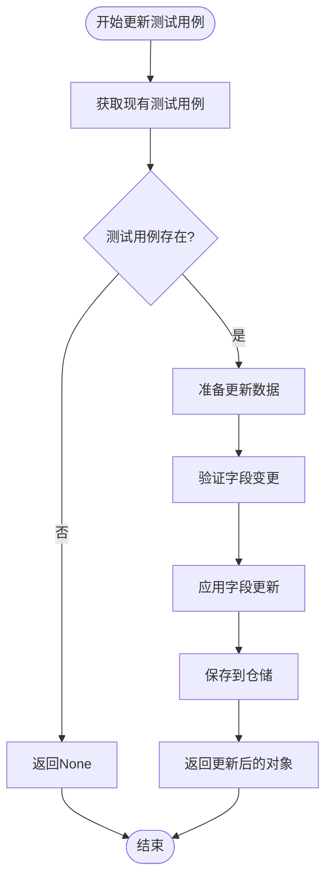

**图表来源**
- [test_service.py](file://backend/app/services/test_service.py#L243-L256)

**章节来源**
- [test_management.py](file://backend/app/controllers/test_management.py#L353-L383)
- [test_service.py](file://backend/app/services/test_service.py#L243-L256)

### delete_test_case - 删除测试用例

删除测试用例并自动维护测试集的计数器。

#### 删除流程

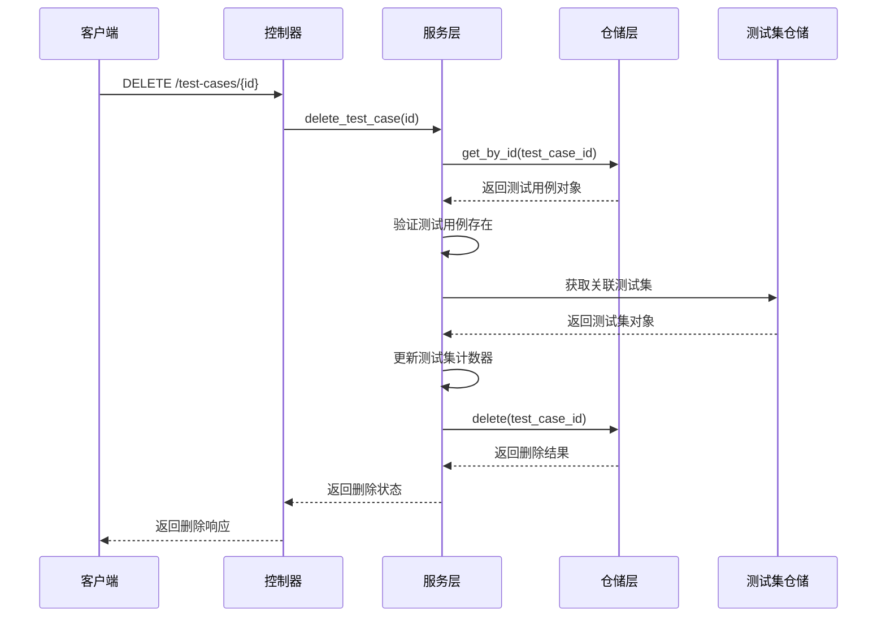

**图表来源**
- [test_service.py](file://backend/app/services/test_service.py#L256-L268)

#### 计数器维护

删除测试用例时，服务层会自动更新关联测试集的case_count计数器：

```python
# 更新测试集的用例数量
test_set = await self.test_set_repo.get_by_id(test_case.test_set_id)
if test_set:
    test_set.case_count = max(0, test_set.case_count - 1)
    await self.test_set_repo.update(test_set.id, test_set)
```

**章节来源**
- [test_management.py](file://backend/app/controllers/test_management.py#L386-L421)
- [test_service.py](file://backend/app/services/test_service.py#L256-L268)

## 测试用例模型分析

### TestCase模型结构

测试用例模型包含了评估过程中所需的所有关键字段：

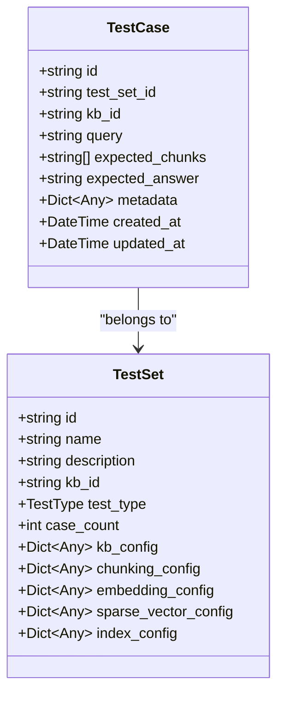

**图表来源**
- [test.py](file://backend/app/models/test.py#L83-L113)
- [test.py](file://backend/app/models/test.py#L26-L81)

### 字段详解

#### 必需字段

1. **test_set_id**: 关联的测试集ID，建立测试用例与测试集的一对多关系
2. **kb_id**: 关联的知识库ID，确保测试用例与正确的知识库环境匹配
3. **query**: 测试问题或查询文本，是评估的基础输入

#### 评估相关字段

1. **expected_chunks**: 期望检索到的文档分块ID列表，用于精确率和召回率计算
2. **expected_answer**: 期望的答案文本，用于生成测试的评估

#### 辅助字段

1. **metadata**: 存储测试用例的元数据信息，如原始查询ID、相关文档ID等
2. **created_at/updated_at**: 时间戳字段，记录创建和更新时间

**章节来源**
- [test.py](file://backend/app/models/test.py#L83-L113)

## 数据流与业务逻辑

### 创建测试用例的数据流

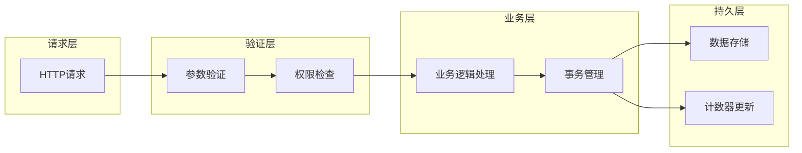

**图表来源**
- [test_management.py](file://backend/app/controllers/test_management.py#L243-L278)
- [test_service.py](file://backend/app/services/test_service.py#L144-L165)

### 错误处理机制

系统实现了多层次的错误处理：

1. **参数验证**: Pydantic模型自动验证输入参数
2. **业务验证**: 服务层验证业务规则（如测试集存在性）
3. **数据一致性**: 仓储层保证数据操作的原子性
4. **异常捕获**: 统一的异常处理和响应格式

**章节来源**
- [test_management.py](file://backend/app/controllers/test_management.py#L243-L278)
- [test_service.py](file://backend/app/services/test_service.py#L144-L165)

## 批量创建机制

### batch_create_test_cases - 批量创建测试用例

批量创建功能支持一次性创建多个测试用例，具备部分成功处理能力。

#### API签名
```python
async def batch_create_test_cases(
    self,
    test_set_id: str,
    test_cases_data: List[Dict[str, Any]]
) -> Tuple[List[TestCase], List[Dict]]:
```

#### 批量创建流程

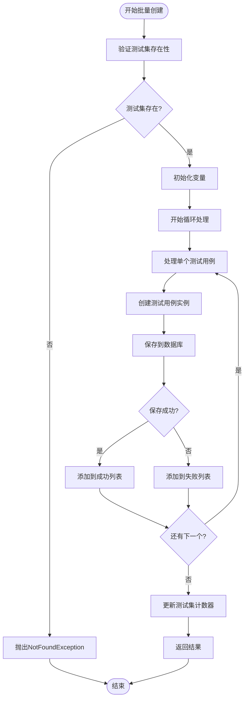

**图表来源**
- [test_service.py](file://backend/app/services/test_service.py#L167-L222)

#### 部分成功处理

批量创建支持部分成功场景，即使某些测试用例创建失败，其他成功的测试用例仍然会被保存：

```python
# 失败记录格式
failed_records = [{
    "index": idx,           # 原始索引位置
    "query": case_data.get("query", ""),  # 失败的查询内容
    "error": str(e)         # 错误信息
}]
```

#### 性能优化

1. **批量操作**: 使用单次数据库操作处理多个测试用例
2. **事务管理**: 确保批量操作的原子性
3. **计数器优化**: 只在最后统一更新测试集计数器

**章节来源**
- [test_service.py](file://backend/app/services/test_service.py#L167-L222)

## 测试集与测试用例关系

### 从属关系设计

测试用例与测试集之间存在明确的一对多关系：

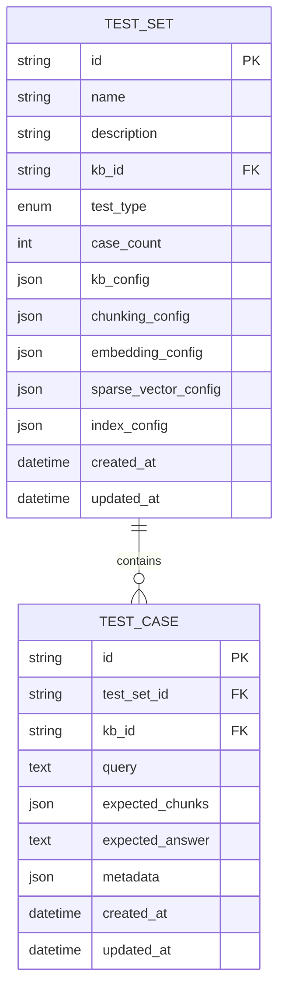

**图表来源**
- [models.py](file://backend/app/database/models.py#L23-L59)
- [models.py](file://backend/app/database/models.py#L45-L59)

### 级联操作

#### 删除测试集时的级联删除

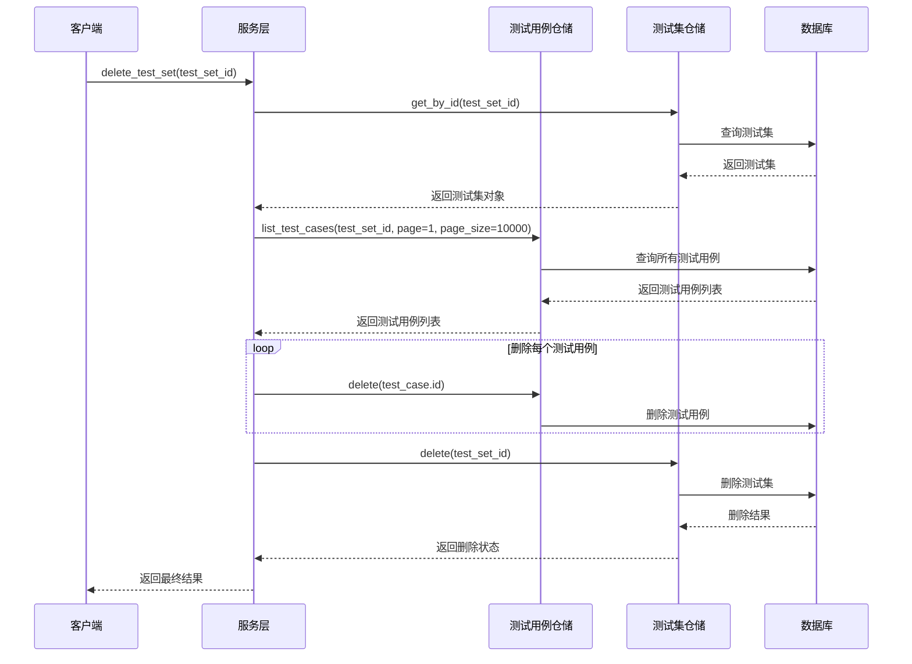

**图表来源**
- [test_service.py](file://backend/app/services/test_service.py#L128-L141)

#### 计数器同步机制

每次创建或删除测试用例时，系统都会自动维护测试集的case_count计数器：

```python
# 创建时增加计数器
test_set.case_count += 1
await self.test_set_repo.update(test_set.id, test_set)

# 删除时减少计数器
test_set.case_count = max(0, test_set.case_count - 1)
await self.test_set_repo.update(test_set.id, test_set)
```

**章节来源**
- [test_service.py](file://backend/app/services/test_service.py#L128-L141)
- [test_service.py](file://backend/app/services/test_service.py#L144-L165)
- [test_service.py](file://backend/app/services/test_service.py#L256-L268)

## 评估流程中的字段作用

### query字段的作用

query字段是评估流程的核心输入，用于：

1. **检索测试**: 作为检索系统的查询输入
2. **生成测试**: 作为LLM生成答案的基础问题
3. **评估基准**: 与其他系统的输出进行对比

### expected_chunks字段的作用

expected_chunks字段在评估流程中发挥关键作用：

#### 精确率和召回率计算

```python
# 精确率 = 交集元素数量 / 检索到的元素数量
precision = len(set(retrieved_chunks) & set(expected_chunks)) / len(retrieved_chunks)

# 召回率 = 交集元素数量 / 期望的元素数量
recall = len(set(retrieved_chunks) & set(expected_chunks)) / len(expected_chunks)
```

#### 排序质量评估

expected_chunks还用于计算排序相关的评估指标：

- **MRR (Mean Reciprocal Rank)**: 平均倒数排名
- **NDCG (Normalized Discounted Cumulative Gain)**: 归一化折损累积增益
- **MAP (Mean Average Precision)**: 平均精度均值

### expected_answer字段的作用

expected_answer字段主要用于生成测试的评估：

1. **答案质量评估**: 与生成的答案进行对比
2. **相关性评分**: 评估生成答案的相关程度
3. **忠实度评估**: 检查生成答案是否忠实于原始问题

**章节来源**
- [test.py](file://backend/app/models/test.py#L83-L113)

## 错误处理与异常管理

### 异常层次结构

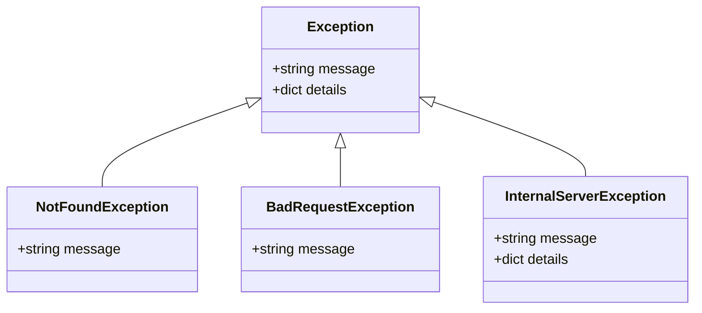

**图表来源**
- [test_management.py](file://backend/app/controllers/test_management.py#L21-L22)

### 异常处理策略

#### 1. 参数验证异常

```python
# Pydantic自动验证
try:
    test_case = TestCase(**data)
except ValidationError as e:
    # 自动返回422 Unprocessable Entity
    pass
```

#### 2. 业务逻辑异常

```python
# 测试集不存在
if not test_set:
    raise NotFoundException(message=f"测试集不存在: {data.test_set_id}")

# 测试用例不存在
if not test_case:
    return None
```

#### 3. 数据库异常

```python
# 事务回滚
try:
    await self.test_case_repo.create(test_case)
    await self.test_set_repo.update(test_set.id, test_set)
except Exception as e:
    # 自动回滚事务
    raise InternalServerException(message="创建测试用例失败")
```

#### 4. 响应格式标准化

所有异常都通过统一的响应格式返回：

```python
{
    "success": false,
    "message": "错误描述",
    "data": null,
    "error": {
        "code": "ERROR_CODE",
        "details": {...}
    }
}
```

**章节来源**
- [test_management.py](file://backend/app/controllers/test_management.py#L243-L278)
- [test_service.py](file://backend/app/services/test_service.py#L147-L149)

## 性能优化策略

### 数据库优化

#### 索引设计

```sql
-- 测试集索引
CREATE INDEX idx_test_sets_kb_id ON test_sets(kb_id);
CREATE INDEX idx_test_sets_test_type ON test_sets(test_type);

-- 测试用例索引
CREATE INDEX idx_test_cases_test_set_id ON test_cases(test_set_id);
CREATE INDEX idx_test_cases_kb_id ON test_cases(kb_id);
```

#### 分页查询优化

```python
# 使用skip和limit进行高效分页
skip = (page - 1) * page_size
cases = await self.test_case_repo.get_all(
    skip=skip, 
    limit=page_size, 
    filters=filters
)
```

### 缓存策略

#### 测试集缓存

```python
# 缓存测试集信息，避免重复查询
@lru_cache(maxsize=100)
async def get_test_set_cached(test_set_id: str):
    return await self.test_set_repo.get_by_id(test_set_id)
```

#### 计数器优化

```python
# 批量更新计数器，减少数据库访问
async def batch_update_counters(test_set_updates: List[Dict]):
    # 批量更新多个测试集的计数器
    pass
```

### 批量操作优化

#### 批量插入

```python
# 使用批量插入提高性能
async def batch_create_test_cases_optimized(self, test_cases: List[TestCase]):
    # 使用数据库的批量插入功能
    await self.test_case_repo.bulk_create(test_cases)
```

#### 事务优化

```python
# 使用事务确保数据一致性
async def create_test_case_with_transaction(self, data: TestCaseCreate):
    async with self.db.transaction():
        # 创建测试用例
        # 更新计数器
        # 提交事务
```

**章节来源**
- [mysql_repository.py](file://backend/app/repositories/mysql_repository.py#L19-L60)
- [test_service.py](file://backend/app/services/test_service.py#L167-L222)

## 总结

测试用例管理模块通过精心设计的架构和完善的业务逻辑，为RAG Studio系统提供了可靠的测试用例管理能力。模块的主要优势包括：

1. **完整的CRUD功能**: 支持测试用例的全生命周期管理
2. **自动计数机制**: 确保测试集计数器的准确性
3. **批量操作支持**: 提高大规模测试用例创建的效率
4. **级联删除保护**: 避免数据不一致问题
5. **标准化的错误处理**: 提供清晰的错误信息和响应格式
6. **灵活的存储后端**: 支持MySQL和JSON两种存储方式

该模块与评估系统的深度集成，为检索器和生成器的性能评估提供了坚实的数据基础，是整个RAG Studio系统的重要组成部分。