# 测试管理控制器技术文档

<cite>
**本文档引用的文件**
- [test_management.py](file://backend/app/controllers/test_management.py)
- [test_service.py](file://backend/app/services/test_service.py)
- [test.py](file://backend/app/models/test.py)
- [test.py](file://backend/app/schemas/test.py)
- [factory.py](file://backend/app/repositories/factory.py)
- [response.py](file://backend/app/core/response.py)
- [exceptions.py](file://backend/app/core/exceptions.py)
- [base.py](file://backend/app/models/base.py)
</cite>

## 目录
1. [概述](#概述)
2. [项目结构](#项目结构)
3. [核心组件](#核心组件)
4. [架构概览](#架构概览)
5. [详细组件分析](#详细组件分析)
6. [依赖关系分析](#依赖关系分析)
7. [性能考虑](#性能考虑)
8. [故障排除指南](#故障排除指南)
9. [结论](#结论)

## 概述

测试管理控制器是RAG Studio系统中的核心组件，负责管理测试集和测试用例的全生命周期，包括创建、查询、更新、删除以及测试执行功能。该控制器采用分层架构设计，通过TestService协调业务逻辑，实现了与知识库服务的跨服务调用，并提供了完善的错误处理机制。

系统支持两种主要的测试类型：
- **检索测试（Retrieval Test）**：验证检索系统的准确性
- **生成测试（Generation Test）**：验证生成式AI的回答质量

## 项目结构

测试管理控制器的项目结构遵循典型的分层架构模式：

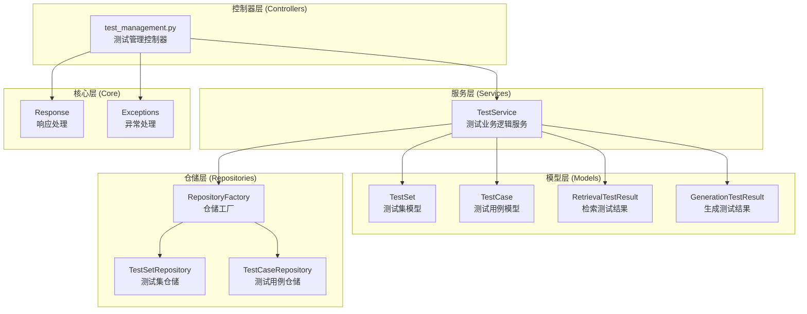

**图表来源**
- [test_management.py](file://backend/app/controllers/test_management.py#L1-L534)
- [test_service.py](file://backend/app/services/test_service.py#L1-L374)
- [factory.py](file://backend/app/repositories/factory.py#L1-L116)

**章节来源**
- [test_management.py](file://backend/app/controllers/test_management.py#L1-L534)
- [test_service.py](file://backend/app/services/test_service.py#L1-L374)

## 核心组件

### 测试集管理模块

测试集管理模块负责测试集的全生命周期管理，包括创建、查询、更新和删除操作。

#### 主要功能
- **创建测试集**：支持配置快照的自动获取和手动指定
- **查询测试集**：支持按知识库ID和测试类型筛选的分页查询
- **更新测试集**：动态更新测试集属性
- **删除测试集**：级联删除关联的测试用例

#### 配置快照机制

测试集创建时支持配置快照功能，当未提供配置时系统会自动从关联的知识库获取配置：

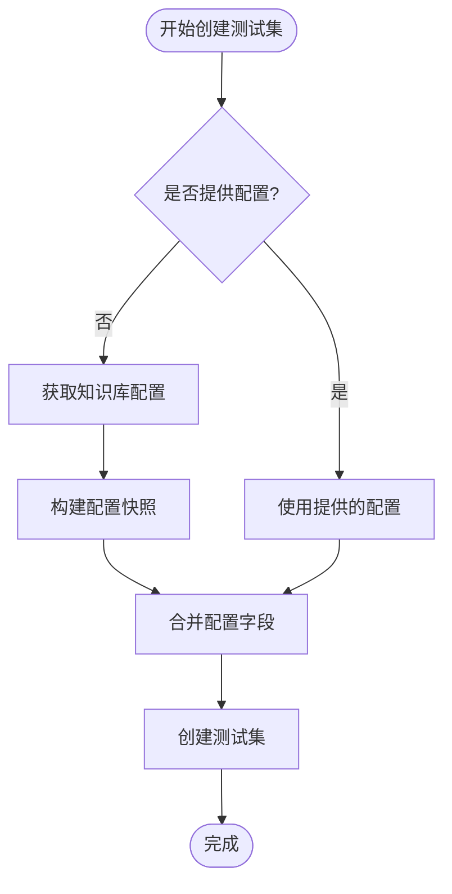

**图表来源**
- [test_service.py](file://backend/app/services/test_service.py#L35-L89)

### 测试用例管理模块

测试用例管理模块提供灵活的测试用例管理功能，支持单个创建和批量创建。

#### 批量创建功能

系统提供了强大的批量创建功能，支持错误处理和部分成功场景：

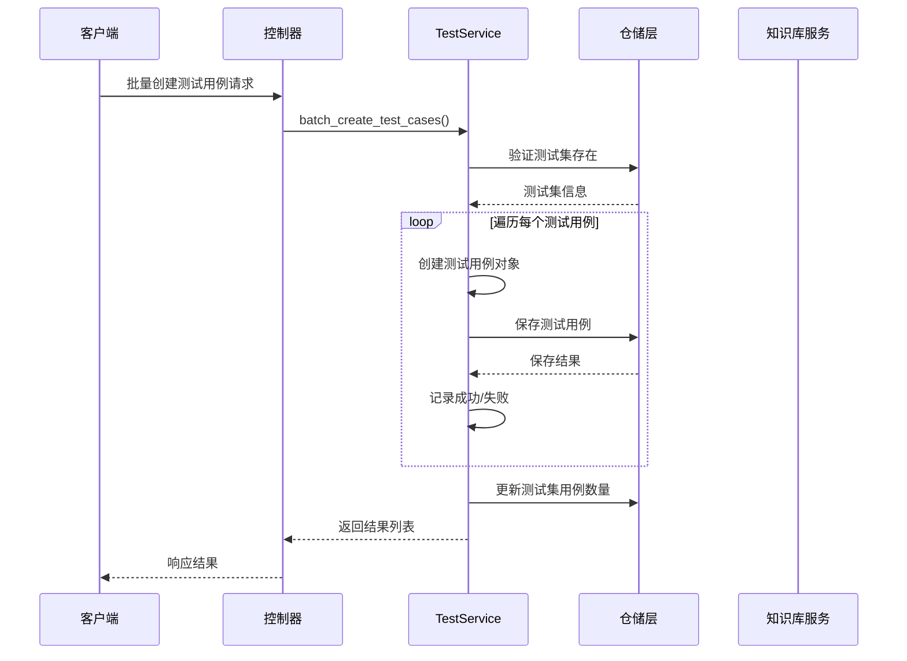

**图表来源**
- [test_service.py](file://backend/app/services/test_service.py#L167-L222)

### 测试执行模块

测试执行模块负责启动检索测试和生成测试任务，目前处于待实现状态。

#### 执行流程

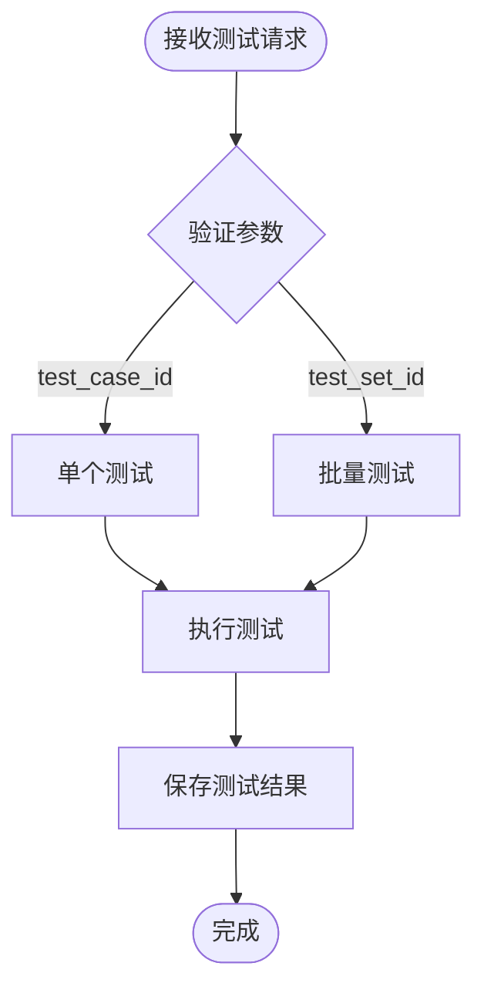

**图表来源**
- [test_management.py](file://backend/app/controllers/test_management.py#L426-L533)

**章节来源**
- [test_management.py](file://backend/app/controllers/test_management.py#L32-L534)
- [test_service.py](file://backend/app/services/test_service.py#L35-L374)

## 架构概览

测试管理控制器采用经典的三层架构模式，确保了良好的分离关注点和可维护性。

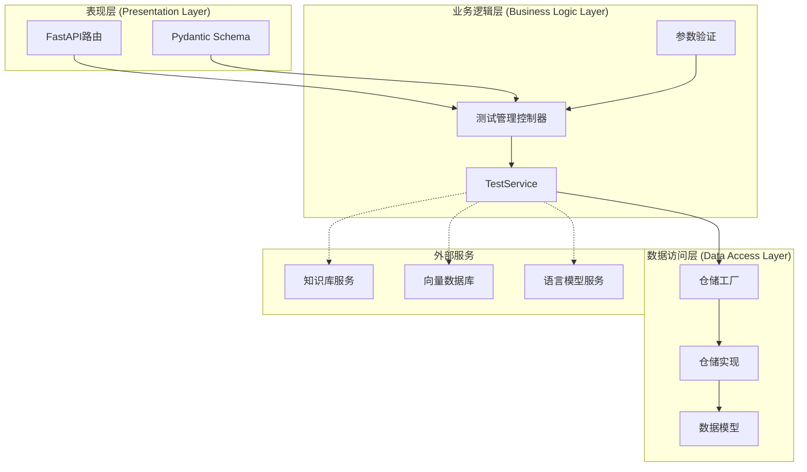

**图表来源**
- [test_management.py](file://backend/app/controllers/test_management.py#L1-L534)
- [test_service.py](file://backend/app/services/test_service.py#L1-L374)
- [factory.py](file://backend/app/repositories/factory.py#L1-L116)

## 详细组件分析

### 测试集管理详细分析

#### 创建测试集流程

测试集创建是一个复杂的流程，涉及多个步骤和验证：

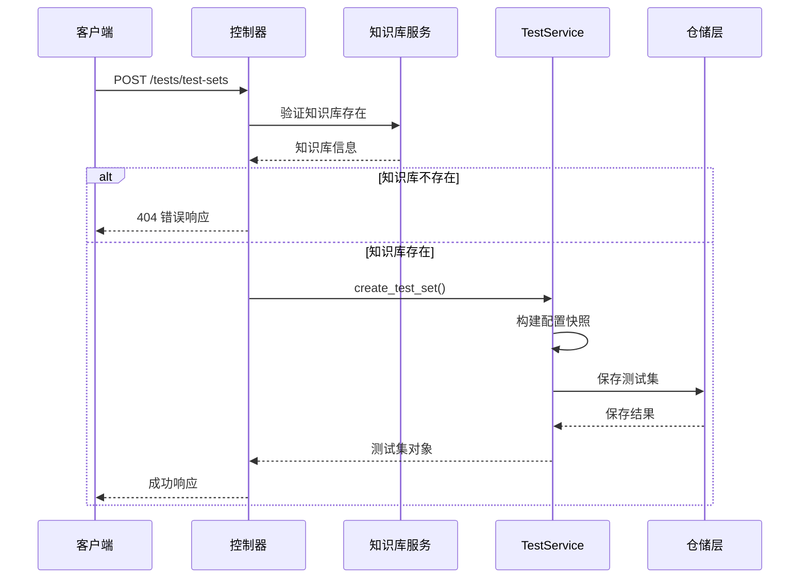

**图表来源**
- [test_management.py](file://backend/app/controllers/test_management.py#L32-L79)
- [test_service.py](file://backend/app/services/test_service.py#L35-L89)

#### 分页查询实现

系统实现了高效的分页查询机制，支持多种筛选条件：

| 参数 | 类型 | 描述 | 默认值 |
|------|------|------|--------|
| page | int | 页码 | 1 |
| page_size | int | 每页大小 | 20 |
| kb_id | str | 知识库ID筛选 | None |
| test_type | str | 测试类型筛选 | None |

分页查询的核心实现逻辑：

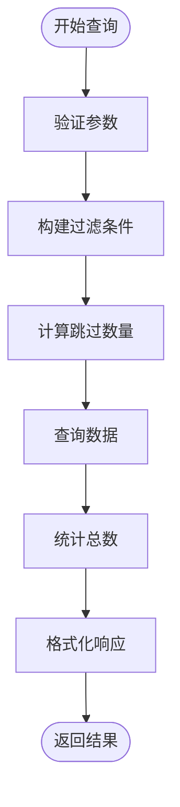

**图表来源**
- [test_service.py](file://backend/app/services/test_service.py#L95-L113)

### 测试用例管理详细分析

#### 层级关系映射

测试用例与测试集之间存在明确的层级关系，在数据库中通过外键关联实现：

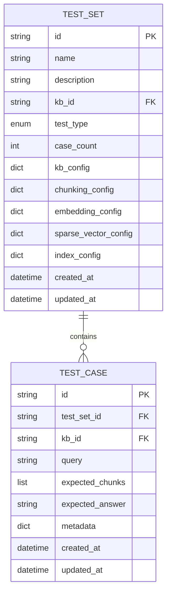

**图表来源**
- [test.py](file://backend/app/models/test.py#L26-L101)

#### 批量创建优化

批量创建功能通过以下机制优化性能：

1. **事务处理**：确保数据一致性
2. **错误隔离**：单个失败不影响其他记录
3. **批量更新**：减少数据库交互次数

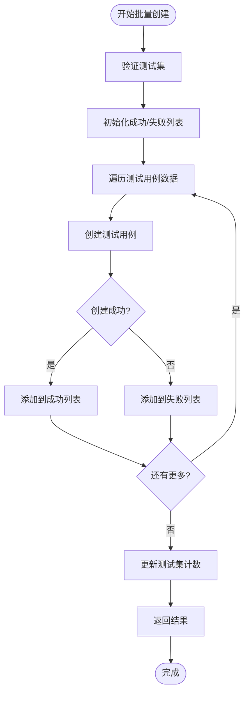

**图表来源**
- [test_service.py](file://backend/app/services/test_service.py#L167-L222)

### 错误处理策略

系统实现了多层次的错误处理机制：

#### 异常分类

| 异常类型 | HTTP状态码 | 用途 |
|----------|------------|------|
| NotFoundException | 404 | 资源不存在 |
| BadRequestException | 400 | 请求参数错误 |
| InternalServerException | 500 | 服务器内部错误 |
| ConflictException | 409 | 资源冲突 |

#### 错误处理流程

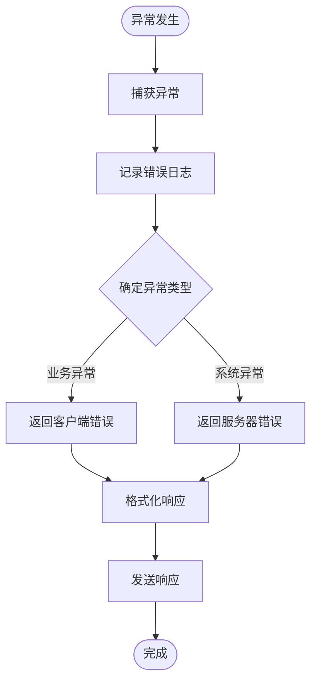

**图表来源**
- [exceptions.py](file://backend/app/core/exceptions.py#L12-L144)
- [test_management.py](file://backend/app/controllers/test_management.py#L69-L79)

**章节来源**
- [test_management.py](file://backend/app/controllers/test_management.py#L32-L534)
- [test_service.py](file://backend/app/services/test_service.py#L35-L374)
- [test.py](file://backend/app/models/test.py#L1-L227)

## 依赖关系分析

### 组件耦合度分析

测试管理控制器的依赖关系呈现清晰的分层结构：

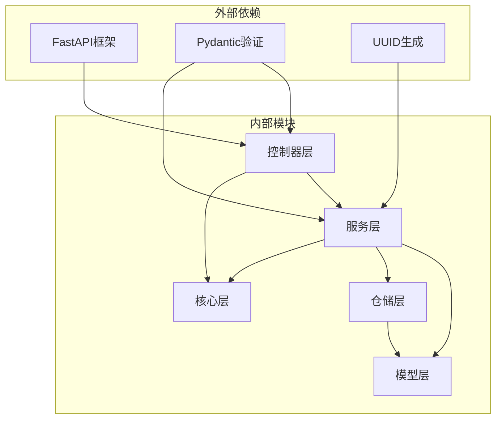

**图表来源**
- [test_management.py](file://backend/app/controllers/test_management.py#L1-L25)
- [test_service.py](file://backend/app/services/test_service.py#L1-L25)

### 跨服务调用

系统通过知识库服务实现跨服务调用：

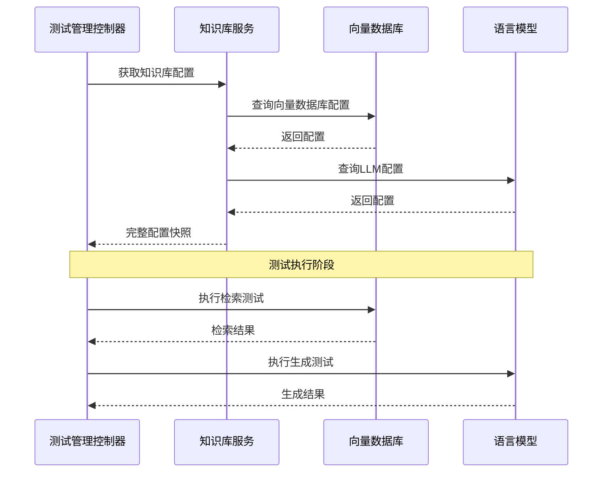

**图表来源**
- [test_service.py](file://backend/app/services/test_service.py#L50-L82)
- [test_management.py](file://backend/app/controllers/test_management.py#L44-L53)

**章节来源**
- [test_management.py](file://backend/app/controllers/test_management.py#L1-L534)
- [factory.py](file://backend/app/repositories/factory.py#L1-L116)

## 性能考虑

### 查询优化

1. **分页机制**：避免一次性加载大量数据
2. **索引优化**：在关键字段上建立索引
3. **缓存策略**：对频繁查询的数据进行缓存

### 批量操作优化

批量创建测试用例时采用以下优化策略：
- **批量插入**：减少数据库交互次数
- **错误隔离**：单个失败不影响整体进度
- **进度跟踪**：实时反馈处理状态

### 内存管理

系统通过以下方式优化内存使用：
- **流式处理**：大数据集采用流式处理
- **及时释放**：处理完成后立即释放资源
- **连接池**：复用数据库连接

## 故障排除指南

### 常见问题及解决方案

#### 知识库不存在错误

**问题描述**：创建测试集时提示知识库不存在

**解决方案**：
1. 验证知识库ID的有效性
2. 检查知识库是否已激活
3. 确认知识库服务正常运行

#### 测试用例创建失败

**问题描述**：批量创建测试用例时部分失败

**解决方案**：
1. 检查测试集ID的有效性
2. 验证测试用例数据的完整性
3. 查看失败记录的具体原因

#### 分页查询性能问题

**问题描述**：大数据量查询响应缓慢

**解决方案**：
1. 调整页面大小参数
2. 添加适当的索引
3. 考虑使用异步查询

**章节来源**
- [exceptions.py](file://backend/app/core/exceptions.py#L12-L144)
- [test_service.py](file://backend/app/services/test_service.py#L146-L149)

## 结论

测试管理控制器作为RAG Studio系统的核心组件，展现了优秀的架构设计和实现质量。通过分层架构、清晰的职责分离和完善的错误处理机制，系统能够高效地管理测试集和测试用例的全生命周期。

### 主要优势

1. **模块化设计**：清晰的分层架构便于维护和扩展
2. **跨服务调用**：与知识库服务的良好集成
3. **批量处理**：高效的批量创建和查询机制
4. **错误处理**：完善的异常处理和日志记录
5. **性能优化**：合理的分页和缓存策略

### 改进建议

1. **监控指标**：增加详细的性能监控指标
2. **重试机制**：为关键操作添加重试机制
3. **审计日志**：记录所有重要操作的审计信息
4. **API版本控制**：考虑引入API版本控制机制

该控制器为RAG Studio系统提供了稳定可靠的测试管理能力，是整个系统架构中的重要组成部分。