# 测试集管理

<cite>
**本文档引用的文件**
- [test_management.py](file://backend/app/controllers/test_management.py)
- [test_service.py](file://backend/app/services/test_service.py)
- [test.py](file://backend/app/models/test.py)
- [test.py](file://backend/app/schemas/test.py)
- [mysql_repository.py](file://backend/app/repositories/mysql_repository.py)
- [models.py](file://backend/app/database/models.py)
- [common.py](file://backend/app/schemas/common.py)
- [knowledge_base.py](file://backend/app/controllers/knowledge_base.py)
- [knowledge_base.py](file://backend/app/services/knowledge_base.py)
</cite>

## 目录
1. [概述](#概述)
2. [系统架构](#系统架构)
3. [核心API详解](#核心api详解)
4. [测试集与知识库关联关系](#测试集与知识库关联关系)
5. [配置快照机制](#配置快照机制)
6. [层级结构与级联删除](#层级结构与级联删除)
7. [分页查询实现](#分页查询实现)
8. [数据持久化流程](#数据持久化流程)
9. [异常处理策略](#异常处理策略)
10. [最佳实践建议](#最佳实践建议)

## 概述

测试集管理模块是RAG Studio系统中的核心组件，负责管理测试用例的完整生命周期。该模块提供了完整的CRUD操作接口，支持测试集与知识库的深度关联，并实现了智能的配置快照机制，确保测试环境的一致性和可追溯性。

### 主要功能特性

- **完整的测试集生命周期管理**：支持创建、查询、更新、删除测试集
- **智能配置快照**：自动捕获知识库的配置状态，确保测试环境一致性
- **层级化数据结构**：测试集包含多个测试用例，支持批量操作
- **强大的分页查询**：支持多维度筛选和高效分页
- **级联删除机制**：删除测试集时自动清理关联的测试用例
- **跨服务知识库验证**：通过知识库服务验证知识库存在性

## 系统架构

测试集管理模块采用经典的三层架构设计，清晰分离了控制层、业务逻辑层和数据访问层。

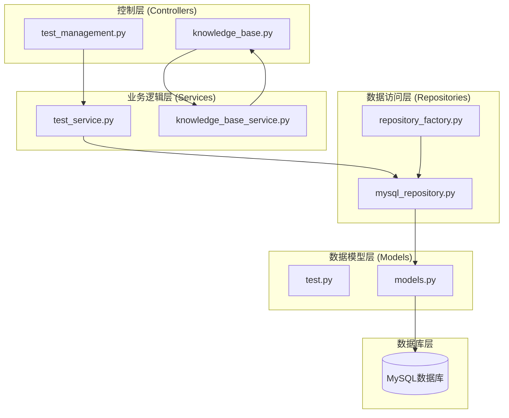

**图表来源**
- [test_management.py](file://backend/app/controllers/test_management.py#L1-L534)
- [test_service.py](file://backend/app/services/test_service.py#L1-L374)
- [mysql_repository.py](file://backend/app/repositories/mysql_repository.py#L1-L308)

### 架构层次说明

1. **控制层**：处理HTTP请求和响应，进行参数验证和错误处理
2. **业务逻辑层**：实现核心业务规则和复杂的业务逻辑
3. **数据访问层**：封装数据库操作，提供统一的数据访问接口
4. **数据模型层**：定义数据结构和数据库映射关系

**章节来源**
- [test_management.py](file://backend/app/controllers/test_management.py#L1-L50)
- [test_service.py](file://backend/app/services/test_service.py#L24-L35)

## 核心API详解

### create_test_set - 创建测试集

创建测试集是测试集管理的核心入口，支持两种模式：显式配置和自动快照。

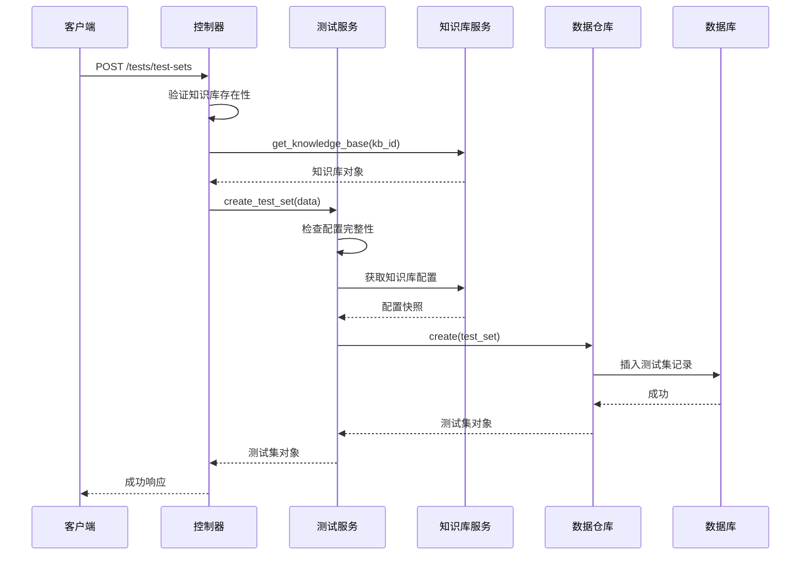

**图表来源**
- [test_management.py](file://backend/app/controllers/test_management.py#L32-L79)
- [test_service.py](file://backend/app/services/test_service.py#L35-L89)

#### 参数说明

| 参数名 | 类型 | 必填 | 描述 |
|--------|------|------|------|
| name | string | 是 | 测试集名称，长度1-100字符 |
| description | string | 否 | 测试集描述，长度不超过500字符 |
| kb_id | string | 是 | 关联的知识库ID |
| test_type | TestType | 是 | 测试类型（retrieval/generation） |
| kb_config | Dict | 否 | 知识库配置快照 |
| chunking_config | Dict | 否 | 分块策略配置 |
| embedding_config | Dict | 否 | 嵌入模型参数配置 |
| sparse_vector_config | Dict | 否 | 稀疏向量参数配置 |
| index_config | Dict | 否 | 索引配置 |

#### 配置优先级

1. **显式配置**：如果客户端提供了配置快照，则直接使用
2. **自动快照**：如果未提供配置，则从关联的知识库自动获取
3. **默认配置**：如果知识库也不存在配置，则使用空字典

**章节来源**
- [test_management.py](file://backend/app/controllers/test_management.py#L32-L79)
- [test_service.py](file://backend/app/services/test_service.py#L35-L89)

### list_test_sets - 获取测试集列表

支持多维度筛选和高效分页查询，提供灵活的数据检索能力。

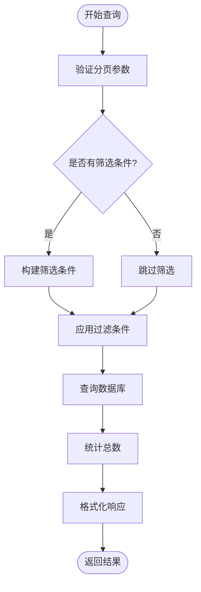

**图表来源**
- [test_management.py](file://backend/app/controllers/test_management.py#L82-L132)
- [test_service.py](file://backend/app/services/test_service.py#L95-L113)

#### 支持的筛选条件

| 参数名 | 类型 | 描述 |
|--------|------|------|
| kb_id | string | 知识库ID筛选 |
| test_type | string | 测试类型筛选（retrieval/generation） |
| page | int | 页码，默认1 |
| page_size | int | 每页大小，默认20，范围1-100 |

#### 响应格式

```json
{
  "success": true,
  "data": [
    {
      "id": "ts_001",
      "name": "测试集名称",
      "description": "测试集描述",
      "kb_id": "kb_001",
      "test_type": "retrieval",
      "case_count": 10,
      "created_at": "2024-01-01T00:00:00",
      "updated_at": "2024-01-01T00:00:00"
    }
  ],
  "total": 100,
  "page": 1,
  "page_size": 20
}
```

**章节来源**
- [test_management.py](file://backend/app/controllers/test_management.py#L82-L132)
- [test_service.py](file://backend/app/services/test_service.py#L95-L113)

### get_test_set - 获取测试集详情

根据测试集ID获取完整的测试集信息，包括配置快照和统计信息。

#### 查询流程

1. **ID验证**：检查测试集ID格式和存在性
2. **数据查询**：从数据库获取测试集详细信息
3. **配置解析**：解析JSON格式的配置字段
4. **关联信息**：补充测试用例数量等统计信息
5. **响应格式化**：转换为标准响应格式

**章节来源**
- [test_management.py](file://backend/app/controllers/test_management.py#L135-L166)
- [test_service.py](file://backend/app/services/test_service.py#L91-L94)

### update_test_set - 更新测试集

支持部分字段更新，保持现有配置的完整性。

#### 更新策略

1. **字段选择性更新**：只更新传入的字段
2. **配置完整性保护**：确保关键配置字段不被清空
3. **事务保证**：更新操作具有原子性

**章节来源**
- [test_management.py](file://backend/app/controllers/test_management.py#L168-L199)
- [test_service.py](file://backend/app/services/test_service.py#L115-L126)

### delete_test_set - 删除测试集

执行级联删除操作，确保数据完整性。

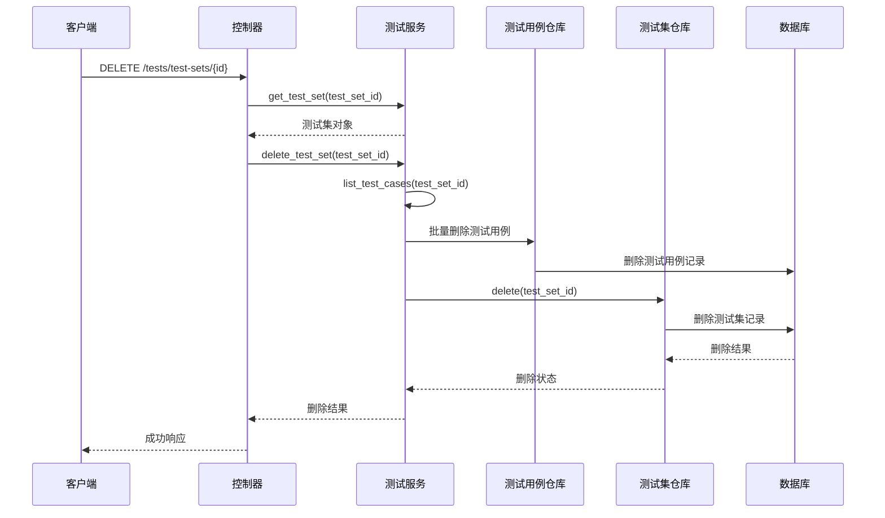

**图表来源**
- [test_management.py](file://backend/app/controllers/test_management.py#L201-L239)
- [test_service.py](file://backend/app/services/test_service.py#L128-L140)

#### 级联删除行为

1. **测试用例删除**：首先删除所有关联的测试用例
2. **测试集删除**：然后删除测试集本身
3. **事务保证**：整个过程具有ACID特性
4. **错误处理**：即使部分删除失败，也会回滚已执行的操作

**章节来源**
- [test_management.py](file://backend/app/controllers/test_management.py#L201-L239)
- [test_service.py](file://backend/app/services/test_service.py#L128-L140)

## 测试集与知识库关联关系

测试集与知识库之间建立了强关联关系，这种设计确保了测试环境的一致性和可追溯性。

### 关联关系图

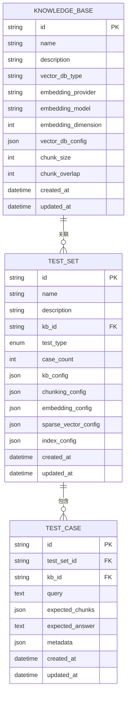

**图表来源**
- [models.py](file://backend/app/database/models.py#L23-L128)
- [test.py](file://backend/app/models/test.py#L26-L227)

### 关联特性

1. **外键约束**：数据库层面保证关联完整性
2. **级联操作**：知识库删除时自动清理相关测试集
3. **配置继承**：测试集继承知识库的基础配置
4. **权限隔离**：不同知识库的测试集相互独立

### 关联验证机制

系统在多个层面验证关联关系：

1. **控制器层验证**：创建测试集前验证知识库存在性
2. **服务层验证**：确保知识库配置可用
3. **数据库约束**：利用外键保证数据完整性

**章节来源**
- [test_management.py](file://backend/app/controllers/test_management.py#L42-L53)
- [test_service.py](file://backend/app/services/test_service.py#L35-L89)

## 配置快照机制

配置快照是测试集管理的核心特性，它确保了测试环境的稳定性和可重现性。

### 配置快照组成

测试集包含以下配置快照字段：

| 字段名 | 描述 | 来源 |
|--------|------|------|
| kb_config | 知识库配置快照 | 包含向量数据库类型、嵌入模型等 |
| chunking_config | 分块策略配置 | chunk_size, chunk_overlap等 |
| embedding_config | 嵌入模型配置 | provider, model, dimension等 |
| sparse_vector_config | 稀疏向量配置 | 方法、参数等 |
| index_config | 索引配置 | schema字段、向量数据库类型等 |

### 自动快照流程

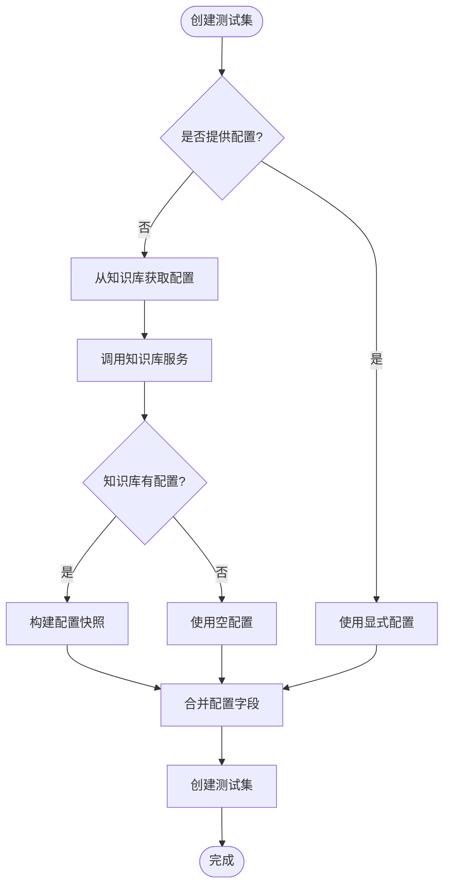

**图表来源**
- [test_service.py](file://backend/app/services/test_service.py#L35-L89)

### 配置字段处理

系统对配置字段进行了智能处理：

1. **字段完整性**：确保所有配置字段都存在，避免空值
2. **类型标准化**：将None值转换为空字典
3. **字段合并**：将知识库配置与用户配置合并
4. **版本控制**：每次创建测试集时保存当前配置状态

### 配置快照示例

```json
{
  "kb_config": {
    "vector_db_type": "qdrant",
    "embedding_provider": "ollama",
    "embedding_model": "bge-m3:latest",
    "embedding_dimension": 1024,
    "vector_db_config": {
      "host": "localhost",
      "port": 6333
    }
  },
  "chunking_config": {
    "chunk_size": 500,
    "chunk_overlap": 50,
    "method": "fixed_size"
  },
  "embedding_config": {
    "provider": "ollama",
    "model": "bge-m3:latest",
    "dimension": 1024
  },
  "sparse_vector_config": {},
  "index_config": {
    "schema_fields": [
      {"name": "content", "type": "text"},
      {"name": "metadata", "type": "json"}
    ],
    "vector_db_type": "qdrant"
  }
}
```

**章节来源**
- [test_service.py](file://backend/app/services/test_service.py#L35-L89)
- [test.py](file://backend/app/models/test.py#L38-L58)

## 层级结构与级联删除

测试集采用树状层级结构，测试集包含多个测试用例，这种设计提供了良好的数据组织和管理能力。

### 层级结构设计

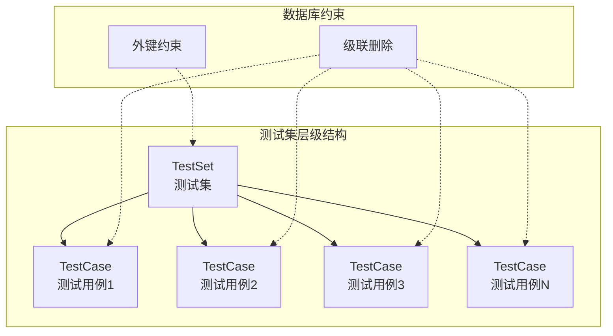

**图表来源**
- [models.py](file://backend/app/database/models.py#L23-L128)
- [test.py](file://backend/app/models/test.py#L26-L227)

### 级联删除机制

#### 删除顺序

1. **测试用例删除**：首先删除所有关联的测试用例
2. **测试集删除**：然后删除测试集本身
3. **统计更新**：更新相关统计信息

#### 级联删除实现

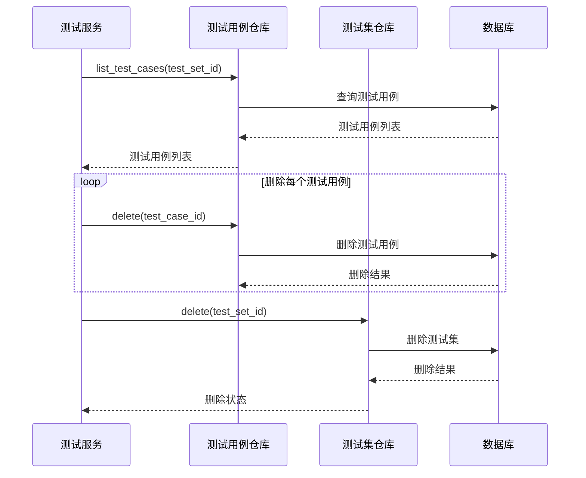

**图表来源**
- [test_service.py](file://backend/app/services/test_service.py#L128-L140)

### 数据完整性保证

1. **外键约束**：数据库层面保证级联删除
2. **事务支持**：删除操作具有原子性
3. **错误处理**：部分删除失败时自动回滚
4. **统计同步**：及时更新相关统计信息

**章节来源**
- [test_service.py](file://backend/app/services/test_service.py#L128-L140)
- [mysql_repository.py](file://backend/app/repositories/mysql_repository.py#L261-L285)

## 分页查询实现

分页查询是测试集管理的重要功能，提供了高效的大量数据检索能力。

### 分页参数验证

系统实现了严格的分页参数验证机制：

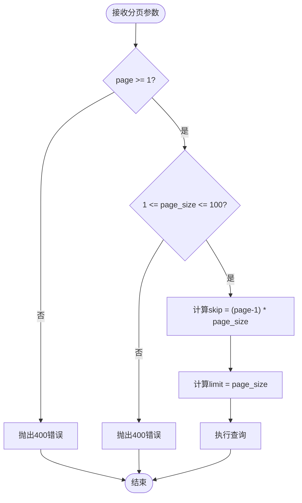

**图表来源**
- [common.py](file://backend/app/schemas/common.py#L9-L24)
- [test_management.py](file://backend/app/controllers/test_management.py#L84-L87)

### 分页参数规范

| 参数名 | 类型 | 默认值 | 验证规则 | 描述 |
|--------|------|--------|----------|------|
| page | int | 1 | ≥ 1 | 页码，从1开始 |
| page_size | int | 20 | 1 ≤ n ≤ 100 | 每页记录数 |

### 分页查询实现

#### 查询流程

1. **参数验证**：验证分页参数的有效性
2. **过滤条件**：构建查询过滤条件
3. **分页计算**：计算skip和limit值
4. **数据查询**：执行数据库查询
5. **总数统计**：统计符合条件的总记录数
6. **结果格式化**：转换为标准响应格式

#### 性能优化

1. **索引利用**：对常用查询字段建立索引
2. **延迟加载**：只加载必要的字段
3. **缓存策略**：对频繁查询的结果进行缓存
4. **批量操作**：支持批量查询和更新

**章节来源**
- [common.py](file://backend/app/schemas/common.py#L9-L24)
- [test_management.py](file://backend/app/controllers/test_management.py#L82-L132)
- [mysql_repository.py](file://backend/app/repositories/mysql_repository.py#L167-L200)

## 数据持久化流程

数据持久化流程贯穿整个测试集管理过程，确保数据的一致性和可靠性。

### ORM模型映射

系统使用SQLAlchemy ORM进行数据持久化，提供了强类型的安全保障。

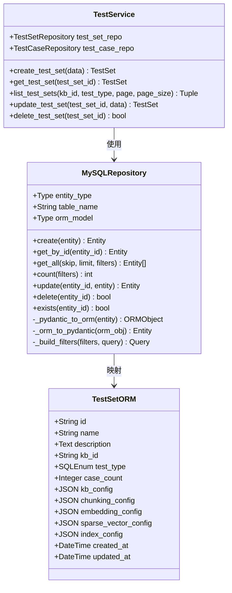

**图表来源**
- [models.py](file://backend/app/database/models.py#L23-L43)
- [mysql_repository.py](file://backend/app/repositories/mysql_repository.py#L19-L308)
- [test_service.py](file://backend/app/services/test_service.py#L24-L35)

### 数据转换机制

系统在不同层次间进行数据转换：

1. **Pydantic模型**：用于API输入输出验证
2. **ORM模型**：用于数据库持久化
3. **字典格式**：用于中间数据传递

#### 转换流程

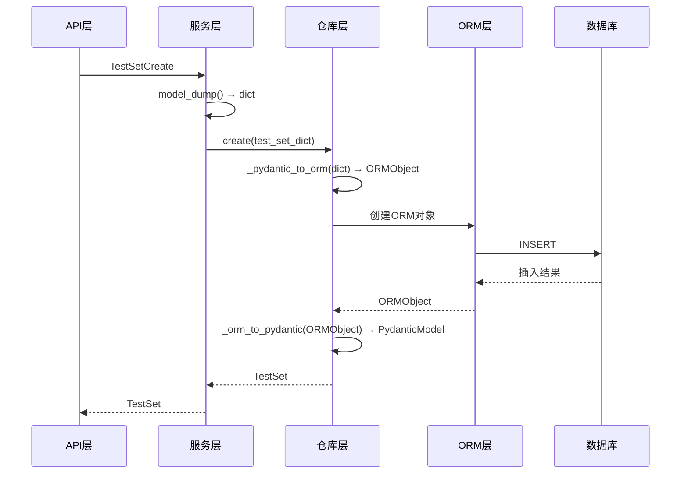

**图表来源**
- [mysql_repository.py](file://backend/app/repositories/mysql_repository.py#L61-L95)

### 事务管理

系统实现了完善的事务管理机制：

1. **自动提交**：正常情况下自动提交事务
2. **自动回滚**：发生异常时自动回滚
3. **连接管理**：确保数据库连接的正确关闭
4. **并发控制**：防止并发访问导致的数据不一致

**章节来源**
- [mysql_repository.py](file://backend/app/repositories/mysql_repository.py#L112-L145)
- [mysql_repository.py](file://backend/app/repositories/mysql_repository.py#L147-L166)

## 异常处理策略

系统实现了多层次的异常处理策略，确保系统的稳定性和用户体验。

### 异常分类体系

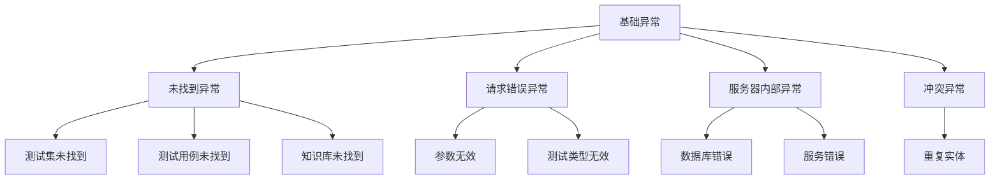

**图表来源**
- [test_management.py](file://backend/app/controllers/test_management.py#L69-L79)
- [test_management.py](file://backend/app/controllers/test_management.py#L101-L104)

### 异常处理流程

#### 控制器层异常处理

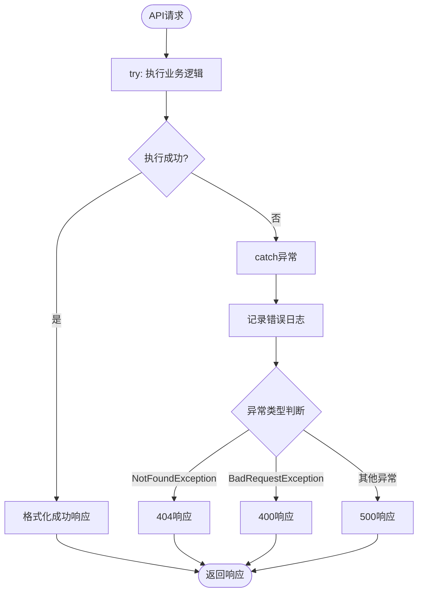

**图表来源**
- [test_management.py](file://backend/app/controllers/test_management.py#L69-L79)
- [test_management.py](file://backend/app/controllers/test_management.py#L101-L104)

#### 服务层异常处理

服务层实现了更细粒度的异常处理：

1. **知识库验证**：检查知识库存在性
2. **数据完整性**：验证数据格式和约束
3. **业务规则**：检查业务逻辑约束
4. **跨服务调用**：处理外部服务异常

#### 数据库层异常处理

数据库层提供了底层的异常处理：

1. **连接异常**：处理数据库连接问题
2. **约束违反**：处理主键、外键等约束
3. **并发冲突**：处理并发访问冲突
4. **事务回滚**：确保数据一致性

### 错误响应格式

系统使用统一的错误响应格式：

```json
{
  "success": false,
  "error": {
    "code": "NOT_FOUND",
    "message": "测试集不存在: ts_001",
    "details": {
      "test_set_id": "ts_001"
    }
  }
}
```

**章节来源**
- [test_management.py](file://backend/app/controllers/test_management.py#L69-L79)
- [test_management.py](file://backend/app/controllers/test_management.py#L101-L104)
- [mysql_repository.py](file://backend/app/repositories/mysql_repository.py#L135-L141)

## 最佳实践建议

基于对测试集管理模块的深入分析，以下是推荐的最佳实践：

### 测试集创建最佳实践

1. **配置快照时机**
   - 在知识库配置稳定后再创建测试集
   - 避免在知识库配置频繁变更时创建测试集
   - 定期备份重要的测试集配置

2. **命名规范**
   - 使用描述性的测试集名称
   - 包含测试目的、数据集来源等信息
   - 遵循团队的命名约定

3. **测试类型选择**
   - 根据实际需求选择合适的测试类型
   - 检索测试适用于评估检索效果
   - 生成测试适用于评估生成质量

### 性能优化建议

1. **分页查询优化**
   - 合理设置page_size，避免过大或过小
   - 对于大数据量场景，考虑使用游标分页
   - 利用数据库索引提高查询性能

2. **批量操作**
   - 对于大量测试用例，使用批量创建接口
   - 避免逐条创建带来的性能开销
   - 设置合理的批量大小

3. **缓存策略**
   - 缓存频繁访问的测试集信息
   - 缓存知识库配置快照
   - 定期清理过期缓存

### 数据管理建议

1. **定期清理**
   - 清理长期未使用的测试集
   - 归档历史测试结果
   - 优化数据库存储空间

2. **备份策略**
   - 定期备份测试集配置
   - 备份测试用例数据
   - 测试备份恢复流程

3. **监控告警**
   - 监控测试集创建成功率
   - 监控数据库性能指标
   - 设置异常告警机制

### 安全考虑

1. **权限控制**
   - 实施基于角色的访问控制
   - 记录敏感操作审计日志
   - 定期审查权限分配

2. **数据保护**
   - 敏感配置信息加密存储
   - 传输过程使用HTTPS协议
   - 定期安全扫描和漏洞评估

通过遵循这些最佳实践，可以确保测试集管理模块的高效、稳定和安全运行，为RAG系统的测试工作提供可靠的基础支撑。