# 知识库管理控制器技术文档

<cite>
**本文档引用的文件**
- [knowledge_base.py](file://backend/app/controllers/knowledge_base.py)
- [knowledge_base.py](file://backend/app/services/knowledge_base.py)
- [knowledge_base_storage.py](file://backend/app/services/knowledge_base_storage.py)
- [knowledge_base.py](file://backend/app/models/knowledge_base.py)
- [knowledge_base.py](file://backend/app/schemas/knowledge_base.py)
- [base.py](file://backend/app/models/base.py)
- [common.py](file://backend/app/schemas/common.py)
- [response.py](file://backend/app/core/response.py)
- [exceptions.py](file://backend/app/core/exceptions.py)
</cite>

## 目录
1. [概述](#概述)
2. [项目结构](#项目结构)
3. [核心组件](#核心组件)
4. [架构概览](#架构概览)
5. [详细组件分析](#详细组件分析)
6. [依赖关系分析](#依赖关系分析)
7. [性能考虑](#性能考虑)
8. [故障排除指南](#故障排除指南)
9. [结论](#结论)

## 概述

知识库管理控制器是RAG Studio系统中的核心组件，负责处理知识库的全生命周期管理。该控制器基于FastAPI框架构建，采用RESTful设计原则，提供了完整的CRUD操作接口，包括知识库创建、查询、更新、删除以及高级功能如配置获取、统计信息查询和Schema管理。

系统采用了经典的三层架构模式：控制器层（Controllers）、服务层（Services）和存储层（Storage），确保了代码的可维护性和扩展性。通过Pydantic模型进行数据校验，使用统一的响应格式和异常处理机制，为前端提供了稳定可靠的API接口。

## 项目结构

知识库管理控制器的项目结构遵循现代Python Web应用的最佳实践，主要分为以下几个层次：

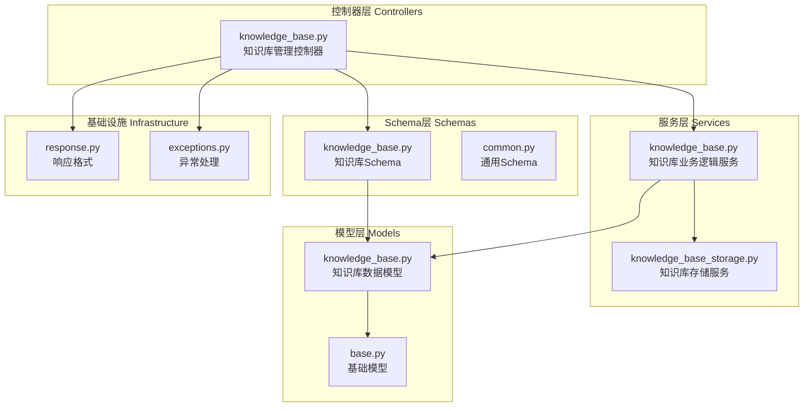

**图表来源**
- [knowledge_base.py](file://backend/app/controllers/knowledge_base.py#L1-L283)
- [knowledge_base.py](file://backend/app/services/knowledge_base.py#L1-L230)
- [knowledge_base_storage.py](file://backend/app/services/knowledge_base_storage.py#L1-L359)

**章节来源**
- [knowledge_base.py](file://backend/app/controllers/knowledge_base.py#L1-L283)
- [knowledge_base.py](file://backend/app/services/knowledge_base.py#L1-L230)

## 核心组件

知识库管理控制器包含以下核心组件：

### 控制器层组件
- **API路由器**：定义了知识库管理的所有RESTful端点
- **请求处理函数**：每个端点对应一个独立的处理函数
- **参数验证**：使用FastAPI的Query和Body装饰器进行参数验证
- **响应格式化**：统一使用JSONResponse和success_response格式化响应

### 服务层组件  
- **KnowledgeBaseService**：封装了知识库的业务逻辑
- **KnowledgeBaseStorageService**：负责知识库配置的持久化存储
- **业务规则**：实现了知识库的创建、更新、删除等业务规则

### 数据模型组件
- **KnowledgeBase模型**：定义了知识库的数据结构
- **枚举类型**：EmbeddingProvider和VectorDBType
- **继承关系**：继承自BaseModelMixin获得通用属性

**章节来源**
- [knowledge_base.py](file://backend/app/controllers/knowledge_base.py#L19-L283)
- [knowledge_base.py](file://backend/app/services/knowledge_base.py#L15-L230)
- [knowledge_base.py](file://backend/app/models/knowledge_base.py#L25-L80)

## 架构概览

知识库管理控制器采用了分层架构设计，每一层都有明确的职责分工：

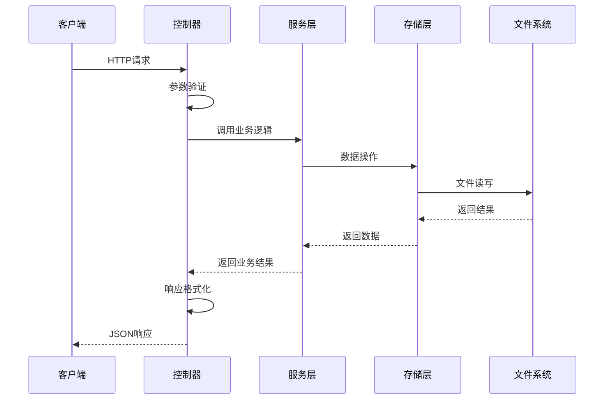

**图表来源**
- [knowledge_base.py](file://backend/app/controllers/knowledge_base.py#L22-L44)
- [knowledge_base.py](file://backend/app/services/knowledge_base.py#L18-L48)
- [knowledge_base_storage.py](file://backend/app/services/knowledge_base_storage.py#L17-L359)

### RESTful设计原则应用

系统严格遵循RESTful设计原则，在HTTP方法选择、URL设计和状态码返回方面都有明确规范：

| HTTP方法 | 端点 | 功能描述 | 状态码 |
|---------|------|----------|--------|
| POST | `/knowledge-bases` | 创建新知识库 | 200/201 |
| GET | `/knowledge-bases` | 获取知识库列表 | 200 |
| GET | `/knowledge-bases/{kb_id}` | 获取单个知识库详情 | 200/404 |
| PUT | `/knowledge-bases/{kb_id}` | 更新知识库配置 | 200/404 |
| DELETE | `/knowledge-bases/{kb_id}` | 删除知识库 | 200/404 |
| GET | `/knowledge-bases/{kb_id}/config` | 获取详细配置 | 200/404 |
| GET | `/knowledge-bases/{kb_id}/stats` | 获取统计信息 | 200/404 |
| GET | `/knowledge-bases/{kb_id}/schema` | 获取Schema配置 | 200/404 |
| PUT | `/knowledge-bases/{kb_id}/schema` | 更新Schema配置 | 200/404 |

**章节来源**
- [knowledge_base.py](file://backend/app/controllers/knowledge_base.py#L22-L283)

## 详细组件分析

### 1. 知识库创建端点 (create_knowledge_base)

创建知识库是系统的核心功能之一，负责初始化一个新的知识库实例。

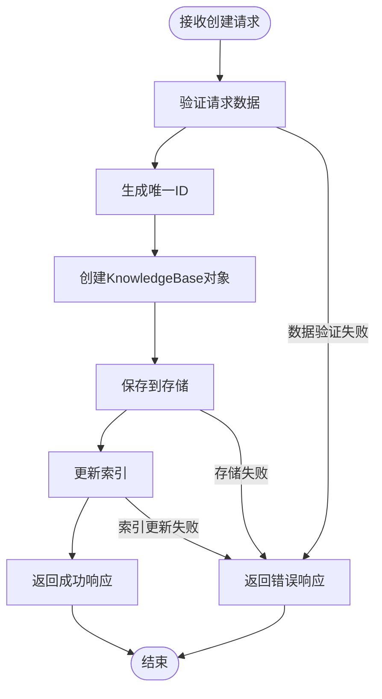

**图表来源**
- [knowledge_base.py](file://backend/app/controllers/knowledge_base.py#L22-L44)
- [knowledge_base.py](file://backend/app/services/knowledge_base.py#L21-L47)

#### 关键特性
- **唯一ID生成**：使用UUID生成知识库ID，确保全局唯一性
- **Schema默认配置**：自动配置包含稀疏向量字段的默认Schema
- **存储机制**：使用debug_results机制进行配置存储
- **索引管理**：自动维护知识库索引文件

**章节来源**
- [knowledge_base.py](file://backend/app/controllers/knowledge_base.py#L22-L44)
- [knowledge_base.py](file://backend/app/services/knowledge_base.py#L21-L47)

### 2. 知识库列表查询端点 (list_knowledge_bases)

支持分页查询和条件筛选的知识库列表功能。

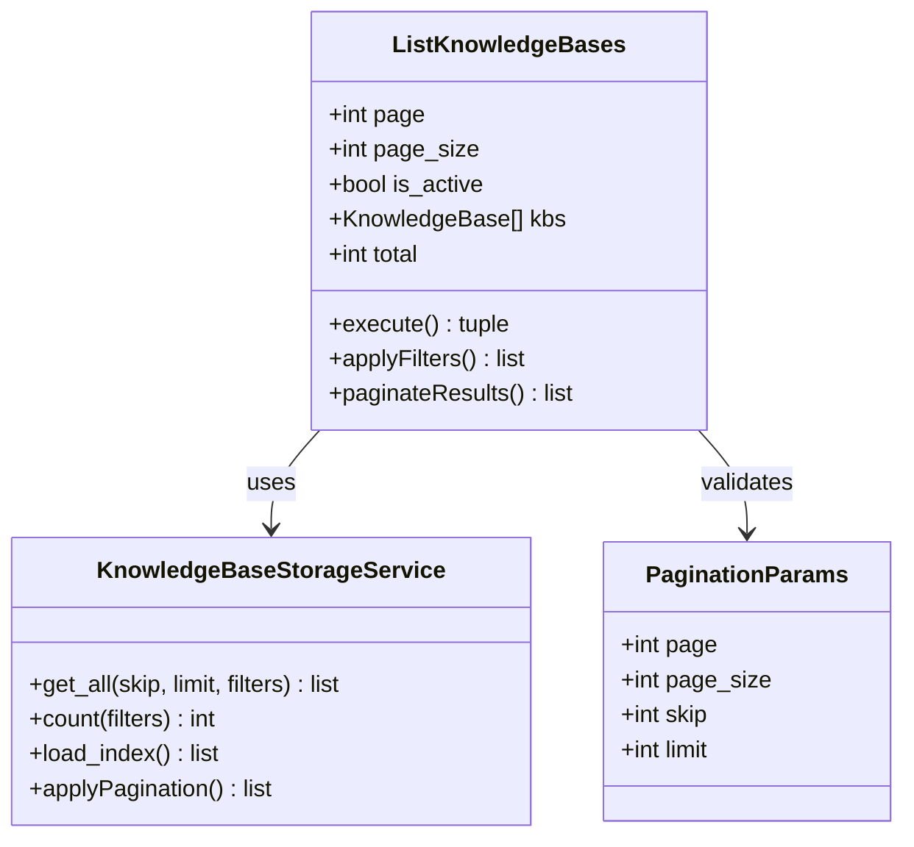

**图表来源**
- [knowledge_base.py](file://backend/app/controllers/knowledge_base.py#L47-L75)
- [knowledge_base.py](file://backend/app/services/knowledge_base.py#L61-L86)
- [common.py](file://backend/app/schemas/common.py#L9-L24)

#### 查询特性
- **分页支持**：支持自定义页码和页面大小
- **条件筛选**：支持按激活状态筛选
- **索引优化**：利用索引文件提高查询性能
- **动态过滤**：运行时应用过滤条件

**章节来源**
- [knowledge_base.py](file://backend/app/controllers/knowledge_base.py#L47-L75)
- [knowledge_base.py](file://backend/app/services/knowledge_base.py#L61-L86)

### 3. 知识库详情获取端点 (get_knowledge_base)

提供单个知识库的详细信息查询功能。

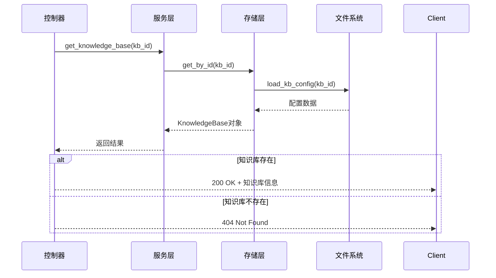

**图表来源**
- [knowledge_base.py](file://backend/app/controllers/knowledge_base.py#L78-L97)
- [knowledge_base.py](file://backend/app/services/knowledge_base.py#L49-L59)
- [knowledge_base_storage.py](file://backend/app/services/knowledge_base_storage.py#L160-L171)

#### 异常处理
- **NotFound异常**：当知识库不存在时抛出404错误
- **数据转换**：从存储格式转换为模型格式
- **完整性检查**：确保返回的数据完整性

**章节来源**
- [knowledge_base.py](file://backend/app/controllers/knowledge_base.py#L78-L97)
- [knowledge_base.py](file://backend/app/services/knowledge_base.py#L49-L59)

### 4. 知识库更新端点 (update_knowledge_base)

支持部分字段更新的知识库配置修改功能。

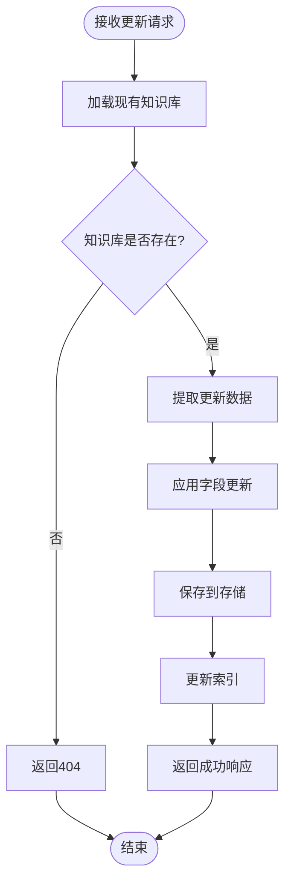

**图表来源**
- [knowledge_base.py](file://backend/app/controllers/knowledge_base.py#L100-L121)
- [knowledge_base.py](file://backend/app/services/knowledge_base.py#L88-L117)

#### 更新特性
- **部分更新**：只更新指定的字段，其他字段保持不变
- **字段验证**：使用exclude_unset选项避免更新未设置的字段
- **事务性**：确保更新操作的原子性
- **版本控制**：自动更新时间戳

**章节来源**
- [knowledge_base.py](file://backend/app/controllers/knowledge_base.py#L100-L121)
- [knowledge_base.py](file://backend/app/services/knowledge_base.py#L88-L117)

### 5. 知识库删除端点 (delete_knowledge_base)

实现软删除机制，安全地移除知识库及其相关资源。

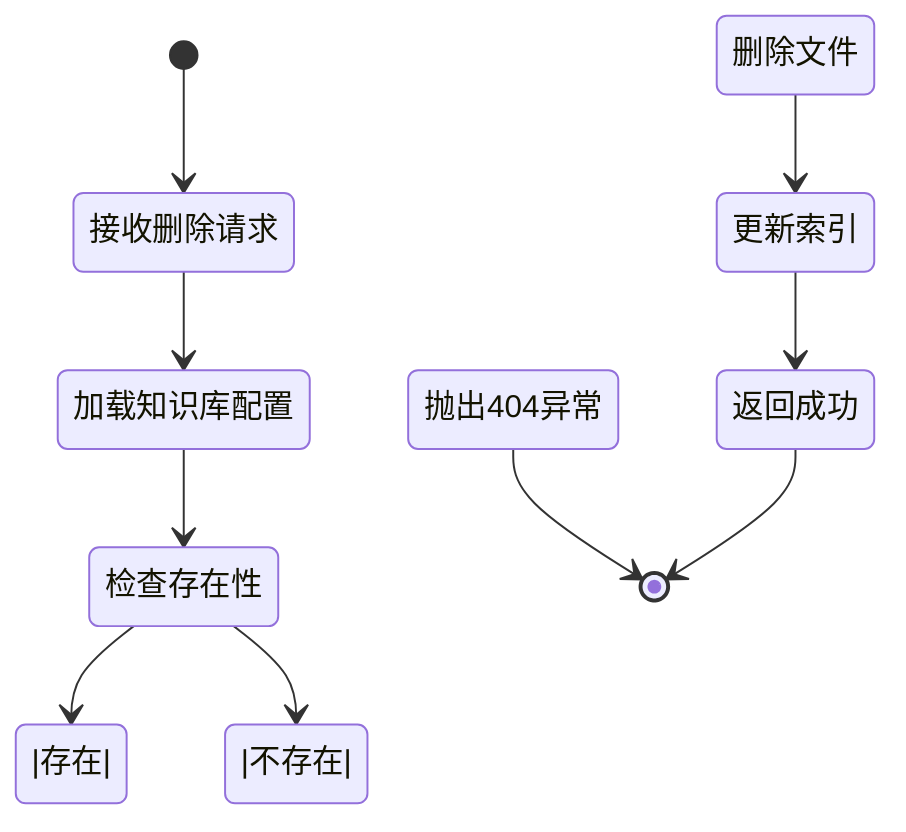

**图表来源**
- [knowledge_base.py](file://backend/app/controllers/knowledge_base.py#L124-L145)
- [knowledge_base.py](file://backend/app/services/knowledge_base.py#L119-L133)
- [knowledge_base_storage.py](file://backend/app/services/knowledge_base_storage.py#L292-L312)

#### 删除策略
- **软删除**：仅标记删除状态，不立即物理删除
- **索引同步**：同步更新索引文件
- **资源清理**：预留扩展点用于清理关联资源
- **幂等性**：多次删除同一资源不会产生副作用

**章节来源**
- [knowledge_base.py](file://backend/app/controllers/knowledge_base.py#L124-L145)
- [knowledge_base.py](file://backend/app/services/knowledge_base.py#L119-L133)

### 6. 配置获取端点 (get_knowledge_base_config)

提供详细的知识库配置信息，主要用于链路调试和问题排查。

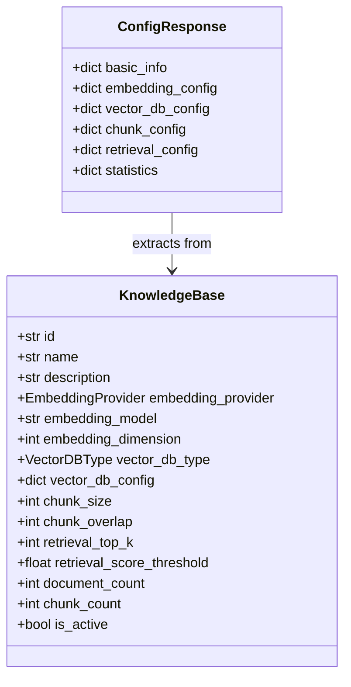

**图表来源**
- [knowledge_base.py](file://backend/app/controllers/knowledge_base.py#L148-L196)
- [knowledge_base.py](file://backend/app/models/knowledge_base.py#L25-L80)

#### 配置结构
- **基本信息**：ID、名称、描述、激活状态
- **嵌入配置**：提供商、模型、维度
- **向量数据库配置**：类型、具体配置
- **分块配置**：大小、重叠
- **检索配置**：返回数量、分数阈值
- **统计信息**：文档数量、分块数量

**章节来源**
- [knowledge_base.py](file://backend/app/controllers/knowledge_base.py#L148-L196)

### 7. 统计信息端点 (get_knowledge_base_stats)

提供知识库的运行时统计信息。

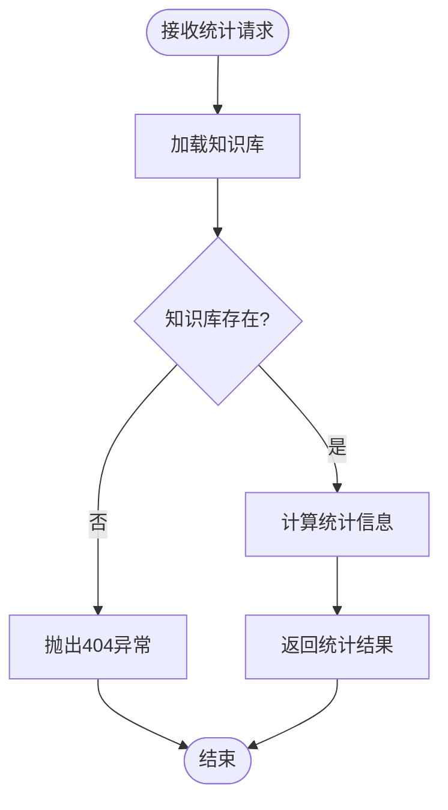

**图表来源**
- [knowledge_base.py](file://backend/app/controllers/knowledge_base.py#L199-L219)
- [knowledge_base.py](file://backend/app/services/knowledge_base.py#L135-L158)

#### 统计指标
- **文档统计**：文档总数、已处理文档数
- **分块统计**：总分块数、已索分数块
- **存储统计**：预计存储大小（待实现）
- **索引状态**：索引完整性检查（待实现）

**章节来源**
- [knowledge_base.py](file://backend/app/controllers/knowledge_base.py#L199-L219)
- [knowledge_base.py](file://backend/app/services/knowledge_base.py#L135-L158)

### 8. Schema管理端点

#### Schema获取端点 (get_knowledge_base_schema)

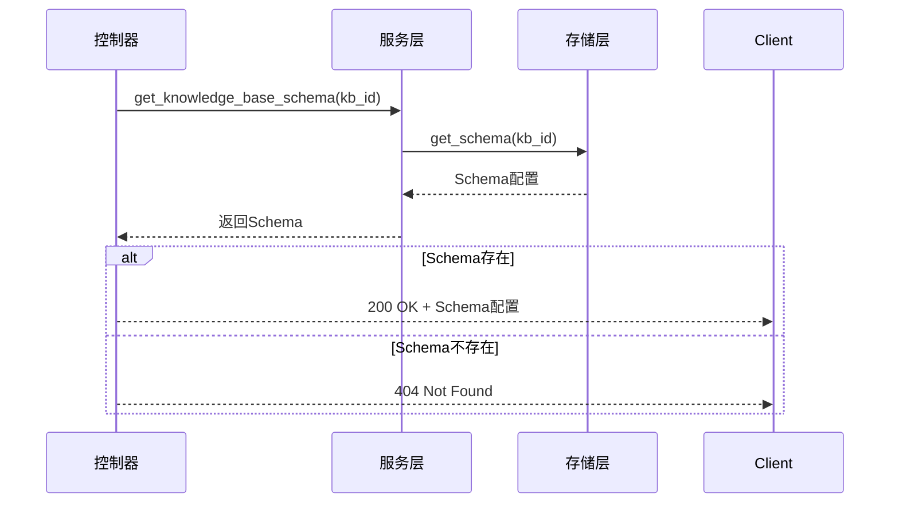

**图表来源**
- [knowledge_base.py](file://backend/app/controllers/knowledge_base.py#L222-L242)
- [knowledge_base.py](file://backend/app/services/knowledge_base.py#L160-L170)
- [knowledge_base_storage.py](file://backend/app/services/knowledge_base_storage.py#L314-L320)

#### Schema更新端点 (update_knowledge_base_schema)

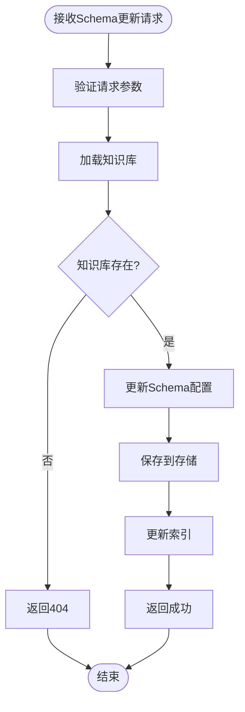

**图表来源**
- [knowledge_base.py](file://backend/app/controllers/knowledge_base.py#L252-L281)
- [knowledge_base.py](file://backend/app/services/knowledge_base.py#L172-L191)
- [knowledge_base_storage.py](file://backend/app/services/knowledge_base_storage.py#L322-L357)

**章节来源**
- [knowledge_base.py](file://backend/app/controllers/knowledge_base.py#L222-L281)
- [knowledge_base.py](file://backend/app/services/knowledge_base.py#L160-L191)

## 依赖关系分析

知识库管理控制器的依赖关系体现了清晰的分层架构设计：

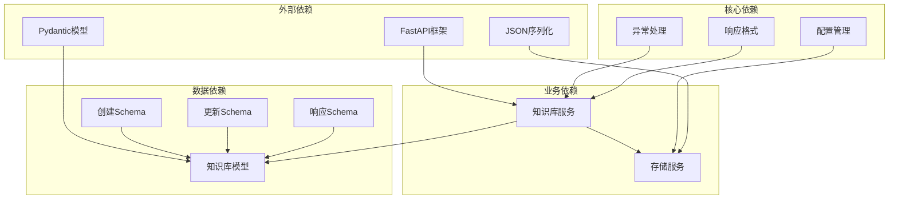

**图表来源**
- [knowledge_base.py](file://backend/app/controllers/knowledge_base.py#L1-L18)
- [knowledge_base.py](file://backend/app/services/knowledge_base.py#L1-L13)
- [knowledge_base_storage.py](file://backend/app/services/knowledge_base_storage.py#L1-L15)

### 循环依赖处理

系统通过以下方式避免循环依赖：
- **延迟导入**：在函数内部导入服务类，避免模块级循环依赖
- **接口抽象**：通过接口定义解耦具体实现
- **依赖注入**：使用构造函数注入而非全局状态

**章节来源**
- [knowledge_base.py](file://backend/app/controllers/knowledge_base.py#L34-L35)
- [knowledge_base.py](file://backend/app/services/knowledge_base.py#L18-L20)

## 性能考虑

### 存储优化策略

1. **索引机制**：使用JSON索引文件加速查询
2. **懒加载**：仅在需要时加载完整配置
3. **批量操作**：支持批量查询和更新
4. **缓存策略**：内存缓存常用配置

### 查询优化

1. **分页查询**：避免一次性加载大量数据
2. **条件过滤**：在存储层应用过滤条件
3. **索引利用**：利用索引文件快速定位资源
4. **并发控制**：支持高并发访问

### 内存管理

1. **对象池**：复用KnowledgeBase对象
2. **流式处理**：大文件采用流式读取
3. **垃圾回收**：及时释放不再使用的资源
4. **内存监控**：监控内存使用情况

## 故障排除指南

### 常见问题及解决方案

#### 1. 知识库创建失败

**症状**：创建知识库时返回409冲突错误
**原因**：知识库ID已存在或配置验证失败
**解决方案**：
- 检查知识库名称是否重复
- 验证嵌入模型配置
- 确认向量数据库连接

#### 2. 知识库查询超时

**症状**：列表查询响应缓慢
**原因**：索引文件损坏或存储空间不足
**解决方案**：
- 重建索引文件
- 清理过期数据
- 优化存储配置

#### 3. Schema更新失败

**症状**：更新Schema配置时返回404错误
**原因**：知识库不存在或Schema配置格式错误
**解决方案**：
- 验证知识库ID有效性
- 检查Schema字段定义
- 确认向量数据库类型兼容性

#### 4. 统计信息不准确

**症状**：统计信息与实际不符
**原因**：统计信息计算逻辑不完整
**解决方案**：
- 实现向量数据库统计查询
- 添加存储大小计算
- 优化索引状态检查

**章节来源**
- [exceptions.py](file://backend/app/core/exceptions.py#L29-L62)
- [knowledge_base_storage.py](file://backend/app/services/knowledge_base_storage.py#L96-L101)

### 调试技巧

1. **日志记录**：启用详细日志记录
2. **断点调试**：在关键位置设置断点
3. **单元测试**：编写全面的单元测试
4. **集成测试**：验证端到端流程

## 结论

知识库管理控制器是一个设计精良、功能完备的RESTful API系统。它成功地实现了以下目标：

### 技术优势
- **架构清晰**：采用分层架构，职责分离明确
- **标准合规**：严格遵循RESTful设计原则
- **类型安全**：使用Pydantic确保数据类型安全
- **异常处理**：完善的异常处理机制
- **响应格式**：统一的响应格式标准化

### 功能完整性
- **基础CRUD**：完整的知识库生命周期管理
- **高级功能**：配置获取、统计信息、Schema管理
- **扩展性**：良好的扩展接口设计
- **性能优化**：多层次的性能优化策略

### 最佳实践
- **代码组织**：模块化设计，职责单一
- **错误处理**：分层异常处理，用户友好
- **文档完善**：详细的API文档和注释
- **测试覆盖**：全面的测试策略

该控制器为RAG Studio系统提供了稳定可靠的知识库管理能力，是整个系统的重要基础设施。通过持续的优化和改进，它将继续为用户提供高质量的服务。