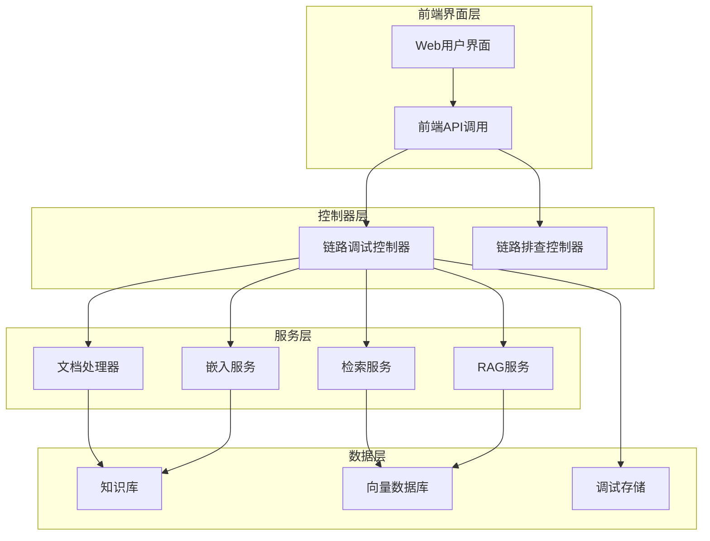
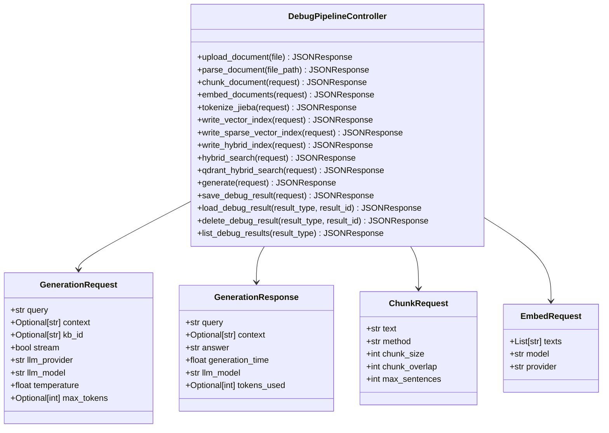
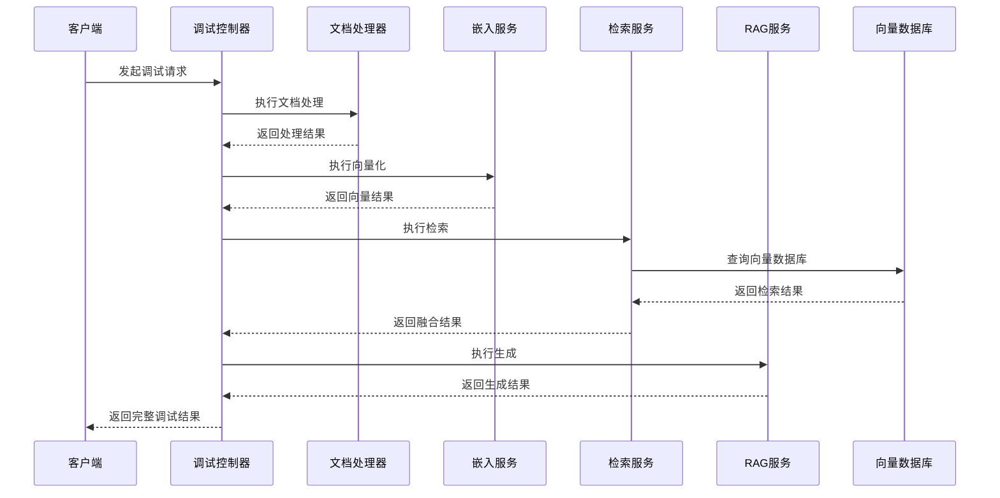
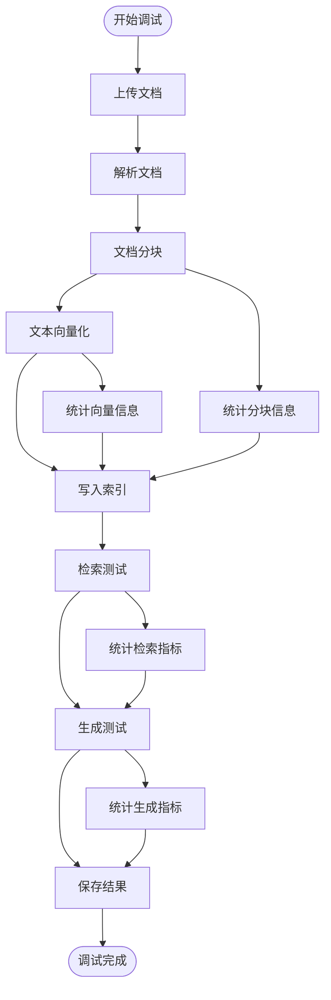
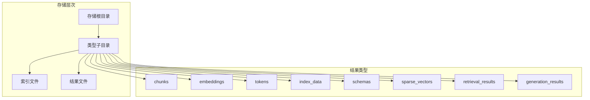
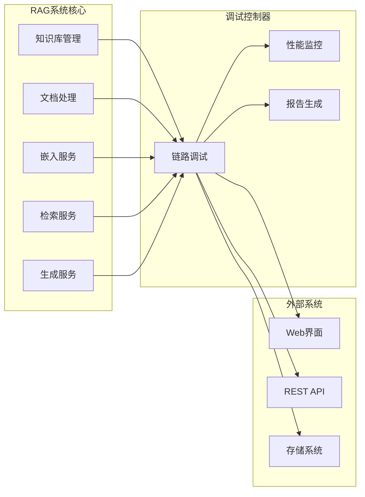

# 链路调试控制器技术文档

<cite>
**本文档引用的文件**
- [debug_pipeline.py](file://backend/app/controllers/debug_pipeline.py)
- [pipeline.py](file://backend/app/controllers/pipeline.py)
- [rag_service.py](file://backend/app/services/rag_service.py)
- [retrieval_service.py](file://backend/app/services/retrieval_service.py)
- [knowledge_base.py](file://backend/app/models/knowledge_base.py)
- [main.py](file://backend/app/main.py)
- [storage.ts](file://web/lib/storage.ts)
- [api.ts](file://web/lib/api.ts)
- [generation-test.tsx](file://web/components/views/generation-test.tsx)
</cite>

## 目录
1. [概述](#概述)
2. [系统架构](#系统架构)
3. [核心组件分析](#核心组件分析)
4. [API设计与实现](#api设计与实现)
5. [调试流程详解](#调试流程详解)
6. [结果存储与管理](#结果存储与管理)
7. [性能监控与优化](#性能监控与优化)
8. [集成与扩展](#集成与扩展)
9. [故障排除指南](#故障排除指南)
10. [总结](#总结)

## 概述

链路调试控制器是RAG（检索增强生成）系统中的核心调试工具，提供对RAG处理链路各阶段的深度可视化和性能分析能力。该控制器通过细粒度的链路拆解，帮助开发者快速定位系统瓶颈，优化处理流程，并为系统排查和性能调优提供关键支撑。

### 主要功能特性

- **全链路可视化**：覆盖文档解析、分块、嵌入、检索、生成等所有处理阶段
- **实时性能监控**：提供每个阶段的处理耗时、输入输出统计等详细指标
- **结构化调试结果**：以标准化格式保存和管理调试数据
- **多维度分析**：支持向量检索、关键词检索、混合检索等多种检索模式
- **灵活的配置管理**：支持多种嵌入模型、向量数据库和检索策略

## 系统架构

链路调试控制器采用分层架构设计，与RAG系统的核心处理流程紧密集成：

**图表来源**
- [debug_pipeline.py](file://backend/app/controllers/debug_pipeline.py#L28-L30)
- [pipeline.py](file://backend/app/controllers/pipeline.py#L11-L12)
- [main.py](file://backend/app/main.py#L93-L101)

**章节来源**
- [debug_pipeline.py](file://backend/app/controllers/debug_pipeline.py#L1-L50)
- [main.py](file://backend/app/main.py#L93-L101)

## 核心组件分析

### 调试控制器核心类图

**图表来源**
- [debug_pipeline.py](file://backend/app/controllers/debug_pipeline.py#L31-L87)
- [debug_pipeline.py](file://backend/app/controllers/debug_pipeline.py#L1629-L1649)

### 服务集成架构

**图表来源**
- [debug_pipeline.py](file://backend/app/controllers/debug_pipeline.py#L144-L172)
- [debug_pipeline.py](file://backend/app/controllers/debug_pipeline.py#L219-L275)
- [debug_pipeline.py](file://backend/app/controllers/debug_pipeline.py#L1142-L1198)

**章节来源**
- [debug_pipeline.py](file://backend/app/controllers/debug_pipeline.py#L31-L87)
- [debug_pipeline.py](file://backend/app/controllers/debug_pipeline.py#L1629-L1649)

## API设计与实现

### 文档处理API

文档处理模块提供了完整的文档解析和分块功能，支持多种文档格式和分块策略：

#### 文档上传接口
- **端点**: `POST /debug/document/upload`
- **功能**: 上传文档文件并保存到临时目录
- **输入**: 上传的文件对象
- **输出**: 文件信息和临时路径

#### 文档解析接口  
- **端点**: `POST /debug/document/parse`
- **功能**: 解析上传的文档内容
- **输入**: 文件路径
- **输出**: 解析后的文本内容和统计信息

#### 文档分块接口
- **端点**: `POST /debug/document/chunk`
- **功能**: 对文档进行智能分块
- **输入**: 分块配置参数
- **输出**: 分块结果列表和统计信息

### 向量化处理API

向量化模块负责将文本转换为高维向量表示：

#### 文本向量化接口
- **端点**: `POST /debug/embedding/embed`
- **功能**: 批量将文本转换为向量
- **输入**: 文本列表和嵌入配置
- **输出**: 向量列表和统计信息

#### 模型管理接口
- **端点**: `GET /debug/embedding/models`
- **功能**: 获取可用的嵌入模型列表
- **输出**: 模型配置信息

### 检索调试API

检索调试模块提供多种检索策略的对比和分析：

#### 混合检索接口
- **端点**: `POST /debug/retrieve/hybrid`
- **功能**: 执行向量+关键词混合检索
- **输入**: 检索配置和查询参数
- **输出**: 检索结果和融合分数

#### Qdrant原生混合检索
- **端点**: `POST /debug/retrieve/qdrant-hybrid`
- **功能**: 利用Qdrant原生能力执行混合检索
- **输入**: 查询向量和稀疏向量
- **输出**: 检索结果和性能指标

### 生成测试API

生成测试模块验证RAG系统的生成能力：

#### 答案生成接口
- **端点**: `POST /debug/generate`
- **功能**: 基于上下文生成答案
- **输入**: 查询问题和生成配置
- **输出**: 生成的答案和性能指标

**章节来源**
- [debug_pipeline.py](file://backend/app/controllers/debug_pipeline.py#L90-L275)
- [debug_pipeline.py](file://backend/app/controllers/debug_pipeline.py#L1142-L1294)
- [debug_pipeline.py](file://backend/app/controllers/debug_pipeline.py#L1651-L1786)

## 调试流程详解

### 完整链路调试流程

**图表来源**
- [debug_pipeline.py](file://backend/app/controllers/debug_pipeline.py#L90-L275)
- [debug_pipeline.py](file://backend/app/controllers/debug_pipeline.py#L1142-L1294)
- [debug_pipeline.py](file://backend/app/controllers/debug_pipeline.py#L1651-L1786)

### 阶段性调试机制

#### 1. 文档处理阶段
- **输入验证**: 检查文件格式、大小和内容完整性
- **解析优化**: 支持PDF、Word、TXT等多种格式
- **分块策略**: 提供固定大小、段落分割、句子分割等多种策略
- **质量控制**: 记录分块数量、平均长度、重叠比例等指标

#### 2. 向量化阶段
- **模型选择**: 支持多种嵌入模型和提供商
- **批量处理**: 优化大批量文本的处理效率
- **维度验证**: 确保向量维度与配置一致
- **性能监控**: 记录向量化耗时和吞吐量

#### 3. 索引构建阶段
- **多模态支持**: 支持稠密向量、稀疏向量和混合索引
- **Schema兼容**: 自动适配知识库的字段定义
- **批量写入**: 优化大规模数据的索引写入
- **一致性检查**: 验证向量与元数据的一致性

#### 4. 检索测试阶段
- **多策略对比**: 向量检索、关键词检索、混合检索
- **融合算法**: RRF、DBSF等多种融合策略
- **评分分析**: 详细记录每个检索结果的得分来源
- **性能基准**: 对比不同策略的检索效率

#### 5. 生成测试阶段
- **上下文构建**: 自动检索相关上下文或手动提供
- **Prompt优化**: 支持多种Prompt模板和配置
- **流式输出**: 支持实时生成和流式响应
- **质量评估**: 记录生成时间和Token使用情况

**章节来源**
- [debug_pipeline.py](file://backend/app/controllers/debug_pipeline.py#L144-L275)
- [debug_pipeline.py](file://backend/app/controllers/debug_pipeline.py#L1142-L1294)
- [debug_pipeline.py](file://backend/app/controllers/debug_pipeline.py#L1651-L1786)

## 结果存储与管理

### 调试结果存储架构

**图表来源**
- [debug_pipeline.py](file://backend/app/controllers/debug_pipeline.py#L1355-L1548)

### 结果管理API

#### 保存调试结果
- **端点**: `POST /debug/result/save`
- **功能**: 将调试结果持久化存储
- **输入**: 结果名称、类型、数据和元数据
- **输出**: 生成的唯一结果ID

#### 列出调试结果
- **端点**: `GET /debug/result/list/{result_type}`
- **功能**: 获取指定类型的所有调试结果
- **输出**: 结果列表，包含ID、名称、时间戳等信息

#### 加载调试结果
- **端点**: `GET /debug/result/load/{result_type}/{result_id}`
- **功能**: 加载特定的调试结果
- **输出**: 完整的调试结果数据

#### 删除调试结果
- **端点**: `DELETE /debug/result/delete/{result_type}/{result_id}`
- **功能**: 删除指定的调试结果
- **副作用**: 同时更新索引文件

### 数据结构设计

调试结果采用统一的JSON格式存储，包含以下核心字段：

| 字段名 | 类型 | 描述 | 必需 |
|--------|------|------|------|
| id | string | 唯一结果标识符 | 是 |
| name | string | 结果名称 | 是 |
| type | string | 结果类型 | 是 |
| data | object | 实际调试数据 | 是 |
| timestamp | integer | 时间戳（毫秒） | 是 |
| metadata | object | 元数据信息 | 否 |

**章节来源**
- [debug_pipeline.py](file://backend/app/controllers/debug_pipeline.py#L1355-L1548)
- [storage.ts](file://web/lib/storage.ts#L1-L46)
- [api.ts](file://web/lib/api.ts#L1030-L1107)

## 性能监控与优化

### 性能指标体系

链路调试控制器内置了全面的性能监控体系，涵盖各个处理阶段的关键指标：

#### 文档处理指标
- **解析耗时**: 文档解析的时间统计
- **分块效率**: 平均分块速度和批次处理能力
- **内存使用**: 处理过程中的内存占用情况
- **错误率**: 解析失败的比例统计

#### 向量化指标
- **向量化速度**: 每秒处理的文本数量
- **向量维度**: 输出向量的维度信息
- **模型性能**: 不同模型的处理效率对比
- **批处理效率**: 批量处理的吞吐量统计

#### 检索性能指标
- **检索延迟**: 从查询到结果返回的时间
- **召回率**: 检索结果的相关性统计
- **融合效果**: 不同融合策略的效果对比
- **索引效率**: 索引构建和查询的性能指标

#### 生成性能指标
- **生成速度**: 每秒生成的Token数量
- **响应时间**: 从请求到完整响应的时间
- **Token使用**: 平均每次生成的Token消耗
- **质量评估**: 生成内容的质量评分

### 优化策略

#### 并发处理优化
- **异步处理**: 所有I/O密集型操作采用异步模式
- **批量处理**: 对大量数据采用批量处理策略
- **资源池化**: 数据库连接和模型实例的连接池管理

#### 缓存策略
- **结果缓存**: 对重复的调试结果进行缓存
- **模型缓存**: 嵌入模型的实例复用
- **索引缓存**: 热点数据的内存缓存

#### 资源管理
- **内存控制**: 大文件处理时的内存使用限制
- **超时控制**: 各阶段操作的超时设置
- **错误恢复**: 异常情况下的优雅降级

**章节来源**
- [debug_pipeline.py](file://backend/app/controllers/debug_pipeline.py#L1662-L1727)
- [debug_pipeline.py](file://backend/app/controllers/debug_pipeline.py#L1730-L1786)

## 集成与扩展

### 与RAG系统的集成

链路调试控制器与RAG系统的其他组件保持良好的集成关系：

**图表来源**
- [debug_pipeline.py](file://backend/app/controllers/debug_pipeline.py#L1-L50)
- [main.py](file://backend/app/main.py#L93-L101)

### 扩展接口设计

#### 新增处理阶段
开发者可以通过以下方式扩展新的处理阶段：

1. **添加新的API端点**: 在控制器中定义新的路由
2. **实现处理逻辑**: 编写具体的处理函数
3. **集成到调试流程**: 将新阶段纳入完整的调试链路
4. **结果序列化**: 实现结果的标准化输出

#### 自定义调试指标
系统支持自定义性能指标的收集和展示：

- **指标定义**: 在相应处理阶段添加指标收集代码
- **数据聚合**: 实现指标的统计和聚合逻辑
- **可视化展示**: 在前端界面中添加相应的展示组件

#### 第三方服务集成
链路调试控制器设计了良好的扩展性，支持集成第三方服务：

- **嵌入模型**: 支持多种嵌入服务提供商
- **向量数据库**: 兼容多种向量数据库
- **LLM服务**: 支持多种大语言模型服务
- **分词服务**: 集成多种分词工具

**章节来源**
- [debug_pipeline.py](file://backend/app/controllers/debug_pipeline.py#L1-L50)
- [main.py](file://backend/app/main.py#L93-L101)

## 故障排除指南

### 常见问题诊断

#### 文档处理问题

**问题**: 文档解析失败
**可能原因**:
- 文件格式不支持
- 文件损坏或编码问题
- 内存不足

**解决方案**:
1. 检查文件格式是否在支持范围内
2. 验证文件完整性
3. 增加系统内存配置
4. 使用更小的文件进行测试

#### 向量化处理问题

**问题**: 嵌入模型调用失败
**可能原因**:
- 模型服务不可用
- 网络连接问题
- 输入数据格式错误

**解决方案**:
1. 检查Ollama服务状态
2. 验证网络连接
3. 检查输入文本的编码和长度
4. 尝试使用不同的模型

#### 检索性能问题

**问题**: 检索速度过慢
**可能原因**:
- 索引未建立或损坏
- 向量维度过高
- 查询向量质量差

**解决方案**:
1. 重新构建向量索引
2. 优化向量维度配置
3. 改进查询文本的质量
4. 调整检索参数

#### 生成质量问题

**问题**: 生成答案质量不佳
**可能原因**:
- 上下文不足
- Prompt设计不当
- LLM模型配置错误

**解决方案**:
1. 增加检索的上下文数量
2. 优化Prompt模板设计
3. 调整生成参数（温度、最大Token等）
4. 尝试不同的LLM模型

### 调试技巧

#### 分阶段调试
- 从简单的文档开始，逐步增加复杂度
- 单独测试每个处理阶段的功能
- 使用最小化的配置进行初步验证

#### 性能分析
- 监控各阶段的处理时间
- 分析内存和CPU使用情况
- 对比不同配置的性能差异

#### 结果验证
- 对比不同检索策略的结果
- 验证生成答案的相关性和准确性
- 检查调试结果的完整性和一致性

**章节来源**
- [debug_pipeline.py](file://backend/app/controllers/debug_pipeline.py#L142-L171)
- [debug_pipeline.py](file://backend/app/controllers/debug_pipeline.py#L212-L275)
- [debug_pipeline.py](file://backend/app/controllers/debug_pipeline.py#L1662-L1727)

## 总结

链路调试控制器作为RAG系统的重要组成部分，提供了全面而深入的链路调试能力。通过其精心设计的架构和丰富的功能特性，开发者可以：

1. **全面掌握系统性能**: 通过可视化界面了解每个处理阶段的详细信息
2. **快速定位问题**: 利用结构化的调试结果快速识别系统瓶颈
3. **优化处理流程**: 基于性能指标调整系统配置和参数
4. **保障系统质量**: 通过严格的调试流程确保系统的稳定性和可靠性

该控制器不仅是一个调试工具，更是RAG系统开发和运维过程中不可或缺的助手，为构建高质量的AI应用提供了强有力的技术支撑。随着系统的不断发展和完善，链路调试控制器将继续发挥其重要作用，推动RAG技术的广泛应用和发展。