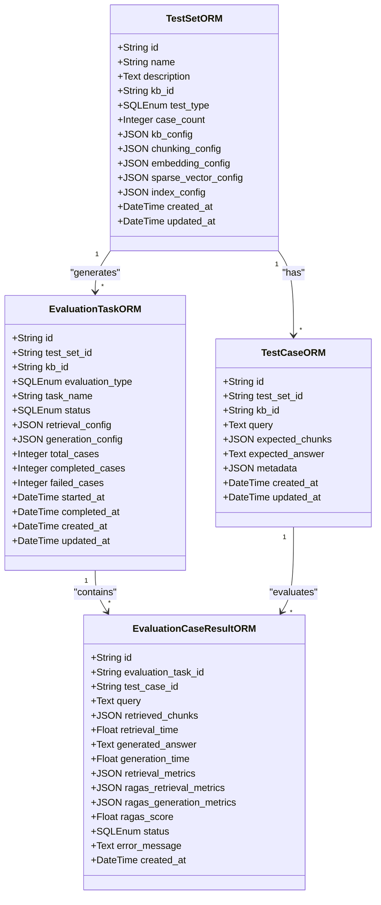
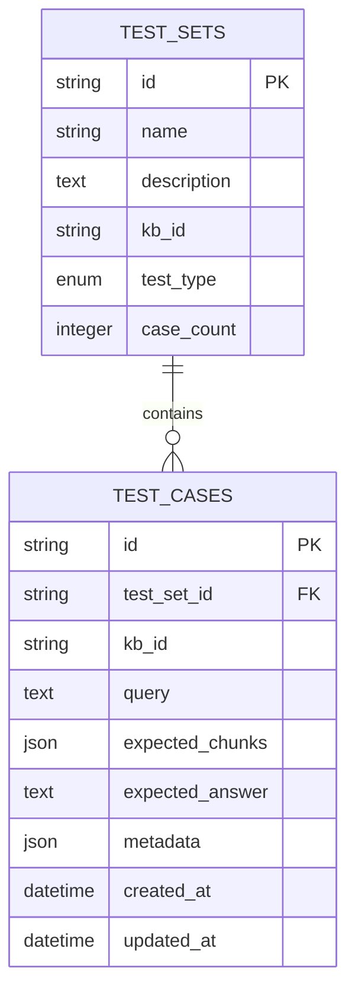
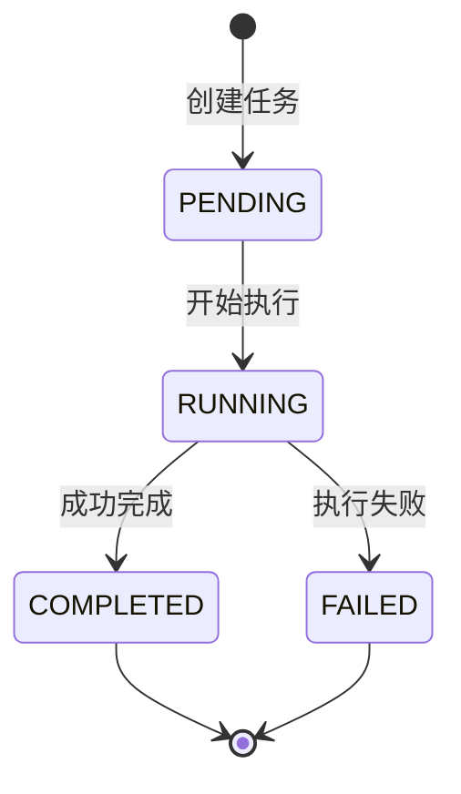
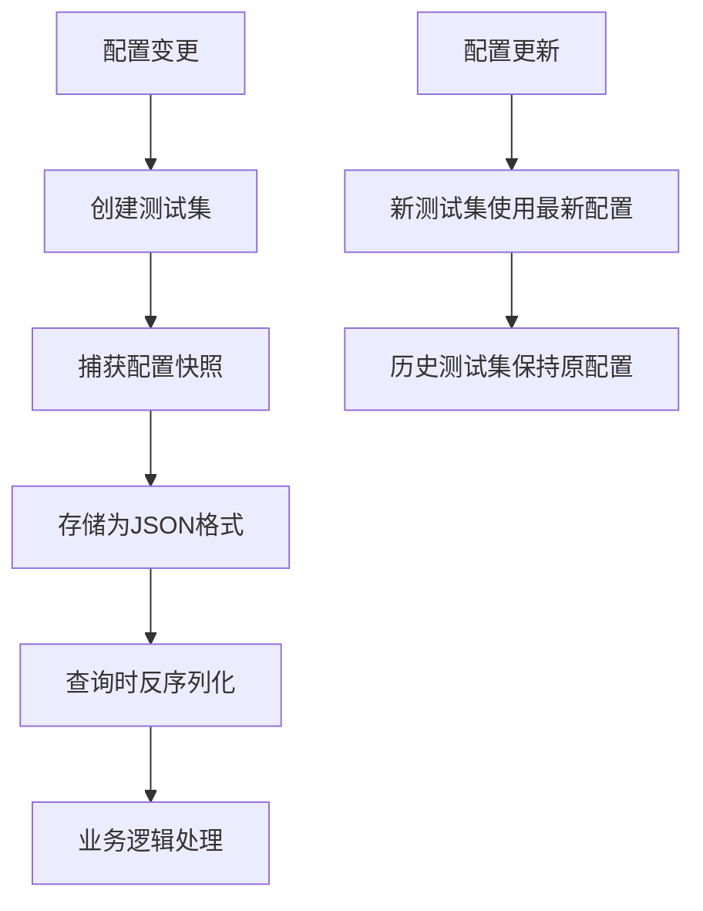
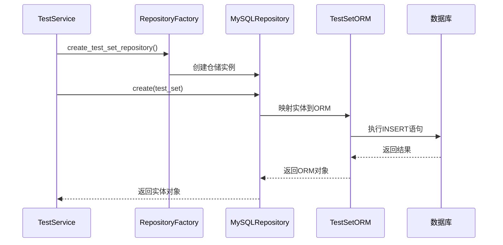
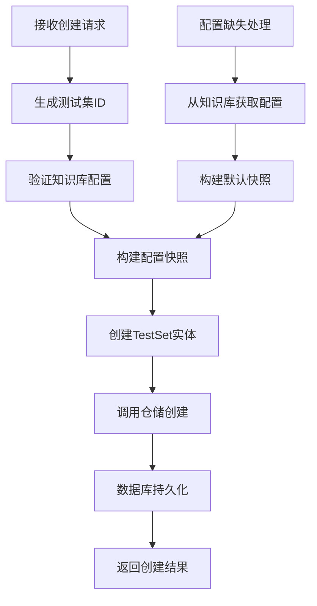

# ORM模型映射实现

<cite>
**本文档引用的文件**
- [models.py](file://backend/app/database/models.py)
- [test_service.py](file://backend/app/services/test_service.py)
- [test.py](file://backend/app/models/test.py)
- [test.py](file://backend/app/schemas/test.py)
- [mysql_repository.py](file://backend/app/repositories/mysql_repository.py)
- [factory.py](file://backend/app/repositories/factory.py)
</cite>

## 目录
1. [项目概述](#项目概述)
2. [核心ORM模型架构](#核心orm模型架构)
3. [TestSetORM详细分析](#testsetorm详细分析)
4. [TestCaseORM详细分析](#testcaseorm详细分析)
5. [EvaluationTaskORM详细分析](#evaluationtaskorm详细分析)
6. [枚举类型与数据一致性](#枚举类型与数据一致性)
7. [JSON字段配置快照机制](#json字段配置快照机制)
8. [时间戳自动管理](#时间戳自动管理)
9. [索引优化与查询性能](#索引优化与查询性能)
10. [服务层交互模式](#服务层交互模式)
11. [实际应用场景](#实际应用场景)
12. [总结](#总结)

## 项目概述

RAG Studio是一个基于SQLAlchemy ORM的测试管理系统，专门用于处理检索增强生成（RAG）系统的测试和评估。该系统通过精心设计的ORM模型实现了复杂的数据关系管理，支持测试集、测试用例、评估任务等多种实体的高效存储和查询。

## 核心ORM模型架构

系统采用分层架构设计，包含以下核心组件：



**图表来源**
- [models.py](file://backend/app/database/models.py#L23-L127)

**章节来源**
- [models.py](file://backend/app/database/models.py#L1-L128)

## TestSetORM详细分析

### 表结构设计

TestSetORM作为测试集的核心实体，采用了简洁而功能完整的表结构设计：

| 字段名 | 类型 | 约束 | 描述 |
|--------|------|------|------|
| id | String(50) | 主键 | 测试集唯一标识符 |
| name | String(100) | 非空 | 测试集名称 |
| description | Text | 可空 | 测试集描述信息 |
| kb_id | String(50) | 非空，索引 | 关联的知识库ID |
| test_type | SQLEnum | 非空，索引 | 测试类型（检索/生成） |
| case_count | Integer | 默认0 | 测试用例数量统计 |

### JSON字段配置快照

TestSetORM引入了多个JSON字段来存储动态配置快照，这是系统设计的关键创新：

- **kb_config**: 知识库配置快照，包含向量数据库类型、嵌入模型提供商等关键配置
- **chunking_config**: 分块策略配置，记录chunk大小、重叠等参数
- **embedding_config**: 嵌入模型配置，存储模型名称、维度等信息
- **sparse_vector_config**: 稀疏向量配置，支持BM25等算法参数
- **index_config**: 索引配置，包含schema字段和向量数据库配置

这种设计允许系统在测试执行时捕获配置快照，确保测试结果的可重现性和配置变更的追踪能力。

**章节来源**
- [models.py](file://backend/app/database/models.py#L23-L42)

## TestCaseORM详细分析

### 外键关系设计

TestCaseORM通过外键建立了与TestSetORM的一对多关系：



**图表来源**
- [models.py](file://backend/app/database/models.py#L45-L58)

### 级联删除机制

TestCaseORM的外键定义包含了级联删除约束：
```python
test_set_id = Column(String(50), ForeignKey("test_sets.id", ondelete="CASCADE"), nullable=False, index=True)
```

这种设计确保当测试集被删除时，所有相关的测试用例也会自动删除，维护了数据的一致性。

**章节来源**
- [models.py](file://backend/app/database/models.py#L45-L58)

## EvaluationTaskORM详细分析

### 评估任务生命周期管理

EvaluationTaskORM体现了完整的评估任务生命周期管理：



**图表来源**
- [models.py](file://backend/app/database/models.py#L61-L83)

### 统计字段设计

评估任务包含丰富的统计字段：
- **total_cases**: 总测试用例数量
- **completed_cases**: 已完成测试用例数量  
- **failed_cases**: 失败测试用例数量

这些字段支持实时的任务进度监控和状态跟踪。

**章节来源**
- [models.py](file://backend/app/database/models.py#L61-L83)

## 枚举类型与数据一致性

### TestTypeEnum枚举

系统定义了TestTypeEnum枚举来标准化测试类型：

```python
class TestTypeEnum(str, enum.Enum):
    RETRIEVAL = "retrieval"
    GENERATION = "generation"
```

### EvaluationStatusEnum枚举

评估状态枚举确保了任务状态的统一管理：

```python
class EvaluationStatusEnum(str, enum.Enum):
    PENDING = "pending"
    RUNNING = "running"
    COMPLETED = "completed"
    FAILED = "failed"
```

### SQLEnum的应用

通过SQLEnum类型，系统在数据库层面实现了数据一致性保障：

```python
test_type = Column(SQLEnum(TestTypeEnum), nullable=False, index=True)
status = Column(SQLEnum(EvaluationStatusEnum), nullable=False, default=EvaluationStatusEnum.PENDING, index=True)
```

这种设计防止了无效状态值的插入，确保了数据的完整性。

**章节来源**
- [models.py](file://backend/app/database/models.py#L11-L21)

## JSON字段配置快照机制

### 序列化机制

JSON字段的使用体现了现代数据库设计的最佳实践：



**图表来源**
- [test_service.py](file://backend/app/services/test_service.py#L35-L82)

### 配置快照的重要性

配置快照机制解决了以下关键问题：

1. **可重现性**: 确保测试结果可以追溯到特定的配置状态
2. **版本控制**: 支持配置变更的历史追踪
3. **故障排除**: 便于诊断测试失败的原因
4. **审计需求**: 满足合规性要求

**章节来源**
- [test_service.py](file://backend/app/services/test_service.py#L35-L82)

## 时间戳自动管理

### 自动时间戳技术原理

系统通过SQLAlchemy的函数表达式实现了数据库层的时间戳管理：

```python
created_at = Column(DateTime, nullable=False, server_default=func.now())
updated_at = Column(DateTime, nullable=False, server_default=func.now(), onupdate=func.now())
```

### 技术实现机制

1. **server_default=func.now()**: 在记录创建时自动设置当前时间
2. **onupdate=func.now()**: 在记录更新时自动更新时间为当前时间

这种设计的优势：
- **性能优化**: 减少了应用层的时间计算开销
- **一致性保证**: 确保所有时间戳来自同一时钟源
- **简化代码**: 应用层无需手动管理时间戳

**章节来源**
- [models.py](file://backend/app/database/models.py#L41-L42)
- [models.py](file://backend/app/database/models.py#L57-L58)
- [models.py](file://backend/app/database/models.py#L81-L82)
- [models.py](file://backend/app/database/models.py#L109-L109)

## 索引优化与查询性能

### 索引设计策略

系统在关键字段上建立了索引以优化查询性能：

| 表名 | 索引字段 | 索引类型 | 查询场景 |
|------|----------|----------|----------|
| test_sets | kb_id | 单列索引 | 知识库过滤查询 |
| test_sets | test_type | 单列索引 | 测试类型筛选 |
| test_cases | test_set_id | 单列索引 | 测试集内查询 |
| test_cases | kb_id | 单列索引 | 知识库关联查询 |
| evaluation_tasks | test_set_id | 单列索引 | 任务关联查询 |
| evaluation_tasks | kb_id | 单列索引 | 知识库任务查询 |
| evaluation_tasks | status | 单列索引 | 状态筛选查询 |

### 查询性能影响

索引设计对查询性能的影响：

1. **减少I/O操作**: 索引减少了磁盘读取次数
2. **加速排序**: 索引字段上的排序操作更高效
3. **提升连接性能**: 外键字段的索引优化了表连接
4. **支持范围查询**: 索引支持高效的范围查找

**章节来源**
- [models.py](file://backend/app/database/models.py#L30-L31)
- [models.py](file://backend/app/database/models.py#L49-L50)
- [models.py](file://backend/app/database/models.py#L66-L67)
- [models.py](file://backend/app/database/models.py#L70-L70)

## 服务层交互模式

### Repository模式实现

系统采用Repository模式来封装数据访问逻辑：



**图表来源**
- [test_service.py](file://backend/app/services/test_service.py#L24-L32)
- [mysql_repository.py](file://backend/app/repositories/mysql_repository.py#L19-L60)

### 仓储工厂模式

RepositoryFactory提供了统一的仓储创建接口：

```python
@staticmethod
def create_test_set_repository():
    """创建测试集仓储"""
    from app.models.test import TestSet
    return RepositoryFactory.create(TestSet, "test_sets")
```

这种设计的好处：
- **解耦**: 服务层不直接依赖具体的数据访问实现
- **可测试性**: 易于模拟和测试
- **扩展性**: 支持多种数据存储后端

**章节来源**
- [test_service.py](file://backend/app/services/test_service.py#L24-L32)
- [factory.py](file://backend/app/repositories/factory.py#L59-L65)

## 实际应用场景

### 测试集创建流程

以下是TestService中测试集创建的实际代码路径：



**图表来源**
- [test_service.py](file://backend/app/services/test_service.py#L35-L89)

### 批量测试用例创建

系统支持高效的批量测试用例创建：

```python
async def batch_create_test_cases(
    self,
    test_set_id: str,
    test_cases_data: List[Dict[str, Any]]
) -> Tuple[List[TestCase], List[Dict]]:
    """
    批量创建测试用例
    
    Args:
        test_set_id: 测试集ID
        test_cases_data: 测试用例数据列表
        
    Returns:
        (成功创建的测试用例列表, 失败记录列表)
    """
```

这种设计支持大规模测试数据的快速导入，提高了系统的实用性。

**章节来源**
- [test_service.py](file://backend/app/services/test_service.py#L167-L222)

## 总结

RAG Studio的ORM模型设计体现了现代数据库应用的最佳实践：

1. **数据一致性**: 通过枚举类型和外键约束确保数据完整性
2. **性能优化**: 合理的索引设计和自动时间戳管理
3. **灵活性**: JSON字段支持动态配置存储
4. **可维护性**: 清晰的分层架构和Repository模式
5. **可扩展性**: 支持多种测试类型和评估场景

这套ORM模型不仅满足了当前的功能需求，还为未来的功能扩展奠定了坚实的基础。通过精心设计的数据结构和合理的抽象层次，系统实现了高性能、高可用、易维护的企业级应用架构。