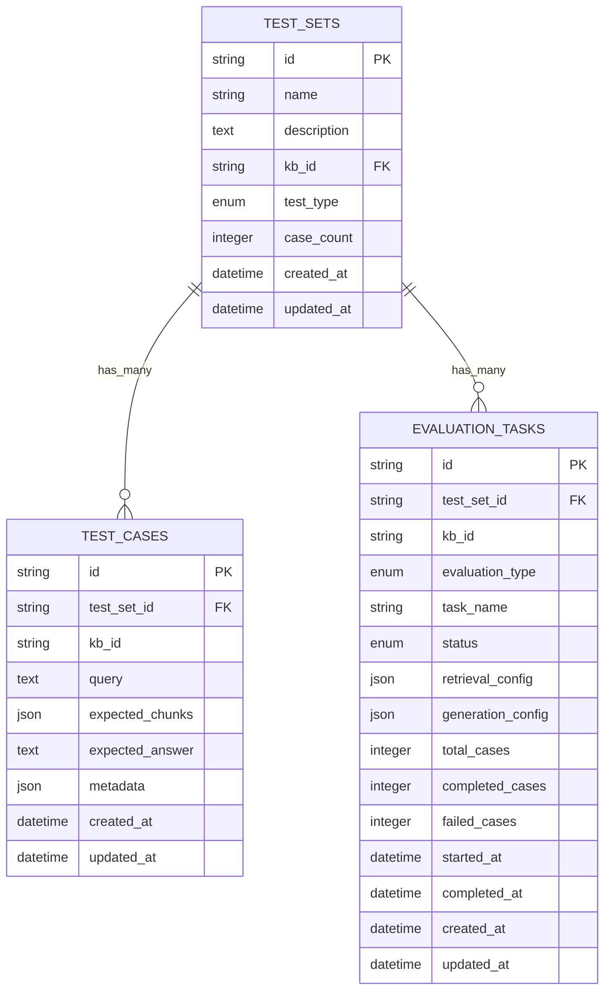

# 基础模型与数据库映射

<cite>
**本文档引用的文件**
- [base.py](file://backend/app/models/base.py)
- [models.py](file://backend/app/database/models.py)
- [__init__.py](file://backend/app/database/__init__.py)
- [document.py](file://backend/app/models/document.py)
- [evaluation.py](file://backend/app/models/evaluation.py)
- [knowledge_base.py](file://backend/app/models/knowledge_base.py)
- [test.py](file://backend/app/models/test.py)
- [mysql_repository.py](file://backend/app/repositories/mysql_repository.py)
- [001_create_evaluation_tables.py](file://backend/migrations/001_create_evaluation_tables.py)
</cite>

## 目录
1. [项目概述](#项目概述)
2. [基础模型架构](#基础模型架构)
3. [数据库ORM映射](#数据库orm映射)
4. [公共字段与通用方法](#公共字段与通用方法)
5. [JSON字段应用模式](#json字段应用模式)
6. [时间戳自动更新机制](#时间戳自动更新机制)
7. [Pydantic与ORM协作模式](#pydantic与orm协作模式)
8. [数据库迁移策略](#数据库迁移策略)
9. [模型继承体系](#模型继承体系)
10. [最佳实践与注意事项](#最佳实践与注意事项)

## 项目概述

RAG Studio采用分层架构设计，通过基础模型（BaseModelMixin）和SQLAlchemy ORM映射实现了统一的数据模型管理。该架构支持多种业务实体的标准化建模，包括知识库、文档、测试集、评估任务等核心功能模块。

### 核心设计理念

- **统一性**：所有实体模型都继承自基础模型，确保一致的字段结构和行为
- **灵活性**：支持复杂配置的JSON字段存储，适应不同业务场景的需求
- **可扩展性**：清晰的分层架构便于添加新的业务实体和功能模块
- **数据一致性**：通过ORM映射和Pydantic验证保证数据的完整性和有效性

## 基础模型架构

### BaseModelMixin设计

基础模型（BaseModelMixin）提供了所有实体模型的基础字段和通用方法：


**图表来源**
- [base.py](file://backend/app/models/base.py#L11-L31)
- [document.py](file://backend/app/models/document.py#L34-L61)
- [knowledge_base.py](file://backend/app/models/knowledge_base.py#L25-L80)
- [evaluation.py](file://backend/app/models/evaluation.py#L27-L48)

### 基础字段定义

基础模型包含三个核心字段：

| 字段名 | 类型 | 描述 | 默认值 | 必填 |
|--------|------|------|--------|------|
| id | str | 唯一标识符 | 自动生成 | 是 |
| created_at | datetime | 创建时间戳 | 当前时间 | 是 |
| updated_at | datetime | 更新时间戳 | 当前时间 | 是 |

**章节来源**
- [base.py](file://backend/app/models/base.py#L14-L16)

## 数据库ORM映射

### SQLAlchemy模型定义

数据库ORM模型通过SQLAlchemy定义，提供了与数据库表的直接映射关系：


**图表来源**
- [models.py](file://backend/app/database/models.py#L23-L43)
- [models.py](file://backend/app/database/models.py#L45-L59)
- [models.py](file://backend/app/database/models.py#L61-L84)

### 表名映射规则

每个ORM模型都通过`__tablename__`属性指定数据库表名：

| ORM模型 | 数据库表名 | 主要用途 |
|---------|------------|----------|
| TestSetORM | test_sets | 测试集配置和元数据 |
| TestCaseORM | test_cases | 单个测试用例详情 |
| EvaluationTaskORM | evaluation_tasks | 评估任务管理 |
| EvaluationCaseResultORM | evaluation_case_results | 评估结果记录 |
| EvaluationSummaryORM | evaluation_summaries | 评估汇总统计 |

**章节来源**
- [models.py](file://backend/app/database/models.py#L25-L26)
- [models.py](file://backend/app/database/models.py#L47-L48)
- [models.py](file://backend/app/database/models.py#L63-L64)

### 字段类型与约束

数据库字段定义遵循以下规范：

#### 基础字段类型

| 字段类型 | SQLAlchemy类型 | Pydantic类型 | 约束条件 | 示例 |
|----------|----------------|--------------|----------|------|
| 字符串 | String(length) | str | nullable设置 | `Column(String(50))` |
| 整数 | Integer | int | default值设置 | `Column(Integer, default=0)` |
| 文本 | Text | str | nullable=True | `Column(Text, nullable=True)` |
| 浮点数 | Float | float | nullable设置 | `Column(Float, nullable=True)` |
| 日期时间 | DateTime | datetime | server_default设置 | `Column(DateTime, server_default=func.now())` |
| JSON | JSON | dict/list | nullable=True | `Column(JSON, nullable=True)` |

#### 枚举类型定义


**图表来源**
- [models.py](file://backend/app/database/models.py#L11-L21)
- [document.py](file://backend/app/models/document.py#L12-L22)

**章节来源**
- [models.py](file://backend/app/database/models.py#L5-L7)

### 外键关联机制

外键关联通过`ForeignKey`定义，支持级联操作：



**图表来源**
- [models.py](file://backend/app/database/models.py#L49-L50)
- [models.py](file://backend/app/database/models.py#L65-L66)

### 索引配置

关键字段配置了索引以优化查询性能：

| 表名 | 索引字段 | 索引类型 | 用途 |
|------|----------|----------|------|
| test_sets | kb_id | 普通索引 | 知识库关联查询 |
| test_sets | test_type | 普通索引 | 测试类型过滤 |
| test_cases | test_set_id | 普通索引 | 测试集关联查询 |
| test_cases | kb_id | 普通索引 | 知识库关联查询 |
| evaluation_tasks | test_set_id | 普通索引 | 测试集关联查询 |
| evaluation_tasks | kb_id | 普通索引 | 知识库关联查询 |
| evaluation_tasks | status | 普通索引 | 状态过滤查询 |

**章节来源**
- [models.py](file://backend/app/database/models.py#L30-L31)
- [models.py](file://backend/app/database/models.py#L49-L50)
- [models.py](file://backend/app/database/models.py#L65-L66)

## 公共字段与通用方法

### 基础字段实现机制

基础模型通过Pydantic提供统一的字段定义和验证：


**图表来源**
- [base.py](file://backend/app/models/base.py#L14-L16)
- [base.py](file://backend/app/models/base.py#L27-L30)

### 通用方法详解

#### 时间戳序列化

基础模型提供了专门的时间戳序列化方法：

```python
@field_serializer('created_at', 'updated_at')
def serialize_datetime(self, value: datetime) -> str:
    """序列化datetime为ISO格式字符串"""
    return value.isoformat()
```

#### 时间戳更新机制

```python
def update_timestamp(self):
    """更新时间戳"""
    self.updated_at = datetime.now()
```

**章节来源**
- [base.py](file://backend/app/models/base.py#L22-L30)

## JSON字段应用模式

### 配置快照存储

JSON字段广泛应用于存储复杂的配置信息和元数据：


**图表来源**
- [models.py](file://backend/app/database/models.py#L34-L39)
- [test.py](file://backend/app/models/test.py#L38-L58)

### JSON字段具体应用

#### 测试集配置快照

| JSON字段 | 存储内容 | 示例结构 |
|----------|----------|----------|
| kb_config | 知识库配置 | `{ "vector_db_type": "qdrant", "embedding_provider": "ollama", "embedding_model": "bge-m3:latest" }` |
| chunking_config | 分块策略配置 | `{ "method": "fixed_size", "chunk_size": 500, "chunk_overlap": 50 }` |
| embedding_config | 嵌入模型参数 | `{ "model": "bge-m3:latest", "dimension": 768, "provider": "ollama" }` |
| sparse_vector_config | 稀疏向量配置 | `{ "method": "bm25", "k1": 1.2, "b": 0.75 }` |
| index_config | 索引配置 | `{ "schema_fields": [...], "vector_db_config": {...} }` |

#### 评估结果存储

| JSON字段 | 存储内容 | 示例结构 |
|----------|----------|----------|
| retrieval_metrics | 检索评估指标 | `{ "precision": 0.9, "recall": 0.85, "f1_score": 0.87 }` |
| ragas_retrieval_metrics | RAGAS检索指标 | `{ "context_precision": 0.88, "context_recall": 0.82 }` |
| ragas_generation_metrics | RAGAS生成指标 | `{ "faithfulness": 0.92, "answer_relevancy": 0.88 }` |
| retrieved_chunks | 检索到的分块 | `[{"chunk_id": "chunk_010", "score": 0.95, "content": "..."}]` |

**章节来源**
- [models.py](file://backend/app/database/models.py#L34-L39)
- [test.py](file://backend/app/models/test.py#L38-L58)
- [evaluation.py](file://backend/app/models/evaluation.py#L88-L101)

## 时间戳自动更新机制

### SQLAlchemy时间戳配置

数据库层面通过SQLAlchemy的`server_default`和`onupdate`参数实现自动时间戳管理：


**图表来源**
- [models.py](file://backend/app/database/models.py#L41-L42)
- [models.py](file://backend/app/database/models.py#L57-L58)
- [models.py](file://backend/app/database/models.py#L81-L82)

### 时间戳字段定义

| 字段名 | SQLAlchemy定义 | 功能说明 |
|--------|----------------|----------|
| created_at | `Column(DateTime, nullable=False, server_default=func.now())` | 记录创建时间，数据库自动设置 |
| updated_at | `Column(DateTime, nullable=False, server_default=func.now(), onupdate=func.now())` | 记录最后更新时间，插入和更新时自动设置 |

### Python层面时间戳处理

基础模型在Python层面也提供了时间戳的管理和序列化：


**图表来源**
- [base.py](file://backend/app/models/base.py#L15-L16)
- [base.py](file://backend/app/models/base.py#L27-L30)

**章节来源**
- [models.py](file://backend/app/database/models.py#L41-L42)
- [models.py](file://backend/app/database/models.py#L57-L58)
- [models.py](file://backend/app/database/models.py#L81-L82)

## Pydantic与ORM协作模式

### 混入类设计模式

基础模型采用混入类（Mixin）设计模式，实现了Pydantic和ORM的无缝协作：


**图表来源**
- [base.py](file://backend/app/models/base.py#L11-L31)
- [models.py](file://backend/app/database/models.py#L23-L43)

### 转换机制实现

#### ORM到Pydantic转换


**图表来源**
- [mysql_repository.py](file://backend/app/repositories/mysql_repository.py#L85-L100)

#### Pydantic到ORM转换


**图表来源**
- [mysql_repository.py](file://backend/app/repositories/mysql_repository.py#L57-L75)

### 配置兼容性

基础模型通过`Config.from_attributes = True`配置实现了ORM模型的直接转换：

| 配置项 | 值 | 作用 |
|--------|-----|------|
| from_attributes | True | 允许从ORM模型创建Pydantic模型 |
| json_schema_extra | dict | 提供示例数据和验证规则 |

**章节来源**
- [base.py](file://backend/app/models/base.py#L18-L21)
- [document.py](file://backend/app/models/document.py#L62-L74)

## 数据库迁移策略

### 迁移脚本结构

数据库迁移通过独立的Python脚本管理，支持表的创建和删除：


**图表来源**
- [001_create_evaluation_tables.py](file://backend/migrations/001_create_evaluation_tables.py#L16-L43)

### 迁移流程管理

#### 表创建流程

1. **依赖检查**：验证数据库连接和权限
2. **元数据准备**：收集所有ORM模型的表结构定义
3. **批量创建**：通过`Base.metadata.create_all()`创建所有表
4. **完整性验证**：确认所有表创建成功
5. **日志记录**：记录创建过程和结果

#### 表删除流程

1. **安全检查**：确认删除操作的安全性
2. **级联处理**：处理外键约束和依赖关系
3. **批量删除**：通过`Base.metadata.drop_all()`删除所有表
4. **清理验证**：确认所有表删除成功
5. **日志记录**：记录删除过程和结果

### 数据库连接配置

数据库连接通过SQLAlchemy的声明基类管理：


**图表来源**
- [__init__.py](file://backend/app/database/__init__.py#L18-L28)

**章节来源**
- [001_create_evaluation_tables.py](file://backend/migrations/001_create_evaluation_tables.py#L16-L43)
- [__init__.py](file://backend/app/database/__init__.py#L18-L28)

## 模型继承体系

### 层次结构设计

系统采用多层继承结构，确保代码的可维护性和扩展性：


**图表来源**
- [base.py](file://backend/app/models/base.py#L11-L31)
- [models.py](file://backend/app/database/models.py#L23-L128)

### 继承关系详解

#### 基础模型层

- **BaseModelMixin**：提供通用字段和方法
- **字段定义**：id、created_at、updated_at
- **方法定义**：时间戳序列化、更新方法

#### 业务模型层

- **Document**：文档实体模型
- **KnowledgeBase**：知识库实体模型  
- **EvaluationTask**：评估任务实体模型
- **TestSet**：测试集实体模型

#### 数据库模型层

- **TestSetORM**：测试集数据库模型
- **TestCaseORM**：测试用例数据库模型
- **EvaluationTaskORM**：评估任务数据库模型
- **EvaluationCaseResultORM**：评估结果数据库模型
- **EvaluationSummaryORM**：评估汇总数据库模型

### 扩展性设计

新业务实体的添加遵循以下步骤：

1. **继承基础模型**：从BaseModelMixin继承
2. **定义业务字段**：添加特定于业务的字段
3. **配置ORM模型**：创建对应的SQLAlchemy模型
4. **注册仓库**：添加相应的数据访问层
5. **配置路由**：添加API接口路由

**章节来源**
- [base.py](file://backend/app/models/base.py#L11-L31)
- [document.py](file://backend/app/models/document.py#L34-L61)
- [knowledge_base.py](file://backend/app/models/knowledge_base.py#L25-L80)
- [evaluation.py](file://backend/app/models/evaluation.py#L27-L48)
- [test.py](file://backend/app/models/test.py#L26-L81)

## 最佳实践与注意事项

### 字段设计原则

#### 类型选择指南

| 场景 | 推荐类型 | 说明 |
|------|----------|------|
| 唯一标识 | String(50) | UUID格式，便于追踪 |
| 名称字段 | String(100) | 支持较长的描述性名称 |
| 数值统计 | Integer | 整数类型，避免浮点误差 |
| 配置信息 | JSON | 支持灵活的配置结构 |
| 文本内容 | Text | 支持大段文本存储 |
| 浮点数值 | Float | 精度要求较高的数值 |

#### 约束设置建议


### 性能优化建议

#### 索引策略

1. **主键索引**：所有表的主键自动建立索引
2. **外键索引**：关联字段建立普通索引
3. **枚举字段**：状态、类型等枚举字段建立索引
4. **复合索引**：经常一起查询的字段组合建立复合索引

#### 查询优化

1. **字段选择**：只查询需要的字段，避免SELECT *
2. **分页查询**：大数据量查询使用分页机制
3. **缓存策略**：频繁查询的数据建立缓存
4. **连接池**：合理配置数据库连接池参数

### 数据一致性保障

#### 事务管理


#### 错误处理

1. **异常捕获**：捕获数据库连接和操作异常
2. **回滚机制**：操作失败时自动回滚事务
3. **重试策略**：网络异常时的重试机制
4. **日志记录**：详细的错误日志便于排查

### 安全考虑

#### 输入验证

1. **字段验证**：使用Pydantic进行字段级别的验证
2. **业务规则**：实现业务逻辑层面的验证
3. **SQL注入防护**：使用ORM避免原生SQL注入
4. **敏感数据**：对敏感信息进行适当的脱敏处理

#### 权限控制

1. **数据隔离**：按用户或组织隔离数据
2. **操作审计**：记录关键操作的审计日志
3. **访问控制**：实现细粒度的权限控制
4. **数据备份**：定期备份重要数据

### 维护和监控

#### 数据库监控

1. **连接监控**：监控数据库连接状态
2. **查询性能**：监控慢查询和高负载查询
3. **存储空间**：监控数据库存储使用情况
4. **备份状态**：监控数据备份的完整性

#### 版本管理

1. **迁移版本**：维护数据库迁移的历史版本
2. **配置管理**：版本化的配置文件管理
3. **部署策略**：灰度发布和回滚机制
4. **变更记录**：详细的变更日志记录

通过遵循这些最佳实践，可以确保系统的稳定性、性能和可维护性，同时为未来的功能扩展奠定良好的基础。