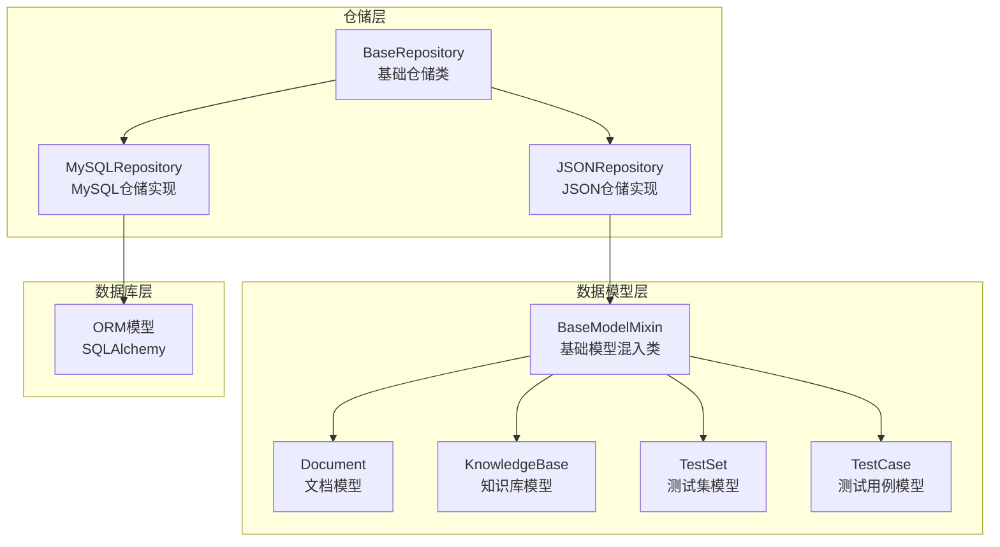
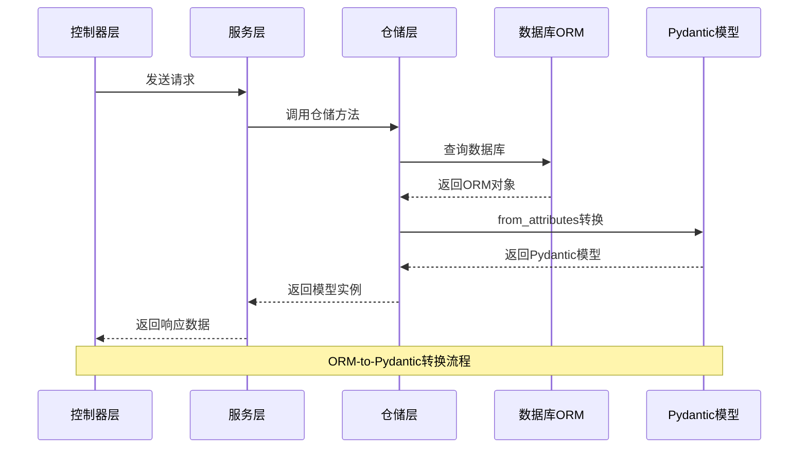
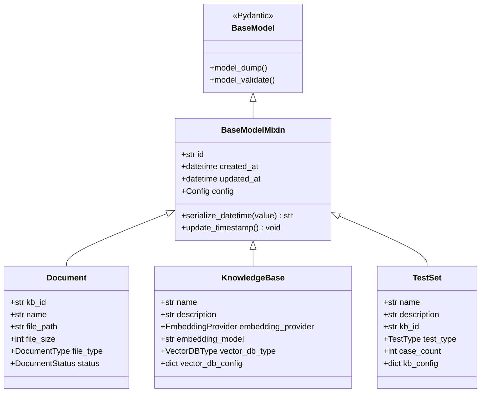
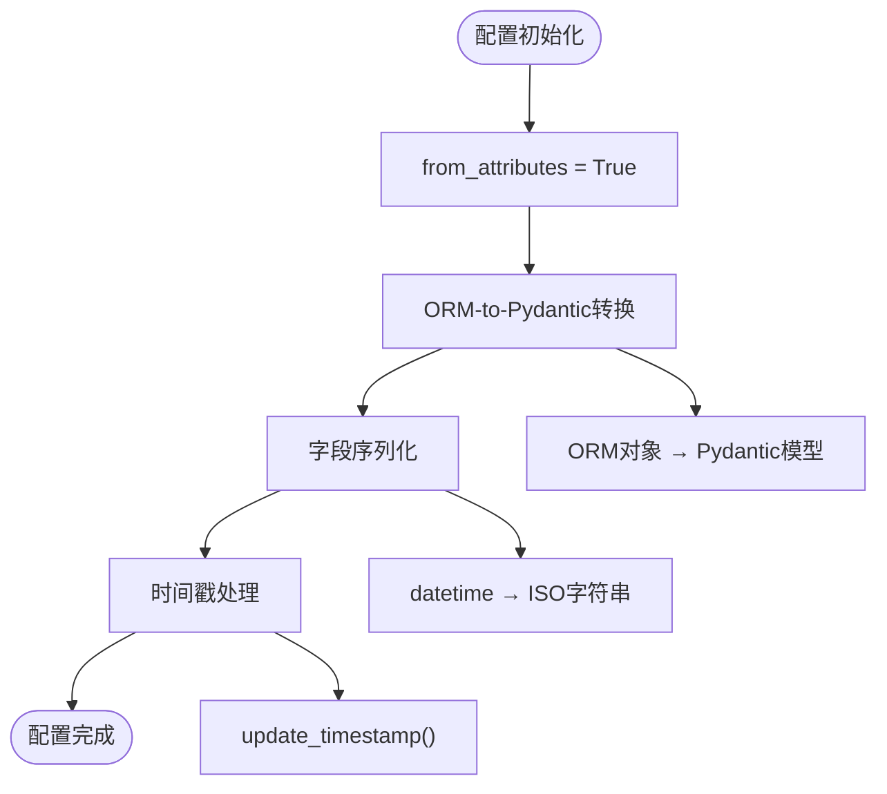
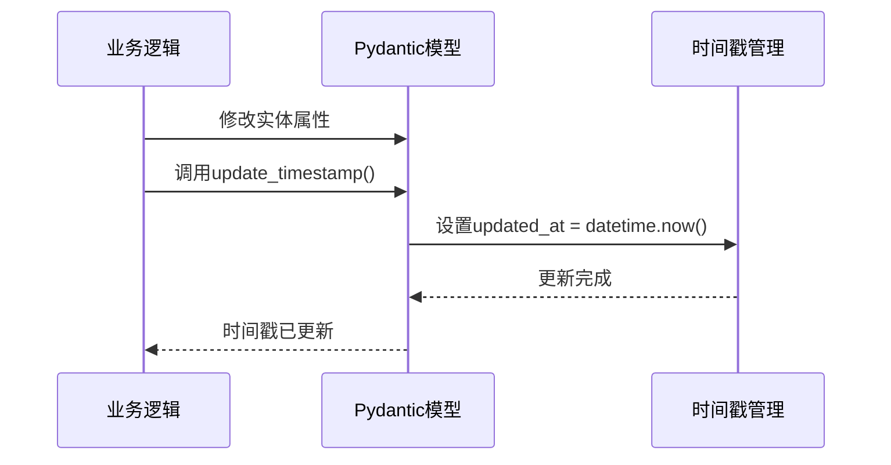
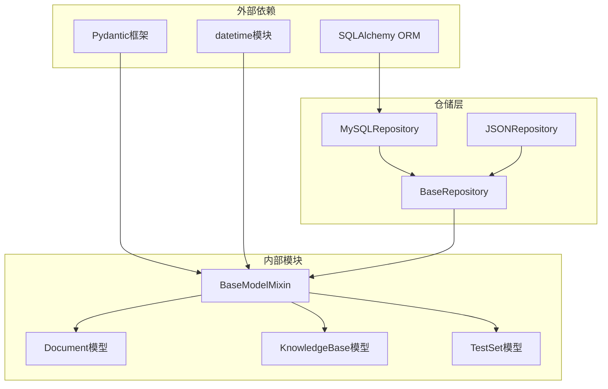

# 基础模型混入类

<cite>
**本文档引用的文件**
- [base.py](file://backend/app/models/base.py)
- [document.py](file://backend/app/models/document.py)
- [knowledge_base.py](file://backend/app/models/knowledge_base.py)
- [test.py](file://backend/app/models/test.py)
- [__init__.py](file://backend/app/models/__init__.py)
- [common.py](file://backend/app/schemas/common.py)
- [models.py](file://backend/app/database/models.py)
- [mysql_repository.py](file://backend/app/repositories/mysql_repository.py)
- [json_repository.py](file://backend/app/repositories/json_repository.py)
- [base.py](file://backend/app/repositories/base.py)
</cite>

## 目录
1. [简介](#简介)
2. [项目结构](#项目结构)
3. [核心组件](#核心组件)
4. [架构概览](#架构概览)
5. [详细组件分析](#详细组件分析)
6. [依赖关系分析](#依赖关系分析)
7. [性能考虑](#性能考虑)
8. [故障排除指南](#故障排除指南)
9. [结论](#结论)

## 简介

BaseModelMixin是RAG Studio项目中所有Pydantic模型的基础混入类，它为整个应用提供了统一的数据模型基础设施。该类通过提供标准的id、created_at、updated_at字段，以及ORM-to-Pydantic转换支持和时间戳管理功能，确保了数据模型的一致性和可维护性。

BaseModelMixin的设计理念是遵循单一职责原则，专注于提供通用的数据模型功能，而不涉及具体的业务逻辑。这种设计使得所有继承自该类的模型都能自动获得一致的时间戳管理、序列化支持和ORM兼容性。

## 项目结构

RAG Studio项目采用分层架构设计，BaseModelMixin位于数据模型层的核心位置，为上层的业务逻辑提供标准化的数据结构支持。



**图表来源**
- [base.py](file://backend/app/models/base.py#L11-L31)
- [document.py](file://backend/app/models/document.py#L34-L116)
- [knowledge_base.py](file://backend/app/models/knowledge_base.py#L25-L80)
- [test.py](file://backend/app/models/test.py#L26-L227)

**章节来源**
- [base.py](file://backend/app/models/base.py#L1-L31)
- [__init__.py](file://backend/app/models/__init__.py#L1-L49)

## 核心组件

BaseModelMixin类包含以下核心组件：

### 字段定义
- **id**: 唯一标识符，使用str类型确保全局唯一性
- **created_at**: 创建时间，默认工厂函数生成当前时间
- **updated_at**: 更新时间，默认工厂函数生成当前时间

### 配置设置
- **from_attributes**: 启用ORM-to-Pydantic转换功能
- **field_serializer**: 自动序列化datetime对象为ISO格式字符串

### 方法功能
- **update_timestamp**: 更新updated_at字段为当前时间
- **serialize_datetime**: 自定义序列化器处理时间戳格式

**章节来源**
- [base.py](file://backend/app/models/base.py#L11-L31)

## 架构概览

BaseModelMixin在整个应用架构中扮演着关键的桥梁角色，连接了数据模型层、仓储层和数据库层。



**图表来源**
- [mysql_repository.py](file://backend/app/repositories/mysql_repository.py#L75-L87)
- [base.py](file://backend/app/models/base.py#L18-L20)

## 详细组件分析

### BaseModelMixin类分析

BaseModelMixin类采用了Python的混入模式（Mixin Pattern），通过继承BaseModel类并添加通用功能，为所有子类提供一致的行为。



**图表来源**
- [base.py](file://backend/app/models/base.py#L11-L31)
- [document.py](file://backend/app/models/document.py#L34-L116)
- [knowledge_base.py](file://backend/app/models/knowledge_base.py#L25-L80)
- [test.py](file://backend/app/models/test.py#L26-L227)

#### 字段定义详解

**id字段**
- 类型：str
- 必填：是（使用Field(...)表示必需）
- 描述：唯一标识符，确保每个实体的全局唯一性
- 设计考虑：使用字符串类型而非整数，便于分布式系统的ID生成和管理

**created_at字段**
- 类型：datetime
- 默认值：default_factory=datetime.now
- 描述：记录实体的创建时间
- 特点：自动设置，不可修改，确保数据的审计追踪

**updated_at字段**
- 类型：datetime
- 默认值：default_factory=datetime.now
- 描述：记录实体的最后更新时间
- 特点：支持手动更新，配合update_timestamp方法使用

#### Config配置分析



**图表来源**
- [base.py](file://backend/app/models/base.py#L18-L20)

**章节来源**
- [base.py](file://backend/app/models/base.py#L11-L31)

### 序列化器实现

serialize_datetime方法展示了BaseModelMixin的序列化能力，它将datetime对象自动转换为ISO格式字符串，确保API响应的一致性。

```mermaid
flowchart LR
Input[datetime对象] --> Serializer[serialize_datetime方法]
Serializer --> ISOFormat[value.isoformat()]
ISOFormat --> Output["ISO格式字符串"]
Input --> |"2024-01-15 10:30:00"| Output --> |"2024-01-15T10:30:00"| Example["示例：2024-01-15T10:30:00"]
```

**图表来源**
- [base.py](file://backend/app/models/base.py#L22-L25)

**章节来源**
- [base.py](file://backend/app/models/base.py#L22-L25)

### 时间戳管理

update_timestamp方法提供了统一的时间戳更新机制，确保业务逻辑中能够及时更新实体的最后修改时间。



**图表来源**
- [base.py](file://backend/app/models/base.py#L27-L29)

**章节来源**
- [base.py](file://backend/app/models/base.py#L27-L29)

### ORM兼容性

from_attributes配置使得BaseModelMixin能够直接从SQLAlchemy ORM对象创建Pydantic模型实例，这是现代Web应用中常见的需求。

**章节来源**
- [base.py](file://backend/app/models/base.py#L18-L20)

## 依赖关系分析

BaseModelMixin的依赖关系体现了良好的分层架构设计，避免了循环依赖和紧耦合。



**图表来源**
- [base.py](file://backend/app/models/base.py#L1-L9)
- [base.py](file://backend/app/models/base.py#L11-L31)
- [base.py](file://backend/app/repositories/base.py#L1-L10)

**章节来源**
- [base.py](file://backend/app/models/base.py#L1-L9)
- [base.py](file://backend/app/repositories/base.py#L1-L10)

## 性能考虑

BaseModelMixin的设计充分考虑了性能优化：

### 内存效率
- 使用default_factory而非直接赋值，避免不必要的对象创建
- 字段序列化采用惰性处理，只在需要时进行转换

### 计算效率
- update_timestamp方法仅更新单个字段，避免全量更新
- 序列化器针对datetime类型进行了专门优化

### 并发安全
- datetime.now()的调用是线程安全的
- Pydantic模型的字段访问是原子操作

## 故障排除指南

### 常见问题及解决方案

**问题1：ORM-to-Pydantic转换失败**
- **症状**：TypeError或AttributeError异常
- **原因**：from_attributes配置未启用或字段名不匹配
- **解决方案**：确保BaseModelMixin的Config中设置了from_attributes=True

**问题2：时间戳序列化异常**
- **症状**：JSON序列化时出现datetime类型错误
- **原因**：自定义序列化器未正确注册
- **解决方案**：检查@field_serializer装饰器的字段名是否正确

**问题3：update_timestamp方法无效**
- **症状**：调用后updated_at字段未更新
- **原因**：模型实例不是Mutable对象或字段被冻结
- **解决方案**：确保模型实例允许字段修改

**章节来源**
- [base.py](file://backend/app/models/base.py#L18-L20)
- [base.py](file://backend/app/models/base.py#L22-L25)
- [base.py](file://backend/app/models/base.py#L27-L29)

## 结论

BaseModelMixin类作为RAG Studio项目的核心数据模型基础设施，成功实现了以下目标：

### 设计优势
- **一致性**：为所有模型提供统一的字段结构和行为
- **可扩展性**：通过混入模式支持灵活的功能扩展
- **可维护性**：集中化的功能实现减少了代码重复
- **兼容性**：良好的ORM集成支持多种数据持久化方案

### 最佳实践建议
1. **继承使用**：所有新的数据模型都应该继承自BaseModelMixin
2. **字段定制**：在子类中可以添加特定业务字段，保持基础字段不变
3. **序列化控制**：利用内置的序列化器确保API响应格式的一致性
4. **时间管理**：合理使用update_timestamp方法管理实体的生命周期

### 未来发展方向
- 支持更多类型的ID生成策略
- 增强序列化器的灵活性
- 提供更多的字段验证规则
- 支持异步操作的优化

BaseModelMixin的设计体现了现代软件架构的最佳实践，为RAG Studio项目的稳定性和可扩展性奠定了坚实的基础。