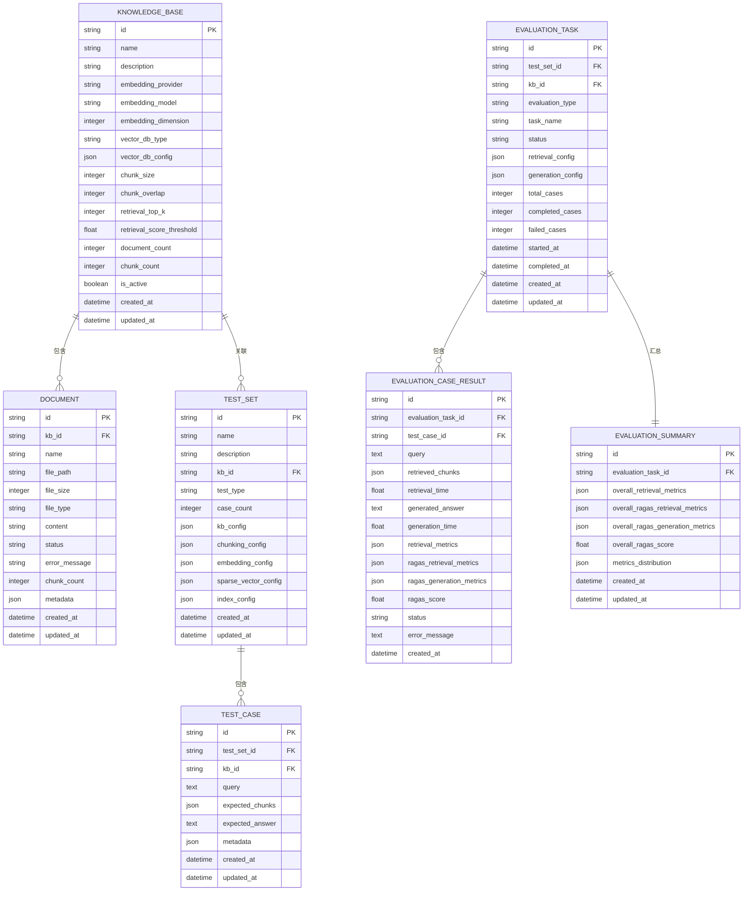

# 数据模型与实体

<cite>
**本文档引用的文件**
- [base.py](file://backend/app/models/base.py)
- [knowledge_base.py](file://backend/app/models/knowledge_base.py)
- [document.py](file://backend/app/models/document.py)
- [test.py](file://backend/app/models/test.py)
- [evaluation.py](file://backend/app/models/evaluation.py)
- [models.py](file://backend/app/database/models.py)
- [__init__.py](file://backend/app/models/__init__.py)
</cite>

## 目录
1. [简介](#简介)
2. [核心数据模型](#核心数据模型)
3. [ORM映射关系](#orm映射关系)
4. [基类与公共字段](#基类与公共字段)
5. [数据库表结构设计](#数据库表结构设计)
6. [实体关系图示](#实体关系图示)
7. [数据验证与生命周期](#数据验证与生命周期)
8. [实践指导](#实践指导)

## 简介
RAG-Studio数据模型采用Pydantic定义数据结构，通过SQLAlchemy实现ORM映射，构建了完整的知识管理与评估体系。系统核心实体包括知识库（KnowledgeBase）、文档（Document）、测试集（TestSet）和评估结果（EvaluationResult），各实体通过ID关联形成层次化数据结构。模型设计遵循分层原则，base.py提供公共字段和方法，各业务模型继承基类并扩展特定属性，确保数据一致性与可维护性。

## 核心数据模型

### KnowledgeBase（知识库）
知识库是系统核心容器，管理文档存储与检索配置。主要字段包括：
- **基础信息**：id（唯一标识）、name（名称）、description（描述）
- **嵌入配置**：embedding_provider（嵌入提供商）、embedding_model（模型名称）、embedding_dimension（向量维度）
- **向量数据库**：vector_db_type（数据库类型）、vector_db_config（配置参数）
- **分块策略**：chunk_size（分块大小）、chunk_overlap（重叠长度）
- **检索参数**：retrieval_top_k（返回数量）、retrieval_score_threshold（分数阈值）
- **统计信息**：document_count（文档数）、chunk_count（分块数）
- **状态**：is_active（激活状态）

### Document（文档）
文档实体表示知识库中的单个文件，包含处理状态与元数据：
- **关联信息**：kb_id（知识库ID）、id（文档ID）
- **文件属性**：name（文件名）、file_path（存储路径）、file_size（大小）、file_type（类型）
- **内容信息**：content（原始内容）
- **处理状态**：status（状态）、error_message（错误信息）
- **处理结果**：chunk_count（分块数量）
- **元数据**：metadata（自定义元数据）

### TestSet（测试集）
测试集用于评估检索与生成效果，包含配置快照：
- **基本信息**：id、name、description
- **关联信息**：kb_id（知识库ID）、test_type（测试类型）
- **统计信息**：case_count（用例数量）
- **配置快照**：kb_config（知识库配置）、chunking_config（分块配置）、embedding_config（嵌入配置）、sparse_vector_config（稀疏向量配置）、index_config（索引配置）

### EvaluationResult（评估结果）
评估结果包含详细指标与状态：
- **任务关联**：evaluation_task_id、test_case_id、kb_id
- **输入输出**：query（查询）、retrieved_chunks（检索结果）、generated_answer（生成答案）
- **性能指标**：retrieval_time（检索耗时）、generation_time（生成耗时）
- **评估指标**：precision（精确率）、recall（召回率）、f1_score（F1分数）、mrr（平均倒数排名）、map_score（平均精度均值）、ndcg（归一化折损累积增益）、hit_rate（命中率）
- **状态**：status（状态）、error_message（错误信息）

**Section sources**
- [knowledge_base.py](file://backend/app/models/knowledge_base.py#L25-L80)
- [document.py](file://backend/app/models/document.py#L34-L116)
- [test.py](file://backend/app/models/test.py#L26-L227)
- [evaluation.py](file://backend/app/models/evaluation.py#L27-L179)

## ORM映射关系

### 主键与外键约束
系统采用字符串主键（50字符）而非自增ID，便于分布式系统集成。外键约束确保数据完整性：
- **TestSetORM**：id为主键，无外键
- **TestCaseORM**：test_set_id外键关联test_sets.id，启用CASCADE删除
- **EvaluationTaskORM**：test_set_id外键关联test_sets.id
- **EvaluationCaseResultORM**：evaluation_task_id外键关联evaluation_tasks.id（CASCADE），test_case_id外键关联test_cases.id
- **EvaluationSummaryORM**：evaluation_task_id外键关联evaluation_tasks.id（CASCADE），且为唯一约束

### 索引设计
关键查询字段均建立索引以提升性能：
- **TestSetORM**：kb_id、test_type字段索引
- **TestCaseORM**：test_set_id、kb_id字段索引
- **EvaluationTaskORM**：test_set_id、kb_id、status字段索引
- **EvaluationCaseResultORM**：evaluation_task_id、test_case_id字段索引
- **时间字段**：所有实体的created_at、updated_at自动创建索引

### JSON字段应用
复杂配置采用JSON字段存储，保持Schema灵活性：
- **配置快照**：kb_config、chunking_config、embedding_config、sparse_vector_config、index_config
- **元数据**：metadata字段存储文档级元数据
- **结果数据**：retrieved_chunks、retrieval_metrics等嵌套结构

**Section sources**
- [models.py](file://backend/app/database/models.py#L23-L128)

## 基类与公共字段

### BaseModelMixin
所有模型继承BaseModelMixin，提供统一基础字段：
- **id**：字符串类型，必填，作为唯一标识符
- **created_at**：创建时间，默认当前时间，自动序列化为ISO格式
- **updated_at**：更新时间，默认当前时间，自动序列化为ISO格式

### 公共方法
- **update_timestamp**：更新updated_at字段为当前时间
- **序列化处理**：@field_serializer装饰器自动将datetime转换为ISO字符串格式
- **ORM兼容**：Config中from_attributes=True支持从ORM模型创建

### 枚举类型
系统使用枚举确保数据一致性：
- **DocumentStatus**：UPLOADING、UPLOADED、PROCESSING、CHUNKING、EMBEDDING、INDEXING、COMPLETED、FAILED
- **DocumentType**：TXT、PDF、DOCX、MD、HTML、JSON
- **TestType**：RETRIEVAL、GENERATION
- **TestStatus**：PENDING、RUNNING、COMPLETED、FAILED
- **EvaluationType**：RETRIEVAL、GENERATION
- **EvaluationStatus**：PENDING、RUNNING、COMPLETED、FAILED

**Section sources**
- [base.py](file://backend/app/models/base.py#L11-L30)
- [knowledge_base.py](file://backend/app/models/knowledge_base.py#L12-L23)
- [document.py](file://backend/app/models/document.py#L12-L33)
- [test.py](file://backend/app/models/test.py#L12-L24)
- [evaluation.py](file://backend/app/models/evaluation.py#L13-L24)

## 数据库表结构设计

### 分表策略
系统采用垂直分表设计，按业务域划分表结构：
- **test_sets**：测试集主表
- **test_cases**：测试用例表，通过test_set_id关联
- **evaluation_tasks**：评估任务表
- **evaluation_case_results**：用例结果表，通过evaluation_task_id关联
- **evaluation_summaries**：评估汇总表，一对一关联任务

### 数据一致性保障
- **外键约束**：关键关联字段设置外键，CASCADE删除确保级联清理
- **非空约束**：关键字段如name、kb_id等设置nullable=False
- **默认值**：数值字段如case_count、total_cases提供默认值0
- **服务器默认值**：created_at、updated_at使用func.now()确保数据库级时间一致性

### 字段类型设计
- **字符串**：固定长度使用String，长文本使用Text
- **数值**：整数使用Integer，浮点数使用Float
- **时间**：DateTime类型，配合func.now()和onupdate
- **枚举**：SQLEnum包装Python枚举类
- **JSON**：JSON类型存储复杂嵌套结构

**Section sources**
- [models.py](file://backend/app/database/models.py#L23-L128)

## 实体关系图示

**Diagram sources**
- [knowledge_base.py](file://backend/app/models/knowledge_base.py#L25-L80)
- [document.py](file://backend/app/models/document.py#L34-L116)
- [test.py](file://backend/app/models/test.py#L26-L227)
- [evaluation.py](file://backend/app/models/evaluation.py#L27-L179)
- [models.py](file://backend/app/database/models.py#L23-L128)

## 数据验证与生命周期

### 数据验证规则
- **长度约束**：name字段限制1-100字符，description限制500字符
- **数值范围**：chunk_size(100-2000)、chunk_overlap(0-500)、retrieval_top_k(1-50)、分数阈值(0.0-1.0)
- **必填字段**：所有实体的id、name等关键字段标记为必填
- **枚举验证**：状态、类型字段必须符合预定义枚举值

### 生命周期管理
- **创建**：id由系统生成，created_at和updated_at自动设置为当前时间
- **更新**：调用update_timestamp方法更新时间戳，ORM自动处理onupdate
- **删除**：外键CASCADE确保关联数据级联删除
- **状态流转**：文档状态按UPLOADING→UPLOADED→PROCESSING→...→COMPLETED顺序流转，评估任务按PENDING→RUNNING→COMPLETED/FAILED流转

**Section sources**
- [knowledge_base.py](file://backend/app/models/knowledge_base.py#L28-L54)
- [document.py](file://backend/app/models/document.py#L37-L53)
- [test.py](file://backend/app/models/test.py#L29-L33)
- [evaluation.py](file://backend/app/models/evaluation.py#L34-L35)
- [base.py](file://backend/app/models/base.py#L27-L29)

## 实践指导

### 数据迁移
- **配置快照**：TestSet的配置字段在创建时从关联知识库复制，确保评估环境可重现
- **历史数据**：通过migration_knowledge_bases.py工具迁移旧版知识库配置
- **字段映射**：JSONRepository与MySQLRepository通过_factory.py统一接口，支持存储类型切换

### 查询优化
- **索引利用**：基于kb_id、status等高频查询字段建立复合索引
- **分页查询**：list_knowledge_bases等方法支持skip/limit分页
- **批量操作**：仓储模式支持批量创建、更新，减少数据库交互

### 扩展新模型
- **继承基类**：新模型继承BaseModelMixin获取公共字段
- **ORM映射**：在models.py定义ORM类，配置__tablename__和字段
- **仓储注册**：通过RepositoryFactory注册新实体仓储
- **API集成**：在controllers和services层添加相应CRUD操作

**Section sources**
- [factory.py](file://backend/app/repositories/factory.py#L1-L61)
- [migrate_knowledge_bases.py](file://backend/app/utils/migrate_knowledge_bases.py#L53-L89)
- [knowledge_base.py](file://backend/app/services/knowledge_base.py#L58-L107)
- [models.py](file://backend/app/database/models.py#L1-L128)