# 文档与分块模型

<cite>
**本文档中引用的文件**
- [backend/app/models/document.py](file://backend/app/models/document.py)
- [backend/app/models/base.py](file://backend/app/models/base.py)
- [backend/app/models/knowledge_base.py](file://backend/app/models/knowledge_base.py)
- [backend/app/schemas/document.py](file://backend/app/schemas/document.py)
- [backend/app/services/document.py](file://backend/app/services/document.py)
- [backend/app/services/document_processor.py](file://backend/app/services/document_processor.py)
- [backend/app/controllers/document.py](file://backend/app/controllers/document.py)
- [backend/app/services/vector_db_service.py](file://backend/app/services/vector_db_service.py)
- [backend/app/controllers/debug_pipeline.py](file://backend/app/controllers/debug_pipeline.py)
</cite>

## 目录
1. [简介](#简介)
2. [项目结构概览](#项目结构概览)
3. [核心数据模型](#核心数据模型)
4. [文档处理流水线](#文档处理流水线)
5. [分块策略与算法](#分块策略与算法)
6. [向量嵌入与索引](#向量嵌入与索引)
7. [状态管理与错误处理](#状态管理与错误处理)
8. [性能优化建议](#性能优化建议)
9. [故障排除指南](#故障排除指南)
10. [总结](#总结)

## 简介

本文档详细阐述了RAG Studio项目中文档与分块模型的设计理念、实现细节和最佳实践。该系统采用现代化的RAG（Retrieval-Augmented Generation）架构，通过精细的文档处理流水线实现高效的文档检索和知识管理。

系统的核心价值在于：
- **模块化设计**：清晰分离文档模型、分块模型和知识库配置
- **状态驱动**：完整的文档处理状态机管理
- **灵活分块**：多种分块策略适应不同场景需求
- **向量索引**：支持多种向量数据库的高效检索

## 项目结构概览

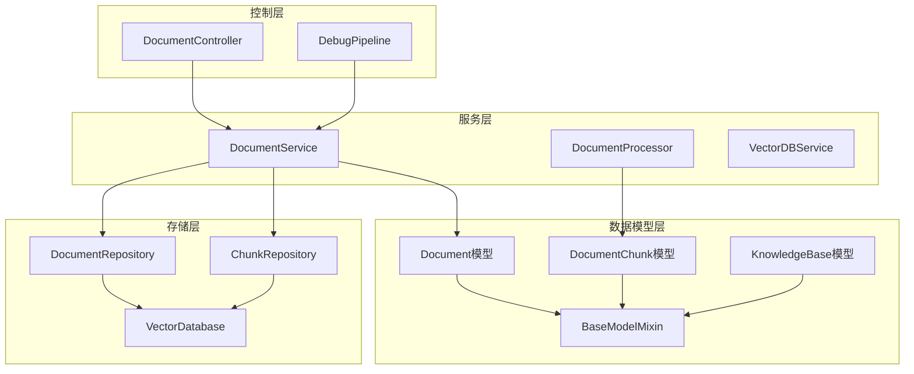

**图表来源**
- [backend/app/models/document.py](file://backend/app/models/document.py#L34-L116)
- [backend/app/models/base.py](file://backend/app/models/base.py#L11-L31)
- [backend/app/models/knowledge_base.py](file://backend/app/models/knowledge_base.py#L25-L80)

**章节来源**
- [backend/app/models/document.py](file://backend/app/models/document.py#L1-L116)
- [backend/app/models/base.py](file://backend/app/models/base.py#L1-L31)
- [backend/app/models/knowledge_base.py](file://backend/app/models/knowledge_base.py#L1-L80)

## 核心数据模型

### Document模型详解

Document模型是整个文档处理系统的核心实体，包含了文档的完整生命周期信息。

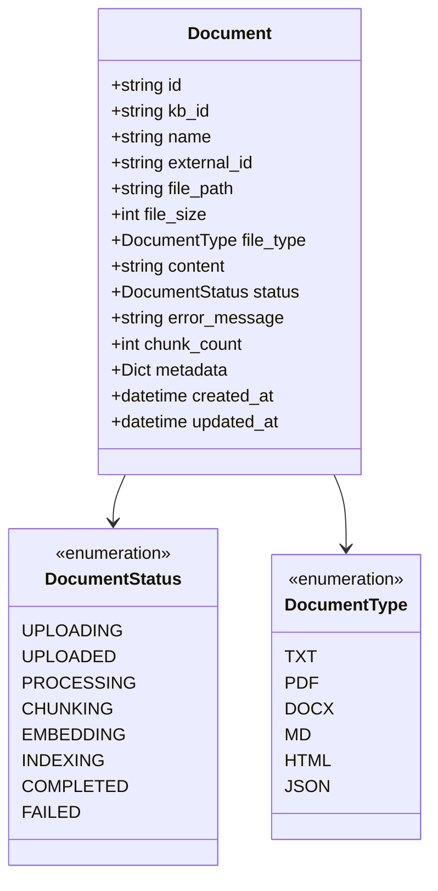

**图表来源**
- [backend/app/models/document.py](file://backend/app/models/document.py#L12-L32)
- [backend/app/models/document.py](file://backend/app/models/document.py#L34-L74)

#### 核心字段解析

| 字段名 | 类型 | 必填 | 描述 | 验证规则 |
|--------|------|------|------|----------|
| `kb_id` | string | 是 | 所属知识库ID | 外键约束 |
| `name` | string | 是 | 文档名称 | 长度1-200字符 |
| `file_path` | string | 是 | 文件存储路径 | 完整路径格式 |
| `file_size` | int | 否 | 文件大小(字节) | 默认0 |
| `file_type` | DocumentType | 是 | 文件类型枚举 | 支持6种格式 |
| `content` | string | 否 | 文档原始内容 | 可选存储 |
| `status` | DocumentStatus | 否 | 处理状态 | 默认UPLOADED |
| `error_message` | string | 否 | 错误信息 | 处理失败时记录 |
| `chunk_count` | int | 否 | 分块数量 | 默认0 |
| `metadata` | Dict | 否 | 文档元数据 | 动态键值对 |

#### 状态机设计

文档处理采用严格的状态机管理模式，确保处理流程的可追踪性和可靠性：

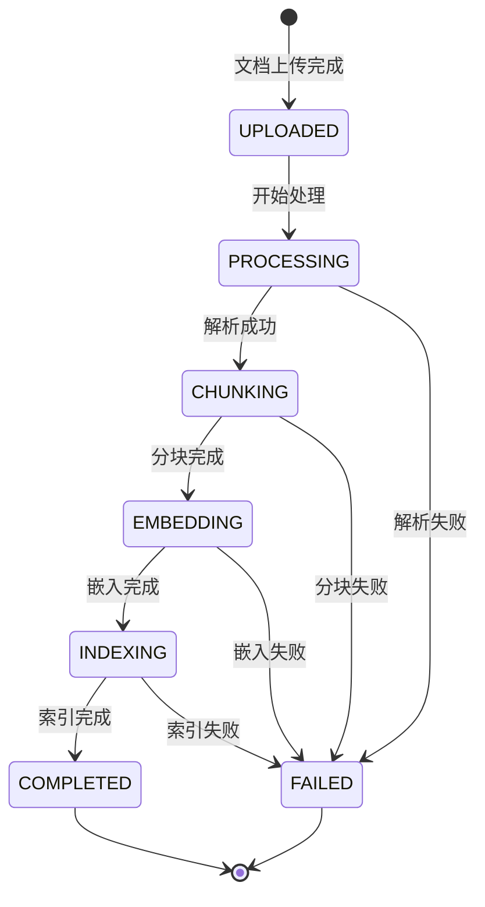

**图表来源**
- [backend/app/models/document.py](file://backend/app/models/document.py#L12-L21)

**章节来源**
- [backend/app/models/document.py](file://backend/app/models/document.py#L34-L74)

### DocumentChunk模型详解

DocumentChunk模型代表文档的细粒度分块单元，是向量检索的基本单位。

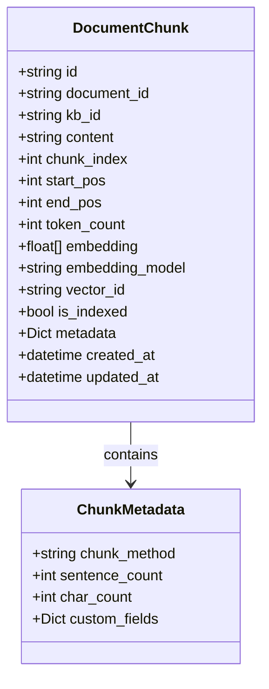

**图表来源**
- [backend/app/models/document.py](file://backend/app/models/document.py#L77-L115)

#### 分块字段详解

| 字段名 | 类型 | 描述 | 用途 |
|--------|------|------|------|
| `content` | string | 分块内容 | 检索和生成的基础文本 |
| `chunk_index` | int | 分块序号 | 在文档中的位置标识 |
| `start_pos` | int | 起始位置 | 原始文档中的字符偏移 |
| `end_pos` | int | 结束位置 | 原始文档中的字符偏移 |
| `token_count` | int | Token数量 | 嵌入计算的重要参考 |
| `embedding` | List[float] | 向量嵌入 | 向量数据库存储的向量 |
| `embedding_model` | string | 嵌入模型 | 嵌入模型的标识 |
| `vector_id` | string | 向量ID | 向量数据库中的唯一标识 |
| `is_indexed` | bool | 索引状态 | 是否已建立向量索引 |

**章节来源**
- [backend/app/models/document.py](file://backend/app/models/document.py#L77-L115)

## 文档处理流水线

### 整体处理流程

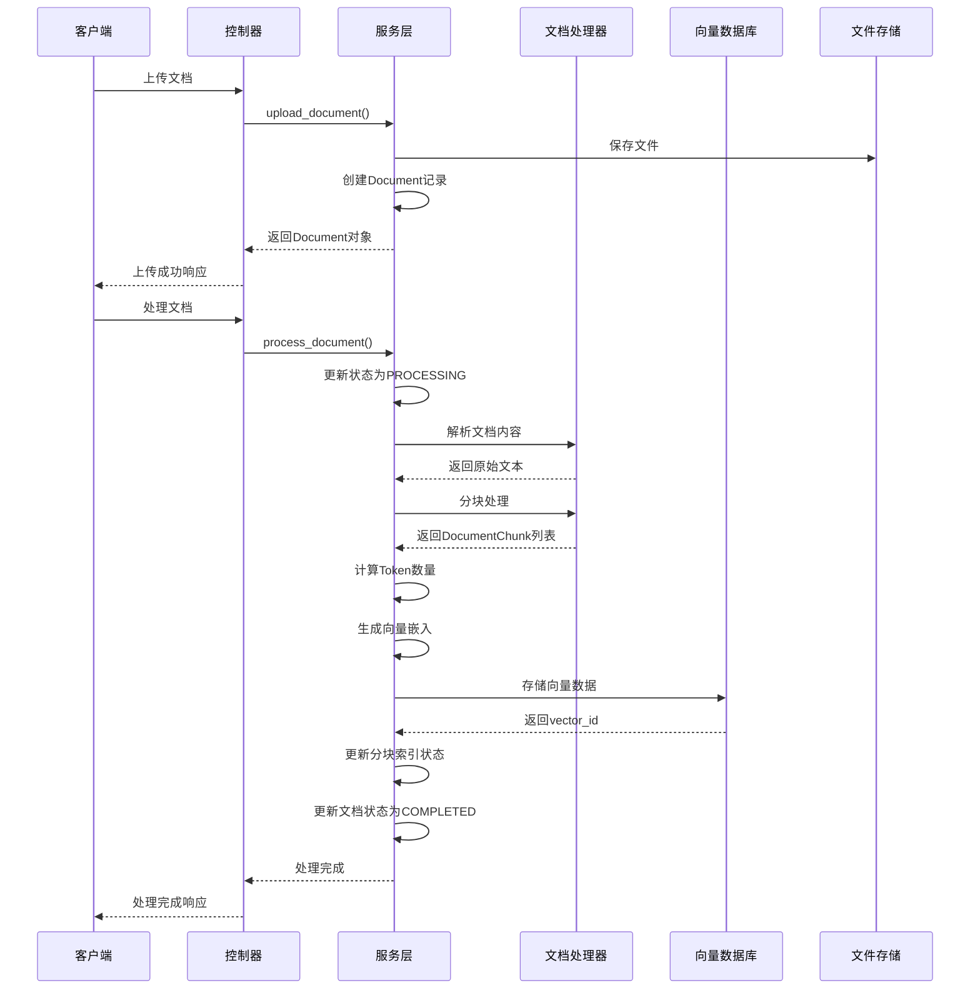

**图表来源**
- [backend/app/controllers/document.py](file://backend/app/controllers/document.py#L20-L171)
- [backend/app/services/document.py](file://backend/app/services/document.py#L175-L272)

### 上传与初始化

文档上传过程包含严格的验证和初始化步骤：

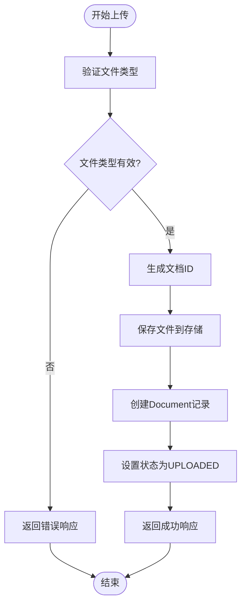

**图表来源**
- [backend/app/services/document.py](file://backend/app/services/document.py#L23-L72)

**章节来源**
- [backend/app/services/document.py](file://backend/app/services/document.py#L23-L72)

### 处理状态监控

系统提供了详细的处理状态监控功能，支持实时追踪文档处理进度：

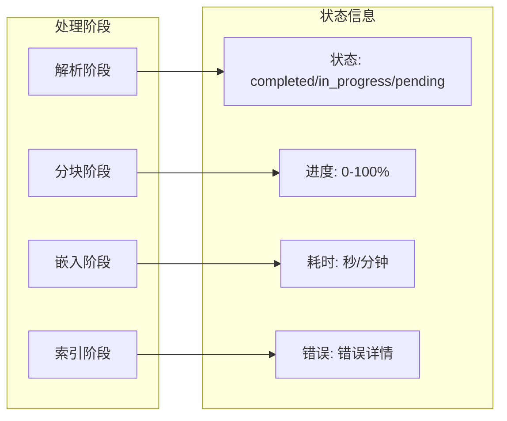

**图表来源**
- [backend/app/controllers/document.py](file://backend/app/controllers/document.py#L146-L169)

**章节来源**
- [backend/app/controllers/document.py](file://backend/app/controllers/document.py#L146-L169)

## 分块策略与算法

### 分块方法对比

系统支持三种主要的分块策略，每种策略适用于不同的应用场景：

| 分块方法 | 适用场景 | 优势 | 劣势 | 推荐配置 |
|----------|----------|------|------|----------|
| `fixed_size` | 通用文档 | 一致性好，易于计算 | 可能破坏语义完整性 | chunk_size: 512, overlap: 50 |
| `paragraph` | 技术文档 | 保持段落完整性 | 段落长度差异大 | 无固定配置 |
| `sentence` | 研究论文 | 语义单元完整 | 分块数量过多 | max_sentences: 3-5 |

### 固定大小分块算法

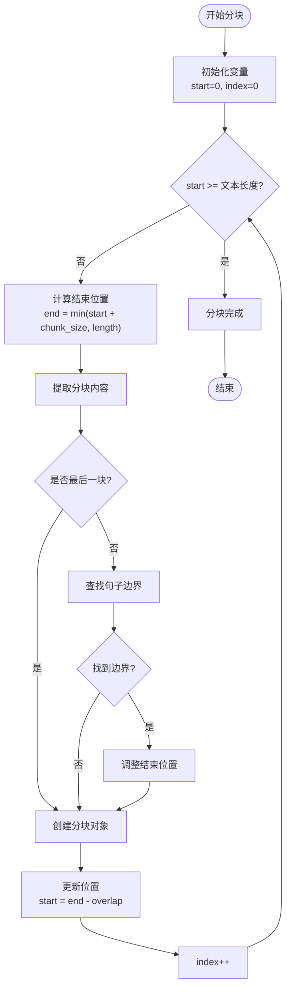

**图表来源**
- [backend/app/services/document_processor.py](file://backend/app/services/document_processor.py#L60-L121)

### Token数量估算

系统提供了粗略的Token数量估算算法，用于优化分块策略：

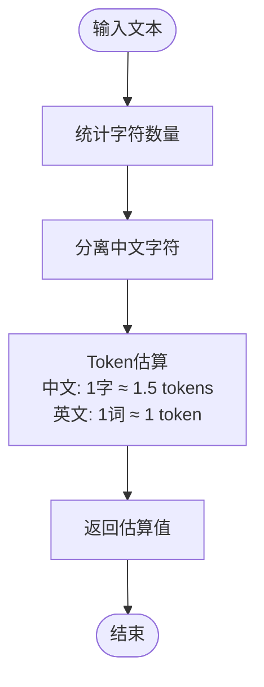

**图表来源**
- [backend/app/services/document_processor.py](file://backend/app/services/document_processor.py#L235-L246)

**章节来源**
- [backend/app/services/document_processor.py](file://backend/app/services/document_processor.py#L60-L246)

## 向量嵌入与索引

### 向量数据库配置

系统支持多种向量数据库，通过KnowledgeBase模型进行统一配置：

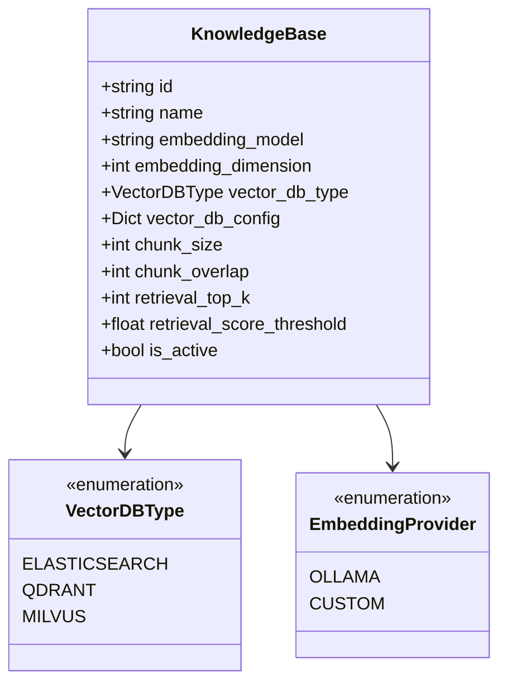

**图表来源**
- [backend/app/models/knowledge_base.py](file://backend/app/models/knowledge_base.py#L18-L23)
- [backend/app/models/knowledge_base.py](file://backend/app/models/knowledge_base.py#L12-L16)

### 向量索引流程

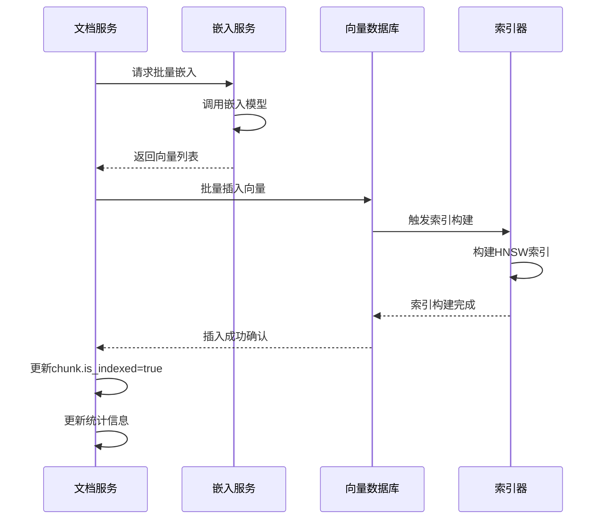

**图表来源**
- [backend/app/services/document.py](file://backend/app/services/document.py#L250-L269)
- [backend/app/services/vector_db_service.py](file://backend/app/services/vector_db_service.py#L1-L28)

**章节来源**
- [backend/app/models/knowledge_base.py](file://backend/app/models/knowledge_base.py#L25-L80)
- [backend/app/services/vector_db_service.py](file://backend/app/services/vector_db_service.py#L1-L28)

## 状态管理与错误处理

### 错误处理机制

系统实现了多层次的错误处理机制，确保系统的稳定性和可恢复性：

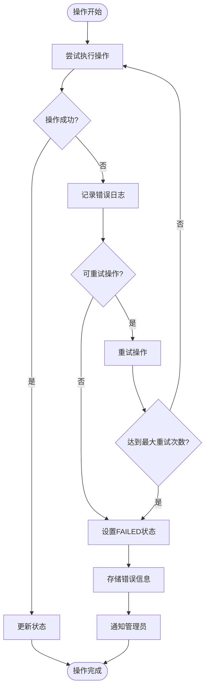

### 异常类型与处理策略

| 异常类型 | 处理策略 | 用户体验 | 恢复方式 |
|----------|----------|----------|----------|
| 文件解析失败 | 记录错误，标记FAILED | 显示解析失败提示 | 手动重新上传 |
| 嵌入模型超时 | 自动重试3次 | 显示处理中状态 | 系统自动恢复 |
| 向量数据库连接失败 | 降级处理，本地缓存 | 显示网络问题提示 | 等待网络恢复 |
| Token数量超限 | 分块拆分 | 显示优化建议 | 自动调整策略 |

**章节来源**
- [backend/app/services/document.py](file://backend/app/services/document.py#L175-L272)

## 性能优化建议

### 分块策略优化

根据不同的使用场景，推荐以下分块策略配置：

#### 高精度检索场景
```yaml
chunk_size: 256  # 较小的分块提高检索精度
chunk_overlap: 32  # 保留上下文信息
max_sentences: 2  # 按句子分块
```

#### 大容量存储场景  
```yaml
chunk_size: 1024  # 较大的分块减少存储成本
chunk_overlap: 100  # 平衡精度和性能
fixed_size: true  # 固定大小便于批量处理
```

### 向量索引优化

针对不同规模的数据集，建议采用不同的索引策略：

| 数据规模 | 推荐配置 | 性能特点 | 存储开销 |
|----------|----------|----------|----------|
| < 10K条目 | L2距离，无量化 | 查询最快 | 最高 |
| 10K-100K条目 | Cosine距离，Scalar量化 | 平衡性能 | 中等 |
| 100K-1M条目 | HNSW算法，Product量化 | 性能优秀 | 较低 |
| > 1M条目 | 分片存储，稀疏向量 | 可扩展性强 | 最低 |

### 缓存策略

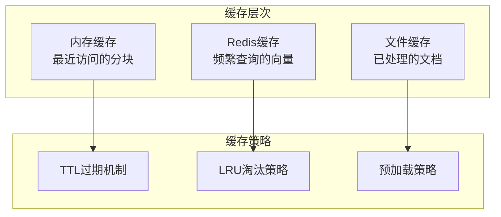

## 故障排除指南

### 常见问题诊断

#### 文档处理卡住不动

**症状**：文档长时间处于PROCESSING状态

**诊断步骤**：
1. 检查文档大小是否超过限制
2. 验证嵌入模型服务是否可用
3. 查看向量数据库连接状态
4. 检查系统资源使用情况

**解决方案**：
```bash
# 重启处理进程
docker restart rag-service

# 清理失败的文档
curl -X DELETE "/documents/{document_id}"

# 重新处理文档
curl -X POST "/documents/process" \
  -d '{"document_id":"doc_123","force_reprocess":true}'
```

#### 分块质量差

**症状**：检索结果不准确，相关性低

**可能原因**：
- 分块大小不合适
- 重叠设置过少
- 分块方法选择不当

**优化建议**：
```python
# 调整分块配置
{
    "chunk_size": 512,      # 从256增加到512
    "chunk_overlap": 100,   # 从50增加到100
    "method": "sentence"    # 从fixed_size改为sentence
}
```

#### 向量检索速度慢

**症状**：查询响应时间超过预期

**优化措施**：
1. 调整索引参数
2. 启用向量量化
3. 增加硬件资源
4. 优化查询策略

**章节来源**
- [backend/app/controllers/document.py](file://backend/app/controllers/document.py#L146-L169)

## 总结

RAG Studio的文档与分块模型设计体现了现代RAG系统的最佳实践：

### 核心优势

1. **模块化架构**：清晰分离关注点，便于维护和扩展
2. **状态驱动**：完整的处理状态机确保流程可控
3. **灵活分块**：多种分块策略适应不同场景需求
4. **向量优化**：支持多种向量数据库和索引策略
5. **错误恢复**：完善的错误处理和恢复机制

### 设计亮点

- **Document模型**：统一的文档生命周期管理
- **DocumentChunk模型**：细粒度的检索单元设计
- **状态机模式**：可靠的处理流程控制
- **配置驱动**：灵活的知识库配置管理
- **性能优化**：多层次的性能调优策略

### 应用价值

该模型体系为企业级知识管理系统提供了坚实的技术基础，支持大规模文档的智能检索和知识挖掘，是构建高质量RAG应用的理想选择。

通过本文档的详细说明，开发者可以深入理解系统的设计理念，掌握最佳实践，并能够根据具体需求进行定制化开发和优化。