# 文档分块模型

<cite>
**本文档中引用的文件**
- [backend/app/models/document.py](file://backend/app/models/document.py)
- [backend/app/models/base.py](file://backend/app/models/base.py)
- [backend/app/models/knowledge_base.py](file://backend/app/models/knowledge_base.py)
- [backend/app/services/document_processor.py](file://backend/app/services/document_processor.py)
- [backend/app/services/embedding_service.py](file://backend/app/services/embedding_service.py)
- [backend/app/services/vector_db_service.py](file://backend/app/services/vector_db_service.py)
- [backend/app/services/retrieval_service.py](file://backend/app/services/retrieval_service.py)
- [web/components/views/document-processing.tsx](file://web/components/views/document-processing.tsx)
</cite>

## 目录
1. [简介](#简介)
2. [模型结构分析](#模型结构分析)
3. [核心字段详解](#核心字段详解)
4. [分块处理流程](#分块处理流程)
5. [向量嵌入与索引](#向量嵌入与索引)
6. [检索增强场景](#检索增强场景)
7. [分块策略与优化](#分块策略与优化)
8. [架构关系图](#架构关系图)
9. [最佳实践建议](#最佳实践建议)
10. [总结](#总结)

## 简介

文档分块（DocumentChunk）模型是RAG（检索增强生成）系统中的核心组件，负责将大型文档切分为适合向量化处理的小片段。该模型不仅承载着文档内容的物理分割信息，还包含了丰富的元数据和向量索引信息，为高效的检索和生成提供了基础支撑。

## 模型结构分析

### 基础模型继承

DocumentChunk模型继承自BaseModelMixin，具备唯一标识符、创建时间和更新时间等基础属性：

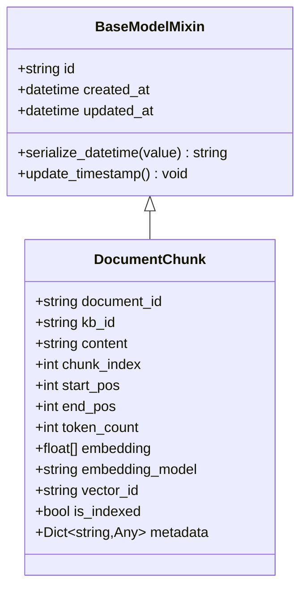

**图表来源**
- [backend/app/models/base.py](file://backend/app/models/base.py#L11-L31)
- [backend/app/models/document.py](file://backend/app/models/document.py#L77-L114)

### 数据模型定义

DocumentChunk模型包含以下主要字段类别：

| 字段类别 | 字段名称 | 类型 | 描述 |
|---------|---------|------|------|
| 关联标识 | document_id | string | 所属文档ID |
| 关联标识 | kb_id | string | 所属知识库ID |
| 内容信息 | content | string | 分块内容 |
| 序号信息 | chunk_index | int | 分块序号（从0开始） |
| 位置信息 | start_pos | int | 起始位置 |
| 位置信息 | end_pos | int | 结束位置 |
| 统计信息 | token_count | int | Token数量 |
| 向量信息 | embedding | List[float] | 向量嵌入 |
| 向量信息 | embedding_model | string | 嵌入模型名称 |
| 索引信息 | vector_id | string | 向量数据库中的ID |
| 索引信息 | is_indexed | bool | 是否已索引 |
| 元数据 | metadata | Dict[string,Any] | 分块元数据 |

**章节来源**
- [backend/app/models/document.py](file://backend/app/models/document.py#L77-L114)

## 核心字段详解

### 内容字段（Content）

内容字段是分块的核心，存储实际的文本内容。该字段具有以下特点：

- **完整性保证**：确保每个分块包含有意义的语义单元
- **上下文保留**：通过重叠机制保留必要的上下文信息
- **格式标准化**：经过清理和规范化处理

### 所属标识字段

- **document_id**：建立与Document模型的一对多关系
- **kb_id**：关联到具体的知识库，支持多租户隔离

### 分块序号与位置信息

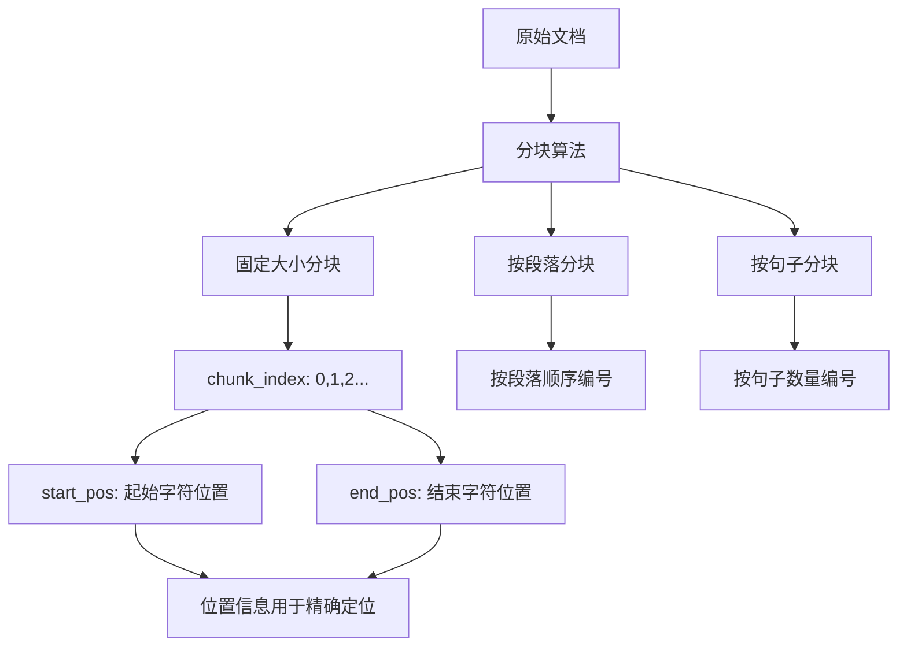

**图表来源**
- [backend/app/services/document_processor.py](file://backend/app/services/document_processor.py#L60-L121)

### Token统计字段

Token统计字段提供了重要的容量规划信息：

- **token_count**：预估的Token数量，用于容量规划
- **估算算法**：中文1字≈1.5 tokens，英文1词≈1 token
- **动态计算**：可在后续处理中精确计算

### 向量嵌入数据

向量嵌入是RAG系统的核心技术：

- **embedding**：浮点数列表，表示文本的向量表示
- **embedding_model**：使用的嵌入模型名称
- **维度兼容性**：确保与知识库配置的维度一致

### 索引状态管理

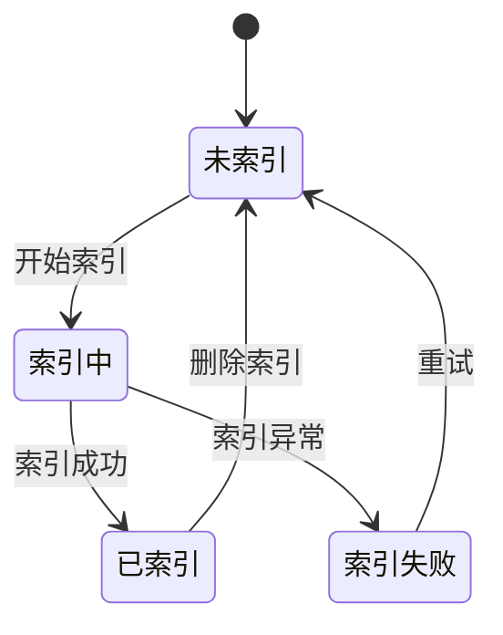

**图表来源**
- [backend/app/models/document.py](file://backend/app/models/document.py#L96-L98)

**章节来源**
- [backend/app/models/document.py](file://backend/app/models/document.py#L77-L114)

## 分块处理流程

### 分块算法实现

系统提供了三种主要的分块策略：

#### 固定大小分块

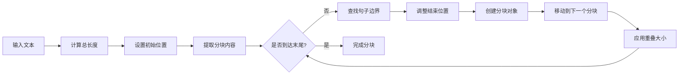

**图表来源**
- [backend/app/services/document_processor.py](file://backend/app/services/document_processor.py#L60-L121)

#### 按段落分块

段落分块策略适用于结构化文档：

- **段落识别**：基于`\n\n`分割
- **位置追踪**：精确记录字符位置
- **语义完整性**：保持段落语义完整

#### 按句子分块

句子分块提供更细粒度的控制：

- **句子边界检测**：支持中英文句号
- **最大句子数控制**：可配置每个分块的最大句子数
- **语义连贯性**：确保分块内的语义完整性

### 分块配置参数

| 参数名称 | 默认值 | 范围 | 说明 |
|---------|--------|------|------|
| chunk_size | 500 | 100-2000 | 分块大小（字符数） |
| chunk_overlap | 50 | 0-500 | 重叠大小（字符数） |
| max_sentences | 5 | 1-20 | 最大句子数（按句子分块） |

**章节来源**
- [backend/app/services/document_processor.py](file://backend/app/services/document_processor.py#L60-L246)

## 向量嵌入与索引

### 嵌入服务架构

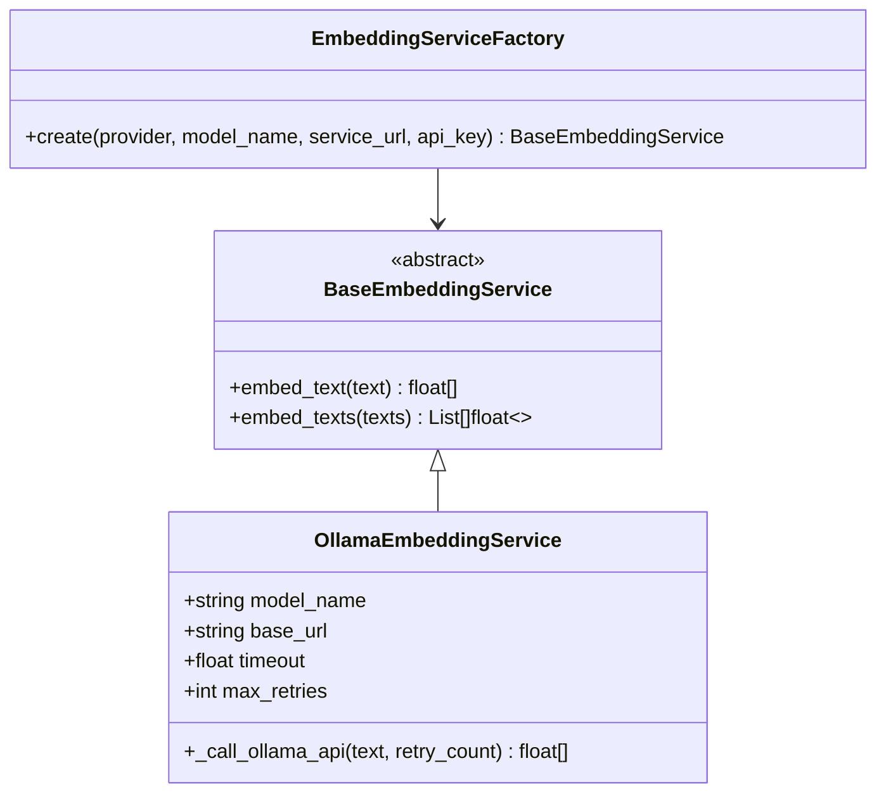

**图表来源**
- [backend/app/services/embedding_service.py](file://backend/app/services/embedding_service.py#L18-L257)

### 向量数据库集成

系统支持多种向量数据库：

- **Qdrant**：原生混合检索支持
- **Elasticsearch**：基于插件的向量搜索
- **Milvus**：高性能向量数据库

### 索引同步机制

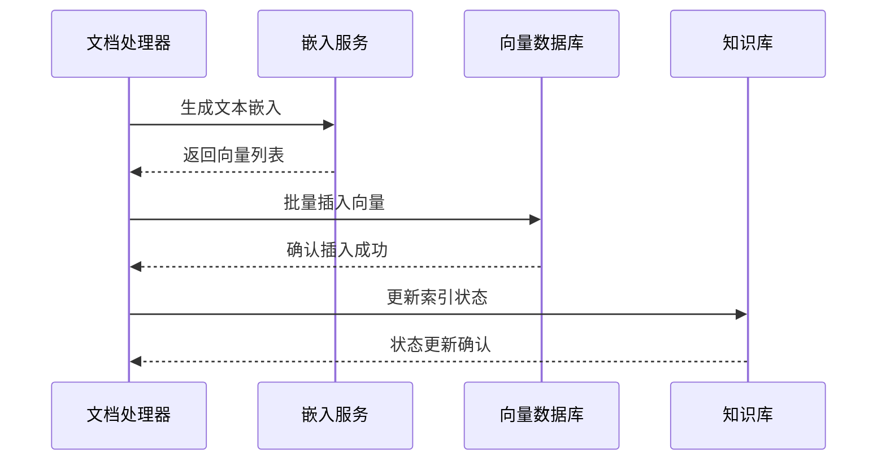

**图表来源**
- [backend/app/services/vector_db_service.py](file://backend/app/services/vector_db_service.py#L484-L570)

**章节来源**
- [backend/app/services/embedding_service.py](file://backend/app/services/embedding_service.py#L18-L257)
- [backend/app/services/vector_db_service.py](file://backend/app/services/vector_db_service.py#L31-L800)

## 检索增强场景

### 检索策略对比

| 检索方式 | 优势 | 劣势 | 适用场景 |
|---------|------|------|----------|
| 向量检索 | 语义相似性 | 需要嵌入模型 | 相关性要求高的场景 |
| 关键词检索 | 精确匹配 | 语义理解有限 | 结构化查询 |
| 混合检索 | 综合优势 | 复杂度高 | 高质量检索需求 |

### RRF融合算法

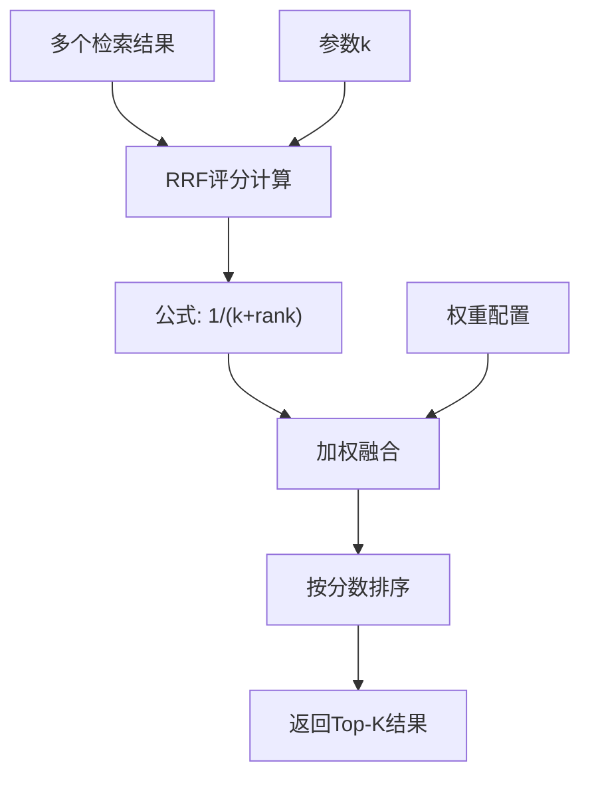

**图表来源**
- [backend/app/services/retrieval_service.py](file://backend/app/services/retrieval_service.py#L44-L134)

### 检索结果结构

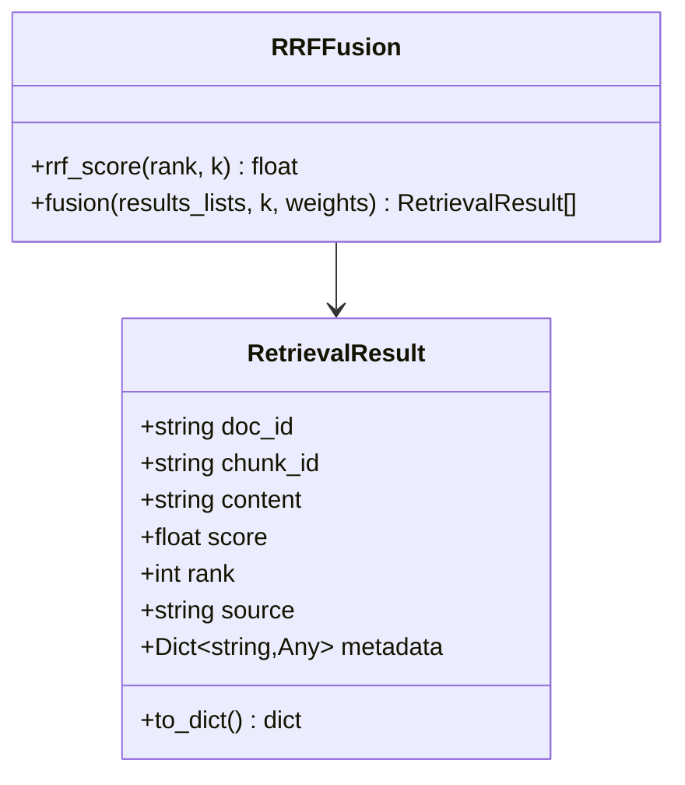

**图表来源**
- [backend/app/services/retrieval_service.py](file://backend/app/services/retrieval_service.py#L21-L42)

**章节来源**
- [backend/app/services/retrieval_service.py](file://backend/app/services/retrieval_service.py#L21-L854)

## 分块策略与优化

### 分块粒度影响分析

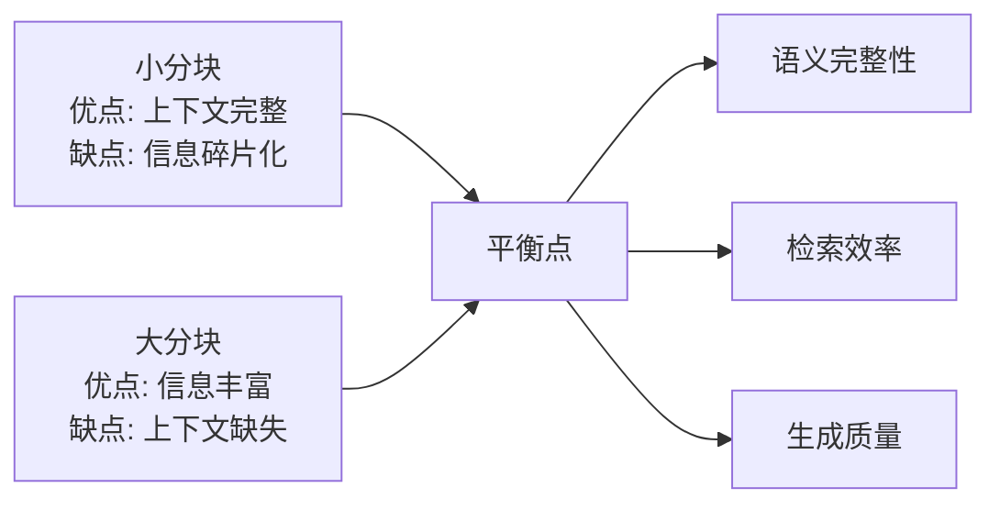

### 性能优化建议

#### 分块大小优化

| 文档类型 | 推荐分块大小 | 重叠大小 | 理由 |
|---------|-------------|----------|------|
| 技术文档 | 512-1024 | 50-100 | 保持语义完整性 |
| 法律文档 | 1024-2048 | 100-200 | 长句较多 |
| 新闻文章 | 256-512 | 25-50 | 短句为主 |
| 学术论文 | 768-1536 | 75-150 | 结构复杂 |

#### 重叠策略

- **固定重叠**：简单易实现
- **智能重叠**：基于句子边界
- **动态重叠**：根据内容密度调整

### 元数据扩展设计

DocumentChunk模型的metadata字段提供了高度的可扩展性：

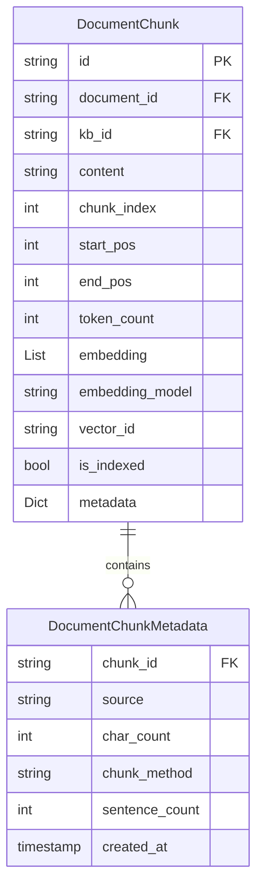

**图表来源**
- [backend/app/models/document.py](file://backend/app/models/document.py#L77-L114)

**章节来源**
- [backend/app/services/document_processor.py](file://backend/app/services/document_processor.py#L14-L35)

## 架构关系图

### 整体系统架构

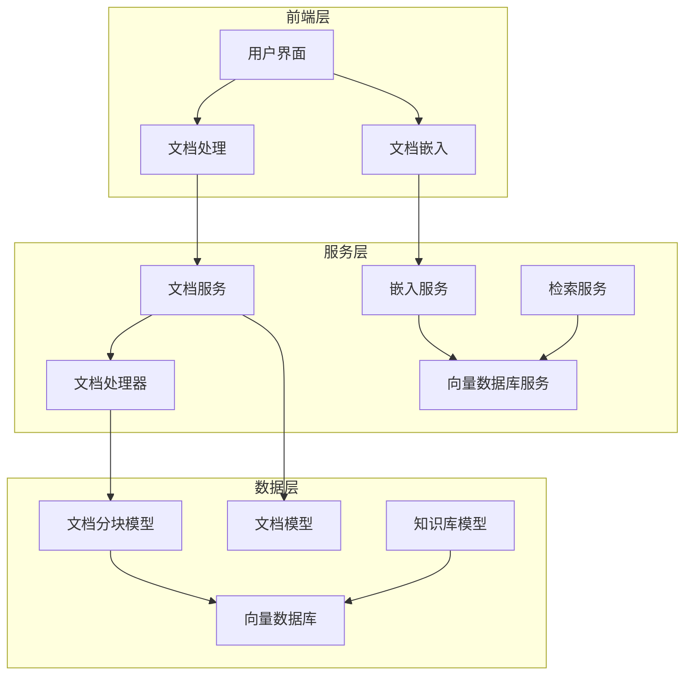

**图表来源**
- [backend/app/models/document.py](file://backend/app/models/document.py#L34-L116)
- [backend/app/models/knowledge_base.py](file://backend/app/models/knowledge_base.py#L25-L80)

### 文档与分块关系

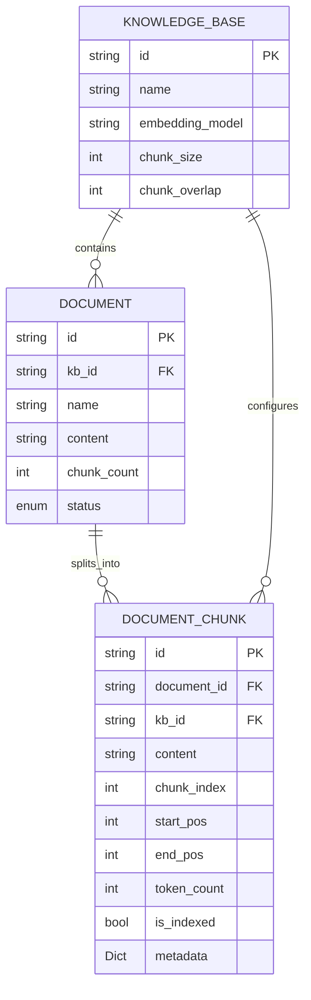

**图表来源**
- [backend/app/models/document.py](file://backend/app/models/document.py#L34-L116)
- [backend/app/models/knowledge_base.py](file://backend/app/models/knowledge_base.py#L25-L80)

**章节来源**
- [backend/app/models/document.py](file://backend/app/models/document.py#L34-L116)
- [backend/app/models/knowledge_base.py](file://backend/app/models/knowledge_base.py#L25-L80)

## 最佳实践建议

### 分块策略选择

1. **文档类型适配**
   - 技术文档：固定大小分块，适当重叠
   - 法律文档：较大分块，更多重叠
   - 新闻文章：较小分块，较少重叠

2. **知识库配置**
   - 根据检索需求调整分块大小
   - 考虑向量数据库的性能限制
   - 平衡检索精度和性能

3. **质量监控**
   - 定期检查分块质量
   - 监控Token分布
   - 评估检索效果

### 性能优化

1. **批处理优化**
   - 批量生成嵌入向量
   - 并发处理多个分块
   - 合理设置并发数

2. **缓存策略**
   - 缓存常用文档的分块
   - 缓存嵌入向量结果
   - 实现增量更新机制

3. **索引优化**
   - 定期重建索引
   - 监控索引性能
   - 优化查询策略

### 错误处理

1. **分块失败处理**
   - 实现重试机制
   - 提供降级方案
   - 记录详细错误信息

2. **向量生成异常**
   - 处理网络超时
   - 实现熔断机制
   - 提供备用模型

**章节来源**
- [backend/app/services/document_processor.py](file://backend/app/services/document_processor.py#L60-L246)
- [backend/app/services/embedding_service.py](file://backend/app/services/embedding_service.py#L62-L135)

## 总结

DocumentChunk模型作为RAG系统的核心组件，通过精心设计的字段结构和处理流程，为高质量的检索增强生成提供了坚实的基础。其主要优势包括：

1. **结构化设计**：清晰的字段分类和明确的数据类型
2. **灵活配置**：支持多种分块策略和参数调整
3. **高效检索**：完善的向量嵌入和索引机制
4. **可扩展性**：丰富的元数据支持和插件化架构
5. **性能优化**：多层次的优化策略和错误处理机制

通过合理配置分块参数、选择适当的分块策略，并结合有效的检索算法，可以显著提升RAG系统的整体性能和用户体验。未来的优化方向包括更智能的分块算法、更高效的向量压缩技术和更精确的检索融合策略。