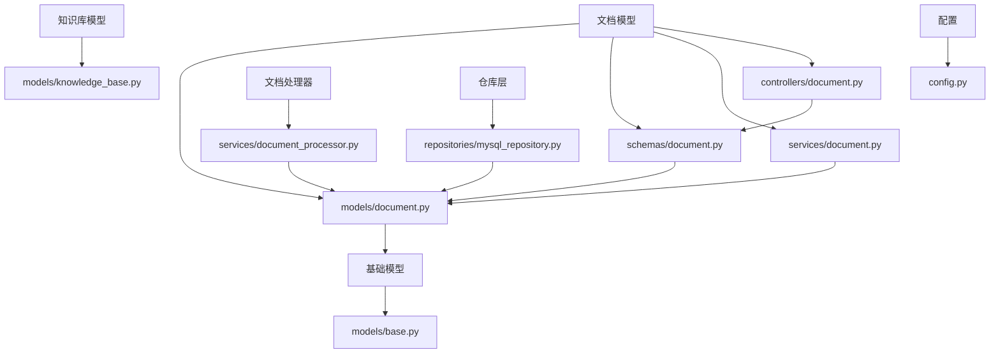
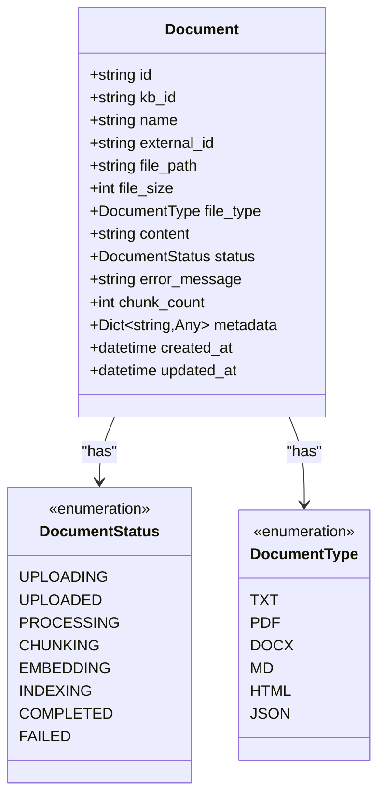
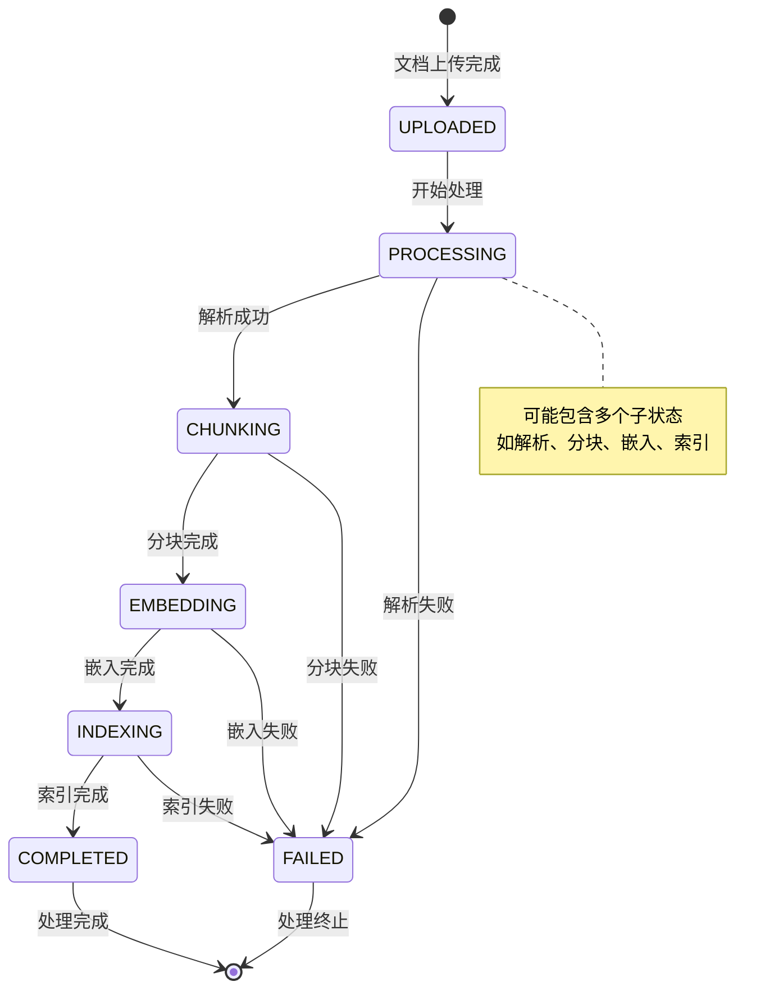
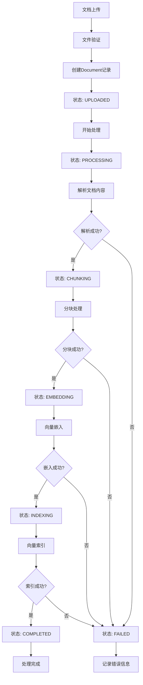
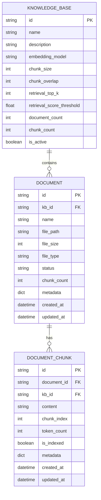
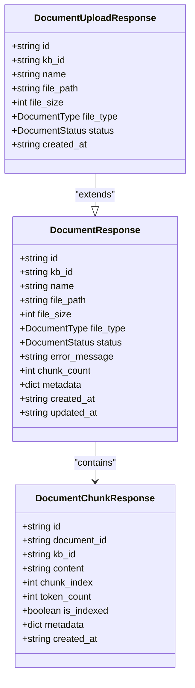
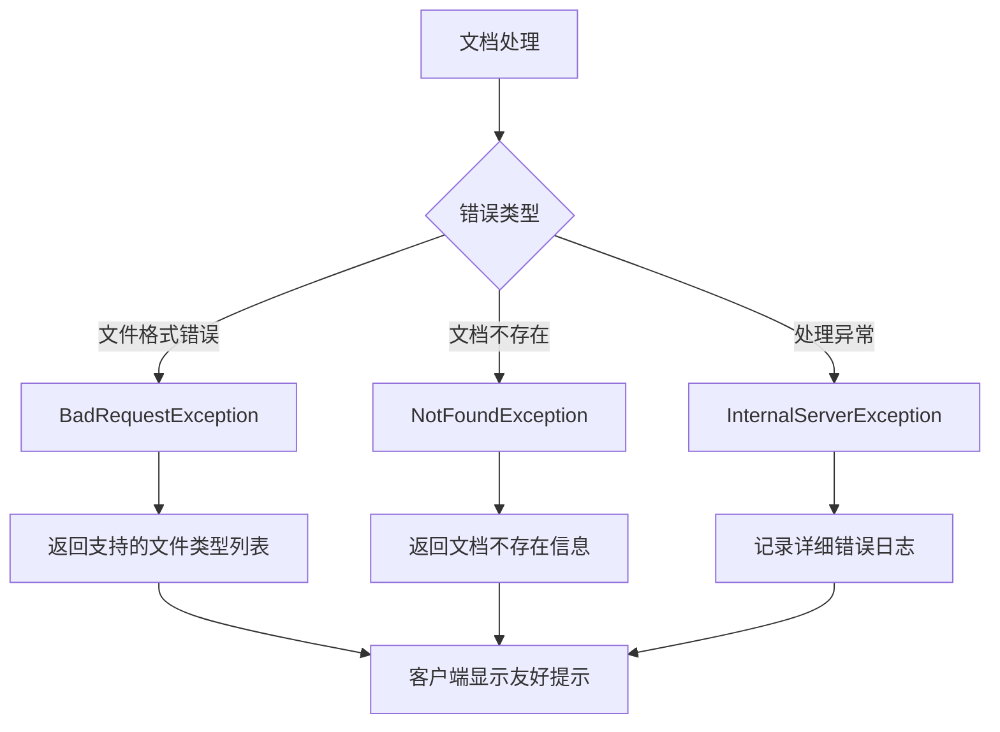

# 文档模型技术文档

<cite>
**本文档中引用的文件**
- [document.py](file://backend/app/models/document.py)
- [document.py](file://backend/app/schemas/document.py)
- [document.py](file://backend/app/services/document.py)
- [document.py](file://backend/app/controllers/document.py)
- [base.py](file://backend/app/models/base.py)
- [knowledge_base.py](file://backend/app/models/knowledge_base.py)
- [document_processor.py](file://backend/app/services/document_processor.py)
- [mysql_repository.py](file://backend/app/repositories/mysql_repository.py)
- [config.py](file://backend/app/config.py)
</cite>

## 目录
1. [简介](#简介)
2. [项目结构概览](#项目结构概览)
3. [核心数据模型](#核心数据模型)
4. [状态机设计](#状态机设计)
5. [文档处理流水线](#文档处理流水线)
6. [字段验证约束](#字段验证约束)
7. [关联关系分析](#关联关系分析)
8. [API传输与数据库持久化](#api传输与数据库持久化)
9. [错误处理机制](#错误处理机制)
10. [最佳实践建议](#最佳实践建议)
11. [总结](#总结)

## 简介

RAG Studio的文档模型是整个知识库系统的核心组件，负责管理文档的生命周期，包括上传、解析、分块、嵌入、索引等完整处理流程。该模型采用状态机设计模式，通过清晰的状态流转来管理复杂的文档处理过程，同时提供了灵活的元数据扩展机制和完善的错误处理能力。

## 项目结构概览

文档模型相关的文件组织结构如下：



**图表来源**
- [document.py](file://backend/app/models/document.py#L1-L116)
- [base.py](file://backend/app/models/base.py#L1-L31)
- [knowledge_base.py](file://backend/app/models/knowledge_base.py#L1-L80)

**章节来源**
- [document.py](file://backend/app/models/document.py#L1-L116)
- [base.py](file://backend/app/models/base.py#L1-L31)

## 核心数据模型

### Document模型结构

Document模型是文档管理的核心数据结构，包含了文档处理所需的全部信息：



**图表来源**
- [document.py](file://backend/app/models/document.py#L34-L116)

### 关键字段详解

#### 基础信息字段
- **kb_id**: 所属知识库ID，建立文档与知识库的一对多关系
- **name**: 文档名称，具有最小长度1和最大长度200的验证约束
- **file_path**: 文件存储路径，指向文档在存储系统中的位置
- **file_size**: 文件大小（字节），默认值为0
- **file_type**: 文档类型枚举，支持txt、pdf、docx、md、html、json六种格式

#### 内容存储字段
- **content**: 文档原始内容，可选字段，在某些场景下可能直接存储文本内容而非文件路径
- **metadata**: 灵活的元数据扩展字段，使用字典结构存储任意键值对

#### 处理状态字段
- **status**: 当前处理状态，默认为UPLOADED
- **error_message**: 错误信息，仅在状态为FAILED时有意义
- **chunk_count**: 分块数量，记录文档被分割成多少个块

**章节来源**
- [document.py](file://backend/app/models/document.py#L34-L116)

## 状态机设计

### 状态流转图

文档处理采用严格的状态机设计，确保处理流程的可控性和可追踪性：



**图表来源**
- [document.py](file://backend/app/models/document.py#L12-L21)

### 状态定义详解

#### 上传阶段状态
- **UPLOADING**: 上传中状态，通常由前端控制，后端主要关注UPLOADED状态
- **UPLOADED**: 已上传状态，文档已成功保存到存储系统，等待进一步处理

#### 处理阶段状态
- **PROCESSING**: 处理中状态，表示文档正在经历完整的处理流程
- **CHUNKING**: 分块中状态，文档正在被分割成适合处理的小块
- **EMBEDDING**: 嵌入中状态，分块内容正在转换为向量表示
- **INDEXING**: 索引中状态，向量数据正在写入向量数据库

#### 结果状态
- **COMPLETED**: 已完成状态，文档处理全流程成功完成
- **FAILED**: 失败状态，文档处理过程中发生错误

**章节来源**
- [document.py](file://backend/app/models/document.py#L12-L21)

## 文档处理流水线

### 处理流程概述

文档处理是一个复杂的多阶段流水线，每个阶段都有明确的职责和输出：



**图表来源**
- [document.py](file://backend/app/services/document.py#L175-L272)
- [document_processor.py](file://backend/app/services/document_processor.py#L1-L328)

### 各阶段详细说明

#### 1. 文档解析阶段
- **输入**: Document对象和文件路径
- **处理**: 根据file_type选择相应的解析器
- **输出**: 文档纯文本内容
- **关键方法**: `_parse_document()`

#### 2. 文档分块阶段  
- **输入**: 解析后的文本内容
- **处理**: 根据知识库配置的chunk_size进行分块
- **输出**: DocumentChunk对象列表
- **关键方法**: `_chunk_document()`

#### 3. 向量嵌入阶段
- **输入**: DocumentChunk对象列表
- **处理**: 调用嵌入服务生成向量表示
- **输出**: 带有embedding字段的DocumentChunk
- **关键方法**: `_embed_chunks()`

#### 4. 向量索引阶段
- **输入**: 带有embedding的DocumentChunk
- **处理**: 写入向量数据库
- **输出**: 带有vector_id的DocumentChunk
- **关键方法**: `_index_chunks()`

**章节来源**
- [document.py](file://backend/app/services/document.py#L228-L271)
- [document_processor.py](file://backend/app/services/document_processor.py#L1-L328)

## 字段验证约束

### Pydantic验证规则

文档模型使用Pydantic进行字段验证，确保数据的完整性和一致性：

| 字段名 | 验证规则 | 说明 |
|--------|----------|------|
| name | `min_length=1, max_length=200` | 文档名称不能为空且长度不超过200字符 |
| file_size | `ge=0` | 文件大小不能为负数 |
| chunk_count | `ge=0` | 分块数量不能为负数 |
| chunk_index | `ge=0` | 分块序号不能为负数 |
| token_count | `ge=0` | Token数量不能为负数 |
| retrieval_top_k | `ge=1, le=50` | 检索返回数量范围1-50 |
| retrieval_score_threshold | `ge=0.0, le=1.0` | 分数阈值范围0.0-1.0 |

### 示例配置验证

```python
# 文档模型示例配置
{
    "id": "doc_001",
    "kb_id": "kb_001", 
    "name": "Python开发指南.pdf",
    "file_path": "/storage/documents/python_guide.pdf",
    "file_size": 1024000,
    "file_type": "pdf",
    "status": "completed",
    "chunk_count": 50
}
```

**章节来源**
- [document.py](file://backend/app/models/document.py#L34-L116)

## 关联关系分析

### 与KnowledgeBase的关系

文档模型与知识库模型之间存在一对多的关系：



**图表来源**
- [document.py](file://backend/app/models/document.py#L34-L116)
- [knowledge_base.py](file://backend/app/models/knowledge_base.py#L25-L80)

### 与DocumentChunk的关系

文档与分块之间是一对多的关系，一个文档可以包含多个分块：

- **外键关系**: DocumentChunk的`document_id`指向Document的`id`
- **知识库关联**: DocumentChunk的`kb_id`与Document保持一致
- **索引状态**: 每个分块都有独立的索引状态

**章节来源**
- [document.py](file://backend/app/models/document.py#L77-L116)

## API传输与数据库持久化

### Schema设计

API层使用专门的Schema来处理请求和响应：



**图表来源**
- [document.py](file://backend/app/schemas/document.py#L11-L70)

### 数据库持久化

使用MySQLRepository进行数据持久化，支持以下操作：

- **CRUD操作**: 创建、读取、更新、删除文档记录
- **批量操作**: 支持批量创建文档
- **查询过滤**: 支持按知识库ID、状态等条件查询
- **分页支持**: 支持大数据集的分页查询

**章节来源**
- [document.py](file://backend/app/schemas/document.py#L11-L70)
- [mysql_repository.py](file://backend/app/repositories/mysql_repository.py#L1-L200)

## 错误处理机制

### 错误分类与处理

文档处理过程中的错误分为以下几类：



**图表来源**
- [document.py](file://backend/app/services/document.py#L34-L42)

### 错误信息记录

- **error_message字段**: 在Document模型中专门用于存储错误信息
- **状态同步**: 发生错误时自动将状态设置为FAILED
- **日志记录**: 使用Python logging模块记录详细错误信息

**章节来源**
- [document.py](file://backend/app/services/document.py#L34-L42)
- [document.py](file://backend/app/services/document.py#L183-L190)

## 最佳实践建议

### 文档上传最佳实践

1. **文件格式支持**: 确保支持txt、pdf、docx、md、html、json六种格式
2. **文件大小限制**: 根据存储能力和处理性能设置合理的文件大小上限
3. **并发处理**: 支持多文档并发上传和处理
4. **断点续传**: 实现大文件的断点续传功能

### 文档处理最佳实践

1. **异步处理**: 使用异步处理避免阻塞主线程
2. **进度跟踪**: 提供详细的处理进度信息
3. **资源管理**: 合理管理内存和计算资源
4. **错误恢复**: 实现处理失败后的自动重试机制

### 状态管理最佳实践

1. **状态原子性**: 确保状态转换的原子性
2. **状态持久化**: 状态变更必须持久化到数据库
3. **状态查询**: 提供状态查询接口便于监控
4. **状态超时**: 设置合理的状态超时机制

### 性能优化建议

1. **分块策略**: 根据文档类型选择合适的分块策略
2. **批量操作**: 使用批量处理提高效率
3. **缓存机制**: 缓存频繁访问的数据
4. **索引优化**: 合理配置向量数据库索引参数

## 总结

RAG Studio的文档模型设计体现了现代软件架构的最佳实践：

1. **清晰的状态机设计**: 通过严格的状态流转确保处理流程的可控性
2. **灵活的元数据扩展**: 支持任意键值对的元数据存储
3. **完善的错误处理**: 提供多层次的错误处理和恢复机制
4. **RESTful API设计**: 符合REST规范的API接口设计
5. **数据库持久化**: 支持多种存储后端的灵活配置

该模型为RAG系统提供了坚实的文档管理基础，支持大规模文档的高效处理和检索，是构建智能问答系统的重要基础设施。