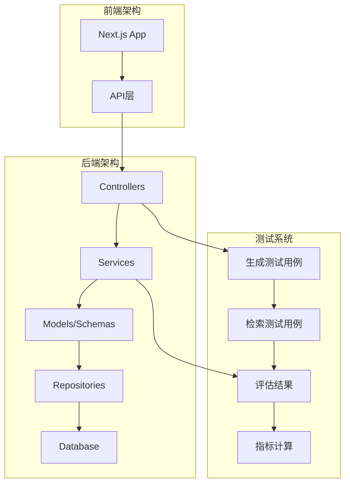
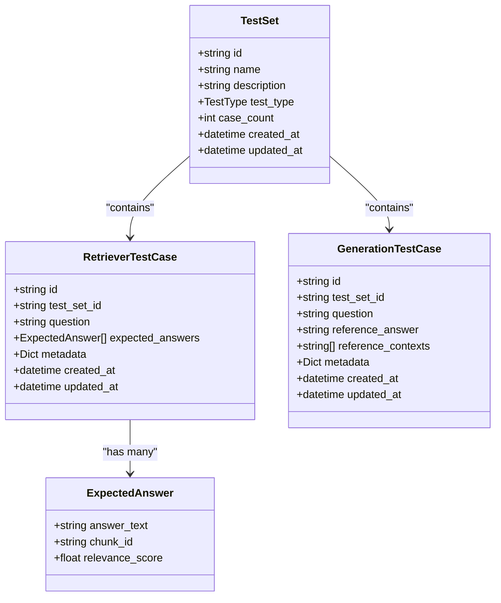
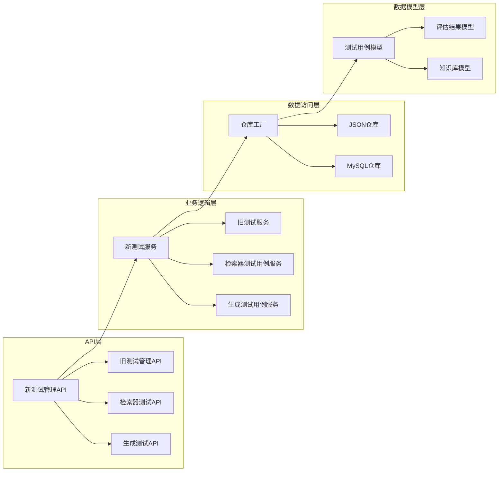
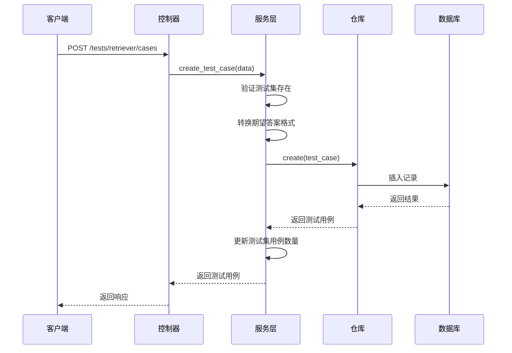
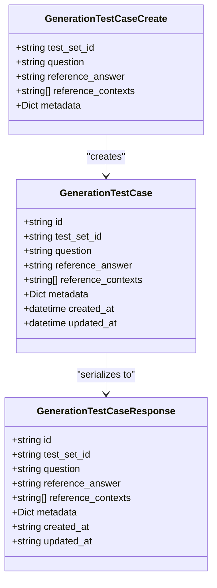
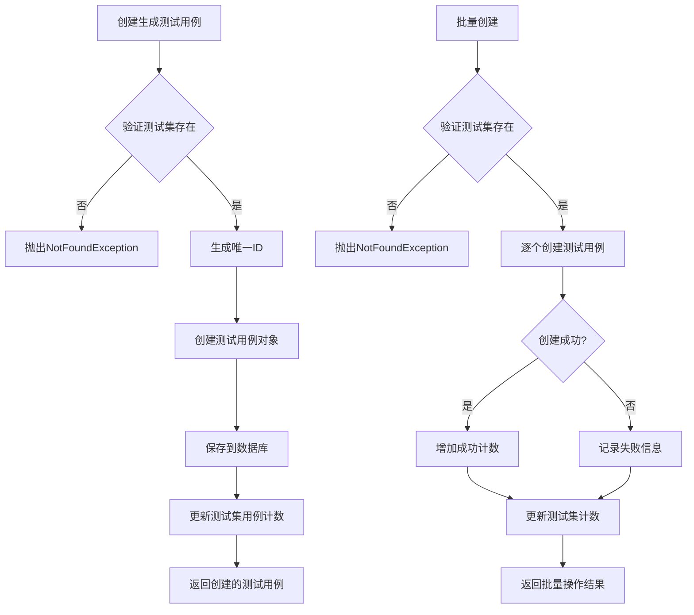
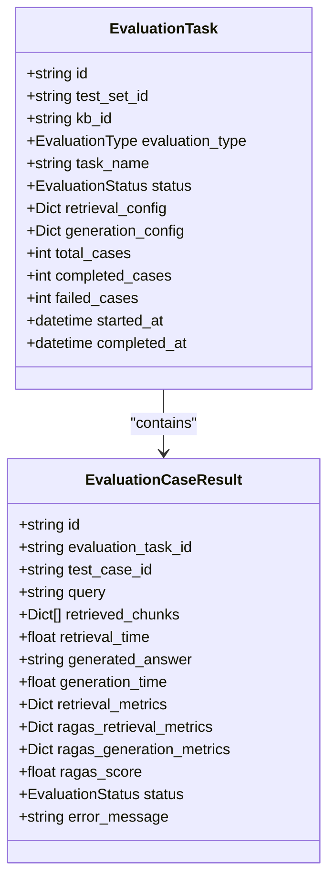
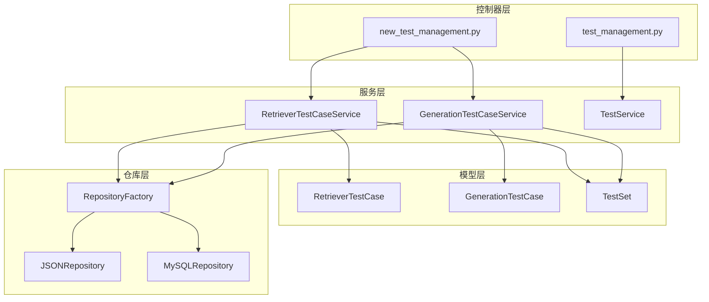
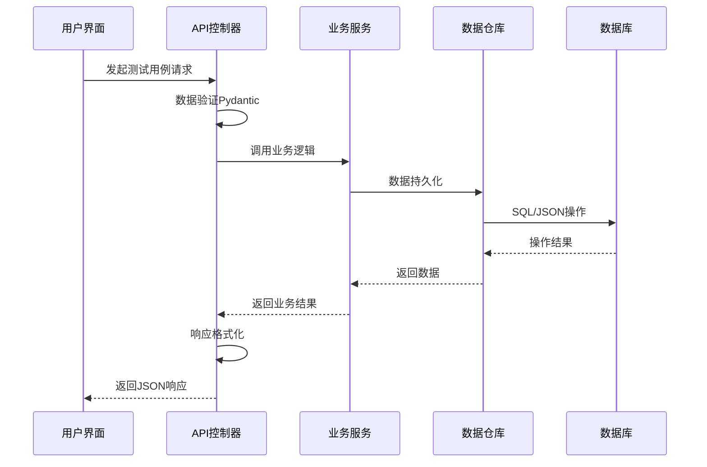

# Generation Test Case Model 生成测试用例模型

<cite>
**本文档引用的文件**
- [test.py](file://backend/app/models/test.py)
- [test.py](file://backend/app/schemas/test.py)
- [new_test_management.py](file://backend/app/controllers/new_test_management.py)
- [new_test_service.py](file://backend/app/services/new_test_service.py)
- [test_management.py](file://backend/app/controllers/test_management.py)
- [test_service.py](file://backend/app/services/test_service.py)
- [evaluation.py](file://backend/app/models/evaluation.py)
- [retriever_evaluation.py](file://backend/app/models/retriever_evaluation.py)
- [README_TEST.md](file://backend/README_TEST.md)
- [README_RETRIEVER_EVAL.md](file://backend/README_RETRIEVER_EVAL.md)
</cite>

## 目录
1. [简介](#简介)
2. [项目结构](#项目结构)
3. [核心组件](#核心组件)
4. [架构概览](#架构概览)
5. [详细组件分析](#详细组件分析)
6. [依赖关系分析](#依赖关系分析)
7. [性能考虑](#性能考虑)
8. [故障排除指南](#故障排除指南)
9. [结论](#结论)

## 简介

Generation Test Case Model 是 RAG Studio 系统中的核心测试用例管理系统，专门用于管理和执行生成式AI系统的测试。该模型支持两种主要的测试类型：检索测试（Retrieval Test）和生成测试（Generation Test），为RAG（检索增强生成）系统提供了完整的测试评估框架。

系统采用现代化的微服务架构，基于FastAPI构建RESTful API，并使用Pydantic进行数据验证和序列化。前端采用Next.js框架，提供直观的用户界面来管理测试用例、执行测试和查看评估结果。

## 项目结构



**图表来源**
- [new_test_management.py](file://backend/app/controllers/new_test_management.py#L1-L50)
- [new_test_service.py](file://backend/app/services/new_test_service.py#L1-L50)

**章节来源**
- [test.py](file://backend/app/models/test.py#L1-L100)
- [test.py](file://backend/app/schemas/test.py#L1-L100)

## 核心组件

### 测试用例类型

系统支持两种主要的测试用例类型：

1. **检索器测试用例 (RetrieverTestCase)**：专注于检索质量评估
2. **生成测试用例 (GenerationTestCase)**：专注于生成质量评估

### 数据模型架构



**图表来源**
- [test.py](file://backend/app/models/test.py#L163-L221)
- [test.py](file://backend/app/models/test.py#L198-L221)

**章节来源**
- [test.py](file://backend/app/models/test.py#L163-L221)
- [test.py](file://backend/app/schemas/test.py#L361-L411)

## 架构概览

### 系统架构图



**图表来源**
- [new_test_management.py](file://backend/app/controllers/new_test_management.py#L30-L35)
- [new_test_service.py](file://backend/app/services/new_test_service.py#L25-L30)

## 详细组件分析

### 检索器测试用例管理

#### 创建检索器测试用例



**图表来源**
- [new_test_management.py](file://backend/app/controllers/new_test_management.py#L37-L71)
- [new_test_service.py](file://backend/app/services/new_test_service.py#L32-L65)

#### 批量创建测试用例

系统支持批量创建检索器测试用例，提供更好的性能和用户体验：

| 参数 | 类型 | 描述 | 必需 |
|------|------|------|------|
| test_set_id | string | 测试集ID | 是 |
| cases | List[Dict] | 测试用例数据列表 | 是 |
| cases[].question | string | 问题文本 | 是 |
| cases[].expected_answers | List[Dict] | 期望答案列表 | 是 |
| cases[].metadata | Dict | 元数据 | 否 |

**章节来源**
- [new_test_management.py](file://backend/app/controllers/new_test_management.py#L74-L111)
- [new_test_service.py](file://backend/app/services/new_test_service.py#L67-L123)

### 生成测试用例管理

#### 生成测试用例模型



**图表来源**
- [test.py](file://backend/app/models/test.py#L198-L221)
- [test.py](file://backend/app/schemas/test.py#L487-L511)

#### 生成测试用例生命周期



**图表来源**
- [new_test_service.py](file://backend/app/services/new_test_service.py#L285-L309)
- [new_test_service.py](file://backend/app/services/new_test_service.py#L311-L359)

**章节来源**
- [new_test_management.py](file://backend/app/controllers/new_test_management.py#L405-L440)
- [new_test_service.py](file://backend/app/services/new_test_service.py#L278-L309)

### 评估系统集成

#### 评估任务模型



**图表来源**
- [evaluation.py](file://backend/app/models/evaluation.py#L28-L69)
- [evaluation.py](file://backend/app/models/evaluation.py#L71-L108)

**章节来源**
- [evaluation.py](file://backend/app/models/evaluation.py#L28-L108)

## 依赖关系分析

### 组件依赖图



**图表来源**
- [new_test_service.py](file://backend/app/services/new_test_service.py#L25-L30)
- [test_service.py](file://backend/app/services/test_service.py#L24-L32)

### 数据流分析



**图表来源**
- [new_test_management.py](file://backend/app/controllers/new_test_management.py#L37-L71)
- [new_test_service.py](file://backend/app/services/new_test_service.py#L32-L65)

**章节来源**
- [new_test_management.py](file://backend/app/controllers/new_test_management.py#L1-L50)
- [new_test_service.py](file://backend/app/services/new_test_service.py#L1-L50)

## 性能考虑

### 批量操作优化

系统针对大量测试用例的批量操作进行了优化：

1. **批量创建**：支持一次性创建多个测试用例，减少网络往返
2. **事务处理**：确保批量操作的一致性
3. **错误隔离**：单个用例创建失败不影响其他用例

### 缓存策略

- **测试集缓存**：频繁访问的测试集信息缓存
- **配置缓存**：知识库配置信息缓存
- **元数据缓存**：测试用例元数据缓存

### 分页查询

对于大量测试用例的查询，系统实现了分页机制：

| 参数 | 默认值 | 最大值 | 描述 |
|------|--------|--------|------|
| page | 1 | 无限制 | 页码 |
| page_size | 20 | 100 | 每页大小 |
| skip | 0 | 无限制 | 跳过记录数 |

## 故障排除指南

### 常见问题及解决方案

#### 1. 测试用例创建失败

**问题症状**：API返回404错误，提示测试集不存在

**可能原因**：
- 测试集ID不存在
- 测试集已被删除
- 权限不足

**解决方案**：
```bash
# 检查测试集是否存在
curl -X GET "http://localhost:8000/api/v1/tests/test-sets/{test_set_id}"

# 如果不存在，先创建测试集
curl -X POST "http://localhost:8000/api/v1/tests/test-sets" \
  -H "Content-Type: application/json" \
  -d '{
    "name": "测试集名称",
    "test_type": "generation",
    "description": "测试描述"
  }'
```

#### 2. 批量导入失败

**问题症状**：部分测试用例导入成功，部分失败

**诊断步骤**：
1. 检查失败记录中的错误信息
2. 验证测试用例数据格式
3. 检查测试集容量限制

**解决方案**：
```python
# 检查批量操作结果
{
    "success_count": 95,
    "failed_count": 5,
    "failed_items": [
        {
            "index": 2,
            "question": "问题文本",
            "error": "验证错误信息"
        }
    ]
}
```

#### 3. 评估指标计算异常

**问题症状**：评估结果为空或指标计算失败

**可能原因**：
- 检索结果为空
- 生成答案格式不正确
- RAGAS评估框架配置错误

**解决方案**：
- 检查检索配置
- 验证生成模型设置
- 查看详细错误日志

**章节来源**
- [README_TEST.md](file://backend/README_TEST.md#L157-L208)
- [README_RETRIEVER_EVAL.md](file://backend/README_RETRIEVER_EVAL.md#L281-L303)

## 结论

Generation Test Case Model 为RAG系统提供了完整的测试评估框架，具有以下优势：

### 主要特性

1. **双类型支持**：同时支持检索测试和生成测试
2. **灵活的测试用例管理**：支持单个和批量操作
3. **完善的评估体系**：集成RAGAS评估框架
4. **RESTful API设计**：易于集成和扩展
5. **前后端分离**：现代化的技术栈

### 应用场景

- **RAG系统开发**：验证检索和生成质量
- **模型对比**：评估不同模型的效果
- **性能优化**：追踪系统性能变化
- **质量保证**：确保生产环境的稳定性

### 未来发展方向

1. **自动化测试**：支持定时任务和自动化执行
2. **可视化分析**：提供更丰富的图表和报告
3. **分布式评估**：支持大规模分布式测试
4. **更多评估指标**：集成更多标准评估框架

通过这套完整的测试用例模型，开发者可以有效地验证和优化RAG系统的性能，确保生成内容的质量和可靠性。