# RAG Studio 检索器测试用例模型

<cite>
**本文档引用的文件**
- [test.py](file://backend/app/models/test.py)
- [test.py](file://backend/app/schemas/test.py)
- [new_test_service.py](file://backend/app/services/new_test_service.py)
- [new_test_management.py](file://backend/app/controllers/new_test_management.py)
- [factory.py](file://backend/app/repositories/factory.py)
- [base.py](file://backend/app/repositories/base.py)
- [example_t2ranking_usage.py](file://backend/example_t2ranking_usage.py)
- [README_RETRIEVER_EVAL.md](file://backend/README_RETRIEVER_EVAL.md)
</cite>

## 目录
1. [概述](#概述)
2. [项目架构](#项目架构)
3. [核心数据模型](#核心数据模型)
4. [API接口设计](#api接口设计)
5. [业务服务层](#业务服务层)
6. [存储层设计](#存储层设计)
7. [评估指标体系](#评估指标体系)
8. [使用示例](#使用示例)
9. [最佳实践](#最佳实践)
10. [故障排除](#故障排除)

## 概述

RAG Studio 是一个全面的检索增强生成（RAG）系统，提供了完整的检索器测试评估框架。该系统专注于支持多种类型的测试用例管理，特别是检索器测试用例，基于 T2Ranking 标准数据集和 RAGAS 评估框架构建。

### 主要特性

- **双测试类型支持**：同时支持检索测试（retrieval）和生成测试（generation）
- **灵活的期望答案管理**：支持多答案、多分块关联的复杂测试场景
- **标准化评估指标**：集成 Precision@K、Recall@K、F1-Score、NDCG 等专业评估指标
- **批量操作支持**：提供高效的批量创建、更新和删除功能
- **版本兼容性**：保留旧版测试用例模型的同时引入新的架构

## 项目架构

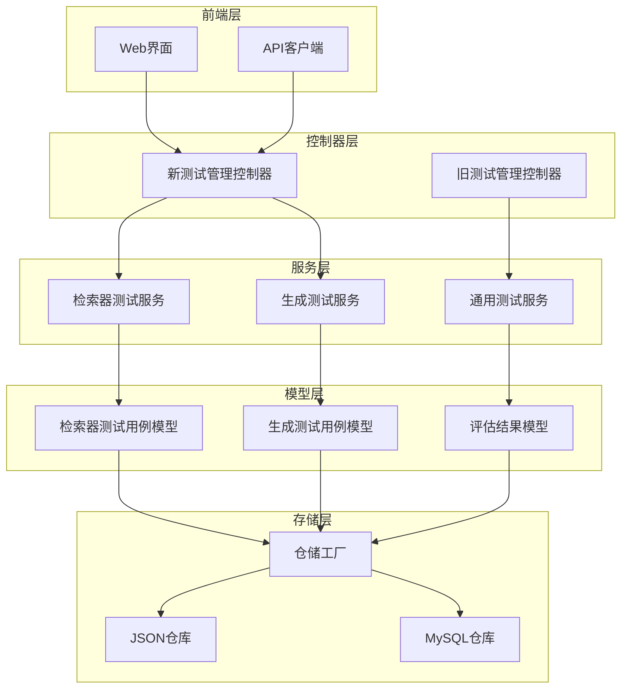

**图表来源**
- [new_test_management.py](file://backend/app/controllers/new_test_management.py#L30-L32)
- [new_test_service.py](file://backend/app/services/new_test_service.py#L25-L26)
- [factory.py](file://backend/app/repositories/factory.py#L17-L146)

## 核心数据模型

### 检索器测试用例模型

检索器测试用例是系统的核心组件，用于定义具体的测试场景和期望结果。

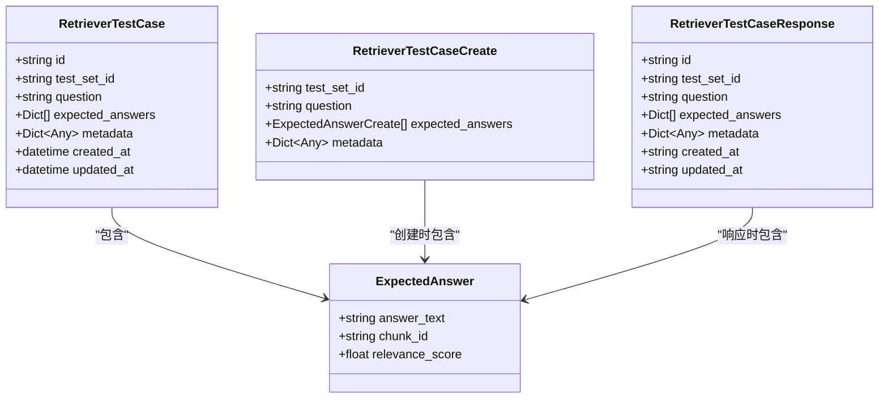

**图表来源**
- [test.py](file://backend/app/models/test.py#L163-L196)
- [test.py](file://backend/app/schemas/test.py#L361-L411)

#### 关键属性说明

| 属性 | 类型 | 描述 | 约束 |
|------|------|------|------|
| `id` | string | 测试用例唯一标识符 | 自动生成，格式：rtc_ + 12位十六进制 |
| `test_set_id` | string | 所属测试集ID | 外键约束，必须指向有效的测试集 |
| `question` | string | 测试问题文本 | 必填，最小长度1字符 |
| `expected_answers` | List[Dict] | 期望答案列表 | 至少包含一个答案，每个答案包含text、chunk_id、relevance_score |
| `metadata` | Dict[Any] | 元数据信息 | 可选，用于存储分类、难度等附加信息 |

### 生成测试用例模型

生成测试用例专门用于评估生成式AI系统的回答质量。

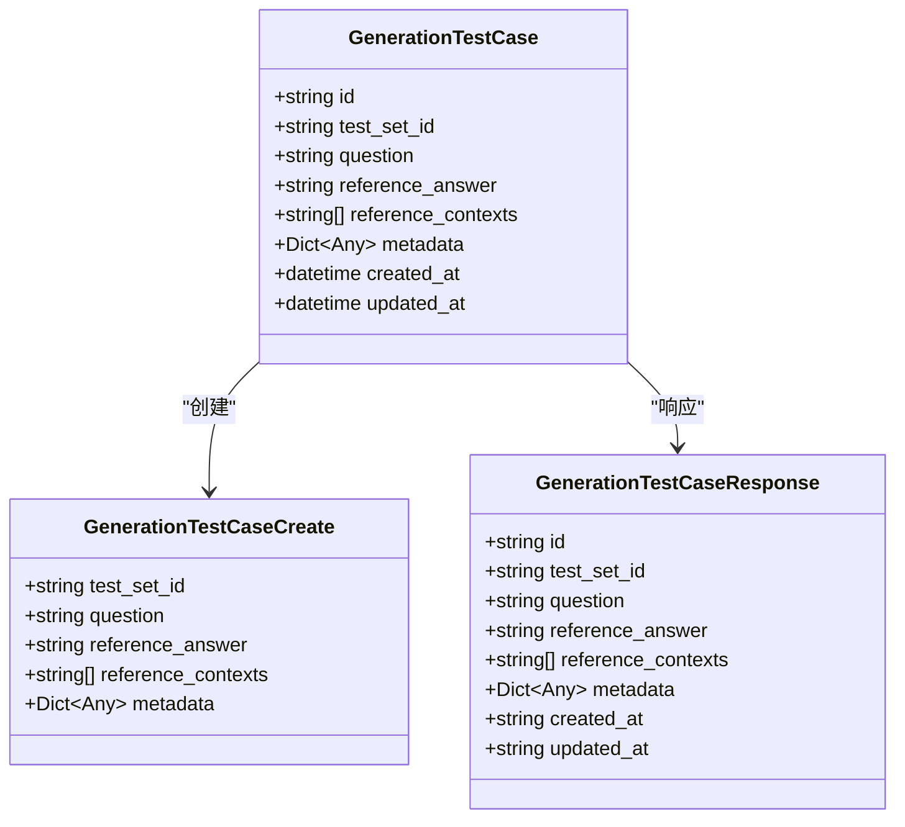

**图表来源**
- [test.py](file://backend/app/models/test.py#L198-L221)
- [test.py](file://backend/app/schemas/test.py#L487-L511)

### 评估结果模型

评估结果模型记录每次测试的详细表现和评估指标。

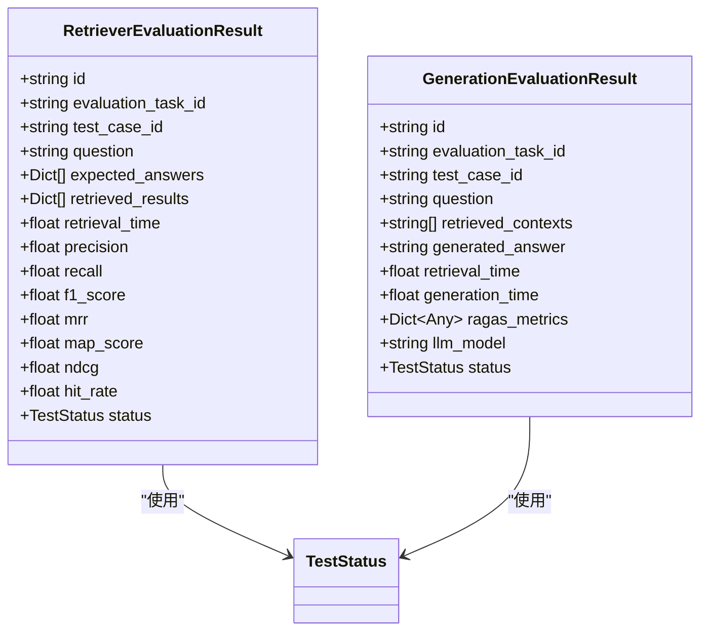

**图表来源**
- [test.py](file://backend/app/models/test.py#L272-L317)
- [test.py](file://backend/app/models/test.py#L320-L376)

**章节来源**
- [test.py](file://backend/app/models/test.py#L163-L376)

## API接口设计

### 检索器测试用例API

系统提供了完整的 CRUD 操作接口，支持单个和批量操作。

#### 创建检索器测试用例

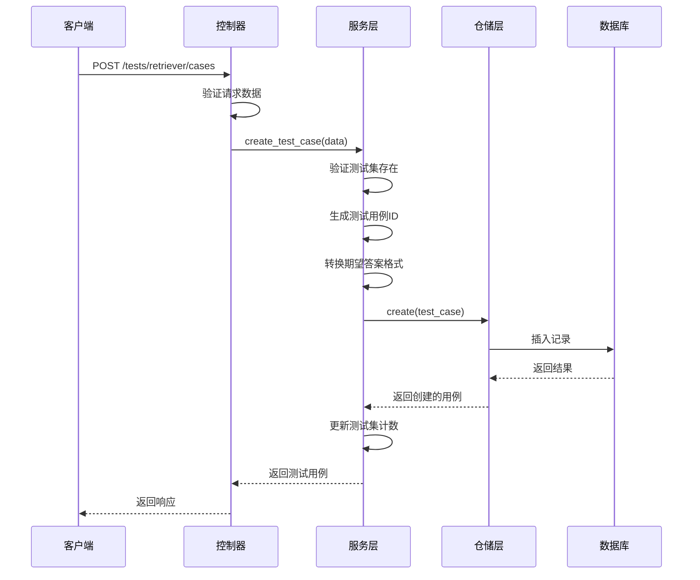

**图表来源**
- [new_test_management.py](file://backend/app/controllers/new_test_management.py#L37-L71)
- [new_test_service.py](file://backend/app/services/new_test_service.py#L32-L65)

#### 批量操作接口

| 接口 | 方法 | 功能 | 参数 |
|------|------|------|------|
| `/tests/retriever/cases/batch` | POST | 批量创建检索器测试用例 | test_set_id, cases[] |
| `/tests/retriever/cases/batch` | DELETE | 批量删除检索器测试用例 | case_ids[] |
| `/tests/generation/cases/batch` | POST | 批量创建生成测试用例 | test_set_id, cases[] |
| `/tests/generation/cases/batch` | DELETE | 批量删除生成测试用例 | case_ids[] |

#### 期望答案管理

系统支持动态管理测试用例中的期望答案：

| 接口 | 方法 | 功能 | 说明 |
|------|------|------|------|
| `/tests/retriever/cases/{case_id}/answers` | POST | 添加期望答案 | 向现有用例添加新的期望答案 |
| `/tests/retriever/cases/{case_id}/answers/{answer_index}` | PUT | 更新期望答案 | 修改指定索引的答案 |
| `/tests/retriever/cases/{case_id}/answers/{answer_index}` | DELETE | 删除期望答案 | 移除指定索引的答案 |

### 生成测试用例API

生成测试用例的API设计遵循相同的RESTful原则：

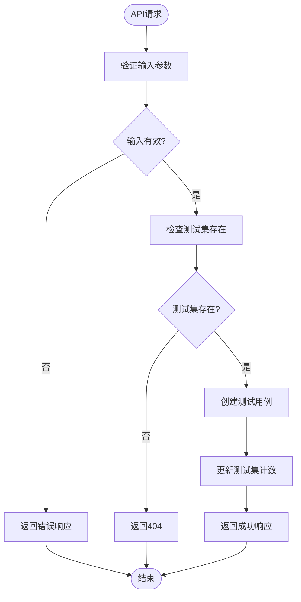

**图表来源**
- [new_test_management.py](file://backend/app/controllers/new_test_management.py#L405-L440)
- [new_test_service.py](file://backend/app/services/new_test_service.py#L285-L309)

**章节来源**
- [new_test_management.py](file://backend/app/controllers/new_test_management.py#L37-L651)

## 业务服务层

### 检索器测试服务

检索器测试服务提供了丰富的业务逻辑处理能力：

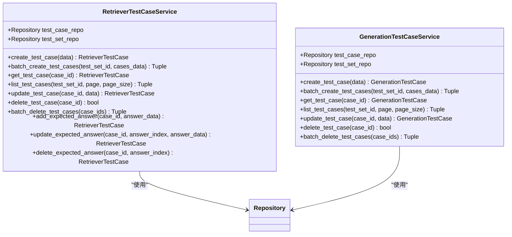

**图表来源**
- [new_test_service.py](file://backend/app/services/new_test_service.py#L25-L437)

#### 核心功能特性

1. **批量操作支持**：提供批量创建和删除功能，支持错误处理和部分成功场景
2. **期望答案管理**：支持动态添加、更新和删除期望答案
3. **测试集关联**：自动维护测试用例与测试集之间的计数关系
4. **数据验证**：严格的输入验证和业务规则检查

### 仓储工厂模式

系统采用仓储工厂模式实现存储层的抽象和切换：

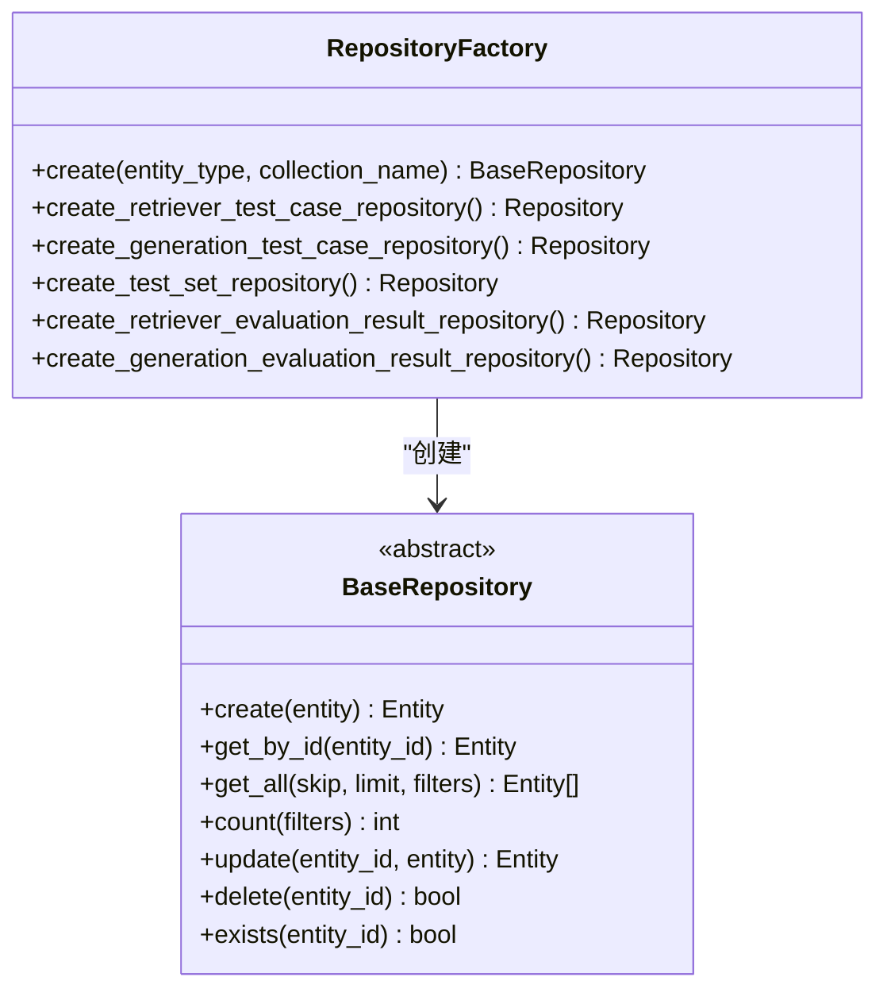

**图表来源**
- [factory.py](file://backend/app/repositories/factory.py#L17-L146)
- [base.py](file://backend/app/repositories/base.py#L14-L121)

**章节来源**
- [new_test_service.py](file://backend/app/services/new_test_service.py#L25-L437)
- [factory.py](file://backend/app/repositories/factory.py#L17-L146)

## 存储层设计

### 数据持久化架构

系统支持多种存储后端，通过工厂模式实现存储层的可插拔性：

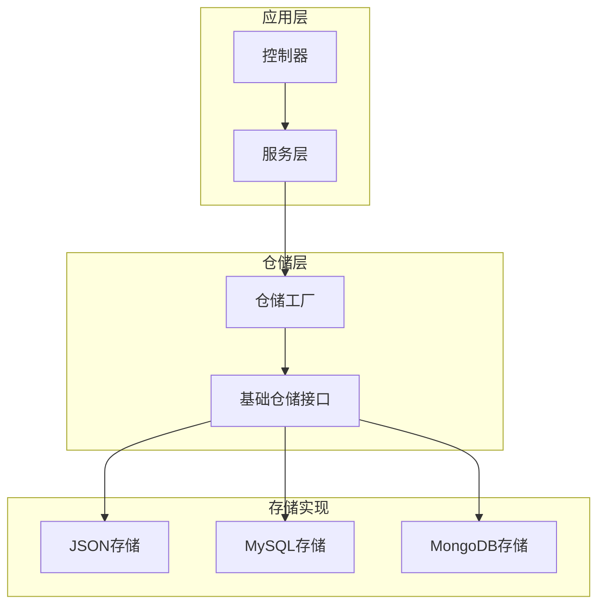

**图表来源**
- [factory.py](file://backend/app/repositories/factory.py#L23-L48)

### 存储配置

| 存储类型 | 适用场景 | 配置方式 | 优势 |
|----------|----------|----------|------|
| JSON | 开发测试、小型项目 | STORAGE_TYPE=json | 简单易用、无需数据库 |
| MySQL | 生产环境、大型项目 | STORAGE_TYPE=mysql | 数据持久化、事务支持 |

### 数据模型映射

系统通过 ORM 层实现数据模型与存储的解耦：

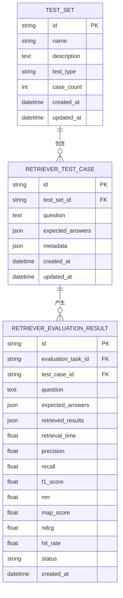

**图表来源**
- [test.py](file://backend/app/models/test.py#L163-L317)

**章节来源**
- [factory.py](file://backend/app/repositories/factory.py#L23-L146)
- [base.py](file://backend/app/repositories/base.py#L14-L121)

## 评估指标体系

### 检索评估指标

系统集成了专业的信息检索评估指标：

| 指标名称 | 英文名称 | 计算公式 | 取值范围 | 说明 |
|----------|----------|----------|----------|------|
| 精确率 | Precision@K | 正确检索结果数 / 检索结果总数 | 0.0-1.0 | 衡量检索结果的准确性 |
| 召回率 | Recall@K | 正确检索结果数 / 相关文档总数 | 0.0-1.0 | 衡量检索结果的完整性 |
| F1分数 | F1-Score | 2 × (Precision × Recall) / (Precision + Recall) | 0.0-1.0 | 精确率和召回率的调和平均 |
| 平均倒数排名 | MRR | 1/N × Σ(1/rank_i) | 0.0-1.0 | 关注第一个相关结果的位置 |
| 平均精度均值 | MAP | 1/N × Σ(Precision@k) | 0.0-1.0 | 考虑所有相关结果的平均精度 |
| 归一化折损累积增益 | NDCG | DCNCG / IDCG | 0.0-1.0 | 综合考虑相关性和排序位置 |
| 命中率 | Hit Rate | 检测到相关文档的查询比例 | 0.0-1.0 | 衡量检索器的覆盖率 |

### 生成评估指标

基于 RAGAS 框架的生成质量评估：

| 指标名称 | 英文名称 | 说明 | 应用场景 |
|----------|----------|------|----------|
| 忠实度 | Faithfulness | 生成答案与检索上下文的一致性 | 检查事实准确性 |
| 答案相关性 | Answer Relevancy | 生成答案与问题的相关程度 | 评估回答质量 |
| 上下文精度 | Context Precision | 检索上下文的质量和相关性 | 评估检索效果 |
| 上下文召回率 | Context Recall | 检索上下文覆盖相关信息的程度 | 评估信息完整性 |
| 答案相似度 | Answer Similarity | 生成答案与参考答案的相似度 | 评估一致性 |
| 答案正确性 | Answer Correctness | 生成答案的正确性和完整性 | 综合质量评估 |

### 评估流程

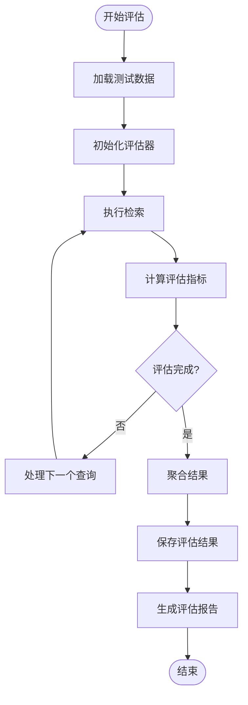

**图表来源**
- [example_t2ranking_usage.py](file://backend/example_t2ranking_usage.py#L32-L171)

**章节来源**
- [README_RETRIEVER_EVAL.md](file://backend/README_RETRIEVER_EVAL.md#L14-L21)

## 使用示例

### 基本操作示例

#### 创建检索器测试用例

```typescript
// 创建单个测试用例
const testCase = await retrieverTestCaseAPI.create({
    test_set_id: "ts_001",
    question: "Python中如何定义一个类？",
    expected_answers: [
        {
            answer_text: "在Python中使用class关键字定义类",
            chunk_id: "chunk_001",
            relevance_score: 1.0
        },
        {
            answer_text: "类是面向对象编程的基础",
            chunk_id: "chunk_002", 
            relevance_score: 0.8
        }
    ],
    metadata: {
        difficulty: "easy",
        category: "python_basics"
    }
});
```

#### 批量创建测试用例

```typescript
// 批量创建多个测试用例
const batchResult = await retrieverTestCaseAPI.createBatch([
    {
        test_set_id: "ts_001",
        question: "什么是装饰器？",
        expected_answers: [
            {
                answer_text: "装饰器是Python中用于修改函数行为的语法糖",
                relevance_score: 1.0
            }
        ],
        metadata: {}
    },
    // 更多测试用例...
]);
```

#### 管理期望答案

```typescript
// 添加新的期望答案
await retrieverTestCaseAPI.addExpectedAnswer("rtc_abc123", {
    answer_text: "装饰器可以修改函数的行为而不改变其定义",
    relevance_score: 0.9
});

// 更新现有答案
await retrieverTestCaseAPI.updateExpectedAnswer("rtc_abc123", 0, {
    answer_text: "装饰器是Python中用于修改函数行为的语法糖",
    relevance_score: 0.95
});

// 删除期望答案
await retrieverTestCaseAPI.deleteExpectedAnswer("rtc_abc123", 1);
```

### T2Ranking数据集集成

系统原生支持 T2Ranking 数据集的导入和评估：

```python
# 数据集统计信息获取
statistics = await dataset_service.get_statistics(
    collection_path="/path/to/collection.tsv",
    queries_path="/path/to/queries.dev.tsv", 
    qrels_path="/path/to/qrels.dev.tsv",
    max_queries=100
)

# 导入T2Ranking数据集
import_result = await dataset_service.import_t2ranking(
    kb_id="kb_t2ranking",
    test_set_name="T2Ranking检索测试集",
    collection_path="/path/to/collection.tsv",
    queries_path="/path/to/queries.dev.tsv",
    qrels_path="/path/to/qrels.dev.tsv",
    max_docs=10000,
    max_queries=100
)
```

### 评估执行示例

```python
# 执行检索器评估
evaluation_result = await evaluator.evaluate(
    kb_id="kb_001",
    test_set_id="ts_001", 
    top_k=10,
    vector_db_type="elasticsearch",
    embedding_model="nomic-embed-text"
)

# 结果分析
print(f"F1-Score: {evaluation_result.overall_metrics['f1_score']:.4f}")
print(f"NDCG: {evaluation_result.overall_metrics['ndcg']:.4f}")
print(f"平均检索时间: {evaluation_result.average_retrieval_time:.3f}s")
```

**章节来源**
- [example_t2ranking_usage.py](file://backend/example_t2ranking_usage.py#L17-L171)

## 最佳实践

### 测试用例设计原则

1. **明确的目标**：每个测试用例应该有清晰的预期目标
2. **多样化的场景**：涵盖简单查询、复杂查询、边界情况
3. **合理的期望答案**：提供多个相关答案以覆盖不同的回答方式
4. **适当的难度分级**：根据用户群体设置合适的难度级别

### 性能优化建议

1. **数据集采样**：对于大规模数据集，使用 `max_queries` 和 `max_docs` 参数进行采样
2. **批量操作**：优先使用批量API进行大量数据操作
3. **分页处理**：合理设置分页大小，避免一次性加载过多数据
4. **缓存策略**：对频繁访问的测试用例进行缓存

### 错误处理策略

```typescript
// 批量操作错误处理
try {
    const result = await retrieverTestCaseAPI.createBatch(testCases);
    
    if (result.data.failed_count > 0) {
        console.warn(`成功 ${result.data.success_count} 个，失败 ${result.data.failed_count} 个`);
        // 处理失败记录
        result.data.failed_items.forEach(item => {
            console.error(`索引 ${item.index} 失败: ${item.error}`);
        });
    }
} catch (error) {
    console.error('批量创建失败:', error.message);
}
```

### 版本管理

1. **测试集版本控制**：定期备份重要的测试集配置
2. **评估结果追踪**：保存每次评估的详细配置和结果
3. **模型对比**：建立标准化的对比基准

## 故障排除

### 常见问题及解决方案

#### 1. 测试用例创建失败

**问题症状**：创建测试用例时返回404错误

**可能原因**：
- 测试集ID不存在
- 输入数据格式不正确
- 权限不足

**解决方案**：
```typescript
// 检查测试集是否存在
const testSets = await testSetAPI.list();
console.log('可用测试集:', testSets.data);

// 验证输入数据
console.log('输入数据:', testData);
```

#### 2. 评估指标异常

**问题症状**：评估指标值异常（如负数或大于1）

**可能原因**：
- 检索结果为空
- 相关文档标签错误
- 评估参数配置不当

**解决方案**：
```python
# 检查检索结果
print(f"检索到的文档数量: {len(retrieved_docs)}")
print(f"相关文档数量: {len(relevant_docs)}")

# 验证评估参数
print(f"top_k: {evaluator.top_k}")
print(f"评估范围: {evaluator.eval_range}")
```

#### 3. 性能问题

**问题症状**：API响应缓慢或超时

**可能原因**：
- 数据量过大
- 存储性能瓶颈
- 网络延迟

**解决方案**：
```python
# 使用采样进行快速测试
dataset = load_t2ranking(max_queries=50, max_docs=500)

# 分批处理大量数据
batch_size = 100
for i in range(0, len(test_cases), batch_size):
    batch = test_cases[i:i+batch_size]
    # 处理批次
```

### 调试工具

1. **日志记录**：启用详细的日志记录来跟踪问题
2. **性能监控**：监控API响应时间和资源使用情况
3. **数据验证**：定期验证数据完整性和一致性

**章节来源**
- [README_RETRIEVER_EVAL.md](file://backend/README_RETRIEVER_EVAL.md#L281-L303)

## 总结

RAG Studio 的检索器测试用例模型提供了一个完整、灵活且高性能的测试评估框架。通过模块化的设计、标准化的接口和丰富的评估指标，该系统能够满足从开发测试到生产评估的各种需求。

### 核心优势

1. **架构清晰**：采用分层架构，职责分离明确
2. **扩展性强**：支持多种存储后端和评估指标
3. **易于使用**：提供简洁的API和丰富的示例
4. **性能优异**：支持批量操作和高效的数据处理

### 发展方向

1. **更多数据集支持**：集成更多标准评估数据集
2. **自动化评估**：实现自动化的A/B测试和性能监控
3. **可视化分析**：提供直观的评估结果可视化界面
4. **分布式支持**：支持大规模分布式评估场景

通过持续的优化和功能扩展，RAG Studio 将成为 RAG 系统评估领域的重要工具。