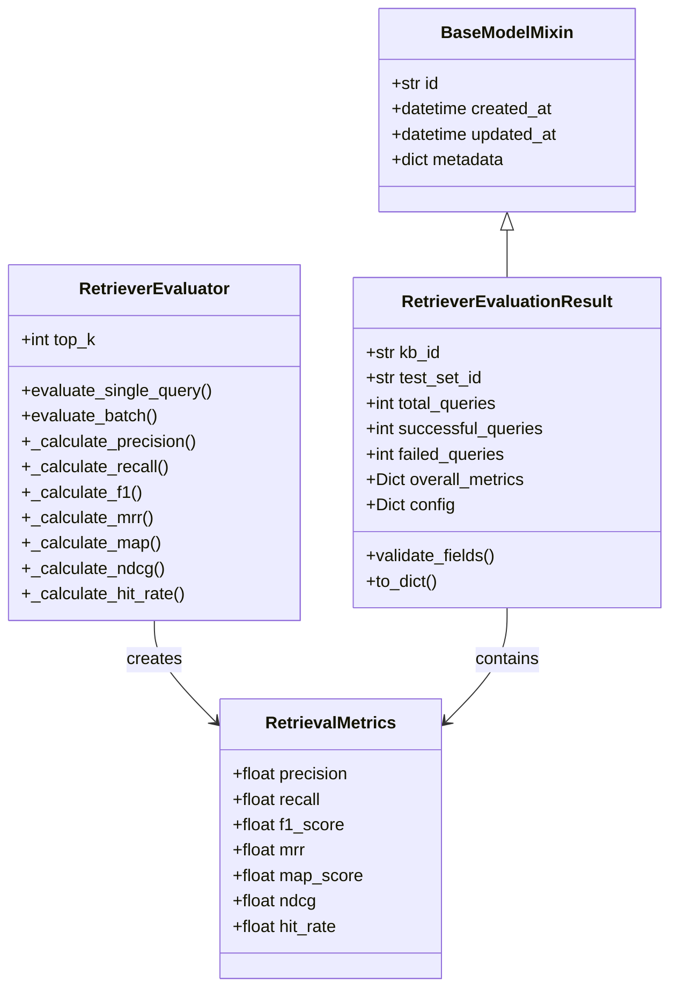
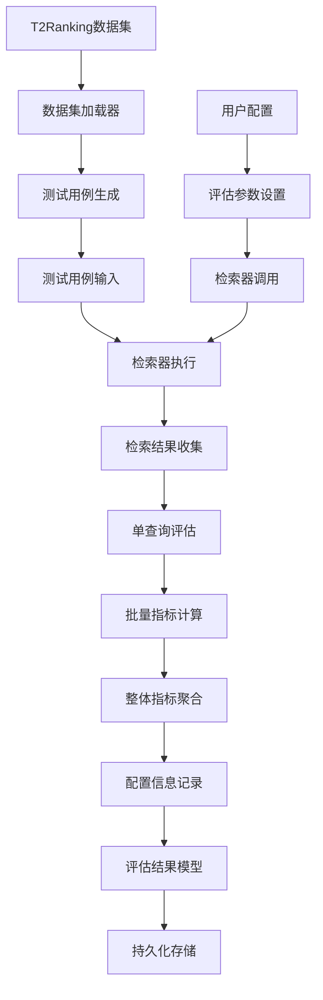
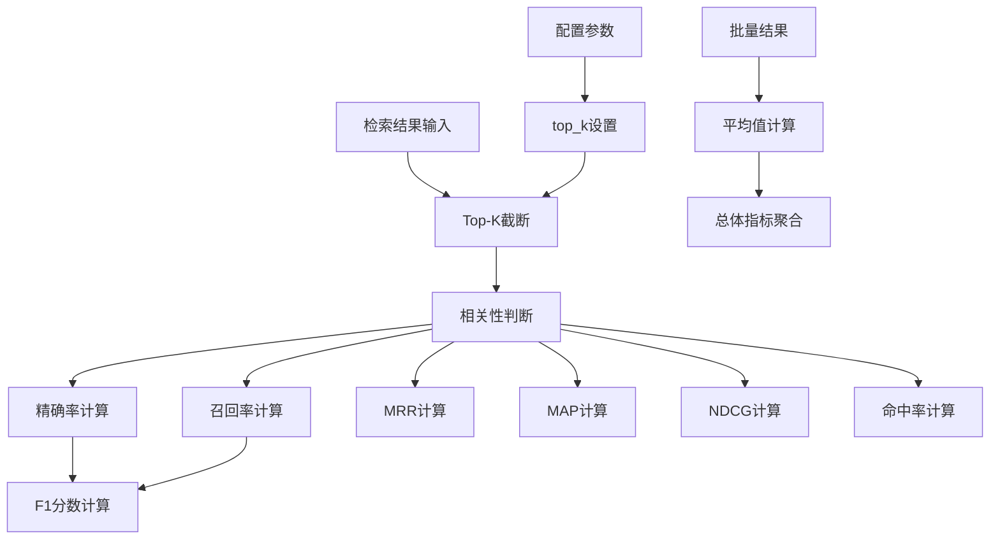
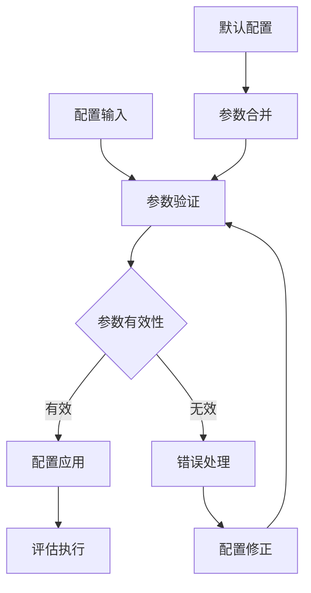
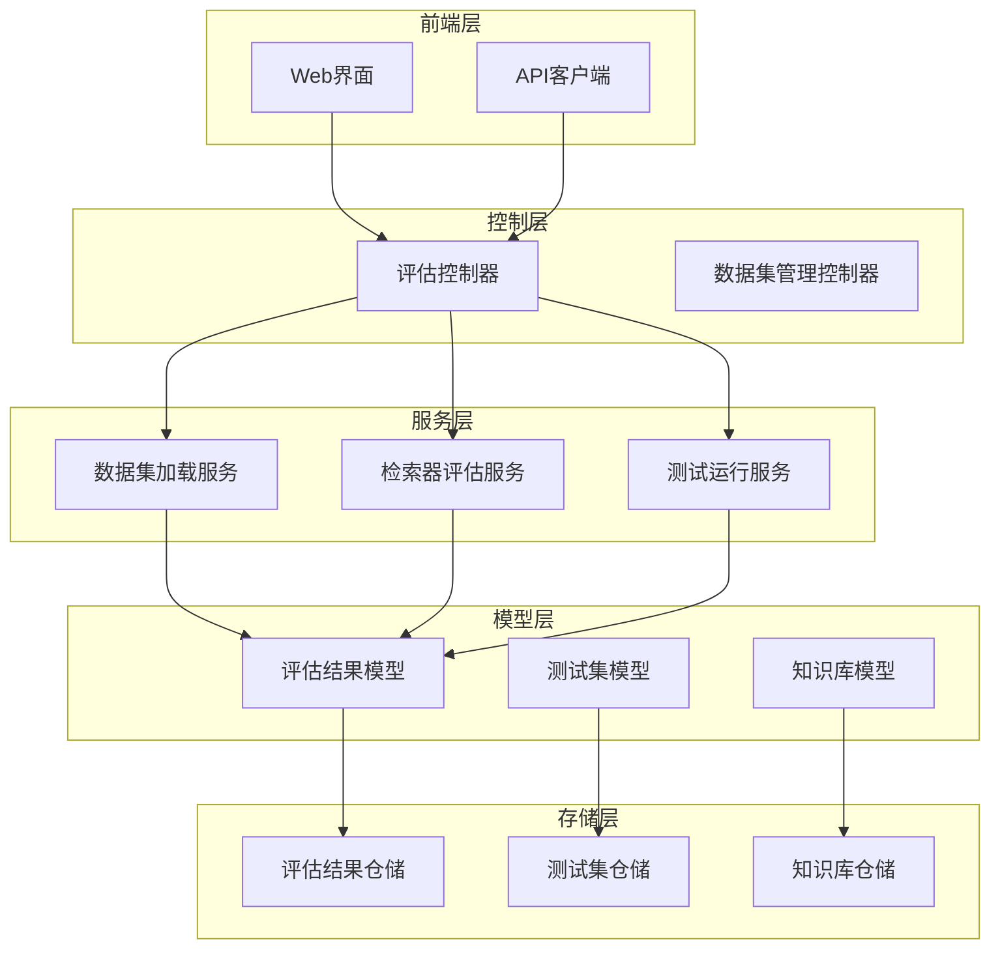
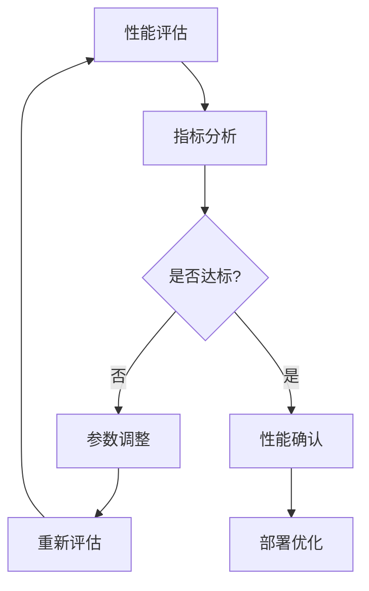

# 检索器评估结果模型

<cite>
**本文档引用的文件**
- [retriever_evaluation.py](file://backend/app/models/retriever_evaluation.py)
- [retriever_evaluation.py](file://backend/app/services/retriever_evaluation.py)
- [retriever_evaluation.py](file://backend/app/controllers/retriever_evaluation.py)
- [retriever_evaluation_repository.py](file://backend/app/repositories/retriever_evaluation_repository.py)
- [test.py](file://backend/app/schemas/test.py)
- [dataset_loader.py](file://backend/app/services/dataset_loader.py)
- [README_RETRIEVER_EVAL.md](file://backend/README_RETRIEVER_EVAL.md)
- [SUMMARY_检索器评估系统.md](file://backend/SUMMARY_检索器评估系统.md)
</cite>

## 目录
1. [简介](#简介)
2. [模型结构设计](#模型结构设计)
3. [核心字段详解](#核心字段详解)
4. [评估指标体系](#评估指标体系)
5. [配置管理机制](#配置管理机制)
6. [系统架构集成](#系统架构集成)
7. [使用场景与最佳实践](#使用场景与最佳实践)
8. [性能分析与优化](#性能分析与优化)
9. [故障排除指南](#故障排除指南)
10. [总结](#总结)

## 简介

检索器评估结果模型（RetrieverEvaluationResult）是RAG Studio检索器评估系统的核心数据结构，作为独立评估系统的输出载体，负责封装和存储检索器性能评估的完整结果。该模型采用标准化的数据格式，确保评估结果的可追溯性、可复现性和可对比性。

该模型的设计遵循信息检索领域的最佳实践，集成了业界标准的评估指标体系，支持多种向量数据库和embedding模型的性能对比，为RAG系统的优化提供了科学的评估依据。

## 模型结构设计

### 类层次结构



**图表来源**
- [retriever_evaluation.py](file://backend/app/models/retriever_evaluation.py#L11-L60)
- [retriever_evaluation.py](file://backend/app/services/retriever_evaluation.py#L14-L24)

### 数据流架构



**图表来源**
- [retriever_evaluation.py](file://backend/app/controllers/retriever_evaluation.py#L334-L373)
- [dataset_loader.py](file://backend/app/services/dataset_loader.py#L14-L261)

**章节来源**
- [retriever_evaluation.py](file://backend/app/models/retriever_evaluation.py#L1-L60)
- [retriever_evaluation.py](file://backend/app/services/retriever_evaluation.py#L1-L423)

## 核心字段详解

### 关联字段设计

#### kb_id（知识库ID）
- **类型**: `str`
- **描述**: 唯一标识关联的知识库，确保评估结果与特定知识库配置对应
- **用途**: 支持多知识库环境下的评估隔离
- **约束**: 必填字段，不能为空

#### test_set_id（测试集ID）
- **类型**: `str`  
- **描述**: 标识用于评估的测试集，确保评估的一致性和可重复性
- **用途**: 支持不同测试集间的性能对比
- **约束**: 必填字段，必须指向有效的测试集

这两个关联字段构成了评估结果的唯一标识符，确保了评估结果的可追溯性和实验的可重现性。

### 执行统计指标

#### total_queries（总查询数）
- **类型**: `int`
- **描述**: 本次评估执行的总查询数量
- **监控价值**: 衡量评估规模，反映评估的全面性
- **计算逻辑**: 测试用例总数

#### successful_queries（成功查询数）
- **类型**: `int`
- **描述**: 评估过程中成功执行的查询数量
- **监控价值**: 反映系统稳定性，异常率计算基础
- **计算逻辑**: 无异常的查询执行数量

#### failed_queries（失败查询数）
- **类型**: `int`
- **描述**: 评估过程中执行失败的查询数量
- **监控价值**: 识别系统问题，评估健壮性
- **计算逻辑**: 总查询数 - 成功查询数

### 整体指标容器

#### overall_metrics（总体评估指标）
- **类型**: `Dict[str, float]`
- **描述**: 包含所有评估指标的聚合结果
- **监控价值**: 提供检索器性能的综合评价
- **默认值**: 空字典，延迟初始化

该字段采用字典结构存储七个核心评估指标，每个指标都有明确的数学定义和行业标准。

**章节来源**
- [retriever_evaluation.py](file://backend/app/models/retriever_evaluation.py#L14-L32)

## 评估指标体系

### 精确率指标系列

#### Precision@K（精确率）
- **数学公式**: `Precision@K = |检索到的相关文档| / |检索到的文档|`
- **范围**: [0.0, 1.0]
- **行业标准**: 
  - > 0.7: 优秀
  - 0.5-0.7: 良好  
  - < 0.5: 需要优化
- **应用场景**: 评估检索结果的准确性，适用于信息抽取场景

#### Recall@K（召回率）
- **数学公式**: `Recall@K = |检索到的相关文档| / |所有相关文档|`
- **范围**: [0.0, 1.0]
- **行业标准**: 
  - > 0.7: 覆盖度良好
  - 0.5-0.7: 基本满足需求
  - < 0.5: 覆盖不足
- **应用场景**: 评估检索结果的完整性，适用于信息检索场景

#### F1-Score（F1分数）
- **数学公式**: `F1 = 2 * (Precision * Recall) / (Precision + Recall)`
- **范围**: [0.0, 1.0]
- **行业标准**: 平衡精确率和召回率的综合指标
- **优势**: 避免单一指标的极端值影响

### 排序质量指标

#### MRR（平均倒数排名）
- **数学公式**: `MRR = 1 / rank of first relevant doc`
- **范围**: [0.0, 1.0]
- **特点**: 关注第一个相关结果的位置
- **适用场景**: 单答案检索场景，如问答系统

#### MAP（平均精度均值）
- **数学公式**: `MAP = (sum of P@k for each relevant doc) / |relevant docs|`
- **范围**: [0.0, 1.0]
- **特点**: 考虑所有相关结果的精度
- **适用场景**: 多答案检索场景，如文档检索

#### NDCG（归一化折损累积增益）
- **数学公式**: `NDCG = DCG / IDCG`
- **范围**: [0.0, 1.0]
- **特点**: 综合考虑相关性和排序位置
- **优势**: 适合不同规模的检索结果对比

### 命中质量指标

#### Hit Rate（命中率）
- **数学公式**: `Hit Rate = 1 if 至少有一个相关文档被检索到, 0 otherwise`
- **范围**: [0.0, 1.0]
- **特点**: 二分类指标，关注是否检索到相关结果
- **适用场景**: 检索系统可用性评估

### 指标计算流程



**图表来源**
- [retriever_evaluation.py](file://backend/app/services/retriever_evaluation.py#L38-L73)

**章节来源**
- [retriever_evaluation.py](file://backend/app/services/retriever_evaluation.py#L14-L24)
- [README_RETRIEVER_EVAL.md](file://backend/README_RETRIEVER_EVAL.md#L240-L256)

## 配置管理机制

### config字段设计

#### 记录内容
- **top_k**: 检索返回的top-k数量，影响评估的粒度
- **vector_db_type**: 向量数据库类型，支持Elasticsearch、Qdrant等
- **embedding_model**: 使用的embedding模型名称
- **embedding_provider**: 向量模型提供商
- **retrieval_algorithm**: 检索算法配置
- **其他参数**: 根据具体评估场景动态添加

#### 可追溯性保证
- **完整记录**: 保存评估时的所有配置参数
- **版本控制**: 支持配置变更的历史追踪
- **对比基础**: 确保不同评估结果的可比性

#### 可复现性保障
- **配置快照**: 评估时的完整配置状态
- **环境信息**: 包含硬件和软件环境信息
- **数据版本**: 关联的数据集版本信息

### 配置验证机制



**图表来源**
- [test.py](file://backend/app/schemas/test.py#L183-L233)

**章节来源**
- [retriever_evaluation.py](file://backend/app/models/retriever_evaluation.py#L28-L32)
- [test.py](file://backend/app/schemas/test.py#L183-L233)

## 系统架构集成

### 评估流水线位置



**图表来源**
- [retriever_evaluation.py](file://backend/app/controllers/retriever_evaluation.py#L1-L375)
- [SUMMARY_检索器评估系统.md](file://backend/SUMMARY_检索器评估系统.md#L125-L150)

### 数据流转过程

#### 1. 数据准备阶段
- **数据集导入**: 通过T2Ranking数据集加载器准备测试数据
- **知识库配置**: 设置目标知识库的向量数据库和embedding模型
- **测试集创建**: 生成标准化的测试用例

#### 2. 评估执行阶段
- **检索器调用**: 执行检索操作获取候选结果
- **指标计算**: 基于检索结果和真实标签计算评估指标
- **结果聚合**: 将单查询指标聚合为总体指标

#### 3. 结果存储阶段
- **模型封装**: 将评估结果封装到RetrieverEvaluationResult模型
- **持久化**: 保存到数据库或文件系统
- **历史追踪**: 维护评估历史记录

### 扩展点设计

#### 1. 评估指标扩展
- **自定义指标**: 支持添加领域特定的评估指标
- **第三方集成**: 预留RAGAS框架集成接口
- **动态配置**: 支持运行时调整评估指标组合

#### 2. 存储后端扩展
- **JSON存储**: 适用于开发和测试环境
- **MySQL存储**: 适用于生产环境
- **其他存储**: 支持MongoDB、PostgreSQL等

#### 3. 数据源扩展
- **标准数据集**: 支持T2Ranking、BEIR等
- **自定义数据**: 支持用户自定义数据集格式
- **实时数据**: 支持在线评估场景

**章节来源**
- [retriever_evaluation.py](file://backend/app/controllers/retriever_evaluation.py#L1-L375)
- [SUMMARY_检索器评估系统.md](file://backend/SUMMARY_检索器评估系统.md#L125-L150)

## 使用场景与最佳实践

### 典型使用场景

#### 场景1: 向量数据库对比
```python
# 测试不同向量数据库
evaluator_es = RetrieverEvaluator(top_k=10)
metrics_es = evaluator_es.evaluate_single_query(retrieved_es, relevant)

evaluator_qdrant = RetrieverEvaluator(top_k=10)  
metrics_qdrant = evaluator_qdrant.evaluate_single_query(retrieved_qdrant, relevant)

# 对比结果
print(f"Elasticsearch F1: {metrics_es['f1_score']:.4f}")
print(f"Qdrant F1: {metrics_qdrant['f1_score']:.4f}")
```

#### 场景2: Embedding模型评估
```python
# 评估不同embedding模型
models = ["nomic-embed-text", "bge-large-zh", "text-embedding-ada-002"]

for model in models:
    # 使用该模型进行检索
    retrieved = retrieve_with_model(query, model)
    
    # 评估结果
    metrics = evaluator.evaluate_single_query(retrieved, relevant)
    print(f"{model}: F1={metrics['f1_score']:.4f}, NDCG={metrics['ndcg']:.4f}")
```

#### 场景3: 参数优化测试
```python
# 测试不同的top_k值
for k in [5, 10, 20, 50]:
    evaluator = RetrieverEvaluator(top_k=k)
    metrics = evaluator.evaluate_batch(test_results)
    
    print(f"top_k={k}: Recall={metrics['recall']:.4f}")
```

### 数据集规模选择策略

#### 初次测试（快速验证）
- **查询数量**: 50-100个
- **文档数量**: 自动采样
- **目的**: 快速验证系统配置
- **时间**: 数分钟

#### 中等规模测试（可靠评估）
- **查询数量**: 100-200个  
- **文档数量**: 自动采样
- **目的**: 建立性能baseline
- **时间**: 数十分钟

#### 完整测试（生产环境）
- **查询数量**: 500+
- **文档数量**: 全量或大规模采样
- **目的**: 生产环境验证
- **时间**: 数小时+

### 评估流程最佳实践

#### 1. Baseline建立
- 使用简单配置建立初始性能基准
- 记录完整的评估配置和结果
- 确保后续对比的公平性

#### 2. 单因素测试
- 每次只改变一个参数
- 保持测试集和评估条件一致
- 记录每次评估的详细配置

#### 3. 结果对比分析
- 使用评估历史API查看趋势
- 使用对比API分析不同配置
- 建立性能监控仪表板

#### 4. 性能优化循环


**图表来源**
- [README_RETRIEVER_EVAL.md](file://backend/README_RETRIEVER_EVAL.md#L122-L186)

**章节来源**
- [README_RETRIEVER_EVAL.md](file://backend/README_RETRIEVER_EVAL.md#L122-L186)
- [SUMMARY_检索器评估系统.md](file://backend/SUMMARY_检索器评估系统.md#L171-L219)

## 性能分析与优化

### 性能瓶颈识别

#### 1. 数据加载瓶颈
- **症状**: 数据集导入时间过长
- **原因**: 大规模数据集全量加载
- **解决方案**: 使用采样参数优化数据规模

#### 2. 计算复杂度瓶颈
- **症状**: 评估指标计算缓慢
- **原因**: 大量相似度计算和排序操作
- **解决方案**: 
  - 增加并发处理
  - 使用更高效的算法
  - 硬件加速（GPU）

#### 3. 内存使用瓶颈
- **症状**: 内存占用过高导致OOM
- **原因**: 大规模检索结果缓存
- **解决方案**: 
  - 增加采样限制
  - 使用流式处理
  - 优化数据结构

### 优化策略

#### 数据集优化
```python
# 推荐配置
max_queries = 100   # 根据需求调整
max_docs = None     # 自动确定（推荐）

# 或显式限制
max_docs = 10000    # 适合内存有限的环境
```

#### 批处理优化
- **批量评估API**: 提高处理效率
- **异步处理**: 支持大规模测试
- **增量保存**: 结果增量存储

#### 缓存策略
- **结果缓存**: 缓存重复的评估结果
- **中间结果**: 缓存频繁计算的中间结果
- **配置缓存**: 缓存常用的配置组合

### 监控指标

#### 性能监控
- **评估时间**: 单次评估耗时
- **吞吐量**: 每秒处理查询数
- **资源使用**: CPU、内存、磁盘I/O

#### 质量监控
- **指标稳定性**: 不同批次间指标一致性
- **异常检测**: 异常值和离群点识别
- **趋势分析**: 长期性能变化趋势

**章节来源**
- [SUMMARY_检索器评估系统.md](file://backend/SUMMARY_检索器评估系统.md#L284-L304)

## 故障排除指南

### 常见问题诊断

#### 1. 数据集加载问题
- **问题**: 文件路径错误
- **症状**: FileNotFoundError异常
- **解决**: 检查文件路径和权限

- **问题**: 数据格式不正确
- **症状**: 解析失败或数据缺失
- **解决**: 验证T2Ranking数据集格式

#### 2. 评估执行问题
- **问题**: 检索结果为空
- **症状**: 所有指标为0.0
- **解决**: 检查检索器配置和数据导入

- **问题**: 评估指标异常
- **症状**: 指标值超出正常范围
- **解决**: 验证检索结果和相关性标注

#### 3. 存储问题
- **问题**: 评估结果无法保存
- **症状**: 数据丢失或存储异常
- **解决**: 检查数据库连接和权限

### 调试技巧

#### 1. 日志分析
```python
import logging
logging.basicConfig(level=logging.DEBUG)
logger = logging.getLogger(__name__)
```

#### 2. 中间结果检查
- 输出检索结果样本
- 验证相关性标注准确性
- 检查配置参数有效性

#### 3. 单元测试
- 测试单个评估指标计算
- 验证边界条件处理
- 检查异常情况处理

### 性能调优

#### 1. 参数调优
- **top_k**: 根据业务需求调整
- **采样参数**: 平衡准确性和性能
- **并发设置**: 根据硬件资源调整

#### 2. 算法优化
- 使用更高效的相似度计算
- 优化排序算法
- 减少不必要的计算

#### 3. 系统优化
- 增加缓存层
- 使用异步处理
- 优化数据库查询

**章节来源**
- [README_RETRIEVER_EVAL.md](file://backend/README_RETRIEVER_EVAL.md#L281-L296)

## 总结

检索器评估结果模型作为RAG Studio检索器评估系统的核心组件，成功实现了以下目标：

### 设计优势
1. **标准化**: 采用业界标准的评估指标体系
2. **完整性**: 覆盖检索系统的关键性能维度
3. **可扩展性**: 支持自定义指标和扩展功能
4. **可追溯性**: 完整记录评估配置和环境信息

### 技术特色
1. **模块化设计**: 清晰的分层架构，易于维护和扩展
2. **高性能**: 支持大规模数据集和批量处理
3. **易用性**: 简洁的API接口和丰富的使用示例
4. **可靠性**: 完善的错误处理和异常恢复机制

### 应用价值
1. **性能对比**: 支持不同向量数据库和模型的性能对比
2. **质量监控**: 建立检索质量的持续监控体系
3. **优化指导**: 为RAG系统优化提供科学依据
4. **研究支持**: 支持检索算法的研究和比较

该模型已经完成了最小可行实现（MVP），核心功能完整可用，同时预留了充足的扩展空间，可以支持更多的评估场景和功能需求。系统已具备开始进行检索器性能评估的能力，为RAG系统的优化提供了强有力的工具支撑。

随着系统的不断发展和完善，该模型将继续演进，支持更多的评估指标、数据集和评估场景，成为RAG技术研究和应用的重要基础设施。