# 测试与评估模型

<cite>
**本文档引用的文件**
- [backend/app/models/test.py](file://backend/app/models/test.py)
- [backend/app/models/evaluation.py](file://backend/app/models/evaluation.py)
- [backend/app/models/retriever_evaluation.py](file://backend/app/models/retriever_evaluation.py)
- [backend/app/models/base.py](file://backend/app/models/base.py)
- [backend/app/schemas/test.py](file://backend/app/schemas/test.py)
- [backend/app/services/ragas_evaluation.py](file://backend/app/services/ragas_evaluation.py)
- [backend/app/services/retriever_evaluation.py](file://backend/app/services/retriever_evaluation.py)
- [backend/app/database/models.py](file://backend/app/database/models.py)
</cite>

## 目录
1. [简介](#简介)
2. [项目结构概览](#项目结构概览)
3. [核心数据模型](#核心数据模型)
4. [测试集模型](#测试集模型)
5. [测试用例模型](#测试用例模型)
6. [测试结果模型](#测试结果模型)
7. [评估任务模型](#评估任务模型)
8. [评估指标详解](#评估指标详解)
9. [RAGAS指标集成](#ragas指标集成)
10. [数据模型关系图](#数据模型关系图)
11. [生命周期管理](#生命周期管理)
12. [总结](#总结)

## 简介

本文档详细介绍了RAG Studio测试与评估体系的数据模型架构。该系统采用模块化设计，支持检索测试（Retrieval Test）和生成测试（Generation Test）两种测试类型，并集成了RAGAS评估框架，提供全面的评估指标体系。

系统的核心设计理念是通过标准化的数据模型来统一管理测试流程，从测试集创建、测试用例管理到结果评估，形成完整的测试闭环。同时，通过配置快照机制确保测试环境的一致性和可重现性。

## 项目结构概览

测试与评估体系的核心文件组织如下：

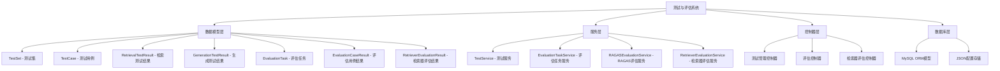

**图表来源**
- [backend/app/models/test.py](file://backend/app/models/test.py#L1-L227)
- [backend/app/models/evaluation.py](file://backend/app/models/evaluation.py#L1-L179)
- [backend/app/models/retriever_evaluation.py](file://backend/app/models/retriever_evaluation.py#L1-L60)

## 核心数据模型

系统采用Pydantic模型定义，继承自`BaseModelMixin`基类，提供统一的时间戳管理和序列化功能。

### 基础模型结构

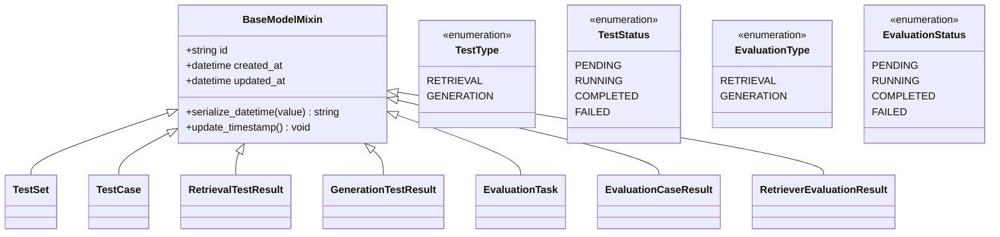

**图表来源**
- [backend/app/models/base.py](file://backend/app/models/base.py#L11-L31)
- [backend/app/models/test.py](file://backend/app/models/test.py#L12-L24)
- [backend/app/models/evaluation.py](file://backend/app/models/evaluation.py#L13-L25)

**章节来源**
- [backend/app/models/base.py](file://backend/app/models/base.py#L1-L31)
- [backend/app/models/test.py](file://backend/app/models/test.py#L12-L24)
- [backend/app/models/evaluation.py](file://backend/app/models/evaluation.py#L13-L25)

## 测试集模型

TestSet模型是测试体系的核心容器，负责管理测试配置快照和统计信息。

### 数据结构设计

TestSet模型包含以下核心字段：

| 字段名 | 类型 | 描述 | 必填 |
|--------|------|------|------|
| name | str | 测试集名称，长度1-100字符 | 是 |
| description | Optional[str] | 测试集描述，长度不超过500字符 | 否 |
| kb_id | str | 关联的知识库ID | 是 |
| test_type | TestType | 测试类型（检索/生成） | 是 |
| case_count | int | 测试用例数量，默认0 | 是 |
| kb_config | Dict[str, Any] | 知识库配置快照 | 是 |
| chunking_config | Dict[str, Any] | 分块策略配置 | 是 |
| embedding_config | Dict[str, Any] | 嵌入模型参数配置 | 是 |
| sparse_vector_config | Dict[str, Any] | 稀疏向量参数配置 | 是 |
| index_config | Dict[str, Any] | 索引配置 | 是 |

### 配置快照机制

系统通过配置快照确保测试环境的可重现性：

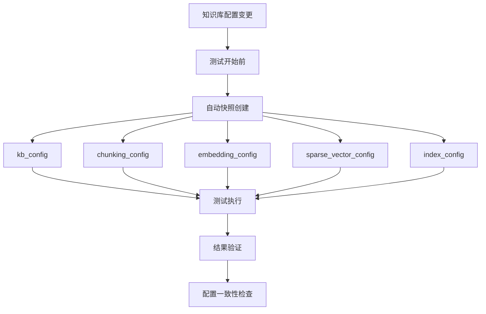

**图表来源**
- [backend/app/models/test.py](file://backend/app/models/test.py#L38-L58)

**章节来源**
- [backend/app/models/test.py](file://backend/app/models/test.py#L26-L81)

## 测试用例模型

TestCase模型定义了具体的测试场景，包含查询输入和期望输出。

### 查询输入设计

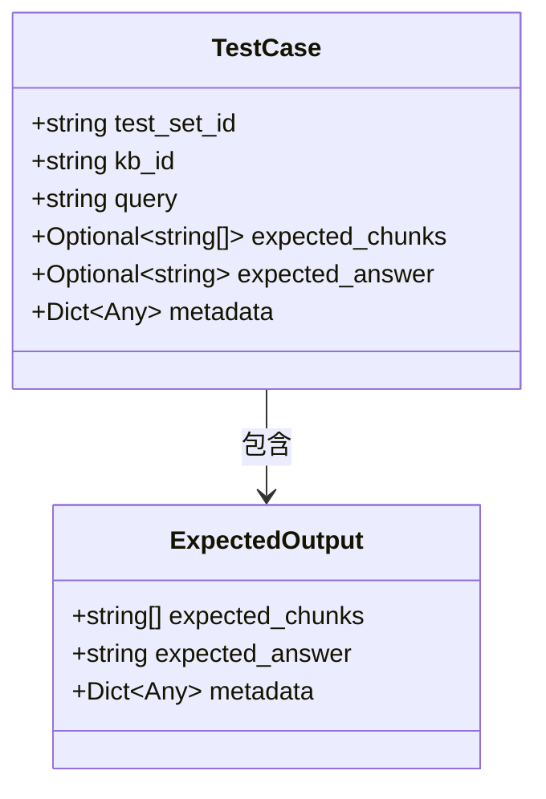

**图表来源**
- [backend/app/models/test.py](file://backend/app/models/test.py#L83-L113)

### 期望输出字段详解

| 字段 | 类型 | 描述 | 用途 |
|------|------|------|------|
| query | str | 测试问题/查询 | 检索测试的查询输入 |
| expected_chunks | Optional[List[str]] | 期望检索到的文档分块ID列表 | 检索测试的参考答案 |
| expected_answer | Optional[str] | 期望的答案 | 生成测试的参考答案 |
| metadata | Dict[str, Any] | 测试用例元数据 | 附加的测试信息 |

**章节来源**
- [backend/app/models/test.py](file://backend/app/models/test.py#L83-L113)

## 测试结果模型

系统针对不同测试类型提供专门的结果模型，包含详细的评估指标。

### 检索测试结果

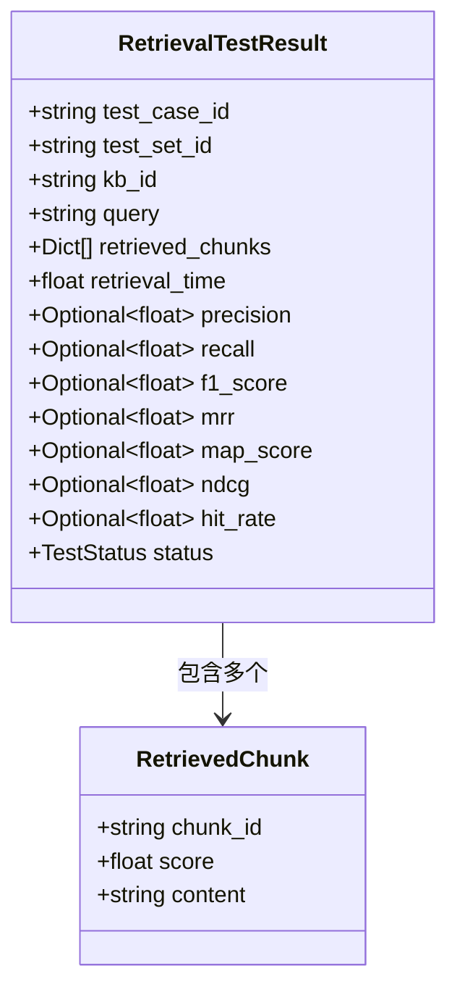

**图表来源**
- [backend/app/models/test.py](file://backend/app/models/test.py#L115-L162)

### 生成测试结果

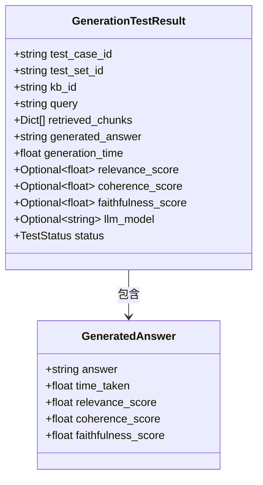

**图表来源**
- [backend/app/models/test.py](file://backend/app/models/test.py#L164-L227)

**章节来源**
- [backend/app/models/test.py](file://backend/app/models/test.py#L115-L227)

## 评估任务模型

EvaluationTask模型管理整个评估流程的状态和统计信息。

### 任务状态管理

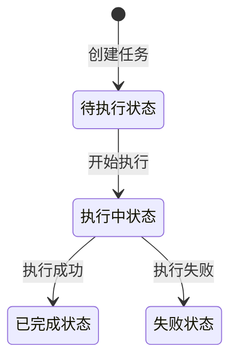

**图表来源**
- [backend/app/models/evaluation.py](file://backend/app/models/evaluation.py#L19-L25)

### 执行统计字段

| 字段名 | 类型 | 描述 |
|--------|------|------|
| total_cases | int | 总测试用例数 |
| completed_cases | int | 已完成用例数 |
| failed_cases | int | 失败用例数 |
| started_at | Optional[datetime] | 开始时间 |
| completed_at | Optional[datetime] | 完成时间 |

**章节来源**
- [backend/app/models/evaluation.py](file://backend/app/models/evaluation.py#L27-L68)

## 评估指标详解

系统集成了多种评估指标，涵盖检索质量和生成质量两个维度。

### 检索评估指标

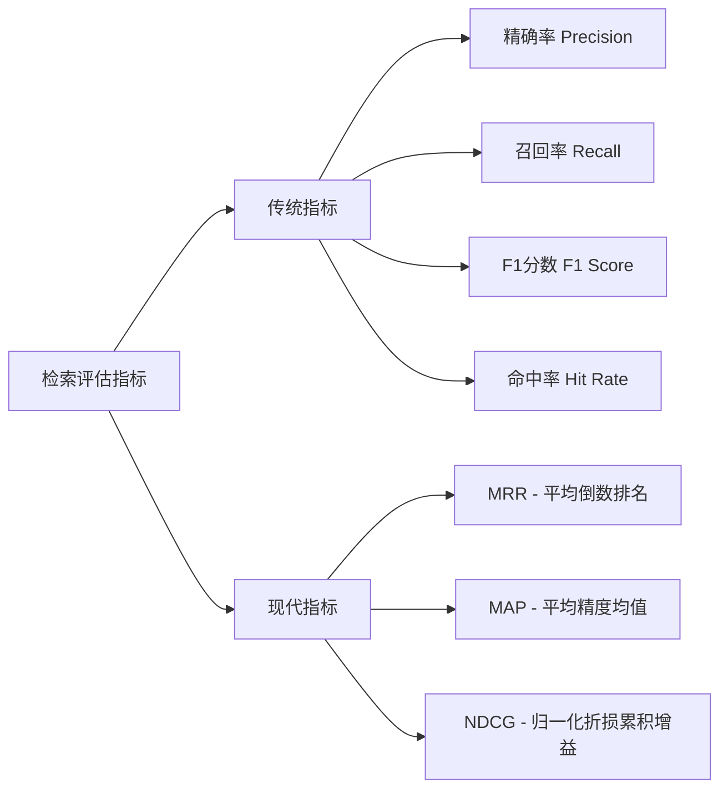

### 指标计算公式

| 指标 | 公式 | 取值范围 | 说明 |
|------|------|----------|------|
| Precision | | [0.0, 1.0] | 精确率，衡量检索结果的相关性 |
| Recall | | [0.0, 1.0] | 召回率，衡量检索结果的完整性 |
| F1 Score | 2 × (Precision × Recall) / (Precision + Recall) | [0.0, 1.0] | 精确率和召回率的调和平均 |
| MRR | 1 / rank_of_first_relevant_doc | [0.0, 1.0] | 平均倒数排名，考虑位置权重 |
| MAP | Σ(P@k × rel(k)) / num_relevant_docs | [0.0, 1.0] | 平均精度均值 |
| NDCG | DCG / IDCG | [0.0, 1.0] | 归一化折损累积增益 |
| Hit Rate | 是否至少有一个相关文档 | [0.0, 1.0] | 命中率，二分类指标 |

### 生成评估指标

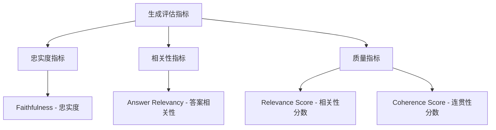

**章节来源**
- [backend/app/models/test.py](file://backend/app/models/test.py#L132-L140)
- [backend/app/models/test.py](file://backend/app/models/test.py#L184-L202)

## RAGAS指标集成

系统深度集成了RAGAS评估框架，提供更专业的RAG评估指标。

### RAGAS检索指标

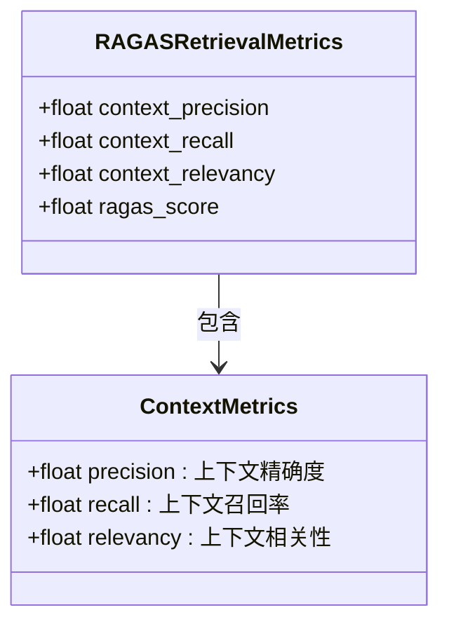

**图表来源**
- [backend/app/services/ragas_evaluation.py](file://backend/app/services/ragas_evaluation.py#L220-L370)

### RAGAS生成指标

| 指标 | 描述 | 计算方式 |
|------|------|----------|
| Faithfulness | 答案对上下文的忠实度 | 基于上下文验证答案的准确性 |
| Answer Relevancy | 答案与问题的相关性 | 评估答案是否回答了问题 |
| Answer Similarity | 答案相似度（可选） | 与参考答案的语义相似度 |
| Answer Correctness | 答案正确性（可选） | 基于参考答案的质量评估 |

### RAGAS评估流程

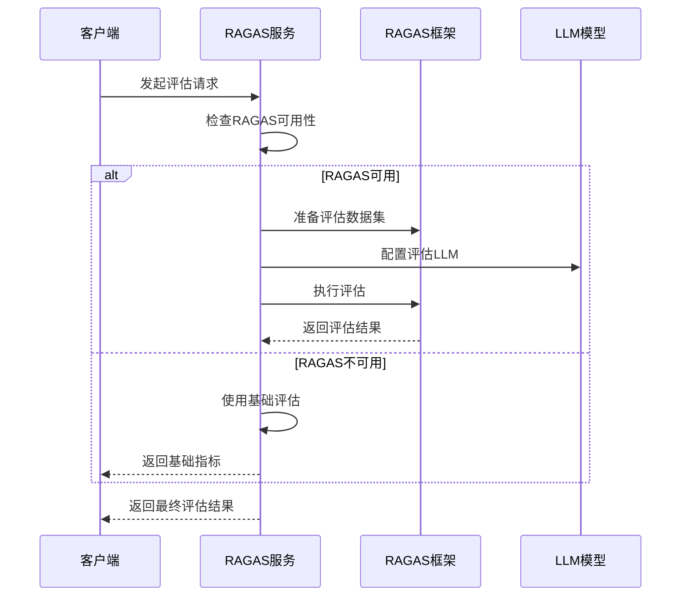

**图表来源**
- [backend/app/services/ragas_evaluation.py](file://backend/app/services/ragas_evaluation.py#L191-L598)

**章节来源**
- [backend/app/services/ragas_evaluation.py](file://backend/app/services/ragas_evaluation.py#L191-L598)

## 数据模型关系图

系统各模型间存在清晰的关联关系，形成了完整的测试评估闭环。

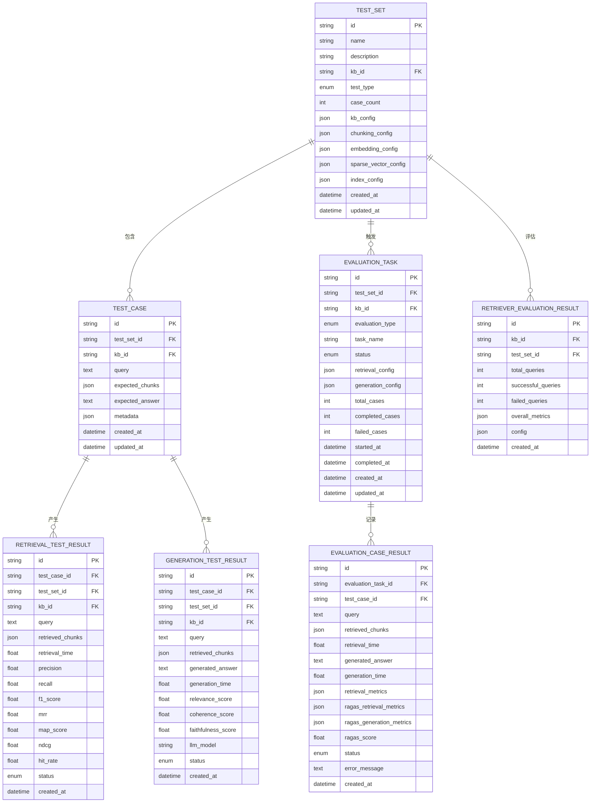

**图表来源**
- [backend/app/database/models.py](file://backend/app/database/models.py#L23-L127)

## 生命周期管理

测试与评估系统遵循严格的生命周期管理，确保数据的完整性和可追溯性。

### 测试生命周期

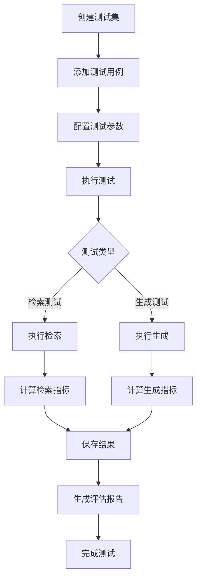

### 评估任务生命周期

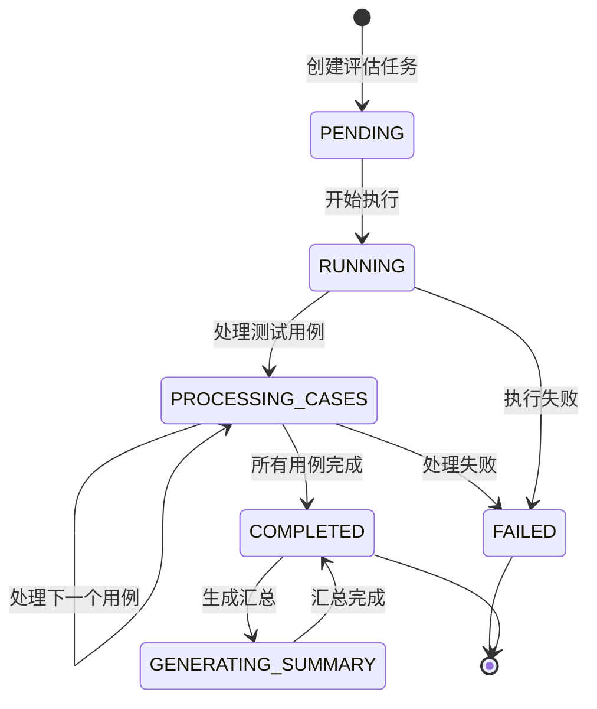

### 数据一致性保证

系统通过以下机制确保数据一致性：

1. **事务管理**：所有数据库操作都在事务中执行
2. **状态验证**：严格的状态转换验证
3. **配置快照**：测试开始前自动保存配置快照
4. **错误处理**：完善的错误捕获和恢复机制

**章节来源**
- [backend/app/services/evaluation_task.py](file://backend/app/services/evaluation_task.py#L26-L434)

## 总结

RAG Studio的测试与评估体系通过精心设计的数据模型，实现了完整的测试闭环管理。系统的主要特点包括：

### 核心优势

1. **模块化设计**：清晰分离测试、评估、结果等不同层面的功能
2. **标准化接口**：统一的模型定义和API接口
3. **可扩展性**：支持新的评估指标和测试类型
4. **可重现性**：通过配置快照确保测试环境一致性
5. **完整性**：覆盖检索和生成两种主要测试类型

### 技术特色

- **多指标评估**：结合传统指标和现代指标，提供全面的评估视角
- **RAGAS集成**：深度集成专业RAG评估框架
- **异步处理**：支持大规模测试任务的并发执行
- **容错机制**：完善的错误处理和恢复策略

### 应用价值

该测试与评估体系为企业级RAG应用提供了可靠的测试保障，帮助开发者：
- 验证检索和生成质量
- 对比不同配置的效果
- 持续监控系统性能
- 支持模型优化决策

通过这套完整的测试评估体系，用户可以建立科学的RAG系统质量保证流程，确保生产环境中的系统稳定性和可靠性。