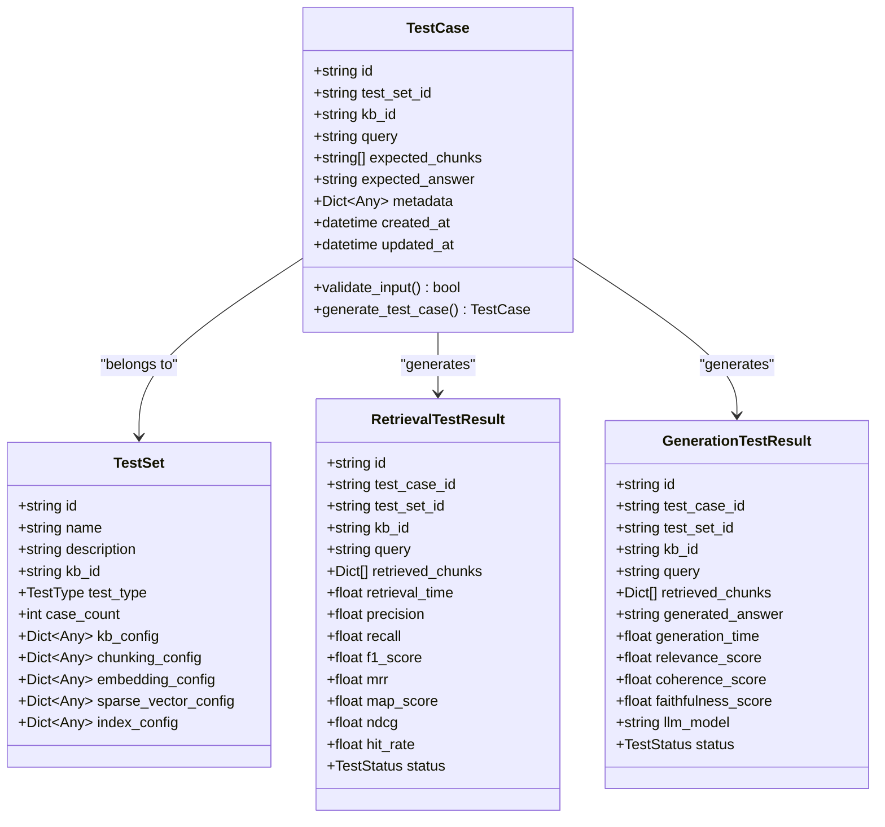
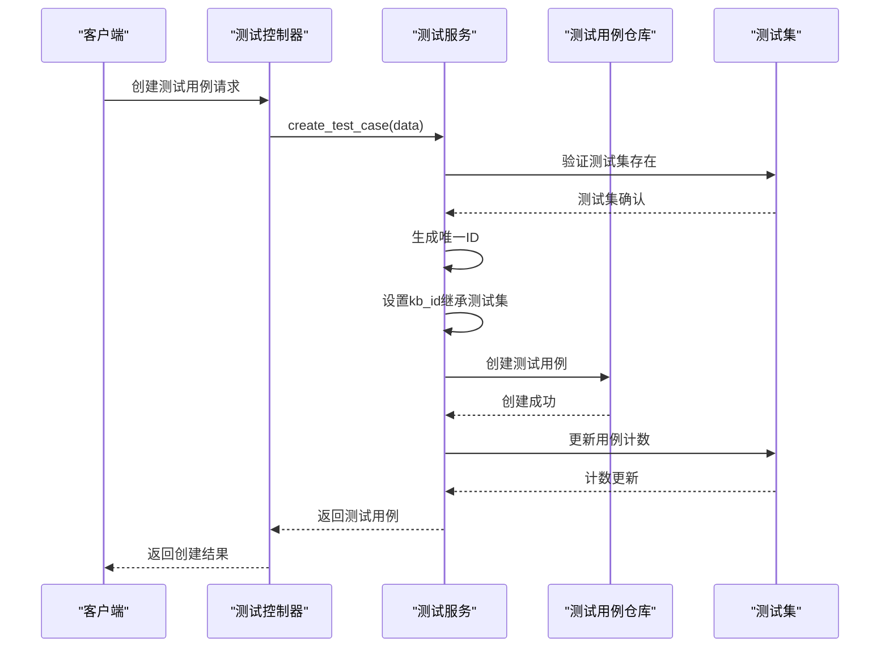
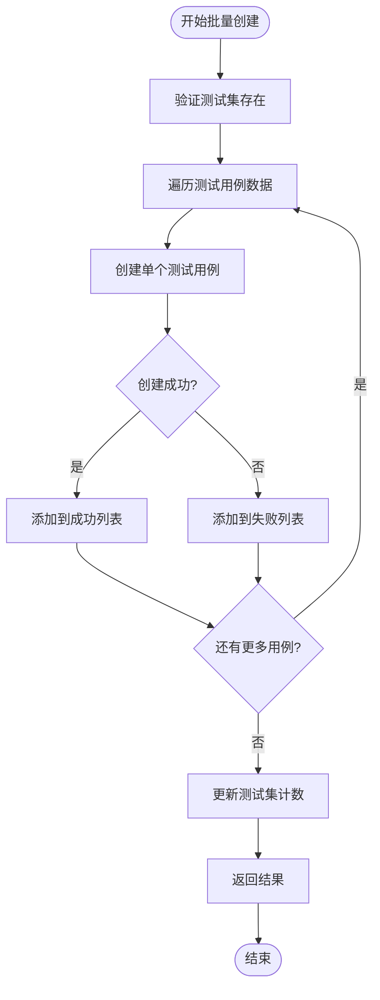
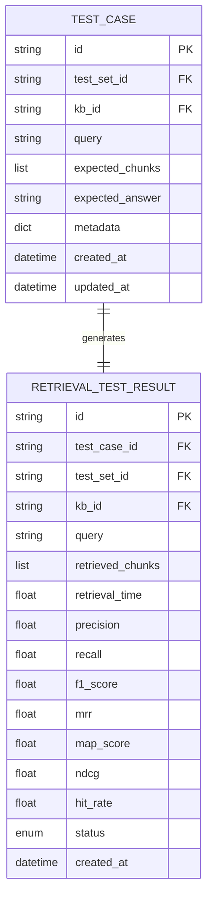
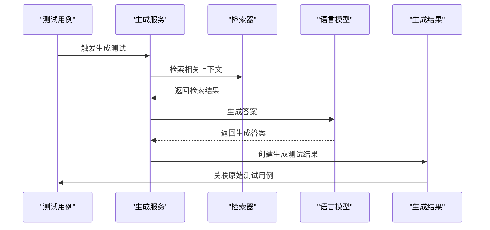
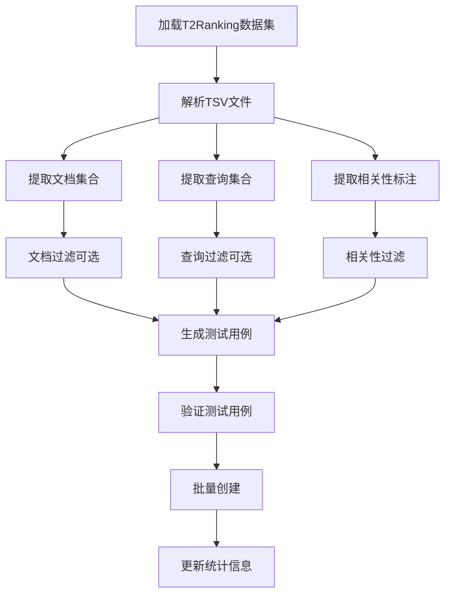
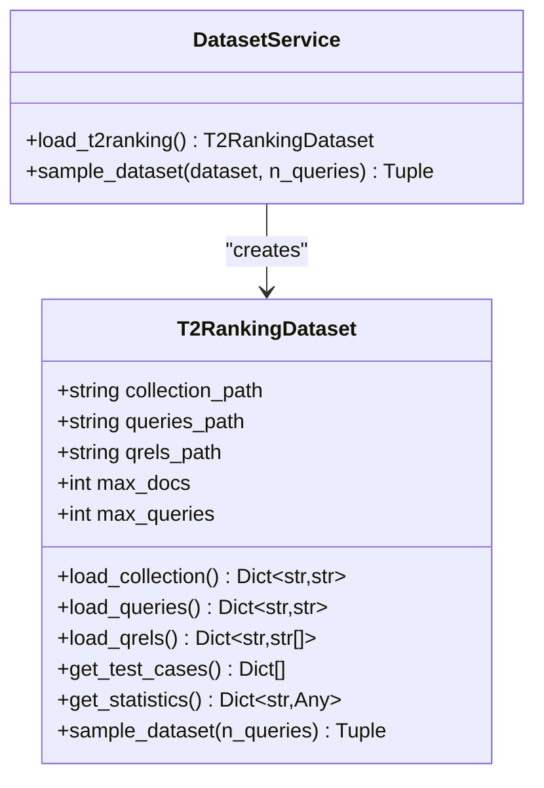
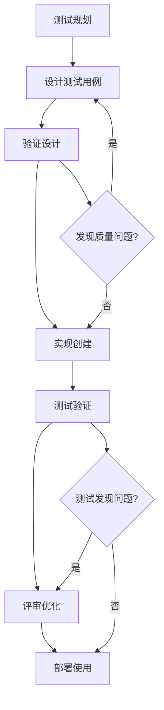

# 测试用例模型深度文档

<cite>
**本文档引用的文件**
- [test.py](file://backend/app/models/test.py)
- [test.py](file://backend/app/schemas/test.py)
- [test_service.py](file://backend/app/services/test_service.py)
- [test_management.py](file://backend/app/controllers/test_management.py)
- [dataset_loader.py](file://backend/app/services/dataset_loader.py)
- [retriever_evaluation.py](file://backend/app/services/retriever_evaluation.py)
- [example_t2ranking_usage.py](file://backend/example_t2ranking_usage.py)
- [base.py](file://backend/app/repositories/base.py)
</cite>

## 目录
1. [概述](#概述)
2. [TestCase模型核心结构](#testcase模型核心结构)
3. [字段详解与业务意义](#字段详解与业务意义)
4. [测试用例生命周期管理](#测试用例生命周期管理)
5. [与评估系统的集成](#与评估系统的集成)
6. [数据集加载与测试用例生成](#数据集加载与测试用例生成)
7. [最佳实践指南](#最佳实践指南)
8. [总结](#总结)

## 概述

TestCase模型是RAG Studio测试评估系统的核心数据结构，它定义了测试的基本单元，支撑着检索器评估和生成测试的完整流程。该模型不仅承载着测试的基本信息，还通过精心设计的字段结构实现了灵活的测试场景扩展和精确的评估标准定义。

TestCase模型采用标准化的数据结构，确保了测试用例的一致性和可重复性，同时通过metadata字段提供了强大的扩展能力，能够适应各种复杂的测试需求场景。

## TestCase模型核心结构

TestCase模型继承自BaseModelMixin，具备完整的ORM功能和数据验证能力：

**图表来源**
- [test.py](file://backend/app/models/test.py#L83-L113)
- [test.py](file://backend/app/models/test.py#L26-L81)
- [test.py](file://backend/app/models/test.py#L115-L162)
- [test.py](file://backend/app/models/test.py#L164-L227)

**章节来源**
- [test.py](file://backend/app/models/test.py#L83-L113)

## 字段详解与业务意义

### 核心字段设计

#### test_set_id：测试集归属标识
- **类型**：string
- **约束**：必填字段
- **业务意义**：明确测试用例所属的测试集，建立测试用例与测试集的关联关系
- **技术实现**：通过外键约束确保测试集的存在性验证

#### kb_id：知识库关联标识  
- **类型**：string
- **约束**：必填字段
- **业务意义**：标识测试用例所关联的知识库，确保测试环境的一致性
- **技术实现**：与知识库配置快照保持同步，支持动态配置变更

#### query：查询输入
- **类型**：string
- **约束**：必填，最小长度1字符
- **业务意义**：测试的核心输入，代表用户可能提出的查询问题
- **设计原则**：支持多种查询形式，从简单关键词到复杂自然语言问题

### 期望输出字段

#### expected_chunks：黄金标准分块
- **类型**：Optional[List[string]]
- **约束**：可选字段
- **业务意义**：定义检索测试中的黄金标准，标识哪些文档分块应该被检索到
- **应用场景**：
  - 检索准确性评估
  - 分块粒度验证
  - 上下文完整性检查

#### expected_answer：参考答案
- **类型**：Optional[string]
- **约束**：可选字段
- **业务意义**：生成测试中的参考答案，用于评估生成质量
- **价值**：提供客观的质量基准，支持自动化评估

### metadata：扩展属性容器
- **类型**：Dict[Any, Any]
- **约束**：默认为空字典
- **业务意义**：提供灵活的扩展机制，支持各种测试场景的特殊需求
- **典型用途**：
  - 测试分类标签
  - 权重配置
  - 特殊测试标记
  - 场景特定参数

**章节来源**
- [test.py](file://backend/app/models/test.py#L83-L113)
- [test.py](file://backend/app/schemas/test.py#L70-L101)

## 测试用例生命周期管理

### 创建阶段

测试用例的创建过程遵循严格的验证流程：

**图表来源**
- [test_service.py](file://backend/app/services/test_service.py#L144-L166)
- [test_management.py](file://backend/app/controllers/test_management.py#L243-L268)

### 批量创建机制

系统支持高效的批量测试用例创建，特别适用于数据集导入场景：

**图表来源**
- [test_service.py](file://backend/app/services/test_service.py#L167-L222)

### 更新与维护

测试用例支持灵活的更新操作，包括：

- **字段更新**：修改查询内容、期望输出等
- **元数据管理**：动态添加或修改扩展属性
- **状态跟踪**：记录测试用例的变更历史

**章节来源**
- [test_service.py](file://backend/app/services/test_service.py#L144-L269)
- [test_management.py](file://backend/app/controllers/test_management.py#L243-L422)

## 与评估系统的集成

### 检索测试结果映射

TestCase模型与RetrievalTestResult之间建立了清晰的数据映射关系：

**图表来源**
- [test.py](file://backend/app/models/test.py#L83-L113)
- [test.py](file://backend/app/models/test.py#L115-L162)

### 生成测试结果关联

生成测试场景中，TestCase同样作为核心输入源：

**图表来源**
- [test.py](file://backend/app/models/test.py#L164-L227)
- [retriever_evaluation.py](file://backend/app/services/retriever_evaluation.py#L334-L423)

### 评估指标计算

测试用例为评估指标计算提供了必要的基准数据：

| 评估指标 | 计算依据 | 业务价值 |
|---------|---------|---------|
| Precision | expected_chunks ∩ retrieved_chunks / retrieved_chunks | 衡量检索的精确性 |
| Recall | expected_chunks ∩ retrieved_chunks / expected_chunks | 衡量检索的完整性 |
| F1-Score | 2 × (Precision × Recall) / (Precision + Recall) | 平衡精确率和召回率 |
| MRR | 1 / rank_of_first_relevant_doc | 考虑检索结果排序质量 |
| NDCG | DCG / IDCG | 归一化的排序质量评估 |

**章节来源**
- [retriever_evaluation.py](file://backend/app/services/retriever_evaluation.py#L379-L423)

## 数据集加载与测试用例生成

### T2Ranking数据集集成

系统通过DatasetService支持T2Ranking等标准数据集的导入：

**图表来源**
- [dataset_loader.py](file://backend/app/services/dataset_loader.py#L14-L261)
- [example_t2ranking_usage.py](file://backend/example_t2ranking_usage.py#L17-L45)

### 数据集统计与采样

系统提供智能的数据集统计和采样功能：

**图表来源**
- [dataset_loader.py](file://backend/app/services/dataset_loader.py#L14-L261)

### 自动化测试用例生成

基于数据集内容，系统能够自动生成高质量的测试用例：

| 输入文件 | 输出测试用例字段 | 数据处理方式 |
|---------|----------------|-------------|
| collection.tsv | doc_id, doc_text | 直接映射为文档内容 |
| queries.tsv | query_id, query_text | 转换为测试查询 |
| qrels.tsv | relevant_doc_ids | 过滤相关文档ID |
| 组合结果 | expected_chunks | 文档ID列表 |

**章节来源**
- [dataset_loader.py](file://backend/app/services/dataset_loader.py#L140-L191)
- [example_t2ranking_usage.py](file://backend/example_t2ranking_usage.py#L17-L45)

## 最佳实践指南

### 测试用例设计原则

#### 1. 查询质量优化
- **清晰性**：确保查询语句表达明确的意图
- **多样性**：覆盖不同的查询模式和复杂度
- **代表性**：反映真实用户的查询行为

#### 2. 期望输出标注
- **准确性**：确保expected_chunks和expected_answer的正确性
- **完整性**：涵盖所有相关的内容片段
- **一致性**：保持标注标准的一致性

#### 3. 元数据使用规范
- **结构化**：使用标准化的键值对
- **可扩展性**：预留足够的扩展空间
- **文档化**：记录自定义字段的含义

### 高质量测试用例创建流程

### 维护与更新策略

#### 1. 定期审查机制
- **周期性检查**：定期验证测试用例的有效性
- **性能监控**：跟踪测试用例的执行效果
- **反馈循环**：基于实际使用情况优化

#### 2. 版本管理
- **变更追踪**：记录测试用例的修改历史
- **兼容性保证**：确保向后兼容性
- **回滚机制**：支持版本回退

#### 3. 质量保证
- **自动化验证**：建立测试用例的自动化验证流程
- **人工审核**：关键测试用例的人工复核
- **持续改进**：基于评估结果不断优化

### 性能优化建议

#### 1. 批量操作优化
- **批量创建**：使用批量API减少网络开销
- **事务处理**：确保批量操作的一致性
- **错误处理**：优雅处理部分失败的情况

#### 2. 存储优化
- **索引策略**：合理设计数据库索引
- **缓存机制**：缓存频繁访问的测试用例
- **压缩存储**：对大型测试用例进行压缩

#### 3. 查询优化
- **分页处理**：避免一次性加载过多数据
- **过滤优化**：使用适当的过滤条件
- **并发控制**：合理控制并发访问

**章节来源**
- [test_service.py](file://backend/app/services/test_service.py#L167-L222)
- [test_management.py](file://backend/app/controllers/test_management.py#L243-L422)

## 总结

TestCase模型作为RAG Studio测试评估系统的核心组件，展现了优秀的架构设计和实用性。通过精心设计的字段结构，它不仅满足了基本的测试需求，还提供了强大的扩展能力，支持各种复杂的测试场景。

模型的关键优势包括：

1. **标准化设计**：统一的数据结构确保了系统的可预测性和可维护性
2. **灵活扩展**：metadata字段提供了无限的扩展可能性
3. **完整集成**：与评估系统、数据集加载等功能无缝集成
4. **质量保证**：完善的验证和错误处理机制
5. **性能优化**：支持批量操作和高效的数据处理

通过遵循本文档提供的最佳实践指南，开发者可以创建高质量的测试用例，构建可靠的评估系统，为RAG应用的质量保障提供坚实的基础。TestCase模型的设计理念和实现方式，为类似系统的开发提供了宝贵的参考价值。