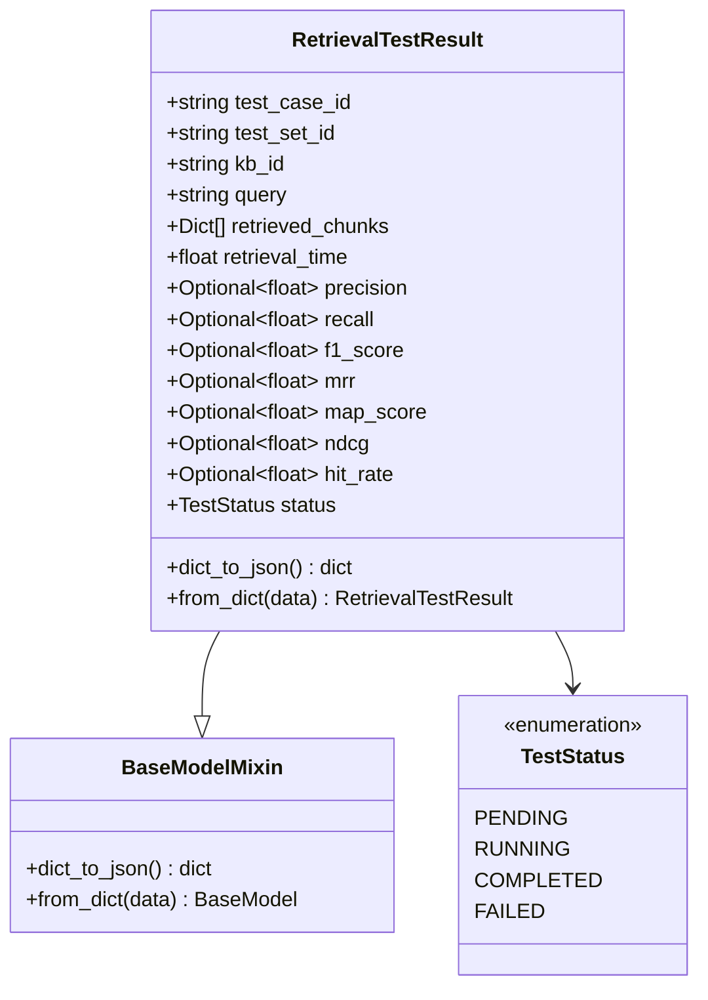
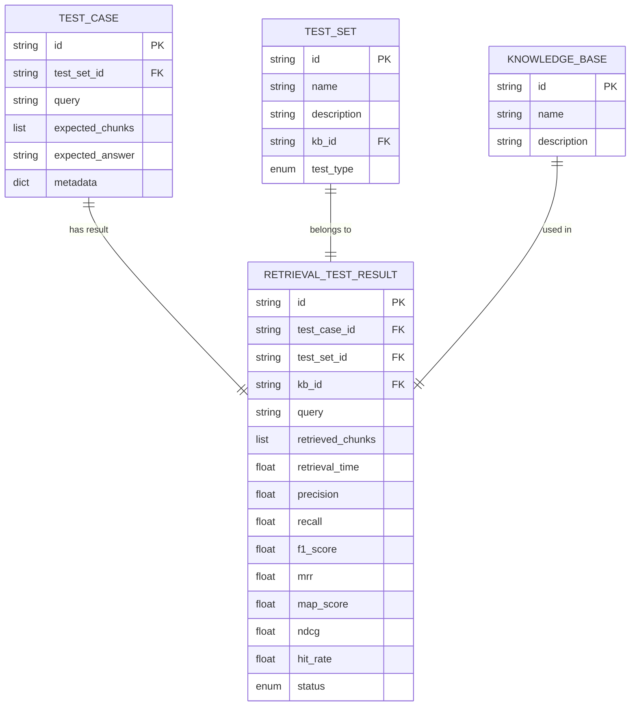
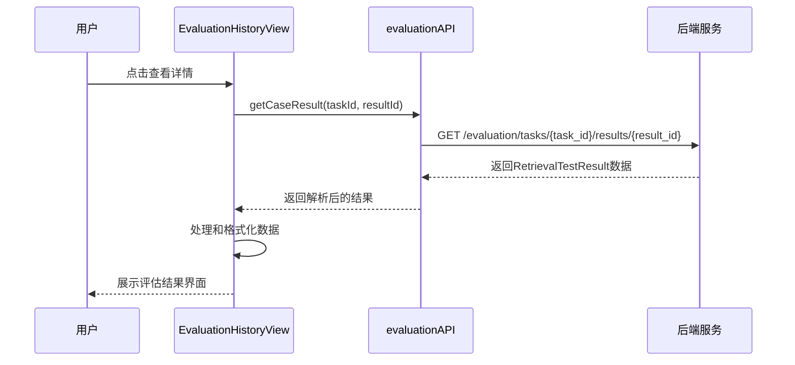

# 检索测试结果模型

<cite>
**本文档引用的文件**
- [retriever_evaluation.py](file://backend/app/models/retriever_evaluation.py)
- [test.py](file://backend/app/schemas/test.py)
- [evaluation.py](file://backend/app/controllers/evaluation.py)
- [evaluation-history.tsx](file://web/components/views/evaluation-history.tsx)
- [api.ts](file://web/lib/api.ts)
- [retriever_evaluation.py](file://backend/app/services/retriever_evaluation.py)
- [evaluation_task.py](file://backend/app/services/evaluation_task.py)
</cite>

## 目录
1. [简介](#简介)
2. [模型结构分析](#模型结构分析)
3. [核心字段详解](#核心字段详解)
4. [评估指标体系](#评估指标体系)
5. [性能监控机制](#性能监控机制)
6. [关联关系设计](#关联关系设计)
7. [前端展示逻辑](#前端展示逻辑)
8. [实际应用示例](#实际应用示例)
9. [性能优化建议](#性能优化建议)
10. [总结](#总结)

## 简介

RetrievalTestResult模型是RAG Studio检索器评估系统的核心数据结构，专门用于记录和存储单个检索测试用例的完整评估结果。该模型不仅包含了检索过程的基本信息，还整合了多种评估指标，为系统提供了全面的性能分析能力。

## 模型结构分析

RetrievalTestResult模型采用Pydantic验证框架构建，确保数据的完整性和一致性。模型继承自BaseModelMixin，具备序列化和反序列化能力。



**图表来源**
- [test.py](file://backend/app/models/test.py#L115-L146)

**章节来源**
- [test.py](file://backend/app/models/test.py#L115-L146)

## 核心字段详解

### 基础标识字段

#### test_case_id
- **类型**: string
- **描述**: 测试用例唯一标识符，用于关联具体的测试场景
- **用途**: 支持单个测试用例的独立查询和分析
- **示例**: `"tc_001"`

#### test_set_id
- **类型**: string
- **描述**: 测试集标识符，表示该测试用例所属的测试集合
- **用途**: 支持按测试集维度进行结果聚合分析
- **示例**: `"ts_001"`

#### kb_id
- **类型**: string
- **描述**: 知识库标识符，关联到具体的向量数据库实例
- **用途**: 支持多知识库环境下的结果隔离和对比
- **示例**: `"kb_001"`

### 检索过程信息

#### query
- **类型**: string
- **描述**: 用户原始查询文本
- **用途**: 作为检索结果的输入基准
- **示例**: `"Python中如何定义一个类？"`

#### retrieved_chunks
- **类型**: List[Dict[str, Any]]
- **描述**: 检索到的文档分块列表，包含分块ID和相似度分数
- **结构**: 
  ```json
  [
      {"chunk_id": "chunk_010", "score": 0.95},
      {"chunk_id": "chunk_011", "score": 0.88}
  ]
  ```
- **用途**: 记录检索系统的输出结果，支持后续分析和可视化

#### retrieval_time
- **类型**: float
- **描述**: 检索操作耗时（秒）
- **用途**: 性能监控和优化参考
- **示例**: `0.15`

**章节来源**
- [test.py](file://backend/app/models/test.py#L115-L146)

## 评估指标体系

### 精确率 (Precision)
精确率衡量检索结果中相关文档的比例，反映检索结果的准确性。

**计算公式**:
```
Precision = |检索到的相关文档| / |检索到的文档总数|
```

**业务含义**:
- 值越高，表示检索结果越准确
- 在信息过载场景下尤为重要
- 影响用户体验和系统效率

### 召回率 (Recall)
召回率衡量系统发现相关文档的能力，反映检索系统的完整性。

**计算公式**:
```
Recall = |检索到的相关文档| / |所有相关文档总数|
```

**业务含义**:
- 值越高，表示系统发现相关文档的能力越强
- 在信息检索场景下至关重要
- 平衡精确率和召回率是检索系统设计的核心挑战

### F1分数 (F1 Score)
F1分数是精确率和召回率的调和平均值，提供单一指标评估。

**计算公式**:
```
F1 = 2 * (Precision * Recall) / (Precision + Recall)
```

**业务含义**:
- 兼顾精确率和召回率的平衡
- 适用于需要综合评估的场景
- 避免单一指标可能带来的误导

### 平均倒数排名 (MRR)
MRR评估首个相关结果的位置，反映检索排序质量。

**计算公式**:
```
MRR = 1 / rank_of_first_relevant_doc
```

**业务含义**:
- 排名越靠前，MRR值越高
- 重视首次点击体验的场景
- 对排序算法效果有直接反映

### 平均精度均值 (MAP)
MAP关注整个排序列表的质量，提供全局评估视角。

**计算公式**:
```
MAP = (sum of P@k for each relevant doc) / |relevant docs|
```

**业务含义**:
- 考虑所有相关文档的排序位置
- 适合需要全面评估的场景
- 对排序算法的整体效果有全面反映

### 归一化折损累积增益 (NDCG)
NDCG体现结果排序的合理性，考虑不同位置的重要性。

**计算公式**:
```
DCG = sum(rel_i / log2(i+1)) for i in top_k
IDCG = 最佳排序下的DCG
NDCG = DCG / IDCG
```

**业务含义**:
- 考虑位置权重的排序质量指标
- 更符合人类判断偏好的排序评估
- 适合对排序质量要求较高的场景

### 命中率 (Hit Rate)
命中率表示至少检索到一个相关结果的比例。

**计算公式**:
```
Hit Rate = 1 if 至少有一个相关文档被检索到, 0 otherwise
```

**业务含义**:
- 衡量系统的基本检索能力
- 关注能否找到相关结果
- 适合对检索可用性要求严格的场景

**章节来源**
- [retriever_evaluation.py](file://backend/app/services/retriever_evaluation.py#L63-L110)

## 性能监控机制

### retrieval_time的作用

retrieval_time字段在性能评估中发挥多重作用：

1. **实时性能监控**
   - 实时跟踪检索操作的响应时间
   - 支持性能趋势分析
   - 为系统优化提供量化依据

2. **容量规划参考**
   - 基于历史数据预测系统负载
   - 支持资源分配决策
   - 优化系统扩展策略

3. **用户体验评估**
   - 与用户感知速度直接相关
   - 支持SLA（服务等级协议）监控
   - 为性能优化提供方向

4. **成本效益分析**
   - 计算单位时间内的检索成本
   - 支持资源使用效率评估
   - 为技术选型提供依据

**章节来源**
- [test.py](file://backend/app/models/test.py#L130)

## 关联关系设计

### 与测试用例的关系

RetrievalTestResult通过test_case_id字段与TestCase建立一对一关联：



**图表来源**
- [test.py](file://backend/app/models/test.py#L70-L110)
- [test.py](file://backend/app/models/test.py#L115-L146)

### 与测试集的关系

通过test_set_id字段建立与TestSet的一对多关系，支持：
- 按测试集维度进行结果聚合
- 测试集级别的性能对比
- 不同测试集间的评估结果比较

### 与知识库的关系

通过kb_id字段建立与KnowledgeBase的一对多关系，支持：
- 多知识库环境下的结果隔离
- 不同配置下的性能对比
- 知识库级别的评估报告

**章节来源**
- [test.py](file://backend/app/models/test.py#L70-L110)

## 前端展示逻辑

### evaluation-history.tsx组件解析

前端组件通过以下方式解析和展示检索测试结果：

#### 数据获取流程



**图表来源**
- [evaluation-history.tsx](file://web/components/views/evaluation-history.tsx#L102-L112)
- [evaluation.py](file://backend/app/controllers/evaluation.py#L292-L318)

#### 结果展示结构

前端组件按照以下层次展示评估结果：

1. **基本信息展示**
   - 查询内容显示
   - 检索耗时信息
   - 测试状态指示

2. **评估指标展示**
   - 基础检索指标网格
   - RAGAS指标对比
   - 综合评分显示

3. **详细结果展示**
   - 检索到的分块列表
   - 相似度分数可视化
   - 错误信息展示

#### 数据处理逻辑

前端组件实现了以下数据处理功能：

```typescript
// 数据格式化示例
const formattedResults = {
  query: result.query,
  retrievalTime: result.retrieval_time,
  metrics: {
    precision: result.retrieval_metrics?.precision,
    recall: result.retrieval_metrics?.recall,
    f1Score: result.retrieval_metrics?.f1_score
  },
  chunks: result.retrieved_chunks.map(chunk => ({
    id: chunk.chunk_id,
    score: chunk.score,
    contentPreview: truncateContent(chunk.content)
  }))
};
```

**章节来源**
- [evaluation-history.tsx](file://web/components/views/evaluation-history.tsx#L102-L112)
- [api.ts](file://web/lib/api.ts#L703-L719)

## 实际应用示例

### JSON数据示例

以下是典型的RetrievalTestResult JSON响应格式：

```json
{
  "id": "rtr_001",
  "test_case_id": "tc_001",
  "test_set_id": "ts_001",
  "kb_id": "kb_001",
  "query": "Python中如何定义一个类？",
  "retrieved_chunks": [
    {
      "chunk_id": "chunk_010",
      "score": 0.95,
      "content": "在Python中，使用class关键字定义类..."
    },
    {
      "chunk_id": "chunk_011",
      "score": 0.88,
      "content": "类的定义语法：class ClassName:"
    }
  ],
  "retrieval_time": 0.15,
  "precision": 0.9,
  "recall": 0.85,
  "f1_score": 0.87,
  "mrr": 0.92,
  "map_score": 0.88,
  "ndcg": 0.91,
  "hit_rate": 1.0,
  "status": "completed"
}
```

### 评估指标应用场景

不同评估指标在实际应用中的使用场景：

| 指标 | 应用场景 | 优化重点 |
|------|----------|----------|
| Precision | 电商搜索推荐 | 减少无关商品展示 |
| Recall | 医疗诊断辅助 | 确保不遗漏重要信息 |
| F1 Score | 法律案例检索 | 平衡准确性和完整性 |
| MRR | 新闻聚合系统 | 提升首位内容质量 |
| MAP | 学术论文检索 | 优化整体排序效果 |
| NDCG | 视频推荐系统 | 符合用户观看习惯 |
| Hit Rate | 客服问答系统 | 确保能回答用户问题 |

**章节来源**
- [test.py](file://backend/app/models/test.py#L146-L161)

## 性能优化建议

### 检索性能优化

1. **retrieval_time优化策略**
   - 使用高效的向量数据库索引
   - 优化嵌入模型推理速度
   - 实施缓存机制减少重复计算
   - 调整top_k参数平衡质量和速度

2. **内存使用优化**
   - 实施分页加载大量检索结果
   - 使用流式处理减少内存占用
   - 及时清理临时数据结构

3. **并发处理优化**
   - 实施异步检索处理
   - 使用连接池管理数据库连接
   - 实施合理的超时控制

### 评估指标优化

1. **指标计算优化**
   - 实施增量计算避免重复计算
   - 使用近似算法处理大规模数据
   - 实施指标缓存机制

2. **可视化优化**
   - 实施虚拟滚动处理大量结果
   - 使用Web Workers进行后台计算
   - 实施懒加载减少初始渲染时间

### 数据存储优化

1. **数据库优化**
   - 为常用查询字段建立索引
   - 实施数据分区策略
   - 定期清理历史数据

2. **缓存策略**
   - 缓存频繁访问的评估结果
   - 实施多级缓存架构
   - 设置合理的缓存过期策略

**章节来源**
- [retriever_evaluation.py](file://backend/app/services/retriever_evaluation.py#L241-L259)

## 总结

RetrievalTestResult模型作为RAG Studio检索器评估系统的核心组件，通过精心设计的数据结构和评估指标体系，为系统提供了全面的性能监控和分析能力。该模型不仅支持单个测试用例的详细分析，还能支撑大规模评估任务的管理和优化。

### 关键特性总结

1. **完整性**: 涵盖检索过程的各个方面，从输入到输出再到评估
2. **准确性**: 提供多种评估指标，满足不同场景的分析需求
3. **可扩展性**: 支持与测试用例、测试集、知识库的灵活关联
4. **实用性**: 为前端展示和性能优化提供丰富数据支持

### 发展方向

随着RAG系统的发展，RetrievalTestResult模型可以在以下方面进一步完善：

1. **指标扩展**: 添加更多专业领域的评估指标
2. **实时分析**: 支持实时性能监控和告警
3. **智能优化**: 基于历史数据提供自动优化建议
4. **可视化增强**: 提供更丰富的数据可视化选项

通过持续优化和完善RetrievalTestResult模型，可以为RAG系统的性能提升和用户体验改善提供更强有力的支持。