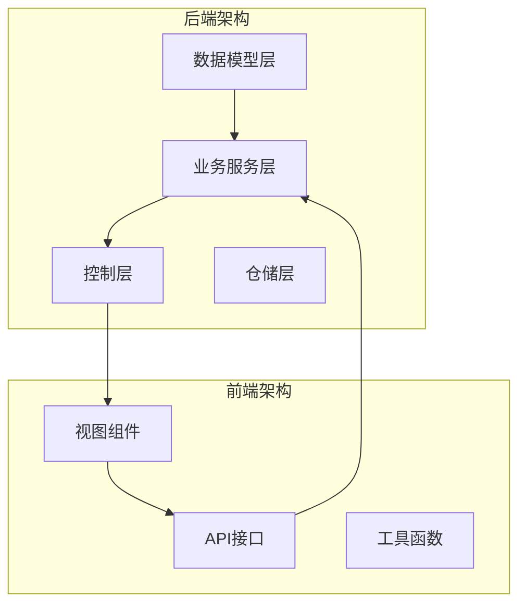
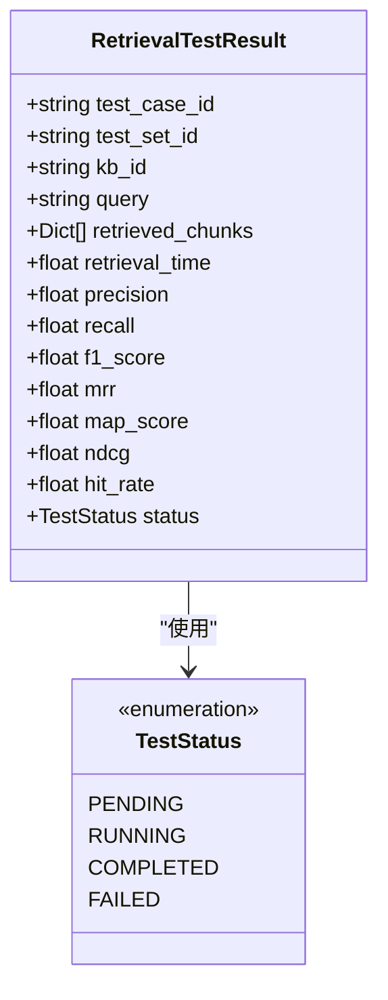
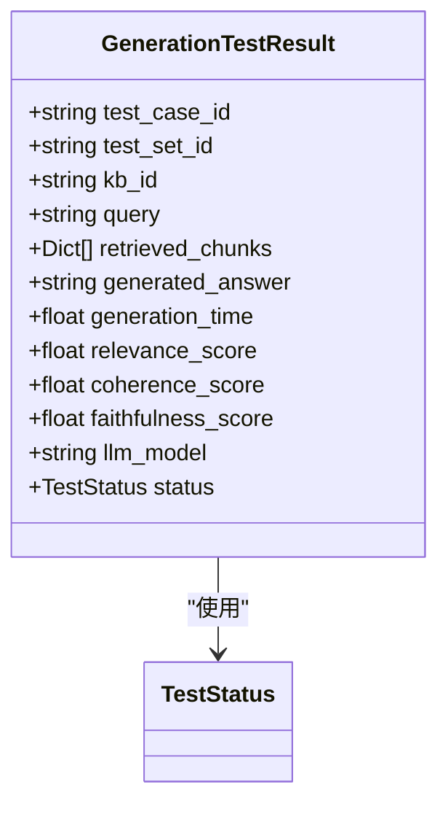
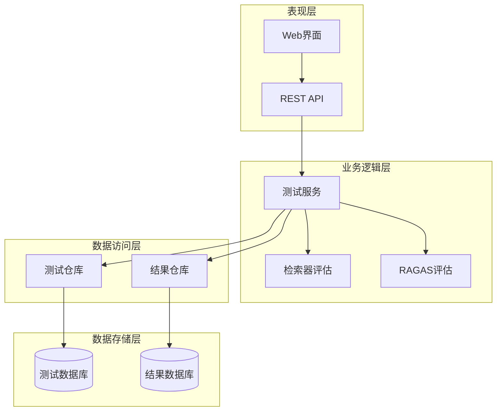
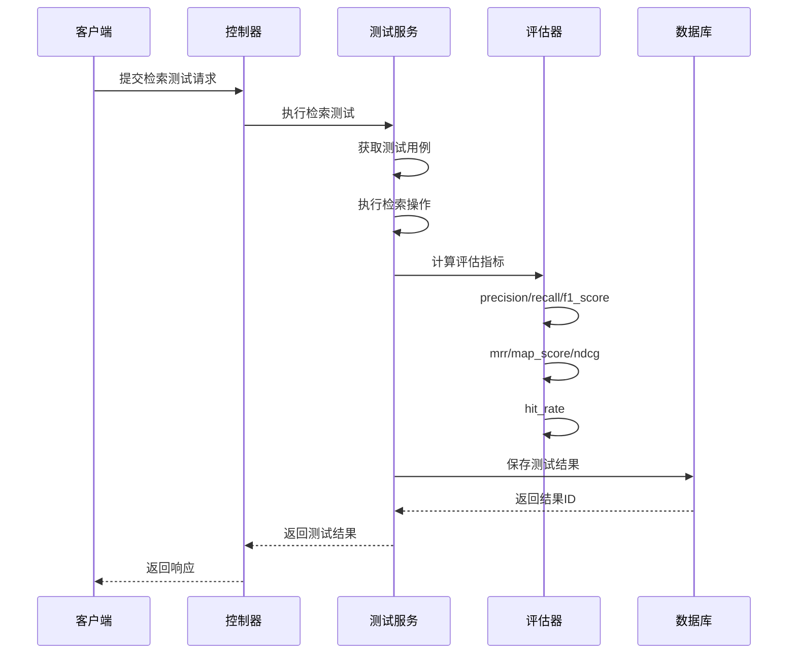
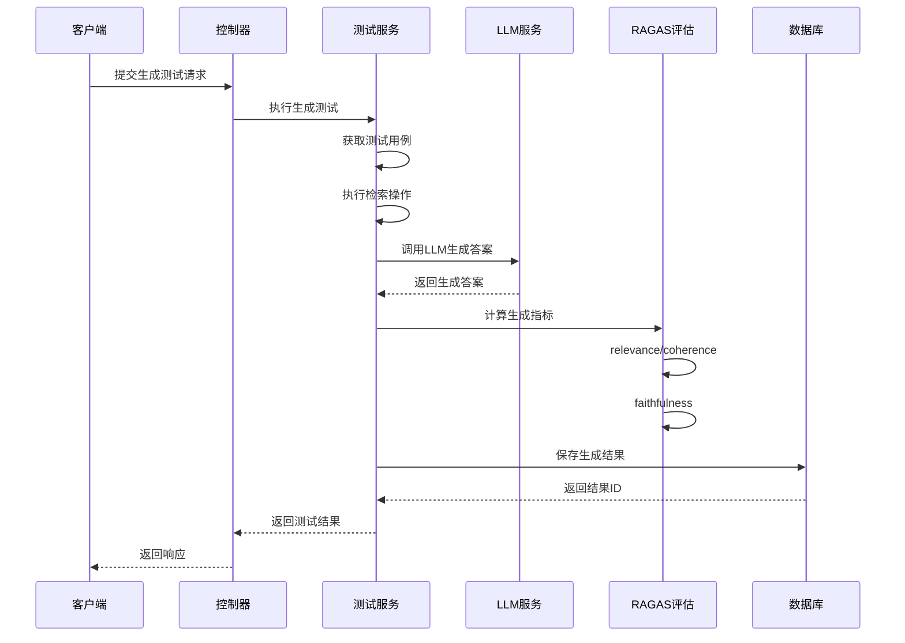
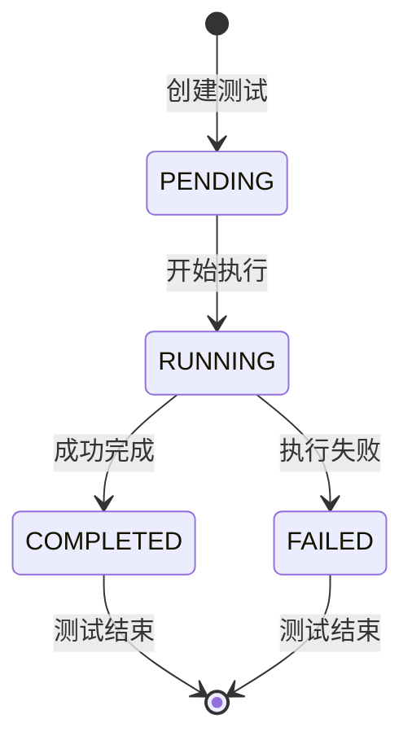
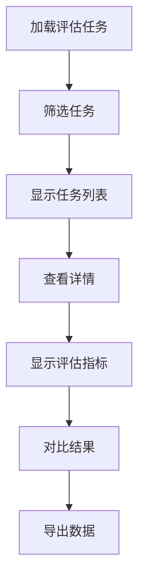

# 测试结果模型综合文档

<cite>
**本文档引用的文件**
- [test.py](file://backend/app/models/test.py)
- [retriever_evaluation.py](file://backend/app/models/retriever_evaluation.py)
- [test.py](file://backend/app/schemas/test.py)
- [test_service.py](file://backend/app/services/test_service.py)
- [test_management.py](file://backend/app/controllers/test_management.py)
- [evaluation-history.tsx](file://web/components/views/evaluation-history.tsx)
- [retriever_evaluation.py](file://backend/app/services/retriever_evaluation.py)
- [ragas_evaluation.py](file://backend/app/services/ragas_evaluation.py)
</cite>

## 目录
1. [概述](#概述)
2. [项目结构](#项目结构)
3. [核心数据模型](#核心数据模型)
4. [架构概览](#架构概览)
5. [详细组件分析](#详细组件分析)
6. [评估指标详解](#评估指标详解)
7. [状态机管理](#状态机管理)
8. [前端消费与可视化](#前端消费与可视化)
9. [性能优化建议](#性能优化建议)
10. [故障排除指南](#故障排除指南)
11. [结论](#结论)

## 概述

RAG Studio的测试结果模型是一个全面的评估系统，专门设计用于评估检索器和生成器的质量。该系统通过两个主要的数据模型——`RetrievalTestResult`和`GenerationTestResult`——提供了详细的评估指标和状态跟踪功能。

### 主要特性

- **双模式评估**：支持检索测试和生成测试两种评估模式
- **多维度指标**：提供精确率、召回率、F1分数等传统指标，以及相关性、连贯性、忠实度等高级指标
- **状态管理**：完整的测试生命周期状态跟踪
- **可视化支持**：前端提供丰富的评估结果可视化界面
- **扩展性**：支持RAGAS框架集成，提供更专业的评估指标

## 项目结构



**图表来源**
- [test.py](file://backend/app/models/test.py#L1-L227)
- [test_service.py](file://backend/app/services/test_service.py#L1-L374)
- [test_management.py](file://backend/app/controllers/test_management.py#L1-L534)

**章节来源**
- [test.py](file://backend/app/models/test.py#L1-L227)
- [test_service.py](file://backend/app/services/test_service.py#L1-L374)

## 核心数据模型

### RetrievalTestResult模型

`RetrievalTestResult`模型专门用于存储检索测试的结果，包含了检索过程的所有关键信息和评估指标。



**图表来源**
- [test.py](file://backend/app/models/test.py#L115-L162)

#### 核心字段说明

| 字段名 | 类型 | 描述 | 业务意义 |
|--------|------|------|----------|
| `retrieved_chunks` | List[Dict] | 检索到的文档分块列表 | 包含chunk_id和score，反映检索结果的质量和排序 |
| `retrieval_time` | float | 检索耗时（秒） | 性能指标，影响用户体验 |
| `precision` | float | 精确率 | 检索结果中有多少是相关的 |
| `recall` | float | 召回率 | 检索到了多少相关文档 |
| `f1_score` | float | F1分数 | 精确率和召回率的调和平均 |
| `mrr` | float | 平均倒数排名 | 第一个相关文档的位置权重 |
| `map_score` | float | 平均精度均值 | 各个相关文档位置的平均精度 |
| `ndcg` | float | 归一化折损累积增益 | 考虑位置的排序质量指标 |
| `hit_rate` | float | 命中率 | 是否至少检索到一个相关文档 |

### GenerationTestResult模型

`GenerationTestResult`模型专注于生成测试，不仅包含生成答案本身，还提供了生成过程的详细评估指标。



**图表来源**
- [test.py](file://backend/app/models/test.py#L164-L226)

#### 生成指标详解

| 指标名 | 取值范围 | 业务含义 | 评估重点 |
|--------|----------|----------|----------|
| `relevance_score` | 0.0-1.0 | 相关性分数 | 生成答案与查询的相关程度 |
| `coherence_score` | 0.0-1.0 | 连贯性分数 | 答案内部逻辑的一致性 |
| `faithfulness_score` | 0.0-1.0 | 忠实度分数 | 答案与检索上下文的一致性 |

**章节来源**
- [test.py](file://backend/app/models/test.py#L115-L226)

## 架构概览

测试结果模型采用分层架构设计，确保了良好的可维护性和扩展性。



**图表来源**
- [test_service.py](file://backend/app/services/test_service.py#L24-L32)
- [test_management.py](file://backend/app/controllers/test_management.py#L27-L28)

## 详细组件分析

### 检索测试流程



**图表来源**
- [test_management.py](file://backend/app/controllers/test_management.py#L426-L442)
- [test_service.py](file://backend/app/services/test_service.py#L272-L287)

### 生成测试流程



**图表来源**
- [test_management.py](file://backend/app/controllers/test_management.py#L481-L498)
- [test_service.py](file://backend/app/services/test_service.py#L306-L322)

**章节来源**
- [test_management.py](file://backend/app/controllers/test_management.py#L426-L498)
- [test_service.py](file://backend/app/services/test_service.py#L272-L322)

## 评估指标详解

### 检索评估指标计算

#### 精确率（Precision）
精确率衡量检索结果中有多少是相关的文档。

**计算公式**：
```
Precision = |检索到的相关文档| / |检索到的文档总数|
```

**业务含义**：高精确率意味着检索结果质量高，用户不需要浏览大量不相关的结果。

#### 召回率（Recall）
召回率衡量检索系统能够找到多少相关文档的能力。

**计算公式**：
```
Recall = |检索到的相关文档| / |所有相关文档总数|
```

**业务含义**：高召回率意味着系统不会遗漏重要的相关信息。

#### F1分数（F1 Score）
F1分数是精确率和召回率的调和平均，提供了一个平衡两者的方法。

**计算公式**：
```
F1 = 2 * (Precision * Recall) / (Precision + Recall)
```

**业务含义**：当精确率和召回率都很重要时，F1分数提供了一个单一的评估指标。

#### 平均倒数排名（MRR）
MRR考虑了相关文档在结果列表中的位置。

**计算公式**：
```
MRR = 1 / rank_of_first_relevant_doc
```

**业务含义**：第一个相关文档的位置越靠前，MRR值越高，反映检索系统的排序能力。

#### 平均精度均值（MAP）
MAP考虑了所有相关文档在不同截断点上的精度。

**计算公式**：
```
MAP = (sum of P@k for each relevant doc) / |relevant docs|
```

**业务含义**：MAP综合考虑了检索结果的排序质量和覆盖范围。

#### 归一化折损累积增益（NDCG）
NDCG考虑了相关性等级和位置的权衡。

**计算公式**：
```
NDCG = DCG / IDCG
```

其中：
- `DCG = Σ(rel_i / log2(i+1))` （实际排序的DCG）
- `IDCG = Σ(rel_i / log2(i+1))` （理想排序的DCG）

**业务含义**：NDCG特别适用于有相关性等级的场景，能够更好地反映排序质量。

#### 命中率（Hit Rate）
命中率是最简单的指标，只关心是否检索到了任何相关文档。

**计算公式**：
```
Hit Rate = 1 if 至少有一个相关文档被检索到, 0 otherwise
```

**业务含义**：对于某些应用场景，只要能找到相关文档就足够了，此时命中率是最直接的指标。

### 生成评估指标

#### 相关性分数（Relevance Score）
评估生成答案与原始查询的相关程度。

**评估维度**：
- 查询意图匹配度
- 关键信息完整性
- 答案针对性

#### 连贯性分数（Coherence Score）
评估生成答案内部逻辑的一致性和流畅性。

**评估维度**：
- 语义连贯性
- 逻辑推理合理性
- 表达清晰度

#### 忠实度分数（Faithfulness Score）
评估生成答案与检索上下文的一致性。

**评估维度**：
- 事实准确性
- 上下文一致性
- 信息来源可靠性

**章节来源**
- [retriever_evaluation.py](file://backend/app/services/retriever_evaluation.py#L63-L110)
- [ragas_evaluation.py](file://backend/app/services/ragas_evaluation.py#L583-L596)

## 状态机管理

### TestStatus状态枚举

测试结果模型使用完整的状态机来管理测试的生命周期：



**图表来源**
- [test.py](file://backend/app/models/test.py#L18-L24)

### 状态转换规则

| 当前状态 | 目标状态 | 触发条件 | 业务行为 |
|----------|----------|----------|----------|
| PENDING | RUNNING | 开始执行测试 | 初始化测试环境，准备资源 |
| RUNNING | COMPLETED | 测试成功完成 | 保存所有评估结果，更新统计数据 |
| RUNNING | FAILED | 测试过程中发生错误 | 记录错误信息，清理资源 |
| COMPLETED | PENDING | 重置测试 | 清除旧结果，准备重新执行 |
| FAILED | PENDING | 错误修复后重试 | 清理错误状态，重新开始 |

### 状态管理最佳实践

1. **原子性操作**：状态转换应该是原子性的，确保数据一致性
2. **错误恢复**：失败状态应该提供清晰的错误信息和恢复路径
3. **并发控制**：同一测试不应该同时处于多个状态
4. **审计追踪**：记录状态转换的时间戳和原因

**章节来源**
- [test.py](file://backend/app/models/test.py#L18-L24)
- [test_service.py](file://backend/app/services/test_service.py#L272-L322)

## 前端消费与可视化

### 评估历史视图

前端的评估历史视图提供了丰富的可视化功能，帮助用户理解和分析测试结果。



**图表来源**
- [evaluation-history.tsx](file://web/components/views/evaluation-history.tsx#L43-L464)

### 可视化组件

#### 任务状态卡片
显示每个评估任务的基本信息和状态：

```typescript
// 任务状态显示示例
<div className="flex items-center gap-2">
  <h3 className="font-semibold text-lg">{task.task_name || task.id}</h3>
  <span className={`px-2 py-1 text-xs rounded ${
    task.status === "completed" ? "bg-green-100 text-green-700" :
    task.status === "running" ? "bg-blue-100 text-blue-700" :
    task.status === "failed" ? "bg-red-100 text-red-700" :
    "bg-gray-100 text-gray-700"
  }`}>
    {task.status === "completed" ? "已完成" :
     task.status === "running" ? "执行中" :
     task.status === "failed" ? "失败" : "待执行"}
  </span>
</div>
```

#### 指标仪表板
提供各种评估指标的可视化展示：

```typescript
// 指标网格显示示例
<div className="grid grid-cols-4 gap-2">
  {Object.entries(summary.overall_retrieval_metrics).map(([key, value]) => (
    <div key={key} className="p-2 bg-gray-50 rounded">
      <div className="text-xs text-gray-500">{key}</div>
      <div className="font-semibold">{(value * 100).toFixed(2)}%</div>
    </div>
  ))}
</div>
```

### 数据消费模式

#### 实时更新
前端通过轮询机制实时获取最新的测试结果：

```typescript
// 实时更新示例
const loadTasks = async () => {
  try {
    const result = await evaluationAPI.listTasks(
      testSetId && testSetId !== "all" ? testSetId : undefined,
      kbId && kbId !== "all" ? kbId : undefined,
      status && status !== "all" ? status : undefined,
      page,
      pageSize
    )
    setTasks(result.data)
    setTotal(result.total)
  } catch (error) {
    console.error("加载评估任务失败:", error)
  }
}
```

#### 分页加载
大数据量场景下的分页处理：

```typescript
// 分页处理示例
{total > pageSize && (
  <div className="flex items-center justify-between mt-4">
    <div className="text-sm text-gray-500">
      第 {page} 页，共 {Math.ceil(total / pageSize)} 页
    </div>
    <div className="flex gap-2">
      <Button
        variant="outline"
        size="sm"
        disabled={page === 1}
        onClick={() => setPage(page - 1)}
      >
        上一页
      </Button>
      <Button
        variant="outline"
        size="sm"
        disabled={page >= Math.ceil(total / pageSize)}
        onClick={() => setPage(page + 1)}
      >
        下一页
      </Button>
    </div>
  </div>
)}
```

**章节来源**
- [evaluation-history.tsx](file://web/components/views/evaluation-history.tsx#L43-L464)

## 性能优化建议

### 后端优化策略

#### 1. 异步处理
- **批量操作**：对大量测试用例进行批量处理
- **异步执行**：使用异步任务队列处理长时间运行的评估
- **流式处理**：对于大数据集，采用流式处理减少内存占用

#### 2. 缓存策略
- **结果缓存**：缓存常用的评估结果，避免重复计算
- **配置缓存**：缓存知识库配置和测试集配置
- **指标缓存**：缓存计算过的评估指标

#### 3. 数据库优化
- **索引优化**：为常用查询字段建立索引
- **分页查询**：对大数据量表使用分页查询
- **连接池**：合理配置数据库连接池

### 前端优化策略

#### 1. 渲染优化
- **虚拟滚动**：对大量数据使用虚拟滚动技术
- **懒加载**：按需加载详细结果数据
- **防抖处理**：对频繁的搜索和筛选操作使用防抖

#### 2. 网络优化
- **数据压缩**：启用HTTP压缩传输
- **CDN加速**：静态资源使用CDN
- **缓存策略**：合理设置浏览器缓存

#### 3. 用户体验优化
- **加载指示**：提供清晰的加载状态反馈
- **错误处理**：友好的错误提示和恢复建议
- **响应式设计**：适配不同设备屏幕

### 监控和诊断

#### 性能指标监控
- **响应时间**：监控API响应时间和页面渲染时间
- **吞吐量**：监控系统处理能力
- **错误率**：监控系统错误率和失败率

#### 资源使用监控
- **CPU使用率**：监控服务器CPU使用情况
- **内存使用**：监控内存消耗和垃圾回收
- **磁盘I/O**：监控数据库读写性能

## 故障排除指南

### 常见问题及解决方案

#### 1. 评估指标计算失败

**症状**：评估指标显示为0.0或NaN

**可能原因**：
- 缺少必要的依赖库
- 输入数据格式不正确
- 计算逻辑异常

**解决方案**：
```python
# 检查依赖可用性
def check_dependencies():
    try:
        from ragas import evaluate
        from ragas.metrics import faithfulness
        return True
    except ImportError as e:
        logger.error(f"RAGAS依赖缺失: {e}")
        return False

# 验证输入数据
def validate_input(retrieved, expected):
    if not retrieved or not expected:
        logger.warning("检索结果或期望结果为空")
        return False
    return True
```

#### 2. 状态更新异常

**症状**：测试状态无法正常转换

**可能原因**：
- 并发更新冲突
- 数据库事务失败
- 状态机逻辑错误

**解决方案**：
```python
# 使用乐观锁防止并发冲突
async def update_test_status(test_id, new_status):
    try:
        # 获取当前状态
        test = await test_repo.get_by_id(test_id)
        
        # 检查状态是否允许转换
        if not can_transition(test.status, new_status):
            raise ValueError(f"无法从状态 {test.status} 转换到 {new_status}")
        
        # 更新状态
        test.status = new_status
        await test_repo.update(test_id, test)
        
        return True
    except Exception as e:
        logger.error(f"状态更新失败: {e}")
        return False
```

#### 3. 前端数据加载失败

**症状**：评估历史页面无法加载数据

**可能原因**：
- API接口不可用
- 网络连接问题
- 数据格式不匹配

**解决方案**：
```typescript
// 前端错误处理示例
const loadTasksWithErrorHandling = async () => {
  try {
    setLoading(true)
    const result = await evaluationAPI.listTasks(testSetId, kbId, status, page, pageSize)
    setTasks(result.data)
    setTotal(result.total)
  } catch (error) {
    console.error("加载任务失败:", error)
    showToast("加载评估任务失败，请稍后重试", "error")
    
    // 尝试降级处理
    if (error.code === "NETWORK_ERROR") {
      setTasks([])
      setTotal(0)
    }
  } finally {
    setLoading(false)
  }
}
```

### 调试技巧

#### 1. 日志记录
- **结构化日志**：使用结构化日志格式便于分析
- **上下文信息**：记录足够的上下文信息帮助定位问题
- **级别控制**：合理使用不同的日志级别

#### 2. 性能分析
- **性能监控**：使用性能监控工具识别瓶颈
- **内存泄漏检测**：定期检测内存使用情况
- **数据库查询优化**：分析慢查询日志

#### 3. 单元测试
- **边界测试**：测试各种边界条件
- **异常测试**：测试各种异常情况
- **集成测试**：测试组件间的交互

**章节来源**
- [test_service.py](file://backend/app/services/test_service.py#L342-L373)
- [evaluation-history.tsx](file://web/components/views/evaluation-history.tsx#L43-L464)

## 结论

RAG Studio的测试结果模型提供了一个全面而灵活的评估系统，能够满足现代RAG应用的各种评估需求。通过精心设计的数据模型、完善的评估指标体系和直观的前端可视化，该系统为开发者提供了强大的工具来评估和优化他们的检索和生成系统。

### 主要优势

1. **全面性**：涵盖了检索和生成两大核心功能的评估
2. **专业性**：集成了RAGAS框架，提供专业的评估指标
3. **易用性**：提供了直观的前端界面和丰富的可视化功能
4. **可扩展性**：模块化设计便于添加新的评估指标和功能

### 发展方向

1. **自动化评估**：进一步自动化评估流程，减少人工干预
2. **智能优化**：基于评估结果提供系统优化建议
3. **多模态支持**：扩展到图像、音频等多模态内容的评估
4. **实时评估**：提供实时的评估反馈和监控

通过持续的优化和改进，这个测试结果模型将继续为RAG应用的发展提供强有力的支持。