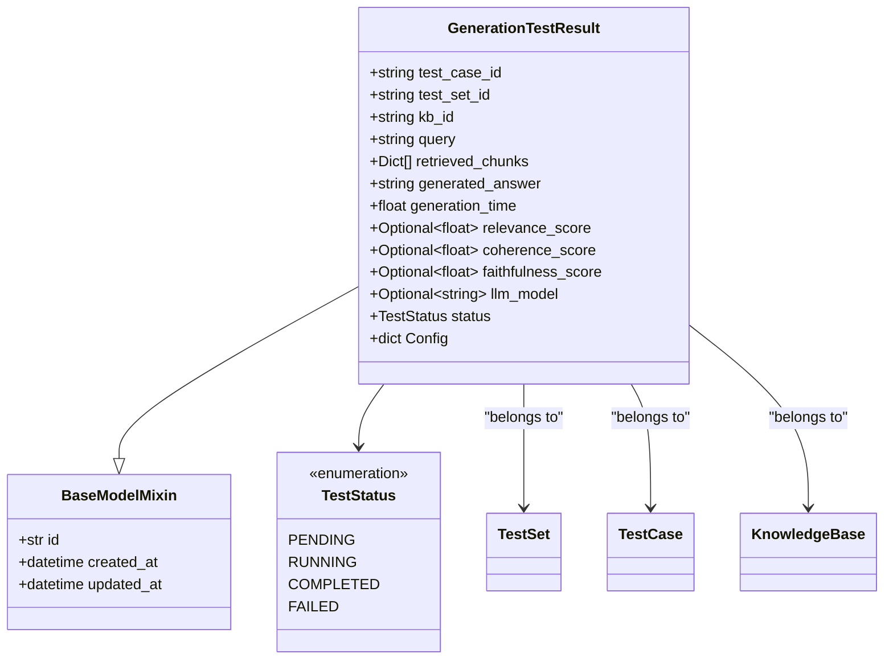
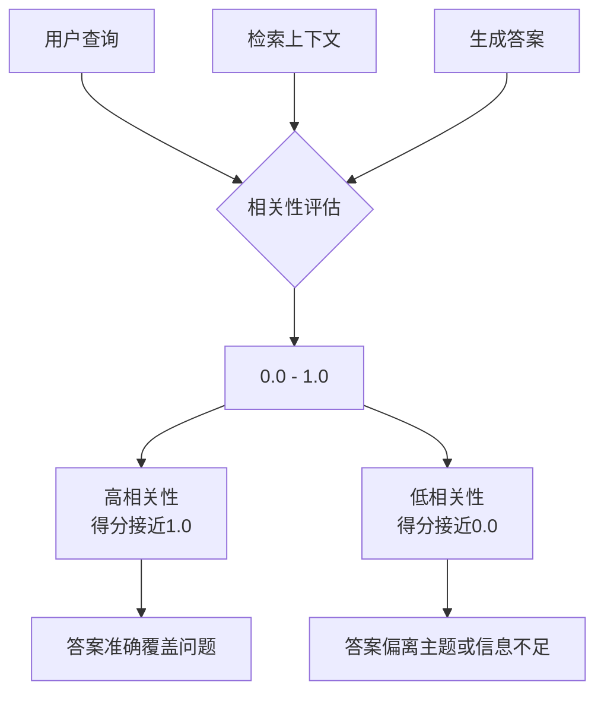
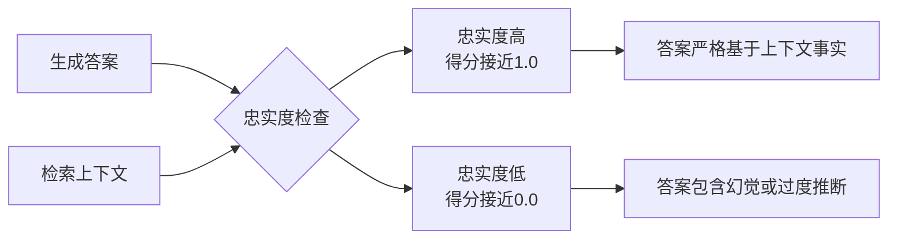
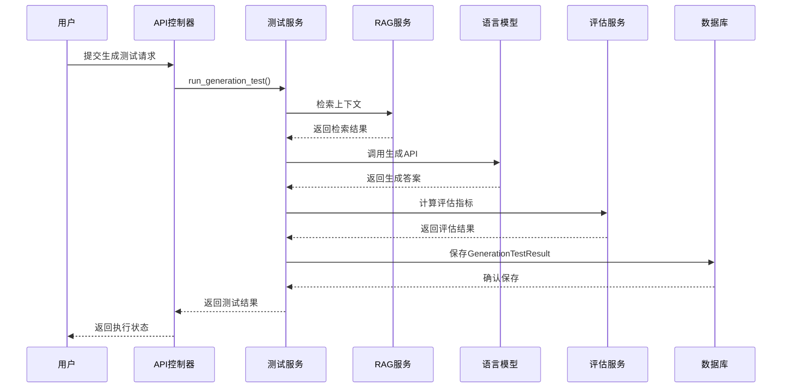
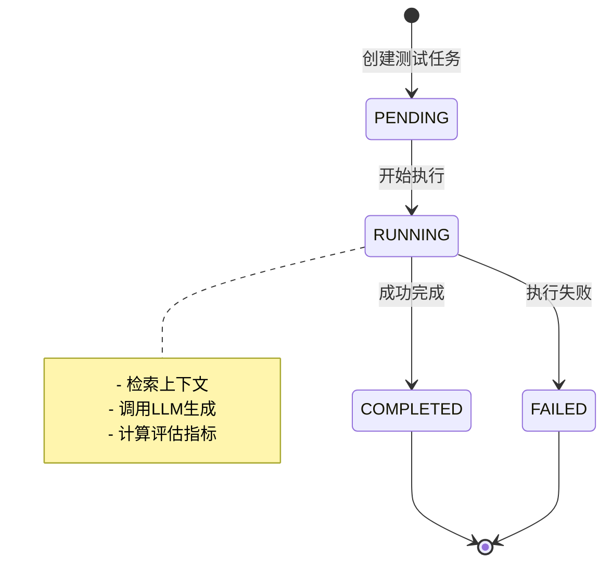
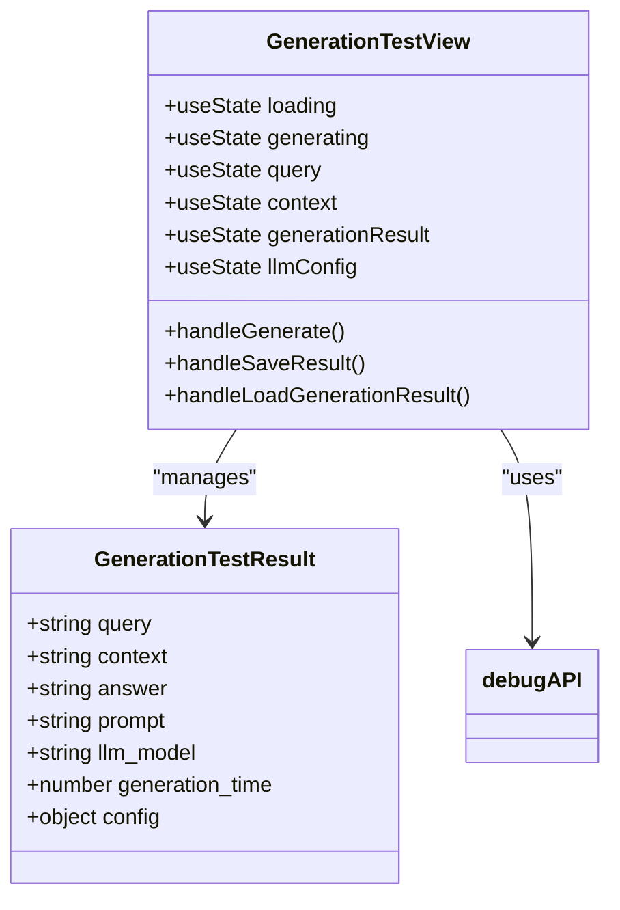

# 生成测试结果模型

<cite>
**本文档引用的文件**
- [test.py](file://backend/app/models/test.py)
- [schemas/test.py](file://backend/app/schemas/test.py)
- [test_service.py](file://backend/app/services/test_service.py)
- [test_management.py](file://backend/app/controllers/test_management.py)
- [generation-test.tsx](file://web/components/views/generation-test.tsx)
- [ragas_evaluation.py](file://backend/app/services/ragas_evaluation.py)
- [evaluation_task.py](file://backend/app/services/evaluation_task.py)
</cite>

## 目录
1. [简介](#简介)
2. [模型架构概览](#模型架构概览)
3. [核心字段详解](#核心字段详解)
4. [评估指标体系](#评估指标体系)
5. [数据流与生命周期](#数据流与生命周期)
6. [前后端交互](#前后端交互)
7. [性能考量](#性能考量)
8. [最佳实践指南](#最佳实践指南)
9. [故障排除](#故障排除)
10. [总结](#总结)

## 简介

GenerationTestResult模型是RAG Studio系统中用于记录和评估生成式问答测试结果的核心数据结构。该模型不仅存储了LLM生成的答案内容，还包含了完整的评估指标体系，为开发者提供了全面的生成质量分析能力。

该模型在RAG（检索增强生成）系统的测试流程中占据关键地位，通过量化的方式评估LLM在特定上下文下的表现，包括答案的相关性、连贯性和忠实度等多个维度。

## 模型架构概览



**图表来源**
- [test.py](file://backend/app/models/test.py#L163-L224)

**章节来源**
- [test.py](file://backend/app/models/test.py#L163-L224)

## 核心字段详解

### 基础标识字段

#### test_case_id
- **类型**: `string`
- **描述**: 测试用例唯一标识符
- **用途**: 建立与TestCase模型的关联关系
- **示例**: `"tc_001"`

#### test_set_id
- **类型**: `string`
- **描述**: 测试集唯一标识符
- **用途**: 组织和分类测试结果
- **示例**: `"ts_001"`

#### kb_id
- **类型**: `string`
- **描述**: 知识库唯一标识符
- **用途**: 关联到具体的向量数据库和嵌入模型配置
- **示例**: `"kb_001"`

### 测试输入字段

#### query
- **类型**: `string`
- **描述**: 用户查询问题
- **用途**: 记录原始测试问题，用于结果追溯和分析
- **示例**: `"Python中如何定义一个类？"`

#### retrieved_chunks
- **类型**: `List[Dict[str, Any]]`
- **描述**: 检索到的上下文分块
- **用途**: 存储RAG系统检索到的相关文档片段
- **结构**: 
  ```python
  [
      {
          "chunk_id": "chunk_001",
          "content": "Python类定义语法...",
          "score": 0.95,
          "metadata": {...}
      }
  ]
  ```

### 生成结果字段

#### generated_answer
- **类型**: `string`
- **描述**: LLM生成的回答内容
- **关键特性**: 
  - 存储最终的生成式回答
  - 包含对检索上下文的理解和整合
  - 是评估的主要对象
- **示例**: `"在Python中，使用class关键字定义类，语法如下：class ClassName:..."

#### generation_time
- **类型**: `float`
- **描述**: 生成耗时（秒）
- **关键作用**:
  - 衡量LLM响应性能
  - 用于系统优化和容量规划
  - 支持实时性能监控
- **测量范围**: 通常在0.1-30秒之间
- **精度**: 保留两位小数

### LLM配置字段

#### llm_model
- **类型**: `Optional[string]`
- **描述**: 使用的语言模型标识
- **重要性**: 
  - 支持结果复现
  - 便于不同模型间的对比分析
  - 用于实验管理和版本控制
- **示例**: `"qwen2:7b"`, `"deepseek-r1:1.5b"`

**章节来源**
- [test.py](file://backend/app/models/test.py#L164-L212)

## 评估指标体系

### relevance_score（相关性分数）



**图表来源**
- [test.py](file://backend/app/models/test.py#L184-L189)

- **范围**: 0.0 - 1.0
- **含义**: 衡量生成答案与原始查询的相关程度
- **计算方式**: 基于RAGAS框架的answer_relevancy指标
- **应用场景**:
  - 评估检索质量对生成效果的影响
  - 识别检索偏差导致的问题
  - 优化检索策略和提示词设计

### coherence_score（连贯性分数）

- **范围**: 0.0 - 1.0
- **含义**: 衡量生成答案内部的逻辑流畅性和一致性
- **评估维度**:
  - 句子间的逻辑连接
  - 概念的清晰表达
  - 整体论述的完整性
- **重要性**: 确保生成内容的可读性和专业性

### faithfulness_score（忠实度分数）



**图表来源**
- [test.py](file://backend/app/models/test.py#L197-L201)

- **范围**: 0.0 - 1.0
- **含义**: 衡量生成答案是否忠实于检索到的上下文
- **关键意义**: 
  - 防止LLM产生"幻觉"（hallucinations）
  - 确保信息的准确性
  - 支持事实核查和质量保证
- **计算方法**: 基于RAGAS框架的faithfulness指标

### 评估指标的语义关系

| 指标 | 权重 | 关键性 | 影响因素 |
|------|------|--------|----------|
| relevance_score | 高 | 核心 | 检索质量、提示词设计 |
| coherence_score | 中 | 重要 | LLM能力、上下文结构 |
| faithfulness_score | 高 | 关键 | 检索准确性、上下文质量 |

**章节来源**
- [test.py](file://backend/app/models/test.py#L184-L201)

## 数据流与生命周期

### 测试执行流程



**图表来源**
- [test_management.py](file://backend/app/controllers/test_management.py#L481-L498)
- [test_service.py](file://backend/app/services/test_service.py#L306-L323)

### 状态管理



**图表来源**
- [test.py](file://backend/app/models/test.py#L18-L23)

**章节来源**
- [test_management.py](file://backend/app/controllers/test_management.py#L481-L498)
- [test_service.py](file://backend/app/services/test_service.py#L306-L323)

## 前后端交互

### 后端API接口

#### 执行生成测试
- **端点**: `POST /tests/generation/run`
- **请求参数**:
  ```typescript
  interface RunGenerationTestRequest {
      test_case_id?: string;
      test_set_id?: string;
      llm_model?: string;
  }
  ```
- **响应**: 
  ```typescript
  interface ApiResponse {
      task_id: string;
      message: string;
  }
  ```

#### 获取测试结果
- **端点**: `GET /tests/generation/results`
- **查询参数**:
  - `test_set_id`: 必需，测试集ID
  - `page`: 可选，默认1
  - `page_size`: 可选，默认20，范围1-100

### 前端组件架构



**图表来源**
- [generation-test.tsx](file://web/components/views/generation-test.tsx#L1-L50)

### 结果展示组件

前端组件通过以下方式展示生成测试结果：

#### 问题展示
- 使用蓝色背景标识问题部分
- 支持问题的复制和分享功能

#### 上下文展示
- 使用紫色背景标识检索上下文
- 支持上下文内容的展开和折叠
- 截取显示前500字符，超出部分显示省略号

#### 答案展示
- 使用绿色背景标识生成答案
- 支持答案内容的滚动查看
- 提供答案的质量评分显示

#### 配置信息展示
- 显示使用的LLM模型
- 展示生成耗时
- 显示生成参数配置（温度、最大token数等）

**章节来源**
- [generation-test.tsx](file://web/components/views/generation-test.tsx#L403-L480)
- [test_management.py](file://backend/app/controllers/test_management.py#L501-L532)

## 性能考量

### generation_time的性能监控

generation_time字段在系统性能监控中具有关键作用：

#### 性能基准
- **理想范围**: 0.5-3.0秒
- **警告阈值**: >5.0秒
- **严重阈值**: >10.0秒

#### 性能优化策略
1. **模型选择优化**:
   - 小模型适合快速响应场景
   - 大模型适合高质量要求场景

2. **上下文长度控制**:
   - 优化检索top_k参数
   - 控制上下文的最大token数

3. **并发处理**:
   - 实现异步生成处理
   - 支持批量测试执行

### 评估指标的计算开销

#### RAGAS评估的性能影响
- **CPU密集型**: 评估指标计算需要大量CPU资源
- **内存需求**: 大规模评估需要较多内存
- **网络延迟**: LLM驱动的评估指标需要网络通信

#### 优化建议
- 使用本地部署的LLM减少网络延迟
- 实现评估结果的缓存机制
- 采用异步批处理模式

**章节来源**
- [test_service.py](file://backend/app/services/test_service.py#L328-L372)

## 最佳实践指南

### 生成测试的最佳实践

#### 1. 检索质量优化
- **top_k参数调优**: 根据具体场景调整检索数量
- **质量过滤**: 设置合适的相似度阈值
- **上下文精简**: 移除无关的检索结果

#### 2. 评估指标的应用
- **多维度评估**: 不要只关注单一指标
- **基线建立**: 为不同场景建立评估基线
- **趋势分析**: 持续跟踪评估指标的变化趋势

#### 3. 结果复现与对比
- **固定配置**: 在比较不同模型时使用相同的配置
- **样本标准化**: 使用一致的测试样本集
- **多次测试**: 对于关键指标进行多次测试取平均值

### 开发者指导

#### 1. 字段验证规则
- **generated_answer**: 确保非空且有意义
- **generation_time**: 合理范围内的数值
- **评估指标**: 0.0-1.0范围内的浮点数

#### 2. 错误处理
- **网络异常**: 处理LLM服务不可用的情况
- **超时处理**: 设置合理的生成超时时间
- **数据完整性**: 验证检索结果的完整性

#### 3. 性能优化
- **异步处理**: 使用异步模式提高并发性能
- **缓存策略**: 缓存频繁访问的检索结果
- **资源管理**: 合理管理LLM API调用配额

**章节来源**
- [test.py](file://backend/app/models/test.py#L180-L181)
- [test_service.py](file://backend/app/services/test_service.py#L306-L323)

## 故障排除

### 常见问题及解决方案

#### 1. 生成测试执行失败

**症状**: API返回错误或无响应
**可能原因**:
- LLM服务不可用
- 检索服务异常
- 参数配置错误

**解决步骤**:
1. 检查LLM服务状态
2. 验证知识库配置
3. 确认测试用例存在

#### 2. 评估指标缺失

**症状**: 生成结果中评估指标为null
**可能原因**:
- RAGAS框架未正确安装
- LLM驱动的指标计算失败
- 评估服务异常

**解决步骤**:
1. 检查RAGAS依赖安装
2. 验证LLM配置
3. 查看服务日志

#### 3. 性能问题

**症状**: generation_time过高
**可能原因**:
- 检索结果过多
- LLM模型过大
- 网络延迟

**优化方案**:
1. 减少top_k参数
2. 选择更小的模型
3. 使用本地部署

### 调试工具和技巧

#### 1. 日志分析
- 启用详细日志记录
- 监控关键性能指标
- 分析错误模式

#### 2. 性能监控
- 实时监控generation_time
- 跟踪评估指标变化
- 监控系统资源使用

#### 3. 结果验证
- 对比不同模型的输出
- 验证评估指标的一致性
- 检查数据完整性

**章节来源**
- [test_service.py](file://backend/app/services/test_service.py#L342-L373)

## 总结

GenerationTestResult模型作为RAG Studio系统的核心组件，通过其精心设计的数据结构和评估体系，为生成式问答系统的质量评估提供了全面而精确的解决方案。

### 关键优势

1. **完整性**: 涵盖了从输入到输出的完整测试流程
2. **可量化**: 提供多个维度的评估指标
3. **可追溯**: 通过关联字段支持结果溯源
4. **可扩展**: 支持多种LLM模型和评估方法

### 应用价值

- **质量保证**: 通过量化指标确保生成质量
- **性能监控**: 实时跟踪系统性能表现
- **持续改进**: 基于评估结果优化系统配置
- **决策支持**: 为模型选择和配置提供数据支撑

### 发展方向

随着RAG技术的不断发展，GenerationTestResult模型将在以下方面持续演进：

- **更多评估维度**: 引入新的评估指标
- **自动化优化**: 基于评估结果自动调整配置
- **实时评估**: 提供实时的生成质量反馈
- **跨平台支持**: 支持更多类型的LLM和服务提供商

通过深入理解和合理应用GenerationTestResult模型，开发者可以构建更加可靠和高效的RAG系统，为用户提供优质的生成式问答体验。