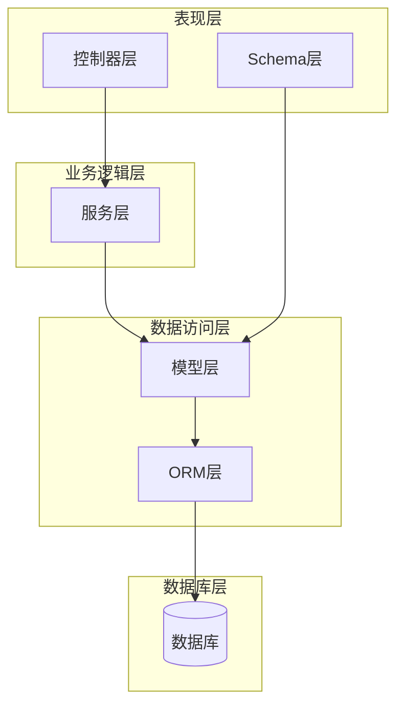
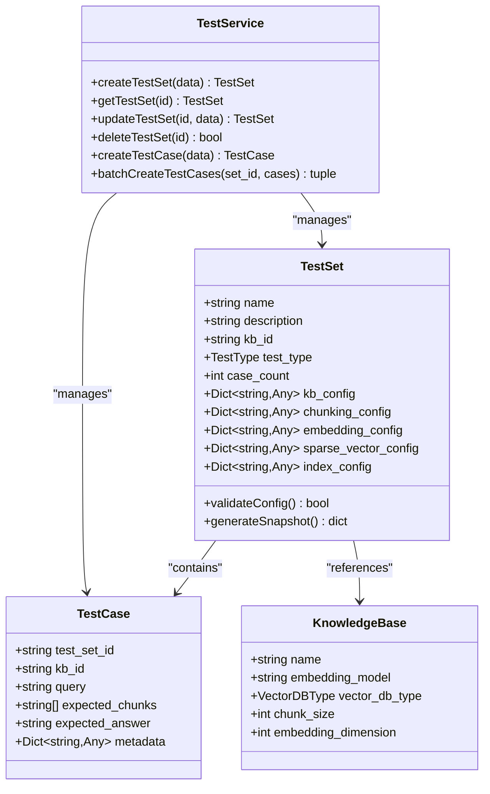
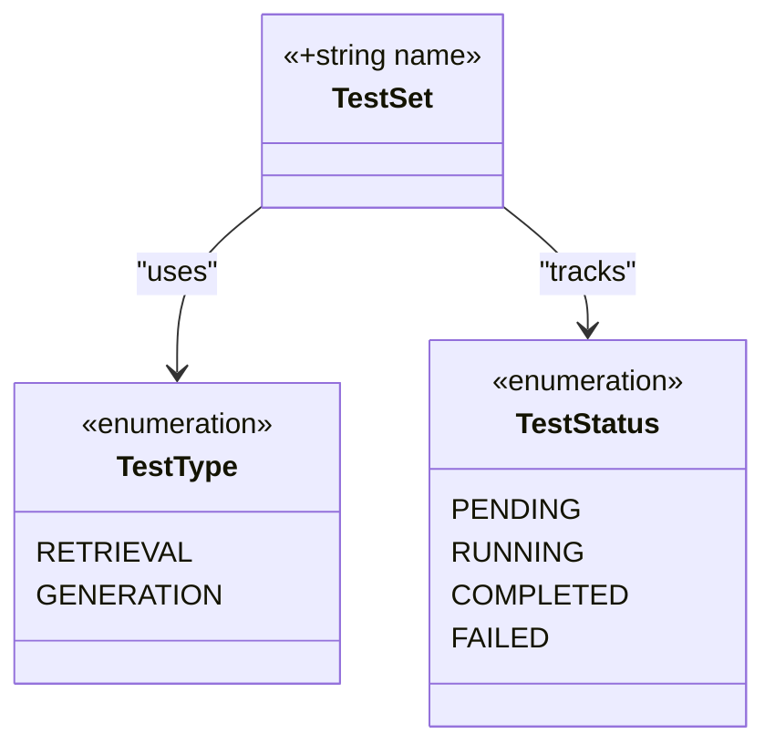
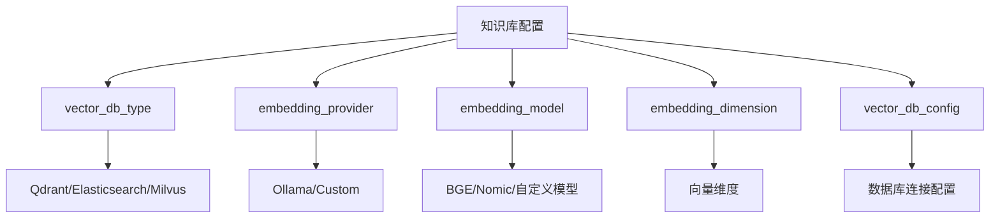
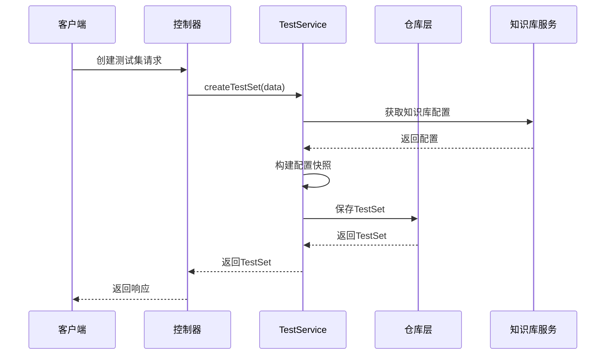
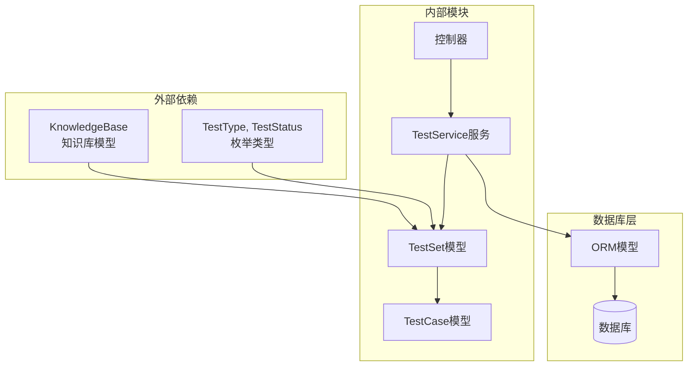

# 测试集模型

<cite>
**本文档中引用的文件**
- [backend/app/models/test.py](file://backend/app/models/test.py)
- [backend/app/schemas/test.py](file://backend/app/schemas/test.py)
- [backend/app/services/test_service.py](file://backend/app/services/test_service.py)
- [backend/app/controllers/test_management.py](file://backend/app/controllers/test_management.py)
- [backend/app/database/models.py](file://backend/app/database/models.py)
- [backend/app/models/knowledge_base.py](file://backend/app/models/knowledge_base.py)
- [backend/app/controllers/retriever_evaluation.py](file://backend/app/controllers/retriever_evaluation.py)
- [backend/example_t2ranking_usage.py](file://backend/example_t2ranking_usage.py)
</cite>

## 目录
1. [简介](#简介)
2. [项目结构](#项目结构)
3. [核心组件](#核心组件)
4. [架构概览](#架构概览)
5. [详细组件分析](#详细组件分析)
6. [依赖关系分析](#依赖关系分析)
7. [性能考虑](#性能考虑)
8. [故障排除指南](#故障排除指南)
9. [结论](#结论)

## 简介

TestSet模型是RAG Studio系统中用于管理测试环境的核心数据结构，它提供了完整的测试集生命周期管理功能。该模型不仅保存测试的基本信息，还包含了完整的配置快照机制，确保测试环境的可重现性和一致性。

TestSet模型的设计理念是围绕"测试即代码"的原则，通过保存测试执行时的所有关键配置参数，使得测试结果具有可追溯性和可重复性。这种设计特别适用于检索器评估和生成式问答系统的质量保证。

## 项目结构

RAG Studio的测试管理系统采用分层架构设计，主要包含以下核心模块：



**图表来源**
- [backend/app/controllers/test_management.py](file://backend/app/controllers/test_management.py#L1-L50)
- [backend/app/services/test_service.py](file://backend/app/services/test_service.py#L1-L50)
- [backend/app/models/test.py](file://backend/app/models/test.py#L1-L50)

**章节来源**
- [backend/app/controllers/test_management.py](file://backend/app/controllers/test_management.py#L1-L534)
- [backend/app/services/test_service.py](file://backend/app/services/test_service.py#L1-L374)

## 核心组件

TestSet模型包含以下核心字段和配置快照：

### 基础字段
- **name**: 测试集名称，必填，长度1-100字符
- **description**: 测试集描述，可选，长度不超过500字符
- **kb_id**: 关联的知识库ID，标识测试所基于的知识库
- **test_type**: 测试类型（retrieval或generation）
- **case_count**: 测试用例数量，自动统计

### 配置快照机制
TestSet模型的核心创新在于配置快照机制，它保存了测试执行时的所有关键配置：

- **kb_config**: 知识库配置快照，包含vector_db_type、embedding_provider、embedding_model等
- **chunking_config**: 分块策略配置，包含chunk_size、chunk_overlap、chunk_method等
- **embedding_config**: 嵌入模型参数配置，包含model、dimension、provider等
- **sparse_vector_config**: 稀疏向量配置，包含method（bm25/tf-idf/simple/splade）、k1、b等参数
- **index_config**: 索引配置，包含schema_fields、vector_db_config等

**章节来源**
- [backend/app/models/test.py](file://backend/app/models/test.py#L26-L80)
- [backend/app/schemas/test.py](file://backend/app/schemas/test.py#L11-L45)

## 架构概览

TestSet模型在整个系统架构中的位置和作用：



**图表来源**
- [backend/app/models/test.py](file://backend/app/models/test.py#L26-L227)
- [backend/app/models/knowledge_base.py](file://backend/app/models/knowledge_base.py#L25-L80)
- [backend/app/services/test_service.py](file://backend/app/services/test_service.py#L24-L374)

## 详细组件分析

### TestSet模型结构分析

TestSet模型采用了Pydantic的Field特性，提供了强大的验证和文档生成功能：



**图表来源**
- [backend/app/models/test.py](file://backend/app/models/test.py#L12-L24)
- [backend/app/models/test.py](file://backend/app/models/test.py#L26-L80)

### 配置快照机制详解

配置快照机制是TestSet模型的核心特性，它确保了测试环境的一致性和可重现性：

#### 知识库配置快照 (kb_config)


**图表来源**
- [backend/app/services/test_service.py](file://backend/app/services/test_service.py#L56-L62)

#### 分块策略配置 (chunking_config)
分块配置决定了文档如何被分割成适合检索的片段：

| 参数 | 类型 | 描述 | 默认值 |
|------|------|------|--------|
| method | string | 分块方法 | fixed_size |
| chunk_size | int | 分块大小（字符数） | 500 |
| chunk_overlap | int | 分块重叠（字符数） | 50 |
| separator | string | 分隔符 | "\n\n" |

#### 嵌入模型配置 (embedding_config)
嵌入模型配置定义了文本向量化的过程：

| 参数 | 类型 | 描述 | 示例值 |
|------|------|------|--------|
| provider | string | 提供商 | ollama/custom |
| model | string | 模型名称 | bge-m3:latest |
| dimension | int | 向量维度 | 768 |

#### 稀疏向量配置 (sparse_vector_config)
稀疏向量配置支持多种索引方法：

| 方法 | 描述 | 主要参数 |
|------|------|----------|
| bm25 | BM25算法 | k1, b |
| tf-idf | TF-IDF算法 | norm |
| simple | 简单词频 | - |
| splade | SPLADE模型 | - |

**章节来源**
- [backend/app/models/test.py](file://backend/app/models/test.py#L39-L58)

### TestService业务逻辑分析

TestService提供了完整的TestSet管理功能，包括创建、查询、更新和删除操作：



**图表来源**
- [backend/app/services/test_service.py](file://backend/app/services/test_service.py#L35-L89)
- [backend/app/controllers/test_management.py](file://backend/app/controllers/test_management.py#L32-L68)

### 测试用例管理

TestSet与TestCase之间存在一对多的关系，每个测试集可以包含多个测试用例：

```mermaid
flowchart LR
A[TestSet<br/>测试集] --> B[TestCase<br/>测试用例1]
A --> C[TestCase<br/>测试用例2]
A --> D[TestCase<br/>测试用例N]
B --> E[query: "问题1"]
B --> F[expected_chunks: ["doc1", "doc2"]]
B --> G[expected_answer: "答案1"]
C --> H[query: "问题2"]
C --> I[expected_chunks: ["doc3"]]
C --> J[expected_answer: "答案2"]
```

**图表来源**
- [backend/app/models/test.py](file://backend/app/models/test.py#L83-L113)

**章节来源**
- [backend/app/services/test_service.py](file://backend/app/services/test_service.py#L144-L222)
- [backend/app/controllers/test_management.py](file://backend/app/controllers/test_management.py#L243-L421)

## 依赖关系分析

TestSet模型与其他组件的依赖关系：



**图表来源**
- [backend/app/models/test.py](file://backend/app/models/test.py#L1-L20)
- [backend/app/database/models.py](file://backend/app/database/models.py#L23-L42)

### 与KnowledgeBase的关联

TestSet模型通过kb_id字段与KnowledgeBase建立关联，这种设计允许：

1. **配置继承**: 测试集可以从关联的知识库继承配置
2. **资源隔离**: 不同测试集可以使用不同的知识库
3. **版本控制**: 通过知识库版本控制测试环境变更

### 与TestCase的关联

TestSet与TestCase之间的一对多关系：

- **级联删除**: 删除测试集时自动删除所有关联的测试用例
- **统计更新**: 测试用例的增减自动更新测试集的case_count字段
- **权限控制**: 测试用例必须属于有效的测试集

**章节来源**
- [backend/app/services/test_service.py](file://backend/app/services/test_service.py#L128-L141)
- [backend/app/database/models.py](file://backend/app/database/models.py#L45-L58)

## 性能考虑

### 配置快照的存储优化

配置快照虽然提供了强大的可重现性，但也带来了存储开销：

1. **JSON序列化**: 配置数据以JSON格式存储，便于查询和修改
2. **选择性更新**: 只在必要时更新配置快照
3. **压缩存储**: 对大型配置进行压缩存储

### 查询性能优化

1. **索引策略**: 在kb_id和test_type字段上建立索引
2. **分页查询**: 支持大规模测试集的分页查询
3. **缓存机制**: 对频繁访问的配置进行缓存

### 批量操作优化

TestService提供了批量创建测试用例的功能，支持：

1. **事务处理**: 确保批量操作的原子性
2. **错误恢复**: 单个失败不影响整体操作
3. **进度跟踪**: 提供批量操作的进度反馈

## 故障排除指南

### 常见问题及解决方案

#### 1. 配置快照不完整
**问题**: 创建测试集时配置快照不完整
**原因**: 知识库配置获取失败
**解决方案**: 
- 检查知识库是否存在
- 验证知识库配置完整性
- 手动提供配置快照

#### 2. 测试用例数量统计错误
**问题**: case_count字段统计不准确
**原因**: 测试用例删除后未及时更新
**解决方案**:
- 手动调用update_test_set更新
- 检查删除操作的完整性

#### 3. 配置冲突
**问题**: 测试执行时配置与快照不一致
**原因**: 知识库配置被修改
**解决方案**:
- 使用配置快照而非实时配置
- 实施配置锁定机制

**章节来源**
- [backend/app/services/test_service.py](file://backend/app/services/test_service.py#L49-L82)
- [backend/app/services/test_service.py](file://backend/app/services/test_service.py#L262-L266)

## 结论

TestSet模型作为RAG Studio系统的核心组件，成功实现了测试环境的完整管理和配置快照机制。其设计特点包括：

### 主要优势
1. **可重现性**: 通过配置快照确保测试环境的一致性
2. **灵活性**: 支持多种测试类型和配置组合
3. **可扩展性**: 易于添加新的配置项和测试类型
4. **完整性**: 提供完整的测试生命周期管理

### 应用场景
1. **检索器评估**: 使用T2Ranking等标准数据集进行评估
2. **生成式问答**: 测试生成模型的质量和一致性
3. **A/B测试**: 对比不同配置的效果
4. **回归测试**: 确保系统变更不会影响现有功能

### 最佳实践
1. **定期备份**: 定期备份测试集配置
2. **版本控制**: 对重要的测试配置进行版本管理
3. **文档记录**: 为复杂的测试配置添加说明文档
4. **监控告警**: 监控测试执行状态和结果

TestSet模型的设计体现了现代软件工程的最佳实践，为RAG系统的质量保证提供了坚实的基础。随着系统的不断发展，该模型将继续演进以满足更复杂的应用需求。