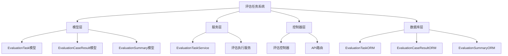
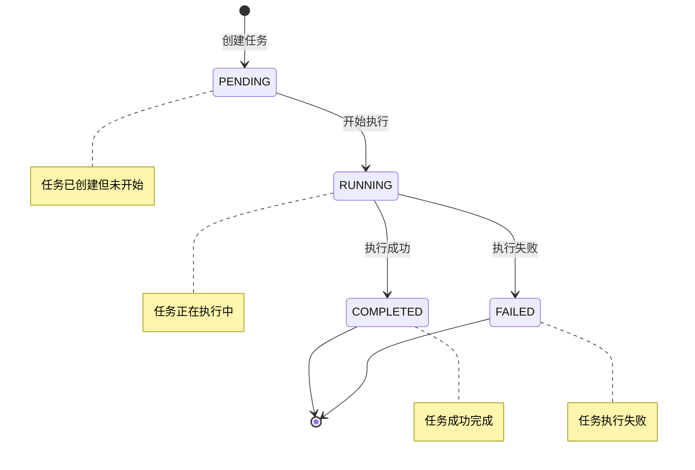
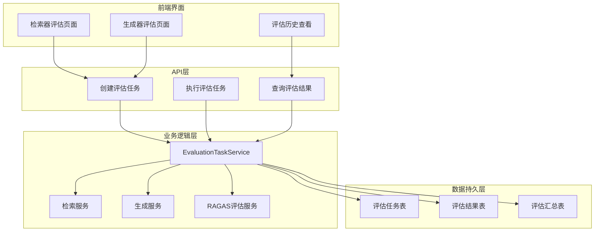
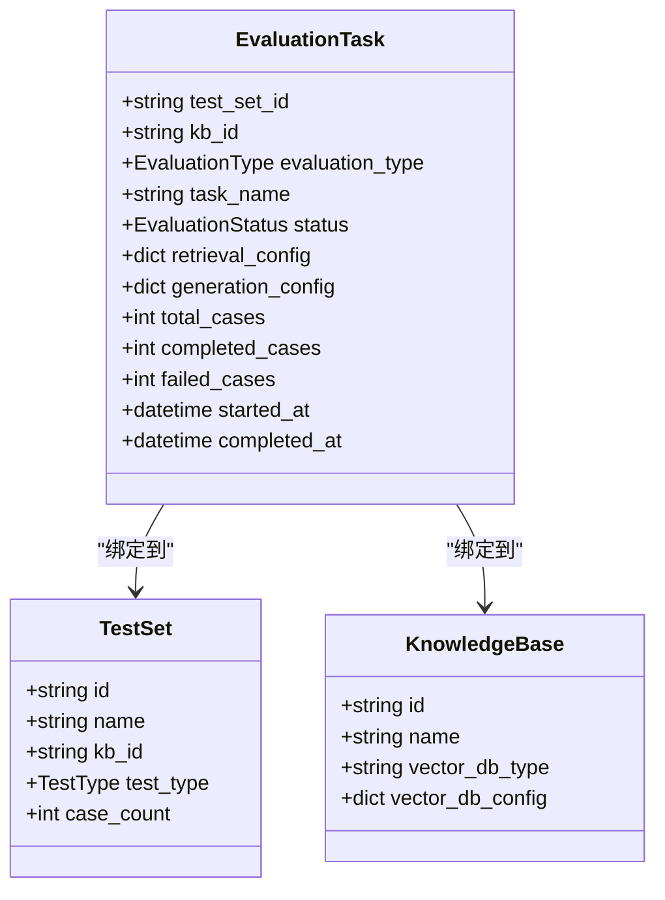
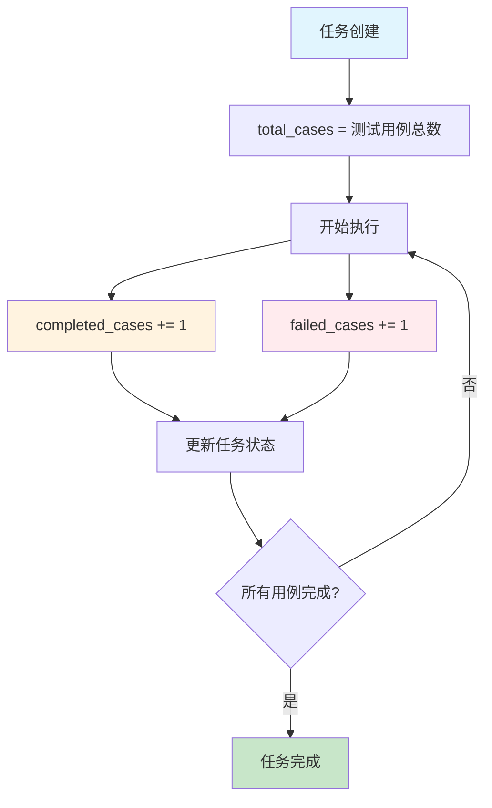
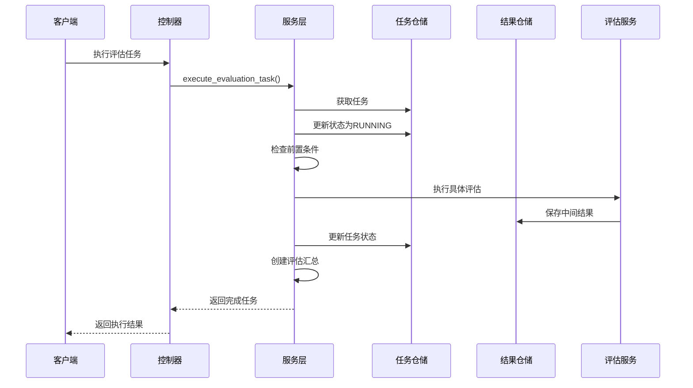
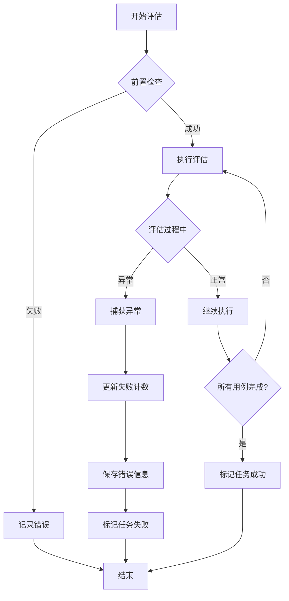
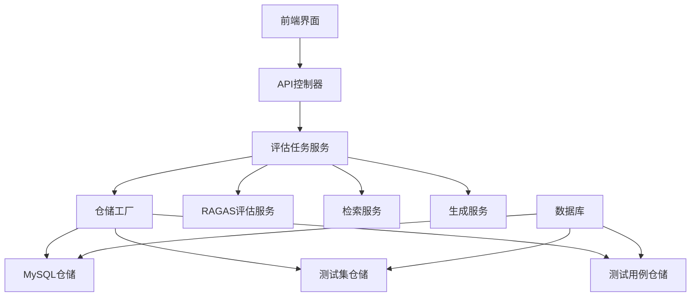

# 评估任务模型

<cite>
**本文档中引用的文件**
- [backend/app/models/evaluation.py](file://backend/app/models/evaluation.py)
- [backend/app/services/evaluation_task.py](file://backend/app/services/evaluation_task.py)
- [backend/app/controllers/evaluation.py](file://backend/app/controllers/evaluation.py)
- [backend/app/database/models.py](file://backend/app/database/models.py)
- [backend/migrations/001_create_evaluation_tables.py](file://backend/migrations/001_create_evaluation_tables.py)
- [backend/app/models/test.py](file://backend/app/models/test.py)
- [web/components/views/retriever-evaluation.tsx](file://web/components/views/retriever-evaluation.tsx)
- [web/components/views/generator-evaluation.tsx](file://web/components/views/generator-evaluation.tsx)
</cite>

## 目录
1. [简介](#简介)
2. [项目结构](#项目结构)
3. [核心组件](#核心组件)
4. [架构概览](#架构概览)
5. [详细组件分析](#详细组件分析)
6. [依赖关系分析](#依赖关系分析)
7. [性能考虑](#性能考虑)
8. [故障排除指南](#故障排除指南)
9. [结论](#结论)

## 简介

EvaluationTask模型是RAG Studio评估系统的核心执行单元，负责管理和协调检索器评估（retrieval）和生成器评估（generation）两种类型的评估任务。该模型通过严格的绑定机制确保评估任务与特定的测试集（test_set_id）、知识库（kb_id）和评估类型之间的正确关联，同时提供了完整的状态机控制、配置可定制性和进度监控功能。

## 项目结构

评估任务系统的文件组织遵循清晰的分层架构模式：



**图表来源**
- [backend/app/models/evaluation.py](file://backend/app/models/evaluation.py#L27-L179)
- [backend/app/services/evaluation_task.py](file://backend/app/services/evaluation_task.py#L26-L607)
- [backend/app/controllers/evaluation.py](file://backend/app/controllers/evaluation.py#L1-L335)

**章节来源**
- [backend/app/models/evaluation.py](file://backend/app/models/evaluation.py#L1-L179)
- [backend/app/services/evaluation_task.py](file://backend/app/services/evaluation_task.py#L1-L607)

## 核心组件

### 评估类型枚举（EvaluationType）

评估系统支持两种核心评估类型，每种类型对应不同的评估目标和执行流程：

| 评估类型 | 描述 | 主要指标 | 应用场景 |
|---------|------|----------|----------|
| RETRIEVAL | 检索器评估 | 精确率、召回率、F1分数、MRR、NDCG | 检索质量评估 |
| GENERATION | 生成器评估 | 忠实度、答案相关性、答案相似度 | 生成质量评估 |

### 任务状态机（EvaluationStatus）

评估任务采用严格的状态机管理模式，确保任务执行的可靠性和可追踪性：



**图表来源**
- [backend/app/models/evaluation.py](file://backend/app/models/evaluation.py#L19-L24)

**章节来源**
- [backend/app/models/evaluation.py](file://backend/app/models/evaluation.py#L13-L24)

## 架构概览

评估任务系统采用事件驱动的异步架构，支持大规模评估任务的并发执行和状态管理：



**图表来源**
- [backend/app/controllers/evaluation.py](file://backend/app/controllers/evaluation.py#L19-L335)
- [backend/app/services/evaluation_task.py](file://backend/app/services/evaluation_task.py#L26-L607)

## 详细组件分析

### EvaluationTask模型详解

EvaluationTask模型是评估系统的核心数据结构，包含了评估任务的所有关键信息：

#### 核心绑定机制



**图表来源**
- [backend/app/models/evaluation.py](file://backend/app/models/evaluation.py#L27-L56)
- [backend/app/models/test.py](file://backend/app/models/test.py#L26-L81)

#### 配置字段的可配置化设计

评估任务通过两个主要配置字段实现了高度的灵活性：

| 配置字段 | 类型 | 描述 | 示例配置项 |
|---------|------|------|-----------|
| retrieval_config | Dict[str, Any] | 检索配置 | top_k: 10, score_threshold: 0.7, fusion: "rrf" |
| generation_config | Dict[str, Any] | 生成配置 | llm_model: "deepseek-r1:1.5b", temperature: 0.7, prompt_template: "...", retrieval_config: {...} |

#### 统计字段的进度监控价值

评估任务通过三个关键统计字段提供实时进度监控：



**图表来源**
- [backend/app/services/evaluation_task.py](file://backend/app/services/evaluation_task.py#L258-L278)

#### 生命周期管理的时间戳

评估任务的生命周期通过两个时间戳字段进行精确管理：

| 时间戳字段 | 类型 | 用途 | 设置时机 |
|-----------|------|------|----------|
| started_at | Optional[datetime] | 记录任务开始时间 | 状态转为RUNNING时设置 |
| completed_at | Optional[datetime] | 记录任务完成时间 | 状态转为COMPLETED或FAILED时设置 |

**章节来源**
- [backend/app/models/evaluation.py](file://backend/app/models/evaluation.py#L27-L56)
- [backend/app/services/evaluation_task.py](file://backend/app/services/evaluation_task.py#L91-L177)

### 评估执行流程

#### 异步评估流程

评估任务的执行采用异步模式，支持长时间运行的评估操作：



**图表来源**
- [backend/app/services/evaluation_task.py](file://backend/app/services/evaluation_task.py#L91-L177)
- [backend/app/controllers/evaluation.py](file://backend/app/controllers/evaluation.py#L84-L121)

#### 容错处理机制

评估系统实现了多层次的容错处理机制：



**图表来源**
- [backend/app/services/evaluation_task.py](file://backend/app/services/evaluation_task.py#L171-L175)

**章节来源**
- [backend/app/services/evaluation_task.py](file://backend/app/services/evaluation_task.py#L91-L177)

### 与相关模型的聚合关系

#### EvaluationCaseResult聚合关系

评估任务与其用例结果之间存在一对多的关系：

```mermaid
erDiagram
EVALUATION_TASK {
string id PK
string test_set_id FK
string kb_id
enum evaluation_type
enum status
int total_cases
int completed_cases
int failed_cases
datetime started_at
datetime completed_at
}
EVALUATION_CASE_RESULT {
string id PK
string evaluation_task_id FK
string test_case_id FK
string query
enum status
text error_message
}
EVALUATION_SUMMARY {
string id PK
string evaluation_task_id FK UK
json overall_retrieval_metrics
json overall_ragas_retrieval_metrics
json overall_ragas_generation_metrics
float overall_ragas_score
}
EVALUATION_TASK ||--o{ EVALUATION_CASE_RESULT : "包含"
EVALUATION_TASK ||--|| EVALUATION_SUMMARY : "产生"
```

**图表来源**
- [backend/app/models/evaluation.py](file://backend/app/models/evaluation.py#L27-L179)
- [backend/app/database/models.py](file://backend/app/database/models.py#L61-L128)

#### 数据库ORM映射

评估任务的数据持久化通过ORM模型实现：

| ORM模型 | 表名 | 主要字段 | 约束条件 |
|---------|------|----------|----------|
| EvaluationTaskORM | evaluation_tasks | test_set_id, kb_id, evaluation_type, status | 外键约束，索引优化 |
| EvaluationCaseResultORM | evaluation_case_results | evaluation_task_id, test_case_id, status | 级联删除，唯一约束 |
| EvaluationSummaryORM | evaluation_summaries | evaluation_task_id | 唯一约束 |

**章节来源**
- [backend/app/database/models.py](file://backend/app/database/models.py#L61-L128)
- [backend/migrations/001_create_evaluation_tables.py](file://backend/migrations/001_create_evaluation_tables.py#L16-L44)

## 依赖关系分析

评估任务系统的依赖关系呈现清晰的分层结构：



**图表来源**
- [backend/app/services/evaluation_task.py](file://backend/app/services/evaluation_task.py#L29-L36)
- [backend/app/repositories/factory.py](file://backend/app/repositories/factory.py#L91-L114)

**章节来源**
- [backend/app/services/evaluation_task.py](file://backend/app/services/evaluation_task.py#L29-L36)

## 性能考虑

### 大规模评估的最佳实践

1. **分批处理策略**：对于大量测试用例，系统采用分批处理方式避免内存溢出
2. **异步执行**：评估任务采用异步模式，避免阻塞主线程
3. **连接池管理**：数据库连接使用连接池提高并发性能
4. **缓存机制**：频繁访问的数据采用缓存策略减少数据库压力

### 任务调度优化

评估任务的调度遵循以下原则：
- 优先级队列：高优先级任务优先执行
- 资源隔离：不同类型的评估任务使用独立的资源池
- 负载均衡：多实例部署时实现任务负载均衡

## 故障排除指南

### 常见问题及解决方案

| 问题类型 | 症状 | 可能原因 | 解决方案 |
|---------|------|----------|----------|
| 任务创建失败 | 404错误 | 测试集不存在 | 检查test_set_id的有效性 |
| 执行超时 | 任务卡在RUNNING状态 | 评估过程耗时过长 | 增加超时时间或优化评估配置 |
| 数据库连接失败 | SQL异常 | 数据库连接池耗尽 | 检查连接池配置和数据库状态 |
| 内存溢出 | 服务器崩溃 | 大量测试用例同时处理 | 启用分批处理模式 |

### 监控和日志

评估系统提供了完善的监控和日志功能：
- 任务状态实时监控
- 执行时间统计
- 错误信息记录
- 性能指标收集

**章节来源**
- [backend/app/services/evaluation_task.py](file://backend/app/services/evaluation_task.py#L171-L175)

## 结论

EvaluationTask模型作为RAG Studio评估系统的核心组件，通过精心设计的架构实现了评估任务的高效管理。其绑定机制确保了任务与测试集、知识库的正确关联，状态机控制保证了任务执行的可靠性，配置可定制化满足了不同评估场景的需求，而完善的统计和监控功能为大规模评估提供了有力支撑。

该模型的设计充分体现了现代软件架构的最佳实践，包括分层设计、依赖注入、异步处理和容错机制，为构建稳定可靠的评估系统奠定了坚实基础。随着系统的不断发展，这些设计原则将继续指导系统的演进和完善。