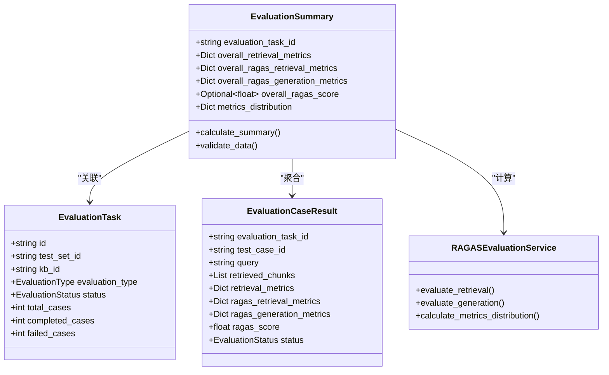
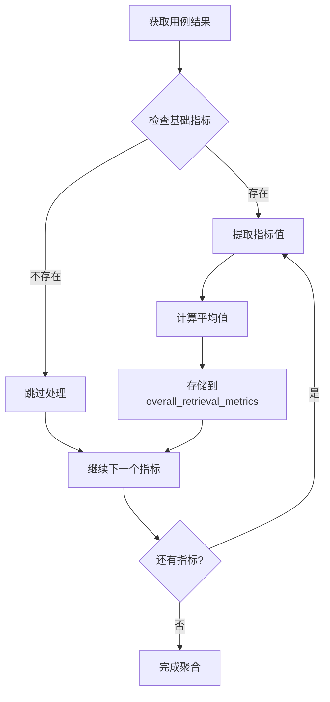
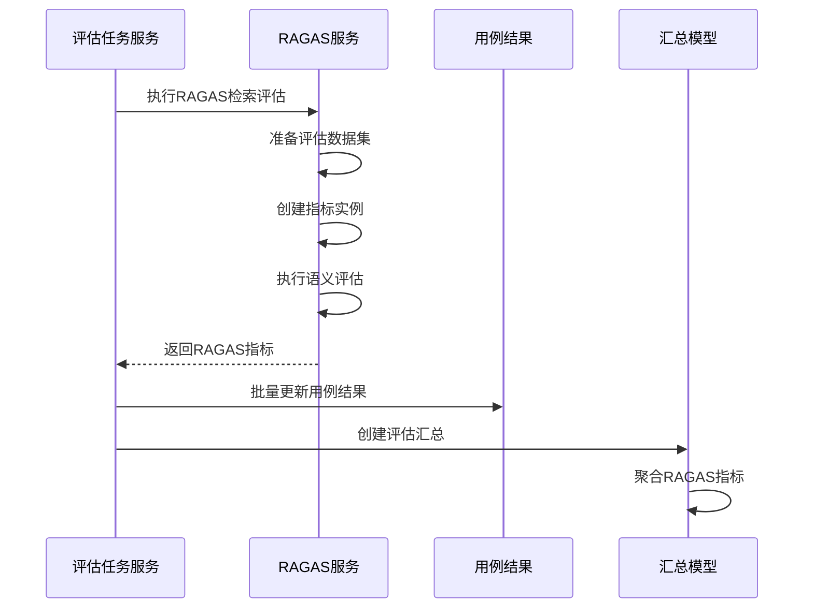
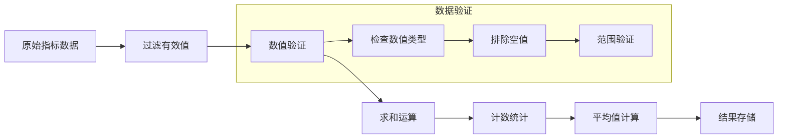
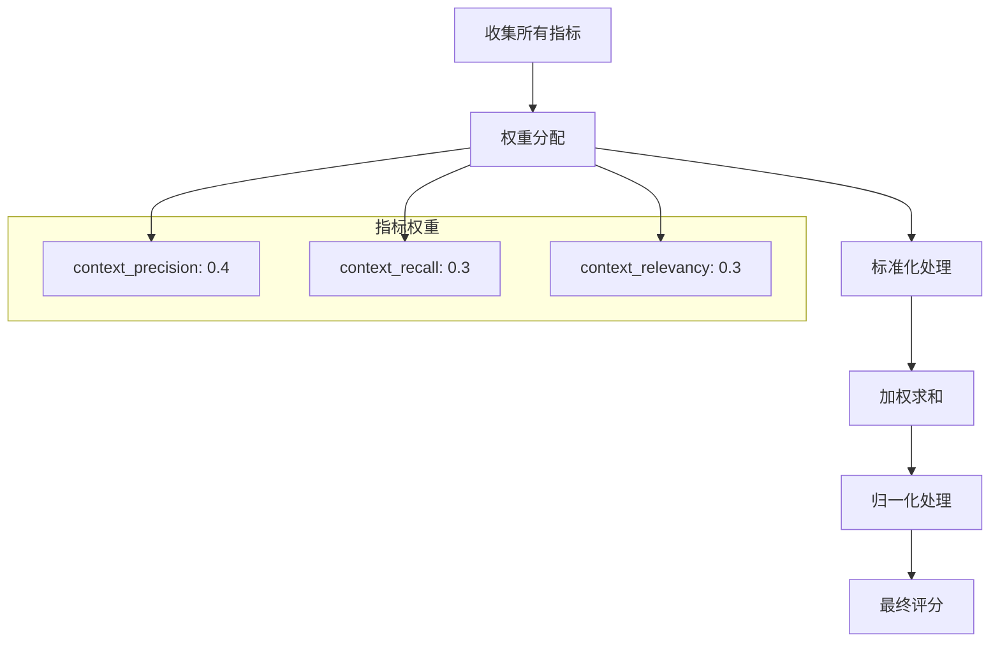
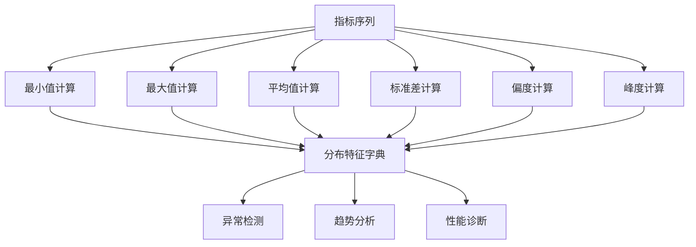
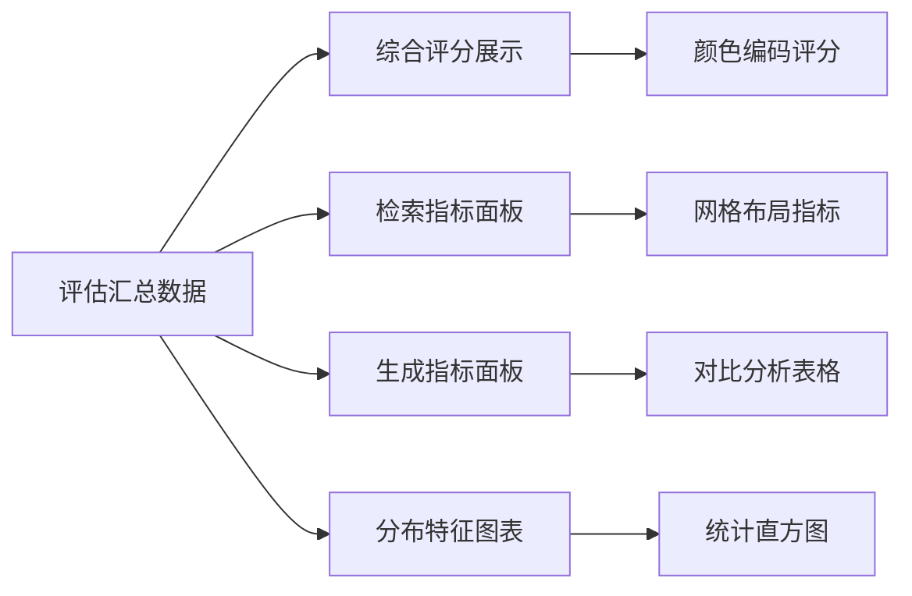
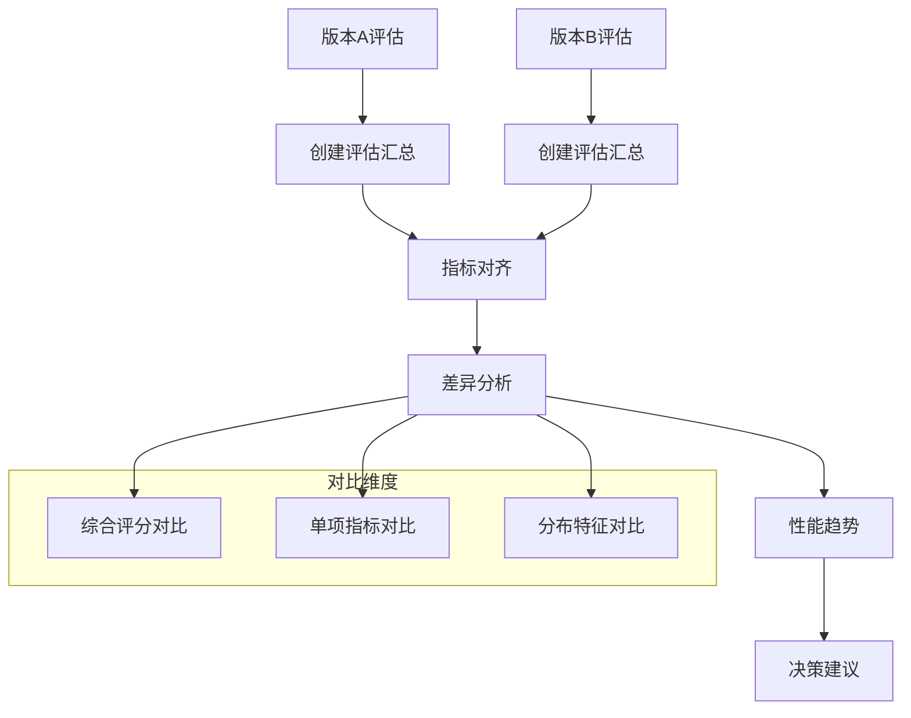
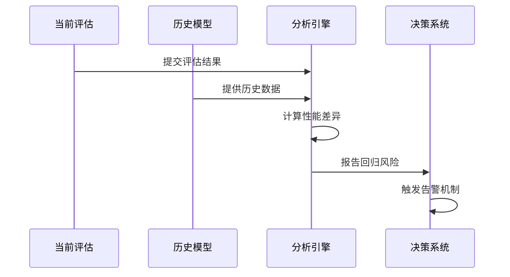

# 评估汇总模型

<cite>
**本文档引用的文件**
- [backend/app/models/evaluation.py](file://backend/app/models/evaluation.py)
- [backend/app/services/evaluation_task.py](file://backend/app/services/evaluation_task.py)
- [backend/app/services/ragas_evaluation.py](file://backend/app/services/ragas_evaluation.py)
- [web/components/views/evaluation-history.tsx](file://web/components/views/evaluation-history.tsx)
- [web/components/views/retriever-evaluation.tsx](file://web/components/views/retriever-evaluation.tsx)
- [web/components/views/generator-evaluation.tsx](file://web/components/views/generator-evaluation.tsx)
</cite>

## 目录
1. [简介](#简介)
2. [模型架构概览](#模型架构概览)
3. [核心组件分析](#核心组件分析)
4. [总体指标统计机制](#总体指标统计机制)
5. [RAGAS综合评分计算](#ragas综合评分计算)
6. [指标分布特征分析](#指标分布特征分析)
7. [前端评估报告视图](#前端评估报告视图)
8. [最佳实践方法论](#最佳实践方法论)
9. [性能优化建议](#性能优化建议)
10. [总结](#总结)

## 简介

评估汇总模型（EvaluationSummary）是RAG Studio评估系统的核心数据结构，作为评估任务最终产出的统一封装。该模型承载着整个评估过程的最终成果，通过聚合多个维度的指标数据，为用户提供全面的性能分析和决策支持。

评估汇总模型的设计理念围绕以下几个核心目标：
- **统一性**：将分散的评估结果整合为单一的汇总视图
- **完整性**：涵盖检索、生成等多个评估维度的指标
- **可分析性**：提供丰富的统计特征支持深度分析
- **实用性**：为模型选型和系统优化提供量化依据

## 模型架构概览

评估汇总模型采用分层架构设计，通过清晰的职责分离实现高效的指标聚合和展示。

**图表来源**
- [backend/app/models/evaluation.py](file://backend/app/models/evaluation.py#L132-L177)
- [backend/app/services/evaluation_task.py](file://backend/app/services/evaluation_task.py#L487-L552)

**章节来源**
- [backend/app/models/evaluation.py](file://backend/app/models/evaluation.py#L132-L177)

## 核心组件分析

### 整体检索指标（overall_retrieval_metrics）

整体检索指标负责统计基础检索评估的各项指标，包括精确率、召回率、F1分数等核心评估维度。

**图表来源**
- [backend/app/services/evaluation_task.py](file://backend/app/services/evaluation_task.py#L506-L515)

### RAGAS检索指标（overall_ragas_retrieval_metrics）

RAGAS检索指标专注于语义层面的评估，涵盖上下文精确度、召回率和相关性等高级指标。

**图表来源**
- [backend/app/services/evaluation_task.py](file://backend/app/services/evaluation_task.py#L280-L338)
- [backend/app/services/ragas_evaluation.py](file://backend/app/services/ragas_evaluation.py#L202-L379)

### RAGAS生成指标（overall_ragas_generation_metrics）

生成指标评估生成器的质量，包括忠实度、答案相关性和答案相似度等关键维度。

**章节来源**
- [backend/app/services/evaluation_task.py](file://backend/app/services/evaluation_task.py#L517-L529)
- [backend/app/services/ragas_evaluation.py](file://backend/app/services/ragas_evaluation.py#L388-L528)

## 总体指标统计机制

评估汇总模型的核心价值在于其统计聚合能力，通过科学的方法计算各项指标的总体表现。

### 平均值计算逻辑

**图表来源**
- [backend/app/services/evaluation_task.py](file://backend/app/services/evaluation_task.py#L506-L529)

### 指标选择策略

评估汇总模型采用智能的指标选择策略，确保统计结果的代表性和可靠性：

| 指标类型 | 选择条件 | 计算方法 | 应用场景 |
|---------|---------|---------|---------|
| 基础检索指标 | 存在且数值有效 | 算术平均 | 快速性能评估 |
| RAGAS检索指标 | RAGAS服务可用 | 权重平均 | 语义质量评估 |
| RAGAS生成指标 | 有参考答案时 | 综合评分 | 生成质量分析 |
| 综合评分 | 多指标可用 | 几何平均 | 整体性能评估 |

**章节来源**
- [backend/app/services/evaluation_task.py](file://backend/app/services/evaluation_task.py#L500-L552)

## RAGAS综合评分计算

RAGAS综合评分是评估汇总模型的核心输出，通过多维度指标的加权计算得出整体性能评分。

### 评分计算公式

**图表来源**
- [backend/app/services/evaluation_task.py](file://backend/app/services/evaluation_task.py#L531-L535)
- [backend/app/services/ragas_evaluation.py](file://backend/app/services/ragas_evaluation.py#L365-L367)

### 评分指导意义

RAGAS综合评分在模型选型过程中发挥关键作用：

1. **优先级排序**：高分模型优先考虑部署
2. **性能基准**：建立系统性能基线
3. **改进方向**：识别性能瓶颈领域
4. **回归检测**：监控模型性能变化

**章节来源**
- [backend/app/services/evaluation_task.py](file://backend/app/services/evaluation_task.py#L531-L535)

## 指标分布特征分析

metrics_distribution字段提供指标的统计分布特征，支持更深入的性能分析和异常检测。

### 分布特征计算

**图表来源**
- [backend/app/services/evaluation_task.py](file://backend/app/services/evaluation_task.py#L537-L539)

### 分布特征应用

| 特征指标 | 计算方法 | 分析价值 | 应用场景 |
|---------|---------|---------|---------|
| 最小值 | min(values) | 异常检测 | 性能下限分析 |
| 最大值 | max(values) | 极值分析 | 性能上限评估 |
| 标准差 | std(values) | 稳定性度量 | 性能一致性评估 |
| 偏度 | skewness(values) | 对称性分析 | 异常模式识别 |
| 峰度 | kurtosis(values) | 尖锐度分析 | 分布形态判断 |

**章节来源**
- [backend/app/services/evaluation_task.py](file://backend/app/services/evaluation_task.py#L537-L539)

## 前端评估报告视图

前端组件通过直观的可视化界面展示评估汇总结果，支持多维度的数据分析和交互操作。

### 评估汇总展示

**图表来源**
- [web/components/views/evaluation-history.tsx](file://web/components/views/evaluation-history.tsx#L284-L339)
- [web/components/views/retriever-evaluation.tsx](file://web/components/views/retriever-evaluation.tsx#L496-L542)

### 决策优化支持

前端视图通过多种交互方式支持决策优化：

1. **实时评分展示**：直观显示RAGAS综合评分
2. **指标对比分析**：支持不同模型间的性能对比
3. **趋势图表**：展示性能随时间的变化趋势
4. **异常标记**：突出显示性能异常的指标

**章节来源**
- [web/components/views/evaluation-history.tsx](file://web/components/views/evaluation-history.tsx#L284-L339)
- [web/components/views/retriever-evaluation.tsx](file://web/components/views/retriever-evaluation.tsx#L496-L542)

## 最佳实践方法论

基于评估汇总模型的特性，以下是推荐的最佳实践方法论：

### 跨版本对比策略

### 性能趋势分析

1. **时间序列分析**：跟踪评估指标随时间的变化
2. **模型迭代评估**：对比不同版本模型的性能提升
3. **配置参数调优**：分析不同配置对性能的影响
4. **数据集变化影响**：评估数据质量变化对性能的影响

### 回归检测机制

**章节来源**
- [backend/app/services/evaluation_task.py](file://backend/app/services/evaluation_task.py#L487-L552)

## 性能优化建议

为了充分发挥评估汇总模型的价值，建议采取以下性能优化措施：

### 数据聚合优化

1. **批量处理**：采用批量数据处理减少I/O开销
2. **缓存策略**：缓存频繁访问的评估结果
3. **异步计算**：使用异步处理提高并发性能
4. **内存管理**：优化大数据集的内存使用

### 前端渲染优化

1. **虚拟滚动**：处理大量评估结果的列表渲染
2. **懒加载**：按需加载详细的评估数据
3. **图表优化**：使用高效的数据可视化库
4. **状态管理**：优化React组件的状态更新

### 系统架构优化

1. **微服务拆分**：将评估服务独立部署
2. **负载均衡**：分布式处理大规模评估任务
3. **监控告警**：建立完善的性能监控体系
4. **容错机制**：确保评估过程的稳定性

## 总结

评估汇总模型作为RAG Studio评估系统的核心组件，通过科学的统计聚合方法和丰富的指标维度，为用户提供全面的性能分析工具。其设计充分体现了现代评估系统的需求：

- **完整性**：涵盖检索、生成等多个评估维度
- **准确性**：基于RAGAS框架的权威评估指标
- **实用性**：支持模型选型和系统优化决策
- **可扩展性**：适应不同的评估场景和需求

通过合理运用评估汇总模型，开发团队能够：
- 建立科学的模型评估体系
- 实现客观的性能对比分析
- 发现系统性能瓶颈和改进机会
- 支持数据驱动的决策制定

随着RAG技术的不断发展，评估汇总模型将继续演进，为构建更智能、更可靠的检索增强生成系统提供坚实的基础支撑。